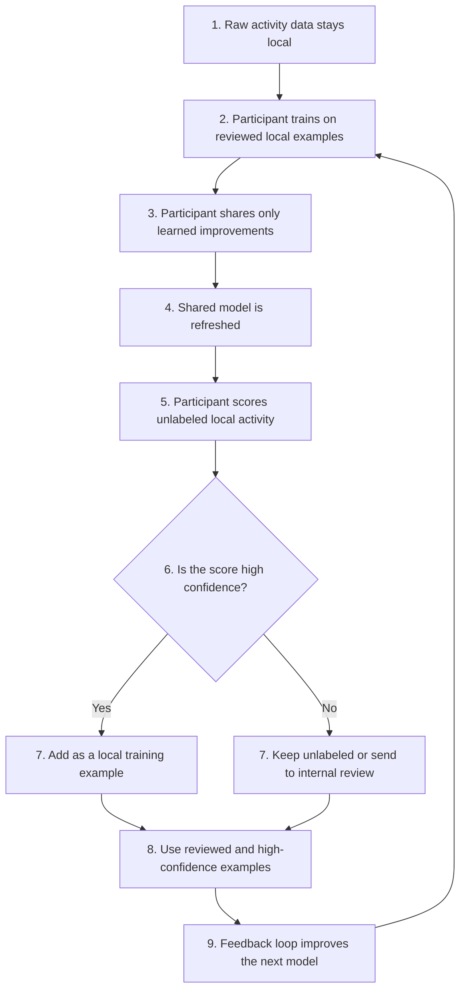

# **Canton Intelligence Framework**

**Author:** T-RIZE GROUP  
**Status**: Draft  
**Created**: 2026-06-4  
**Label**: financial-workflows-composability  
**Champion**: T-RIZE

## **Abstract**

Financial markets are entering a high-velocity, AI-mediated phase where automated agents, bots, and algorithmic participants can move capital, execute trades, and coordinate activity faster than legacy monitoring systems can respond. In this environment, fraud, wash trading, market manipulation, and operational risk become network-level problems that no single venue, custodian, validator, or issuer can see in full.

Two forces compound this shift. As agentic trading and automated financial workflows become more common, they increase the accessibility and frequency of market activity, driving transaction velocity higher across Canton-based markets. At the same time, growing Canton adoption brings more participants, assets, venues, and value onto the network, widening the surface that must be monitored. Together, more activity moving faster across a larger network creates new opportunities for liquidity, efficiency, and participation, but it also compresses the detection window for fraud, manipulation, false liquidity, and coordinated abuse. The same automation that improves market efficiency can also accelerate abusive strategies, requiring adaptive intelligence that can distinguish productive automation from inorganic or manipulative activity.

The core constraint is that the data required to detect these patterns remains fragmented across institutions and cannot be centralized due to privacy, regulatory, contractual, and competitive constraints.

The Canton Intelligence Framework introduces an open-source, privacy-preserving network capability that enables Canton participants to collaboratively create, govern, deploy, and improve machine learning models without exposing their underlying datasets. Because Canton already provides privacy-preserving, multi-party coordination for regulated financial workflows, it is a natural coordination layer for governing shared intelligence without centralizing sensitive data. In effect, the framework turns fragmented private signals into shared, governed intelligence without requiring participants to expose the data that gives those signals value.

The lead use case is market integrity: detecting inorganic activity, wash trading, circular flows, and coordinated behavior that may only become visible when private signals from multiple participants are learned from collectively. Market integrity is the first application, but the framework is designed as reusable intelligence capability for any Canton workflow where predictive models improve as more participants contribute private signals, including risk management, compliance, underwriting, valuation, litigation finance, and continuous asset monitoring.

Participants gain better detection, better risk scoring, stronger compliance workflows, and more reliable market signals without exposing customer data, trading records, wallet activity, or proprietary review outcomes, while configurable incentive mechanisms can reward useful contributions and support potential revenue sharing from customer inference. The result is a reusable capability that expands Canton from a network for coordinating assets and workflows into a network for coordinating trusted intelligence across institutions.

## **Motivation**

Markets are becoming automated, programmable, and increasingly AI-mediated. Agentic trading systems, automated financial workflows, and algorithmic market participants can now observe conditions, adapt strategies, move assets, and coordinate activity at machine speed.

This shift is positive for Canton-based markets. It can increase liquidity, efficiency, access, and market participation. It also changes the risk profile of the network because the same automation that improves execution can accelerate fraud, manipulation, false liquidity, operational errors, and coordinated abuse.

As agentic trading and automated financial workflows become more common, transaction velocity will increase across Canton-based markets. Decisions, trades, settlements, and coordinated actions can happen faster than manual review processes or institution-specific monitoring systems can respond.

Risk detection therefore becomes a network-level intelligence problem. A venue may see order-book behavior, a custodian may see wallet movement, a validator may see operational patterns, an issuer may see asset-specific flows, and a compliance provider may see links to entities already under review. No single participant has the complete signal.

At the same time, the data required to improve these systems cannot simply be centralized. Customer activity, trading records, wallet information, settlement data, internal review outcomes, and proprietary risk labels are constrained by regulation, contract, privacy obligations, and competitive boundaries.

The Canton Intelligence Framework addresses this coordination problem through privacy-preserving collaborative machine learning. Participants can improve shared models from private signals while retaining control over their own data, governance obligations, and operational environments.

The purpose of the Canton Intelligence Framework is to close this gap: enabling participants to learn from network-wide patterns while preserving institutional privacy, regulatory boundaries, and control over proprietary data.

## **Motivation**

Canton-based markets are emerging at the same time as AI agents, automated trading systems, and programmable financial workflows are becoming mainstream. This convergence will increase the speed at which assets move, strategies adapt, and coordinated behaviors emerge. Agentic trading and growing Canton adoption scale the same threat from two directions: automation increases the accessibility and frequency of activity, while broader adoption brings more participants, assets, and value onto the network. The result is more activity, moving faster, across a larger surface.

The harder challenge is not speed alone, but composability. Canton lets assets, workflows, and products interoperate, so activity can flow across venues, custodians, settlement, and applications in combinations that no single product was designed to oversee. Rule-based monitoring struggles here: static thresholds and hand-written rules cannot anticipate every composed pathway or keep pace with adaptive, increasingly sophisticated strategies that shift behavior to stay under each rule. Detecting these patterns requires adaptive models that learn from activity across products rather than fixed rules applied to one product in isolation. In high-velocity markets, delayed or evaded detection can mean that manipulation, false liquidity, or suspicious activity has already propagated through the network before any single participant can respond.

| Current State | With the Canton Intelligence Framework |
| --- | --- |
| Participants monitor risk using isolated data | Participants improve models from collective patterns without sharing raw data |
| Fraud and manipulation exploit gaps between institutions | Network-level learning reduces blind spots across venues, custodians, validators, and issuers |
| Detection is delayed, manual, and reactive | Detection becomes earlier, adaptive, and more scalable |
| Private risk signals remain underused | Private signals become useful model contributions while remaining protected |
| Market integrity depends on fragmented controls | Market integrity becomes a shared network capability |

Market integrity is the first application, but the same capability can support any Canton workflow where predictive models improve as more participants contribute private signals. This includes litigation finance, underwriting, valuation, compliance, portfolio risk, and continuous asset monitoring.

Market integrity is the most immediate use case because it directly affects liquidity quality, institutional trust, and the credibility of Canton-based markets.

### **Lead Use Case: Market Integrity and Inorganic Activity Detection**

Market integrity is the initial focus because it is a network-level problem. Inorganic activity, circular trading, coordinated behavior, and anomalous settlement patterns can damage trust in Canton-based markets even when no single participant has enough information to identify the full pattern independently.

Venues, custodians, validators, wallet providers, settlement participants, and compliance providers each observe different parts of the same activity. A trading venue may see order-book behavior, a custodian may see wallet movements, a validator may see operational patterns, and another participant may see links to entities already under review.

Through privacy-preserving machine learning, these participants can collaboratively train models that benefit from the collective experience of the network without revealing sensitive customer information, order history, wallet activity, internal investigations, or proprietary datasets.

Knowledge gained by one participant can improve the quality of the shared model while preserving privacy, maintaining regulatory boundaries, and improving market quality for the broader ecosystem.

#### **Scenario**

A group of institutional accounts or wallets artificially creates volume on a trading pair, for example **USDCx / Canton Coin**.

They place and execute orders among themselves to create the impression that there is more liquidity or genuine market interest than actually exists.

A trading venue can observe patterns in its order book, but it cannot always know whether the entities behind the accounts are linked elsewhere. A custodian or wallet provider may see asset movements between wallets. Another participant may see settlement flows or connections to entities that are already considered risky.

No single participant has the full truth, but each one has part of the signal.

#### **Data on the Trading Venue's Side**

The trading venue naturally stores order flow data for its operations.

Local table: `orders`

| order_id | account_hash | pair | side | price | quantity | timestamp | status |
| --- | --- | --- | --- | --- | --- | --- | --- |
| O-001 | A91F | USDCx-CC | buy | 0.0841 | 250,000 | 10:00:01 | filled |
| O-002 | B72K | USDCx-CC | sell | 0.0841 | 250,000 | 10:00:03 | filled |
| O-003 | A91F | USDCx-CC | sell | 0.0840 | 248,000 | 10:03:10 | filled |
| O-004 | B72K | USDCx-CC | buy | 0.0840 | 248,000 | 10:03:12 | filled |
| O-005 | C44P | USDCx-CC | buy | 0.0839 | 2,000,000 | 10:04:01 | cancelled |

#### **Local Features Computed by the Trading Venue**

The trading venue transforms this data into statistical signals. The features below are illustrative examples; a production deployment would typically include a broader feature set to capture more complex patterns.
Table: `local_features_by_account_pair_day`

| account_hash | pair | date | trade_volume | cancel_rate | self_cross_score | round_trip_score | avg_time_to_cancel_sec | activity_risk_label |
| --- | --- | --- | --- | --- | --- | --- | --- | --- |
| A91F | USDCx-CC | 2026-06-18 | 12,400,000 | 0.08 | 0.72 | 0.88 | 42 | 1 |
| B72K | USDCx-CC | 2026-06-18 | 11,900,000 | 0.11 | 0.69 | 0.84 | 51 | 1 |
| C44P | USDCx-CC | 2026-06-18 | 1,800,000 | 0.94 | 0.12 | 0.20 | 3 | 1 |
| D18M | USDCx-CC | 2026-06-18 | 340,000 | 0.17 | 0.04 | 0.08 | 120 | 0 |

These local features could include the following non-exhaustive list:

| Feature | Definition | Signal |
| --- | --- | --- |
| `self_cross_score` | How often accounts appear to trade with closely related accounts. | Related-party activity |
| `round_trip_score` | How often positions move out and back quickly with little net exposure. | Circular trading behavior |
| `cancel_rate` | Share of placed orders that are cancelled. | Order-book quality |
| `avg_time_to_cancel_sec` | Average time between placing and cancelling an order. | Short-lived order patterns |
| `activity_risk_label` | Local review label or score assigned by internal monitoring or compliance review. | Reviewed activity risk |

#### **Human Guided Training**

This use case is a strong fit for semi-supervised learning because reviewed labels are valuable, limited, and unevenly distributed across participants.

Each participant improves the model using its own reviewed examples, while keeping its raw activity data private. The shared model then helps each participant score unlabeled activity in its own environment.

High-confidence scores become new local training examples. Lower-confidence cases remain unlabeled or go to internal review. This lets each participant expand its useful training set without sharing raw data, order history, wallet activity, or review outcomes.

The result is a privacy-preserving feedback loop: the shared model gets better, and each participant becomes better at interpreting its own private signals.

#### **Why This Matters**

This case matters because the same activity pattern can appear differently depending on where an institution sits in the market.

A trading venue sees order-book behavior. A custodian sees wallet movements and asset flows. Another venue may see similar activity on a different pair. A settlement participant may see timing patterns, failed settlements, or links to entities that are already under review.

Each actor has a partial view, but they share the same operational need: identifying inorganic market activity earlier and with more confidence. Cooperation creates a transfer learning effect across roles. Patterns learned from one participant’s private signal can improve how another participant interprets its own private signal, without either side exposing the underlying data.

| Actor | Private signal | Shared learning benefit |
| --- | --- | --- |
| Trading venue | Order placement, cancellations, fills, counterparties, and price impact | Better interpretation of local order-book patterns |
| Custodian or wallet provider | Deposits, withdrawals, wallet relationships, and asset movements | Better recognition of circular or coordinated flow patterns |
| Other venue | Similar activity across other pairs or markets | Better recognition of repeated behavior across venues |
| Settlement participant | Settlement timing, anomalies, and operational links | Better recognition of activity that creates downstream risk |

The business message is clear: participants improve their own monitoring by learning from the experience of others, while raw orders, wallet activity, settlement records, and internal review outcomes remain private.

Example improvement:

| Model | Precision | Recall | False positives |
| --- | --- | --- | --- |
| Trading venue only | 82% | 48% | Medium |
| Custodian only | 76% | 41% | Low |
| Other venue only | 79% | 45% | Medium |
| Shared model | 85% | 71% | Medium-low |

For a trading venue, the benefit is practical:

* less inorganic market activity;
* better market quality;
* more institutional trust;
* stronger compliance monitoring;
* better reputation with market makers, custodians, and partners;
* higher-quality data sold or shared through providers such as Kaiko.

#### **Expected Operational Progression**

In production, the value of this approach should appear progressively as participants contribute reviewed examples and reuse the improved model inside their own environments.

##### **Day 1**

A trading venue may observe two accounts, A91F and B72K, generating 12M of volume on USDCx-CC.

The venue observes high volume, repeated trading between the same accounts, short round trips, and low real price impact. Its local model produces an elevated score, but not enough confidence to take action without review.

| Actor | `trade_volume` | `cancel_rate` | `round_trip_score` | `self_cross_score` | `reciprocal_volume_pct` | `avg_net_flow` | `label` | `pseudo_label` | `review_status` |
| --- | --- | --- | --- | --- | --- | --- | --- | --- | --- |
| Trading venue | 12,400,000 | 0.08 | 0.88 | 0.72 | 0.61 | Near zero | n/a | 0.64 | Unreviewed |

##### **Day 2**

A custodian and another venue train on their own reviewed examples. They do not share wallet movements, settlement details, or venue-specific activity records, but their learning improves the shared model.

The trading venue uses the refreshed model to rescore its own unlabeled activity. The same local case now receives a higher score and is routed to internal review.

| Actor | `trade_volume` | `cancel_rate` | `round_trip_score` | `self_cross_score` | `reciprocal_volume_pct` | `avg_net_flow` | `label` | `pseudo_label` | `review_status` |
| --- | --- | --- | --- | --- | --- | --- | --- | --- | --- |
| Trading venue | 12,400,000 | 0.08 | 0.88 | 0.72 | 0.61 | Near zero | n/a | 0.78 | Unreviewed |
| Custodian or wallet provider | 5,000,000 | n/a | 0.81 | 0.67 | 0.74 | Near zero | 1 | n/a | Reviewed |
| Other venue | 4,600,000 | 0.12 | 0.76 | 0.58 | 0.69 | Low | 1 | n/a | Reviewed |

##### **Day 3**

After review, the venue keeps the result as a local training example. In the next feedback loop, similar cases are identified earlier and with more confidence.

| Actor | `trade_volume` | `cancel_rate` | `round_trip_score` | `self_cross_score` | `reciprocal_volume_pct` | `avg_net_flow` | `label` | `pseudo_label` | `review_status` |
| --- | --- | --- | --- | --- | --- | --- | --- | --- | --- |
| Trading venue | 12,400,000 | 0.08 | 0.88 | 0.72 | 0.61 | Near zero | 1 | 0.91 | Reviewed |

The improvement does not come from receiving another participant’s private data. It comes from the shared model learning how different private signals relate to the same type of market activity, then helping each participant interpret its own data more effectively.

### **Additional Use Case: Litigation Finance**

Litigation finance is fundamentally a data-driven business. Capital allocation decisions depend on estimating case duration, probability of success, expected recovery values, and portfolio risk.

T-RIZE is already involved in bringing litigation-finance assets onto Canton through institutional digital issuance programs backed by litigation receivables. While individual firms possess historical case data that can improve these predictions, that information remains fragmented across independent organizations and cannot be centralized due to confidentiality requirements, competitive concerns, and legal obligations.

The same network capability used for market integrity can support collaborative valuation, underwriting, and portfolio risk models for litigation-finance assets. Participants can improve shared models using private case histories and review outcomes while retaining control over confidential data and enabling incentive mechanisms for useful contributions.

### **Canton Needs Intelligence**

By investing in this capability, Canton can unlock a new category of network activity where organizations collaborate not only through the exchange of assets, but through the creation of intelligence. This expands the range of applications that can be built on Canton and positions the network for a future where artificial intelligence is a core component of financial infrastructure.

This need is already visible among Canton ecosystem infrastructure providers. T-RIZE has received significant interest in this technology from MPCH, a cybersecurity technology company that builds governed signing, recovery, validator, and key-management infrastructure for regulated blockchain ecosystems, institutional digital asset platforms, and high-security environments. MPCH operates close to Canton network infrastructure, institutional validator environments, regulated settlement platforms, and AI governance workflows, making its interest an early validation signal for privacy-preserving intelligence that can support monitoring, governance, compliance, and operational decision-making.

## **Specification**

### **Objective**

Develop an open-source Federated Learning framework that enables organizations on Canton to collaboratively create, govern, deploy, improve, and monetize machine learning models as a reusable network capability while ensuring:

* Raw data never leaves its source environment  
* Participants retain ownership and control of their information  
* Participants decide how much resources to allocate to training  
* Training activities are auditable and governed  
* Contributions can be measured and rewarded  
* Model usage and customer inference can support sustainability mechanisms  
* Regulatory and privacy requirements are maintained  
* Organisations can select their preferred models and fine tune them

The framework introduces a new ecosystem primitive: **Coordinated Intelligence**.

Just as Canton enables organizations to coordinate complex financial workflows without a single point of failure, the proposed framework enables organizations to coordinate intelligence without centralizing data or relying on a single operator to control access to model development, governance, or economic participation.

#### **Ecosystem Impact**

The Canton Intelligence Framework establishes a new network capability for the Canton ecosystem. More broadly, the framework expands Canton from a network that coordinates assets and workflows to one that can also coordinate shared intelligence.

This creates a new category of network activity in which organizations can collaboratively generate, govern, deploy, and improve predictive models, risk engines, valuation systems, market integrity tools, and decision-support capabilities while preserving sovereignty over their data.

As additional participants contribute data and expertise, the value of the resulting intelligence can increase without requiring any participant to relinquish control over sensitive information.

Configurable incentive mechanisms make this capability economically sustainable. Participants can be rewarded for useful data, model, evaluation, compute, or governance contributions, while deployed models can support revenue sharing from customer inference or other usage-based mechanisms approved by the relevant governance process.

Compatibility with established federated learning ecosystems further lowers adoption barriers and enables existing AI practitioners to build on Canton without abandoning familiar tooling.

This positions Canton at the intersection of tokenization, privacy-preserving computing, and artificial intelligence. 

### **Implementation Mechanics**

The Canton Intelligence Framework builds upon several years of research and prior implementation experience developing decentralized federated learning infrastructure on EVM-compatible networks.

The architecture separates machine learning execution from coordination and governance. Training, evaluation, and model aggregation occur off-ledger using established federated learning infrastructure, while Canton serves as the system of record for coordination, governance, participation, auditability, and incentive management.

This architectural approach has already been validated through prototype implementations developed by T-RIZE and provides a clear path for bringing collaborative intelligence to the Canton ecosystem.

#### **High-Level Architecture**

The framework is composed of five primary components:

##### **Trainer Nodes**

Organizations operate trainer nodes within their own environments.

Trainer nodes:

* Maintain custody of training data  
* Execute local training workloads  
* Generate model commitments  
* Participate in evaluations  
* Interact with Canton through authenticated identities

##### **Aggregator Services**

Aggregators coordinate collaborative training rounds.

Responsibilities include:

* Training orchestration  
* Participant selection  
* Model aggregation  
* Evaluation coordination  
* Contribution calculation  
* Round finalization

Aggregators coordinate workflows but do not require access to participant datasets.

##### **Serverless GPU & Compute Layer**

A scalable compute layer supports:

* Model aggregation  
* Federated evaluation  
* Benchmarking  
* Contribution calculations  
* Optional model-serving workloads

This layer enables large-scale collaborative intelligence without requiring every participant to maintain dedicated infrastructure.

##### **Incentive and Usage Layer**

An incentive and usage layer supports the economic sustainability of collaborative intelligence networks.

Responsibilities include:

* Contribution-based reward allocation  
* Usage accounting for deployed models  
* Revenue sharing from customer inference  
* Governance-approved fee and reward policies  
* Optional model access and monetization rules

This layer allows successful models to remain economically viable after initial development while preserving participant choice over contribution, access, and deployment terms.

#### **Canton Coordination Layer**

Canton acts as the authoritative coordination and governance layer.

DAML workflows maintain the canonical record of:

* Training rounds  
* Participant permissions  
* Governance decisions  
* Model commitments  
* Evaluation outcomes  
* Contribution results  
* Incentive distributions

This allows every participant to independently verify system state while preserving data sovereignty.

### **DAML Coordination Contracts**

The framework is expected to include several reusable coordination components.

Potential contract types include:

* **TrainingRound** – lifecycle management of collaborative training rounds  
* **ParticipantRegistry** – trainer, evaluator, and aggregator membership  
* **ModelCommitment** – verifiable registration of model submissions  
* **EvaluationRecord** – storage of evaluation outcomes  
* **ContributionRecord** – contribution attribution and scoring  
* **RewardDistribution** – incentive settlement and reward allocation  
* **GovernanceProposal** – configurable governance workflows

These contracts collectively establish the system of record for collaborative intelligence.

### **Recorded Events & Audit Trail**

The framework is designed to create a complete audit trail for intelligence creation.

Examples of recorded events include:

* Participant registration  
* Training round creation  
* Model commitment submissions  
* Evaluation submissions  
* Contribution calculations  
* Reward distributions  
* Governance decisions  
* Configuration changes

Rather than storing model weights or training data, the framework records verifiable commitments and metadata that establish provenance while preserving privacy.

### **Deployment Flow**

A typical deployment is expected to follow the following process:

1. Establish a collaborative intelligence consortium  
2. Deploy coordination contracts and governance configuration  
3. Register participants and permissions  
4. Configure privacy and evaluation requirements  
5. Launch training rounds  
6. Record model commitments and evaluations  
7. Calculate contributions and distribute rewards  
8. Configure model usage, access, and inference revenue-sharing policies  
9. Publish auditable results and model lineage

This approach enables repeatable deployment of collaborative intelligence networks while maintaining compatibility with the governance, identity, and privacy guarantees of Canton.

## **Architectural Alignment**

Federated learning and Canton address complementary coordination challenges.

Federated learning enables organizations to collaboratively train machine learning models without sharing raw data. This makes it particularly well suited for regulated industries where privacy obligations, contractual restrictions, and data sovereignty requirements prevent traditional approaches to collaborative intelligence.

These are the same constraints that led organizations to adopt Canton for coordinating assets, workflows, and transactions.

As artificial intelligence becomes increasingly embedded in financial infrastructure, institutions face a similar challenge with intelligence: valuable data exists across organizations, but cannot be centralized. Federated learning extends Canton's privacy-preserving coordination model from assets to intelligence, allowing organizations to collaboratively create, deploy, improve, and monetize models while retaining control over their data.

The relationship is mutually reinforcing.

Federated learning benefits from Canton's existing strengths in identity, governance, selective disclosure, and multi-party coordination. At the same time, Canton benefits from federated learning by expanding the range of activities that can be coordinated across the network, from asset workflows to shared model development, market integrity, and governed AI usage.

Together, the two technologies create capabilities that neither provides independently:

* Privacy-preserving intelligence creation  
* Transparent governance of machine learning systems  
* Auditability and provenance of model development  
* Incentive mechanisms for data, model, compute, evaluation, and governance contributions  
* Usage and revenue-sharing mechanisms for deployed models  
* Neutral coordination between independent organizations

The result is a network capability for creating, governing, deploying, and monetizing intelligence across organizations while preserving privacy, sovereignty, and regulatory compliance.

The framework is intended to support neutral network governance. T-RIZE may serve as the initial implementer and maintainer, but the architecture allows independent operators, aggregators, participants, and application developers to deploy and govern collaborative intelligence networks according to their own use cases and governance requirements.

## **Security & Privacy**

Security and privacy are foundational design principles of the Canton Intelligence Framework.

The framework is intended to support collaborative intelligence creation across a wide range of deployment environments, each with different trust assumptions, regulatory requirements, and risk profiles. Rather than prescribing a single security model, the framework is designed to provide extensible building blocks that allow participants to select the privacy, governance, and security mechanisms appropriate for their use case.

The objective is to provide a flexible foundation capable of supporting the full spectrum of collaborative intelligence deployments, from trusted consortiums to more adversarial multi-party environments.

### **Threat Model**

The Canton Intelligence Framework is designed to support a configurable spectrum of trust assumptions and threat levels.

Different collaborative intelligence deployments operate under different risk profiles. A consortium of regulated financial institutions may have significantly different security requirements than an open ecosystem of independent organizations. As a result, the framework is designed to be extensible and allow participants to select security, privacy, and governance mechanisms appropriate for their deployment.

The framework is intended to support scenarios including:

#### **Trusted Consortiums**

Participants are known organizations operating under contractual agreements and regulatory oversight.

Primary concerns may include:

* Operational mistakes  
* Unauthorized access  
* Data leakage through model updates  
* Governance transparency  
* Regulatory compliance

#### **Semi-Trusted Ecosystems**

Participants are known organizations with partially aligned incentives but limited mutual trust.

Primary concerns may include:

* Data reconstruction attacks  
* Strategic manipulation of model contributions  
* Free-riding behavior  
* Disputes regarding contribution attribution  
* Unauthorized model usage

#### **Adversarial Environments**

Participants may be economically motivated to manipulate outcomes or gain information from the collaborative training process.

Primary concerns may include:

* Model poisoning attacks  
* Sybil attacks  
* Membership inference attacks  
* Model inversion attacks  
* Collusion between participants  
* Manipulation of incentive mechanisms

The framework does not prescribe a single trust model or security architecture. Instead, it is designed to support configurable security, privacy, governance, and coordination mechanisms that can be adapted to the needs of individual deployments.

### **Privacy-Preserving Training**

The framework is designed around the principle that raw training data remains under the control of participating organizations.

Depending on deployment requirements, participants may choose to leverage privacy-preserving techniques such as:

* Secure aggregation  
* Differential privacy  
* Access controls and participant authentication  
* Selective disclosure mechanisms

### **Secure Aggregation**

The framework is designed to accommodate multiple secure aggregation approaches based on deployment requirements and trust assumptions.

Potential approaches include:

* Trusted Execution Environments (TEEs)  
* Multi-Party Computation (MPC) variants  
* Cryptographic secure aggregation protocols

This flexibility allows organizations to balance privacy, performance, operational complexity, and regulatory requirements according to their needs.

### **Differential Privacy**

The framework may incorporate differential privacy mechanisms to help reduce the risk of information leakage from model updates.

Depending on the deployment, privacy budgets and protection mechanisms may be adapted to balance privacy requirements with model utility and performance objectives.

### **Model Integrity & Poisoning Resistance**

The framework is designed to enable mechanisms that help preserve model quality and reduce the impact of malicious or low-quality contributions.

Potential approaches include:

* Federated evaluation workflows  
* Anomaly detection on model updates  
* Reputation and participation scoring  
* Governance-controlled participant admission  
* Configurable aggregation and weighting strategies

### **Auditability & Governance**

Training activities, governance decisions, model versions, aggregation events, and participant actions are recorded and independently auditable.

These capabilities can provide:

* Training provenance  
* Model lineage  
* Contribution attribution  
* Governance transparency  
* Regulatory traceability

### **Independent Review**

The framework benefits from prior research conducted through T-RIZE Labs and the Industrial Research Chair in Tokenization at École de technologie supérieure (ÉTS), a Canadian university specialized in applied engineering and technology, including work on secure aggregation, differential privacy, federated evaluation, contribution attribution, and incentive mechanisms.

Security assumptions, architectural decisions, and privacy-preserving approaches will be documented to facilitate review by ecosystem participants, researchers, and independent experts.

## **Backward Compatibility**

No backward compatibility impact.

## **Milestones and Deliverables**

All framework components developed under this proposal will be released under the MPL-2.0 License.

### **Milestone 1 – Foundation**

**Duration:** 4 Months

Milestone 1 builds on T-RIZE’s existing deployed federated learning framework on an EVM-compatible network and prior applied research conducted through T-RIZE Labs and the Industrial Research Chair in Tokenization at ÉTS.

Through T-RIZE Labs and the Industrial Research Chair in Tokenization at ÉTS, several years of research have already been completed by a multidisciplinary team of 12 researchers, 3 professors, and T-RIZE engineers. This work has resulted in multiple peer-reviewed publications and prototype implementations covering all components required for production-grade federated learning systems.

Research areas include secure aggregation techniques (including Trusted Execution Environments and Multi-Party Computation variants), client-to-server assignment strategies, adaptive differential privacy mechanisms, federated evaluation methodologies, transparent contribution attribution through smart contracts, and incentive and compensation models.

As a result, the Canton Intelligence Framework builds upon a substantial body of existing research and implementation experience, allowing the project to focus on integration, productization, and ecosystem adoption rather than fundamental research.

#### **Milestone 1a — Architecture and Specification**

#### **Duration:** 1 month  **Deliverables**

* #### Canton-specific architecture and protocol specification

* #### Daml governance contract specification

* #### Security and threat model

* #### Flower interoperability specification

* #### Development environment and CI/CD pipeline

* #### Review package including architecture diagrams, implementation roadmap, security assumptions, and Milestone 1b / 1c delivery plan

#### **Success Criteria**

* #### Architecture and security specifications accepted by the Dev Fund Committee

* #### Repository, development environment, and CI/CD pipeline accessible to the Dev Fund Committee

#### **Milestone 1b — Canton Integration and MVP**

#### **Duration:** 2 months

**Deliverables**

* MVP orchestration with Canton integration  
* Core Daml contracts for training coordination, governance, and access control  
* Testnet auditability records for training rounds, participants, and model versions  
* Two-node training workflow on Canton testnet

**Success Criteria**

* Training round completed on Canton testnet with at least two participating nodes  
* Canton records generated for participant authorization, training round creation, model update submission, and governance approval

#### **Milestone 1c — Public Release**

**Duration:** 1 month

**Deliverables**

* End-to-end reference implementation  
* Reusable governance primitives  
* Completed auditability layer  
* Initial contribution and reward distribution primitives  
* Public MPL-2.0 repository  
* Developer documentation and onboarding materials

**Success Criteria**

* Public repository released and accessible to the Dev Fund Committee  
* End-to-end collaborative workflow demonstrated on Canton. Includes Onchain governance, access control, and auditability.  
* Developer onboarding materials published

### **Milestone 2 – Production Deployment and First Adopter**

**Duration:** 4 Months

#### **Deliverables**

* Production-ready deployment  
* Governance framework  
* Operational tooling  
* Model usage and access policy tooling  
* Integration support  
* Production pilot implementation

#### **Success Criteria**

* At least one successful production deployment for a real world use case  
* Two or more organizations participating in a collaborative training  
* Usage, access, and contribution policies configured for the production pilot  
* Public case study published

### **Milestone 3 – Incentive Layer & Ecosystem Adoption**

**Duration:** 4 Months

#### **Technical Deliverables**

* Contribution tracking framework  
* Reward distribution mechanisms  
* Incentive and usage infrastructure  
* Customer inference revenue-sharing workflows  
* Ecosystem participation framework

#### **Ecosystem Deliverables**

* Developer onboarding materials  
* 2 Technical workshops and demonstrations  
* 1 Production case study  
* Ecosystem adoption campaign  
* Conference presentations and community engagement

#### **Success Criteria**

##### **Technical Success**

* Reward workflows demonstrated  
* Model usage and customer inference revenue-sharing flows demonstrated  
* Incentive layer released and open-source   
* Framework ready for broader ecosystem adoption

##### **Ecosystem Success**

* Developer onboarding resources published  
* At least one public case study completed  
* Community workshops conducted  
* Adoption and awareness activities completed in collaboration with the Canton Foundation

## **Acceptance Criteria**

The proposal will be considered complete when:

* All framework components are delivered  
* Collaborative training is demonstrated on Canton  
* The framework is released as an open-source network capability  
* Documentation and onboarding materials are available  
* At least one production deployment is completed  
* Incentive, usage, and contribution mechanisms are demonstrated  
* The framework demonstrates utility beyond T-RIZE internal use

## **Funding**

### **Funding Structure**

Funding for Milestone 1a is requested upon approval of the proposal to support project initiation, team allocation, research activities, and infrastructure development.

Subsequent milestone payments will be released upon successful completion and approval of the preceding milestone.

| Milestone | Expected Completion | Funding | Funding Trigger |
| :---- | :---- | :---- | :---- |
| 1a \- Architecture and Specification | 1 month after acceptance | 1,000,000 CC | Upon acceptance of proposal |
| 1b \- Canton Integration and MVP | 3 months after acceptance | 2,000,000 CC | Upon acceptance of Milestone 1b |
| 1c \- Public Release | 4 months after acceptance | 1,500,000 CC | Upon acceptance of Milestone 1c |
| 2 \- Prod Deployment | 8 months after acceptance | 2,500,000 CC | Upon acceptance of Milestone 2 |
| 3 \- Ecosystem Adoption | 12 months after acceptance | 3,000,000 CC | 50% Upon acceptance of Milestone 2 /  50% Upon acceptance of Milestone 3 |
| **TOTAL** | **12 months** | **10,000,000 CC** |  |

**Budget**

| Line Item | Milestone 1 | Milestone 2 | Milestone 3 | Total |
| :---- | ----: | ----: | ----: | ----: |
| Engineering & Canton Implementation | 3,000,000 | 1,400,000 | 700,000 | **5,100,000** |
| Protocol Design, Security Review & Applied Research | 600,000 | 200,000 | 100,000 | **900,000** |
| Infrastructure and cloud | 400,000 | 400,000 | 400,000 | **1,200,000** |
| Integration and partner support | 350,000 | 400,000 | 300,000 | **1,050,000** |
| Ecosystem, marketing, and workshops | 150,000 | 100,000 | 1,500,000 | **1,750,000** |
| **TOTAL** | **4,500,000** | **2,500,000** | **3,000,000** | **10,000,000** |

**Total Duration:** 12 Months

## **Co-Marketing**

T-RIZE will collaborate with the Canton Foundation on:

* Technical announcements  
* Developer workshops  
* Educational content  
* Conference presentations  
* Production case studies

to promote adoption of privacy-preserving AI capabilities across the Canton ecosystem.

## **Token Volatility**

The funding request is denominated in CC and reflects the estimated resources required to deliver the proposed milestones.

In the event that the market value of CC experiences a material increase or decrease of more than 30% relative to its value at the time of proposal approval, the Canton Foundation and T-RIZE may review future milestone payments in good faith to ensure the continued viability of the project while preserving the intent of the original funding commitment.

Any adjustments would apply only to future milestone payments and remain subject to mutual agreement.

## **Why T-RIZE**

This proposal builds on several years of research and development conducted by T-RIZE and its academic partners in distributed systems, blockchain infrastructure, and federated learning.

T-RIZE has already developed and deployed foundational components of decentralized federated learning infrastructure on EVM-compatible networks, including model governance, contribution attribution, incentive mechanisms, access controls, and blockchain-based coordination of training activities. This prior work significantly reduces execution risk and accelerates delivery of the Canton Intelligence Framework.

In 2023, T-RIZE and ÉTS established the Industrial Research Chair in Tokenization, led by Professor Kaiwen Zhang and later joined by Professors Edward Zhang and Sara Rouhani. The Chair secured more than CAD $3 million over five years to advance research in tokenization, privacy-preserving computing, distributed federated learning, and collaborative intelligence systems. This research program has produced multiple peer-reviewed publications and prototype implementations that directly inform the Canton Intelligence Framework.

Beyond its research efforts, T-RIZE actively structures and administers institutional digital assets on Canton, including litigation-finance-backed issuance programs and other real-world asset initiatives where collaborative intelligence can improve valuation, underwriting, risk assessment, and capital allocation.

The Canton Intelligence Framework converts this experience into a reusable open-source network capability for the broader Canton ecosystem.

## **Long-Term Sustainability**

The Canton Intelligence Framework will be released as open-source under MPL-2.0 license and developed in collaboration with the broader Canton ecosystem.

T-RIZE intends to continue maintaining and evolving the framework beyond the grant period as part of its broader tokenization and privacy-preserving AI initiatives. The framework directly supports use cases already being developed by T-RIZE and its partners, creating strong incentives for ongoing maintenance and improvement.

Long-term sustainability will be driven by four factors:

* Adoption by Canton applications, validators, and asset issuers  
* Configurable incentive mechanisms, including contribution rewards and revenue sharing from customer inference  
* Continued research and development through T-RIZE's Industrial Research Chair in Tokenization  
* Commercial deployments that benefit from and contribute to the framework's evolution

As adoption grows, the framework is expected to become a foundational network capability for collaborative intelligence applications within the Canton ecosystem.
