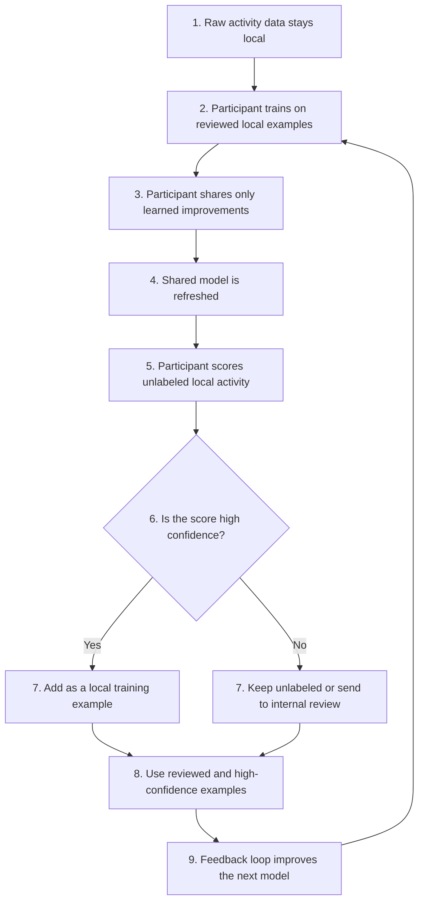

# **Canton Intelligence Framework**

**Author:** T-RIZE GROUP  
**Status**: Draft  
**Created**: 2026-06-4  
**Label**: financial-workflows-composability  
**Champion**: T-RIZE

## **Abstract**

Canton is becoming the coordination network for institution-grade financial workflows, bringing together issuers, trading venues, custodians, validators, infrastructure providers, service providers, and application developers under shared privacy guarantees. That architecture is one of Canton’s strongest advantages: it allows regulated participants to coordinate without exposing sensitive data beyond what each workflow requires.

As Canton grows, that same strength creates a new network-level challenge. Market integrity, compliance intelligence, valuation, underwriting, and risk monitoring increasingly depend on signals that no single participant can observe in full. A trading venue may see order-book behavior. A custodian may see wallet movement. A validator or infrastructure provider may see operational anomalies. A settlement participant may see timing patterns. A compliance provider may see links to entities already under review. Individually, each signal may remain below the threshold for action. Together, the pattern may reveal wash trading, circular flows, false liquidity, suspicious settlement behavior, or emerging systemic risk.

This is not a problem that can be solved by centralizing data. The relevant information is fragmented by design. Customer activity, trading records, wallet data, custody activity, settlement information, internal review outcomes, and proprietary risk labels are constrained by regulation, contract, privacy obligations, and competitive sensitivity. Institutions cannot simply pool that information into a shared database. Canton should not ask them to compromise the privacy and control that brought them to the network in the first place.

The Canton Intelligence Framework introduces a privacy-preserving, open-source coordination layer for collaborative intelligence on Canton. Participants train shareable models from their own local data, while raw data remains inside their own environments. Canton and Daml provide the governance and coordination layer: participant permissions, training rounds, model commitments, evaluation records, contribution attribution, audit trails, and incentive logic. Training remains off-ledger; Canton records the governed process, provenance, and commitments that make collaboration auditable without centralizing sensitive information.

The first use case is market integrity because it is immediate, measurable, and directly tied to institutional confidence in Canton-based markets. The Phase 1 pilot will focus on developing models for market integrity across key Canton stakeholders. The objective is practical and testable: demonstrate that a participant’s local risk model can improve through governed collaborative training, without receiving another participant’s private records.

The Canton Intelligence Framework is best understood as a new ecosystem primitive for coordinated intelligence. It gives any governed group of Canton participants the ability to form a training consortium, define participation rules, select or operate aggregators, record model commitments, measure contributions, and improve shared models without centralizing sensitive data. The first implementation is market integrity, but the same framework can support underwriting, collateral risk, compliance, valuation, litigation finance, and continuous asset monitoring. T-RIZE’s role is to deliver the initial Canton-native architecture and reference implementation; the value of the framework is that it can be reused, extended, and governed by the ecosystem itself.

Demand is being anchored through a concrete first-adopter path. MPCH, a cybersecurity and infrastructure company operating close to governed signing, validator, recovery, key-management, and regulated blockchain environments, has expressed significant interest in the framework and is being advanced as a Phase 1 design and implementation partner. Its relevance is strategic: MPCH sits near the infrastructure layer where market integrity, key management, validator operations, governed access, and compliance workflows intersect. T-RIZE is also a direct user of the capability through its Canton-based institutional asset programs, including litigation-finance and private-credit workflows where collaborative valuation, underwriting, risk scoring, and continuous monitoring can improve capital allocation.

The research base is already in place. T-RIZE has spent roughly three years and approximately $2 million of its own capital developing the underlying privacy-preserving machine learning work, supported by more than $3 million of Canadian federal research funding through Mitacs and NSERC Alliance. The work is led through the T-RIZE Industrial Research Chair at École de Technologie Supérieure under Prof. Kaiwen Zhang, with a specialized research team and prior work across decentralized federated learning, secure aggregation, differential privacy, federated evaluation, contribution attribution, and incentive mechanisms. Phase 1 is therefore focused on translating existing research and prototype work into a Canton-native open-source framework, rather than beginning from basic research. Canton is not being asked to fund the full cost of inventing this capability: the requested grant funds the final-mile Canton integration, open-source release, and market-integrity pilot validation of a research base that already exists.

The ask is intentionally staged. Phase 1, covering milestones 1 and 2, requests 6,500,000 CC total to deliver a bounded validation package: Canton-native architecture, Daml governance primitives, open-source reference implementation, developer documentation, participant onboarding materials, and a working market-integrity pilot. Success will be evaluated against pre-registered metrics before the pilot begins, including improvement over isolated-model baselines, precision and recall performance, reduction in undetected suspicious activity, auditability of training rounds, and confirmation that raw participant data remains local. Milestone 3 proceeds only after the Committee can evaluate real results and agrees to continue the development.

The long-term sustainability model is built into the framework. Aggregators, trainers, evaluators, model users, and governance participants can be recognized through configurable contribution and usage mechanisms. A consortium can operate its own aggregator. Infrastructure providers can support enterprise-grade deployment. Participants can contribute data, compute, evaluation, or governance work without exposing their datasets. Models can support usage-based economics or customer inference revenue sharing where governance permits. This creates a path for maintenance, adoption, and ecosystem growth beyond the grant period.

Canton’s privacy is what makes it credible for regulated institutional workflows. The Canton Intelligence Framework makes that privacy scalable. It gives participants a practical way to improve fraud detection, market surveillance, compliance, underwriting, valuation, and risk scoring while preserving data control. It turns fragmented private signals into governed shared intelligence and expands Canton from a network that coordinates assets into a network that can also coordinate trusted intelligence across institutions.

## **Motivation**

Canton is increasingly becoming the coordination layer for institution-grade financial workflows. Issuers, trading venues, custodians, infrastructure providers, settlement participants, service providers, and application developers can coordinate complex activities while preserving privacy and maintaining control over sensitive information.

This architecture is one of Canton’s defining strengths. Participants share only the information required to complete a workflow, while confidential business data, customer records, operational information, and proprietary processes remain under their control.

As adoption grows, however, a new coordination challenge emerges.

Many of the most important decisions in financial markets depend on information that no single participant can observe in full. Market integrity, fraud detection, compliance monitoring, underwriting, valuation, operational risk, and portfolio management increasingly rely on signals distributed across multiple organizations.

A trading venue may observe order-book behavior. A custodian may observe asset movements and wallet activity. A settlement participant may observe timing patterns and settlement anomalies. An infrastructure provider may observe operational events. A compliance provider may possess information relating to entities already under review.

Individually, these signals may not justify action. Collectively, they may reveal wash trading, circular flows, suspicious settlement behavior, coordinated manipulation, emerging operational risks, or broader systemic concerns.

The challenge is that these signals are fragmented by design.

The information required to improve detection and decision-making cannot simply be centralized into a shared database. Customer activity, trading records, wallet information, custody data, internal review outcomes, proprietary risk labels, and operational intelligence are constrained by regulation, contractual obligations, privacy requirements, and competitive considerations.

The same privacy guarantees that make Canton attractive for institutional adoption also make collaborative intelligence difficult.

Today, participants can coordinate workflows through Canton, but they cannot easily learn from one another's experience without exposing sensitive information.

The Canton Intelligence Framework addresses this gap.

The framework introduces a privacy-preserving mechanism through which groups of Canton participants can collaboratively create, govern, evaluate, and improve machine learning models while keeping raw data within their own environments. Rather than centralizing information, participants contribute to shared intelligence through governed collaborative training.

Canton and Daml serve as the coordination layer for this process. Governance decisions, participant permissions, training rounds, model commitments, evaluation records, contribution attribution, and audit trails are recorded through Canton workflows, while machine learning execution remains off-ledger.

The objective is not to create a single shared model for the Canton ecosystem. Instead, the framework introduces a new ecosystem primitive: the Intelligence Consortium.

An Intelligence Consortium is a governed group of participants that collaborate to solve a shared problem through privacy-preserving machine learning. Participants define governance rules, select model architectures, establish participation requirements, determine evaluation methodologies, and control how resulting models are used.

Market integrity is the first validation use case because it is immediate, measurable, and directly impacts trust in Canton-based markets. The same framework, however, is designed to be reused across other institutional domains.

### **Pilot Use Case: Market Integrity**

The pilot establishes the first Market Integrity Intelligence Consortium composed of participating venues, custodians, infrastructure providers, and compliance stakeholders.

Market integrity is the initial focus because it is a network-level problem. Inorganic activity, circular trading, coordinated behavior, and anomalous settlement patterns can damage trust in Canton-based markets even when no single participant has enough information to identify the full pattern independently.

Venues, custodians, validators, wallet providers, settlement participants, and compliance providers each observe different parts of the same activity. A trading venue may see order-book behavior, a custodian may see wallet movements, a validator may see operational patterns, and another participant may see links to entities already under review.

Through privacy-preserving machine learning, these participants can collaboratively train models that benefit from the collective experience of the network without revealing sensitive customer information, order history, wallet activity, internal investigations, or proprietary datasets.

Knowledge gained by one participant can improve the quality of the shared model while preserving privacy, maintaining regulatory boundaries, and improving market quality for the broader ecosystem. 

MPCH is being advanced as the first partner of the Market Integrity Consortium.

### **Collaborative Learning Across Market Participants**

This use case focuses on the federated training of a **behavioral activity-risk model**, a type of machine learning model that has already been successfully applied in adjacent domains such as fraud detection, anti-money laundering, and anomaly detection.

Each participant trains the model using its own private observations and reviewed cases. Trading venues may contribute features derived from order placement, cancellations, fills, and market behavior. Custodians and wallet providers may contribute signals derived from asset movements, wallet relationships, and transaction patterns. Settlement participants may contribute timing, operational, and settlement-related indicators.

Rather than sharing raw records, each participant computes local model updates and contributes only learned improvements to the shared model. The result is a behavioral model that benefits from patterns observed across the broader ecosystem while keeping sensitive operational data private.

Several model architectures are well suited for this type of collaborative training:

| Model Type                                 | Purpose                                                         | Example Signals                                                                               |
| ------------------------------------------ | --------------------------------------------------------------- | --------------------------------------------------------------------------------------------- |
| Gradient Boosted Trees (XGBoost, LightGBM) | Behavioral risk scoring from structured features                | Circular trading indicators, cancellation behavior, volume patterns, account activity metrics |
| Logistic Regression                        | Explainable risk scoring and baseline detection                 | Simple behavioral and compliance indicators                                                   |
| Neural Networks                            | Detection of more complex behavioral relationships              | Multi-dimensional trading and settlement patterns                                             |
| Autoencoders                               | Unsupervised anomaly detection when reviewed labels are limited | Unusual activity that differs from normal participant behavior                                |
| Ensemble Models                            | Combine multiple behavioral signals into a single risk score    | Behavioral, operational, and compliance indicators                                            |

The behavioral model is not intended to replace existing surveillance systems. Instead, it becomes one component of a broader market-integrity framework. Local rules, compliance reviews, graph analysis, and other monitoring systems can continue to operate independently while benefiting from a stronger behavioral risk signal learned collectively across the network.

As additional participants contribute experience and reviewed examples, the shared model continuously improves its ability to identify previously unseen forms of inorganic activity, coordinated behavior, and market manipulation patterns while preserving privacy and regulatory boundaries.

The pilot is evaluated against a small set of questions that determine whether collaborative learning delivers practical value while respecting privacy boundaries:

| Evaluation question | Phase 1 target |
| --- | --- |
| Does collaborative learning improve recall versus local-only models? | Demonstrate measurable uplift |
| Does it maintain acceptable false-positive rates? | No material degradation |
| Does it surface medium-confidence cases for review? | Improve prioritization |
| Does it preserve raw-data locality? | No raw data leaves participant environments |

#### **Scenario**

> **Note:** All data, tables, features, and performance figures in the following scenario and operational progression are illustrative examples intended to explain how the framework works. They are not benchmarks, projections, or guarantees of real-world results.

A group of institutional accounts or wallets artificially creates volume on a trading pair, for example **USDCx / Canton Coin**.

They place and execute orders among themselves to create the impression that there is more liquidity or genuine market interest than actually exists.

A trading venue can observe patterns in its order book, but it cannot always know whether the entities behind the accounts are linked elsewhere. A custodian or wallet provider may see asset movements between wallets. Another participant may see settlement flows or connections to entities that are already considered risky.

No single participant has the full truth, but each one has part of the signal.

#### **Data on the Trading Venue's Side**

The trading venue naturally stores order flow data for its operations.

Local table: `orders`

| order_id | account_hash | pair | side | price | quantity | timestamp | status |
| --- | --- | --- | --- | --- | --- | --- | --- |
| O-001 | A91F | USDCx-CC | buy | 0.0841 | 250,000 | 10:00:01 | filled |
| O-002 | B72K | USDCx-CC | sell | 0.0841 | 250,000 | 10:00:03 | filled |
| O-003 | A91F | USDCx-CC | sell | 0.0840 | 248,000 | 10:03:10 | filled |
| O-004 | B72K | USDCx-CC | buy | 0.0840 | 248,000 | 10:03:12 | filled |
| O-005 | C44P | USDCx-CC | buy | 0.0839 | 2,000,000 | 10:04:01 | cancelled |
| O-006 | C44P | USDCx-CC | buy | 0.0838 | 1,900,000 | 10:04:03 | cancelled |
| O-007 | C44P | USDCx-CC | buy | 0.0837 | 1,850,000 | 10:04:06 | cancelled |
| O-008 | E27Q | USDCx-CC | sell | 0.0843 | 1,700,000 | 10:05:10 | cancelled |
| O-009 | E27Q | USDCx-CC | sell | 0.0844 | 1,650,000 | 10:05:13 | cancelled |
| O-010 | D18M | USDCx-CC | buy | 0.0840 | 40,000 | 10:07:00 | filled |

The order flow shows two distinct abuse patterns. A91F and B72K repeatedly execute matched buy/sell orders against each other (wash trading), so their orders fill. C44P and E27Q place large orders that are cancelled within a few seconds without executing (spoofing/layering), inflating apparent depth without genuine intent to trade. D18M is a normal account included as a benign baseline.

#### **Local Features Computed by the Trading Venue**

The trading venue transforms this data into statistical signals. The features below are illustrative examples; a production deployment would typically include a broader feature set to capture more complex patterns.
Table: `local_features_by_account_pair_day`

| account_hash | pair | date | abuse_pattern | trade_volume | cancel_rate | self_cross_score | round_trip_score | avg_time_to_cancel_sec | activity_risk_label |
| --- | --- | --- | --- | --- | --- | --- | --- | --- | --- |
| A91F | USDCx-CC | 2026-06-18 | Wash trading | 12,400,000 | 0.05 | 0.91 | 0.88 | 240 | 1 |
| B72K | USDCx-CC | 2026-06-18 | Wash trading | 11,900,000 | 0.07 | 0.89 | 0.85 | 255 | 1 |
| C44P | USDCx-CC | 2026-06-18 | Spoofing | ~0 | 1.00 | 0.06 | 0.09 | 2 | 1 |
| E27Q | USDCx-CC | 2026-06-18 | Spoofing | ~0 | 1.00 | 0.08 | 0.11 | 3 | 1 |
| D18M | USDCx-CC | 2026-06-18 | None | 340,000 | 0.14 | 0.05 | 0.07 | 90 | 0 |

These local features could include the following non-exhaustive list:

| Feature | Definition | Signal |
| --- | --- | --- |
| `self_cross_score` | How often accounts appear to trade with closely related accounts. | Related-party activity |
| `round_trip_score` | How often positions move out and back quickly with little net exposure. | Circular trading behavior |
| `cancel_rate` | Share of placed orders that are cancelled. | Order-book quality |
| `avg_time_to_cancel_sec` | Average time between placing and cancelling an order. | Short-lived order patterns |
| `activity_risk_label` | Local review label or score assigned by internal monitoring or compliance review. | Reviewed activity risk |

The example intentionally captures two distinct manipulation patterns, each with internally aligned behavioral metrics (the `abuse_pattern` column is shown only to make the example easy to follow and is not a model input):

#### **Human Guided Training**

This use case is a strong fit for semi-supervised learning because reviewed labels are valuable, limited, and unevenly distributed across participants.

Each participant improves the model using its own reviewed examples, while keeping its raw activity data private. The shared model then helps each participant score unlabeled activity in its own environment.

High-confidence scores become new local training examples. Lower-confidence cases remain unlabeled or go to internal review. This lets each participant expand its useful training set without sharing raw data, order history, wallet activity, or review outcomes.

The result is a privacy-preserving feedback loop: the shared model gets better, and each participant becomes better at interpreting its own private signals.

#### **Why This Matters**

This case matters because the same activity pattern can appear differently depending on where an institution sits in the market.

A trading venue sees order-book behavior. A custodian sees wallet movements and asset flows. Another venue may see similar activity on a different pair. A settlement participant may see timing patterns, failed settlements, or links to entities that are already under review.

Each actor has a partial view, but they share the same operational need: identifying inorganic market activity earlier and with more confidence. Cooperation creates a transfer learning effect across roles. Patterns learned from one participant’s private signal can improve how another participant interprets its own private signal, without either side exposing the underlying data.

The business message is clear: participants improve their own monitoring by learning from the experience of others, while raw orders, wallet activity, settlement records, and internal review outcomes remain private.

Example improvement (illustrative figures only, not measured results):

| Model | Precision | Recall | False positives |
| --- | --- | --- | --- |
| Trading venue only | 82% | 48% | Medium |
| Custodian only | 76% | 41% | Low |
| Other venue only | 79% | 45% | Medium |
| Shared model | 85% | 71% | Medium-low |

For a trading venue, the benefit is practical:

* less inorganic market activity;
* better market quality;
* more institutional trust;
* stronger compliance monitoring;
* better reputation with market makers, custodians, and partners;
* higher-quality data sold or shared through providers such as Kaiko.

#### **Expected Operational Progression**

In production, the value of this approach should appear progressively as participants contribute reviewed examples and reuse the improved model inside their own environments. The day-by-day figures below are illustrative and used only to show how the workflow behaves over time.

##### **Day 1**

A trading venue may observe two accounts, A91F and B72K, each generating around 12M of volume on USDCx-CC (roughly 24M combined). The case row below reflects account A91F.

The venue observes high volume, repeated trading between the same accounts, short round trips, and low real price impact. Its local model produces a medium-confidence local score, but not enough confidence to take action without review.

| Actor | `trade_volume` | `cancel_rate` | `round_trip_score` | `self_cross_score` | `reciprocal_volume_pct` | `avg_net_flow` | `label` | `pseudo_label` | `review_status` |
| --- | --- | --- | --- | --- | --- | --- | --- | --- | --- |
| Trading venue | 12,400,000 | 0.05 | 0.88 | 0.91 | 0.61 | Near zero | n/a | Medium-confidence local score | Unreviewed |

##### **Day 2**

A custodian and another venue train on their own reviewed examples. They do not share wallet movements, settlement details, or venue-specific activity records, but their learning improves the shared model.

The trading venue uses the refreshed model to rescore its own unlabeled activity. The same local case now receives a higher federated score after collaborative training and is routed to internal review.

| Actor | `trade_volume` | `cancel_rate` | `round_trip_score` | `self_cross_score` | `reciprocal_volume_pct` | `avg_net_flow` | `label` | `pseudo_label` | `review_status` |
| --- | --- | --- | --- | --- | --- | --- | --- | --- | --- |
| Trading venue | 12,400,000 | 0.05 | 0.88 | 0.91 | 0.61 | Near zero | n/a | Higher federated score after collaborative training | Unreviewed |
| Custodian or wallet provider | 5,000,000 | n/a | 0.81 | 0.67 | 0.74 | Near zero | 1 | n/a | Reviewed |
| Other venue | 4,600,000 | 0.12 | 0.76 | 0.58 | 0.69 | Low | 1 | n/a | Reviewed |

##### **Day 3**

After the case is reviewed and confirmed locally, the venue keeps the result as a local training example. It is added to the local reviewed set after human validation, and in the next feedback loop, similar cases are identified earlier and with more confidence.

| Actor | `trade_volume` | `cancel_rate` | `round_trip_score` | `self_cross_score` | `reciprocal_volume_pct` | `avg_net_flow` | `label` | `pseudo_label` | `review_status` |
| --- | --- | --- | --- | --- | --- | --- | --- | --- | --- |
| Trading venue | 12,400,000 | 0.05 | 0.88 | 0.91 | 0.61 | Near zero | 1 | Reviewed and confirmed locally; added to local reviewed set after human validation | Reviewed |

The improvement does not come from receiving another participant’s private data. It comes from the shared model learning how different private signals relate to the same type of market activity, then helping each participant interpret its own data more effectively.

### **Canton Needs Intelligence**

Although the pilot focuses on market integrity, the primary deliverable is not a market-surveillance model. The primary deliverable is a reusable framework for forming Intelligence Consortiums, coordinating collaborative training, governing participation, measuring contributions, and deploying shared models on Canton.

By investing in this capability, Canton can unlock a new category of network activity where organizations collaborate not only through the exchange of assets, but through the creation of intelligence. This expands the range of applications that can be built on Canton and positions the network for a future where artificial intelligence is a core component of financial infrastructure.

This need is already visible among Canton ecosystem infrastructure providers. T-RIZE has received significant interest in this technology from MPCH, a cybersecurity technology company that builds governed signing, recovery, validator, and key-management infrastructure for regulated blockchain ecosystems, institutional digital asset platforms, and high-security environments. MPCH operates close to Canton network infrastructure, institutional validator environments, regulated settlement platforms, and AI governance workflows, making its interest an early validation signal for privacy-preserving intelligence that can support monitoring, governance, compliance, and operational decision-making.

## **Specification**

### **Objective**

Develop an open-source Federated Learning framework that enables organizations on Canton to collaboratively create, govern, deploy, improve, and monetize machine learning models as a reusable network capability while ensuring:

* Raw data never leaves its source environment  
* Participants retain ownership and control of their information  
* Participants decide how much resources to allocate to training  
* Training activities are auditable and governed  
* Contributions can be measured and rewarded  
* Model usage and customer inference can support sustainability mechanisms  
* Regulatory and privacy requirements are maintained  
* Organisations can select their preferred models and fine tune them

The framework introduces a new ecosystem primitive: **Coordinated Intelligence**.

Just as Canton enables organizations to coordinate complex financial workflows without a single point of failure, the proposed framework enables organizations to coordinate intelligence without centralizing data or relying on a single operator to control access to model development, governance, or economic participation.

#### **Ecosystem Impact**

The Canton Intelligence Framework establishes a new category of network activity for the Canton ecosystem: governed collaborative intelligence.

Today, Canton enables organizations to coordinate assets, transactions, and business workflows while preserving privacy and maintaining control over sensitive information. The framework extends this capability to machine learning and decision-support systems, allowing organizations to coordinate intelligence without centralizing data.

The framework's core primitive, introduced earlier, is the **Intelligence Consortium**: a governed group of Canton participants that collaborate to create, evaluate, deploy, and improve machine learning models while retaining control of their own data. Examples may include:

* A market-integrity consortium involving trading venues, custodians, infrastructure providers, and compliance participants.
* A litigation-finance consortium improving case valuation and portfolio risk models.
* A private-credit consortium developing underwriting and monitoring models.
* A compliance consortium improving risk scoring and anomaly detection across regulated participants.
* An operational-risk consortium focused on infrastructure, validator, and settlement monitoring.

The framework is intentionally model-agnostic and consortium-agnostic. It is not designed to create a single intelligence layer for Canton, but rather to provide reusable infrastructure through which many independent consortiums can form, govern collaborative training, measure contributions, and deploy intelligence capabilities according to their own requirements.

As additional participants contribute expertise, data, compute, evaluation, or governance resources, the quality and usefulness of consortium models can improve without requiring any participant to relinquish control over sensitive information.

The framework also establishes the foundations for sustainable intelligence ecosystems. Participants can be recognized for meaningful contributions through configurable attribution mechanisms, while consortiums may choose to implement usage-based access models, contribution rewards, inference-based revenue sharing, or other governance-approved economic structures.

This creates a self-reinforcing ecosystem in which:

1. Participants collaborate to create shared intelligence.
2. Improved models generate value for users.
3. Usage supports contributors and ongoing development.
4. Additional consortiums emerge around new Canton use cases.
5. The network's collective intelligence grows over time.

### Implementation Mechanics

The Canton Intelligence Framework builds upon several years of research and prior implementation experience developing decentralized federated learning infrastructure on EVM-compatible networks.

Canton serves as the authoritative coordination layer, recording governance decisions, participant permissions, model commitments, evaluation outcomes, contribution attribution, and usage policies. This architectural approach has already been validated through prototype implementations developed by T-RIZE and provides a clear path for bringing collaborative intelligence to the Canton ecosystem.

This architecture enables groups of organizations to form **Intelligence Consortiums** that collaboratively create and improve machine learning models without centralizing sensitive information.

### Intelligence Consortium Lifecycle

A typical consortium progresses through the following stages:

1. **Consortium Formation**

   * Participants define the objective of the consortium.
   * Governance rules, participation requirements, and evaluation policies are established.
   * Aggregators, evaluators, and permitted participants are registered.

2. **Model Initialization**

   * The consortium selects an initial model architecture.
   * Baseline evaluation criteria and performance objectives are defined.
   * Initial model commitments are recorded.

3. **Collaborative Training**

   * Participants train locally using their own private datasets.
   * Model updates are contributed through approved aggregation workflows.
   * Raw training data remains within participant environments.

4. **Evaluation**

   * Consortium-defined evaluation procedures measure model quality.
   * Evaluation results are recorded through Canton workflows.
   * Model versions and performance history become auditable.

5. **Contribution Attribution**

   * Contributions from participants may be measured through governance-approved methodologies.
   * Data, compute, evaluation, governance, or operational contributions can be recognized independently.

6. **Deployment and Usage**

   * Approved model versions are made available to consortium participants.
   * Usage, access rights, and deployment policies are governed through Canton.
   * Consortiums may implement usage-based access policies, contribution rewards, or revenue-sharing mechanisms where appropriate.

7. **Continuous Improvement**

   * Additional training rounds improve model performance over time.
   * Governance policies evolve as consortium requirements change.
   * New participants may join through approved onboarding processes.

The framework is intentionally consortium-agnostic and model-agnostic. Multiple independent consortiums can operate simultaneously on Canton, each with its own governance model, participants, objectives, model architectures, and incentive structures.

The remainder of the architecture describes the technical components that support these consortium workflows.

#### **High-Level Architecture**

The framework is composed of five primary components:

##### **Trainer Nodes**

Organizations operate trainer nodes within their own environments.

Trainer nodes:

* Maintain custody of training data  
* Execute local training workloads  
* Generate model commitments  
* Participate in evaluations  
* Interact with Canton through authenticated identities

##### **Aggregator Services**

Aggregator services facilitate collaborative training on behalf of an Intelligence Consortium.

Aggregators do not own consortium data, determine governance policies, or control model development. Their role is limited to being a middleman during training, receiving participant model updates, performing aggregation, and publishing aggregation outcomes according to the rules established by the consortium.

The set of approved aggregators is defined through consortium governance and recorded on Canton. Consortium participants determine which aggregators are authorized to coordinate training activities, and these permissions can be modified through governance processes as consortium requirements evolve.

The framework is designed to support multiple aggregator implementations with different operational, privacy, and security characteristics. The aggregator features should be selected based on the consortium threat model. Examples may include:

| Aggregator Type                                | Example Characteristics                                                                     |
| ---------------------------------------------- | ------------------------------------------------------------------------------------------- |
| Standard Aggregator                            | Conventional aggregation service operated by a consortium member or infrastructure provider |
| Secure Aggregation Service                     | Supports cryptographic secure aggregation protocols                                         |
| Trusted Execution Environment (TEE) Aggregator | Executes aggregation inside a trusted execution environment                                 |
|                                                |                                                                                             |
| Managed Enterprise Aggregator                  | Operated by a third-party infrastructure provider with enterprise operational guarantees    |

The framework does not require a single global aggregator. Multiple aggregators may operate simultaneously across different consortiums, and individual consortiums may choose to authorize one or more aggregators according to their governance, security, regulatory, and operational requirements.

This approach allows consortiums to select aggregation providers that align with their trust assumptions while preserving interoperability through a common Canton-native governance and coordination framework.

##### **Serverless GPU & Compute Layer**

A scalable compute layer supports:

* Model aggregation  
* Federated evaluation  
* Benchmarking  
* Contribution calculations  
* Optional model-serving workloads

This layer enables large-scale collaborative intelligence without requiring every participant to maintain dedicated infrastructure.

##### **Incentive and Usage Layer**

An incentive and usage layer supports the economic sustainability of collaborative intelligence networks.

Responsibilities include:

* Contribution-based reward allocation  
* Usage accounting for deployed models  
* Revenue sharing from customer inference  
* Governance-approved fee and reward policies  
* Optional model access and monetization rules

This layer allows successful models to remain economically viable after initial development while preserving participant choice over contribution, access, and deployment terms.

#### **Canton Coordination Layer**

Canton acts as the authoritative coordination and governance layer.

DAML workflows maintain the canonical record of:

* Training rounds  
* Participant permissions  
* Governance decisions  
* Model commitments  
* Evaluation outcomes  
* Contribution results  
* Incentive distributions

This allows every participant to independently verify system state while preserving data sovereignty.

### **DAML Coordination Contracts**

The framework is expected to include several reusable coordination components.

Potential contract types include:

* **TrainingRound** – lifecycle management of collaborative training rounds  
* **ParticipantRegistry** – trainer, evaluator, and aggregator membership  
* **ModelCommitment** – verifiable registration of model submissions  
* **EvaluationRecord** – storage of evaluation outcomes  
* **ContributionRecord** – contribution attribution and scoring  
* **RewardDistribution** – incentive settlement and reward allocation  
* **GovernanceProposal** – configurable governance workflows

These contracts collectively establish the system of record for collaborative intelligence.

### **Recorded Events & Audit Trail**

The framework is designed to create a complete audit trail for intelligence creation.

Examples of recorded events include:

* Participant registration  
* Training round creation  
* Model commitment submissions  
* Evaluation submissions  
* Contribution calculations  
* Reward distributions  
* Governance decisions  
* Configuration changes

Rather than storing model weights or training data, the framework records verifiable commitments and metadata that establish provenance while preserving privacy.

## **Architectural Alignment**

Federated learning and Canton address complementary coordination challenges.

Federated learning enables organizations to collaboratively train machine learning models without sharing raw data. This makes it particularly well suited for regulated industries where privacy obligations, contractual restrictions, and data sovereignty requirements prevent traditional approaches to collaborative intelligence.

These are the same constraints that led organizations to adopt Canton for coordinating assets, workflows, and transactions.

As artificial intelligence becomes increasingly embedded in financial infrastructure, institutions face a similar challenge with intelligence: valuable data exists across organizations, but cannot be centralized. Federated learning brings the same privacy-preserving collaboration to machine learning, allowing organizations to collaboratively create, deploy, improve, and monetize models while retaining control over their data.

The relationship is mutually reinforcing.

Federated learning benefits from Canton's existing strengths in identity, governance, selective disclosure, and multi-party coordination. At the same time, Canton benefits from federated learning by expanding the range of activities that can be coordinated across the network, from asset workflows to shared model development, market integrity, and governed AI usage.

Together, the two technologies create capabilities that neither provides independently:

* Privacy-preserving intelligence creation  
* Transparent governance of machine learning systems  
* Auditability and provenance of model development  
* Incentive mechanisms for data, model, compute, evaluation, and governance contributions  
* Usage and revenue-sharing mechanisms for deployed models  
* Neutral coordination between independent organizations

The result is a network capability for creating, governing, deploying, and monetizing intelligence across organizations while preserving privacy, sovereignty, and regulatory compliance.

The framework is intended to support neutral network governance. T-RIZE may serve as the initial implementer and maintainer, but the architecture allows independent operators, aggregators, participants, and application developers to deploy and govern collaborative intelligence networks according to their own use cases and governance requirements.

## **Security & Privacy**

Security and privacy are foundational design principles of the Canton Intelligence Framework.

The framework is intended to support collaborative intelligence creation across a wide range of deployment environments, each with different trust assumptions, regulatory requirements, and risk profiles. Rather than prescribing a single security model, the framework is designed to provide extensible building blocks that allow participants to select the privacy, governance, and security mechanisms appropriate for their use case.

The objective is to provide a flexible foundation capable of supporting the full spectrum of collaborative intelligence deployments, from trusted consortiums to more adversarial multi-party environments.

### **Threat Model**

The Canton Intelligence Framework is designed to support a configurable spectrum of trust assumptions and threat levels.

Different collaborative intelligence deployments operate under different risk profiles. A consortium of regulated financial institutions may have significantly different security requirements than an open ecosystem of independent organizations. As a result, the framework is designed to be extensible and allow participants to select security, privacy, and governance mechanisms appropriate for their deployment.

The framework is intended to support scenarios including:

#### **Trusted Consortiums**

Participants are known organizations operating under contractual agreements and regulatory oversight.

Primary concerns may include:

* Operational mistakes  
* Unauthorized access  
* Data leakage through model updates  
* Governance transparency  
* Regulatory compliance

#### **Semi-Trusted Ecosystems**

Participants are known organizations with partially aligned incentives but limited mutual trust.

Primary concerns may include:

* Data reconstruction attacks  
* Strategic manipulation of model contributions  
* Free-riding behavior  
* Disputes regarding contribution attribution  
* Unauthorized model usage

#### **Adversarial Environments**

Participants may be economically motivated to manipulate outcomes or gain information from the collaborative training process.

Primary concerns may include:

* Model poisoning attacks  
* Sybil attacks  
* Membership inference attacks  
* Model inversion attacks  
* Collusion between participants  
* Manipulation of incentive mechanisms

The framework does not prescribe a single trust model or security architecture. Instead, it is designed to support configurable security, privacy, governance, and coordination mechanisms that can be adapted to the needs of individual deployments.

### **Privacy-Preserving Training**

The framework is designed around the principle that raw training data remains under the control of participating organizations.

Depending on deployment requirements, participants may choose to leverage privacy-preserving techniques such as:

* Secure aggregation  
* Differential privacy  
* Access controls and participant authentication  
* Selective disclosure mechanisms

### **Secure Aggregation**

The framework is designed to accommodate multiple secure aggregation approaches based on deployment requirements and trust assumptions.

Potential approaches include:

* Trusted Execution Environments (TEEs)  
* Multi-Party Computation (MPC) variants  
* Cryptographic secure aggregation protocols

This flexibility allows organizations to balance privacy, performance, operational complexity, and regulatory requirements according to their needs.

### **Differential Privacy**

The framework may incorporate differential privacy mechanisms to help reduce the risk of information leakage from model updates.

Depending on the deployment, privacy budgets and protection mechanisms may be adapted to balance privacy requirements with model utility and performance objectives.

### **Model Integrity & Poisoning Resistance**

The framework is designed to enable mechanisms that help preserve model quality and reduce the impact of malicious or low-quality contributions.

Potential approaches include:

* Federated evaluation workflows  
* Anomaly detection on model updates  
* Reputation and participation scoring  
* Governance-controlled participant admission  
* Configurable aggregation and weighting strategies

### **Auditability & Governance**

Training activities, governance decisions, model versions, aggregation events, and participant actions are recorded and independently auditable.

These capabilities can provide:

* Training provenance  
* Model lineage  
* Contribution attribution  
* Governance transparency  
* Regulatory traceability

### **Independent Review**

The framework benefits from prior research conducted through T-RIZE Labs and the Industrial Research Chair in Tokenization at École de technologie supérieure (ÉTS), a Canadian university specialized in applied engineering and technology, including work on secure aggregation, differential privacy, federated evaluation, contribution attribution, and incentive mechanisms.

Security assumptions, architectural decisions, and privacy-preserving approaches will be documented to facilitate review by ecosystem participants, researchers, and independent experts.

## **Backward Compatibility**

No backward compatibility impact.

## **Milestones and Deliverables**

All framework components developed under this proposal will be released under the MPL-2.0 License.

### **Milestone 1 – Foundation**

**Duration:** 4 Months

Milestone 1 builds on T-RIZE’s existing deployed federated learning framework on an EVM-compatible network and prior applied research conducted through T-RIZE Labs and the Industrial Research Chair in Tokenization at ÉTS.

Through T-RIZE Labs and the Industrial Research Chair in Tokenization at ÉTS, several years of research have already been completed by a multidisciplinary team of 12 researchers, 3 professors, and T-RIZE engineers. This work has resulted in multiple peer-reviewed publications and prototype implementations covering all components required for production-grade federated learning systems.

Research areas include secure aggregation techniques (including Trusted Execution Environments and Multi-Party Computation variants), client-to-server assignment strategies, adaptive differential privacy mechanisms, federated evaluation methodologies, transparent contribution attribution through smart contracts, and incentive and compensation models.

As a result, the Canton Intelligence Framework builds upon a substantial body of existing research and implementation experience, allowing the project to focus on integration, productization, and ecosystem adoption rather than fundamental research.

#### **Milestone 1a — Architecture and Specification**

#### **Duration:** 1 month  **Deliverables**

* #### Canton-specific architecture and protocol specification

* #### Daml governance contract specification

* #### Security and threat model

* #### Flower interoperability specification

* #### Development environment and CI/CD pipeline

* #### Review package including architecture diagrams, implementation roadmap, security assumptions, and Milestone 1b / 1c delivery plan

#### **Success Criteria**

* #### Architecture and security specifications accepted by the Dev Fund Committee

* #### Repository, development environment, and CI/CD pipeline accessible to the Dev Fund Committee

#### **Milestone 1b — Canton Integration and MVP**

#### **Duration:** 2 months

**Deliverables**

* MVP orchestration with Canton integration  
* Core Daml contracts for training coordination, governance, and access control  
* Testnet auditability records for training rounds, participants, and model versions  
* Two-node training workflow on Canton testnet

**Success Criteria**

* Training round completed on Canton testnet with at least two participating nodes  
* Canton records generated for participant authorization, training round creation, model update submission, and governance approval

#### **Milestone 1c — Public Release**

**Duration:** 1 month

**Deliverables**

* End-to-end reference implementation  
* Reusable governance primitives  
* Completed auditability layer  
* Initial contribution and reward distribution primitives  
* Public MPL-2.0 repository  
* Developer documentation and onboarding materials

**Success Criteria**

* Public repository released and accessible to the Dev Fund Committee  
* End-to-end collaborative workflow demonstrated on Canton. Includes Onchain governance, access control, and auditability.  
* Developer onboarding materials published

### **Milestone 2 — Market Integrity Pilot**

**Duration:** 4 Months

#### **Deliverables**

* Governance framework  
* Operational tooling  
* Model usage and access policy tooling  
* Integration support  
* Production pilot implementation  
* Consortium member participation  
* Defined metrics  
* Baseline comparison against local-only models  
* Precision/recall evaluation  
* Documented results

#### **Success Criteria**

* At least one successful production deployment for a real world use case  
* Two or more organizations participating in a collaborative training  
* Usage, access, and contribution policies configured for the production pilot  
* Evaluation metrics defined and measured against a local-only baseline  
* Precision/recall results documented for the collaborative model versus the baseline  
* Public case study published

### **Milestone 3 – Incentive Layer & Ecosystem Adoption**

**Duration:** 4 Months

> **Conditional milestone:** Milestone 3 is conditional on the successful completion and acceptance of Milestone 2 and on a Dev Fund Committee vote to validate proceeding further. If Milestone 2 success criteria are not met, or if the Committee votes not to continue, Milestone 3 is not initiated and its funding is not released.

#### **Technical Deliverables**

* Contribution tracking framework  
* Reward distribution mechanisms  
* Incentive and usage infrastructure  
* Customer inference revenue-sharing workflows  
* Ecosystem participation framework

#### **Ecosystem Deliverables**

* Developer onboarding materials  
* 2 Technical workshops and demonstrations  
* 1 Production case study  
* Ecosystem adoption campaign  
* Conference presentations and community engagement

#### **Success Criteria**

##### **Technical Success**

* Reward workflows demonstrated  
* Model usage and customer inference revenue-sharing flows demonstrated  
* Incentive layer released and open-source   
* Framework ready for broader ecosystem adoption

##### **Ecosystem Success**

* Developer onboarding resources published  
* At least one public case study completed  
* Community workshops conducted  
* Adoption and awareness activities completed in collaboration with the Canton Foundation

## **Acceptance Criteria**

The proposal will be considered complete when:

* All framework components are delivered  
* Collaborative training is demonstrated on Canton  
* The framework is released as an open-source network capability  
* Documentation and onboarding materials are available  
* At least one production deployment is completed  
* Incentive, usage, and contribution mechanisms are demonstrated  
* The framework demonstrates utility beyond T-RIZE internal use

## **Funding**

### **Funding Structure**

The initial payment, for Milestone 1a, is released upon approval of the proposal to support project initiation, team allocation, research activities, and infrastructure development. This is the only payment made in advance.

All subsequent milestone payments are released upon the successful completion and acceptance of that same milestone by the Dev Fund Committee. Milestone 3 is additionally conditional on a Dev Fund Committee vote to validate continuing the work after Milestone 2: its initial payment is released upon that vote approval to initiate the work, and the remainder upon acceptance of Milestone 3.

| Milestone | Expected Completion | Funding | Funding Trigger |
| :---- | :---- | :---- | :---- |
| 1a \- Architecture and Specification | 1 month after acceptance | 1,000,000 CC | Upon acceptance of proposal |
| 1b \- Canton Integration and MVP | 3 months after acceptance | 2,000,000 CC | Upon acceptance of Milestone 1b |
| 1c \- Public Release | 4 months after acceptance | 1,500,000 CC | Upon acceptance of Milestone 1c |
| 2 \- Market Integrity Pilot | 8 months after acceptance | 2,500,000 CC | Upon acceptance of Milestone 2 |
| 3 \- Ecosystem Adoption | 12 months after acceptance | 3,000,000 CC | Conditional on Milestone 2 success and a Dev Fund Committee vote to proceed. 50% Upon Dev Fund Committee vote approval / 50% Upon acceptance of Milestone 3 |
| **TOTAL** | **12 months** | **10,000,000 CC** |  |

**Budget**

| Line Item | Milestone 1 | Milestone 2 | Milestone 3 | Total |
| :---- | ----: | ----: | ----: | ----: |
| Engineering & Canton Implementation | 3,000,000 | 1,400,000 | 700,000 | **5,100,000** |
| Protocol Design, Security Review & Applied Research | 600,000 | 200,000 | 100,000 | **900,000** |
| Infrastructure and cloud | 400,000 | 400,000 | 400,000 | **1,200,000** |
| Integration and partner support | 350,000 | 400,000 | 300,000 | **1,050,000** |
| Ecosystem, marketing, and workshops | 150,000 | 100,000 | 1,500,000 | **1,750,000** |
| **TOTAL** | **4,500,000** | **2,500,000** | **3,000,000** | **10,000,000** |

**Total Duration:** 12 Months

The proposal is intentionally structured as a final-mile implementation grant. Prior research and prototype work — roughly three years of effort and approximately $2 million of T-RIZE's own capital, complemented by more than CAD $3 million of Canadian federal research funding through Mitacs and NSERC Alliance — have already reduced the core technical uncertainty. The requested funding is therefore concentrated on Canton integration, open-source delivery, partner deployment, and ecosystem adoption rather than exploratory R&D.

The budget should be evaluated against the cost of Canton-specific implementation, not against the full historical cost of developing privacy-preserving federated learning infrastructure, much of which has already been absorbed by T-RIZE and its public research partners. On that basis the funding request is modest relative to the total R&D base being contributed to the Canton ecosystem: Canton receives the benefit of a multi-year, multi-million-dollar research foundation while funding only the narrow Canton-native conversion, open-source packaging, and pilot validation. The grant is therefore leveraged rather than speculative.

## **Co-Marketing**

T-RIZE will collaborate with the Canton Foundation on:

* Technical announcements  
* Developer workshops  
* Educational content  
* Conference presentations  
* Production case studies

to promote adoption of privacy-preserving AI capabilities across the Canton ecosystem.

## **Token Volatility**

The funding request is denominated in CC and reflects the estimated resources required to deliver the proposed milestones.

In the event that the market value of CC experiences a material increase or decrease of more than 30% relative to its value at the time of proposal approval, the Canton Foundation and T-RIZE may review future milestone payments in good faith to ensure the continued viability of the project while preserving the intent of the original funding commitment.

Any adjustments would apply only to future milestone payments and remain subject to mutual agreement.

## **Why T-RIZE**

This proposal builds on several years of research and development conducted by T-RIZE and its academic partners in distributed systems, blockchain infrastructure, and federated learning.

T-RIZE has already developed and deployed foundational components of decentralized federated learning infrastructure on EVM-compatible networks, including model governance, contribution attribution, incentive mechanisms, access controls, and blockchain-based coordination of training activities. This prior work significantly reduces execution risk and accelerates delivery of the Canton Intelligence Framework.

In 2023, T-RIZE and ÉTS established the Industrial Research Chair in Tokenization, led by Professor Kaiwen Zhang and later joined by Professors Edward Zhang and Sara Rouhani. The Chair secured more than CAD $3 million over five years to advance research in tokenization, privacy-preserving computing, distributed federated learning, and collaborative intelligence systems. This research program has produced multiple peer-reviewed publications and prototype implementations that directly inform the Canton Intelligence Framework.

Beyond its research efforts, T-RIZE actively structures and administers institutional digital assets on Canton, including litigation-finance-backed issuance programs and other real-world asset initiatives where collaborative intelligence can improve valuation, underwriting, risk assessment, and capital allocation.

The Canton Intelligence Framework converts this experience into a reusable open-source network capability for the broader Canton ecosystem. In effect, this proposal gives Canton access to a substantially de-risked technology base: the prior grants and internal investment act as matching capital, and the requested funding covers the Canton-native conversion, open-source release, and pilot validation rather than open-ended research.

## **Long-Term Sustainability**

The Canton Intelligence Framework will be released as open source under the MPL-2.0 license and developed in collaboration with the broader Canton ecosystem.

The framework is designed to support independent Intelligence Consortiums that create, govern, deploy, and improve collaborative machine learning models according to their own requirements.

As consortiums develop useful intelligence capabilities, participants benefit from improved risk detection, compliance monitoring, underwriting, valuation, and operational decision-making. This creates natural incentives for continued participation and model improvement.

The framework supports configurable mechanisms for:

* Contribution attribution
* Cost sharing
* Usage-based access
* Reward distribution
* Revenue sharing from model usage or customer inference

Economic policies remain consortium-defined and governed through Canton.

The sustainability model is straightforward: collaborative training improves model quality, better models create value for participants, and that value sustains continued participation and the emergence of new consortiums around additional use cases.

T-RIZE intends to remain an active contributor through its own Canton-based deployments, research initiatives, and commercial applications. However, the framework is designed so that its long-term growth does not depend on any single organization.

The long-term objective is to establish collaborative intelligence as a reusable network capability for the Canton ecosystem, extending Canton's coordination model beyond assets and workflows to include the governed creation and improvement of intelligence.

