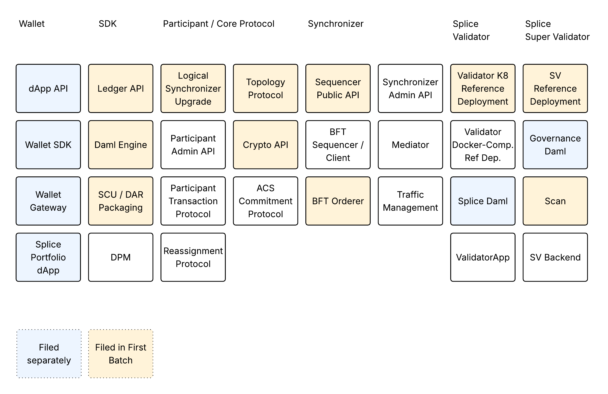

## **Development Fund Proposal: Security Reviews of Core Canton Network Components, Batch 2026-H2**

**Author:** Digital Asset 
**Status:** Draft  
**Created:** 2026-06-02  
**Label:** canton-protocol-multi-synchronizer
**Champion:** Digital Asset

---

## Abstract

This proposal outlines a comprehensive initiative to harden the core infrastructure of the Canton Network through rigorous internal reviews and independent third-party security audits.

The initial batch targets several critical components essential for institutional adoption and network resilience based on their importance and due to recent changes. By identifying and remediating vulnerabilities within a standardized, repeatable workflow, this initiative aims to mitigate evolving security threats, enhance public trust, and provide the formal certifications required by large-scale commercial institutions. The effort is scheduled largely for completion by EOY 2026 to Q1 2027, ensuring the network remains secure and protocol-compliant as it scales.

---

## Specification

### 1. Objective

The objective of this project is to harden the core components of the Canton Network and to provide an updated independent third-party security audit for each component. Such independent security audits are relevant for increasing public trust in the network, uncovering unknown security issues by having third parties review code from an independent perspective, and providing the certifications required by larger commercial institutions prior to deeper engagement with the network.  

Digital Asset, as the driver of the core components underpinning the Canton Network, has conducted internal and third-party code audits of key components over several years. Digital Asset has continuously invested in hardening the codebase to protect users from data theft and loss. However, these audits need to be repeated to reflect changes to existing components and the ongoing evolution of security threats. Security is not a feature, but a commitment.

### 2. Implementation Mechanics

#### 2.1 Process
The codebase for the core components of the Canton Network spans multiple repositories and large, highly complex projects. Therefore, we will decompose the core artifacts into independently verifiable components and features. Each separable component will then be processed according to the same repeatable workflow:

1. Updating and/or documenting the threat model - due to the sensitive nature of these documents, they will initially be made available only to the Canton Foundation Tech&Ops Security subcommittee, which can then decide if, when, and under what redactions they will be made public.
2. Performing or updating the internal security review.
3. Addressing internally identified vulnerabilities.
4. Independent security auditor selection based on criteria detailed later in this document. The choice of auditor will be subject to the CF T&O Security subcommittee approval.
5. Independent security audit with hands-on support by core engineers.
6. Addressing the identified vulnerabilities by the third-party security audit as a time-boxed effort.
7. Publishing the security audit summary through the Canton Foundation and sharing the detailed findings with the CF T&O Security subcommittee.

Step 7 will be performed once all critical vulnerabilities have been remediated and the network has been upgraded to a version no longer vulnerable.

#### 2.2 Project Decomposition

The decomposition of the project by components is as follows:

<!-- https://lucid.app/lucidchart/4bc62973-f78c-4cc6-8df4-44b049487c5a/edit -->

The described work includes a substantial uncertainty regarding the cost of addressing identified vulnerabilities. The estimates are based on past experience and are time-boxed. The committed resources within a project will be allocated to address identified vulnerabilities across components based on their severity, without further rebalancing of funding, as long as the effort remains within reasonable boundaries.

If addressing the vulnerabilities requires an effort substantially beyond the scope of the given project, an extension to this proposal will be filed, but it must be justified.

For some components, a security review has already been scheduled and funded through separate grant proposals. Also, funding requests will be submitted in incremental batches, one every six months, to reduce the time horizon and funding requests per grant.

The initial batch will be called 2026-H2.

#### 2.3 Third-Party Auditor Selection Process

Each security audit will be performed by an established independent auditor as a time-boxed effort. As there have been several vendors signaling interest in performing such audits, the following process will be applied:

- For each incremental security audit proposal, a request for a quote will be issued, asking independent auditors to apply for the role of a third-party auditor.
- The individual applications will be collected and presented to the security subcommittee and the core contributors group for evaluation and recommendation.
- The tech-and-ops security subcommittee will finally select the independent auditor.

If no suitable third-party auditor can be found through the RFQ process, DA will propose suitable auditors to the tech-and-ops security subcommittee. 

The auditors will be evaluated according to the following criteria:

- Established reputation and experience in performing industry-wide recognized security reviews.
- Existing familiarity with the domain.
- Pricing.
- Availability.
- Ability to interact with the core team in Zurich, Switzerland, during business hours.
- Opportunity to the Network.
- Pre-existing knowledge and experience with the code base in order to increase the quality of the review and reduce the ramp-up cost on the core team.

### 3. Architectural Alignment
The given proposal does not modify the current architecture.

### 4. Backward Compatibility
Security improvements will be performed in a backward-compatible way if possible. Some changes may require modifications to the core protocol. In this case, they will be added to a new protocol version and subsequently rolled out to the network using a logical synchronizer upgrade. 

---

## Milestones and Deliverables

### Milestone 1: _(ISS) ISS/BFT Orderer_
- **Scope:** The internal audit and addressing of found issues of the [ISS/BFT Orderer](https://github.com/canton-foundation/canton-dev-fund/blob/main/proposals/2026-02-Development-Fund-Proposal-ISS-based-BFT.md) have already been funded as part of the ISS/BFT grant. Therefore, the scope of this milestone is restricted to updating the documentation to make it accessible to independent auditors, assisting them during the review, and remediating any issues eventually found.
- **Estimated Delivery:** EOY 2026
- **Estimated Effort:** 5PW
- **Selected Independent Auditor**: RFQ (will be replaced with auditor name once selected)

### Milestone 2: _(LSU) Logical Synchronizer Migration_
- **Scope:** [Logical synchronizer migration](https://github.com/canton-foundation/canton-dev-fund/blob/main/proposals/2026-02-Development-Fund-Proposal-Logical-Synchronizer-Upgrades.md) has been added to the protocol in order to support asynchronous upgrades of the protocol with minimal downtime. This addition has been a major change to the existing (and previously audited) transaction protocol. An internal security audit of LSU has already been conducted. Therefore, the scope of this milestone is restricted to updating the documentation to make it accessible to independent auditors, assisting them during the review, and remediating any issues eventually found.
- **Estimated Delivery:** EOY 2026
- **Estimated Effort:** 4PW
- **Selected Independent Auditor**: RFQ

### Milestone 3: _(CRY) Crypto API_
- **Scope:** The [Crypto API](https://github.com/digital-asset/canton/blob/main/community/base/src/main/scala/com/digitalasset/canton/crypto/CryptoApi.scala) of Canton exposes cryptographic operations behind an abstract interface serving the needs of the protocol in a safe way. Therefore, the implementation of this API must be done with great care to guarantee the security of the protocol. Previous security audits no longer apply due to the recent addition of session signing keys and new crypto schemes. Therefore, the security audit should be renewed.
- **Estimated Delivery:** EOY 2026
- **Estimated Effort:** 8PW
- **Selected Independent Auditor**: RFQ

### Milestone 4: _(SEQAPI) Sequencer Public API_
- **Scope:** The [Sequencer Public API](https://github.com/digital-asset/canton/tree/main/community/base/src/main/protobuf/com/digitalasset/canton/sequencer/api/v30) is the only protocol-level API publicly exposed on the network level in the Canton Network. In order to remove the need for managing whitelists in the Canton Network, an independent audit of the API should be performed in order to ensure a minimal attack surface.
- **Estimated Delivery:** EOY 2026
- **Estimated Effort:** 20PW
- **Selected Independent Auditor**: RFQ

### Milestone 5: _(TOPO) Topology Protocol_
- **Scope:** The [Topology API](https://github.com/digital-asset/canton/blob/main/community/base/src/main/scala/com/digitalasset/canton/topology/client/IdentityProvidingServiceClient.scala) provides the topology information to all protocols on all layers of Canton (orderer, transaction, auth, reassignment, commitment, etc.), but uses the other protocols in order to establish consensus on the topology state (participants, sequencers, mediators, parties, keys, packages, etc.) at any point in time. The topology protocol has been reviewed before, but recent and upcoming changes around scalability (caching, lazy-loading) and multi-synchronizer support require a renewal of the security audit. While some of the changes are still in-flight, the audit grant is being requested in anticipation of the successful completion of the given projects in Q3.
- **Estimated Delivery:** Q1 2027
- **Estimated Effort:** 21PW
- **Selected Independent Auditor**: RFQ

### Milestone 6: _(LAPI) Ledger and JSON API_
- **Scope:** The [Ledger API](https://github.com/digital-asset/canton/tree/main/community/ledger-api-proto/src/main/protobuf/com/daml/ledger/api/v2) and its JSON variant have been independently reviewed in 2025. Since then, there have been several important additions in the form of the interactive submission, paged interfaces, and self-administration mode. The scope of this milestone will include performing an internal audit with emphasis on the new functionality, updating the documentation to make it accessible to independent auditors, assisting them during the review, and remediating any issues eventually found.
- **Estimated Delivery:** Q1 2027
- **Estimated Effort:** 9PW
- **Selected Independent Auditor**: RFQ

### Milestone 7: _(DAMLe) Daml Engine_
- **Scope:** The Daml Engine serves as the execution environment for the Daml Language, integrated into each Canton Participant node to interpret Daml-LF bytecode based on Topology data and the Active Contract Set. The last third-party security audit was conducted in 2023 as part of a broader Daml Language evaluation. This milestone will focus on an internal audit, comprehensive documentation of its internal mechanics and boundaries to facilitate independent reviews, direct assistance to third-party auditors, and the remediation of any discovered vulnerabilities.
- **Estimated Delivery:** EOY 2026 / Q1 2027
- **Estimated Effort:** 15PW
- **Selected Independent Auditor**: RFQ

### Milestone 8: _(SCU) Smart Contract Upgrading_
- **Scope:** The Smart Contract Upgrading (SCU) mechanism enables the Canton platform to integrate updated smart contract versions into Ledger Transactions. This milestone focuses on providing the security documentation for various SCU-related features, including language extensions, compile-time and upload-time upgrade verification, Topology Aware Package Selection (TAPS), and enhancements to both the protocol and API. The process will involve a comprehensive internal review, followed by an independent external audit and a dedicated period for resolving any identified security vulnerabilities.
- **Estimated Delivery:** Q1 2027
- **Estimated Effort:** 13PW
- **Selected Independent Auditor**: RFQ

### Milestone 9: _(VALK8) Validator K8 Standard Deployment_
- **Scope:** Most validators in the Canton Network choose to use the standard [Kubernetes deployment](https://docs.canton.network/global-synchronizer/deployment/validator-kubernetes). Securing such deployments is therefore of paramount importance. This milestone therefore focuses on reviewing and hardening the provided deployment tooling, ensuring that best practices are established and shared among all validator operators.
- **Estimated Delivery:** Q1 2027
- **Estimated Effort:** 4PW
- **Selected Independent Auditor**: RFQ

### Milestone 10: _(SVK8) Super Validator K8 Standard Deployment_
- **Scope:** The Super Validators are operating their deployments based on the [Kubernetes deployment](https://docs.canton.network/global-synchronizer/deployment/kubernetes-deployment). Securing these deployments is therefore of paramount importance for the security and stability of the network. This milestone therefore focuses on reviewing and hardening the provided deployment tooling, ensuring that best practices are established and shared among all super validator operators.
- **Estimated Delivery:** Q1 2027
- **Estimated Effort:** 8PW
- **Selected Independent Auditor**: RFQ

### Milestone 2: _(SCAN) Scan_
- **Scope:** The [Scan API](https://github.com/canton-network/splice/blob/main/apps/scan/src/main/openapi/scan.yaml) is the second API (next to the sequencer public API) in the Canton Network that is publicly exposed to the Internet. A third-party security audit is required in order to prepare for the removal of the IP whitelisting. This milestone therefore focuses on reviewing the API and the implementation of the backend for possible vulnerabilities.
- **Estimated Delivery:** Q1 2027
- **Estimated Effort:** 12PW
- **Selected Independent Auditor**: RFQ

---

## Acceptance Criteria

The Tech & Ops Committee will evaluate completion based on:

- Delivery of the third party audit report 
- Remedition of all high-severity vulnerabilities per milestone

---

## Funding

**Total Funding Request:** 6,420,000 CC for DA and a budget of up to 3,850,000 CC for the 11 third-party audits.

### Payment Breakdown by Milestone
- Audit 1 _(ISS)_: 270,000 CC for DA upon completion of audit and remediation of all high-severity findings, and an approximate budget of up to 350,000 CC for the third-party auditor.
- Audit 2 _(LSU)_: 220,000 CC for DA upon completion of audit and remediation of all high-severity findings, and an approximate budget of up to 350,000 CC for the third-party auditor.
- Audit 3 _(LSU)_: 430,000 CC for DA upon completion of audit and remediation of all high-severity findings, and an approximate budget of up to 350,000 CC for the third-party auditor.
- Audit 4 _(SEQAPI)_: 1,080,000 CC for DA upon completion of audit and remediation of all high-severity findings, and an approximate budget of up to 350,000 CC for the third-party auditor.
- Audit 5 _(TOPO)_: 1,130,000 CC for DA upon completion of audit and remediation of all high-severity findings, and an approximate budget of up to 350,000 CC for the third-party auditor.
- Audit 6 _(LAPI)_: 480,000 CC for DA upon completion of audit and remediation of all high-severity findings, and an approximate budget of up to 350,000 CC for the third-party auditor.
- Audit 7 _(DAMLE)_: 810,000 CC for DA upon completion of audit and remediation of all high-severity findings, and an approximate budget of up to 350,000 CC for the third-party auditor.
- Audit 8 _(SCU)_: 700,000 CC for DA upon completion of audit and remediation of all high-severity findings, and an approximate budget of up to 350,000 CC for the third-party auditor.
- Audit 9 _(VALK8)_: 220,000 CC for DA upon completion of audit and remediation of all high-severity findings, and an approximate budget of up to 350,000 CC for the third-party auditor.
- Audit 10 _(SVK8)_: 430,000 CC for DA upon completion of audit and remediation of all high-severity findings, and an approximate budget of up to 350,000 CC for the third-party auditor.
- Audit 11 _(SCAN)_: 650,000 CC for DA upon completion of audit and remediation of all high-severity findings, and an approximate budget of up to 350,000 CC for the third-party auditor.

### Volatility Stipulation

The grant is denominated in fixed Canton Coin and will require a re-evaluation at the 6-month mark.

### Timeline Risk Management

Milestones not delivered within 60 days of the estimated delivery date are subject to review and renegotiation by the tech & ops committee.
