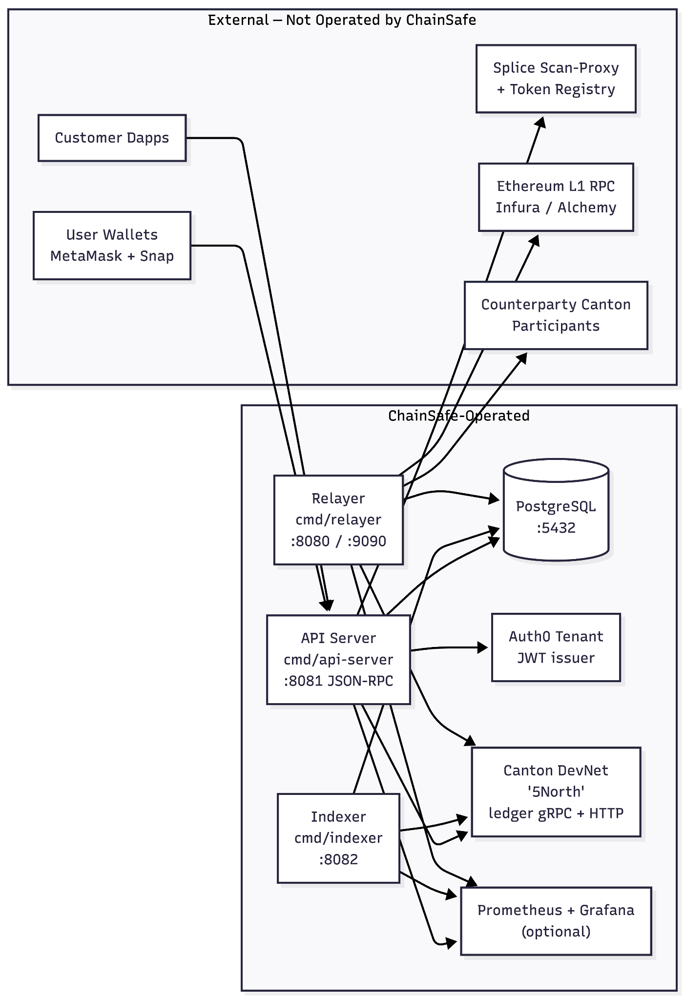
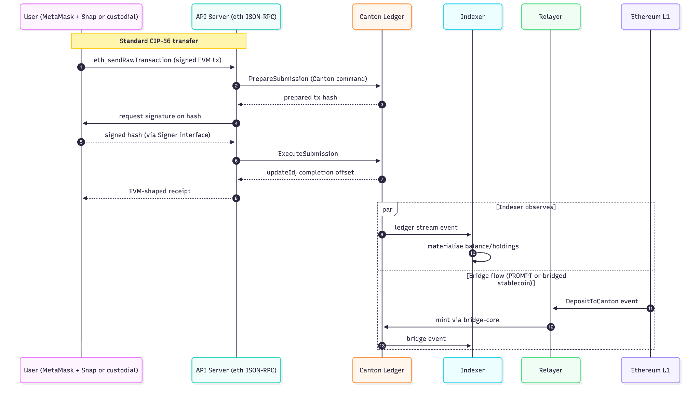

## Development Fund Proposal

**Author:** Eunoia Limited
**Status:** Submitted
**Created:** 2026-06-05
**Label:** token-asset-standards  
**Champion:** Canton Foundation

---

## Abstract

Eunoia Limited (the “Applicant”), with its technical partner Chainsafe Systems Inc, is applying for the following grant re the project listed below.

This project provides Canton Network operators, token issuers, and ecosystem participants with a MetaMask-compatible middleware exposing an Ethereum JSON-RPC facade over CIP-56 token contracts, plus a distributed indexer and an Ethereum↔Canton bridge relayer. The system lets any EVM-native wallet, dapp, or tool interact with Canton-native tokens using familiar Ethereum semantics, while preserving Canton's privacy-preserving ledger model.

This grant application covers the continued development and maintenance of the Canton middleware: an Ethereum JSON-RPC server, a distributed indexer, an Ethereum↔Canton bridge relayer, and the supporting Daml contracts (CIP-56 token, bridge core). Users are onboarded as Canton external parties via EIP-191-signed registration, and Canton transactions are executed through the Interactive Submission API. The result is that any MetaMask user, or any EVM dapp, indexer, or block explorer, can transact against Canton-native tokens through the same RPC surface they already use on Ethereum, while Canton's privacy and finality guarantees are preserved.

The work is structured in two phases:

- **Phase 1: MetaMask-Compatible Middleware for CIP-56 Tokens.** Implement CIP-56 / Splice Token Standard compliant Daml packages (Token, TransferFactory, Events, Config, Compliance), an Ethereum JSON-RPC server that exposes ERC-20 operations through standard EVM contract-call encoding, a Go-based distributed indexer for CIP-56 contract state, and an Ethereum/Canton bridge relayer. The result: any MetaMask user or EVM-native tool can interact with CIP-56 tokens through familiar Ethereum RPC, including bridged stablecoins like USDCx as additional CIP-56 issuances onboard.  
    
  Note: The middleware is built against the current CIP-0056 token standard. CIP-0112 (Canton Token Standard V2) is in Draft status as of 2026-05-22. ChainSafe is tracking the spec and the reference implementation on the splice `token-standard-v2-upcoming` branch in parallel with Phase 2 work. The migration approach, code-reuse estimates, and contingency clause for mid-Phase-2 ratification are detailed in the "CIP-112 Migration Plan" subsection below.  
    
- **Phase 2: Non-Custodial Signing via MetaMask Snap and Institutional Custody Path.** Eliminate the platform as a trust point for end-user signing by shipping a MetaMask Snap that performs Canton Ed25519 signing inside MetaMask's isolated origin, with key material derived from the user's existing MetaMask seed phrase. In parallel, establish an institutional custody path, either through integration with an established custody partner (e.g. Fireblocks, BitGo, Anchorage, Copper) or, if no viable partner is available, through an in-house KMS-backed signer. Both tracks drop into the pluggable signer interface introduced in Phase 1; the choice between custodial, Snap, partner, and KMS becomes a deployment-time configuration rather than a code change.

Middleware deployment is designed for two operational modes:

- **Full Visibility Mode:** For tokens like Canton Coin, where Super Validators have full ledger visibility, the middleware can be operated by validator nodes to provide globally accurate ERC-20 API responses.
- **Scoped Visibility Mode:** For other tokens (e.g., stablecoins or tokenized RWAs), the middleware must be operated by entities with global visibility into the token (e.g., issuers), or by end users for personal visibility. In this mode, functions like `balanceOf` will only work for addresses the operator is authorized to see, ensuring compliance with Canton's privacy model.

Detailed licensing posture, infrastructure topology, audit policy, CIP-112 migration plan, and long-term sustainment commitments are provided in dedicated sections below.

---

## Licensing and Open-Source Posture

All grant-funded deliverables are released under **Apache License 2.0** with full source on public GitHub repositories. No component of the deliverable set is proprietary, source-available-only, or otherwise restricted.

License coverage per deliverable subtree:

- Go middleware (`cmd/`, `pkg/`): Apache 2.0  
- Daml contracts (`contracts/canton-erc20/daml/`, including `cip56-token`, `bridge-core`, `bridge-wayfinder`, and `common`): Apache 2.0  
- Solidity bridge contracts (`contracts/ethereum-wayfinder/` and `contracts/canton-erc20/ethereum/`): Apache 2.0  
- MetaMask Snap (`canton-snap` repository): Apache 2.0  
- Documentation, deployment templates, and reference apps: Apache 2.0

**Explicit non-scope** (infrastructure operations, not grant deliverables): ChainSafe-operated hosted services such as DevNet endpoints, Auth0 tenants, OAuth client secrets, and per-tenant deployment credentials are operational infrastructure. The Docker images, Kubernetes manifests, and configuration templates that describe deployments are in scope as source artifacts; the running deployments are not.

**Third-party dependency disclosure:** a transitive dev/test dependency (`halmos-cheatcodes` under `openzeppelin-contracts` test tooling) is licensed under AGPL-3.0. This dependency is build-time only, used in Solidity test suites, and is not bundled into any distributed binary or contract artifact. The dependency will be replaced or vendor-isolated before Phase 1 acceptance to keep the project's effective license footprint Apache-2.0-compatible end to end.

All released packages will ship `SPDX-License-Identifier` headers, a root `LICENSE` file containing the Apache 2.0 text, and a `NOTICE` file enumerating third-party licenses included in the build.

---

## Infrastructure Topology

ChainSafe operates a small set of services to support development, integration testing, and reference deployments; production deployments for token issuers are stood up by the issuer or their chosen operator using the same images and templates. The two diagrams below distinguish what ChainSafe operates (Diagram A) from how data flows across a representative transaction (Diagram B).

### Diagram A:  Deployment topology

**Caption:** Services inside the "ChainSafe-Operated" boundary are stood up and maintained by the team for the duration of the grant. Production deployments for issuers are stood up by the issuer or their chosen operator from the same source artifacts. The "5North" Canton DevNet is ChainSafe's hosted Canton network used for ecosystem development and testing. Auth0 issues JWTs consumed by the API server. The optional Prometheus \+ Grafana stack is shipped as templates; ChainSafe runs an internal instance for the hosted services.

External components are owned and operated by their respective parties: end users hold their own MetaMask \+ Snap; customer dapps run wherever the customer chooses; the Splice scan-proxy and token registry are part of the Splice ecosystem; Ethereum L1 connectivity uses commercial RPC providers; and Canton counterparty participants are operated by their respective parties under the Canton trust model.

### Diagram B: Data flow

**Caption:** A representative user transaction flows through the API server's JSON-RPC facade, is translated to a Canton Interactive Submission, signed through the pluggable Signer interface (custodial, Snap, or institutional custody), and executed on the Canton ledger. The indexer observes the resulting ledger events to keep its materialised balance and holdings views current. The bridge relayer operates in parallel: deposits on Ethereum L1 are observed and minted as Canton holdings, with the indexer picking up the resulting events through the same path.

---

## Delivery: Phase 1

The grant deliverable is the source code, documentation, and deployable artifacts described below, hosted on public GitHub repositories under Apache 2.0. ChainSafe does not deliver operated infrastructure under this grant; we deliver the code and templates that enable any qualified operator to stand up their own deployment.

### In Scope

- Source repositories: `canton-middleware` (this repo) and `canton-snap`.  
- All Daml packages: `cip56-token`, `bridge-core`, `bridge-wayfinder`, and `common`, plus integration test packages.  
- All Solidity bridge contracts (`ethereum-wayfinder`, `canton-erc20/ethereum`) plus Foundry test suites.  
- All Go source: API server, indexer, relayer, plus Dockerfiles and binary build configurations.  
- TypeScript Snap source plus the npm-published Snap artifact.  
- Documentation: architecture, API reference, integration guides per signer type, threat models, deployment guides.  
- Infrastructure-as-code templates: Docker Compose, Kubernetes manifests, configuration examples for both operational modes.  
- Reference applications and demo scripts (one per signer type, per Phase 2 Deliverable 5).  
- Audit reports for the Snap and the bridge contracts, published under `docs/audits/`.

### Out of Scope

- ChainSafe-operated hosted services: Canton DevNet endpoints (internally "5North"), Auth0 tenant, production endpoint URLs, OAuth client secrets, per-tenant credentials.  
- Customer-specific configuration values for any integrator's deployment.  
- Third-party RPC provider accounts (Infura/Alchemy for EVM, etc.).  
- Custodial-partner integration credentials.  
- Hardware: HSMs, KMS instances, and CI/CD runners (templates and integration code are in scope; the physical or cloud instances are not).  
- Operational support and on-call coverage for any deployment not contractually engaged separately.

The project will deliver the following components and capabilities:

### Architecture & Design Documentation

- System architecture diagram describing interactions between:  
  - On-ledger Daml contracts (relayer and CIP-56 token)  
  - Off-ledger API server exposing Ethereum JSON-RPC and orchestrating Canton Interactive Submission flows  
  - Go indexer materialising CIP-56 contract state for balance/holdings/event queries  
- API interface schemas for the ERC-20-compatible middleware.  
- Security and privacy model, including:  
  - Middleware operation under Canton's visibility constraints (global vs partial observability)  
  - Access control patterns for issuer-hosted and user-hosted middleware deployments

### DAML Contracts (CIP-56 / Splice Token Standard Compliant)

Implementation of CIP-56-compliant Daml packages, structured as:

- `cip56-token`: `Token.daml`, `TransferFactory.daml`, `Events.daml`, `Config.daml`, `Compliance.daml`, implementing the Splice Token Standard (HoldingV1, TransferFactory) with DNS-prefixed metadata keys (e.g. `splice.chainsafe.io/symbol`).  
- `bridge-core`: Daml contracts modelling the Canton side of the Ethereum↔Canton bridge, used to lock/unlock and mint/burn future bridged assets.  
- `common`: shared utilities including fingerprint-based authorization (`FingerprintAuth.daml`) for external-party flows.  
- Approve/transferFrom semantics are exposed at the JSON-RPC layer, mapped onto Canton's TransferFactory and signed-instruction model rather than implemented as standalone allowance contracts (consistent with how Splice canonically models authorization in CIP-56).  
- Unit and integration test suites under `cip56-token-tests/`, `bridge-core-tests/`, and `integration-tests/`, validated against Canton mainnet.

### ERC-20 Middleware API Layer

- Ethereum JSON-RPC server compatible with MetaMask and the broader EVM tooling ecosystem (block explorers, indexers, dapps). Method surface includes `eth_chainId`, `eth_blockNumber`, `eth_gasPrice`, `eth_estimateGas`, `eth_getBalance`, `eth_getTransactionCount`, `eth_getCode`, `eth_call`, `eth_sendRawTransaction`, `eth_getTransactionReceipt`, `eth_getTransactionByHash`, `eth_getLogs`, `eth_getBlockByNumber`, `eth_getBlockByHash`, plus `net_*` and `web3_*` namespaces. ERC-20 operations (`transfer`, `transferFrom`, `approve`, `balanceOf`, `allowance`, `totalSupply`) are reachable through standard contract-call encoding via `eth_call` / `eth_sendRawTransaction`, exactly as on Ethereum.  
- Transaction Orchestration Engine that maps EVM transactions to Canton Interactive Submission flows: decode EVM calldata → construct Canton Ledger API commands against CIP-56 contracts → PrepareSubmission → sign with the user's custodial Canton key → ExecuteSubmission → return an EVM-shaped transaction receipt.  
- Identity, registration, and session management:  
  - User registration via EIP-191-signed payloads, with per-user external-party allocation on Canton.  
  - JWT-based session management for the JSON-RPC server, plus EVM-signature verification for transaction submission.  
  - Custodial key management (`pkg/keys/`): secp256k1 user keys at rest, AES-256-GCM encrypted, used to sign Canton Interactive Submission payloads on behalf of the user. Architecture is structured to allow a future non-custodial signing path (MetaMask Snap or KMS-backed) without protocol changes.  
  - Splice Registry client (`pkg/registry/`) for discovering wallet TransferFactory contracts.  
- Contract State Resolver to resolve token and holding contract states, including UTXO composition for transfers.  
- Visibility-Aware Execution Logic, which allows middleware to operate in "full visibility" (issuer/operator) and "partial visibility" (end-user) modes, returning appropriate errors for unauthorized queries.  
- Deployment infrastructure (Docker, Kubernetes, IaC) and observability components for both operational modes.

### Indexer

- Indexer Core Service that subscribes to Canton Ledger API or Canton Sync Service for all relevant token-related events (contract creations/archivals).  
- Database Schema & Storage Engine (PostgreSQL or equivalent), optimized for real-time token state queries and immutable audit trails.  
- Deterministic Indexing Logic to maintain consistent balance and allowance views from distributed UTXO contract state.  
- Query API Layer for exposing token state to middleware and clients in a format analogous to standard ERC-20 calls.

## Deliverables

### Phase 1: ERC-20 Middleware & Indexer for CIP-56 Tokens

The objective is to implement and deliver an end-to-end ERC-20 interface middleware for a concrete CIP-56 Splice compliant token (such as USDCx) on Canton, tested in a controlled environment. This includes an ERC-20-compatible middleware API, a supporting distributed indexer, and a concrete Canton-compatible token template.

The work in Phase 1 will be divided into the following key deliverables:

### Deliverable 1: Architecture & Design document

- **Scope:**  
  - System architecture diagram describing interactions between Daml contracts, middleware, and indexer.  
  - Data flow specifications outlining how token state changes propagate across layers (ledger → indexer → API).  
  - Interface definitions and API schemas (OpenAPI spec or gRPC IDL) for ERC-20 middleware endpoints.  
  - Security and privacy model detailing identity mapping, authorization flow, and data access restrictions.  
- **Estimated resources:**  
  - Engineering: 4 weeks  
  - Project Management: 1 week  
- **Estimated duration:** 2 weeks

### Deliverable 2: Daml CIP-56 Token \+ Bridge Contracts

- **Scope:**  
  - **CIP-56 / Splice Token Standard compliant Daml packages**: `cip56-token` (Token, TransferFactory, Events, Config, Compliance) reference token implementation.  
  - **Bridge Daml packages**: `bridge-core` (lock/unlock/mint/burn state machine).  
  - **Shared modules**: `common/FingerprintAuth.daml` and supporting types/utilities for external-party authorization.  
  - **ERC-20 semantics** (`transfer`, `approve`, `transferFrom`, `balanceOf`, `allowance`, `totalSupply`, `mint`, `burn`) exposed through the JSON-RPC layer and mapped to TransferFactory / signed-instruction flows rather than via a standalone allowance template.  
  - Unit and integration test suites against Canton mainnet.  
- **Estimated resources:**  
  - Engineering: 4 weeks  
  - Project Management: 1 week  
- **Estimated duration:** 2 weeks

### Deliverable 3: Middleware Service (Ethereum JSON-RPC API \+ supporting libraries)

- **Scope:**  
  - **Ethereum JSON-RPC API Server** (`pkg/ethrpc/`, `cmd/api-server/`): MetaMask-compatible JSON-RPC server implementing the `eth_*`, `net_*`, and `web3_*` method namespaces required for EVM wallet, dapp, indexer, and explorer interoperability.  
  - **Transaction Orchestration Engine**: EVM-calldata → Canton-command translation, executed via Interactive Submission (PrepareSubmission → sign → ExecuteSubmission).  
  - **Identity, Auth, and Onboarding**: user registration via EIP-191 signatures, external-party allocation, JWT session management, EVM-signature verification (`pkg/auth/`, `pkg/registration/`).  
  - **Pluggable Signer interface** (`pkg/cantonsdk/token/types.go`) with signature `SignDER(message []byte) ([]byte, error)` and `Fingerprint() (string, error)`, wired through a `KeyResolver` callback in `pkg/app/api/server.go` so signer implementations are selected at API server initialization time. Phase 1 ships one concrete implementation (`CantonKeyPair` in `pkg/keys/canton_keys.go`) backed by custodial secp256k1 keys with AES-256-GCM encryption at rest. The interface is designed to accept additional implementations without orchestrator changes: Phase 2 adds Snap-backed and institutional-custody-backed signers behind the same interface, selectable per deployment, per tenant, or per user.  
  - Splice Registry client (`pkg/registry/`) for wallet TransferFactory discovery.  
  - **Contract State Resolver**: token \+ holding \+ bridge state resolution for transaction construction and EVM-shaped receipts.  
  - **Indexer Integration Adapter**: balance, holdings, and event queries served from the indexer backend.  
  - **Infrastructure as Code**: containerisation (Docker), Kubernetes manifests, configuration, observability.  
- **Estimated resources:**  
  - Engineering: 8 weeks  
  - DevOps: 1 week  
  - Project Management: 2 weeks  
- **Estimated duration:** 4 weeks

### Deliverable 4: Indexer Backend Service

- **Scope:**  
  - **Indexer Core Service** (`pkg/indexer/`, `cmd/indexer/`), written in Go for stack consistency, subscribing to Canton Ledger API and processing CIP-56 token \+ bridge contract lifecycle events (Holding creations/archivals, TransferFactory choices, Offer events).  
  - **Database & Storage**: PostgreSQL, optimised for real-time balance/holdings/allowance queries and immutable audit trails.  
  - **Deterministic Aggregation**: UTXO-style holdings rolled up deterministically into total supply, per-party balance, and per-token allowance views.  
  - **Query API**: HTTP query layer exposing balance, holdings, allowance, supply, and event queries to the JSON-RPC server and external consumers.  
  - **Distributed Operation**: deployable per node so each operator can run its own indexer scoped to its visibility.  
  - **Infrastructure as Code**: containerisation, Kubernetes manifests, observability.  
- **Estimated resources:**  
  - Engineering: 6 weeks  
  - DevOps: 1 week  
  - Project Management: 1.5 weeks  
- **Estimated duration:** 3 weeks

### Deliverable 5: EVM/Canton Bridge and Relayer

- **Scope:**  
  - **Relayer service** (`pkg/relayer/`, `cmd/relayer/`) implementing a generic Processor with Source/Destination adapters for both Canton and Ethereum, enabling bidirectional token movement.  
  - **Canton bridge Daml contracts** (`bridge-core`) for the on-ledger side of locking/unlocking and minting/burning bridged tokens.  
  - **Ethereum bridge contracts** for the EVM side.  
  - **Bridge state store** (`pkg/db/`) tracking transfers, chain state, and nonces.  
  - **Reference bridged asset:** PROMPT (ERC-20 ↔ CIP-56 holding).  
  - Unit, integration, and end-to-end test suites including local bootstrap (`scripts/testing/bootstrap-local.sh`) running Canton \+ Anvil \+ middleware \+ relayer in concert.  
- **Estimated resources:**  
  - Engineering: 8 weeks  
  - Project Management: 1 week  
- **Estimated duration:** 4 weeks

### Deliverable 6: Integration Testing & Demo

- **Scope:**  
  - End-to-End Functional Test Suite: Comprehensive automated tests validating all ERC-20 operations.  
  - Scenario-Based Daml Simulations: Integration of test scripts that simulate realistic user flows.  
  - Mock Frontend / CLI Demo Application: A lightweight web UI or command-line interface that showcases ERC-20 usage.  
- **Estimated resources:**  
  - Engineering: 2 weeks  
  - Project Management: 0.5 weeks  
- **Estimated duration:** 2 weeks

### Deliverable 7: Documentation & User Guide

- **Scope:**  
  - Developer Integration Guide: for third-party developers on how to interact with the middleware, including API endpoints, authentication flows, example payloads, and token operations.  
  - API Specs: documentation of all ERC-20-compatible endpoints, suitable for inclusion in SDKs or third-party tooling.  
- **Estimated resources:**  
  - Engineering: 1 week  
  - Project Management: 0.5 weeks  
- **Estimated duration:** 1 week

## Phase 2: Non-Custodial Signing and Institutional Custody Path

The objective of Phase 2 is to ship the two signing surfaces that the Phase 1 architecture was structured to support: a MetaMask Snap that gives retail users a truly non-custodial Canton signing experience inside their existing wallet, and an institutional custody path for issuers and counterparties who require external, audited custody, either through a partnership with an established custodian or through an in-house KMS-backed signer.

Phase 1 chose the Canton Interactive Submission API precisely so the signing surface could be swapped without protocol changes. The same orchestration pipeline that signs with a server-held custodial key in Phase 1 will, by the end of Phase 2, additionally support browser-side signing inside a MetaMask Snap and signing through a custody partner's API or a cloud KMS.

The institutional track is dual-path by design: ChainSafe will begin Phase 2 with a structured evaluation of established custody providers and pursue partnership integration as the preferred outcome (lower implementation risk, established compliance posture, faster path to enterprise adoption). If no viable partnership is reached on commercially or technically acceptable terms, the same deliverable budget produces an in-house KMS-backed signer against a major cloud provider. Both paths terminate at the same internal signer interface, so the rest of the middleware remains unchanged.

## Phase 2 Deliverables

### Deliverable 1: Architecture & Design Refresh

- **Scope:**  
  - Updated architecture diagrams covering the pluggable signer interface and each of its implementations (custodial, Snap, custody partner, KMS).  
  - Snap signing flow: browser → Snap → API server → Canton Interactive Submission. Deterministic Canton-party derivation from the MetaMask seed phrase, including new-device recovery.  
  - Institutional custody flow: API server → custody partner API (or KMS) → Canton Interactive Submission. Per-key authorization policies, audit logging, operational runbooks.  
  - Threat model for each signing path, including supply-chain considerations for the Snap and key-policy considerations for the institutional path.  
  - Custody partner evaluation framework: capability checklist (Ed25519 support, programmatic signing, latency, audit log access, jurisdictional coverage, compliance posture), commercial criteria, and go/no-go decision gate for the in-house KMS fallback.  
  - **Custodian-status disclosure:** at the time of grant submission, ChainSafe has not engaged any custody partners. The evaluation framework above runs in the first four weeks of Phase 2\. Candidate providers in the evaluation set include Fireblocks, BitGo, Anchorage Digital, and Copper; this is the set ChainSafe will approach during evaluation and is not a list of existing engagements.  
- **Estimated resources:**  
  - Engineering: 3 weeks  
  - Project Management: 1 week  
- **Estimated duration:** 2 weeks

### Deliverable 2: MetaMask Snap for Canton Signing

- **Scope:**  
  - MetaMask Snap package providing Ed25519 signing for Canton transactions, with key material derived deterministically from the user's existing MetaMask seed phrase and stored inside MetaMask's isolated origin (so the user's existing seed-phrase recovery flow also recovers the Canton party).  
  - Snap integration with the API server: the server returns prepared transaction hashes from PrepareSubmission, the Snap signs them inside MetaMask, the server submits via ExecuteSubmission. No private key ever touches the server, no key file ever touches the user's disk or browser storage.  
  - Browser onboarding flow: install Snap, allocate external party from the Snap-derived public key, register with the API server, recover on a new device via the standard MetaMask seed-phrase restore.  
  - Snap distribution: published to the MetaMask Snap registry; versioned, signed, user-confirmed updates.  
  - Snap test suite covering signing correctness, key derivation determinism, signing-UX prompts, and cross-device recovery.  
- **Estimated resources:**  
  - Engineering: 8 weeks  
  - Project Management: 1 week  
- **Estimated duration:** 4 weeks

### Deliverable 3: Institutional Custody Integration

- **Scope:** splits into two tracks.  
    
  **Track A (preferred): Custody partner integration**  
    
  - Structured evaluation of the candidate provider set (Fireblocks, BitGo, Anchorage Digital, Copper, plus any further providers identified during scoping) against the Deliverable 1 framework, including direct technical conversations and reference checks. If no candidate meets the framework on commercially or technically acceptable terms within the first four weeks of Phase 2, the team transitions to Track B without a budget shift or schedule slip.  
  - Partnership selection and integration agreement.  
  - Implementation of the signer interface against the selected partner's API, including key provisioning, signing, audit log retrieval, and operational tooling.  
  - Per-tenant key isolation and policy configuration appropriate to the partner's model.  
  - Integration tests against the partner's sandbox; staged rollout against a non-production tenant.

  **Track B (fallback): In-house KMS-backed signer**

  - Implementation of the signer interface against at least one cloud KMS (AWS KMS as primary target), with the abstraction structured so a second provider can be added without rework.  
  - Per-user / per-issuer key isolation inside the KMS, with policy-bound key usage and tamper-evident audit logging.  
  - Operational tooling for key lifecycle (provision, rotate, deprecate).  
  - Integration tests against a live KMS instance; unit tests against mocked KMS clients.

- **Estimated resources:**  
    
  - Engineering: 6 weeks  
  - Project Management: 1 week

- **Estimated duration:** 3 weeks

### Deliverable 4: Integration Testing, Security Review, and Demo

- **Scope:**  
  - End-to-end test suites covering: custodial path (regression from Phase 1), Snap signing path, institutional custody path (whichever track was selected in Deliverable 3), and mixed-mode deployments where different user populations use different signers.  
  - Independent third-party security review covering: the Snap (code, key derivation against BIP-44 m/44'/60'/1'/0/0, DER signing flow, dialog prompts, supply-chain posture of `package.json` and lockfile, `snap.manifest.json` permission scope); the institutional signing integration (key handling, audit-log integrity, configuration safety, per-tenant isolation); and the cross-mode regression suite. Findings remediated before Phase 2 acceptance. Full audit report published under `docs/audits/` in the relevant repository and linked from the Snap registry listing. Detailed audit cadence and re-audit triggers are described in the "Audit Policy and Cadence" section below.  
  - Reference demo (extension of Phase 1's `bootstrap-local.sh`) showing a MetaMask user installing the Snap, registering an external party, and transacting a CIP-56 token without the platform ever holding the signing key; plus a separate flow demonstrating signing against the institutional custody path.  
- **Estimated resources:**  
  - Engineering: 3 weeks  
  - Project Management: 1 week  
- **Estimated duration:** 2 weeks

### Deliverable 5: Documentation and Integrator Guides

- **Scope:**  
  - **Reference dapp per signer mode:** one minimal end-to-end reference application demonstrating each signer mode (custodial, Snap, institutional custody / KMS). Each reference app exercises register, sign, submit, and query against a CIP-56 token, intended as the canonical integration example for that signer type.  
  - Snap user guide: install, recover, troubleshoot.  
  - Snap integration guide for dapp developers: detect, request signing, handle recovery.  
  - Institutional custody deployment guide: partner onboarding (if Track A) or KMS provisioning (if Track B), key isolation policies, audit configuration.  
  - Updated API reference covering Phase 2 additions (signer selection, multi-mode routing).  
  - Threat-model summary documents per signing path, suitable for sharing with risk-conscious integrators.  
- **Estimated resources:**  
  - Engineering: 2 weeks  
  - Project Management: 0.5 weeks  
- **Estimated duration:** 1 week

---

## CIP-112 Migration Plan

CIP-0112 ("Canton Network Token Standard V2") is a backwards-compatible evolution of CIP-0056 introducing a new EventLog interface for transaction parsing, committed allocations and iterated settlement, non-holder Account destinations for clean mint/burn semantics, privacy-preserving batch settlement, and a pause-status metadata flag. V2 ships as new major-version `splice-api-token-*` packages alongside V1, so V1 implementations continue to operate untouched.

The middleware's Phase 1 architecture is structured to make V2 dual-interface delivery a focused refactor rather than a rewrite. Concrete reuse estimates per layer:

| Layer | V1 → V2 reuse | Coupling | Notes |
| :---- | :---- | :---- | :---- |
| Daml `cip56-token` packages | \~40% | Tight | Field names and interface instantiations are V1-bound; contract logic patterns survive. |
| Indexer (`pkg/indexer/engine/`) | \~70% | Medium-loose | Decoder pattern is structural; event field renames are the main lift. |
| Middleware orchestration (`pkg/ethrpc/`, `pkg/transfer/`) | \~60% | Medium | Module/entity/choice names are V1-specific; the prepare/execute flow is V-agnostic. |
| Bridge contracts (`bridge-core`) | \~30% | Tight | Mint/burn calls are V1-coupled; flow patterns survive. |

**Migration approach:** V1 and V2 packages run in parallel via Daml module-prefixes (consistent with the design guidance in `contracts/canton-erc20/docs/middleware-bridge-architecture.md`). The indexer gains a V2-aware decoder reusing the existing decoder pattern with V2 field names. The middleware orchestrator gains a V2 command builder alongside the V1 builder, selected per token at runtime based on the token's advertised compatibility (per CIP-0112 §5.2).

**Effort window** for core dual-interface delivery: 4-6 weeks of engineering with the parallel-packages approach; 10-12 weeks for a clean-room rewrite (not recommended).

**Contingency clause:**

- If CIP-0112 is ratified during Phase 2, ChainSafe pulls V2 dual-interface delivery forward into the back half of Phase 2 in coordination with Foundation timing, funded out of the existing Phase 2 budget envelope.  
- If ratification slips past the end of Phase 2, V2 work begins in Maintenance Year 1 as currently scoped, with the same 4-6 week core effort.

**V2 features that align directly with the middleware's existing architecture and the ecosystem direction:**

- The V2 `EventLog_HoldingsChange` interface gives the indexer a cleaner, filterable event stream and simplifies the EVM-shaped log emission for `eth_getLogs`.  
- Committed allocations and iterated settlement standardize a primitive that maps directly onto x402 facilitator and pre-funded payment flows.  
- Non-holder Account destinations let bridge mint/burn use the standard transfer/allocation flows instead of a custom state machine.

---

## Audit Policy and Cadence

The middleware delivers several security-critical components: an API server brokering signing and Canton submission, a relayer holding and moving bridge funds, an indexer that serves as the source of truth for balance queries, on-chain DAML contracts that custody value directly, and as of Phase 2 a MetaMask Snap loaded into the user's wallet. ChainSafe commits to a comprehensive audit posture across the entire stack, including the snap.

### Pre-release audit for the MetaMask Snap

Before any release of the `canton-snap` package to the MetaMask Snap registry, an independent third-party security audit will cover:

- Key derivation correctness against BIP-44 `m/44'/60'/1'/0/0` and the documented derivation rationale.  
- Signing flow correctness: DER encoding correctness, absence of key or signature leakage to the host page, correct handling of the prepared transaction hash.  
- Dialog-prompt UX: no signing operation executes without explicit user confirmation; prompts present accurate and unambiguous transaction information.  
- Supply-chain posture: `package.json` and lockfile review, pinned cryptographic dependency versions, build reproducibility.  
- `snap.manifest.json` permission scope: minimum-required permissions declared (`snap_getEntropy`, `snap_dialog`, `snap_manageState`) with justification.

### Full Middleware stack audit

In parallel with the Snap audit, an independent third-party security audit of the full middleware stack will cover:

- **API server** (`pkg/ethrpc/`, `cmd/api-server/`): the JSON-RPC method surface, the Interactive Submission orchestration (PrepareSubmission, signing, ExecuteSubmission), session and authentication handling, the EIP-191 registration flow, custodial key handling, and the AES-256-GCM at-rest key storage path.  
- **Relayer** (`pkg/relayer/`, `cmd/relayer/`): the bidirectional Source/Destination engine, bridge state machine, nonce tracking, chain reorg handling, and on-chain event consumption logic.  
- **Indexer** (`pkg/indexer/`, `cmd/indexer/`): event ingestion correctness, deterministic balance and holdings aggregation, visibility-scoped query semantics, and database integrity.  
- **Daml contracts** (`cip56-token`, `bridge-core`), reviewed by a Daml-fluent auditor (Digital Asset, Sygnum, or equivalent specialist): the token authorization model, TransferFactory semantics, Compliance hooks, and bridge mint and burn governance.  
- **Cross-component integration**: the boundary between the API server and the Canton ledger, between the relayer and both chains, and between the indexer and the API server, validated as a single attack surface rather than per-component in isolation.

Findings from any of the above audits are remediated before the corresponding deliverable is accepted, and full audit reports are published.

### Published artifacts

All audit reports are published under `docs/audits/` in the relevant repository, with the report version and audit date linked from the package README and the Snap registry listing. Reproducible-build instructions are published alongside each release.

---

## Timing and Financials

The grant is structured as an initial build phase with a follow-up two-year maintenance period. The maintenance period will begin immediately after Phase 2 is complete and accepted.

| Deliverable | Token Amount |
| :---- | :---- |
| Phase 1 | 15mil |
| Phase 2 | 5mil |
| Maintenance Year 1 | 10mil |
| Maintenance Year 2 | 10mil |

### Long-Term Sustainment (Post-Year 2\)

Beyond the end of Maintenance Year 2, The Applicant commits to ongoing best-effort upkeep of the middleware as open infrastructure. This includes:

- Security patches in response to disclosed CVEs in the dependency tree or in the middleware itself, on a triage cadence aligned with severity.  
- Critical bug fixes affecting correctness of token operations, bridge flows, or signing paths.  
- Tracking of Canton Improvement Proposals affecting CIP-56 / CIP-112 token semantics, with timely compatibility updates as the standards evolve.

This baseline commitment is funded by the Applicant out of pocket and continues indefinitely. The GitHub repositories remain public and Apache 2.0-licensed indefinitely; Docker images and published artifacts (including the MetaMask Snap on the registry) remain available; documentation remains accessible. The Applicant will not lock out downstream operators, relicense to a closed model, or remove published artifacts.

Beyond the baseline, two options remain open for the Foundation and ecosystem to consider closer to the end of Year 2:

- **Foundation-funded maintainer rotation**, under which the repository becomes Foundation-stewarded with a rotating maintainer schedule across ecosystem contributors.  
- **A ChainSafe paid-SLA tier** funded by issuers or operators who require guaranteed response times for production deployments.

The applicant  is happy to discuss either path with the Foundation or ecosystem operators when the time comes; neither is a precondition for the baseline sustainment commitment above.

