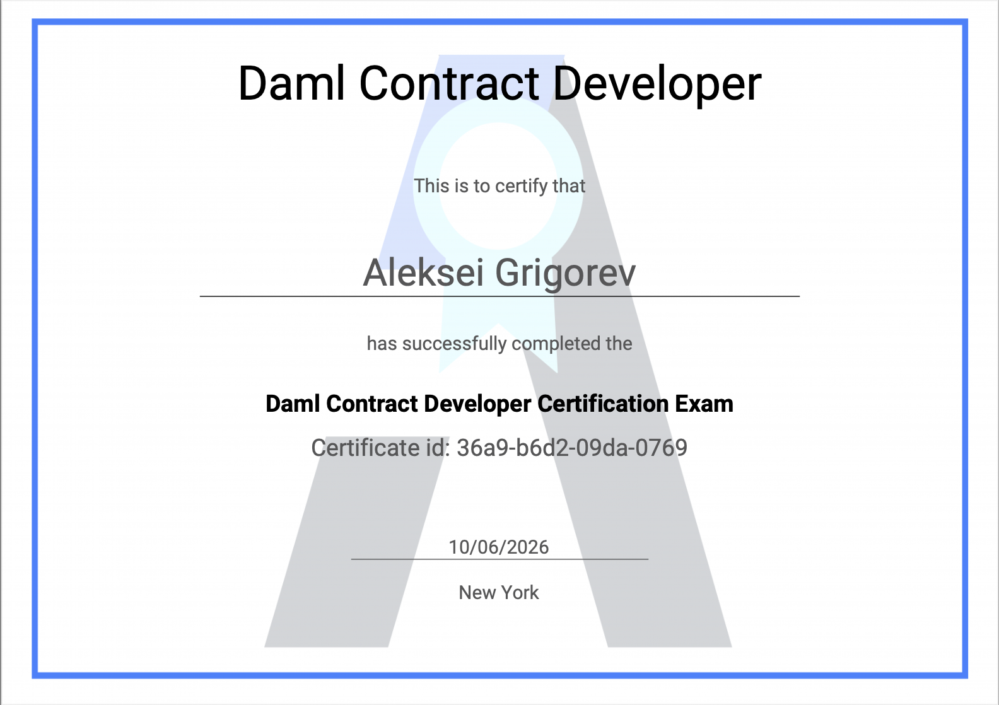

## **Development Fund Proposal**

**Author:** Victor Dymov\
**Status:** Submitted 

**Created:** 2026-06-23\
**Label:** DeFi Protocols & Liquidity

**Champion:** Akibalogh

***

## **Abstract**

**Cross-Chain Bridging & Aggregation for Canton Network with Multihop Routing**

This integration connects Canton to Rubic's aggregation infrastructure, giving developers a ready-made DeFi tooling layer for building on Canton without starting from scratch.

For builders, this means same-chain and cross-chain swap functionality is available through a single API – no need to integrate individual DEXs, maintain bridge logic, or build routing infrastructure in-house. Rubic handles that layer, so Canton projects can focus on their core product.

As a key part of the integration, Rubic will implement multihop swaps for Canton, enabling efficient any-to-any token exchanges through optimized routing. Custom smart contracts and a dedicated routing mechanism will be developed to support this functionality. New liquidity providers can be plugged in over time without rebuilding infrastructure, making this an extensible foundation for Canton's DeFi ecosystem.

Rubic's integration is built with openness and developer accessibility in mind. The smart contracts are open-source and publicly verifiable under the MIT License. Frontend implementations and integration examples are openly available under the GPL-3.0 License, so Canton builders can inspect, adapt, and build on top of what's already there. The aggregation backend follows the same closed-infrastructure model standard across the industry – what's open is the part developers actually integrate with.

This removes integration overhead, unifies liquidity access, and gives the Canton ecosystem a shared infrastructure layer that any project can build on.

**Video:** [**https://www.youtube.com/watch?v=Kqb2ZpbdFBE\&ab\_channel=Rubic**](https://www.youtube.com/watch?v=Kqb2ZpbdFBE\&ab_channel=Rubic) 

***

## **Specification**

### **Objective**

Integrate Canton Network into Rubic's cross-chain routing engine, enabling seamless token swaps between Canton and EVM-compatible blockchains via multi-hop routing across aggregated DEX and bridge providers expanding Canton's accessible liquidity beyond its native ecosystem.

### **Implementation Mechanics**

**2.1 System Architecture**

Rubic's routing engine decomposes any swap into a sequence of atomic steps — on-chain DEX swaps, bridge transfers, and token wrapping — selecting the optimal provider combination based on output amount, slippage, and execution cost. It supports 340+ providers across 50+ chains.

The Canton integration extends this architecture with a dedicated **Canton Aggregator API** — a standalone backend service handling all Canton-specific concerns: token metadata resolution, quote aggregation, transaction construction, and status tracking. The existing Rubic API delegates Canton logic to this service internally, isolating Canton's unique privacy and ledger access model from the existing routing stack.

Core components:

- **Canton Aggregator API** — Canton-specific backend service

- **Token registry module** — resolves instrument metadata via Digital Asset Utilities API

- **Quote aggregation layer** — concurrent provider querying with timeout enforcement and route ranking

- **Transaction builder** — constructs unsigned Ledger API command payloads for Canton-side legs

- **Status tracker** — polls bridge providers for cross-chain transaction state

- **DAML fee contracts** — on-chain fee collection deployed on Canton

- **Rubic API integration layer** — connects the existing routing engine to the Canton Aggregator API

**2.2 Token Metadata & Indexing**

Canton does not expose a universal RPC or scan API. Token metadata is resolved via the Digital Asset Utilities API and Token Standard registry — the canonical source for instrument identifiers, admin IDs, symbols, and decimal precision. Rate data is sourced in real time from Canton DEX providers and fed into the quote aggregation layer for concurrent ranking.

**2.3 Wallet Connectivity & Ledger Access**

Canton stores all balance, holding, and contract state exclusively on the user's participant node — inaccessible to external services or scan APIs. The integration handles this through a per-request credential model: the user's wallet exposes a partyId, ledgerApi endpoint, and JWT, passed with each request to the Canton Aggregator API. The backend uses these to query balances and construct unsigned transaction payloads via the Canton Ledger API. The client retains signing and submission responsibility.

A secondary constraint governs transfers: execution requires either a valid TransferPreapproval or open Holding on the recipient side. Since Holding state is private, the integration surfaces a wallet check notification when consent status cannot be verified — consistent with the pattern used by Utexo and HIFI.

**2.4 Provider Coverage**

The list of supported on-chain and cross-chain providers is indicative and subject to change. Coverage may be expanded, adjusted, or updated over time as new integrations are added and existing ones evolve.

_Cross-chain bridges:_

- USDC xReserve (Circle) — USDC ↔ USDCx (Ethereum ↔ Canton)

- Bitsafe Bridge — BTC ↔ CBTC

- CEX deposit providers (existing Rubic integrations): Houdini, ChangeNow, Changelly, Exolix, SimpleSwap — Canton native token

_On-chain DEXs (Canton):_

- OneSwap, TradeCraft, Trade.Fast, Kairo, Cantex, and others

Each provider is integrated against its published API. Quotes are dispatched concurrently; non-responding providers are excluded within a bounded timeout. Where a provider does not support cross-chain message passing, the swap is split into discrete steps requiring separate user signatures, surfaced explicitly in the transaction payload.

**2.5 Multihop Routing & Fee Contracts**

The routing engine chains atomic operations across providers to enable any-to-any swaps without requiring a direct liquidity pool. Canton-side steps use Ledger API command structures; EVM-side steps use standard contract calls. The transaction builder produces a structured payload per step for sequential client execution.

_Example: ETH (Ethereum) → CBTC (Canton):_

1. _On-chain swap: ETH → USDC on Ethereum_

2. _Bridge: USDC → USDCx via USDC xReserve (Circle)_

3. _On-chain swap: USDCx → CBTC via Bitsafe on Canton_

Fee collection is implemented as DAML contracts on Canton — producing auditable on-chain records native to Canton's contract environment.

**2.6 Operational Approach**

The Canton Aggregator API is stateless and horizontally scalable. All provider clients operate asynchronously with per-provider timeout enforcement. Quote identifiers are short-lived and cached server-side. Provider failures are scoped — a timeout from one provider excludes it from the current result without affecting others. The status tracker covers the full transaction lifecycle from submission through delivery or failure. Route fallback logic re-evaluates available routes if the primary path becomes stale between quote and swap execution.

**2.7 Developer & Analytics Access**

Upon mainnet launch, Canton swaps are accessible via the Rubic API, enabling wallets, trading bots, and DEX frontends and other apps with swaps functionality to route Canton swaps without rebuilding aggregation infrastructure. On-chain volume and routing activity are tracked via Dune dashboards, DefiLlama, and DappRadar from day one.

3. ### **Architectural Alignment**

**DAML-native execution.** Fee collection and swap execution logic for Canton legs are implemented as DAML contracts. Canton's smart contract model is built on DAML as the native execution environment — introducing off-chain or EVM-style fee mechanisms would be architecturally inconsistent with how Canton applications are built and audited. DAML contracts enforce authorization rules at the ledger level: only designated parties can exercise fee-collecting choices, and every fee event produces an immutable, auditable ledger record. This is not a cosmetic choice — it means fee logic is subject to the same privacy, authorization, and upgrade guarantees as any other Canton-native contract, and is legible to institutional participants and Canton tooling without additional translation layers.

**Ledger API as the canonical access pattern.** Canton's privacy model is not a limitation to work around — it is a design principle to build with. The per-request wallet credential model adopted here (partyId, ledgerApi, JWT) is the canonical method for interacting with Canton's privacy-preserving ledger, as defined by the Canton participant node architecture. This means user balance resolution, transaction construction, and state queries all operate through the user's own participant node — preserving sub-transaction privacy guarantees by design. Alternative approaches, such as centralized balance indexing or proxy node patterns, would violate Canton's privacy model and are explicitly not used. This alignment is consistent with how Canton-native applications such as Utexo and HIFI handle user-facing transaction flows.

**TransferPreapproval and Holding as first-class integration constraints.** Canton's token transfer model requires explicit on-ledger consent from the recipient — either a TransferPreapproval or an open Holding. This is a deliberate privacy and authorization feature of the Canton token standard, not an edge case. The integration treats these as first-class constraints: TransferPreapproval state is checked via the Scan API before route construction, and the UX layer handles the case where consent cannot be confirmed, rather than allowing silent transaction failures. This reflects a correct understanding of the Canton token standard and how it differs from EVM token transfer models.

**Additive liquidity infrastructure, not a competing layer.** Rubic operates as a meta-aggregator and does not deploy or operate liquidity pools on Canton. All on-chain swap volume is routed to Canton-native protocols — OneSwap, CantonSwap, TradeCraft, and Bitsafe. The integration increases utilization of existing Canton liquidity infrastructure and expands its accessible market by connecting it to capital across 50+ EVM chains, without displacing or competing with Canton-native participants. This makes Rubic a natural infrastructure provider for the Canton ecosystem rather than a competitive actor within it.

**Cross-chain liquidity as a stated ecosystem priority.** The Canton Network Foundation has identified cross-chain liquidity access as a key growth vector. The current state requires users to navigate multiple disconnected bridge interfaces to move capital from EVM chains to Canton — each with its own UX, token support limitations, and no route optimization. This integration addresses that directly: a unified routing layer that aggregates all available Canton bridge and DEX providers, selects optimal paths, and exposes the result through a single API. From day one, on-chain volume is measurable via Dune, DefiLlama, and DappRadar — providing the Canton ecosystem with transparent, verifiable evidence of cross-chain liquidity traction.

**CIP-0082 alignment.** The Development Fund was established to support developer tools and shared infrastructure that benefit the broader Canton ecosystem. A production-grade aggregation layer — openly accessible via API, routing volume to Canton-native protocols, handling Canton's privacy and authorization constraints correctly, and lowering the barrier for wallets and platforms to integrate Canton — is shared infrastructure in the same sense that bridges and DEX contracts are. It reduces the integration cost for every team building on Canton without requiring each to independently implement and maintain the same routing, provider aggregation, and cross-chain status tracking logic. 

***

## **Milestones and Deliverables**

**Milestone 1: Initial Canton Integration & Routing Foundation**

**Chain Integration**\
Integrate Canton into Rubic — connect Ledger API, build transaction layer, parse tokens, fetch rates, and finalize Architecture Decision Record (ADR), including DEX selection (e.g., OneSwap, TradeCraft, Kairo, Cantex, etc).

**Provider Integration**\
Scope definition and integration of existing Rubic semi-centralized deposit providers (e.g., Houdini, ChangeNow, Changelly, Exolix, etc).

**Provider Integration (DEX Layer)**\
Begin onboarding selected Canton DEX(es) as Rubic providers, set up access to quote and routing layers.

**Canton Aggregator API: Phase 1 + Multihop Design**\
In parallel, the team begins development of the Canton Aggregator API with best-quote finder logic and designs the initial multihop routing engine for any-to-any token exchanges within Canton.

**Acceptance Criteria:** Payment 1 is released upon Canton token data and rates displayed in the development environment, selected DEXes confirmed, and the Canton Aggregator API handling basic one-chain routing with a documented multihop architectural design.

_Timeline: 4 weeks_

***

**Milestone 2: Wallet Layer, Smart Contracts, On-chain Swap Production**

**Wallet Integration**\
Add wallet support: connection, balance check, transaction execution in tests.

**Smart Contracts & Multihop Engine**\
Develop and deploy custom Canton smart contracts supporting swap execution; implement multihop routing logic inside the Canton Aggregator API for efficient any-to-any token exchanges.

**On-chain Functionality Development**\
Wire the complete on-chain swap use case; implement quote/swap endpoints on the Rubic API; build approval logic and corresponding UI.

**Acceptance Criteria:** Payment 2 is released upon wallet connectivity confirmed in tests, custom contracts deployed to Canton mainnet, and on-chain swaps executing end-to-end in the Rubic UI.

_Timeline: 6 weeks_

***

**Milestone 3 — Cross-chain Functionality & API Launch**

**Cross-chain Bridge Infrastructure**\
Build the Daml package RubicProxy for deposits/withdrawals; deploy EVM-side facet contracts (Solidity).

**Cross-chain Swap Engine**\
Implement cross-chain scanner handlers, Canton relayer with withdraw/refund logic, and complete cross-chain swap use case.

**Rubic API Access & Final Validation**\
Expose Canton routing via the Rubic API for Canton-based projects.

**Security Audit**\
As security is a core priority, we also intend to conduct a smart contract audit through one of the auditors recommended by the Canton Foundation. Alternatively, this can be structured as an audit competition on a platform such as Cantina, inviting multiple auditors to review the deployed contracts.

**Acceptance Criteria:** Payment 3 is released upon RubicProxy deployed and bridge deposits/withdrawals operational between Canton and EVM chains, Canton ↔ EVM cross-chain swaps executing end-to-end via the Rubic API, with refund and fallback logic validated across direct and multihop routes.

_Timeline: 9 weeks_

**Execution Plan Overview**

All components across the three milestones will run in parallel where dependencies allow. Estimated total delivery time: _\~20–22 weeks (5 months)._ This timeline is recommended for balanced delivery, though efforts will be made to accelerate Canton's move into production where possible. Post-launch, a marketing initiative will be activated to drive adoption among Canton-based projects and the broader Canton ecosystem.

***

## **Acceptance Criteria**

The Tech & Ops Committee will evaluate completion based on:

- Deliverables completed as specified for each milestone

- Demonstrated functionality or operational readiness

- Documentation and knowledge transfer provided

- Alignment with stated value metrics

## **Funding**

**Total Funding Request: 2,900,000 CC for total 2048 hours (under 6 months)**

### **Payment Breakdown by Milestone**

- Milestone 1 : Initial Canton Integration & Routing Foundation (740 hours)

**Payment 1: 1,048,000 CC**

- Milestone 2 : Wallet Layer, Smart Contracts,On-chain Swap Production (558 hours)

**Payment 2: 790,000 CC**

- Milestone 3: Cross-chain Functionality & API Launch (750 hours)

**Payment 3: 1,062,000 CC**

### **Volatility Stipulation**

The grant is denominated in a fixed amount of Canton Coin, based on a projected delivery timeline of under 6 months.

Should the project timeline extend beyond 6 months due to Committee-requested scope changes, any remaining milestones will be subject to renegotiation to account for USD/CC price volatility.

## **Co-Marketing**

Upon release, the implementing entity will collaborate with the Foundation and related projects on:

- Announcement coordination

- Case study or technical blog

- Developer or ecosystem promotion

- AMA sessions

- Other activities are possible if additionally agreed on in the future

## **Motivation**

Canton Network is built for institutional-grade, privacy-aware financial workflows - but its ability to attract liquidity from outside its native ecosystem remains a critical growth constraint. The overwhelming majority of on-chain capital today sits on EVM chains (Ethereum, Base, Arbitrum, BNB Chain) and some of the non-EVM L1s, and moving it to Canton currently requires manual, fragmented steps across multiple bridge interfaces.

Rubic has already solved this problem for 70+ other blockchains by building and operating a production-grade multi-chain aggregation layer, and has proven the model on non-EVM L1s. Most relevantly, Rubic received a Stellar Community Fund grant ([SCF #38](https://communityfund.stellar.org/submissions/recoEyekFDr3XmX54)) for a near-identical build: a dedicated Stellar Aggregator API connecting Stellar DEXs and bridges (SoroSwap, AllBridge), multihop any-to-any routing via custom Soroban smart contracts, on-chain fee contracts, and single- and cross-chain swaps exposed through the Rubic API. That scope maps almost step for step onto this Canton proposal: the same architecture and delivery pipeline applied to a different non-EVM L1.

Extending that infrastructure to Canton creates a liquidity on-ramp that benefits every Canton protocol participant: institutional users gain a familiar, auditable entry point; Canton gains measurable cross-chain volume that demonstrates ecosystem traction.

## **Rationale**

Rubic is uniquely positioned to deliver this integration efficiently for three reasons:

1. Rubic's routing engine already supports 340+ DEX/bridge providers and 70+ chains. Adding Canton as a supported chain reuses substantial existing infrastructure rather than requiring a ground-up build.

2. Rubic has completed analogous integrations for other non-EVM chains including Stellar _(as described in the motivation section)_. 

3. As a meta-aggregator, Rubic does not compete with Canton-native DEXs or protocols; it routes volume to them.

Rubic is backed by a team of 20+ experienced Web3 professionals, including industry veterans who have been actively building products and infrastructure across the blockchain ecosystem since its earliest days.

_Management team_

**Vladimir Tikhomirov — Founder.** A highly experienced and visionary founder, with a PhD in Computer Science and a track record as a software industry executive with over 10 years of experience. He founded the popular smart contract platform MyWish.io, Tonco, MAIN and Algebra, which is a concentrated liquidity protocol with TVL more than $200M and used by 44 DEXs, 9+ years in Web3.

**Alexandra Korneva — Co-Founder.** Alexandra has 10+ years of extensive experience leading marketing and communication companies, 9+ years in Web3.

**Eugene Korol — CEO.** Eugene brings a wealth of project management experience within the blockchain and smart contract development sector, evident through his tenure at Rock'n'Block from 2017. Following his successful stint at Rock'n'Block, Eugene continued to carve a niche in the industry as a PM at MyWish and then as a Rubic’s CEO.

**Elena Nova — CMO.** Elena brings 15+ years of experience in Marketing Management ranging from Fintech (Visa) to FMCG in top global blue-chip companies.

**Victor Dymov – Product & Growth Lead.** Victor has been working in the DeFi space since 2018, combining expertise in product management and growth marketing with a focus on building effective development and go-to-market strategies.

_Core Technical team_

**Dmitrii Sleta — Lead Software Engineer.** 8+ years of experience (5 in crypto/Web3). Full-stack JavaScript/TypeScript specialist with deep expertise in Angular, React, and Nest. Focused on cross-chain and on-chain infrastructure, including DEX/bridge aggregation and protocol integrations.

**Stanislav Ilyutkin — Backend Engineer.** 5 years of experience (4 in crypto). Builds and maintains server applications in Python (Django, FastAPI). Handles infrastructure, CI/CD pipelines, and monitoring systems.

**Georgy Eliseev — Tech Lead & Smart Contract Developer.** 5 years of experience. Works across Solidity, Go, and TypeScript. Covers the full cycle from smart contract architecture to DevOps and deployment infrastructure.

**Sergei Udalov — QA Engineer.** 19 years in IT (in crypto/Web3 since 2013). Covers manual and automated testing for DEX aggregators and Web3 wallets. Toolchain includes Python, Playwright, Selenium, and blockchain-specific tooling (Tenderly, tx explorers). Hands-on Solidity experience and deep understanding of on-chain mechanics.

**Aleksei Grigorev — Blockchain Lead Engineer.** 5+ years of dedicated service at our company. He specializes in designing secure and scalable decentralized architectures, expertly developing smart contracts across Solidity, Rust, Move. Also Aleksei is a certified DAML developer. The latest significant cases were:

- a gas station for Mezo https\://github.com/Rock-n-Block/mezo-contracts

- bridge for Stellar https\://github.com/Rock-n-Block/stellar-contracts

