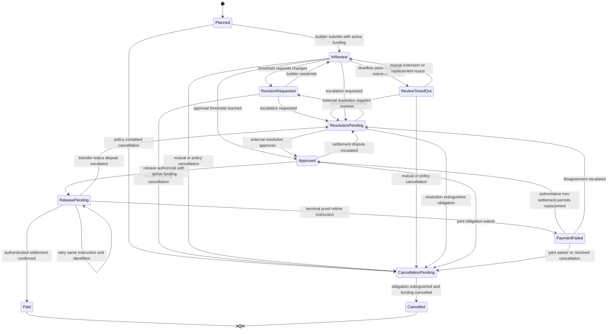
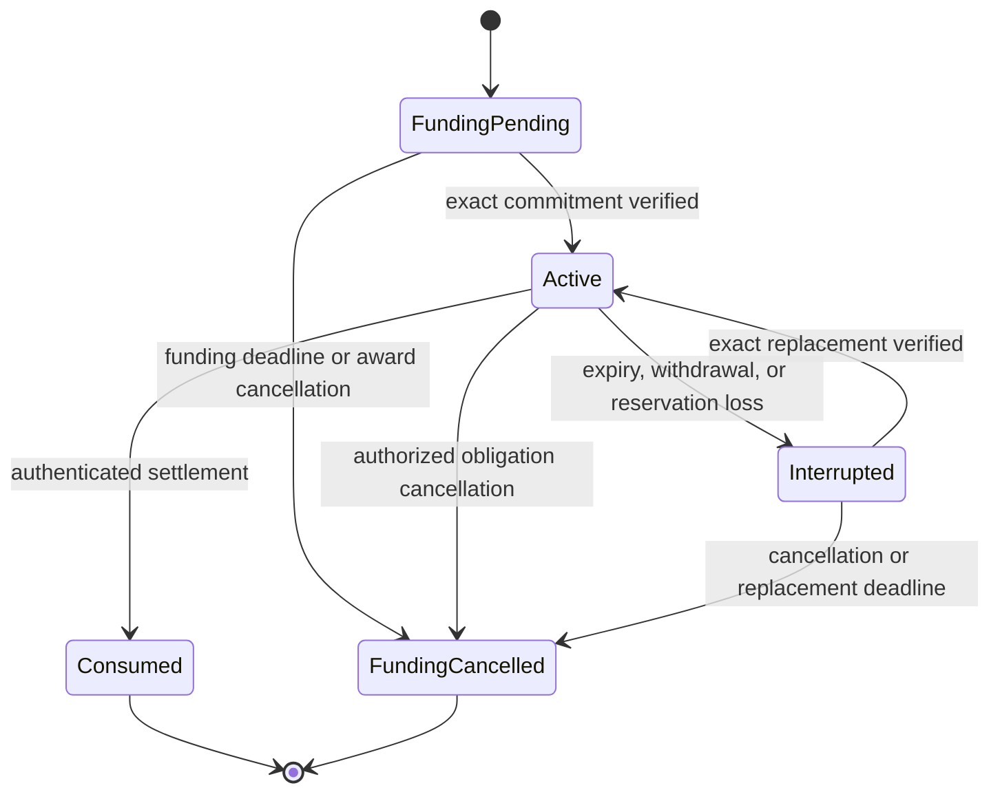

## Development Fund Proposal: MilestoneOS — Private, Multi-Milestone Grant and Award Infrastructure for Canton

| Field | Value |
| :---- | :---- |
| Author | [Murad Malachiyev (@hitrich)](https://github.com/hitrich) |
| Org | Independent individual applicant |
| Status | Submitted |
| Created | 2026-07-27 |
| Label | `financial-workflows-composability` |
| Champion | **Need Champion — Financial Workflows & Composability SIG** |
| Duration | 22 engineering weeks to release candidate, followed by a 6-month adoption window and 12-month maintenance commitment; any Committee procurement delay for the external audit pauses the Milestone 3 schedule |
| Total Funding Request | 800,000 CC development funding plus a separately procured, Committee-approved audit allowance capped at 100,000 CC without a proposal amendment |

> Draft note: the author, individual-applicant structure, solo-builder responsibilities, and public portfolio evidence are documented below. Design-partner evidence must still be completed before submission. The template permits `Need Champion`, which is used here until a SIG champion is assigned. The funding request remains a working figure for champion and Committee calibration.

---

## Abstract

This proposal requests funding to build, open-source, document, secure, and validate **MilestoneOS**, a reusable Canton-native protocol for administering grants, development awards, and milestone-based commercial agreements.

MilestoneOS addresses the workflow between selecting a recipient and completing a multi-stage award:

`Program → Application → Award → Funding Commitment → Milestone → Submission → Review → Release / Revision / Resolution → Completion Receipt`

The protocol will provide:

- privacy-preserving program and application workflows
- mutually accepted awards containing one or more independently funded milestones
- reusable single-reviewer and M-of-N reviewer-quorum policies
- content-addressed evidence references and a GitHub evidence adapter
- token-standard-native funding commitments and milestone settlement
- a separately documented Canton Coin payout path
- immutable approval, settlement, and completion receipts
- optional integration with credential providers for reviewer qualification and portable completion claims
- a TypeScript SDK, backend automation, PQS projections, and CIP-0103 wallet integration
- a thin reference application and reproducible local/DevNet environment
- security review, operational runbooks, adoption validation, and post-grant maintenance

The grant-funded output is a reusable Apache-2.0 protocol and reference stack. It is **not** a hosted grant marketplace, a replacement for the Canton Foundation's governance process, a generic task/quest platform, a new token or wallet, or a network-wide arbitration service.

A separately operated product, provisionally called **GrantFlow**, may use MilestoneOS as its first commercial reference application. Premium hosting, program administration, customer-specific integrations, and commercial go-to-market work are outside this grant.

---

## Specification

### 1. Problem Statement

Organizations administering grants, bounties, accelerator awards, open-source contributions, and milestone-based vendor agreements commonly coordinate across:

- application forms and spreadsheets
- private documents and email
- GitHub issues, pull requests, and releases
- reviewer messages and ad hoc approval records
- multisigs, wallets, and manual payment operations
- separate reporting and audit systems

This fragmentation creates recurring problems:

- program operators cannot easily prove which acceptance criteria governed a payment
- builders cannot carry a portable, tamper-evident record of successfully completed work
- reviewers lack a standard mandate, evidence packet, and decision record
- changes to scope, deadlines, reviewer sets, and milestone values are difficult to audit
- payment operations can become detached from the approval that authorized them
- public program discovery conflicts with the need to keep proposals, budgets, evidence, and commercial terms private
- every Canton application building a multi-stage award workflow must solve the same authorization, privacy, funding, retry, and receipt problems again

Canton already provides the underlying building blocks: Daml multi-party authorization, privacy by stakeholder, token-standard allocation and settlement interfaces, the dApp API, external signing, and application automation. The missing public good is a production-shaped reference that composes those capabilities into a reusable **multi-milestone award lifecycle**.

### 2. Objective

MilestoneOS has one objective:

> Provide a reusable, privacy-preserving, token-standard-aligned implementation of multi-milestone awards so Canton applications do not need to design grant administration, reviewer quorum, evidence tracking, funding commitment, and milestone-release workflows from scratch.

The intended outcome is that an ecosystem team can:

- deploy the Daml packages and backend services locally or on a Canton validator
- publish a program with explicitly public discovery metadata
- receive private applications from external parties
- offer and mutually execute a multi-milestone award
- commit funds to the award or to individual milestones
- assign reviewers without revealing unrelated applications or unnecessary payment data
- accept evidence from GitHub or another evidence provider
- calculate a reviewer threshold without a platform administrator fabricating the result
- release a payment only after the relevant approval and funding conditions are satisfied
- pause a milestone and hand a dispute to an external resolution mechanism
- issue tamper-evident completion receipts that recipients can selectively disclose
- integrate the protocol from a separate application using stable Daml interfaces and a TypeScript SDK

### 3. Scope Boundary and Relationship to Existing Work

The Development Fund's default approach is to extend and compose with existing ecosystem components. MilestoneOS therefore treats adjacent approved and open proposals as dependencies or integration targets rather than rebuilding them.

| Existing component or proposal | Relationship to MilestoneOS | Explicit non-overlap |
| :---- | :---- | :---- |
| [Canton Grants Portal PR #104](https://github.com/canton-foundation/canton-dev-fund/pull/104) — closed, not merged | The closed proposal is an important negative precedent: it focused on a GitHub-connected operating portal for the Canton Development Fund and was not advanced because reviewers did not see sufficient alignment with near-term ecosystem priorities. MilestoneOS incorporates that feedback by targeting reusable Daml, SDK, wallet, funding, and evidence infrastructure for any application or program operator, with external adoption as an acceptance condition. | MilestoneOS does not build a committee workspace, CIP-0100 voting portal, Foundation payment ledger, or Foundation-specific transparency dashboard. The Canton Foundation is not assumed to be a customer. |
| [Yapper Agent PR #299](https://github.com/canton-foundation/canton-dev-fund/pull/299) | A Yapper task may be represented as a single-milestone award or supplied as external evidence. Milestone 1 includes an extension/compatibility review with the Yapper authors. If its `JobEscrow` package exposes suitable stable interfaces, MilestoneOS will extend or adapt them rather than duplicate them. | MilestoneOS does not build a task marketplace, quest system, creator network, XP system, campaign platform, news aggregator, or general-purpose single-job escrow. |
| [Canton Interaction Primitives PR #172](https://github.com/canton-foundation/canton-dev-fund/pull/172) | If its `Intent → Consent → Resolution` package is accepted and exposes suitable stable interfaces, MilestoneOS will use or extend those primitives for award offers, mutual amendments, and bounded approval policies. | MilestoneOS does not define a generic interaction language or general-purpose approval framework. Its funded scope is the domain-specific award, evidence, funding, settlement, and integration layer. |
| [Canton Payment Streams](https://github.com/canton-foundation/canton-dev-fund/blob/main/proposals/2026-03-Deepthi-canton-payment-streams.md) and [StreamPay PR #169](https://github.com/canton-foundation/canton-dev-fund/pull/169) | A downstream application may route an approved award into a payment stream or reuse a compatible milestone-payment component. The core protocol records the approved amount and destination but does not reimplement streaming. | No continuous accrual, vesting engine, recurring billing, contributor-reward engine, or stream lifecycle is included. |
| [Payment Dispute & Refund Authorization PR #293](https://github.com/canton-foundation/canton-dev-fund/pull/293) | If the proposed dispute interfaces are available and appropriate, MilestoneOS will support a resolution adapter and consume an immutable resolution receipt. Otherwise, v1 supports mutual resolution and a minimal external-resolution handoff. | MilestoneOS does not implement a generic payment dispute state machine, chargebacks, reversal windows, appeals, evidence storage service, or network-wide adjudication. |
| CIP-0056 and CIP-0112 token standards | MilestoneOS consumes standard holdings, transfer, allocation, and settlement surfaces behind a narrow funding adapter. | It does not issue a token, replace a registry, wrap assets, or define a competing token standard. |
| CIP-0103 dApp Standard and Canton Wallet SDK | The reference application uses the standard wallet connection, ledger access, and prepare/sign/execute flow. | It does not build a wallet, custody service, signing provider, or competing dApp transport. |
| Digital Asset Credential Utility | Reviewer or arbitrator qualification and completion claims may be verified or issued through an optional adapter. | It does not become a KYC provider or create a competing credential registry. |

Before the Milestone 1 architecture is frozen, the implementing team will document direct outreach to maintainers of PR #299, PR #172, and PR #293 and will explicitly address the Committee feedback recorded on closed PR #104. The resulting architecture decision record will state which components are reused, extended, adapted, or excluded and why.

### 4. Implementation Mechanics

#### 4.1 Daml Package and Public Interfaces

The proposed Daml package contains a small set of workflow contracts and stable public interfaces. Exact names may change during Milestone 1 review, but the responsibility boundaries will remain:

| Contract or interface | Purpose | Principal authorization and visibility |
| :---- | :---- | :---- |
| `Program` | Defines sponsor, application window, eligibility description, award policy, permitted assets, and opt-in public metadata. | Sponsor/program operator is signatory. An applicant receives only the disclosure necessary to submit. |
| `Application` | Private proposal from an applicant to a program. | Applicant is signatory; sponsor is a stakeholder. Other applicants and reviewers cannot see it. |
| `AwardOffer` | Sponsor's proposed milestone schedule, payment plan, review policy, and deadlines. | Sponsor creates; selected builder accepts or rejects. |
| `Award` / `IMilestoneAward` | Mutually accepted agreement governing amendments, cancellation, the acyclic milestone-dependency graph, and completion. | Sponsor and builder are signatories. |
| `Milestone` | Acceptance criteria, deadline, amount, asset, review policy, predecessor set/unlock condition, and current lifecycle state. | Sponsor and builder are stakeholders. Reviewers receive a narrower mandate rather than automatic access to the entire award. |
| `FundingRequest` | Data-minimized mandate asking a named funder to back one milestone leg. It carries opaque award/milestone identifiers, asset, amount, payee, deadline, and terms hash, but no application text, acceptance criteria, or evidence. | Sponsor and builder authorize the request; the named funder is an observer and choice controller. |
| `FundingCommitment` / `IFundingCommitment` | References the accepted request and reserved asset, and hosts funder-controlled lifecycle and release choices. | Funder is signatory; sponsor, builder, and an optional named funding adapter are observers. None receives the full `Milestone` through this contract. |
| `ReleaseMandate` | Narrow, immutable authorization produced from an approved milestone and bound to the commitment, review round, asset, amount, payee, dependency proof, and expiry. | Sponsor, builder, funder, and the same optional adapter see the mandate; it contains no proposal or evidence payload. Release is exercised on `FundingCommitment`, not on `Milestone`. |
| `ReviewMandate` | Defines the evidence a reviewer may inspect, decision deadline, and threshold policy. | Assigned reviewer and relevant award parties only. |
| `EvidenceAttestation` / `IEvidenceAttestation` | Content hash, URI, source, immutable source identifier, submitter, and optional provider attestation. | Visibility is limited to the submission's authorized review set. |
| `ReviewDecision` / `IReviewDecision` | Reviewer approval or revision request bound to the exact submission attempt and review round. Application rejection and resolution outcomes use separate domain choices. | Reviewer signs the decision; sponsor and builder observe it. |
| `ResolutionRequest` / `IResolutionAdapter` | Minimal pause-and-handoff contract for an external resolution mechanism. | Only the affected parties and selected resolver see the case package. |
| `ObligationWaiver` and `CancellationPending` | Joint or resolver-authorized extinguishment of an unsettled payment claim, followed by funding cancellation before the milestone becomes terminal. | Sponsor and builder authorize a waiver; an agreed resolver may supply the equivalent bounded outcome. The funding adapter observes only the cancellation tuple. |
| `PaymentInstruction`, `SettlementCandidate`, and `SettlementReceipt` | Tracks an authorized release, retries, an exact settlement proof, or terminal failure where settlement is not atomic with approval. | Automation may submit a payment and propose a candidate, but it cannot unilaterally mark the milestone paid. A receipt requires an authoritative adapter proof or funder-and-builder confirmation under the selected asset path. |
| `CompletionReceipt` / `ICompletionReceipt` | Immutable record that an award or milestone completed under a specified policy. | Sponsor and builder are stakeholders; selective disclosure is supported. |

The interface package will be versioned separately from concrete implementation templates so downstream applications can integrate without coupling to internal contract implementations. Smart Contract Upgrade guidance and by-package-name Ledger API queries will be used where supported.

#### 4.2 Reference Lifecycle

MilestoneOS models the work/review stage and funding status as two orthogonal state machines. A funding event never overwrites or ambiguously "resumes" the work stage; every guarded choice reads both states.

**Work, review, and payment stage**



**Funding status**



Funding may become `Interrupted` while the work stage is `InReview`, `RevisionRequested`, `ReviewTimedOut`, `ResolutionPending`, `Approved`, or `ReleasePending`; that stage and its immutable decisions remain unchanged. `Funding_ExecuteRelease` requires `Active`, and settlement confirmation moves funding to `Consumed`.

An unresolved non-atomic transfer stays `ReleasePending` and retains one logical `PaymentInstruction`. A retriable transport or completion error retries that instruction with the same instruction, command, and idempotency identifiers; it never reopens `Approved` or creates a second release. `PaymentFailed` atomically retires the old instruction and records either `AuthoritativeNonSettlement` or `MutualWriteOff`. Only an authoritative provider's proof that the transfer cannot settle permits a return to `Approved` and a replacement release. Joint funder-and-builder confirmation after reconciliation may write off the obligation and proceed to `CancellationPending`, but it can never authorize a second transfer. Disappearance of a reservation or an unknown completion alone is never interpreted as payment or terminal failure.

No work stage becomes terminal `Cancelled` while a funding claim remains live. Before approval, cancellation follows the accepted award policy; after approval, it requires a sponsor-and-builder `ObligationWaiver` or an authorized external resolution that extinguishes the payment claim. The workflow remains `CancellationPending` until the asset adapter confirms `FundingCancelled` (or proves no commitment exists), at which point both states become terminal together.

No state transition implies mutable in-place state. Concrete Daml implementations will archive and create contracts in accordance with normal Daml lifecycle patterns.

#### 4.3 Review Policies

The first release will include two bounded review policies:

1. **Single reviewer**
   - one assigned reviewer approves or requests revision
   - this is the `M = 1, N = 1` form of the same deterministic policy
   - suitable for small bounties and vendor milestones

2. **M-of-N reviewer quorum**
   - the award fixes `N` unique reviewer parties and an approval threshold `M`, where `1 <= M <= N`
   - each reviewer casts exactly one immutable `Approve` or `RequestRevision` decision per review round, bound to the exact submission attempt
   - decisions cannot be withdrawn or replaced within that round; duplicate decisions and decisions by unassigned parties are rejected
   - `Approve` count greater than or equal to `M` finalizes the round as `Approved`
   - `RequestRevision` count greater than `N - M` finalizes the round as `RevisionRequested`, because approval has become mathematically unreachable
   - every other mixed result remains `InReview` until another valid decision or the agreed deadline
   - if the deadline passes without either threshold, the round becomes `ReviewTimedOut`; sponsor and builder may mutually extend it or replace unavailable reviewers by creating a new round, and either party may invoke the agreed resolution handoff
   - decisions from a timed-out or superseded round remain immutable audit evidence but never count in the replacement round

Weighted voting, delegated voting, liquid democracy, juror markets, staking, and generalized DAO governance are out of scope. Qualification can be checked through an optional credential predicate, but MilestoneOS does not issue KYC or professional credentials itself.

#### 4.4 Award Amendments

Multi-milestone awards frequently need controlled changes. The reference implementation will support mutually authorized amendments with the following constraints:

- sponsor and builder must accept changes to milestone value, acceptance criteria, deadline, or milestone ordering
- an amendment cannot reduce the value already paid
- an amendment cannot invalidate an approval already used to settle a payment
- reviewer-policy changes apply only to a new review round and cannot rewrite completed reviewer decisions
- MilestoneOS-controlled amendment or cancellation choices cannot release commitments below already approved but unsettled obligations unless a sponsor-and-builder `ObligationWaiver` or authorized resolution explicitly extinguishes that claim; if an underlying asset workflow expires or invalidates a commitment independently, funding becomes `Interrupted` and the award cannot claim the obligation remains reserved
- every accepted amendment archives the prior award state and produces an immutable amendment receipt

**Milestone dependency rules**

- each milestone has a unique ID, a predecessor set, and one fixed unlock condition per predecessor: `AfterApproval` or `AfterSettlement`
- an empty predecessor set represents a parallel or immediately available leg; a simple chain represents a sequential award
- award acceptance and every dependency amendment reject self-dependencies, missing predecessor IDs, and cycles
- `AfterApproval` produces an active dependency-approval proof that is consumed if the predecessor approval is superseded, waived, or cancelled; `AfterSettlement` uses the immutable authoritative settlement receipt
- `Milestone_Submit`, release-mandate creation, and `Funding_ExecuteRelease` all fetch the exact active predecessor proofs bound into the mandate, so a stale dependency state cannot authorize payment
- dependencies of a `Paid` milestone cannot change; changing dependencies for a submitted or approved open milestone supersedes its review round and requires a new submission
- tests cover cycles, early submission, early release, parallel legs, mixed unlock conditions, and dependency-changing amendments

#### 4.5 Funding and Settlement Adapter

MilestoneOS will not create a proprietary asset escrow. Funding is behind a narrow adapter boundary with an explicit guarantee matrix.

**Token-standard allocation path**

- sponsor and builder create a data-minimized `FundingRequest`; the funder accepts it and its wallet creates or consumes the relevant standard `AllocationRequest`
- the funder's wallet creates an `Allocation` using the relevant registry's factory
- `FundingCommitment` binds the allocation to one milestone, asset, amount, payee, synchronizer, and expiry
- an approved milestone produces a narrow `ReleaseMandate`; the funder or configured adapter exercises release on `FundingCommitment`, so the funder never needs disclosure of the full milestone or evidence
- release is authorized only while that exact commitment and mandate remain active, unexpired, and dependency-valid
- where the deployed standard supports atomic composition, allocation settlement and `SettlementReceipt` creation occur in one transaction using `proofMode = AtomicAllocation`
- an `AtomicAllocation` receipt binds the consumed allocation/commitment contract IDs, release mandate, registry and instrument IDs, and exact transfer-leg values available as Daml transaction inputs, including payer, payee, amount, and synchronizer; it does **not** claim to know the post-commit update/event ID
- after commit, PQS indexes the immutable receipt contract ID to its update/event identifiers for search and audit; that external index or a supplementary `LedgerLocationAttestation` does not alter the receipt's settlement authority
- cancellation and expiry release funds through the standard allocation lifecycle

**Canton Coin reference path**

- the reference application uses the current supported Splice/Canton Coin wallet and transfer interfaces
- if the available surface cannot reserve and release CC atomically with milestone approval, the protocol represents release as a two-phase `PaymentInstruction`
- state-triggered automation submits the payment with stable instruction, command, submission, and idempotency identifiers
- a retriable transport or completion error resubmits the same logical instruction and identifiers; there can be only one unresolved instruction for a milestone leg
- resubmission is allowed only after authoritative pre-commit rejection or proof that no transfer was accepted; an unknown outcome is reconciled by instruction/command/submission ID and is never blindly resubmitted, including after the Ledger API deduplication window expires
- automation may create a `SettlementCandidate`, but that contract does not change the milestone to `Paid`
- the candidate must bind the instruction contract ID, command/submission ID, transfer update and event identifiers, synchronizer, asset, amount, payer, payee, and observed final status
- `SettlementReceipt` is created only when either:
  - an authoritative wallet, registry, or Token Standard adapter supplies a verifiable receipt that matches every bound field; or
  - for a path without such a receipt, the funder and builder both authorize the matching candidate after verifying the transfer
- every receipt records its proof authority/signers and `proofMode`: `AtomicAllocation`, `ObservedLedgerProof`, or `MutualConfirmation`; the first two form the `AuthoritativeLedgerProof` class, while the latter is never marketed as independently verified settlement
- an `ObservedLedgerProof` receipt must match the post-commit update/event identifiers and every instruction field; an `AtomicAllocation` receipt instead satisfies the transaction-local allocation and transfer-leg bindings above
- a mismatch is rejected; unknown or retriable status remains `ReleasePending`
- `PaymentFailed` atomically retires the instruction so it can never later produce a receipt; `AuthoritativeNonSettlement` permits a replacement release, while joint funder-and-builder `MutualWriteOff` can only extinguish the claim and continue toward cancellation
- documentation clearly distinguishes "approved", "release submitted", and "settled"; it never represents an unconfirmed transfer as paid

**Funding interruption and replacement**

- every release choice checks ledger time, the active commitment identifier, expiry, asset, amount, payee, and milestone leg
- expiry, withdrawal by the underlying asset workflow, or any loss of reservation changes the orthogonal funding status from `Active` to `Interrupted`; the current work/review stage and decisions remain unchanged
- an `Interrupted` commitment blocks `Funding_ExecuteRelease` in every work stage, including after approval or while a resolution is pending
- a replacement commitment with the same asset, amount, payee, milestone terms, and review-round binding changes funding back to `Active` without rewriting the work stage
- changing those settlement terms requires a sponsor-and-builder amendment and a new review round; stale decisions cannot authorize the changed payment
- only one `Active` commitment may back a milestone leg; replacing it archives or invalidates the prior reference
- `FundingPending` reaches `FundingCancelled` if the funding deadline passes, and `Interrupted` reaches `FundingCancelled` if the replacement deadline or a policy-compliant cancellation condition is met
- cancelling an `Active` commitment requires the work stage to be `CancellationPending` and consumes the applicable pre-approval policy authorization, joint `ObligationWaiver`, or external resolution receipt; cancellation finalization cannot bypass the payment claim

**CIP-0112 transition**

- the adapter is implemented first against the best deployed standard surface available during development
- V2-specific capabilities are added behind the same public MilestoneOS interface once available
- the project will not maintain a permanent private fork of the Token Standard

Milestone 1 will publish a guarantee matrix for each supported asset path covering reservation, cancellation, expiry, atomicity, proof authority, path-specific exact-match fields, co-authorization, retry behavior, instruction retirement, external signing, and failure recovery. Adversarial tests will attempt forged update identifiers on observed paths, false update-ID claims on atomic paths, wrong allocation/transfer legs, amount/asset/payee substitution, expired commitments, stale approvals, duplicate instructions or transfers, late completion after terminal failure, duplicate confirmations, and automation-only confirmation.

#### 4.6 Evidence and GitHub Adapter

Raw source code, private documents, and large artifacts are not stored on-ledger.

An `EvidenceAttestation` contains:

- evidence type and schema version
- content-addressed URI or application URI
- cryptographic content hash
- submitter party
- source provider
- immutable source event identifier
- creation time and optional expiry
- optional structured fields such as repository, commit SHA, release tag, or pull-request number

The reference GitHub adapter will:

- operate as a GitHub App with least-privilege repository permissions
- validate webhook signatures
- support an initial bounded event set: pull request merged, release published, issue closed, and commit/tag reference
- use GitHub delivery IDs and Ledger API command deduplication to prevent webhook replay from creating duplicate attestations
- never treat a GitHub event as automatic milestone approval
- create a review task or evidence attestation that the assigned reviewer must evaluate

The evidence interface permits later adapters for CI systems, document stores, registries, code-signing systems, or human attestations without changing the award lifecycle.

#### 4.7 Backend, Automation, and Read Model

The reference stack will use:

- Ledger API / JSON Ledger API for command submission and completion tracking
- stable command IDs, submission IDs, and deduplication periods for retriable writes
- durable one-instruction/one-attempt-state records; unknown completion status triggers read-side reconciliation and operator escalation rather than resubmission after deduplication expires
- PQS-backed projections for application-specific queries where available
- state-triggered, idempotent automation for deadlines, review reminders, release submission, reconciliation, and receipt creation
- an application database only for off-ledger concerns such as GitHub installations, encrypted evidence metadata, webhook delivery records, and public discovery content
- explicit access control on every application API; the backend will not assume that possession of a contract ID grants authorization

Automations advance workflows but are not trusted to bypass Daml authorization. A repeated automation task must either produce the same safe outcome or be rejected as a duplicate.

#### 4.8 Wallet and External Signing

The reference frontend will use the CIP-0103 dApp API and the Canton dApp SDK for:

- wallet connection and account selection
- ledger queries authorized for the connected party
- transaction preparation, user approval, signing, and execution
- transaction lifecycle feedback

The implementation will support externally held keys through standard wallet/signing-provider flows. Private keys will never be handled by the MilestoneOS frontend or application backend.

#### 4.9 Public Discovery and Private Workflow Data

Canton private contracts are not globally queryable. MilestoneOS therefore separates:

- **opt-in public metadata:** program name, summary, category, application deadline, public status, public URL, and sponsor-selected aggregate metrics
- **private workflow data:** applications, reviewer identities where sensitive, budgets, milestone values, evidence, comments, disputes, and settlement details

Public discovery is served from a program-controlled projection. Publishing public metadata does not make the underlying Daml contracts public. Program operators explicitly choose the fields released to the public index.

Funders and any named funding adapter receive only `FundingRequest`, `FundingCommitment`, and `ReleaseMandate` contracts. Those contracts disclose the parties and settlement tuple required to reserve and release funds, plus opaque identifiers and hashes needed to bind authorization; they do not disclose application text, milestone evidence, reviewer comments, or unrelated award legs. No funder- or adapter-controlled choice is hosted on the private `Milestone` contract.

For grant milestone verification, pilot operators may opt into a minimal `MetricsObserver` surface exposing counts and opaque workflow identifiers without proposal contents, evidence, or payment amounts.

#### 4.10 Data Minimization, Retention, and Selective Disclosure

The reference `Application` stores only the workflow fields that must be shared and authorized on-ledger:

- program and schema identifiers
- applicant party and sponsor party, using non-PII party identifiers where deployment policy permits
- submission time and lifecycle status
- an opaque off-ledger object identifier or content-addressed reference plus hash; no bearer token, secret, personal filename, or directly identifying URL is placed on-ledger
- a coarse evidence/content type and operator-defined retention-class identifier
- only the eligibility assertions that the sponsor must evaluate on-ledger

Raw proposal text, attachments, source code, personal contact details, identity documents, and customer data are never Daml payload fields in the reference implementation. The operator's off-ledger store must encrypt those materials, authorize access using the current contract stakeholders, publish a retention schedule, delete or revoke access when that schedule expires, and record deletion without claiming that Canton ledger history itself can be erased. Archived Daml contracts retain only the minimized identifiers and hashes.

"Selective disclosure" means an entitled holder deliberately exports a signed receipt or credential containing an allowlisted subset of fields. It does not remove stakeholder visibility already granted on-ledger, retroactively erase participant data, or make a private contract publicly queryable. The privacy matrix will document ledger stakeholders, explicit-disclosure paths, off-ledger readers, retention owner, deletion trigger, and exported fields for every contract and artifact type.

The operator-defined schedule cannot delete the minimized `AdoptionAudit` evidence class before the verification and challenge period in Section 4.11 ends. That class has its own purpose limitation, access log, deletion trigger, and data-subject notice; it never requires retaining raw applications or milestone evidence.

#### 4.11 MainNet Adoption Measurement Protocol

Milestone 4A uses the following definitions so its 200,000 CC adoption acceptance gate can be verified without publishing confidential award terms:

- an **unrelated external program operator** is a separately controlled legal entity that is not the implementing organization, its parent, subsidiary, affiliate, officer, employee, or a contractor engaged primarily to satisfy this proposal's adoption metric
- a **distinct external builder** is a natural person or separately controlled entity outside the implementing organization that is the payee on at least one qualifying settlement in the same rolling 60-day acceptance window; multiple Canton parties or wallets under common control count once
- an **independent downstream integration** is a production application controlled by an unrelated external entity, uses the public SDK or Daml interface without the GrantFlow frontend, originates or administers at least one qualifying settlement in the same acceptance window, and is not built, reimbursed, or contracted primarily to satisfy this metric
- a **qualifying settlement** is a MainNet Canton Coin payment for a `Paid` milestone, denominated and settled in CC, backed by an authenticated `SettlementReceipt` in `AuthoritativeLedgerProof` mode, at least 250 CC in amount, created for a bona fide award, not reimbursed or subsidized by the implementing organization, and not a payment between commonly controlled parties; non-CC assets remain supported product activity but do not count toward this grant gate
- the rolling 60-day acceptance window must contain at least 25 qualifying settlements totaling at least 25,000 CC, with at least five settlements from each of three unrelated operators; no operator may supply more than 60% of the qualifying count or value

The public report contains aggregate counts and privacy-preserving identifiers only. The Committee or its independent auditor receives, under confidentiality, the exact ledger update/event identifiers, CC amounts, operator/builder/integration control mapping, common-control declarations, and signed operator attestations needed to deduplicate parties and test every threshold. The `MetricsObserver` projection is a discovery aid, not the sole proof of economic materiality or independence.

The qualifying 60-day window must end no later than six calendar months after Milestone 3 acceptance, and the evidence package must be submitted within fifteen business days after that window closes. If the economic thresholds are not achieved by the six-month deadline, Milestones 4A and 4B lapse and their unpaid 320,000 CC is not earned. Any extension requires a public proposal amendment approved before the deadline. Committee review may finish later, and one thirty-day cure may correct missing documentation, but no post-deadline transaction or participant may be added to cure a substantive threshold failure.

The limited identity mapping, control declarations, attestations, and ledger references form a separate encrypted `AdoptionAudit` evidence class. Operators obtain any required consent. Access is limited to the operator, Committee, and appointed auditor and is logged; raw applications, evidence, and unrelated personal data are not copied into the package.

The deletion trigger is bounded for every outcome:

- **submitted and accepted:** delete after the later of 90 days following Milestone 4A acceptance or resolution of a Committee challenge opened during that period
- **submitted then rejected or withdrawn:** delete 90 days after final rejection or withdrawal, or after a timely challenge is resolved
- **window closed without submission:** delete 90 days after the window closes
- **superseded package:** delete 90 days after supersession unless it remains evidence in the submitted package or an open challenge

A documented legal hold may override deletion only for the affected records and required period; it is not the default retention policy.

### 5. Core Invariants

The reference implementation and test suite will enforce at least the following invariants:

1. A milestone cannot be released unless its award is active, its funding condition is satisfied, and its current submission has reached the configured approval threshold.
2. A reviewer decision is valid only for the exact award, milestone, review round, and submission attempt it names.
3. One reviewer cannot contribute more than one active decision to the same review round.
4. The aggregate amount settled plus the amount still committed cannot exceed the amount funded for the award.
5. A terminal milestone cannot be paid twice.
6. A stale approval cannot authorize payment after the milestone has been amended, cancelled, superseded, or moved into resolution.
7. Award amendments cannot reduce already paid value or silently invalidate completed receipts.
8. A webhook delivery or external source event cannot create more than one active evidence attestation for the same adapter namespace and source identifier.
9. A failed automation retry cannot cause duplicate settlement.
10. Only entitled stakeholders can see private applications, evidence, review decisions, and award terms.
11. Reviewers see only the milestone mandate and evidence required for their assignment, not unrelated applications or awards.
12. Public-index publication is opt-in and cannot reveal private fields by default.
13. A `CompletionReceipt` is created only after the referenced milestone or award reaches its defined terminal success condition.
14. An external resolution receipt cannot be applied to an unrelated award, milestone, or payment instruction.
15. Automation acting alone cannot create a valid `SettlementReceipt` or move a non-atomic payment path to `Paid`.
16. An `AtomicAllocation` proof must match the consumed allocation/commitment, release mandate, registry/instrument, transfer legs, synchronizer, asset, amount, payer, and payee; an `ObservedLedgerProof` must additionally match the post-commit update/event identifiers. Either proof can be consumed only once.
17. An expired, withdrawn, superseded, or otherwise unusable funding commitment cannot authorize release.
18. At most one active funding commitment backs a milestone leg; a materially changed replacement requires mutual amendment and a new review round.
19. For each review round, the approval and revision thresholds are mutually exclusive and derive only from one immutable decision per assigned reviewer.
20. Raw proposal content, attachments, personal contact data, identity documents, and confidential evidence are never stored in the reference Daml application payload.
21. A funding-status transition cannot rewrite the work/review stage or its decisions; those two state machines compose only through explicit choice guards.
22. At most one unresolved `PaymentInstruction` exists for a milestone leg; a retry reuses it only after proven non-acceptance, an unknown outcome is reconciled without resubmission, and a new instruction is impossible until authoritative terminal non-settlement is proven and the old instruction is retired.
23. A milestone cannot become terminal `Cancelled` until its payment claim is extinguished and funding is `FundingCancelled` or proven absent.
24. A funder-controlled choice is hosted only on a contract visible to that funder and cannot require disclosure of the private `Milestone`, application, review comments, or evidence.
25. Submission, release-mandate creation, and funding execution are rejected until every milestone predecessor supplies the exact active `AfterApproval` or authoritative `AfterSettlement` proof bound to the mandate; stale proofs fail and the dependency graph must remain acyclic.

Property-focused Daml tests, scenario tests, backend integration tests, and adversarial end-to-end tests will cover these invariants.

### 6. Proposed Repository Structure

The public repository is expected to contain:

```text
milestoneos/
├── daml/
│   ├── milestoneos-api/
│   ├── milestoneos-core/
│   ├── milestoneos-review-policies/
│   └── milestoneos-test/
├── packages/
│   ├── sdk/
│   ├── token-adapters/
│   ├── github-adapter/
│   └── ui-components/
├── services/
│   ├── automation/
│   ├── api/
│   └── projections/
├── apps/
│   └── reference-web/
├── examples/
│   ├── open-source-bounty/
│   ├── accelerator-grant/
│   └── vendor-milestones/
├── docs/
│   ├── architecture/
│   ├── privacy/
│   ├── threat-model/
│   ├── integration/
│   └── operations/
└── localnet/
```

### 7. Architectural Alignment

| Canton capability or priority | MilestoneOS alignment |
| :---- | :---- |
| Daml authorization and privacy | Sponsor, builder, reviewer, resolver, and observer rights are encoded in the workflow. Private applications and terms are visible only to entitled parties. |
| Multi-party workflow composition | Award acceptance, reviewer quorum, controlled amendments, resolution handoff, and settlement receipts are modeled as cross-organization workflows rather than administrator database flags. |
| CIP-0056 / CIP-0112 | Standard allocation and settlement surfaces are composed behind an asset adapter; no proprietary token wrapper is introduced. |
| CIP-0103 and wallet interoperability | End-user signing uses the vendor-neutral dApp API and standard wallet providers. |
| External signing | Builders, sponsors, and reviewers may retain their own keys; the application does not require platform custody. |
| App building and developer experience | Reusable Daml interfaces, SDK, examples, local environment, reference UI, and operational documentation reduce duplicated engineering. |
| Security and resilience | Explicit invariants, privacy matrix, threat model, replay protection, deduplicated automation, external review, and runbooks are grant deliverables. |
| Adoption-driven delivery | Major funding is gated by external operators, external builders, a downstream integration, and MainNet settled milestones. |
| Sustainable public good | Apache-2.0 code, public documentation, a 12-month maintenance commitment, and a commercial hosting path support continued operation after the grant. |

The project will not create artificial transactions to optimize Featured App rewards. Adoption metrics count only the independent parties and qualifying settlements defined in Section 4.11.

### 8. Backward Compatibility

*No backward compatibility impact.*

MilestoneOS is additive. It does not require changes to Canton core, Splice, existing wallets, the Token Standard, Registry Utility, Credential Utility, Yapper Agent, Payment Streams, or the proposed dispute primitive.

Where upstream interfaces evolve, adapters will be versioned while the stable MilestoneOS Daml interface package remains backward-compatible to the extent supported by Daml Smart Contract Upgrade rules.

### 9. Out of Scope

The following are explicitly outside this grant:

- replacing the Canton Foundation's current proposal, review, or voting process
- a hosted grant marketplace or proprietary GrantFlow SaaS
- task discovery, educational quests, creator campaigns, XP, leaderboards, or social reputation
- generic one-off job escrow where no multi-milestone agreement exists
- generalized DAO governance, juror staking, prediction markets, or liquid voting
- a network-wide arbitrator or legal dispute-resolution service
- chargebacks, payment reversals, appeal courts, or jurisdiction-specific legal rules
- KYC, AML, accreditation, or professional-credential issuance
- creation of a token, asset registry, wallet, custody product, or signing provider
- payment streaming or vesting
- storing raw evidence, source code, or confidential documents on-ledger
- fiat custody, fiat conversion, tax calculation, or money-transmission services
- a guarantee that every asset registry supports identical reservation or settlement semantics
- marketing subsidies, user rewards, liquidity mining, or fabricated network traffic

---

## Milestones and Deliverables

### Milestone 1: Public Architecture, Core Daml Workflow, and Ecosystem Validation

- **Estimated Delivery:** 6 weeks from project start
- **Funding:** 120,000 CC upon Committee acceptance
- **Focus:** Freeze the non-duplicative architecture, publish the open-source foundation, and validate it with prospective adopters and adjacent project maintainers.

**Deliverables / Value Metrics**

- public Apache-2.0 repository with contribution and security policies
- architecture specification, privacy/retention matrix, threat model, review-outcome table, funding-interruption model, and asset-path guarantee matrix
- documented compatibility review with closed Grants Portal PR #104, Yapper Agent PR #299, Interaction Primitives PR #172, Payment Streams and StreamPay PR #169, dispute PR #293, CIP-0056, CIP-0112, and CIP-0103
- versioned public Daml interface package
- core Daml templates for program, application, award offer, award, milestone, funding request, release mandate, submission, review decision, obligation waiver/cancellation, amendment, and completion receipt
- reference single-reviewer and M-of-N review policies
- local reproducible environment demonstrating:
  - private application
  - award acceptance
  - milestone submission
  - revision and resubmission
  - reviewer-threshold approval
  - distinct-funder request/commitment flow without full milestone disclosure
  - predecessor-guarded sequential and parallel milestones
  - controlled amendment
  - obligation waiver and funding-safe cancellation
  - completion receipt
- tests for the core invariants that do not depend on token settlement
- negative tests for mixed quorum outcomes, timed-out/replaced review rounds, and stale decisions
- state-product tests showing that `Pending`, `Active`, `Interrupted`, `Consumed`, and `FundingCancelled` never rewrite the independent work/review stage and that release is enabled only for the valid combinations
- dependency-graph tests for cycles, missing predecessors, parallel legs, mixed unlock conditions, early submission/release, stale predecessor proofs, and dependency-changing amendments
- privacy tests proving that a distinct funder can fund and release from narrow mandates without disclosure of the private milestone, application, evidence, or reviewer comments
- published ecosystem-benefit baseline using the denominator, source, and deduplication method in the Ecosystem Benefit Estimate section
- at least three structured design-partner sessions with three separate organizations that operate or fund grants, bounties, accelerators, or milestone vendor agreements
- at least two independent Canton/Daml builder reviews of the architecture
- published, permissioned-to-share feedback summary and resulting architecture changes
- one public technical walkthrough

**Acceptance conditions**

- maintainers of PR #299, PR #172, and PR #293 have been invited to review the overlap/extension document
- the architecture document explains why the project is materially different from closed Grants Portal PR #104 and how it addresses the Committee's public-good and priority-alignment feedback
- the Committee can identify a clear public-good boundary that is not a repackaged hosted application
- external reviewers can run the local workflow from documentation without private assistance
- design-partner feedback confirms demand for multi-milestone award administration beyond generic single-task escrow

### Milestone 2: Funding Adapters, SDK, GitHub Evidence, and External DevNet Pilots

- **Estimated Delivery:** 8 weeks after Milestone 1
- **Funding:** 200,000 CC upon Committee acceptance
- **Focus:** Deliver a complete funded-milestone path and prove that external operators can use it.

**Deliverables / Value Metrics**

- Token Standard allocation-backed funding adapter against the best deployed CIP-0056/CIP-0112-compatible surface
- Canton Coin reference payout path with documented settlement guarantees and failure states
- `PaymentInstruction` reconciliation automation where the payment path is not atomic with approval
- authenticated `SettlementCandidate`/`SettlementReceipt` flow with authoritative-proof and dual-confirmation modes
- TypeScript SDK covering program, application, award, milestone, evidence, review, release, and receipt queries/actions
- CIP-0103 dApp API and external-signing integration
- GitHub App adapter supporting the bounded v1 event set
- PQS/application read projections and access-controlled backend APIs
- idempotent deadline, reminder, settlement, and reconciliation automation
- DevNet reference deployment and operator dashboard
- complete integration guide and one example showing how a downstream application embeds MilestoneOS without using the reference frontend
- at least two external program operators each running one pilot
- at least five distinct external builder parties participating across the pilots
- at least ten milestone lifecycles completed on DevNet, including at least four funded and settled milestone paths
- documented pilot feedback and remediation of material integration blockers

**Acceptance conditions**

- a new external operator can deploy a program, fund a milestone, review a submission, and settle it from published documentation
- the GitHub adapter demonstrates replay-safe handling of a duplicated webhook delivery
- transaction retries do not create duplicate evidence, approvals, payment instructions, or settlement receipts
- retriable payment errors reuse the same unresolved instruction and identifiers; only authoritative non-settlement retires it with replacement permission, while a joint write-off can lead only to cancellation
- forged or mismatched settlement candidates cannot mark a milestone paid, and automation acting alone cannot confirm a non-atomic payment
- atomic allocation receipts are tested against transaction-local allocation/transfer-leg bindings without claiming pre-commit update IDs; observed receipts are tested against post-commit update/event IDs
- an allocation expiring during review or after approval blocks release; an exact replacement resumes safely, while changed settlement terms require amendment and a new review round
- the asset guarantee matrix accurately describes observed DevNet behavior

### Milestone 3: TestNet Release Candidate, Security Review, and Reuse Proof Point

- **Estimated Delivery:** 8 engineering weeks after Milestone 2; the clock pauses for any Committee procurement delay or remediation outside the agreed external-audit schedule
- **Funding:** 160,000 CC upon Committee acceptance, plus a separately procured Committee-approved audit allowance capped at 100,000 CC without proposal amendment
- **Focus:** Produce an independently reviewed release candidate suitable for production evaluation.

**Deliverables / Value Metrics**

- public TestNet reference deployment
- thin React reference application for sponsor, builder, reviewer, and resolution-handoff roles
- upgrade, backup, monitoring, incident response, and recovery runbooks
- finalized threat model covering authorization, stale decisions, double release, webhook spoofing/replay, reviewer collusion, funding withdrawal, automation retries, privacy/divulgence, and package upgrades
- independent Daml/Canton security review or audit by a Committee-approved provider
- publication of the audit summary and remediation status
- closure or accepted-risk disposition for all Critical and High findings
- at least one external application integration, external fork, or independently maintained adapter using the public interfaces
- at least three external program operators evaluating the TestNet release
- at least ten external builder parties and twenty-five milestone lifecycles represented in the TestNet validation period
- published builder guide, operator guide, adapter guide, and architecture decision record set

**Acceptance conditions**

- the TestNet deployment exercises both the allocation-backed token path and the documented Canton Coin path
- the external reuse proof point does not depend on the implementing team's hosted frontend
- security review scope covers Daml authorization and the settlement-critical backend/automation paths
- all Critical and High findings are remediated or explicitly accepted by the Committee before production positioning
- if no qualified provider accepts the scope within the 100,000 CC cap, Milestone 3 pauses and the parties must approve a proposal amendment or revised scope before the release can be accepted

### Milestone 4: MainNet Adoption, Stable Release, and Performed Maintenance

- **Estimated Delivery:** The qualifying Milestone 4A window must end within 6 calendar months after Milestone 3 acceptance and its evidence package is due within 15 business days; the 12-month Milestone 4B maintenance period begins only after Milestone 4A acceptance
- **Funding:** 200,000 CC upon Milestone 4A acceptance and a 120,000 CC holdback upon Milestone 4B acceptance after maintenance is performed
- **Focus:** Backload the final 40% of development funding against independently verifiable production adoption and actual maintenance performance.

**Milestone 4A — Adoption and stable-release deliverables**

- at least three unrelated external program operators, as defined in Section 4.11, using MilestoneOS on MainNet
- at least ten distinct external builders, each the payee on at least one qualifying settlement in the same rolling 60-day window
- at least twenty-five qualifying Canton Coin milestone settlements totaling at least 25,000 CC during that window, with the per-settlement, operator-distribution, independence, and non-subsidy rules in Section 4.11
- at least one independent downstream integration, as defined in Section 4.11, originating or administering a qualifying settlement without the reference GrantFlow frontend
- no qualifying adoption count generated by the implementing organization paying itself, reimbursing participants, or creating synthetic transaction loops
- privacy-preserving public adoption report plus the encrypted, confidential Committee/auditor evidence package and retention controls defined in Section 4.11
- public stable release under Apache-2.0
- version compatibility matrix for supported Canton, Daml, dApp SDK, and token-standard versions
- public case study describing at least one production program without disclosing confidential proposals or payment terms

**Milestone 4A acceptance conditions — 200,000 CC**

- the activity window and evidence submission meet the deadline in Section 4.11; missing the substantive adoption thresholds causes Milestones 4A and 4B to lapse unless a public amendment was approved before the deadline
- MainNet adoption evidence passes every identity, control, affiliation, payee, CC amount, distribution, time-window, deduplication, integration-independence, and authenticity test in Section 4.11
- at least one unrelated external adopter confirms it can operate without privileged assistance from the implementing team
- the public repository, packages, documentation, release artifacts, named maintainer, security contact, and issue-response policy are available

**Milestone 4B — 12-month maintenance deliverables**

- four public maintenance reports covering months 1-3, 4-6, 7-9, and 10-12 after Milestone 4A acceptance, each due within ten business days after its period ends
- security reports acknowledged within two business days; an exploitable Critical issue mitigated or patched within seven calendar days and a High issue within thirty calendar days, unless the Committee publicly or confidentially accepts a documented exception
- grant-scope bug reports triaged within five business days, with status and disposition recorded in the public issue tracker when disclosure is safe
- compatibility checks and any required grant-scope update for each supported upstream Canton, Daml, dApp SDK, or Token Standard release during the window
- public release notes, compatibility-matrix updates, security-advisory status, issue metrics, and support activity in each quarterly report
- final maintenance report, current stable release, and handoff plan identifying the maintainer after the funded window

**Milestone 4B acceptance conditions — 120,000 CC holdback**

- all four reports are published and evidence twelve completed months of support
- no unresolved Critical or High grant-scope vulnerability remains unless the Committee has accepted a time-bounded exception
- supported-version compatibility claims are backed by reproducible tests or documented limitations
- the public repository and release artifacts remain available, and the named maintainer and issue-response process are still active
- if the implementing organization stops maintaining the funded scope before these conditions are met, the 120,000 CC holdback is not earned

---

## Acceptance Criteria

The Tech & Ops Committee will evaluate completion based on:

- deliverables and value metrics completed for each milestone
- the public-good boundary remaining distinct from any hosted commercial product
- demonstrated privacy and authorization behavior for sponsor, applicant, builder, reviewer, resolver, and observer roles
- working, documented funding and settlement paths with no misleading guarantee claims
- stable, reusable Daml interfaces and TypeScript integration surfaces
- reproducible local, DevNet, and TestNet workflows
- adoption by organizations and builders outside the implementing team
- independent security review and remediation
- documentation, operational readiness, and knowledge transfer
- continued maintenance and upstream compatibility

Project-specific acceptance conditions:

- all grant-funded software is published under Apache-2.0
- the proposal document remains CC0 in accordance with the Development Fund repository
- the Daml package enforces the invariants stated in this proposal
- reviewers cannot approve submissions outside their mandate
- stale approvals cannot authorize release
- a terminal milestone cannot be settled twice
- review quorums produce the same outcome for every ordering of the same valid decisions
- an expired or unusable commitment blocks release until the exact replacement rules are satisfied without rewriting the current work/review stage
- non-atomic payments cannot reach `Paid` from an automation assertion alone; retriable errors reuse one unresolved instruction, and a replacement release requires terminal proof plus retirement of the old instruction
- `AtomicAllocation` and `ObservedLedgerProof` receipts satisfy their distinct exact-match rules in Section 4.5; no atomic Daml transaction is required to know a post-commit update/event ID
- a cancellation cannot become terminal until the obligation is extinguished and its commitment is cancelled or proven absent
- funders can accept, reserve, release, interrupt, and replace funding through narrow visible mandates without receiving the private milestone or evidence
- milestone submission and release obey an acyclic predecessor graph and the configured `AfterApproval`/`AfterSettlement` condition
- evidence and business terms remain private by default
- reference applications keep raw proposal content, attachments, personal contact data, and confidential evidence off-ledger and implement the Section 4.10 retention matrix
- public discovery is opt-in and contains only sponsor-selected fields
- the GitHub adapter is evidence infrastructure, not an automatic approval oracle
- unsupported asset guarantees are documented rather than hidden behind a generic "escrow" claim
- MilestoneOS extends or adapts existing public components where feasible and publishes reasons where extension is not technically viable
- Milestone 4A satisfies the objective, confidentially auditable measurement protocol in Section 4.11 and excludes self-dealing, subsidies, duplicate identities, dependent integrations, and artificial traffic
- Milestone 4B is accepted only after all twelve months of maintenance and four reporting checkpoints are actually completed

---

## Funding

**Working Total Development Funding Request: 800,000 CC**

The independent audit is a separate Committee procurement and is not paid to the implementing team. The working audit allowance is capped at 100,000 CC, so the maximum exposure under this proposal is **900,000 CC** without an amendment. The detailed scope and competitive or otherwise Committee-approved quote will be finalized by the end of Milestone 2, when the settlement-critical surface is stable enough to price. Audit funds are released only against the approved quote and paid directly to the provider or through another Committee-approved procurement arrangement. If no qualified provider accepts the required scope within the cap, Milestone 3 pauses until the Committee approves a narrower non-critical scope, additional funding through a proposal amendment, or another provider; the release cannot be accepted without the required review.

### Payment Breakdown by Milestone

| Milestone | Payment on Acceptance | Share of Development Funding |
| :---- | ----: | ----: |
| Milestone 1 — Architecture, Core Workflow, Ecosystem Validation | 120,000 CC | 15% |
| Milestone 2 — Funding Adapters, SDK, GitHub Adapter, DevNet Pilots | 200,000 CC | 25% |
| Milestone 3 — TestNet Release Candidate, Security Review, Reuse Proof | 160,000 CC | 20% |
| Milestone 4A — MainNet Adoption and Stable Release | 200,000 CC | 25% |
| Milestone 4B — 12 Months of Performed Maintenance | 120,000 CC | 15% |
| **Total** | **800,000 CC** | **100%** |

### Indicative Cost Allocation

| Category | Working Allocation |
| :---- | ----: |
| Daml protocol, interface design, and testing | 230,000 CC |
| TypeScript SDK, backend, projections, and automation | 170,000 CC |
| Token/CC adapters, wallet integration, and reconciliation | 120,000 CC |
| GitHub adapter, reference UI, examples, and documentation | 90,000 CC |
| Pilot support, production hardening, and 12-month maintenance reserve | 160,000 CC |
| Contingency for upstream interface changes | 30,000 CC |
| **Total** | **800,000 CC** |

### Funding Rationale

The funding structure is intentionally adoption-weighted:

- Milestone 1 funds a bounded architecture and core-workflow phase only after overlap is resolved and external demand is documented.
- Milestone 2 requires external operators and builders to complete funded DevNet workflows.
- Milestone 3 requires independent reuse and security validation.
- The final 320,000 CC is split: 200,000 CC follows independently verified MainNet adoption, and a 120,000 CC holdback is released only after twelve months of maintenance is performed and reported.
- If the six-month adoption deadline is missed without a pre-approved proposal amendment, both unpaid tranches lapse rather than remaining indefinitely earnable.

The grant does not fund a proprietary SaaS, sales team, token incentive, user rewards, or a general marketing budget.

### Volatility Stipulation

Because the adoption and maintenance periods extend beyond six months, remaining milestone amounts **will be re-evaluated at the six-month mark** in accordance with Development Fund policy.

---

## Team Background

MilestoneOS will be led and implemented by **[Murad Malachiyev (@hitrich)](https://github.com/hitrich)** as a solo founder-builder and independent individual applicant. Murad is accountable for product definition, protocol implementation, backend and wallet integrations, the TypeScript SDK, reference frontend, documentation, pilot support, releases, and the funded maintenance period. Specialist reviewers may be contracted for independent review, but they do not replace the named applicant's delivery responsibility.

| Role | Owner | Public evidence and responsibility |
| :---- | :---- | :---- |
| Protocol and product lead | Murad Malachiyev | Owns product scope, workflow architecture, milestone delivery, design-partner discovery, and public-good/commercial boundaries. His [GitHub profile](https://github.com/hitrich) describes work across AI systems, product engineering, interface design, full-stack applications, APIs, and web3. |
| Daml and Canton implementation lead | Murad Malachiyev | Owns the Daml packages, authorization model, interfaces, ledger tests, upgrade strategy, and Canton integration. **No pre-existing public Daml production package is claimed.** Milestone 1 is therefore an explicit competence gate: payment requires public interfaces, core contracts, invariant tests, a reproducible workflow, and two independent Canton/Daml builder reviews. |
| Backend and integration engineer | Murad Malachiyev | Owns Ledger API/PQS integration, idempotent automation, GitHub evidence ingestion, wallet/signing flows, settlement reconciliation, and operational tooling. Public work includes web3 and smart-contract experimentation such as an [EOSIO smart-contract DApp](https://github.com/hitrich/CARD_GAME) and [Avalanche Virtual Machine testing](https://github.com/hitrich/AVM-TEST), alongside TypeScript and Python application work. |
| Frontend and developer-experience engineer | Murad Malachiyev | Owns the TypeScript SDK, CIP-0103 flows, reference React application, examples, documentation, accessibility, and contributor experience. [Chrome UI](https://github.com/hitrich/chrome-ui) is an original open-source React/TypeScript component library with 37 documented components, accessibility and unit tests, browser tests, package-consumer validation, themes, motion modes, and an interactive documentation application. |
| Independent Canton/Daml reviewers | Two external builders, named during Milestone 1 | Review authorization, privacy, interface design, state transitions, and integration ergonomics before the architecture is frozen. Their findings and dispositions are published where permission allows. |
| Security reviewer or auditor | External, Committee-approved | Independently reviews Daml authorization plus settlement-critical backend and automation paths before production positioning. |

### Relevant Public Portfolio

- [GitHub profile and technical overview](https://github.com/hitrich) — AI systems, product engineering, interface design, TypeScript/React/Next.js, Python/FastAPI, computer vision, Solidity, and systems work
- [polymarket-watch-rust](https://github.com/hitrich/polymarket-watch-rust) — Rust execution runtime for conservative Polymarket paper trading and fail-closed live operation, with ordered WebSocket processing, exact fixed-point accounting, durable write-ahead journaling, authenticated reconciliation, persistent compliance controls, and a loopback-only operator console
- [Chrome UI](https://github.com/hitrich/chrome-ui) — original packaged React/TypeScript library, documentation application, accessibility coverage, automated validation, contribution guide, and security policy
- [CARD_GAME](https://github.com/hitrich/CARD_GAME) — EOSIO-based DApp prototype combining a smart-contract workflow, local blockchain environment, Docker automation, and a React frontend
- [AVM-TEST](https://github.com/hitrich/AVM-TEST) — public Avalanche Virtual Machine/Snowman testing experiment
- public computer-vision experiments including [monocular person following](https://github.com/hitrich/monocular_person_following) and [person identification](https://github.com/hitrich/ccf_person_identification)

These links evidence broad product-building and web3 experimentation; they are not presented as prior Canton deployments or as authorship of any upstream project that may have been forked for study.

### Solo-Builder Execution and Key-Person Risk

- Murad is the single accountable implementer and primary maintainer; ownership is not distributed across unnamed team members.
- The 22-engineering-week schedule assumes MilestoneOS is a primary delivery responsibility. A weekly capacity calendar and planned availability will be supplied to the Committee before contracting.
- All grant-funded code, tests, architecture decisions, runbooks, issues, and releases are public so another Canton engineer can reproduce and inherit the work.
- Two independent Canton/Daml architecture reviews, a Committee-approved security review, reproducible environments, quarterly maintenance reports, and the 120,000 CC post-performance holdback reduce solo-maintainer and unfamiliar-domain risk.
- Specialist contractors may be used for bounded review, audit remediation, or pilot support within the approved allocation. Any material delivery-role change will be disclosed to the Committee.
- The milestone-payment recipient is **Murad Malachiyev as the individual applicant**; identity, tax, banking, and other compliance details will be supplied privately during onboarding.

---

## Security and Privacy

MilestoneOS controls payment authorization and therefore requires security work beyond ordinary application testing.

The threat model will cover:

- unauthorized award or milestone creation
- release without sufficient reviewer approval
- double settlement
- replayed GitHub webhooks and duplicate source events
- stale review decisions applied after amendment
- ambiguous mixed quorum decisions or reviewer replacement
- sponsor withdrawal of funds after approval
- allocation expiry or loss of reservation during review, approval, or release
- builder cancellation and sponsor cancellation griefing
- reviewer collusion, reviewer unavailability, and reviewer-set replacement
- forged or changed off-ledger evidence
- malicious or compromised automation
- forged, mismatched, or replayed settlement proofs
- a retried instruction causing two external transfers
- cancellation after approval stranding or improperly releasing committed funds
- completion-stream loss and retry behavior
- external-signing payload substitution or misleading transaction presentation
- contract visibility and unintended divulgence
- full milestone disclosure to a distinct funder
- submission or release before predecessor milestones unlock
- public projection leakage
- retention failure or personal/confidential data placed directly in Daml payloads
- package upgrade and mixed-version operation
- denial of service through application or evidence spam

Security controls include:

- Daml-enforced authorization rather than backend-only role checks
- least-privilege GitHub App scopes
- webhook signature validation and replay protection
- content hashes for external evidence
- stable identifiers and Ledger API command deduplication
- no private-key handling by MilestoneOS
- strict separation of private contract data and public projections
- exact-field settlement proof validation and no automation-only transition to `Paid`
- one-unresolved-instruction enforcement and terminal retirement before replacement
- narrow funder-visible request, commitment, and release mandates
- dependency-graph and cancellation/funding atomicity guards
- data-minimized on-ledger application schemas plus documented off-ledger retention/deletion controls
- independent review before production positioning
- publication and remediation of material findings

MilestoneOS is workflow infrastructure, not legal escrow. Deployers remain responsible for applicable grant terms, tax, sanctions, employment, procurement, money-transmission, custody, and dispute-resolution requirements.

---

## Risks and Mitigations

| Risk | Mitigation |
| :---- | :---- |
| Perceived resubmission of closed Canton Grants Portal PR #104 | No Foundation-specific portal, governance workspace, or off-ledger payment ledger is funded; the output is reusable Daml/SDK infrastructure, and external application reuse plus MainNet adoption gate funding. |
| Overlap with Yapper Agent task/bounty infrastructure | Mandatory extension/compatibility review in Milestone 1; generic task marketplace features are excluded; a Yapper task can become a single-milestone adapter. |
| Overlap with Canton Interaction Primitives | Reuse its generic intent/consent/resolution and approval primitives if suitable; fund only MilestoneOS-specific award, evidence, funding, settlement, and integration logic. |
| Overlap with the proposed payment-dispute primitive | MilestoneOS implements only mutual resolution and external-resolution handoff; generic adjudication and reversal logic are excluded. |
| Token Standard interface evolution | Narrow, versioned adapter boundary; use deployed standard surfaces first; publish compatibility matrix; no permanent private fork. |
| Canton Coin reservation/settlement semantics differ from registry assets | Publish an explicit guarantee matrix and model non-atomic flows as two-phase payment instructions with reconciliation. |
| A compromised automation service falsely confirms payment | Automation can only propose a settlement candidate; an authoritative adapter proof or funder-and-builder confirmation must match every bound settlement field before `Paid`. |
| A retried instruction creates duplicate real-world transfers | Retriable errors reuse one logical instruction and identifiers; no replacement release exists until authoritative terminal non-settlement retires the old instruction. A joint write-off can cancel but never trigger another transfer. |
| Cancellation strands an approved obligation or commitment | Every cancellation enters `CancellationPending`; an approved obligation needs a joint waiver or authorized resolution, and terminal `Cancelled` requires funding to be cancelled or proven absent. |
| Funding expires or becomes unusable during review or release | Orthogonal funding status, ledger-time release checks, a one-active-commitment invariant, exact replacement rules, and a new review round after any material settlement-term change. |
| Low initial adoption or metric gaming | Funding is gated by external design partners, pilots, reuse proof, independently controlled operators/integration, ten actually paid builders, Canton Coin amount floors, confidential identity/control evidence, and anti-subsidy rules; hosted product work is not grant-funded. |
| Reviewer liveness or ambiguous mixed decisions | Binary per-round decisions, mathematically exclusive M-of-N outcome thresholds, a deadline state, mutually authorized replacement rounds, and an external resolution path; prior decisions remain immutable but do not carry forward. |
| Evidence provider outage or spoofing | Content hashes, source event IDs, webhook verification, replay protection, and human review remain required. |
| Automation failure | State-triggered retriable tasks, command deduplication, completion reconciliation, and operator runbooks. |
| Privacy leakage through public discovery, application payloads, audit evidence, or composition | Opt-in public field allowlist, data-minimized Daml schemas, off-ledger encryption, purpose-specific `AdoptionAudit` retention/deletion controls, privacy matrix, access-control tests, explicit-disclosure review, and independent security assessment. |
| A distinct funder receives the full milestone or evidence | Funder-controlled choices live on data-minimized `FundingRequest`, `FundingCommitment`, and `ReleaseMandate` contracts; the private milestone is never disclosed for funding actions. |
| A later milestone executes before its prerequisites | Acyclic predecessor graph, explicit `AfterApproval`/`AfterSettlement` conditions, guarded submit/release choices, and negative ordering tests. |
| Open-source project becomes unmaintained | Named maintainers, quarterly reports, measurable security/issue/compatibility obligations, a 120,000 CC post-performance holdback, commercial hosting/integration revenue, release notes, and compatibility policy. |
| Regulatory characterization as escrow or money transmission | No platform custody claim; standard wallet/asset interfaces; deployer legal guidance; reference documentation clearly states guarantee and responsibility boundaries. |

---

## Sustainability and Post-Grant Operation

The grant-funded protocol, SDK, adapters, examples, and reference application remain public under Apache-2.0.

The implementing organization will maintain the funded scope for 12 months after Milestone 4A acceptance, with the 120,000 CC Milestone 4B holdback earned only after that work is performed. Long-term maintenance is expected to be supported by:

- optional hosted GrantFlow subscriptions
- enterprise program administration
- paid integrations and support
- security and compliance implementation services
- contributions from downstream adopters

Commercial services will not be required to use, fork, deploy, or integrate the open-source protocol.

The project will publish:

- a maintainer list and issue-response policy
- semantic versioning and compatibility policy
- security disclosure instructions
- release notes and migration guides
- a public roadmap that distinguishes funded maintenance from new commercial features

---

## Potential Ecosystem Beneficiaries

MilestoneOS is intended to benefit:

- Canton ecosystem accelerators and developer programs
- open-source maintainers funding scoped contributions
- application teams running bug bounties or integration bounties
- enterprises procuring milestone-based technical work
- token issuers and registries funding integrations
- foundations and consortiums administering research or standards work
- developer platforms that want to embed multi-stage awards
- wallets and validators seeking a consistent award/payment presentation
- auditors requiring a selective, tamper-evident record of acceptance and release

The code and interfaces are useful even when the reference GrantFlow application is not used.

### Ecosystem Benefit Estimate

The working addressable estimate is **10-20% of active Canton application-layer projects over the first 24 months**, plus the builders and reviewers those applications invite. This is an addressable-share hypothesis, not a claim of current adoption. The denominator excludes infrastructure-only validator/synchronizer operations and passive asset holders; it includes each unique application, accelerator, developer platform, issuer program, or enterprise workflow with publicly verifiable development or deployment activity during the 90 days before the Milestone 1 baseline date. The numerator is the subset that operates grants, bounties, accelerators, milestone procurement, or embeds a MilestoneOS interface.

Milestone 1 will publish the baseline date, sources, inclusion/exclusion rules, entity deduplication method, denominator, categorized numerator, and resulting range. Public directories, repositories, SIG records, and permissioned operator interviews will be cross-checked; private projects may be supplied to the Committee as a verified aggregate. Later reports will present both absolute adopters and the same denominator-based share so ecosystem benefit is not inferred from an undefined total.

---

## Adoption and Distribution Plan

The adoption strategy follows a counterparty-driven workflow:

1. A program operator creates a program.
2. The operator invites applicants.
3. Selected builders invite collaborators and connect wallets.
4. The program assigns reviewers.
5. Reviewers and builders return for every milestone.
6. Completion receipts can be selectively reused in future programs.
7. A downstream application embeds the SDK or Daml interfaces and brings its own operator and users.

Primary product metrics:

- external program operators activated
- invited applicant-to-wallet activation rate
- awards accepted
- funded milestones per award
- median time from submission to reviewer decision
- revision rate and successful resubmission rate
- approval-to-settlement success rate and latency
- distinct external builders paid
- downstream SDK/interface integrations
- repeat programs created by an existing operator

Payment amounts, private proposal contents, and confidential evidence are not required for public growth reporting. Exact amounts and identity/control mappings are disclosed only to the Committee or its independent auditor for Milestone 4A verification under Section 4.11.

---

## Co-Marketing

Upon milestone acceptance, the implementing organization will collaborate with the Canton Foundation on:

- announcement coordination
- a technical article explaining Canton-native multi-milestone workflows
- at least two developer workshops or live walkthroughs
- a public integration guide for accelerators and application teams
- a privacy-preserving pilot case study
- inclusion in relevant developer resources and ecosystem directories where appropriate

The project will publish at least:

- one end-to-end sponsor/builder/reviewer walkthrough
- one GitHub evidence adapter walkthrough
- one funding and settlement guarantee guide
- one guide for embedding MilestoneOS without the reference frontend

---

## Motivation

Milestone-based grants and commercial awards are a strong Canton use case because they combine:

- multiple organizations with distinct rights
- private proposals and commercial terms
- objective and subjective evidence
- explicit reviewer authorization
- conditional asset release
- controlled amendment and cancellation
- selective audit and reusable completion records

A traditional public blockchain often forces these workflows into globally visible contracts or moves most of the process into an administrator database. Canton and Daml allow the workflow itself to remain shared and verifiable while each party sees only the information required for its role.

The ecosystem value is not the branding of a new grant marketplace. It is the reusable contract boundary and operational pattern:

- how a private application becomes a mutually accepted award
- how one award controls several independently reviewable milestones
- how reviewer decisions bind to exact evidence attempts
- how funds are committed without inventing a new asset model
- how approval and actual settlement remain distinguishable
- how an external resolution mechanism composes without becoming part of the core protocol
- how an external application reuses those flows through stable interfaces

Publishing that pattern reduces duplicated engineering and gives future Canton teams a safer starting point.

---

## Rationale

### Why a protocol and reference application

Documentation alone would leave the hardest authorization, privacy, retry, and settlement questions unresolved. A hosted product alone would not create a reusable ecosystem asset. The combined protocol, SDK, reference app, and real pilot make the design independently testable.

### Why not build a general bounty marketplace

Yapper Agent PR #299 already targets task, bounty, quest, creator, and campaign infrastructure. MilestoneOS focuses on the narrower unresolved domain of multi-stage awards, program-level privacy, committed funding across milestones, reviewer quorum, controlled amendments, and completion receipts.

### Why this is not the closed Canton Grants Portal proposal

PR #104 proposed a Foundation-specific, GitHub-connected committee workspace for reviews, voting, milestone verification, payment records, and transparency. It was closed without merge after the Committee found insufficient alignment with near-term priorities. MilestoneOS is not a request to revive that portal. It does not implement Foundation governance or assume Foundation adoption. Its deliverables are reusable Daml interfaces, funding adapters, wallet flows, SDKs, automation, and evidence integrations that external Canton applications can embed, and its major funding tranches require external reuse and MainNet settlement.

### Why not define another generic approval framework

Canton Interaction Primitives PR #172 already proposes reusable `Intent → Consent → Resolution` and multi-party approval patterns. MilestoneOS will consume or extend that layer if technically viable. The new value is the award-specific state model, exact-submission review binding, token funding commitments, settlement reconciliation, evidence adapters, privacy boundaries, and end-to-end operator tooling.

### Why not build a generic arbitration system

Generic dispute and refund logic is the subject of PR #293. MilestoneOS needs only a pause state, mutual resolution, and a stable handoff/receipt adapter. That keeps the objective narrow and lets specialist dispute systems evolve independently.

### Why not use a spreadsheet and multisig

A multisig can authorize a transfer but does not by itself provide:

- private applications
- a mutually accepted award state
- versioned milestone criteria
- evidence attempts
- reviewer mandates and threshold decisions
- controlled amendments
- settlement reconciliation
- selective completion receipts
- reusable application interfaces

### Why not store all evidence on-ledger

Evidence may contain private source code, personal information, customer data, or large artifacts. Content-addressed references preserve integrity while keeping storage, retention, and access control with the appropriate operator.

### Why compose with Token Standard allocations

Creating a custom escrow token or wrapper would fragment wallet and registry integration. Standard allocations and settlement keep the award logic application-owned while asset control remains registry- and wallet-native.

### Why adoption and performed maintenance gate the final 40%

The protocol's value is proven when unrelated organizations can operate it, external builders receive real milestone payments, and the public code remains secure and compatible after launch. Backloading 200,000 CC against MainNet adoption and retaining 120,000 CC until twelve months of maintenance are completed aligns payment with ecosystem outcomes and performed support rather than artifact delivery or a promise alone.

---

## Appendix A: Illustrative Choice Surface

The following names are illustrative and will be finalized during Milestone 1:

| Host | Choice | Controller | Result |
| :---- | :---- | :---- | :---- |
| `Program` | `Program_SubmitApplication` | Applicant | Private `Application` |
| `Application` | `Application_Withdraw` | Applicant | Withdrawal receipt |
| `Application` | `Application_Reject` | Sponsor | Rejection receipt |
| `Application` | `Application_CreateAwardOffer` | Sponsor | `AwardOffer` |
| `AwardOffer` | `AwardOffer_Accept` | Builder | `Award` and planned milestones |
| `AwardOffer` | `AwardOffer_Reject` | Builder | Offer rejection receipt |
| `Award` | `Award_ProposeAmendment` | Sponsor or builder | `AmendmentProposal` |
| `AmendmentProposal` | `Amendment_Accept` | Counterparty | Updated `Award` and amendment receipt |
| `Milestone` | `Milestone_CreateFundingRequest` | Sponsor and builder jointly | Data-minimized `FundingRequest` visible to the named funder |
| `FundingRequest` | `FundingRequest_Accept` | Named funder | `FundingCommitment`; funding becomes `Active` after sponsor/builder attachment |
| `FundingRequest` | `FundingRequest_CloseExpired` | Sponsor or funder under deadline guard | Funding becomes `FundingCancelled` |
| `Milestone` | `Milestone_AttachCommitment` | Sponsor or builder under exact-match guard | Links `FundingCommitment`; work stage is unchanged |
| `Milestone` | `Milestone_Submit` | Builder under predecessor guard | `Submission` and review round |
| `Submission` | `Submission_AttestEvidence` | Builder or evidence provider | `EvidenceAttestation` |
| `ReviewMandate` | `ReviewMandate_Decide` | Assigned reviewer | `ReviewDecision` |
| `ReviewRound` | `ReviewRound_Finalize` | Sponsor or builder under deterministic threshold guard | `Approved` or `RevisionRequested` |
| `ReviewRound` | `ReviewRound_Timeout` | Sponsor, builder, or time-trigger automation under deadline guard | `ReviewTimedOut` |
| `Milestone` | `Milestone_RequestResolution` | Sponsor or builder | `ResolutionRequest`; milestone paused |
| `ResolutionRequest` | `Resolution_ApplyReceipt` | Authorized resolver/adapter | Approved, revised, or `CancellationPending` milestone |
| `Milestone` | `Milestone_ProposeObligationWaiver` | Sponsor or builder | `ObligationWaiver` |
| `ObligationWaiver` | `ObligationWaiver_Accept` | Counterparty | `CancellationPending`; payment claim extinguished |
| `Milestone` | `Milestone_CreateReleaseMandate` | Sponsor or builder under approval, dependency, commitment, and expiry guards | Data-minimized `ReleaseMandate` visible to funder |
| `FundingCommitment` | `Funding_ExecuteRelease` | Funder or configured funding adapter | Atomic allocation execution or one `PaymentInstruction` |
| `FundingCommitment` | `Funding_MarkInterrupted` | Funder, sponsor, or adapter under expiry/invalidity guard | Funding status becomes `Interrupted`; work stage is unchanged |
| `FundingCommitment` | `Funding_ReplaceExact` | Funder under exact-match guard | Funding status becomes `Active`; work stage is unchanged |
| `PaymentInstruction` | `Payment_Retry` | Reconciliation automation | Same unresolved instruction and identifiers; work remains `ReleasePending` |
| `PaymentInstruction` | `Payment_ProposeSettlement` | Reconciliation automation | `SettlementCandidate`; milestone remains unpaid |
| `SettlementCandidate` | `Settlement_AcceptAuthoritativeProof` | Configured wallet/registry adapter | `SettlementReceipt` and paid milestone after exact-match proof |
| `SettlementCandidate` | `Settlement_AcceptDualConfirmation` | Funder and builder jointly | `SettlementReceipt` and paid milestone after exact-match confirmation |
| `PaymentInstruction` | `Payment_RecordTerminalFailure` | Authoritative provider, or funder and builder jointly | Archives instruction; authoritative proof permits replacement, while joint `MutualWriteOff` permits cancellation only |
| `CancellationPending` | `Cancellation_Finalize` | Sponsor, builder, or adapter under funding-cancelled/no-commitment guard | Terminal `Cancelled` |
| `Award` | `Award_Complete` | Sponsor or builder under all-milestones-terminal guard | `CompletionReceipt` |

No choice uses a universal privileged administrator. The final package will document every controller, signatory, observer, time guard, settlement-proof authority, and asset-specific variation, all enforced by Daml authorization rather than an application role flag.

---

## Appendix B: Source References

### Development Fund process and approved reference proposals

- Development Fund repository:
  https://github.com/canton-foundation/canton-dev-fund
- Proposal template:
  https://github.com/canton-foundation/canton-dev-fund/blob/main/proposals/_template.md
- Proposal review process:
  https://github.com/canton-foundation/canton-dev-fund/blob/main/Development%20Fund%20Proposal%20Review%20Process.md
- Approved settlement-pattern/reference-DEX proposal:
  https://github.com/canton-foundation/canton-dev-fund/blob/main/proposals/2026-03-Srikanth-reference-implementation-of-settlement-pattern-and-reference-dex-implementation.md
- Approved Canton Payment Streams proposal:
  https://github.com/canton-foundation/canton-dev-fund/blob/main/proposals/2026-03-Deepthi-canton-payment-streams.md
- Approved CCTools proposal:
  https://github.com/canton-foundation/canton-dev-fund/blob/main/proposals/2026-03-CCTools-cctools.md

### Adjacent proposals

- Canton Grants Portal, closed PR #104:
  https://github.com/canton-foundation/canton-dev-fund/pull/104
- Yapper Agent task/bounty proposal, PR #299:
  https://github.com/canton-foundation/canton-dev-fund/pull/299
- Canton Interaction Primitives, PR #172:
  https://github.com/canton-foundation/canton-dev-fund/pull/172
- Canton StreamPay, PR #169:
  https://github.com/canton-foundation/canton-dev-fund/pull/169
- Payment Dispute & Refund Authorization proposal, PR #293:
  https://github.com/canton-foundation/canton-dev-fund/pull/293

### Canton and Daml architecture

- Canton application architecture:
  https://docs.canton.network/appdev/deep-dives/app-architecture-design
- Canton privacy model:
  https://docs.canton.network/overview/learn/privacy-model
- External signing:
  https://docs.canton.network/appdev/deep-dives/external-signing
- Canton Wallet Gateway, dApp SDK, and Wallet SDK:
  https://github.com/canton-network/wallet
- Splice reference repository:
  https://github.com/canton-network/splice

### Standards and utilities

- CIP-0056, Canton Network Token Standard:
  https://github.com/canton-foundation/cips/blob/main/cip-0056/cip-0056.md
- CIP-0103, dApp Standard:
  https://github.com/canton-foundation/cips/blob/main/cip-0103/cip-0103.md
- CIP-0112, Canton Network Token Standard V2:
  https://github.com/canton-foundation/cips/blob/main/cip-0112/cip-0112.md
- Digital Asset Credential Utility:
  https://docs.digitalasset.com/utilities/mainnet/overview/credential-user-guide/introduction.html
- Digital Asset Registry Utility:
  https://docs.digitalasset.com/utilities/mainnet/overview/registry-user-guide/introduction.html
