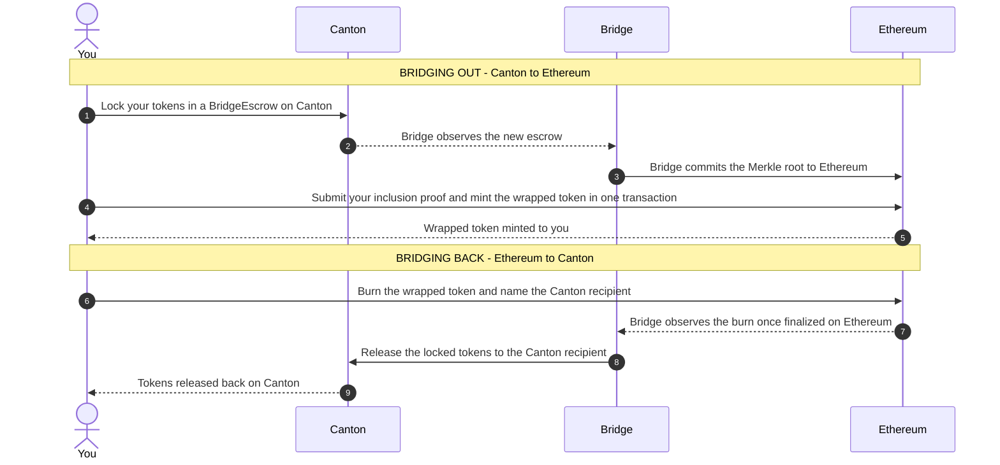

# Development Fund Proposal: Canton <-> EVM Merkle Attestation Bridge

| Field | Value |
| :---- | :---- |
|Author|[o1-labs](https://github.com/o1-labs)|
|Org|[o1Labs](https://o1labs.org) |
|Status|Draft|  
|Created|2026-07-17|
|Approved||
|PR| [#]()|
|Label|defi-liquidity, financial-workflows-composability  |
|Champion|Needs Champion |

---

## Note

:warning: This proposal is published as DRAFT without a Special Interest Group champion. We are actively seeking one, and welcome expressions of interest from SIG members.
We are sharing it at this stage to open the design to review and to start conversations with potential partners and collaborators. Some of that engagement is already underway, and we expect the specification to develop as feedback comes in. Feedback on the approach is welcome, and it should be read as a basis for discussion rather than a settled design. :warning:

## Abstract

This is a proposal to build the technical foundation for a round-trip bridge between Canton and EVM chains for Canton’s native assets. The proposal also briefly previews additional features that should be considered for a second phase of work before the foundation is used for an operational bridge. We anticipate that the foundation technology will benefit use cases beyond a bridge, wherever external representation of the state of a Canton subnet is desired.

The foundation uses a **Merkle ACS Sidecar**: a per-participant service that streams a participant's Active Contract Set (ACS) from the Canton Ledger API, maintains it as a Merkle tree, and posts the root to an ETH oracle. Anyone holding an inclusion path can independently verify that a specific Canton contract - an escrow, a holding, an attestation - was part of a participant's ledger state at a point in time, without being handed the participant's full ACS.

This enables a Merkle-commitment bridge: on the Canton→EVM leg, a user locks a native Canton asset in a `BridgeEscrow` Daml contract. The bridge operator includes the contract in a Merkle tree representation of a subset of its ACS, and submits it to an oracle contract on the EVM. A further set of EVM contracts enables verifying inclusion proofs against that root and minting a wrapped representation of the bridge asset. Reuse of the same escrow is rejected by a spent-escrow registry. For the EVM→Canton return leg, burn events of the wrapped asset are tracked and executed on Canton as transfers to the Canton destination.

Today, any Canton team that needs to prove ledger state to an external system will need to build its own bespoke signer set from scratch, with no standard commitment scheme, no mechanism for non-repudiation, and no reusable verification interface. This bridge is built on exactly that missing piece: a Merkle ACS Sidecar that commits provable, selectively disclosed claims about Canton state to an external chain. Because the sidecar is generic over which contracts it commits, the same commitment scheme this bridge relies on is immediately available to any other Canton team - for proof-of-reserves, compliance attestation, or other reporting use cases - without them touching the bridge at all. The result of this proposal is a sound foundation for a Canton↔EVM bridge and an open-source primitive underneath it that the ecosystem can immediately benefit from.

---

## Specification

### 1. Objective
Build a bidirectional bridge between Canton and Ethereum for assets issued on Canton, atop a Merkle ACS Sidecar built for this purpose. The sidecar itself is a general attestation primitive that developers on Canton can use for other reporting use cases such as proof-of-reserves, compliance attestation, and more.

The full vision for the bridge technology (**not included in this first proposal but intended for follow-up proposals**) consists of:

- Multi-party/expanded quorum design beyond the initial fixed signer (a follow-on proposal once the primitive has LocalNet interest traction).
- DevNet and MainNet deployment.
- P2P network hardening for the relayer/sidecar layer (peer discovery resilience, network-level DoS mitigation).
- Non-membership proofs (may be added later via an Indexed Merkle Tree upgrade).
- Slashing mechanisms, fraud-proof windows, or validator bonding economics.
- Token economics: pegs, redemption guarantees, collateralization models, or supply-cap management.

### 2. Implementation Mechanics
The bridge operates as two one-way flows, with the outbound flow anchored on a Merkle commitment rather than a live cross-chain call.

On the outbound leg, a user locks an asset on Canton. The bridge doesn't relay that fact to Ethereum directly - it accumulates a set of committed contracts (escrows, in this case) into a Merkle tree, and only the root of that tree is written to the Ethereum oracle contract. The user requests inclusion proof from the operator, then submits their proof against that root to claim their wrapped asset. This separation - commit a root once, let each user independently prove their own claim against it - is what lets the scheme scale to many concurrent transfers without the operator having to author or sign one message per transfer, and it's what makes the resulting commitments auditable after the fact: every root the operator ever posted is a permanent, timestamped record on Ethereum, so misbehavior is permanently recorded.

The inbound leg (Ethereum back to Canton) is structurally the same idea run in the other direction: a burn event on Ethereum is observed by the bridge and executed as a release on Canton.

Both legs share the same anti-replay design: a spent-escrow registry on the ETH side rejects a proof that's already been used to mint, and Canton's contract lifecycle (archiving the BridgeEscrow on release) prevents the same lock from being claimed twice. Operationally, the bridge runs as a small set of long-lived services: a sidecar process per participant that only reads the Canton Ledger API and writes Merkle roots to Ethereum, and a set of Solidity contracts that hold no logic beyond signature/proof verification, minting, and the replay registry. Nothing in this design requires changes to Canton's core protocol, the Daml SDK, or Ethereum client software - it is entirely additive infrastructure sitting at the boundary between the two networks. The above design can be deployed to any EVM compatible network.

#### Components

| Component | Role |
|---|---|
| BridgeEscrow Daml contracts | Daml contract logic which: - Locks a CIP-56/-112 asset in a treasury for bridging. - Creates a contract in the ACS, which the Merkle ACS Sidecar indexes and commits for bridging purposes. |
| EVM Bridge Contracts (Solidity) | A set of Solidity contracts which: - Model a permissioned Merkle root oracle - Verify Merkle inclusion paths for escrow leaves against committed roots - Mint wrapped assets when supplied a valid proof, and reject replays via a spent-escrow registry. - Allow burning wrapped assets to release the native assets back on Canton |
| Merkle ACS Sidecar and Proof Packaging Layer | A TypeScript process which: - Streams ACS via Canton Ledger API, maintains a Merkle tree of specified Daml template instances in the ACS - Produces self-contained JSON proof artifacts that are independently verifiable against the root oracle contract ABI without running Canton. - Serves inclusion proofs over HTTP - Commits roots to the EVM oracle - Tracks mint and burn events on Ethereum to synchronize and update the state of escrows on Canton |
| UI | A web UI that uses Canton/EVM SDKs to demonstrate End-to-End flow (Canton-> EVM, EVM->Canton). |
| LocalNet Stack (Dockerized) | Canton LocalNet + sidecars + Anvil + bridge contract, running the end-to-end flow on a fresh machine. |

Each component in the table above maps directly onto a step in the sequence above it: the sidecar produces the root that the bridge commits; the EVM contracts consume that root to verify and mint; and the Daml contracts define what "locked" and "released" mean on the Canton side throughout. There is no additional off-chain trust surface beyond the operator's control of root commitment itself.

### 3. Architectural Alignment
- **Selective Disclosure**: Privacy of the user is maintained until the user claims on the public chain.
- **Developer Experience:** a docker-compose reference implementation and an open-source TypeScript sidecar give every Canton ecosystem team a concrete starting point - not just example code, but the same commitment interface this bridge runs on, ready to be adapted and pointed at their own contracts. Documentation will be provided on how to adapt to different commitment cases.
- **Relevant CIPs:** CIP-56 and CIP-112 - BridgeEscrow supports CIP-56/112 transfer semantics; CIP-0103 (dApp SDK, approved) - the demo UI builds on the existing dApp SDK, exercising the same interaction patterns.

### 4. Backward Compatibility

No backward compatibility impact. The sidecar is a new, additive service that consumes existing Canton APIs without modifying any Canton protocol or Daml package dependencies.

---

## Milestones and Deliverables

### Milestone 1: Round-trip Canton↔EVM Bridge

|  |  |
|:----|:---- |
| Estimated Delivery | Month 3 from grant approval |
| Target Environment | Canton LocalNet + Anvil (EVM testnet) |
| Focus | Adoptable round-trip bridge following the logical steps:  1. Lock on Canton 2. Generate the Proof 3. Mint on EVM 4. Burn/lock on EVM 5. Proof  6. Unlock on Canton with a working web UI covering both directions |
| Funding |  |

**Deliverables:**

- Daml contracts which lock a CIP-56/-112 asset in a treasury for bridging and create a contract in the ACS, which the Merkle ACS Sidecar indexes and commits for bridging purposes.
- Solidity contracts that model a permissioned Merkle root oracle, verify Merkle inclusion paths for escrow leaves against committed roots and mint wrapped assets when supplied a valid proof, and reject replays via a spent-escrow registry. Supports the burning assets functionality to bridge back to Canton.
- Merkle ACS Sidecar that streams ACS via Canton Ledger API, maintains a Merkle tree of specified Daml template instances in the ACS, commits roots to the EVM oracle, produces self-contained JSON proof artifacts that are independently verifiable against the bridge contract ABI without running Canton, and serves inclusion proofs over HTTP.
- A web UI that uses Canton/EVM SDKs to demonstrate End-to-End flow (Canton-\> EVM, EVM-\>Canton).
- Dockerized LocalNet stack running the full end-to-end flow.
- Unit and integration tests for the sidecar and both Daml contracts (tree construction, root signing, proof generation, ACS stream handling, contract lifecycle).
- All code committed to a public GitHub repository under an open-source license (MIT or Apache-2.0), with CI passing.
- Documentation with high-level architecture, details and mitigations of double-spending attacks, and instructions for a developer to deploy and experiment with the delivered software stack

**Acceptance Criteria:**

- A round-trip flow for Canton Coin (Canton → EVM → Canton) completes end-to-end from docker, against Canton LocalNet and an Anvil EVM LocalNet, with the asset correctly returned to its original Canton owner.
- Proof artifact JSON is self-contained and independently verifiable on ETH without further operator involvement.
- Double-spend or double-claim attacks identified and listed in the delivered documentation are demonstrated to be rejected.
- Daml and Solidity tests pass in CI; integration tests pass against a real Canton LocalNet participant.
- Bridge contract source published to the public repository; UI is reproducible locally.
- Demo is presented to at least one named Canton ecosystem contact with recorded feedback.

---

## Acceptance Criteria

The Tech & Ops Committee will evaluate completion based on:

- Deliverables were completed as specified for each milestone.
- Demonstrated functionality via live demo or recorded walkthrough (end-to-end round-trip lock → proof → mint → burn → unlock on LocalNet).
- Documentation and developer onboarding materials have been published.

**Project-specific conditions:** all code released as open source (MIT or Apache-2.0) no later than Milestone 1 completion.

---

## Funding

---

## Co-Marketing

Upon release of the LocalNet dockerized environment and documentation, the implementing entity will collaborate with the Canton Foundation on:

- Coordinated announcements highlighting the bridge foundation technology and attestation primitive as shared developer tooling for the ecosystem.
- A technical blog post explaining how the bridge technology facilitates new assets joining the ecosystem. Asset issuers uncertain about deploying to Canton vs other chains could be encouraged to choose Canton because of the optionality of ETH liquidity exposure while maintaining Canton's "regulatory readiness".
- Participation in workshops, hackathons, office hours, or webinars showcasing bridge and private usage for the period of the month following the announcement, alongside more targeted adoption work.

---

## Motivation

### The Gap

Canton's accountability model is receipt-based: participants who share a contract exchange signed ACS commitments and can resolve disputes because they hold matching signatures. This works entirely inside Canton. It breaks down the moment a party outside the network - a smart contract on another chain, an auditor, a downstream compliance system - needs to reason about Canton state. That party isn't collecting signed receipts; it receives a claim, and today that claim has no cryptographic anchor to Canton's actual ledger state outside of Canton, beyond "this signer says so."

There is currently no standard mechanism for a Canton participant to make a selective, independently verifiable disclosure about a single piece of state.

### Why a Merkle Commitment

Every team that needs to expose Canton state externally today ends up building the same thing: a signer set that watches the ledger and attests to facts. That is a form of multisig, and multisig-style external attestation is the design that has produced over a billion dollars in bridge losses across the industry - Ronin (\$625M), Harmony (\$100M), and Multichain (\$130M+) were all, at core, a fixed signer set attesting to "this happened," where compromising or colluding among a minority of signers was sufficient to forge that attestation. Multiple independent industry analyses of bridge security converge on the same conclusion: multisig/committee attestation is auditable and simple, but its security ceiling is the honesty of a small, identifiable signer set, and it has been the most exploited category of bridge design to date.

Adding a requirement of Merkle commitments into the bridging protocol introduces provenance and non-repudiation that allow external parties that depend on the bridge to verify its continuous honest operation. Merkle commitments enable fraud- and fault-proof mechanisms that are otherwise not possible with a pure mint-burn multisig bridging approach.

**This is a Merkle-commitment-based bridge,** and it should not be marketed to institutions as trust-free. What it does improve, concretely, relative to ad hoc claim-based attestation:

- **Single root binds multiple bridge transfers.** The operator signs a Merkle root once, enabling a verifier to check inclusion proofs for an arbitrary number of Daml contract instances. A compromised or dishonest operator can forge a root, but cannot alter already-committed escrows without introducing a detectable fault. Since every posted root is a public, timestamped commitment, equivocation is detectable after the fact, which is not true of an unstructured "the committee says X" attestation.
- **Selective disclosure akin to Canton's own ledger model.** A user of the bridge reveals their bridging operation when they claim their asset on the target chain. Until the necessary public disclosure to operate on a public chain, the user’s privacy is preserved since the Merkle root reveals nothing without the user revealing their own inclusion proof.
- **One reusable, auditable interface instead of N bespoke ones.** Today, every Canton team that needs external verifiability reinvents its own signer set and attestation format. This gives the ecosystem a single, open-source, independently auditable commitment scheme (signed root + inclusion proof) that any team can build on, instead of N unaudited, undocumented multisig workarounds with varying attack surfaces.

### Who Benefits

1.  **Canton tokenization platforms** - institutions whose business models depend on tokenized assets reaching public-chain liquidity.
2.  **Bridge protocols** could integrate Canton without building Canton-specific attestation logic from scratch; the Merkle ACS primitive gives them a well-defined interface (a signed root, an inclusion path) rather than a bespoke integration.
3.  **Reporting and compliance pipelines** - proof-of-reserves, proof-of-activity, and proof-of-compliance use cases all reduce to the same inclusion-proof primitive, independent of the bridge itself, though the bridge is what proves the primitive works under real conditions.

Today, every Canton team solving these problems builds a bespoke system from scratch. This primitive is meant to replace that fragmentation with one shared piece of ecosystem infrastructure.

### Why Now

Canton Network is entering a phase of broader institutional adoption, bringing new interoperability requirements across permissioned and public blockchain ecosystems.

Institutions considering issuing assets on Canton as bearer assets may find the presence of a public-chain bridge useful to their operations, as it opens avenues for a best-of-both-worlds scenario: Canton-native, compliance-friendly assets bridged to public DeFi liquidity with a reduced engineering barrier to entry.

The Canton SDK and DevNet have matured to a stable platform for bridge development, and CIPs -56 and -112 have standardized token semantics in a way that simplifies cross-network asset representation. Together, this makes it practical to build the verification infrastructure this proposal specifies now, rather than waiting for each institutional integration to solve the same problem independently.

Building that commitment infrastructure as part of a real, adoptable bridge - rather than as a standalone specification - is what lets us validate the commitment scheme against actual production requirements now, so that the harder follow-on work (a multi-party quorum, network hardening) starts from a proven foundation instead of a whitepaper.

This proposal is squarely aimed at the Foundation’s stated priorities: shared developer infrastructure and security-hardening work that is a common good "used by multiple participants," not a private integration for a single team. A verification primitive that any Canton participant can adopt for their own attestation needs - proven first through a real bridge - is exactly the kind of reusable, ecosystem-wide infrastructure the Fund exists to seed.

---

## Rationale
There is no existing Canton component to extend here: Canton's native ACS commitment is built for bilateral reconciliation between participants who already hold the full set, not for proving a single contract's membership to an outside party - so this proposal builds a new primitive rather than modifying an existing one, and every alternative we considered (ad hoc per-team multisig attestation, a custodial lock-and-mint bridge, or a full light-client/ZK verification of Canton consensus) either doesn't meaningfully improve upon the signer-trust model that the Canton architecture provides, or is not practical within this project's scope today. This is a novel approach for Canton, deliberately scoped to prove the primitive and the bridge together, with hardening toward production readiness as explicit, separately funded follow-on work.

The end-game value of this direction, beyond the bridge itself, is that it lets a Canton participant interact with public chains while preserving selective disclosure of their ledger state right up until the point they are forced to reveal it on the public chain to claim an asset - a property no custodial or ad hoc attestation bridge gives you today.

### Follow-on work

Once this MVP has shipped and gained some validation in the form of demonstrated interest, we see the following work as concrete follow-on proposals (amongst others):

- Multi-party / expanded quorum design - removes the single-operator trust assumption this MVP accepts, replacing it with an m-of-n signer set so no single party can unilaterally forge a committed root. Unlike ad hoc, claim-based attestation schemes, this binds the quorum to one auditable Merkle commitment per claim rather than an unstructured "the committee attests X," making equivocation detectable after the fact.
- P2P network hardening for the relayer/sidecar layer - peer discovery resilience and network-level DoS mitigation, needed once the bridge is carrying production traffic rather than demonstration volume.
