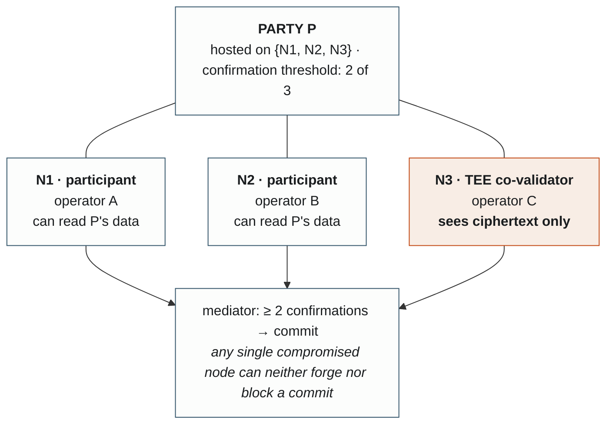
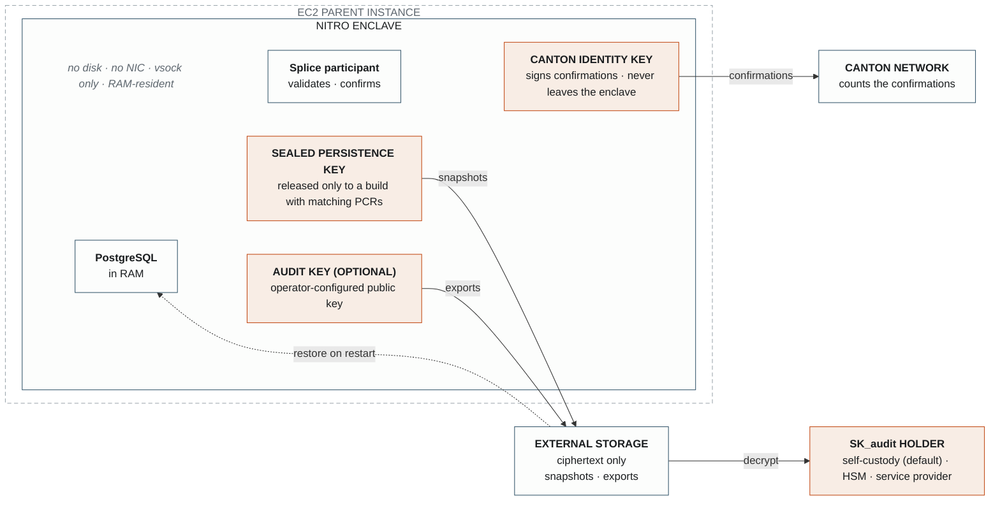
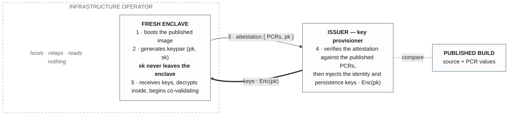

CANTON DEVELOPMENT FUND · PROPOSAL

**Canton Co-Validator in a TEE**

| AUTHORS | Jonathan Rouach, Alexey Koren — Financial Privacy Inc. |
| :---- | :---- |
| STATUS | Draft |
| CREATED | 2026-08-04 |
| LABEL | node-deployment-operations |
| CHAMPION | Shaul Kfir (Digital Asset) |

**Abstract**

Canton already has an answer to single-node trust: host a party on several participant nodes and require a confirmation threshold. The network relies on this mechanism for its most critical party, and the Covalidation Service productizes it for wallets and applications. What multi-hosting leaves in place is trust in each operator. The operator of every hosting node can read that node's state, and a compromised or coerced operator can tamper with it. Adding a co-validator today also means giving one more organization full visibility into the party's transactions.

We propose an open-source (Apache-2.0) co-validator that closes both gaps: a Canton participant running inside a Trusted Execution Environment, with reproducible builds, published attestation measurements, and encrypted external state persistence. Its operator cannot read its state, cannot alter it, and cannot sign in its name. Any operator can deploy it, and any third party can verify exactly which code holds the data. Co-validation gains a node class that adds confirmations without adding readers. We will deliver reproducible images, deployment tooling, operator documentation, and a reference deployment, developed against DevNet and TestNet.

**Figure 1** — A multi-hosted party with a TEE co-validator in its hosting set. N3 adds a confirmation without adding a reader. Diagram grammar, used throughout: **solid border** \= inside the trust base, **dashed** \= outside it, **orange** \= cryptographic key material or the property it protects.

**Specification**

**1\. Objective**

We will deliver a single, production-grade, open-source Canton co-validator: it runs a participant inside a TEE, participates as a Confirmation-level host for multi-hosted parties, and persists its state as encrypted artifacts outside the enclave.

Out of scope: compliance and disclosure logic, analytics integrations, and key-custody services. These are downstream consumers of the open interfaces defined here, not part of this proposal.

**2\. Implementation Mechanics**

**Packaging.** We run a Splice participant and its PostgreSQL store as a single multi-process image inside a TEE Enclave. It is wrapped by a harness running inside an enclave, developed by FPI. It manages enclave access and acts as a proxy for certain operations. The deliverable is that image, host-side setup scripts (docker-compose and Terraform), and documentation; standard host components such as the vsock proxy are documented rather than shipped. A working prototype exists: the enclave-packaged node has run against a simulated Canton network, and we separately operate standard, non-enclave validator and TestNet participant nodes. That operating experience feeds directly into the tooling and runbooks this proposal delivers. Milestone 1 merges the two tracks: the enclave-packaged node synchronizing DevNet.

**Attestation.** We build reproducibly, publish PCR0/1/2 per release, and provide a verification guide so any third party can rebuild the image from source and check the measurements against a running enclave’s attestation document. Trust in the node reduces to trust in published, reviewable code.  We use Splice binaries signed by Digital Asset as a core building block for reproducible builds. 

**Keys.** Three keys, with three distinct jobs:

* *Canton identity key.* The co-validator's signing key, the identity whose confirmations the network counts. It is provisioned into the enclave and never leaves it. This is what makes the co-validation itself trustworthy: if this key were available outside the TEE, its holder could sign confirmations from anywhere.

* *Sealed persistence key.* Enclaves have no persistent storage, so state lives outside as encrypted snapshots. This key encrypts them, and it is released only to an enclave whose measurements match the published build. A new enclave instance restores from the latest snapshot instead of starting from zero, and no human ever holds the key.

* *Audit key (optional).* The enclave can additionally encrypt state exports to a configured public key. Local key generation ships in the repository, and self-custody is the default; an HSM or an external custodian is a configuration choice.

**Figure 2** — Three keys, three jobs. The identity key never leaves the enclave; the persistence key returns only to a build with matching measurements; the audit key is an optional, operator-configured interface whose private half sits wherever the operator chooses. The operator of the EC2 parent instance sees ciphertext and vsock traffic only.

**Provisioning.** The party that benefits from the co-validation, typically the asset issuer, provisions the keys. A fresh enclave generates a keypair and produces an attestation binding its public key to the measurements of the running build. The issuer verifies the attestation against the published values and injects the identity and persistence keys, encrypted to the attested public key. An independent infrastructure operator can therefore run the co-validator without ever being able to read its state or sign on its behalf. The same procedure applies to enclaves the issuer runs itself.

*The operator relays every byte of this exchange — and can read none of it, and can sign nothing.*

**Figure 3** — Attestation-verified key injection. Keys reach only an enclave that proves it is running the published build; the operator's role ends at hosting.

**Co-validation.** The node registers as a Confirmation-permission host for a multi-hosted party; its confirmations count toward the party’s k-of-n threshold, the same mechanism the network’s DSO party uses across Super Validators.

**Tracked design decision.** Whether audit-key exports use the raw participant store or a PQS-shaped projection that standard query tooling can read once decrypted. Snapshots for restore stay raw either way. We will document the choice and its rationale in the repository.

**3\. Architectural Alignment**

Functionally, a TEE co-validator behaves exactly like any confirming participant in the existing co-validation model. It hosts parties, validates its view, and counts toward confirmation thresholds. Protocol, standards, and topologies are unchanged. The difference is the trust boundary: the node's operator sits outside it, so co-validation no longer requires showing another organization the party's transactions. Canton gains cooperative validation that preserves financial privacy. The work fits the fund's stated scope under CIP-0082 (security, reference implementations, critical infrastructure) and operates within CIP-0100 governance.

**4\. Backward Compatibility**

Purely additive. A TEE co-validator joins a party's hosting set like any participant. No protocol changes; no changes required from other nodes; removal is an ordinary topology change. A natural follow-on, outside this proposal's scope, is protocol-level recognition of TEE attestations, so that the network itself, rather than the key provisioner, blesses valid enclave builds. We would be glad to draft that as a separate proposal once this model has proven itself.

**5\. Software upgrades**

Operators are able to upgrade Splice to newest versions without a complicated process involving direct involvement of a Party. We assume trust to Splice binaries signed by Digital Asset. Based on this assumption, the harness inside an enclave will accept an upgrade command from an Operator and switch running Splice binaries internally. This is done without a Party directly authorising an update. 

**6\. Limited access to the Canton node**

Operators don’t have direct full access to Ledger API to protect Party’s privacy. Access to debug logs is also limited. For cases when selective access is required, e.g. for mapping a Party to a participant \- there is a command in harness that will deliver required call data and signatures to the node. This may include, for example, enabling temporary access to debug logging for operators. 

**Milestones**

| \# | MILESTONE | EST. DELIVERY | FOCUS AND DELIVERABLES |
| :---- | :---- | :---- | :---- |
| **M1** | Attestable node on DevNet | Week 3 | Enclave-packaged Splice participant synchronizing DevNet; reproducible build pipeline; published PCR values and third-party verification guide |
| **M2** | Encrypted persistence and provisioning | Week 6 | Snapshot/restore via the sealed persistence key; attestation-verified key injection; audit-key export path with local keygen; restart without data loss |
| **M3** | Confirming co-validator | Week 9 | Confirmation-level hosting of a multi-hosted party on TestNet, with the enclave node's confirmations counted toward the threshold |
| **M4** | Hardening and independent review | Week 12 | Threat model; independent security review of the enclave image, key handling, and provisioning flow, with remediations; Splice upgrade runbook demonstrated |
| **M5** | Adoption | Week 16 | Reference deployment, operator documentation, onboarding support; at least three independent organizations operating co-validators |

**Acceptance Criteria**

Each criterion is verifiable by parties other than us.

* **M1.** A reviewer outside our team reproduces the build from source and confirms the resulting PCR values match both the published values and a live enclave's attestation document.

* **M2.** A co-validator runs at least 24 hours of continuous sync, including at least one full restart from an encrypted snapshot with no state loss. An operator demonstrates export decryption with a self-generated audit key. The parent instance and its operator see only ciphertext.

* **M3.** On TestNet, a party multi-hosted across two or more participants, one of them the enclave node, commits transactions with the enclave node's confirmations counted toward its threshold.

* **M4.** The security review report is published together with remediations; an upgrade across two Splice versions is executed per the runbook.

* **M5.** At least three organizations, independent of one another and including at least one unaffiliated with Financial Privacy Inc., each operate a co-validator for at least 30 days on TestNet or MainNet.

**Funding**

Total: **3,630,000 CC** (reference ≈ USD 450,000 at $0.124 on 2026-08-31; we will re-strike CC amounts at the prevailing price on submission).

* Milestone 1: 340,000 CC upon committee acceptance

* Milestone 2: 455,000 CC upon committee acceptance

* Milestone 3: 565,000 CC upon committee acceptance

* Milestone 4: 455,000 CC upon committee acceptance

* Milestone 5 (adoption): 1815,000 CC upon committee acceptance

Funding covers engineering, infrastructure (enclave-capable instances, multi-environment nodes, storage), an independent third-party security review, documentation, and a twelve-month post-M5 maintenance and support commitment for the released artifacts. Project duration is approximately four months, so milestone amounts are fixed in CC under the fund's terms for projects of six months or less.

**Co-Marketing**

We will coordinate announcements with the Foundation at M1 and M5, publish a technical series suitable for Foundation channels — the architecture, a walkthrough of independently verifying the attestation, and the operations runbook — run a hands-on workshop for prospective operators during M5, and submit conference talks on TEE-hosted co-validation.

**Motivation**

Institutional participants face a recurring question: why should a counterparty trust a ledger view maintained by nodes you operate? Multi-hosting answers it, and every current form of it — running more nodes yourself, adding a partner, or engaging a managed service — extends the circle of organizations that can read the party's data and must be vetted. A TEE co-validator adds a confirmation without extending that circle. Beneficiaries: wallets, applications, issuers, and institutions hosting parties on Canton; infrastructure operators who want to offer co-validation without asking customers for trust or visibility; and the network itself, whose trust story strengthens without any protocol change.

**Rationale**

Co-validation through multi-hosted parties and thresholds is already the network's mechanism, and the Covalidation Service already offers it as a managed product. We extend that model with a new node class rather than building a parallel trust system, and we build the artifact to work alongside existing managed offerings, applications, and asset standards.

Alternatives we considered: proving node execution with zero-knowledge proofs is not practical for a full participant today, and multi-party computation across operators redistributes operator trust rather than removing it. A TEE with reproducible builds and remote attestation is deployable now on commodity cloud infrastructure.

**Disclosure.** We operate a commercial key-custody and selective-disclosure business at Financial Privacy Inc. and expect to offer it as one optional consumer of the audit-key interface specified here. The interface is open, local self-custody ships as part of this project, and nothing in the funded work depends on our services.

Financial Privacy Inc. · prepared 2026-08-04

Proposal text CC0-1.0 per canton-dev-fund repository policy · software artifacts Apache-2.0
