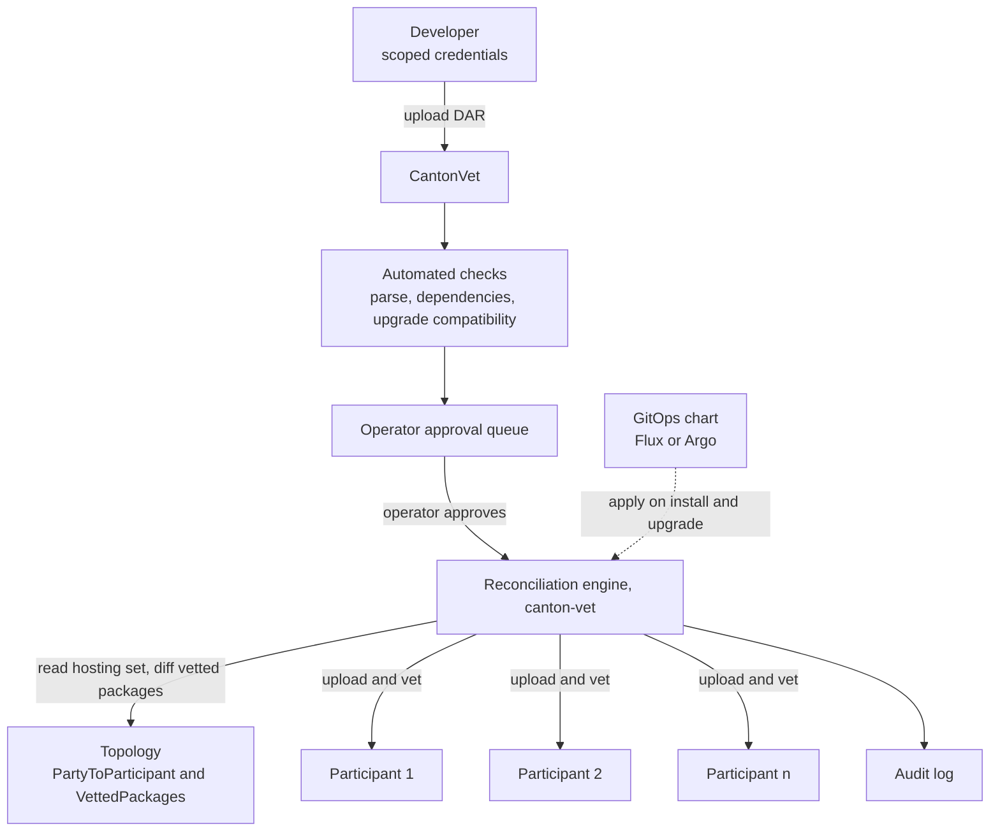
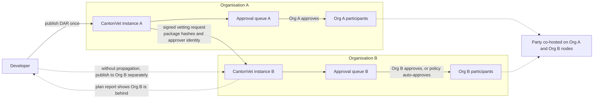
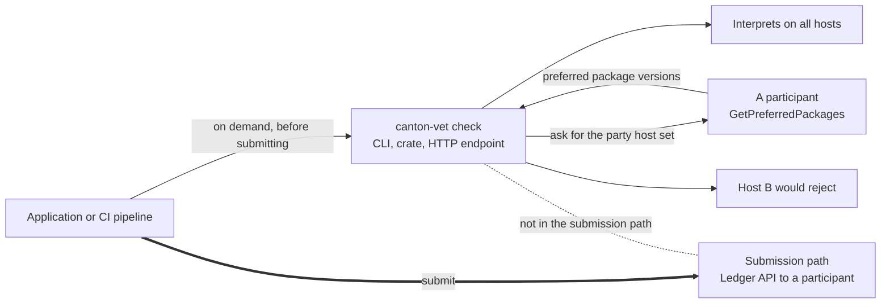

# CantonVet: DAR Distribution and Vetting Reconciliation for Validator Operators

**Organization:** K2F Labs
**Author:** [K2F Labs](https://k2flabs.com), Kevin Ko (kko@k2flabs.com)
**Status:** Draft
**Created:** 2026-08-27
**Proposal Type:** RFP-aligned
**RFP / Roadmap Area:** RFP 3, Automated Application Management. Secondary RFP 18, Integration into SDLCs.
**Champion:** `Needs Champion`
**Total Funding Request:** 1,800,000 CC
**Project Duration:** 6 months engineering (Milestones 1 to 3), adoption window 12 months from Milestone 3 acceptance
**Label:** dar-app-management

---

## Abstract

A Daml application reaches a validator by largely manual means today. A developer finishes a DAR and messages the operator of every participant that needs it, over Slack or Telegram. The operator uploads the file by hand on each node, vets it, and replies, spending developer time. The next version repeats the whole exchange. If one node is missed, nothing warns anyone, and commands on that node fail later.

This proposal funds CantonVet, an open-source application management service for validator operators, in the shape RFP 3 describes. A developer publishes a DAR once with their own credentials. Automated checks run. The operator approves in one place. CantonVet then uploads and vets the package on every participant that hosts the relevant parties. It keeps those participants in sync. Two components sit underneath. A reconciliation engine treats the packages a party needs as declared state. A pre-flight check answers, on demand, whether a command will interpret on every host of a party. The code is Rust under Apache-2.0, and it runs beside a validator with no changes to Canton or Splice.

K2F Labs operates validators on MainNet and runs a self-custodial wallet and a DEX on Canton MainNet. We run this upload and vet exchange several times a week, for our own releases and for application teams we host.

---

## Motivation

RFP 3 names the gap directly. It asks for "new Validator node tooling that integrates mechanisms for Daml application management including application discovery, review and security analysis, approval, installation and upgrading", and it states that "individual parties, including both the node operator party and hosted parties, may choose to vet and/or unvet Daml packages, across all Validators with hosting rights for a given party". Nothing funded today covers the approval, installation and upgrading parts of that sentence.

Canton notably does not close this gap.

- Canton propagates package vetting metadata automatically. Uploading a DAR publishes the participant's `VettedPackages` topology state to every connected synchronizer.
- Canton never propagates the DAR itself. No Canton protocol message carries package bytes. A participant that receives a transaction referencing a package it lacks rejects it rather than fetching it.
- The Canton documentation states that "All Participant Nodes running the app must have the app DARs loaded independently as they aren't shared". The requirements documentation still lists automated Daml package distribution as a limitation.
- Per-node automation does exist. Canton ships an alpha declarative configuration that can pull a DAR from a URL the operator sets, and Splice auto-vets the DARs compiled into its own binary.

Neither per-node mechanism reconciles across the several participants that host one party. There is no protocol-level distribution, and no tool makes one party's hosts agree.

We pay for this on every release. As a wallet provider and a validator operator we run the exchange several times a week, once per application team and once per version. When we rolled our own wallet out across our validators, hand vetting on every node had to finish before the new build could roll, so a routine release became a coordination window. When our DEX shipped a version that expected a newer package and one participant was still on the older one, nothing warned anyone. The command was accepted and interpreted, then failed, and the traffic was paid. The settlement sat past the deduplication window until a person cleaned it up. The pattern repeats. It costs the operator time on every release from every team, and it costs the developer time for every operator. 

Co-validation makes this harder. Every additional host of a party is another participant that must carry the same packages or reject that party's transactions. CIP-0120 pays validators for confirming on co-hosted parties, so the network is incentivising organisations toward co-validation and the number of hosts per party is expected to rise. The Canton upgrade model also asks operators to vet compatible versions side by side, which is one more state to get right on each node. Vetting checks get stricter with each release. Most operators handle all of this today with chat messages and shell scripts.

The following groups benefit.

- Validator operators that host applications they did not write.
- Application teams that ship to more than one operator.
- Any party that is hosted on more than one participant, today or under CIP-0120.
- Wallet providers.

---

## Why the hosting set matters

A DAR must be present on every participant that will interpret transactions for a party. Everything else follows from that rule.

A party can be hosted on one participant or on several. When it is hosted on several and the application upgrades a DAR, every host must receive the new version. A host that does not have it rejects that party's transactions, and the rejection arrives after the command was accepted and paid for. The operator therefore needs to know one thing. Is this package on every node that hosts this party?

---

## Architecture

One organisation runs one service beside its validators, and a developer with scoped credentials publishes into it. The reconciliation engine reads the hosting set from topology, works out which of the operator's participants are behind, and applies the approved change to each of them.

---

## Specification

### 1. Objective

If this proposal is approved, at the end of the grant the following is true.

1. A developer publishes a DAR once through a portal or a CLI, using credentials the operator issued.
2. The operator sees one approval item with the automated checks already run against it. The operator approves or rejects it with a reason, and is finished.
3. Within minutes the package is uploaded and vetted on every participant that operator runs which hosts the relevant parties. The developer sees per-host status.
4. If a participant drifts out of line later, CantonVet reports it and repairs it under the same approval step.
5. An application or a CI pipeline can ask, before submitting, whether a command will interpret on every host of its party, and be told which host would reject it.
6. Where a party is hosted by more than one organisation, the developer still publishes once, and each organisation still approves for itself on its own nodes.
7. Every action above appears in an audit log that records the actor, the package, the hosts touched, and the resulting topology serials.

### 2. Implementation Mechanics

CantonVet is one Rust binary built on axum, tonic, sqlx and Postgres, with a small TypeScript interface. It is also published as a crate and a Helm chart.

**The reconciliation engine.** The operator declares, per party, the DAR files or package versions that party requires. The engine resolves the party's hosting set from the `PartyToParticipant` topology mapping. It reads each host's vetted packages from synchronizer topology state. It then computes the difference across missing, stale, extra and unmet dependencies. `plan` is read-only and exits non-zero on drift, so it runs in CI. `apply` uploads through the admin API with `vet_all_packages` and `synchronize_vetting`, waits for the change to become effective on the synchronizer, and re-checks. Before vetting a new version alongside an old one it runs the Daml upgrade compatibility check, which today only fails at deploy time. Example. An operator runs `plan` nightly and gets an alert naming the one participant of five that is a version behind. Un-vetting goes through the same approval, and CantonVet refuses it while any party hosted on the operator's nodes still has live contracts on the package, which is the check Canton applies to DAR removal but not to un-vetting.

**Pre-flight.** Canton picks one version per package for a whole submission. On a party hosted by several participants, the version the submitting participant prefers may be one a co-host has not vetted. The check asks `GetPreferredPackages` for the parties in a command. It reports whether the chosen versions are vetted on every host, and which host would reject. The check ships in three forms.

- A CLI for pipelines.
- A Rust crate.
- One HTTP endpoint any application in any language can call.

It runs on demand and never sits in the submission path, so it adds no latency and creates no dependency for normal traffic. Example. A CI job runs the check against staging before a release and fails the build because one co-host is behind.

An application chooses whether to ask and the submission path is the same either way.

**The management service.** A web service in front of the engine, run by the operator in their own cluster. Developers get credentials scoped to the parties and package names they own, issued through OIDC against the operator's identity system or as API keys. A developer submits a DAR by upload or by Git reference. Automated checks then run before a human sees it.

- The DAR parses.
- Dependencies resolve against what is already vetted.
- Upgrade compatibility passes.
- Any external check the operator has configured runs.

The result lands in an approval queue, and every action is written to an audit log. Operators can set policies such as auto-approve for a trusted developer's patch releases, or two approvers for a new package name. Example. A hosted team pushes a patch release at 2am and it is vetted without waking anyone, because the operator allowed that developer's patch versions.

**Multi-operator propagation.** Where a party is hosted by more than one organisation, the flow is the following.

1. The developer publishes to one instance, normally the operator they already work with.
2. That instance reads the party's hosting set from topology, so it knows which other organisations host the party.
3. On approval it produces a signed vetting request and delivers it to those organisations' instances.
4. Each receiving instance verifies the signature and package hashes and places the request in its own approval queue.

Topology gives participant ids and not addresses, so each operator keeps a small directory mapping the participants of other organisations to the instance that serves them. Where an organisation is not reachable that way, the CLI can publish to several instances in one command, given credentials for each. The developer publishes once and each organisation still decides for itself. That decision can be a click in the queue, or a policy. An operator can keep an allow-list of publishing organisations whose signed requests are approved without a human, after the signature and package hashes are verified, and hold everything else for review.

**GitOps chart.** A Helm chart runs `apply` on install and upgrade, with the package set taken from the Git artifact. A package set is deployed the same way as the application that needs it. Example. A chart upgrade that declares a DAR file which is not present fails the install rather than silently doing nothing.

#### One organisation, and several

The two cases need different things.

**Case A, one organisation with several validators.** The organisation runs one instance of CantonVet. A developer publishes to it once. The operator approves once. The engine applies to every participant that organisation runs which hosts the party. There is no cross-organisation step.

**Case B, a party co-hosted across organisations.** Each organisation runs its own instance and controls its own nodes. No organisation can vet a package on another organisation's participant.

The solid path is the propagation path, and the dotted path is what a developer does without it.

Without propagation, Case B still works and is still a large improvement on chat. The developer publishes to each organisation separately, through each organisation's own portal, and each operator approves in their own queue. The plan report also helps with this, as it names which hosts of the party are behind and on which version, so the developer knows who to go to and when the work is done. 

With propagation, the developer publishes once. The first organisation's instance produces a signed request, and the other organisation's instance imports it into its approval queue. Three properties make that safe to accept from another organisation.

1. The request carries package hashes. A Canton package id is the hash of the package, so the receiving instance can verify that the DAR it is about to vet is the exact package that was approved. The file cannot be swapped in transit.
2. The signature identifies the approving operator using a key that is already in topology. The receiving instance checks who approved it against network state it already trusts, with no new registry and no new key distribution.
3. The receiving operator still approves. The imported request arrives as a queue item, not as an instruction. Nothing is uploaded or vetted on the second organisation's nodes until that organisation's own operator says yes.

Propagation removes the developer's repeated work without needing to move any authority between organisations.

#### What we are not building

- No package provenance or metadata standard.
- No static analysis of Daml, although we do aim to integrate with existing projects.
- No package registry.
- No changes to Canton or Splice.

### 3. Architectural Alignment

RFP 3 asks for "new Validator node tooling that integrates mechanisms for Daml application management including application discovery, review and security analysis, approval, installation and upgrading", and states that "individual parties, including both the node operator party and hosted parties, may choose to vet and/or unvet Daml packages, across all Validators with hosting rights for a given party". This proposal builds the review, approval, installation, upgrading and per-party vet and unvet parts of that sentence, across all hosts of a party. It integrates the analysis part rather than rebuilding it. The RFP anticipates multiple grants and names Certora's analyser as the prior example, which we intend to integrate with.

RFP 18 asks for tooling that integrates Canton development into "CI/CD pipelines, testing frameworks, deployment workflows, package vetting, environment management, and release automation". The `plan` command, the pre-flight check and the GitOps chart are that integration.

Canton's upgrade model relies on operators vetting compatible versions side by side, and on the participant selecting a preferred package per submission. The engine works inside that model. It verifies upgrade compatibility before vetting. For the pre-flight it uses `GetPreferredPackages`, the same selection the participant itself makes. It introduces no new topology mapping and no new protocol behaviour.

### 4. Backward Compatibility

No backward compatibility impact. Packages vetted by hand are visible to the engine as existing state. Operators can adopt `plan` without CantonVet, or CantonVet without the GitOps chart. Removing CantonVet would leave the participants exactly as they are.

---

## Milestones and Deliverables

All code is public under Apache-2.0, in a repository under the K2F Labs GitHub organisation.

### Milestone 1: Reconciliation engine and pre-flight
- **Estimated Delivery:** Month 2
- **Focus:** `plan`, `apply` and the pre-flight check. Covers topology-driven host discovery, dependency closure, the upgrade compatibility gate, and the check exposed as CLI, crate and HTTP endpoint.
- **Deliverables / Value Metrics:**
  - Public repository with the CLI and the crate published.
  - A published demo on a local network, with a party hosted on two participants, running this sequence.
    1. `plan` reports the package present on one host and missing on the other.
    2. A command submitted anyway fails on the missing host.
    3. `apply` repairs the drift.
    4. The check returns green, and the same command then succeeds.
  - `plan` runs read-only against a participant the operator does not administer and reports its vetting state correctly, verified on a public network.
  - Three application teams or operators outside K2F Labs run `plan` against their own participants and report the result in a public issue.

### Milestone 2: Upgrade gate, cross-organisation drift and GitOps
- **Estimated Delivery:** Month 4
- **Focus:** The upgrade compatibility gate, drift reporting for hosts the operator does not run, and the Helm chart for declarative deploys.
- **Deliverables / Value Metrics:**
  - Before vetting a new version next to an old one, CantonVet runs the Daml upgrade compatibility check and refuses an incompatible pair with the reason, instead of letting it fail at deploy time. Demonstrated with a deliberately incompatible version on LocalNet, run published.
  - `plan` runs read-only against a participant the operator does not administer and reports that host's vetting state for a co-hosted party correctly, verified on a public network against a participant run by another organisation.
  - Un-vetting works through the same `plan` and `apply` flow and the same approval step as vetting, so an operator retires a package the way they roll one out. It is refused while any party hosted on the operator's nodes still has live contracts on the package, and the contracts are named. Run published.
  - The Helm chart applies a declared package set on install and upgrade. It fails the install when a declared file is missing, rather than silently doing nothing. Demonstrated on a public network for at least one of our validators.
  - Operator guide and configuration reference.
### Milestone 3: Management service
- **Estimated Delivery:** Month 6
- **Focus:** The self-service portal and API. It covers the following.
  - Developer credentials.
  - Upload by file or Git reference.
  - Automated checks.
  - An approval queue with policies.
  - An audit log and per-host status.
  - The signed cross-organisation request.
- **Deliverables / Value Metrics:**
  - An end-of-milestone demonstration on a public network, using one of our validators and an external developer's DAR, running this sequence.
    1. A developer with credentials publishes a DAR through the portal.
    2. Automated checks run, including one external analyser integration and one provenance check where the upstream work has shipped.
    3. An operator approves.
    4. The package is vetted on every host of the developer's parties within five minutes, with the audit trail visible.
  - A second organisation's instance imports a signed request from the first and applies it after its own approval, demonstrated between two organisations on a public network.
  - Two external application teams publish through an instance we run and report their experience in a public write-up.
  - The request format written up and presented to the DAR and Application Management SIG.

### Milestone 4: Adoption
- **Estimated Delivery:** 12-month window from Milestone 3 acceptance
- **Focus:** External operators running CantonVet, and external developers publishing through it.
- **Deliverables / Value Metrics:** Paid per event, so partial adoption pays partially.
  - 100,000 CC per external validator operator, other than K2F Labs, that runs CantonVet or the engine in production for at least 30 days. Evidence is vetting topology transactions on a public network, or a private attestation to the Canton Foundation. Up to 4 operators, 400,000 CC.
  - 50,000 CC per external application team that publishes at least one package to MainNet through an instance run by an operator other than K2F Labs. Up to 4 teams, 200,000 CC.
  - 150,000 CC completion tranche on all three of the following.
    1. At least 5 external GitHub issues or pull requests.
    2. At least 3 community-reported issues triaged to resolution.
    3. A public case study coordinated with the Foundation.
  - Any amount not earned within the window returns to the Development Fund.

---

## Acceptance Criteria

The Tech and Ops Committee will evaluate completion based on the following.

- Deliverables completed as specified for each milestone.
- Demonstrated functionality on a public Canton network for Milestones 2, 3 and 4.
- The pre-flight check exercised through the same Ledger API surface an application would use. Test hooks do not count.
- Adoption in Milestone 4 counted only for organisations other than K2F Labs. Letters of intent do not count.
- Documentation sufficient for an operator outside K2F Labs to run the engine and CantonVet without our help, tested by the external runs in Milestones 1 and 3.

---

## Funding

**Total Funding Request:** 1,800,000 CC

### Payment Breakdown by Milestone
- Milestone 1 (Reconciliation engine and pre-flight), 350,000 CC upon committee acceptance
- Milestone 2 (Upgrade gate, cross-organisation drift and GitOps), 300,000 CC upon committee acceptance
- Milestone 3 (Management service), 400,000 CC upon committee acceptance
- Milestone 4 (Adoption), up to 750,000 CC, paid per event as described above

Engineering totals 1,050,000 CC.

### Delivery schedule

Milestones 1 to 3 are due within 6 months of grant approval.

- Early delivery. If all three are accepted within 5 months, a 20 percent bonus of 210,000 CC is added to the Milestone 3 payment. This follows the 20 percent acceleration bonuses in the Token Standard V2, ISS-BFT, PQS and C#/.NET SDK grants, and the one-month-early trigger used by the application metadata standard and Obsidian package distribution proposals.
- Beyond month 6, the remaining milestones are handled under the Volatility Stipulation.

### Sizing

Engineering is about 26 engineer-weeks at roughly 40,000 CC per engineer-week, the rate recent external grants price at. Parts of the engine and the GitOps path exist today. The table below compares grants of similar scope in the same area. Two rows are there to set the price and three to show where the boundaries with funded work are.

| Grant                                                                             | Requested    | Why it is here                                                                                             |
| --------------------------------------------------------------------------------- | ------------ | ---------------------------------------------------------------------------------------------------------- |
| Walnut dpm trace tooling                                                          | 1,900,000 CC | Price reference. A funded developer tooling grant of the same size in the same RFP family                  |
| BitDynamics devkit                                                                | 1,900,000 CC | Price reference. A funded developer tooling grant of the same size. Its DAR commands work on LocalNet only |
| PixelPlex and Digital Asset application metadata and deployment standard (PR 606) | 2,000,000 CC | Boundary. Defines DAR metadata and pushes from a repository to one node. CantonVet consumes it as a check  |
| Certora Daml package analyser                                                     | 2,010,000 CC | Boundary. Static analysis of Daml. CantonVet calls it as a check                                           |
| This proposal                                                                     | 1,800,000 CC | Reconciliation across the hosts of a party, approval workflow, upgrade gate, pre-flight                    |

This request is priced below the metadata standard because it consumes standards rather than defining them.

### Volatility Stipulation

Engineering milestones 1 to 3 complete within 6 months. The grant is denominated in fixed Canton Coin and follows the standard re-evaluation at the 6-month mark, with the 12-month adoption window reviewed at the 12-month mark.

---

## Co-Marketing

Upon release, K2F Labs will collaborate with the Foundation on the following.

- Announcement coordination at Milestone 1 for the engine and Milestone 3 for CantonVet.
- A technical write-up on package lifecycle management for parties hosted on several participants, published on the Canton Network blog or forum.

---

## Rationale

**Why a service beside the validator.** Vetting is an admin API operation on each participant, so the component that performs it has to run where the operator's credentials are. An independent Rust service, with no changes to Canton or Splice, ships on its own schedule and is reviewable in the open. Each operator can adopt it or remove it on its own. The engine can also read participants the operator does not administer, because vetting state is public topology.

**Why an approval workflow and not only automation.** Operators have to stay in control of what runs on their nodes, and RFP 3 says approval explicitly. The change here is that uploads become self-service for the developer and one action for the operator, with checks and an audit trail in between. Auto-approval is a policy an operator can switch on for specific developers and release types.

**How this fits the funded work on packages.** We extend what exists rather than introduce parallel infrastructure. The application metadata and deployment standard in PR 606 defines how a DAR's source, audit and dependencies are described, and includes automation to upload from a conforming Git repository. This service consumes that metadata as one of its checks, and can take a conforming repository as the input to a publish request. The Obsidian package distribution grant covers signed provenance and distribution of packages, and states that per-network vetting state is out of its scope. This service verifies provenance where a signature is available. Certora's analyser covers static analysis of Daml, and this service calls it as a check. None of the three covers the following, and none of them claims to.

- Reconciliation across the hosts of a party.
- Refusing to un-vet a package that a hosted party still uses.
- Pre-flight against the hosting set.
- An operator approval workflow.

**Why the engine is also a crate and an HTTP endpoint.** The pre-flight is only useful if applications can call it, and applications are written in many languages. The crate serves Rust services and the endpoint serves everything else. Pipelines use the CLI.

---

## Adoption and Go-to-Market

From Milestone 3 we will run CantonVet for the application teams already hosted on our validators. That gives us developer feedback immediately. Those teams do not count toward Milestone 4.

For external adoption we will approach three groups.

- Validator operators in the Node Deployment and Operations SIG.
- Wallet providers that host applications written by other teams.
- Application teams that coordinate uploads with us over chat today. They have the same problem with every other operator they ship to.

We ask the Foundation for two things, as a good-faith collaboration and not a precondition for any milestone.

- Introductions to operators hosting several application teams.
- A slot at a DAR and Application Management SIG call at Milestone 3.

---

## Maintenance and Sustainability

Core maintenance is self-funded. We run CantonVet on our own validators for the teams we host, so keeping it current with each Canton and Splice release is part of our own upgrade cycle and continues regardless of grant status. Beyond the grant we propose a maintenance tier of 100,000 CC per quarter for the external-facing work that commercial self-interest does not cover. That tier covers the following.

- Updates as the metadata, provenance and analysis integrations evolve.
- Issue triage and pull request review within five business days.
- Adopter support.
- A quarterly adoption report.

Transferability is an acceptance criterion in Milestones 1 and 3, so operators and developers outside K2F Labs must be able to run the engine and CantonVet from the documentation alone. If our stewardship capacity ever becomes impaired, ownership of the repository transfers to the Foundation by mutual agreement.

---

## Team Background

K2F Labs is a Canton Foundation participant and has built on Canton for over a year. We operate validators on MainNet and run a self-custodial wallet and a DEX on Canton MainNet. Together those have processed over 500,000 transactions for more than 60,000 participants, through a production Rust SDK for Canton that we maintain. The team is led by Kevin Ko, an ex-Google engineer.

We have run the process this proposal replaces on every release, for our own applications and for teams we host. The GitOps upload and vet chart it starts from has run on our MainNet validators through every release this year.
