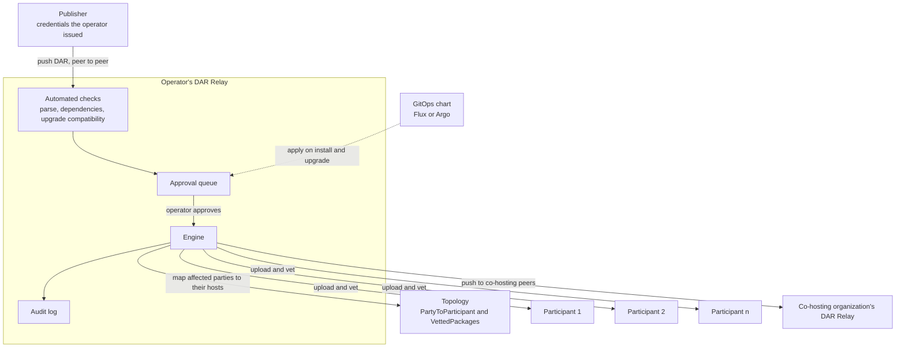
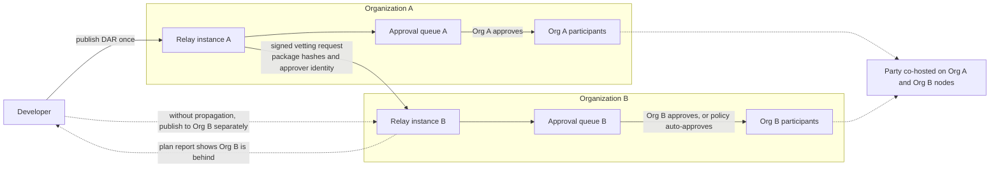

# DAR Relay: Cross-Organization and Automated DAR Distribution and Deployment

**Organization:** K2F Labs
**Author:** [K2F Labs](https://k2flabs.com), Kevin Ko (kko@k2flabs.com)
**Status:** Draft
**Created:** 2026-08-27
**Proposal Type:** RFP-aligned
**RFP / Roadmap Area:** RFP 3, Automated Application Management. Secondary RFP 18, Integration into SDLCs.
**Champion:** `Needs Champion`
**Total Funding Request:** 1,800,000 CC
**Project Duration:** 6 months engineering (Milestones 1 to 3), adoption window 12 months from Milestone 3 acceptance
**Label:** dar-app-management

---

## Abstract

Today, a developer who wants a validator provider to run a new Daml release will often send its DAR over Slack or Telegram. An operator uploads it and vets the packages, declaring that its participant supports them, then confirms when it is ready. If several nodes or providers need the release, the developer repeats that exchange and keeps track of who has finished. The same coordination starts again with the next update.

DAR Relay gives developers and validator providers a shared place to submit, review and deploy DARs. Each provider runs its own instance and gives the teams it hosts access to a web portal. Developers submit releases and follow their progress. The provider's operators review the submissions, approve them and install the packages across the relevant nodes. Both sides can see what is waiting for approval and what has been deployed.

Developers can also submit releases through `canton-deploy`, a `dpm` deployment component, including from a CI pipeline. The portal and command-line workflow reach the same service and follow the provider's approval rules.

When a party is hosted by more than one provider, DAR Relay can pass the approved package to the other providers' Relay instances for their own review. Each provider retains control over its nodes. For a developer rolling out a package, a deployment report identifies hosts that still need the release.

Behind this workflow, DAR Relay finds the participants hosting the affected parties, checks their package vetting state and installs approved packages on the nodes the provider operates. It also reports later differences between hosts and offers an on-demand package-readiness check for developers and release pipelines.

This proposal funds an Apache-2.0 Rust service, its developer and provider portal, and integrations with existing deployment tools. It runs beside a validator and requires no changes to Canton or Splice.

K2F Labs operates validators on MainNet and runs a self-custodial wallet and a DEX on Canton MainNet. We coordinate DAR uploads and vetting several times a week, both for our own releases and for application teams we host. DAR Relay brings that exchange into one workflow, from distributing a release to confirming where it is installed.

---

## Personas

A validator provider is the organization hosting an application's parties. Its operators administer the nodes and decide which releases to approve. DAR Relay connects those operators with the developers whose applications they host.

- **Application developers** distribute new DARs to their providers, see the results of automated checks and follow approval and deployment progress. They can use the portal or publish from their development tools without needing access to the provider's admin credentials.
- **Validator operators** review the releases submitted by the teams they host, approve them under their own policies and install them across the relevant nodes. They can see which hosts are up to date and which still need attention.
- **Teams using CI/CD** submit releases and check package readiness from their pipeline. The `plan` and `hosts` commands provide stable exit codes for release gates. The GitOps chart lets a team declare the packages its application needs alongside its deployment configuration.

---

## Motivation

RFP 3 asks for "new Validator node tooling that integrates mechanisms for Daml application management including application discovery, review and security analysis, approval, installation and upgrading", and it states that "individual parties, including both the node operator party and hosted parties, may choose to vet and/or unvet Daml packages, across all Validators with hosting rights for a given party". These approval, installation, and upgrading workflows do not exist in Canton today.

Canton provides the underlying package and vetting mechanisms, but not the cross-participant workflow.

- Canton propagates package vetting metadata automatically. Uploading a DAR publishes the participant's `VettedPackages` topology state to every connected synchronizer.
- Canton never propagates the DAR itself. No Canton protocol message carries package bytes. A participant that receives a transaction referencing a package it lacks rejects it rather than fetching it.
- The Canton documentation states that "All Participant Nodes running the app must have the app DARs loaded independently as they aren't shared". The requirements documentation still lists automated Daml package distribution as a limitation.
- Per-node automation does exist. Canton ships an alpha declarative configuration that can pull a DAR from a URL the operator sets, and Splice auto-vets the DARs compiled into its own binary.

Neither per-node mechanism reconciles across the several participants that host one party. There is no protocol-level distribution, and no tool makes one party's hosts agree.

We encounter this on every release. As both a wallet provider and validator operator, we exchange DARs several times a week for our own releases and for teams we host. When we rolled out our wallet across our validators, every node had to be vetted before the new build could proceed, turning a routine release into a coordination exercise. In another DEX release, one participant remained on the older package. The submitting participant accepted the command, but the out-of-date participant rejected it after the traffic fee was charged. The deduplication window had passed by then, so the command could not be retried automatically. Someone had to resolve it by hand.

The file transfer is only one part of that exchange. Developers also need to know whether the provider has reviewed the release, whether it has been approved and whether every relevant node has received it. Operators need the DAR, its check results and the approval decision together. Today, that information is spread across messages and manual checks. DAR Relay gives both sides a place to follow the release through those steps.

Co-hosting makes this harder. Each additional organization hosting a party adds a participant that must carry the same packages, and CIP-0120 creates an incentive to co-host, so the number of hosts per party is set to rise. Canton's upgrade model also requires compatible versions to be vetted side by side, which is one more piece of state to keep in sync on each of them. Most operators still coordinate that state with chat messages and shell scripts.

The following groups benefit.

- Validator operators that host applications they did not write.
- Application teams that ship to more than one operator.
- Any party that is hosted on more than one participant, today or under CIP-0120.
- Wallet providers.

---

## Prior Art

Canton propagates vetting topology transactions between participants, but not the DAR bytes themselves. Uploading remains a per-participant admin operation. In practice, a DAR reaches a party's hosts node by node, coordinated over chat. A missed node is usually discovered only when it cannot interpret a transaction.

We reviewed the following work, awarded and in review, for conflicts.

**Awarded.**

- The Obsidian package distribution grant ([#533](https://github.com/canton-foundation/canton-dev-fund/pull/533), updated in [#691](https://github.com/canton-foundation/canton-dev-fund/pull/691)) delivers a registry with signed provenance for publishing packages across the network, and states that per-network vetting state is out of its scope. Obsidian's registry gets a package to an operator. DAR Relay handles what happens after that, uploading and vetting the package on each participant the operator runs, and it checks the registry's signature when the package carries one. In other words, a registry is a valid input to DAR Relay.
- The Certora Daml Package Analyzer ([#130](https://github.com/canton-foundation/canton-dev-fund/pull/130)) covers static analysis of Daml. DAR Relay calls it as one of the checks in the approval pipeline.
- DPM Trace by Walnut ([#327](https://github.com/canton-foundation/canton-dev-fund/pull/327)) and Git-based DAR dependencies for dpm by Moonsong Labs ([#105](https://github.com/canton-foundation/canton-dev-fund/pull/105)) improve the developer workflow around packages. Both work on the developer's project and its dependencies. Neither reads or changes vetting state on a node.
- The Canton devkit ([#18](https://github.com/canton-foundation/canton-dev-fund/pull/18)) targets local development environments. The BitSafe Decentralization Manager ([#298](https://github.com/canton-foundation/canton-dev-fund/pull/298), phase 2 in [#530](https://github.com/canton-foundation/canton-dev-fund/pull/530)) manages nodes and performs package operations on a single node at a time.
- The Daml Deployment Toolkit ([#322](https://github.com/canton-foundation/canton-dev-fund/pull/322)), merged on 9 September 2026 and shipped by LYNC as `canton-deploy`, a `dpm` component ([documentation](https://docs.lync.world/docs/CANTON/deploy/canton-deploy)). It resolves a multi-package DAR set, uploads it, vets it, allocates parties, creates users, and runs post-deploy scripts, against a validator configured in `canton-deploy.config.js`. It does not resolve which participants host a party or reconcile vetting across them, which is the job of DAR Relay. We intend to contribute the developer commands to `canton-deploy` and use its existing configuration file, so teams can submit releases and check deployment readiness from that tool.

**In review.**

- The application metadata and deployment standard ([#606](https://github.com/canton-foundation/canton-dev-fund/pull/606)) defines how a DAR's source, audit and dependencies are described, with automation to upload from a conforming Git repository. DAR Relay consumes that metadata as one of its checks and accepts a conforming repository as the input to a publish request. The two compose, and we will coordinate with PR 606 so the formats stay aligned.
- Canton Vetting Radar ([#30](https://github.com/canton-foundation/canton-dev-fund/pull/30)) proposes a read-only drift detector with a CI gate. It overlaps our `plan` verb, and its existence confirms there is real demand for that capability. It is read-only by design, so it has no reconciliation, no approval workflow, no upload, and no model of the hosting set of a party. If it is funded, DAR Relay's read path can consume its report format rather than define a second one.
- The Daml upgrade migration planner ([#91](https://github.com/canton-foundation/canton-dev-fund/pull/91)) computes an ordered migration plan for a new DAR against a single participant. It plans and stops. DAR Relay's upgrade gate covers the hosts of a party and executes through the approval workflow.

DAR Relay connects package publication with the provider's day-to-day work of reviewing and deploying releases. Developers have somewhere to submit a DAR and follow its progress, operators have the checks, approval decision and installation status together. The service then coordinates deployment across the participants hosting the affected parties.

---

## Architecture

Each validator provider runs its own DAR Relay. It gives the developers it works with a place to submit DARs and follow their deployment, while its operators use the service to review and approve releases. Developers can submit through the web portal or `canton-deploy`. The service runs checks, records the approval decision and installs approved packages on the provider's relevant nodes.

Providers can also distribute releases to one another. When another provider hosts the same party, DAR Relay can forward the approved package to that provider's instance. It enters whatever workflow their DAR Relay is configured with, and the receiving provider decides whether to install it.



The service uses Canton topology to identify the participants hosting the affected parties. It installs packages on the nodes its own operator controls and forwards requests to other providers where a peer connection has been configured. Each instance keeps its own approval decisions and audit trail.

---

## Specification

### 1. Objective

At the end of the grant, the following are possible.

1. A developer can distribute a DAR to a validator provider through its portal or `canton-deploy`, using access the provider has granted.
2. The operator can review the submission and its automated checks in one place, then approve or reject it with a reason.
3. After approval, the service uploads and vets the package within minutes on each relevant participant that operator runs. The developer can follow approval and deployment progress, including the status of each host.
4. If a participant later drifts out of line, DAR Relay reports it and repairs it through the same approval process.
5. Before submitting, an application or CI pipeline can check whether every host of its party can interpret a command and identify a host that would reject it.
6. For a party hosted by more than one organization, the developer can publish once while each organization retains approval over its own nodes.
7. The audit log records the actor, package, hosts touched, and resulting topology serials for each action.

### 2. Implementation Mechanics

**Working with a provider.** Developers submit releases through the provider's portal or `canton-deploy`. Operators use DAR Relay to review those submissions, manage access and deploy approved packages across their nodes. The provider registers its fleet once and grants each developer access to the validators and package names they are allowed to publish to.

**Developer tools.** We intend to contribute `publish`, `plan` and `hosts` to `canton-deploy` in TypeScript. `publish` sends a release to a provider's DAR Relay through an open interface that other tools can also implement. `plan` and `hosts` read package and hosting information without requiring a Relay instance. Developers configure the integration in their existing `canton-deploy.config.js` file.

**Configuring the developer CLI.** A developer using `canton-deploy` adds the integration to their project's existing `canton-deploy.config.js`. The example below shows the proposed additions to a network profile. This file configures the developer's commands only. The DAR Relay service and its operator commands are configured separately by the provider.

```js
// Developer's canton-deploy.config.js
networks: {
  mainnet: {
    host: "...", ledgerPort: 443, tokenCommand: "...",
    relay: {                                            
      // parties whose hosts should be checked
      parties: ["AppOperator::1220..."],
      // providers to submit to, using provider-issued publishing credentials
      publishTo: [
        { endpoint: "https://relay.operator-a.example", tokenCommand: "..." },
        { endpoint: "https://relay.operator-b.example", tokenCommand: "..." }
      ]
    }
  }
}
```

The developer commands follow `canton-deploy`'s existing selectors and options. `publish` submits the DAR to the configured providers, while `plan` and `hosts` check package readiness for the selected parties. Developers using the web portal do not need this CLI configuration. We will coordinate the configuration and commands with LYNC, align metadata with PR 606 and track Canton SDK majors on `canton-deploy`'s compatibility schedule.

**The provider's service.** DAR Relay runs beside the provider's validators. The provider configures its fleet connections, admin credentials, publisher access and approval policies through this. Its backend holds the admin credentials, runs checks, manages approvals and installs packages. A TypeScript web app provides the portal, and Postgres stores the service's state and audit history. Operator commands for approvals, deployment, fleet registration and publisher access are part of the service binary. The service uses axum, tonic and sqlx, ships with a Helm chart, and publishes its engine as a Rust crate.

**The engine.** The operator declares the DAR files or package versions required by each party. DAR Relay identifies the participants hosting the party from `PartyToParticipant`, reads each host's vetted packages from synchronizer topology, and identifies missing, stale, extra, or unresolved dependencies. When a host falls out of line with the required package state, the service reports this as drift. As a part of the service binary, there are a few CLI options. `plan` is read-only and exits non-zero on drift, making it suitable for CI. `apply` uploads through the admin API with `vet_all_packages` and `synchronize_vetting`, waits for the change to take effect, then checks again. These uploads use the admin credentials held by DAR Relay.

A nightly `plan`, for example, can alert the operator that one of five participants is a version behind. Un-vetting uses the same approval path.

**Pre-flight.** Canton selects one version of each package for a submission. For a party hosted on several participants, the submitting participant's preferred version may not be vetted by a co-host. The pre-flight queries `GetPreferredPackages` for the command's parties and reports whether every host has vetted the selected versions, displaying any host that would reject the command. It reads topology only and needs no DAR Relay, so it is available in three forms.

- The `hosts` command in `canton-deploy`, for developers and release pipelines.
- A Rust crate.
- An HTTP endpoint in the web service.

The pre-flight runs on demand, outside the submission path. 



**The provider web portal.** The web portal is where developers distribute DARs to a provider. A developer submits a DAR file or a Git reference. DAR Relay checks that it parses, its dependencies resolve and its upgrade is compatible, then runs any additional checks the provider has configured. The operator reviews the submission with those results attached.

Developers can see the check results, the approval status and the deployment status for each host. Operators can approve or reject a release with a reason, and the service records each action in an audit log. Once approved, the release is uploaded and vetted on the relevant nodes.

The provider grants access through its own identity system using OIDC, or through API keys. A developer's access is limited to the validators and package names the provider permits.

**The provider's rules.** Each provider decides who can submit DARs, which checks must pass and who approves a release. It also chooses where notifications and audit records go. These settings let the service fit the provider's existing release process.

| Stage | What the operator configures | Examples |
| --- | --- | --- |
| Identity | How publishers and approvers authenticate | The operator's OIDC provider, or API keys |
| Publisher scope | Which validators and which package names each publisher may reach | A hosted team limited to its own package names on staging |
| Checks before approval | Which checks run before an item enters the queue, and which failures block it | Parse, dependency resolution, upgrade compatibility, an external analyser such as Certora's, a provenance check |
| Approval | Who approves, how many approvers, per publisher and per release type, and what is auto-approved | Two approvers for a new package name, auto-approval of patch releases from an allow-listed publisher |
| Checks after install | What is verified once the package is vetted on each host, and how drift is handled | Confirm every host from topology, a nightly `plan`, repair through the approval queue |
| Notification | Where new items, decisions and drift are announced | A chat webhook, an existing change process |
| Audit | Where the audit log is written | Postgres, plus an external sink |

**GitOps chart.** A Helm chart runs `apply` on install and upgrade, using the package set in the Git artifact. The package set is deployed alongside the application that needs it. An upgrade that declares a missing DAR file fails the install instead of silently continuing.

#### Distributing a release to one provider or several

**One provider.** A developer submits a new DAR to the provider hosting its application such as through the previously described CLI or web portal. The operator reviews it once, approves it and lets DAR Relay install it on every relevant participant the provider runs. The developer can check progress in the portal, and the operator receives a report if a host later falls behind. This workflow is useful as soon as one provider adopts the service.

**Several providers.** Suppose an application's party is hosted by providers A and B. The developer submits the DAR to A's Relay. After A approves it, the service forwards the package and a signed request to B's Relay, where it enters B's approval queue. B reviews it under its own rules and decides whether to install it. The deployment report shows which hosts still need the release.

To arrange that handoff, DAR Relay reads the party's hosting set from topology. Each operator maintains a directory connecting other providers' participant IDs to their Relay endpoints, together with any required credentials. Requests from trusted providers can be approved automatically under the receiving provider's policy.

The receiving provider checks the package hashes and the sender's signature before applying its own approval rules. The request has three safeguards.

1. The request carries package hashes. A Canton package id is the hash of the package, so the receiving instance can verify that the DAR it is about to vet is the exact package that was approved.
2. The signature identifies the approving operator using a key that is already in topology. The receiving instance checks who approved it against network state it already trusts, with no new registry and no new key distribution.
3. The receiving operator still approves. The imported request arrives as a queue item, not as an instruction. Nothing is uploaded or vetted on the second organization's nodes until that organization's own operator says yes.

If another provider does not have a reachable Relay instance, the developer coordinates the release with that provider separately, using its portal where available or its existing process. The plan report identifies hosts that are behind, so the developer knows where follow-up is needed.

Each provider can adopt DAR Relay for its own developers and nodes. As more providers use it, they can pass releases between their instances through the same review and approval workflow.

#### What we are not building

- No package provenance or metadata standard.
- No static analysis of Daml. DAR Relay integrates existing analysis where available.
- No package registry.
- No developer CLI of our own.
- No changes to Canton or Splice.

---
## Rationale

**Why a service beside the validator.** Vetting uses each participant's admin API, so the component performing it must run where the operator's credentials are held. An independent Rust service can be deployed, upgraded, or removed by each operator. It can also read the vetting state of participants the operator does not administer because that state is public topology.

**Why an approval workflow rather than automation alone.** Operators remain responsible for what runs on their nodes, and RFP 3 explicitly includes approval. DAR Relay makes publication self-service for developers while keeping the operator's approval, checks, and audit trail in the workflow. Auto-approval remains an explicit policy for particular developers and release types.

**Working with existing tools.** DAR Relay brings submission, review and deployment together for developers and their providers. It can accept packages from a registry and use existing analysis tools during review. We intend to contribute the developer commands to `canton-deploy`. The provider's service manages the approval queue, fleet credentials, installation and audit history.

**Fitting each provider's process.** Providers choose their own publishers, reviewers, checks and approval rules. One provider may review every release manually, and another may let trusted teams publish routine updates automatically. The policy table describes these settings. The Milestone 3 demonstration shows a receiving provider approving and installing a distributed release under its own policy.

### 3. Architectural Alignment

RFP 3 asks for validator tooling covering application review, approval, installation and upgrading, and per-party vetting across all validators that host a party (quoted in full in the Motivation). DAR Relay covers each of these: review, approval, installation, upgrading, and per-party vetting and un-vetting across a party's hosts. It integrates existing analysis, including Certora's analyser, rather than rebuilding it.

RFP 18 asks for tooling that integrates Canton development into "CI/CD pipelines, testing frameworks, deployment workflows, package vetting, environment management, and release automation". The `plan` command, the pre-flight check and the GitOps chart are part of that integration.

Canton's upgrade model relies on operators vetting compatible versions side by side, and on the participant selecting a preferred package per submission. The engine works inside that model. It verifies upgrade compatibility before vetting. For the pre-flight it uses `GetPreferredPackages`, the same selection the participant itself makes. It introduces no new topology mapping and no new protocol behaviour.

### 4. Backward Compatibility

Packages vetted by hand appear to DAR Relay as existing state. Operators can adopt `plan` without the management service, or run DAR Relay without the GitOps chart. Removing DAR Relay leaves the existing participant state in place.

---

## Milestones and Deliverables

All code is public under Apache-2.0, in a repository under the K2F Labs GitHub organization.

### Milestone 1: Reconciliation engine and pre-flight

- **Estimated Delivery:** Month 2
- **Focus:** `plan`, `apply`, and the pre-flight check: topology-driven host discovery, dependency closure, the upgrade compatibility gate, the engine as a Rust crate with an HTTP endpoint, and the developer commands contributed to `canton-deploy`.
- **Deliverables / Value Metrics:**
  - Public repository with the engine published as a Rust crate and the HTTP endpoint for `plan` and the pre-flight on the service binary. Acceptance rests on these.
  - A pull request opened against `canton-deploy` adding `plan` and `hosts` in TypeScript, reading the existing `canton-deploy.config.js`, with the `relay` keys agreed with the maintainers at LYNC. If alignment cannot be reached, the commands ship as a separate `dpm` component that reads the same file.
  - The configuration schema, the approval-policy schema, and the cross-organization request format written up and presented to the DAR and Application Management SIG for review.
  - A published LocalNet demo with a party hosted on two participants, showing the following sequence.
    1. `plan` reports the package present on one host and missing on the other.
    2. A command submitted anyway fails on the missing host.
    3. `apply` repairs the drift.
    4. The check returns green, and the same command then succeeds.
  - `plan` runs read-only against a participant the operator does not administer and reports its vetting state correctly, verified on a public network.

### Milestone 2: Upgrade gate, cross-organization drift and GitOps

- **Estimated Delivery:** Month 4
- **Focus:** The upgrade compatibility gate, drift reporting for hosts the operator does not run, and the Helm chart for declarative deploys.
- **Deliverables / Value Metrics:**
  - Before vetting a new version alongside an old one, DAR Relay runs the Daml upgrade compatibility check and reports the reason for an incompatible pair. This is demonstrated with a deliberately incompatible version on LocalNet. The run is published.
  - `plan` runs read-only against a participant the operator does not administer and reports that host's vetting state for a co-hosted party correctly, verified on a public network against a participant run by another organization.
  - Un-vetting uses the same `plan`, `apply`, and approval flow as vetting. DAR Relay refuses it while a party on the operator's nodes has live contracts on the package and names those contracts. The run is published.
  - The Helm chart applies a declared package set on install and upgrade. It fails the install when a declared file is missing, rather than silently doing nothing. Demonstrated on a public network for at least one of our validators.
  - Operator guide and configuration reference.
### Milestone 3: Developer and provider portal

- **Estimated Delivery:** Month 6
- **Focus:** A portal and API where developers submit DARs, operators review and approve them, and both sides follow deployment progress. This includes developer access, file or Git submissions, automated checks, approval policies, an audit log, per-host status and signed requests between providers.
- **Deliverables / Value Metrics:**
  - An end-of-milestone public-network demonstration using one of our validators and an external developer's DAR, showing the following sequence.
    1. An external developer signs in to the provider's portal and submits a DAR.
    2. Automated checks run, including one external analyser integration and one provenance check where the upstream work has shipped. The developer and operator can see the results.
    3. The operator reviews and approves the release, and the developer can see the decision.
    4. The package is vetted on every host of the developer's parties within five minutes, with per-host deployment status and the audit trail visible.
  - A release distributed by one provider reaches a second provider's Relay as a signed request. The second provider approves and installs it under its own policy, demonstrated between two organizations on a public network.
  - The request format and policy schema as shipped, published with the SIG's Milestone 1 review addressed.

### Milestone 4: Adoption

- **Estimated Delivery:** 12-month window from Milestone 3 acceptance
- **Focus:** External operators running DAR Relay, and external developers publishing through it.
- **Deliverables / Value Metrics:** Paid per event, so partial adoption pays partially.
  - 100,000 CC per external validator operator, other than K2F Labs, that runs DAR Relay or the engine in production for at least 30 days. Evidence is vetting topology transactions on a public network, or a private attestation to the Canton Foundation. Up to 4 operators, 400,000 CC.
  - 50,000 CC per external application team that publishes at least one package to MainNet through an instance run by an operator other than K2F Labs. Up to 4 teams, 200,000 CC.
  - 150,000 CC completion tranche on all three of the following.
    1. At least 3 external GitHub issues or pull requests.
    2. At least 2 community-reported issues triaged to resolution.
    3. A public case study coordinated with the Foundation.
  - Any amount not earned within the window returns to the Development Fund.

---

## Acceptance Criteria

The Tech and Ops Committee will evaluate completion based on the following.

- Deliverables completed as specified for each milestone.
- Demonstrated functionality on a public Canton network for Milestones 2, 3 and 4.
- The pre-flight check exercised through the same Ledger API surface an application would use. Test hooks do not count.
- Adoption in Milestone 4 counted only for organizations other than K2F Labs. Letters of intent do not count.
- The operator guide and configuration reference delivered in Milestone 2 explain how to set up and run the engine and DAR Relay.
- The Milestone 3 demonstration between two organizations shows that the receiving provider approves and installs the distributed release under its own policy.

---

## Funding

**Total Funding Request:** 1,800,000 CC. Engineering 1,050,000 CC across Milestones 1 to 3, adoption up to 750,000 CC in Milestone 4. The early-delivery bonus of up to 210,000 CC, if earned, is on top of that.

### Payment Breakdown by Milestone

- Milestone 1 (Reconciliation engine and pre-flight), 350,000 CC upon committee acceptance
- Milestone 2 (Upgrade gate, cross-organization drift and GitOps), 300,000 CC upon committee acceptance
- Milestone 3 (Developer and provider portal), 400,000 CC upon committee acceptance
- Milestone 4 (Adoption), up to 750,000 CC, paid per event as described above

Engineering totals 1,050,000 CC.

### Delivery schedule

Milestones 1 to 3 are due within 6 months of grant approval.

- Early delivery. If all three are accepted within 5 months, a 20 percent bonus of 210,000 CC is added to the Milestone 3 payment. This follows the 20 percent acceleration bonuses in the Token Standard V2, ISS-BFT, PQS and C#/.NET SDK grants, and the one-month-early trigger used by the application metadata standard and Obsidian package distribution proposals.
- Beyond month 6, the remaining milestones are handled under the Volatility Stipulation.

### Sizing

Engineering is about 26 engineer-weeks at roughly 40,000 CC per engineer-week, the rate recent external grants price at. Parts of the engine and the GitOps path exist today. The table below sets the price against comparable funded developer-tooling grants.

| Grant                                                                             | Requested    | Why it is here                                                                                             |
| --------------------------------------------------------------------------------- | ------------ | ---------------------------------------------------------------------------------------------------------- |
| Walnut dpm trace tooling                                                          | 1,900,000 CC | Price reference. A funded developer tooling grant of the same size in the same RFP family                  |
| BitDynamics devkit                                                                | 1,900,000 CC | Price reference. A funded developer tooling grant of the same size. Its DAR commands work on LocalNet only |
| This proposal                                                                     | 1,800,000 CC | Reconciliation across the hosts of a party, approval workflow, upgrade gate, pre-flight                    |

This sits at the size of comparable funded developer-tooling grants, and below the adjacent standards it consumes rather than defines, such as the metadata standard (PR 606) at 2,000,000 CC.

### Volatility Stipulation

Engineering milestones 1 to 3 complete within 6 months. The grant is denominated in fixed Canton Coin and follows the standard re-evaluation at the 6-month mark, with the 12-month adoption window reviewed at the 12-month mark.

---

## Co-Marketing

Upon release, K2F Labs will collaborate with the Foundation on the following.

- Announcement coordination at Milestone 1, when the engine and pre-flight ship, and at Milestone 3, when the developer and provider portal ships.
- A technical write-up on package lifecycle management for parties hosted on several participants, published on the Canton Network blog or forum.

---

## Adoption and Go-to-Market

From Milestone 3, we will give the application teams already hosted on our validators access to our DAR Relay portal. They will submit releases there and follow their approval and deployment, while our operators manage those releases in the same service. These teams already coordinate DAR uploads with us over chat, so they can give direct feedback on how the workflow compares. Their use of our instance does not count toward Milestone 4.

For external adoption we will approach three groups.

- Validator operators in the Node Deployment and Operations SIG.
- Wallet providers that host applications written by other teams.
- Application teams that coordinate uploads with us over chat today. They have the same problem with every other operator they ship to.

We ask the Foundation for two things, as a good-faith collaboration and not a precondition for any milestone.

- Introductions to operators hosting several application teams.

---

## Maintenance and Sustainability

Core maintenance is self-funded. We will run DAR Relay on our validators for the teams we host, so compatibility with Canton and Splice releases is part of our own upgrade cycle. Beyond the grant, we propose a 100,000 CC-per-quarter maintenance tier for external-facing work, covering the following.

- Updates as the metadata, provenance and analysis integrations evolve.
- Issue triage and pull request review within five business days.
- Adopter support.
- A quarterly adoption report.

The operator guide and configuration reference delivered in Milestone 2 support other operators in running the service. Milestone 3 demonstrates distributing a release between two organizations, and Milestone 4 rewards external production use. If K2F Labs can no longer steward the repository, ownership may transfer to the Foundation by mutual agreement.

---

## Team Background

K2F Labs is a Canton Foundation participant and has built on Canton for over a year. We operate validators on MainNet and run a self-custodial wallet and a DEX on Canton MainNet. Together those have processed over 500,000 transactions for more than 60,000 participants, through a production Rust SDK for Canton that we maintain. The team is led by Kevin Ko, an ex-Google engineer.

We run the manual process this proposal replaces for our own applications and for teams we host. The GitOps upload-and-vet chart that DAR Relay builds on has been used on our MainNet validators throughout this year's releases.
