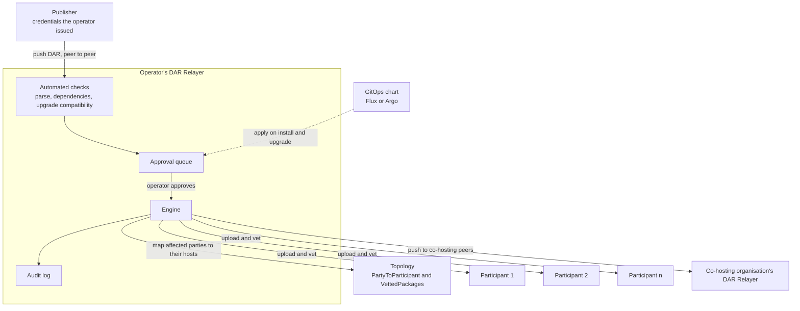
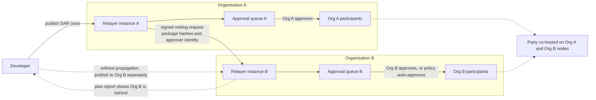

# DAR Relayer: Approval and Installation of DARs for Multi-hosted Apps

**Organization:** K2F Labs
**Author:** [K2F Labs](https://k2flabs.com), Kevin Ko (kko@k2flabs.com)
**Status:** Draft
**Created:** 2026-08-27
**Proposal Type:** RFP-aligned
**RFP / Roadmap Area:** RFP 3, Automated Application Management. Secondary RFP 18, Integration into SDLCs.
**Champion:** `Needs Champion`
**Total Funding Request:** 1,800,000 CC
**Project Duration:** 6 months engineering (Milestones 1 to 3), adoption window 12 months from Milestone 3 acceptance
**Label:** dar-app-management

---

## Abstract

A Daml application is deployed to validators largely by hand. A developer finishes a DAR and sends it to each relevant operator, usually over Slack or Telegram. Each operator uploads and vets it on their participants, then confirms the result. The same coordination is repeated for every release. If one participant is missed, the gap is often discovered only when it rejects a command.

There are two ways this gap has been addressed previously. A package registry stores a package for anyone to pull, but knows nothing about which validators host a party or whether they have vetted it. A deploy tool uploads a package to one configured validator. Neither of these keep all of a party's hosts, across organisations, agreed on the same vetted version. We propose DAR Relayer as the layer that does.

This proposal funds DAR Relayer, an Apache-2.0 Rust service a validator operator runs beside its nodes. A developer publishes a DAR once, and it does five things.

1. **Reconcile across a party's hosts.** From topology, DAR Relayer finds every validator that hosts the affected parties, across organisations, and works out which of them are missing the new package. This is not currently done by anyone else on the network.
2. **Approve, per operator.** Each change lands in an operator's approval queue, and each operator approves only what runs on its own nodes, with per-publisher policies and an audit trail. For a party co-hosted by several organisations, each organisation approves for itself.
3. **Install across the fleet.** On approval, DAR Relayer uploads and vets the package on every participant that operator runs which hosts the party, and reports any host that later drifts.
4. **Push peer to peer.** A publish is a direct push to the operators hosting the affected parties, with no central registry and no shared infrastructure to host. The flow is that publishers push packages, and then operators vet them.
5. **Pre-flight.** On demand, before a command is submitted, DAR Relayer answers whether every host of its party will accept it, and names any host that would reject it.

A developer reaches DAR Relayer two ways. Through an operator's web app, for an operator they already work with, or through a `dpm relay` subcommand, for publishing to several operators at once. When the target parties span several operators, and therefore several validators each with their own credentials, one `dpm` command pushes to every operator's DAR Relayer instead of signing in to each by hand. For the developer to publish, the operator issues them credentials, scoped to the validators a publisher may reach and the packages it may publish.

DAR Relayer runs beside a validator and requires no changes to Canton or Splice.

K2F Labs operates validators on MainNet and runs a self-custodial wallet and a DEX on Canton MainNet. We run this upload-and-vet exchange several times a week, for our own releases and for application teams we host.

---

## Personas

DAR Relayer has three personas.

- **The application developer** publishes a DAR once with scoped credentials, sees check results and approval status in one place, and can call the pre-flight before submitting to see whether every relevant host can interpret the command. Operator credentials remain with the operator.
- **The validator operator** reviews one approval queue with the checks already run, sets policy per developer and per release type, and receives drift reports covering every participant they run. Auto-approval is a policy they can grant.
- **The CI and CD pipeline** runs the `plan` and `preflight` commands with stable exit codes, so a release gate fails when the hosting set would not accept the new package. With the GitOps chart, the pipeline itself is the publisher, applying the package set declared in a repository instead of a person doing it by hand.

---

## Motivation

RFP 3 asks for "new Validator node tooling that integrates mechanisms for Daml application management including application discovery, review and security analysis, approval, installation and upgrading", and it states that "individual parties, including both the node operator party and hosted parties, may choose to vet and/or unvet Daml packages, across all Validators with hosting rights for a given party". These approval, installation, and upgrading workflows do not exist in Canton today.

Canton provides the underlying package and vetting mechanisms, but not the cross-participant workflow.
- Canton propagates package vetting metadata automatically. Uploading a DAR publishes the participant's `VettedPackages` topology state to every connected synchronizer.
- Canton never propagates the DAR itself. No Canton protocol message carries package bytes. A participant that receives a transaction referencing a package it lacks rejects it rather than fetching it.
- The Canton documentation states that "All Participant Nodes running the app must have the app DARs loaded independently as they aren't shared". The requirements documentation still lists automated Daml package distribution as a limitation.
- Per-node automation does exist. Canton ships an alpha declarative configuration that can pull a DAR from a URL the operator sets, and Splice auto-vets the DARs compiled into its own binary.

Neither per-node mechanism reconciles across the several participants that host one party. There is no protocol-level distribution, and no tool makes one party's hosts agree.

We encounter this on every release. As both a wallet provider and validator operator, we exchange DARs several times a week for our own releases and for teams we host. When we rolled out our wallet across our validators, every node had to be vetted before the new build could proceed, turning a routine release into a coordination exercise. In another DEX release, one participant remained on the older package. The submitting participant accepted the command, but the out-of-date participant rejected it after the traffic fee was charged. The deduplication window had passed by then, so the command could not be retried automatically. Someone had to resolve it by hand.

Co-hosting makes this harder. Each additional organisation hosting a party adds a participant that must carry the same packages, and CIP-0120 creates an incentive to co-host, so the number of hosts per party is set to rise. Canton's upgrade model also requires compatible versions to be vetted side by side, which is one more piece of state to keep in sync on each of them. Most operators still coordinate that state with chat messages and shell scripts.

The following groups benefit.

- Validator operators that host applications they did not write.
- Application teams that ship to more than one operator.
- Any party that is hosted on more than one participant, today or under CIP-0120.
- Wallet providers.

---

## Prior Art

Canton propagates vetting topology transactions between participants, but not the DAR bytes themselves. Uploading remains a per-participant admin operation. In practice, a DAR reaches a party's hosts node by node, coordinated over chat; a missed node is usually discovered only when it cannot interpret a transaction.

We reviewed the following work, awarded and in review, for conflicts.

**Awarded.**

- The Obsidian package distribution grant ([#533](https://github.com/canton-foundation/canton-dev-fund/pull/533), updated in [#691](https://github.com/canton-foundation/canton-dev-fund/pull/691)) delivers a registry with signed provenance for publishing packages across the network, and states that per-network vetting state is out of its scope. Obsidian's registry gets a package to an operator. DAR Relayer handles what happens after that, uploading and vetting the package on each participant the operator runs, and it checks the registry's signature when the package carries one. In other words, a registry is a valid input to DAR Relayer.
- The Certora Daml Package Analyzer ([#130](https://github.com/canton-foundation/canton-dev-fund/pull/130)) covers static analysis of Daml. DAR Relayer calls it as one of the checks in the approval pipeline.
- DPM Trace by Walnut ([#327](https://github.com/canton-foundation/canton-dev-fund/pull/327)) and Git-based DAR dependencies for dpm by Moonsong Labs ([#105](https://github.com/canton-foundation/canton-dev-fund/pull/105)) improve the developer workflow around packages. dpm has no upload or vetting command, so neither touches node state as DAR Relayer does.
- The Canton devkit ([#18](https://github.com/canton-foundation/canton-dev-fund/pull/18)) targets local development environments. The BitSafe Decentralization Manager ([#298](https://github.com/canton-foundation/canton-dev-fund/pull/298), phase 2 in [#530](https://github.com/canton-foundation/canton-dev-fund/pull/530)) manages nodes and performs package operations on a single node at a time.

**In review.**

- The application metadata and deployment standard ([#606](https://github.com/canton-foundation/canton-dev-fund/pull/606)) defines how a DAR's source, audit and dependencies are described, with automation to upload from a conforming Git repository. DAR Relayer consumes that metadata as one of its checks and accepts a conforming repository as the input to a publish request. The two compose, and we will coordinate with PR 606 so the formats stay aligned.
- Canton Vetting Radar ([#30](https://github.com/canton-foundation/canton-dev-fund/pull/30)) proposes a read-only drift detector with a CI gate. It overlaps our `plan` verb, and its existence confirms there is real demand for that capability. It is read-only by design, so it has no reconciliation, no approval workflow, no upload, and no model of the hosting set of a party. If it is funded, DAR Relayer's read path can consume its report format rather than define a second one.
- The Daml upgrade migration planner ([#91](https://github.com/canton-foundation/canton-dev-fund/pull/91)) computes an ordered migration plan for a new DAR against a single participant. It plans and stops. DAR Relayer's upgrade gate covers the hosts of a party and executes through the approval workflow.
- The Daml Deployment Toolkit ([#322](https://github.com/canton-foundation/canton-dev-fund/pull/322)) is a `dpm` subcommand for deploying a DAR to one configured validator. DAR Relayer is proposed as a sibling `dpm` subcommand, giving developers a familiar entry point. It addresses the next layer of the workflow: resolving a party's hosts from topology, reconciling vetting across them, obtaining operator approval, and reporting drift.

The proposal's focus is the operational gap between package publication and consistent vetting across every host of a party: reconciliation, a hosting-set pre-flight, and an operator approval workflow.

---

## Architecture

DAR Relayer is federated: every organisation runs its own instance and approves for its own nodes, with no central authority in the middle. It has a thin publisher side and a full service on the operator side. A publisher holds credentials an operator issued and pushes a DAR to that operator's Relayer. Everything else, the checks, the approval queue, and the vetting, happens on the operator's side, on its own nodes. When a party is co-hosted by another organisation, the Relayer pushes the approved package to that organisation's Relayer directly, peer to peer, where it enters that operator's own queue. There is no central registry for anyone to host.

Each organisation runs its own Relayer. A publisher pushes once, and it maps the affected parties to their hosts from topology, and on the operator's approval it vets and installs the package on the operator's participants that host those parties. For a party co-hosted elsewhere, the approved package is pushed to the co-hosting organisation's DAR Relayer for that operator to approve in turn.

---

## Specification

### 1. Objective

At the end of the grant, the following are possible.

1. A developer can publish a DAR with operator-issued credentials through the `dpm` CLI, the standalone binary, or the web portal.
2. The operator receives one approval item with the automated checks attached, and can approve or reject it with a reason.
3. The package is uploaded and vetted within minutes on each relevant participant the operator runs, with per-host status visible to the developer.
4. If a participant later drifts out of line, DAR Relayer reports it and repairs it through the same approval process.
5. Before submitting, an application or CI pipeline can check whether every host of its party can interpret a command and identify a host that would reject it.
6. For a party hosted by more than one organisation, the developer can publish once while each organisation retains approval over its own nodes.
7. The audit log records the actor, package, hosts touched, and resulting topology serials for each action.

### 2. Implementation Mechanics

DAR Relayer is one Rust service, and the operator side carries almost all of it. An operator runs a full deployment beside its validators: a Postgres database, the approval queue, a TypeScript web app, and a backend that holds each validator's admin credentials and does the uploading. The operator registers its fleet once and issues credentials to publishers, each scoped to the validators that publisher may reach and the packages it may publish. The publisher side is thin: a developer publishes through the operator's web app, or through a `dpm relay` subcommand that can push to several operators at once, or by running that same binary standalone. The engine is also published as a Rust crate and the service as a Helm chart. DAR Relayer is built on axum, tonic, sqlx and Postgres.

**The engine.** The operator declares the DAR files or package versions required by each party. DAR Relayer resolves the party's hosting set from `PartyToParticipant`, reads each host's vetted packages from synchronizer topology, and identifies missing, stale, extra, or unresolved dependencies. `plan` is read-only and exits non-zero on drift, making it suitable for CI. `apply` uploads through the admin API with `vet_all_packages` and `synchronize_vetting`, waits for the change to take effect, then checks again. Before vetting a new version alongside an old one, it runs the Daml upgrade compatibility check rather than leaving incompatibility to surface at deployment. 
Example: a nightly `plan` alerts the operator that one of five participants is a version behind. Un-vetting uses the same approval path, and DAR Relayer refuses it while any party on the operator's nodes still has live contracts that use the package.

**Pre-flight.** Canton selects one version of each package for a submission. For a party hosted on several participants, the submitting participant's preferred version may not be vetted by a co-host. The pre-flight, run as `relay preflight`, queries `GetPreferredPackages` for the command's parties and reports whether every host has vetted the selected versions, naming any host that would reject the command. It is available in three forms.
- A CLI for pipelines, shipped as a `dpm relay` subcommand so it is there wherever a developer already has dpm, and as a standalone binary otherwise.
- A Rust crate.
- An HTTP endpoint in the web service.

The pre-flight runs on demand, outside the submission path. Example: a CI job runs it against staging before a release and fails because one co-host is behind.

Applications choose whether to run the pre-flight, and the Ledger API submission path is unchanged either way.

**The management service.** The operator runs a web service in its own cluster, in front of the engine. Developers receive credentials scoped to the validators they may reach and the packages they may publish, issued through OIDC against the operator's identity system or as API keys. A developer submits a DAR by upload or Git reference, then DAR Relayer runs the automated checks before it enters the approval queue.

- The DAR parses.
- Dependencies resolve against what is already vetted.
- Upgrade compatibility passes.
- Any external check the operator has configured runs.

The result enters an approval queue and every action is recorded in an audit log. Operators can, for example, auto-approve patch releases from a trusted developer or require two approvers for a new package name. Example: a hosted team ships a permitted patch release overnight without waking an operator.

**GitOps chart.** A Helm chart runs `apply` on install and upgrade, using the package set in the Git artifact. The package set is deployed alongside the application that needs it. Example: an upgrade that declares a missing DAR file fails the install instead of silently continuing.

#### Within one organisation, and across several

How DAR Relayer works depends on whether every host of a party is run by one organisation or split across several.

**Case A: one organisation, several validators.**  A wallet provider or exchange typically runs several validators and hosts its own users' parties across them. The developer publishes once, the operator approves once, and DAR Relayer vets and installs the package on every one of that operator's participants that hosts the party, then reports any that later drift. In this case a routine release stops being a per-node coordination exercise. No peer organisation and no cross-organisation step is involved, so this value stands on its own from the first operator that adopts DAR Relayer.

**Case B: a party co-hosted by several organisations.** Each organisation runs its own Relayer and controls its own nodes, so no organisation can vet a package on another's participant. The developer still publishes once. On approval, DAR Relayer reads the party's hosting set from topology to learn which other organisations host it, and pushes a signed request to each of their Relayer instances, where it enters that operator's own approval queue. Topology gives participant IDs, not network addresses, so each operator keeps a small directory mapping other organisations' participants to their Relayer instances, along with any credentials. An operator can auto-approve requests from allow-listed organisations once DAR Relayer has verified the signature and package hashes, and hold everything else for review. Three properties make a request from another organisation safe to accept.

1. The request carries package hashes. A Canton package id is the hash of the package, so the receiving instance can verify that the DAR it is about to vet is the exact package that was approved. The file cannot be swapped in transit.
2. The signature identifies the approving operator using a key that is already in topology. The receiving instance checks who approved it against network state it already trusts, with no new registry and no new key distribution.
3. The receiving operator still approves. The imported request arrives as a queue item, not as an instruction. Nothing is uploaded or vetted on the second organisation's nodes until that organisation's own operator says yes.

Where another organisation has no Relayer instance reachable through the directory, the developer falls back to publishing to each organisation's portal separately. The plan report names which hosts of the party are behind and on which version, so the developer knows which operator to contact and when the rollout is complete.

Cross-organisation propagation is upside on top of the single-operator value, and gets better as more operators run DAR Relayer. Until a peer does, that operator's own fleet still gets the full workflow of Case A.

#### What we are not building

- No package provenance or metadata standard.
- No static analysis of Daml; DAR Relayer integrates existing analysis where available.
- No package registry.
- No changes to Canton or Splice.

---
## Rationale

**Why a service beside the validator.** Vetting uses each participant's admin API, so the component performing it must run where the operator's credentials are held. An independent Rust service can be deployed, upgraded, or removed by each operator. It can also read the vetting state of participants the operator does not administer because that state is public topology.

**Why an approval workflow rather than automation alone.** Operators remain responsible for what runs on their nodes, and RFP 3 explicitly includes approval. DAR Relayer makes publication self-service for developers while keeping the operator's approval, checks, and audit trail in the workflow. Auto-approval remains an explicit policy for particular developers and release types.

**Why this is not a registry or a deploy tool.** A package registry is a public store: a developer pushes to it and anyone pulls from it. It has no per-validator credentials, no approval step, and no notion of a party's hosts, so someone still has to fetch each package and install it on every node. A single-node deploy tool uploads a DAR to one configured validator and stops there. DAR Relayer is the federated layer between them, where each operator runs its own instance and controls its own nodes. A publisher pushes to the operators hosting the affected parties; each operator approves; DAR Relayer then installs across that operator's fleet and pushes on to any co-hosting peers. DAR Relayer can consume a registry as one source of packages, but the permissioned peer-to-peer push, the operator approval, and the fleet-wide install are exactly the parts a registry and a deploy tool leave out.

**Why this is a new component and not a feature added to an existing one.** Each adjacent tool leaves this capability out by design. Obsidian's registry states that per-network vetting state is out of its scope. The deploy toolkit targets one configured validator. Vetting Radar is read-only. dpm has no vetting command at all. The capability DAR Relayer adds, resolving a party's hosting set across organisations and driving a change through each operator's approval, is orthogonal to what any of them do, so it is a new component.

**Why we ship as a dpm subcommand, a crate, and an HTTP endpoint.** `dpm relay` gives developers a familiar CLI entry point. The standalone binary remains available for teams that do not use dpm. Applications need direct access to the pre-flight in several languages, so the same engine is available as a Rust crate and an HTTP endpoint. Pipelines use either CLI form.

### 3. Architectural Alignment

RFP 3 asks for validator tooling covering application review, approval, installation and upgrading, and per-party vetting across all validators that host a party (quoted in full in the Motivation). DAR Relayer covers each of these: review, approval, installation, upgrading, and per-party vetting and un-vetting across a party's hosts. It integrates existing analysis, including Certora's analyser, rather than rebuilding it.

RFP 18 asks for tooling that integrates Canton development into "CI/CD pipelines, testing frameworks, deployment workflows, package vetting, environment management, and release automation". The `plan` command, the pre-flight check and the GitOps chart are part of that integration.

Canton's upgrade model relies on operators vetting compatible versions side by side, and on the participant selecting a preferred package per submission. The engine works inside that model. It verifies upgrade compatibility before vetting. For the pre-flight it uses `GetPreferredPackages`, the same selection the participant itself makes. It introduces no new topology mapping and no new protocol behaviour.

### 4. Backward Compatibility

Packages vetted by hand appear to DAR Relayer as existing state. Operators can adopt `plan` without the management service, or run DAR Relayer without the GitOps chart. Removing DAR Relayer leaves the existing participant state in place.

---

## Milestones and Deliverables

All code is public under Apache-2.0, in a repository under the K2F Labs GitHub organisation.

### Milestone 1: Reconciliation engine and pre-flight
- **Estimated Delivery:** Month 2
- **Focus:** `plan`, `apply`, and the pre-flight check: topology-driven host discovery, dependency closure, the upgrade compatibility gate, and CLI, crate, and HTTP interfaces.
- **Deliverables / Value Metrics:**
  - Public repository with the CLI and the crate published.
  - A published LocalNet demo with a party hosted on two participants, showing the following sequence.
    1. `plan` reports the package present on one host and missing on the other.
    2. A command submitted anyway fails on the missing host.
    3. `apply` repairs the drift.
    4. The check returns green, and the same command then succeeds.
  - `plan` runs read-only against a participant the operator does not administer and reports its vetting state correctly, verified on a public network.
  - Three application teams or operators outside K2F Labs run `plan` against their own participants and report the result in a public issue.

### Milestone 2: Upgrade gate, cross-organisation drift and GitOps
- **Estimated Delivery:** Month 4
- **Focus:** The upgrade compatibility gate, drift reporting for hosts the operator does not run, and the Helm chart for declarative deploys.
- **Deliverables / Value Metrics:**
  - Before vetting a new version alongside an old one, DAR Relayer runs the Daml upgrade compatibility check and reports the reason for an incompatible pair. Demonstrated with a deliberately incompatible version on LocalNet; the run is published.
  - `plan` runs read-only against a participant the operator does not administer and reports that host's vetting state for a co-hosted party correctly, verified on a public network against a participant run by another organisation.
  - Un-vetting uses the same `plan`, `apply`, and approval flow as vetting. DAR Relayer refuses it while a party on the operator's nodes has live contracts on the package and names those contracts. The run is published.
  - The Helm chart applies a declared package set on install and upgrade. It fails the install when a declared file is missing, rather than silently doing nothing. Demonstrated on a public network for at least one of our validators.
  - Operator guide and configuration reference.
### Milestone 3: Management service
- **Estimated Delivery:** Month 6
- **Focus:** The self-service portal and API, including:
  - Developer credentials.
  - Upload by file or Git reference.
  - Automated checks.
  - An approval queue with policies.
  - An audit log and per-host status.
  - The signed cross-organisation request.
- **Deliverables / Value Metrics:**
  - An end-of-milestone public-network demonstration using one of our validators and an external developer's DAR, showing the following sequence.
    1. A developer with credentials publishes a DAR through the portal.
    2. Automated checks run, including one external analyser integration and one provenance check where the upstream work has shipped.
    3. An operator approves.
    4. The package is vetted on every host of the developer's parties within five minutes, with the audit trail visible.
  - A second organisation's instance imports a signed request from the first and applies it after its own approval, demonstrated between two organisations on a public network.
  - Two external application teams publish through an instance we run and report their experience in a public write-up.
  - The request format written up and presented to the DAR and Application Management SIG.

### Milestone 4: Adoption
- **Estimated Delivery:** 12-month window from Milestone 3 acceptance
- **Focus:** External operators running DAR Relayer, and external developers publishing through it.
- **Deliverables / Value Metrics:** Paid per event, so partial adoption pays partially.
  - 100,000 CC per external validator operator, other than K2F Labs, that runs DAR Relayer or the engine in production for at least 30 days. Evidence is vetting topology transactions on a public network, or a private attestation to the Canton Foundation. Up to 4 operators, 400,000 CC.
  - 50,000 CC per external application team that publishes at least one package to MainNet through an instance run by an operator other than K2F Labs. Up to 4 teams, 200,000 CC.
  - 150,000 CC completion tranche on all three of the following.
    1. At least 5 external GitHub issues or pull requests.
    2. At least 3 community-reported issues triaged to resolution.
    3. A public case study coordinated with the Foundation.
  - Any amount not earned within the window returns to the Development Fund.

---

## Acceptance Criteria

The Tech and Ops Committee will evaluate completion based on the following.

- Deliverables completed as specified for each milestone.
- Demonstrated functionality on a public Canton network for Milestones 2, 3 and 4.
- The pre-flight check exercised through the same Ledger API surface an application would use. Test hooks do not count.
- Adoption in Milestone 4 counted only for organisations other than K2F Labs. Letters of intent do not count.
- Documentation sufficient for an operator outside K2F Labs to run the engine and DAR Relayer without our help, tested by the external runs in Milestones 1 and 3.

---

## Funding

**Total Funding Request:** 1,800,000 CC. Engineering 1,050,000 CC across Milestones 1 to 3, adoption up to 750,000 CC in Milestone 4. The early-delivery bonus of up to 210,000 CC, if earned, is on top of that.

### Payment Breakdown by Milestone
- Milestone 1 (Reconciliation engine and pre-flight), 350,000 CC upon committee acceptance
- Milestone 2 (Upgrade gate, cross-organisation drift and GitOps), 300,000 CC upon committee acceptance
- Milestone 3 (Management service), 400,000 CC upon committee acceptance
- Milestone 4 (Adoption), up to 750,000 CC, paid per event as described above

Engineering totals 1,050,000 CC.

### Delivery schedule

Milestones 1 to 3 are due within 6 months of grant approval.

- Early delivery. If all three are accepted within 5 months, a 20 percent bonus of 210,000 CC is added to the Milestone 3 payment. This follows the 20 percent acceleration bonuses in the Token Standard V2, ISS-BFT, PQS and C#/.NET SDK grants, and the one-month-early trigger used by the application metadata standard and Obsidian package distribution proposals.
- Beyond month 6, the remaining milestones are handled under the Volatility Stipulation.

### Sizing

Engineering is about 26 engineer-weeks at roughly 40,000 CC per engineer-week, the rate recent external grants price at. Parts of the engine and the GitOps path exist today. The table below sets the price against comparable funded developer-tooling grants.

| Grant                                                                             | Requested    | Why it is here                                                                                             |
| --------------------------------------------------------------------------------- | ------------ | ---------------------------------------------------------------------------------------------------------- |
| Walnut dpm trace tooling                                                          | 1,900,000 CC | Price reference. A funded developer tooling grant of the same size in the same RFP family                  |
| BitDynamics devkit                                                                | 1,900,000 CC | Price reference. A funded developer tooling grant of the same size. Its DAR commands work on LocalNet only |
| This proposal                                                                     | 1,800,000 CC | Reconciliation across the hosts of a party, approval workflow, upgrade gate, pre-flight                    |

This sits at the size of comparable funded developer-tooling grants, and below the adjacent standards it consumes rather than defines, such as the metadata standard (PR 606) at 2,000,000 CC.

### Volatility Stipulation

Engineering milestones 1 to 3 complete within 6 months. The grant is denominated in fixed Canton Coin and follows the standard re-evaluation at the 6-month mark, with the 12-month adoption window reviewed at the 12-month mark.

---

## Co-Marketing

Upon release, K2F Labs will collaborate with the Foundation on the following.

- Announcement coordination at Milestone 1, when the engine and pre-flight ship, and at Milestone 3, when the management service ships.
- A technical write-up on package lifecycle management for parties hosted on several participants, published on the Canton Network blog or forum.

---

## Adoption and Go-to-Market

From Milestone 3, we will run DAR Relayer for application teams already hosted on our validators. This gives us developer feedback before external adoption; those teams do not count toward Milestone 4.

For external adoption we will approach three groups.

- Validator operators in the Node Deployment and Operations SIG.
- Wallet providers that host applications written by other teams.
- Application teams that coordinate uploads with us over chat today. They have the same problem with every other operator they ship to.

We ask the Foundation for two things, as a good-faith collaboration and not a precondition for any milestone.

- Introductions to operators hosting several application teams.
- A slot at a DAR and Application Management SIG call at Milestone 3.

---

## Maintenance and Sustainability

Core maintenance is self-funded. We will run DAR Relayer on our validators for the teams we host, so compatibility with Canton and Splice releases is part of our own upgrade cycle. Beyond the grant, we propose a 100,000 CC-per-quarter maintenance tier for external-facing work, covering the following.

- Updates as the metadata, provenance and analysis integrations evolve.
- Issue triage and pull request review within five business days.
- Adopter support.
- A quarterly adoption report.

Transferability is an acceptance criterion in Milestones 1 and 3: operators and developers outside K2F Labs must be able to run the engine and DAR Relayer from the documentation alone. If K2F Labs can no longer steward the repository, ownership may transfer to the Foundation by mutual agreement.

---

## Team Background

K2F Labs is a Canton Foundation participant and has built on Canton for over a year. We operate validators on MainNet and run a self-custodial wallet and a DEX on Canton MainNet. Together those have processed over 500,000 transactions for more than 60,000 participants, through a production Rust SDK for Canton that we maintain. The team is led by Kevin Ko, an ex-Google engineer.

We run the manual process this proposal replaces for our own applications and for teams we host. The GitOps upload-and-vet chart that DAR Relayer builds on has been used on our MainNet validators throughout this year's releases.
