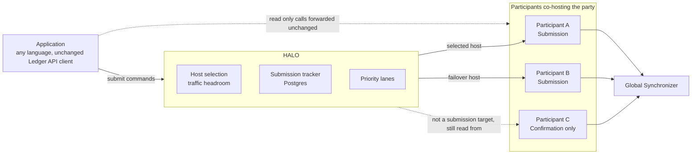
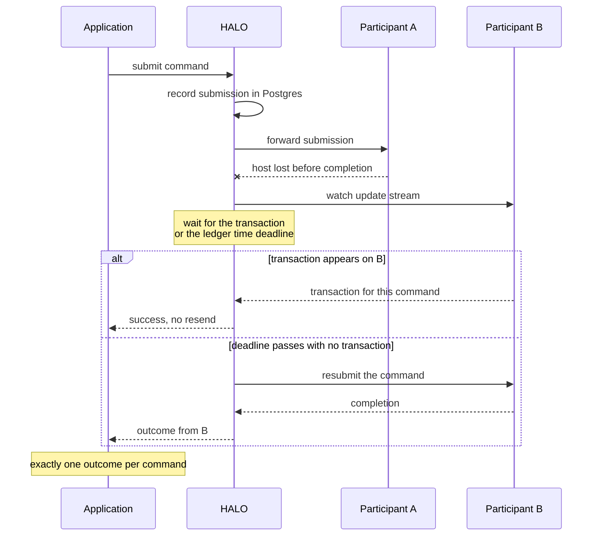
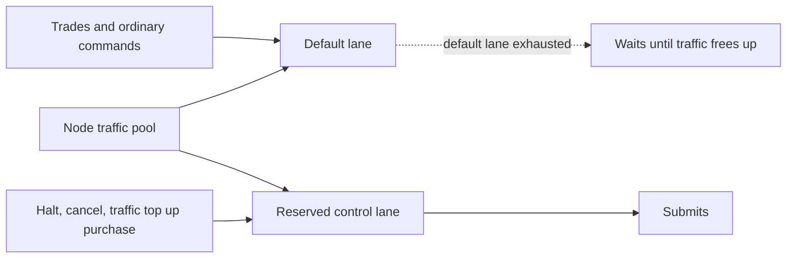

# HALO: High-Availability Ledger API Overlay for Multi-Hosted Applications

**Organization:** K2F Labs
**Author:** [K2F Labs](https://k2flabs.com), Kevin Ko (kko@k2flabs.com)
**Status:** Draft
**Created:** 2026-08-27
**Proposal Type:** RFP-aligned
**RFP / Roadmap Area:** RFP 4, Application-level resilience and party-level Highly Available failover. Secondary RFP 23, Validator and Shared Infrastructure Security and Resilience.
**Champion:** Marcin Ziolek, Digital Asset (marcin.ziolek@digitalasset.com)
**Total Funding Request:** 3,000,000 CC
**Project Duration:** 7 months engineering (Milestones 1 to 3), adoption window 12 months from Milestone 3 acceptance
**Label:** party-portability-data-resilience

---

## Abstract

Canton lets a party be hosted on several participant nodes, and the network is incentivising organisations toward that arrangement as seen in three places.

- RFP 1 and RFP 4 of the 2026 roadmap.
- The funded BitSafe work on multi-host topology.
- CIP-0120, which proposes paying validators for confirming on parties they co-host.

We believe that the application side of that arrangement is missing. Canton's own documentation states that an application "cannot transparently failover from one participant node to another" and that "command deduplication state is not shared among multiple participant nodes". A party can be hosted on three nodes and still go offline for its users when the one node their application talks to goes down.

This proposal funds HALO (High-Availability Ledger API Overlay), an open-source sidecar written in Rust and licensed Apache-2.0, that an operator runs next to their validator. Applications talk to it through the unchanged Ledger API over gRPC and JSON, so it works with every existing SDK in every language and needs no client changes. It does four things.

1. Load balancing and failover. It routes each submission to a healthy host of the party and, when a host is lost mid-flight, resubmits through another host without ever duplicating a transaction.
2. Traffic priority lanes. HALO reserves a share of the node's traffic that only commands the operator marks as important are allowed to spend.
3. Adaptive top-up, optional. HALO buys the node's traffic in response to what it is actually spending, rather than on a fixed timer.
4. Observability. Metrics and alert rules per party and per host.

A validator stops taking an application's submissions for one of two reasons. The node is down, or the node has run out of traffic. HALO removes both as single points of failure.

- When a host is down, HALO submits through another host of the party. It records every submission before sending it, and it resubmits elsewhere only after confirming the first attempt did not commit to the ledger, so no command is executed twice.
- When traffic is short, it sends through the host with the most headroom, and it keeps a reserved lane so the commands the operator marks as important, such as a halt or the traffic purchase itself, still submit while ordinary load waits.

K2F Labs operates a self-custodial wallet and a DEX on Canton MainNet, which together have processed over 500,000 transactions for more than 60,000 participants. We have experienced both of the problems this proposal solves ourselves, in production.

---

## Motivation

A single point of failure for a decentralised application is a real risk. If one node is down, the users of an application that depends on it cannot transact, whatever the rest of the network is doing.

The Foundation's RFPs 1 and 4 address that risk by incentivising co-validation, where a party is hosted on several validators. That direction is correct and the protocol support has been in place for a long time.

Co-validation today covers confirmation. Submission is still a single point of failure. An application submits through whichever participant its Ledger API client is configured with, and nothing in Canton or in any SDK chooses between participants. So when that participant is down, or has exhausted its traffic, the application cannot transact even though other validators host the same party. An application could switch endpoints itself, but that is unsafe. Canton deduplicates commands only within a single participant, so resending the same command to a second host can execute it twice, for example a transfer that double-spends.

We have hit both halves of these issues in production. A wallet user's party lives on one validator, so when that validator is down the user cannot transact. Co-hosting the party on a second node would not help today, because nothing on the application side knows how to use the second host safely. Separately, our DEX ran out of traffic during a settlement burst and the halt command was rejected along with the trades it was meant to stop. We could not buy more traffic at that moment, because the purchase is itself a command on the same exhausted node. Every command on a node shares one pool, and Canton's only per-node knobs are a total submission rate and an in-flight cap.

Who benefits.

- Wallets, exchanges and custodians that host parties for users and want to promise availability across node failures.
- Validator operators that co-host parties for other organisations under CIP-0120, whose second and third hosts only pay off for users if applications can reach them.
- Any validator operator running more than one application on a node, who today has no way to say which commands matter most when traffic is short.
- Application teams in every language, because HALO sits behind the Ledger API and the benefit does not depend on which SDK is used.

Why now. The Foundation has named this an RFP with no prior grants, and three of the four pieces are already in place.

- Topology orchestration for multi-hosting is funded.
- Rewards for confirming on co-hosted parties are proposed in CIP-0120.
- The protocol support in Canton exists.

What is missing is the connection between a multi-hosted party and the application that uses it, and we believe this is possible to build in seven months.

---

## Prior Art

Canton's documentation states that client applications cannot transparently fail over between participants, because command deduplication and ledger offsets are tracked per participant. That constraint is the reason this proposal exists, and it is also why no generic load balancer solves the problem. HAProxy or Envoy can spread connections, but they know nothing about deduplication state, offsets or traffic balances, so a naive retry through them risks a duplicate submission.

We reviewed the following work, awarded and in review, for conflicts.

**Awarded.**

- The Rust SDK for Canton ([#407](https://github.com/canton-foundation/canton-dev-fund/pull/407), updated in [#688](https://github.com/canton-foundation/canton-dev-fund/pull/688)) delivers client bindings and explicitly defers cross-participant failover. It sits below HALO. An application using that SDK, or any SDK, gains failover by pointing at HALO with no code change.
- User-paid traffic accounting ([#527](https://github.com/canton-foundation/canton-dev-fund/pull/527), updated in [#690](https://github.com/canton-foundation/canton-dev-fund/pull/690)) gives each participant a funded traffic account with enforcement. HALO consumes it. The balance of the account on each host is a routing signal, and under the CIP-0120 split the host that carries failover traffic is the one paid for it. Section 3 covers that interoperation in detail.

**In review.**

- The Canton Validator Reliability Suite by Equilibrium ([#747](https://github.com/canton-foundation/canton-dev-fund/pull/747), [#748](https://github.com/canton-foundation/canton-dev-fund/pull/748), [#749](https://github.com/canton-foundation/canton-dev-fund/pull/749)) recovers, configures and monitors a validator node. It brings a node back. HALO keeps the application submitting while the node is down. Together they cover both halves of the same resilience goal: node-level recovery and party-level continuity.
- Canton Public RPC ([#156](https://github.com/canton-foundation/canton-dev-fund/pull/156)) proposes shared RPC gateways for developers without their own node. It broadens access to a participant and does not fail over between the hosts of a party.

Splice's priority mechanism covers only the validator app's own submissions, and sequencer-side quality of service is an open TODO in the Canton codebase. Neither gives an application cross-host routing today. No awarded grant and no open proposal routes an application's submissions across the hosts of a party with a correctness guarantee.

---

## Architecture

HALO sits between the application and the participants that co-host a party. It presents one unchanged Ledger API endpoint and decides which host each submission goes to.

---

## Specification

### 1. Objective

If this proposal is approved, at the end of the grant an operator can do the following.

1. Put HALO in front of a set of participants that host a party, point any existing Ledger API client at it, and change nothing else in the application.
2. Hard-kill one of those participants while transactions are in flight and see every command still reach a definite outcome, with no duplicated ledger effect.
3. Add or remove a host for a party and have routing follow the change without restarting the application.
4. Declare that some commands may spend a reserved portion of the node's traffic, and see those commands still submit when ordinary load has consumed the rest.
5. Let the node's traffic purchase react to what is actually being consumed, instead of tuning an interval and a throughput estimate by hand.
6. Read one dashboard that shows, per party and per host, where submissions are going, what failed over, and how much traffic each lane has spent.
7. Reproduce all of the above from published documentation, without help from us.

Traffic pricing, fee charging and per-user traffic accounting are out of scope.

### 2. Implementation Mechanics

HALO is a sidecar using Rust, tonic, axum, sqlx and Postgres, configured by one TOML file and deployed as a container next to the validator. Applications connect to it exactly as they would connect to a participant. It serves the Ledger API submission, completion, update and state services over gRPC, and the JSON Ledger API over HTTP.
#### Sending a command

**Host discovery.** For each configured party HALO reads the `PartyToParticipant` topology mapping and keeps it current, so it knows which participants host the party and which of them hold `Submission` permission. The read runs against the participant admin API on the nodes the operator administers. `PartyToParticipant` is synchronizer topology, so one administered participant's view yields the full hosting set for the party, including hosts run by other organisations. A host that holds only `Confirmation` permission is never chosen for submitting, though HALO still reads from it, as described under Completion and update streams. The set updates when the operator adds or removes a host.
Example. An operator adds a third host for a party at midday and HALO begins routing to it the same minute, with no application restart.

**Host selection.** Among submitting hosts HALO picks one that is healthy and has room to pay for the command. For this it will use signals the host and the network already give, and it needs no access to another organisation's node beyond the credential it already holds to submit for the party. The signals available today are these.
- The public Scan API reports each participant's traffic status, so node level headroom is readable for any host.
- On the operator's own nodes, the participant admin API reports the same thing with less delay.
- On a host that runs traffic enforcement, the party's balance there is readable over the Ledger API with the submitting credential.
- A prepare call on a host returns the cost estimate and is rejected if the host would not accept the command.
- The completion stream reports what each submission actually cost, which corrects the picture after the fact.
Which of these HALO weighs, and in what order, is settled in Milestone 1 against measurements on a public network, and the policy will be configurable.
Example. A wallet's own node is nearly out of traffic, so HALO prepares on a co-host, sees the estimate fit the party's balance there, and sends the next transfer through it.

**Submission tracking.** On startup HALO opens one completion consumer per host of the party. For the starting offset, on a first run it calls the Ledger API's ledger end on that host, and after a crash it resumes from the last offset it saved for that host. Each host has its own offset space, and HALO only ever reads a host's offset against that same host, so the offsets never have to be reconciled between hosts.

Before HALO forwards a submission it writes a pending row to Postgres, keyed by the change ID (the user id, command id and `act_as` set) and the submission id. The row records the host it chose and, for an externally signed party, the transaction hash it computed while preparing the command, which is identical on every host.

Every completion carries the command id and submission id of the submission it answers, so on the submitting host HALO looks up the pending row by that key and marks it committed or rejected. A crash of HALO itself loses no submission, because the pending rows and the per-host offsets are durable and it resumes each consumer where it left off.
Example. An operator restarts HALO in the middle of a batch of 200 transfers and every one of the 200 still resolves to exactly one outcome.

**Failover with correctness.** HALO's job when a host fails is to get the command through a second host without ever running it twice. Canton's command deduplication, which normally stops one command from being applied twice, works only within a single participant.

HALO makes the retry safe by never resending until the first attempt is confirmed dead. When the host it submitted through fails before returning a completion, HALO keeps the original submission open and watches the update streams of the surviving hosts, which see the party's transactions because they host the party. It reads each surviving host from the offset it already holds for that host, recorded before the submission, so it never has to translate an offset from one host to another. From that point exactly one of three things is true, and HALO handles each.

1. The command already committed. Its transaction appears on a surviving host. HALO reports success and does not resend.
2. The command can still commit. Its deadline has not passed yet, so HALO keeps waiting.
3. The command can no longer commit. A surviving host's record time has passed the command's deadline. Canton guarantees a command past its deadline with no completion is lost and the original host will drop it, so HALO now resubmits on a surviving host.

The deadline mentioned in cases 2 and 3 is the latest record time at which the command can still be sequenced. HALO establishes the deadline in three ways.

- It sets a `synchronizer_id` on every command, so it watches the right host's checkpoint.
- For an externally signed party it sets `max_record_time` when preparing the transaction, which sets the deadline directly.
- For a participant-local party it takes the time the failed host accepted the command and adds the synchronizer's record time tolerance, a value it reads from the synchronizer on startup.

HALO's failover mechanism relies on per-participant deduplication and the command deadline, both of which are available in Canton today. Digital Asset has indicated that it plans to add synchronizer-level deduplication, shared across participants, by early 2027. When the capability is available on a public network, HALO will integrate it through Milestone 5. The synchronizer would then reject a duplicate if the original command had already been sequenced, allowing HALO to resubmit immediately after a host failure rather than wait for the command deadline. Routing, host selection, durable tracking and stream continuity remain the same, so applications benefit without needing to change.

#### Completion and update streams

**Completion and update stream continuity.** HALO gives the application one uninterrupted view of the ledger even when a host is lost. It does this in four ways.

- Read-only calls go to any healthy host unchanged. A host with only `Confirmation` permission is a valid read source, even though it is never a submission target.
- HALO keeps a live update subscription on every host of the party, merges the streams by record time, which is identical on every host, and drops repeats by update identifier.
- Offsets are participant-local, so HALO gives the application its own offset numbering and keeps a durable map from update identifier to each host's offset. That map lets it translate an application offset when it forwards a point read to a host.
- Completions exist only on the host that submitted, so HALO never proxies one host's completion stream. It builds the stream from its own submission record, which outlives the loss of any host.

HALO provides continuous completion and update streams today using the warm subscriptions and update-identifier deduplication described above. Digital Asset has indicated that it plans to provide completion and update streams keyed on record time rather than offsets, shared across participants connected to a synchronizer by early 2027. When that capability is available on a public network, HALO will integrate it through Milestone 5, reconnecting to any host at the last record time delivered to replace the warm standby subscriptions and offset map.

#### Priority lanes

A validator's traffic is one pool shared by every application on the node, and when it runs low the operator has no way to say which commands matter. HALO aims to add two controls on top of that pool.

**Priority lanes.** Operators declare lanes, each with a reserved share of the node's traffic. HALO assigns a command to a lane by one of three things.

- The template and choice of its root command. These are plain strings in the `Commands` message and need no Daml interpretation.
- A gRPC metadata header the application sets.
- The submitting user or party.

The default lane cannot spend into another lane's reserve. Splice's validator app has a similar internal mechanism, `CommandPriority` with `reservedTraffic`, which protects its own top-up and reward automation. It applies only to commands the validator app itself submits, so any other application on the node can consume the traffic that its top-up was relying on. HALO extends the same idea to every application sharing the node.
Example. An exchange tags its halt command as high priority, and when the pool is nearly empty the halt still submits while ordinary trades wait.

**Adaptive top-up.** Today the validator app buys traffic on a fixed interval against a throughput target that the operator has to estimate. An estimate that is right on an average day is wrong during a burst, and keeping it close to reality is ongoing toil. HALO optionally drives the purchase on a short cadence keyed to actual consumption, using the same `AmuletRules_BuyMemberTraffic` choice, so the node buys because it is spending rather than because a timer fired. We run this today as a script on our MainNet validators and aim with this grant to turn it into a supported component.
Example. A settlement burst triples consumption for twenty minutes, and the node tops up during the burst instead of waiting for the next interval.

#### Operating HALO

**Observability.** HALO exports Prometheus metrics per party and per host.
- Routing decisions.
- In-flight submissions.
- Failovers.
- Resubmissions.
- Lane spend.
- Traffic headroom.

### 3. Traffic economics and the Traffic Enforcement App

This section describes how HALO interoperates with Canton's traffic model and with the Traffic Enforcement App from PR 527. Two things are called traffic:

**The node's traffic pool.** Each participant buys sequencer traffic from the synchronizer, and Canton charges it "to the sender for every submission request sequenced on the synchronizer". HALO reads how much each host has left in order to choose a host, reserves part of its own node's pool for priority lanes, and optionally tops up its own node's pool based on actual consumption using the same `AmuletRules_BuyMemberTraffic` choice the validator app uses. It does not buy traffic for another organisation's node, and could not even if it wanted to.

**The Traffic Enforcement App account.** PR 527 adds an optional per-party balance inside a participant, so an operator hosting many parties can cap what each may spend of the node's pool. `GetAccount` is served on the Ledger API and authorises on the same right HALO already needs to submit for the party, so it can read a party's balance on any host it can submit to. Beyond reading the balance, HALO plays no part: crediting the account is an admin call made by that host's operator, and the host debits it automatically from completions.

**Enforcement stays on the host.** A participant with enforcement on compares the party's balance to the cost at prepare and again before sending, and rejects with `TRAFFIC_ACCOUNT_VALIDATION_FAILED` when it is short. HALO is only a Ledger API client of that host, so it cannot bypass this. A prepare call on a host is therefore always the definitive test of whether that host will accept the command.

Pricing, billing and per-user accounting stay out of scope.

### 4. What we are not building

- No changes to Canton or Splice.
- No traffic pricing, billing or per-user accounting.
- No topology orchestration for setting up multi-host parties.
- No user-facing wallet gateway or signing service.
- No language-specific SDK code.

We make no changes to Canton or Splice.

### 5. Architectural Alignment

RFP 4 asks for the ability "for an application provider to build, deploy and upgrade applications that are able to fail gracefully across multiple nodes operating that same application, using Daml parties multi-hosted across those nodes". This proposal delivers the failover half of this. RFP 1 states that the Foundation anticipates multiple grants around party hosting. RFP 23 asks for "reusable tools, controls, and standards that improve the security, reliability, availability, and recoverability of Validator infrastructure" that are "broadly applicable across multiple Validator operators". The traffic lanes and HALO's deployment model meet that description.

Canton's requirements document lists multi-participant usage by a single party as a requirement with a stated design limitation, namely that offsets differ between participants and deduplication state is not shared. HALO works within that limitation and will integrate Digital Asset's planned protocol work as it becomes available, as Milestone 5 describes.

CIP-0120 creates a reward for validators that confirm on co-hosted parties and targets over 90 percent of transactions between parties hosted at a 2-of-3 threshold or better. That target only pays off for users if applications can use the second and third host.

### 6. Backward Compatibility

No backward compatibility impact. Applications keep using the Ledger API as it is. Operators who do not deploy HALO are unaffected. HALO can be removed by pointing clients back at a participant.

---

## Milestones and Deliverables

All code is public under Apache-2.0, in a repository under the K2F Labs GitHub organisation.

### Milestone 1: Routing and durable submission tracking
- **Estimated Delivery:** Month 3
- **Focus:** HALO serves the Ledger API in front of one or more participants. It discovers the hosting set of a party from topology, routes to a healthy submitting host, and tracks every forwarded submission durably, with completion demultiplexing and restart recovery.
- **Deliverables / Value Metrics:**
  - Public repository, Apache-2.0, with the submission tracking component published as a standalone crate.
  - Any unmodified Ledger API client, demonstrated with the official TypeScript dApp SDK, the Java bindings and a Rust client, submits through HALO to a two-host party on LocalNet and on a public network (DevNet or TestNet) with no configuration change other than the endpoint.
  - With every host healthy, HALO itself is restarted in the middle of a 1,000-command run and every command still resolves to a definite outcome. This proves HALO's own crash loses nothing. The run script is published.
  - Operator guide covering deployment next to a validator.

### Milestone 2: Failover with correctness guarantee
- **Estimated Delivery:** Month 5
- **Focus:** Cross-host failover that never duplicates a ledger effect and never leaves a command in an unknown state.
- **Deliverables / Value Metrics:**
  - With HALO running and a party hosted on three participants, one participant is hard-killed part way through a run of 1,000 transfers, at a moment when several are in flight. The run is paced at whatever rate the participants accept. This proves the loss of a host loses nothing and duplicates nothing. The result is zero duplicated ledger effects, verified by counting the resulting contracts on a surviving host. Every command resolves as either committed or definitively rejected, and the application's endpoint is unchanged. The used harness is published and runs in CI against LocalNet.
  - The same thing run on a public network, with the party ID and transaction range published.
  - A written specification of the resubmission safety conditions, covering deadline, record time tolerance, deduplication period and offset handling. It is published, and shared with the Canton and Rust SDK maintainers for review and as a documentation contribution.
  - At least one operator outside K2F Labs reproduces the drill from the operator guide alone and reports the result in a public issue.

### Milestone 3: Traffic priority lanes and adaptive top-up
- **Estimated Delivery:** Month 7
- **Focus:** Reserved traffic budgets per lane, lane assignment by template and choice, header, user or party, and the optional consumption-driven top-up.
- **Deliverables / Value Metrics:**
  - On a node whose traffic is driven to exhaustion by a default-lane workload, a command in a reserved lane, demonstrated with an exchange halt and with the validator's own traffic purchase, still submits successfully, and the run is published.
  - Lane spend and budget are exposed as Prometheus metrics, with the alert rules we run on MainNet published as a pack.
  - Adaptive top-up demonstrated on a public network, keeping purchased traffic above a configured floor through a burst, with the traffic-state history published.
  - Configuration reference and runbook.

### Milestone 4: Adoption
- **Estimated Delivery:** Rolling, within a 12-month window from Milestone 3 acceptance. Each per-adopter tranche is paid when its event is evidenced, and the completion tranche when all its conditions are met.
- **Focus:** Third-party operators running multi-hosted parties through HALO in production.
- **Deliverables / Value Metrics:** Paid per event, so partial adoption pays partially.
  - 150,000 CC per external validator operator, up to 4 operators, 600,000 CC. External means not K2F Labs and not a party K2F Labs operates. The operator must run at least one production party through HALO, with at least two submitting hosts, for at least 30 days. Evidence is the party ID and on-chain submissions, or a private attestation to the Canton Foundation.
  - 400,000 CC completion tranche, paid when all of the following hold.
    - At least 2 external organisations run HALO in production.
    - At least 5 external GitHub issues or pull requests have been opened.
    - At least 3 community-reported issues have been triaged to resolution.
  - Any amount not earned within the window returns to the Development Fund.

### Milestone 5: Integration of protocol-level deduplication and record-time subscriptions

This milestone is contingent on Digital Asset making synchronizer-level deduplication and record-time-anchored subscriptions available on a public network. It sits outside the seven-month delivery schedule for Milestones 1 to 3. Once those capabilities are available, HALO integrates them as follows.

- The resubmit gate switches to immediate resubmission where the connected synchronizer supports protocol-level deduplication, with the checkpoint gate retained for synchronizers that do not.
- Stream resubscription switches to record-time anchors where the API is available, removing the warm standby requirement.
- A rerun of the Milestone 2 failover drill and the Milestone 3 demo on the upgraded public network, within two months of the capabilities becoming available there, published alongside the originals.

**Funding.** 150,000 CC on acceptance of this milestone. The amount is small because both mechanisms slot into interfaces built in Milestone 2, so this is integration work rather than new construction. This is the only payment in the proposal contingent on Digital Asset's delivery; Milestones 1 to 4 are independent of when those capabilities become available.

---

## Acceptance Criteria

The Tech & Ops Committee will evaluate completion on the following.

- Deliverables completed as specified for each milestone.
- Demonstrated functionality on a public Canton network for Milestones 2 and 3, and for Milestone 5 when the relevant Digital Asset capabilities are available.
- The chaos drill in Milestone 2 producing zero duplicated ledger effects, verified by an operator outside K2F Labs.
- Adoption in Milestone 4 counted only for organisations other than K2F Labs and only for parties K2F Labs does not operate. Letters of intent do not count.
- Documentation sufficient for an operator outside K2F Labs to deploy HALO without our help, tested by the reproduction gate in Milestone 2.

---

## Funding

**Total Funding Request:** 3,000,000 CC. Engineering 2,000,000 CC (1,850,000 CC across Milestones 1 to 3 and 150,000 CC in Milestone 5), adoption up to 1,000,000 CC in Milestone 4.

### Payment Breakdown by Milestone
- Milestone 1 (Routing and durable submission tracking), 550,000 CC upon committee acceptance
- Milestone 2 (Failover with correctness guarantee), 700,000 CC upon committee acceptance
- Milestone 3 (Traffic priority lanes and adaptive top-up), 600,000 CC upon committee acceptance
- Milestone 4 (Adoption), up to 1,000,000 CC, paid per event as described above
- Milestone 5 (Integration of protocol-level deduplication and record-time subscriptions), 150,000 CC upon committee acceptance, contingent on the Digital Asset features being available on a public network

### Delivery schedule

Milestones 1 to 3 are due within 7 months of grant approval.

- Early delivery. If all three are accepted within 6 months, a 20 percent bonus of 370,000 CC is added to the Milestone 3 payment. 
- Beyond month 7, the remaining milestones are handled under the Volatility Stipulation.

### Sizing

Milestones 1 to 3 come to about 46 engineer-weeks, and Milestone 5 adds roughly four more, at about 40,000 CC per engineer-week, the rate recent external grants use. That is 2,000,000 CC of engineering in total, with adoption in Milestone 4 paid per event on top. Part of the submission tracking and routing code exists today. The table below compares grants of similar scope.

| Grant                                               | Requested               | Why it is here                                                                                                  |
| --------------------------------------------------- | ----------------------- | --------------------------------------------------------------------------------------------------------------- |
| Rust SDK (PR 407)                                   | 1,300,000 CC            | Price reference for a single-purpose client library. Defers cross-participant failover to future scope          |
| C#/.NET SDK (PR 46)                                 | 2,500,000 CC plus audit | Price reference for a broader client library with adoption tranches                                             |
| Go SDK and Python contributions (PR 38)             | 2,260,000 CC            | Price reference. Client libraries, partly retroactive                                                           |
| This proposal                                       | 3,000,000 CC            | Failover across hosts, priority lanes, top-up, observability, and adoption of the planned protocol work         |

This request sits slightly higher than the client library grants, which matches its scope.

### Volatility Stipulation

Engineering milestones (M1 to M3) complete within 7 months. The grant is denominated in fixed Canton Coin and follows the standard re-evaluation at the 6-month mark, with the extended Milestone 4 adoption window reviewed at the 12-month mark.

---

## Co-Marketing

Upon release, K2F Labs will collaborate with the Foundation on the following.

- Announcement coordination at Milestone 2, the first public failover demonstration, and at Milestone 4.
- A technical write-up on cross-participant failover, including the resubmission safety specification, published on the Canton Network blog or forum.

---

## Rationale

**Why not Splice's existing priority and top-up.** Splice's validator app has `CommandPriority` and `reservedTraffic`, and an automatic top-up driven by a throughput target and a minimum interval. Both are good, and both apply only to the validator app's own submissions. HALO extends the same ideas to every application on the node and makes the top-up react to actual consumption instead of to an estimate the operator has to maintain.

**Why not the existing load balancer.** Digital Asset publishes an HAProxy configuration for the Ledger API and Canton tests it. It balances across replicas of one logical participant sharing one database, using health checks only. It cannot route across independent participants hosting the same party, because doing that requires understanding submissions, offsets and deduplication, which is what this proposal builds.

**Alternatives considered.** Waiting for Digital Asset's synchronizer-level deduplication before building failover, rejected because the resubmit gate available today rests on a published Ledger API guarantee, applications need the failover now, and when the feature arrives it only shortens a delay and makes no part of HALO redundant. HALO remains useful for routing, tracking and lanes in either case.

---

### How this integrates with funded and pending work

| Work                                                                                                                                                                                                                                              | Status    | Relationship                                                                                                    |
| ------------------------------------------------------------------------------------------------------------------------------------------------------------------------------------------------------------------------------------------------- | --------- | --------------------------------------------------------------------------------------------------------------- |
| Traffic accounting, TEA ([#527](https://github.com/canton-foundation/canton-dev-fund/pull/527))                                                                                                                                                   | Awarded   | Consumed. Per-host account balance is a routing signal and failover traffic is paid to the host that carries it |
| Validator Reliability Suite ([#747](https://github.com/canton-foundation/canton-dev-fund/pull/747), [#748](https://github.com/canton-foundation/canton-dev-fund/pull/748), [#749](https://github.com/canton-foundation/canton-dev-fund/pull/749)) | In review | Complementary. Node recovery beside party-level continuity                                                      |
| Canton Public RPC ([#156](https://github.com/canton-foundation/canton-dev-fund/pull/156))                                                                                                                                                         | In review | Different lane. Shared access gateways, no dedup-safe failover                                                  |
| Synchronizer-level deduplication (Digital Asset, proposal forthcoming) | Announced by Digital Asset in this proposal's review | Consumed when available. Collapses the resubmit wait to immediate |
| Record-time-anchored subscriptions (Digital Asset, in design) | Announced by Digital Asset in this proposal's review | Consumed when available. Replaces warm standby resubscription with stateless reconnect |

---

## Adoption and Go-to-Market

The first adopters are organisations whose validators we already operate. Each hosts parties that would benefit immediately. They do not count toward Milestone 4, but they give us production feedback from month 3.

For external adoption we will approach three groups.

- Validator operators that already co-host parties for other organisations, or plan to under CIP-0120. 
- Wallet providers and exchanges that host user parties on a single node today.
- Validator operators in the Node Deployment and Operations SIG who run more than one application on a node and want priority lanes for their own traffic.

We ask the Foundation, as a good-faith collaboration and not a precondition for any milestone, for introductions to validator operators evaluating co-hosting, and for inclusion in SIG communications when Milestones 2 and 3 land.

---

## Maintenance and Sustainability

Core maintenance is self-funded. K2F Labs runs HALO on its own MainNet validators, so keeping it current with each Canton and Splice release is part of our own upgrade cycle and continues regardless of grant status. Beyond the grant we propose a maintenance tier of 150,000 CC per quarter, following the convention in recent SDK grants, for the external-facing work that commercial self-interest does not cover. That tier covers the following.

- Issue triage and pull request review within five business days.
- Adopter support.
- Dependency and security updates.
- A quarterly adoption report to the committee.

Transferability is an acceptance criterion in Milestone 2, since an operator outside K2F Labs must be able to deploy and drill HALO from the documentation alone. If K2F Labs' stewardship capacity ever becomes impaired, ownership of the repository transfers to the Foundation by mutual agreement.

---

## Team Background

K2F Labs is a Canton Foundation participant that has built on Canton for over a year and operates validators on Canton MainNet. The team is led by Kevin Ko (kko@k2flabs.com), an ex-Google engineer. K2F Labs builds and maintains a self-custodial wallet and a DEX on Canton MainNet, both running on a production Rust SDK for Canton that we maintain.

We have experienced many of the problems in this proposal ourselves, in production. From that work the team has in-house implementations of multi-host external parties, threshold parties and traffic-aware routing.
