# Development Fund Proposal

## Payvol: Open Programmable Payment Intent, Lifecycle and Reconciliation Infrastructure for Canton

| Field | Value |
|---|---|
| **Organization** | Cayvox Labs (open-source infrastructure company building on the Canton Network) |
| **Author / Primary Contact** | Anıl Karaçay — Cayvox Labs; anil@cayvox.com |
| **Status** | Draft |
| **Created** | 2026-09-05 |
| **Last Updated** | 2026-09-06 |
| **Proposal Type** | RFP-aligned |
| **RFP / Roadmap Area** | RFP 13 — Payments and DeFi; secondary alignment with RFP 14 — Wallet and dApp Integration Tooling |
| **Champion** | `Needs Champion` |
| **Total Funding Request** | **1,900,000 CC** |
| **Project Duration** | **23 weeks** |
| **Label** | `financial-workflows-composability` (primary); `dapp-integration` (secondary) |
| **Website & Live Application** | Project site: [payvol.xyz](https://payvol.xyz) · Playground: [payvol.xyz/app](https://payvol.xyz/app) |
| **Published Packages — v0.2.0 · Apache-2.0** | [@payvol/core](https://www.npmjs.com/package/@payvol/core) · [@payvol/qr](https://www.npmjs.com/package/@payvol/qr) · [@payvol/conformance](https://www.npmjs.com/package/@payvol/conformance) · [@payvol/cli](https://www.npmjs.com/package/@payvol/cli) |

---

## Abstract

Payvol is an open, wallet-neutral coordination layer for programmable payments on Canton. It
standardizes how a payment intent is expressed, safely presented to a payer, translated into an
authorized Canton Token Standard transaction, and reconciled through a private lifecycle after
submission. A Payvol intent can travel through a QR code, URI, NFC record, web link, API, invoice,
message, or an application-to-wallet handoff without binding the payee to a specific wallet,
custodian, token issuer, or settlement application.

The grant will turn the existing self-funded prototype into a stable public standard, production
TypeScript implementation, conformance suite, Canton execution profiles, lifecycle and
reconciliation toolkit, self-hostable resolver, an ISO 20022 Request-to-Pay reference converter
prototype, and a version-pinned x402 representation mapping. Together, these components give Canton applications and wallets a common payment language
built directly on the Canton Token Standard and dApp/wallet standards. Every deliverable is an
open-source, reusable component or standard designed to support multiple Canton applications,
wallets, and issuers rather than one-off, application-specific integration work.

The requested **1,900,000 CC** is split across three milestones over **23 weeks**: **650,000 CC**,
**650,000 CC**, and **600,000 CC**. The final milestone culminates in an independently operated
ecosystem pilot that demonstrates the standard in a real Canton payment flow.

---

## Specification

### 1. Objective

Deliver an open and implementable standard for the complete Canton payment-intent lifecycle:

> **Express a payment request once, let a compatible payer choose and authorize a valid execution
> path, and let both sides determine the outcome without exposing private transaction data or
> depending on a proprietary wallet or processor.**

Today, Canton applications can construct and settle transactions, and wallets can authorize them,
but applications still need bespoke conventions for the earlier and later stages: what the payee is
requesting, which accounts and instruments are acceptable, what requirements apply, what the wallet
must show before signing, and how the parties classify the eventual result. Shared payment conventions can reduce integration effort as the Canton ecosystem grows.

Payvol fills that coordination gap. “Programmable” in this proposal means a declarative, bounded set
of choices and policies—amount rules, accepted instruments, execution methods, expiry, payer
requirements, settlement constraints, and lifecycle behavior that wallets and applications can
interpret consistently.

### 2. Payment Request Standards Are Established Infrastructure

Major blockchain ecosystems standardized payment requests after reaching the same stage Canton is
reaching now: several wallets, multiple assets, different applications, and a growing need for one
interoperable way to move a payment instruction from an application to the payer’s chosen wallet.

| Ecosystem | Open standard | What it standardized | Interoperability role defined by the standard |
|---|---|---|---|
| Bitcoin | [BIP-321](https://github.com/bitcoin/bips/blob/master/bip-0321.mediawiki), replacing BIP-21 | `bitcoin:` payment instructions, multiple payment methods, payer authorization, and optional proof-of-payment return | A payment link or QR code can invoke a compatible wallet with a commonly understood instruction |
| Bitcoin Lightning | [BOLT 12 Offers](https://github.com/lightning/bolts/blob/master/12-offer-encoding.md) | Reusable offers, invoice requests, signed invoices, payer notes, and blinded delivery paths | Defines reusable and interactive payment initiation rather than a one-time address exchange |
| Ethereum | [ERC-681](https://eips.ethereum.org/EIPS/eip-681) | `ethereum:` URLs for native-asset, ERC-20, and contract-call transaction requests | Web pages, QR codes, email, and chat can hand a structured request to the user’s wallet |
| Stellar | [SEP-0007](https://github.com/stellar/stellar-protocol/blob/master/ecosystem/sep-0007.md) | `web+stellar:` delegated-signing requests, optional origin binding and request signatures, callbacks, and QR transport | Applications that do not hold user keys can request transactions from independently implemented wallets |
| Solana | [Solana Pay](https://solana.com/docs/tools/solana-pay/overview) | Non-interactive SOL/SPL transfer requests and interactive transaction requests through URLs, links, and QR codes | Defines request formats that supporting wallets and payment applications can interpret and reference-based payment validation |
| **Canton + Payvol — proposed grant outcome** | **Payvol Core Protocol v1 and independently versioned Canton execution profiles** | **Signed portable intents and Offers, wallet handoff, actual-transaction verification, lifecycle responses, exact correlation, and party-scoped reconciliation** | **Adds a common request-to-outcome payment layer without replacing Canton wallets, custody, the Token Standard, or settlement applications** |

The comparison in Figure 1 covers only what the **linked standard itself defines**. A `✕` does not mean that
the wider ecosystem cannot implement the capability; it means the named standard does not specify
it as part of its shared payment-request contract. `◐` means optional, mode-specific, or narrower
than the Payvol capability. `✓*` is a funded delivery target subject to the proposal's milestone
acceptance evidence—not a claim that the capability is already available today.

The qualified cells are intentional. BIP-321's proof-of-payment return is optional and it can carry
other payment instructions; BOLT 12 signs invoice requests and invoices while an Offer itself need
not be signed; SEP-0007 request signing, origin binding, and callback are optional; and Solana Pay
defines interactive transaction requests, wallet-side transaction validation, and reference-based
payment confirmation without a separate Payvol-style canonical intent/profile comparison. Canton
already provides generic wallet/dApp interfaces and private party-scoped ledger views, but the cited
CIPs do not define a shared payment-request artifact or request-linked reconciliation protocol. Each
Payvol `✓*` applies to the versioned profile and wallet/custody path whose conformance has been
demonstrated; it does not claim universal support across every Canton integration.

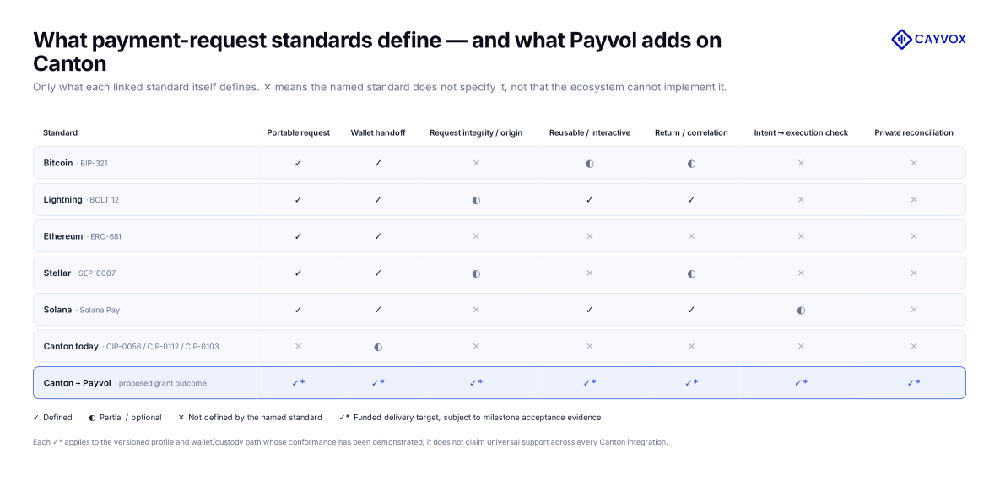

*Figure 1. Capability comparison: only what each linked standard itself defines, and the funded delivery target for Canton + Payvol on the demonstrated profile and path. ✓ defined · ◐ partial or optional · ✕ not defined by the named standard · ✓\* funded delivery target, subject to milestone acceptance evidence.*

The proposed outcome is therefore not another settlement rail. It is a common Canton layer intended
to carry a request from a business application to a supported authorization path, verify the
corresponding execution where the path exposes the required capabilities, and return authorized
evidence that the payee can reconcile privately.

The common lesson is not that every network should copy the same URI, nor that Payvol replaces these
standards. Shared payment conventions complement settlement capabilities and support broader ecosystem adoption. Applications and
wallets also need a shared language for the request, user authorization, safe transaction
interpretation, and completion evidence. Payvol combines that established category with the
Canton-specific requirements that the other standards do not attempt to solve: versioned Token
Standard execution profiles, synchronizer-aware options, verification of the actual transaction
awaiting authorization, and private reconciliation from the payee's authorized view.

#### Building on Canton's existing foundations

Canton already has the essential foundations:

| Canton foundation | Capability available today | Layer completed by Payvol |
|---|---|---|
| CIP-0056 and CIP-0112 Token Standard | Standard transfer and allocation execution for Canton assets | A portable intent describing what payment outcome is requested and which execution choices are acceptable |
| CIP-0103 dApp Standard | Wallet connection, accounts, signing, ledger access, transaction submission, and lifecycle events | A payment-specific object that any compatible application can pass through that interface |
| Canton privacy and party-scoped ledger views | Confidential execution and participant-authorized observation | Private payment matching and reconciliation without dependence on a public transaction index |
| Canton’s multi-asset, multi-application architecture | Many issuers and workflows can interoperate on a shared network | Consistent payment options, requirements, clear-signing checks, responses, and operational status across those workflows |

The current [Canton CIP catalog](https://github.com/canton-foundation/cips) contains these execution
and wallet building blocks, but no published CIP defines the complete portable payment-intent and
reconciliation layer represented by the standards above. Payvol completes that stack in a
Canton-native way: multi-party, multi-asset, synchronizer-aware, privacy-preserving, and compatible
with institutional payment operations.

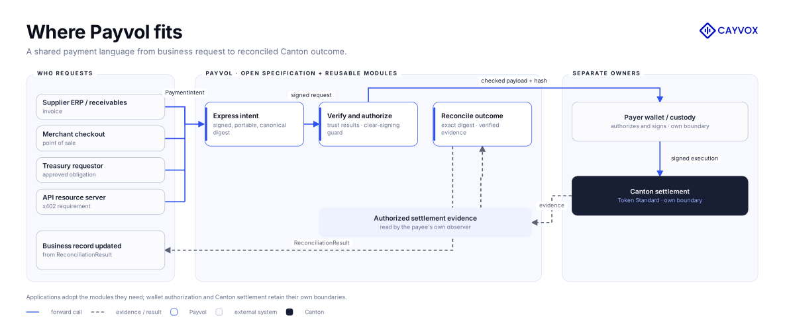

*Figure 2. Payvol between requesting applications and measured wallet or custody capabilities, settled by the Token Standard on Canton.*

### 3. Existing Proof of Work

The following work has already been completed or substantially completed by Cayvox Labs and provides
evidence of feasibility:

- a sealed v0.1 payment-request format and a richer v0.2 draft data model;
- structured account, payee, instrument, requested-receive, execution-scope, security-requirement,
  and payment-option types;
- open-source TypeScript packages for core encoding and validation, QR payload handling, NFC Forum
  NDEF URI serialization/parsing, conformance, and command-line use, published on npm under
  Apache-2.0 as [@payvol/core](https://www.npmjs.com/package/@payvol/core),
  [@payvol/qr](https://www.npmjs.com/package/@payvol/qr),
  [@payvol/conformance](https://www.npmjs.com/package/@payvol/conformance), and
  [@payvol/cli](https://www.npmjs.com/package/@payvol/cli);
- a web playground and integration-oriented application shell at [payvol.xyz/app](https://payvol.xyz/app), with the project site at [payvol.xyz](https://payvol.xyz);
- a captured Canton DevNet reference-CLI path covering prepare, local signing with a dedicated
  externally held Ed25519 key, execute, update-ID retrieval, Canton Coin v1 transfer-instruction
  creation and recipient acceptance, with payee-side correlation metadata captured on the
  instruction-creation update, which remains readable after acceptance;
- **73 passing conformance vectors** across the v0.1 and v0.2-draft profiles; and
- **709 passing automated tests across 45 test files**, with type checking and linting passing as
  verified on 2026-09-05.

The grant turns this foundation into a stable, supported v1 protocol: it completes the security and
lifecycle model, ships production packages, proves a direct-transfer profile and an
allocation-handoff profile against their stated acceptance boundaries, establishes interoperability,
and validates the result with an independent ecosystem participant.

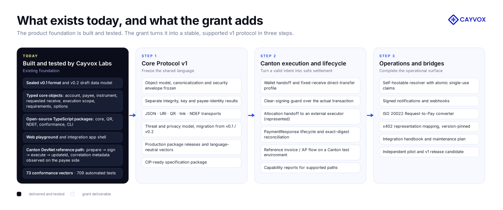

*Figure 3. The existing, tested foundation and the three grant steps that turn it into a stable, supported v1 protocol.*

### 4. Implementation Mechanics

#### 4.1 Intent plane

The intent plane describes what outcome the payee will accept, independently of the wallet that will
authorize it. Its v1 objects will include:

- `PaymentIntent`: identity, payee, requested receive amount, currency/instrument policy, expiry,
  network and synchronizer scope, human-readable purpose, private reconciliation reference, and
  security envelope;
- `PaymentOption`: one permissible combination of account, instrument, amount rule, execution
  profile, and requirements;
- `Requirement`: machine-readable preconditions such as payer acknowledgement, credential or
  eligibility references, memo requirements, and timing constraints; and
- `Offer`: a signed reusable invitation whose portable envelope identifies immutable offer terms and
  its resolver binding without embedding mutable server state; the resolver issues a separately
  identified and signed `PaymentIntent` for each successful resolution.

The same semantics will have deterministic JSON and URI forms. Transport helpers will cover QR,
deep links, browser links, and NFC Forum NDEF URI records. A digest and signature envelope will
allow a wallet to identify which fields it is authorizing and detect changes between presentation
and execution.

Payvol v1 will report **payload integrity**, **signing-key verification**, and **payee identity
binding** as separate results. A valid signature proves control of a key over the canonical intent;
it does not by itself prove that the key belongs to the merchant or payee the payer expected. PV-03
will therefore define a pluggable trust-binding interface and a reference policy for pinned
key/party allowlists and out-of-band expected-payee bindings. Wallets remain free to add compatible
directory or naming-system resolvers. When no recognized binding is available, the wallet reports
the request as integrity-verified but identity-unbound rather than upgrading it to trusted.

Payvol separates the **Core Protocol** from **Canton Execution Profiles** so each can evolve without
silently changing the other. Milestone 1 freezes the transport-independent object grammar,
canonicalization, security envelope, profile identifier and registry contract, feature negotiation,
and fail-closed handling of unknown profiles. Execution-profile semantics, extractors,
compatibility manifests, and profile-specific vectors are versioned independently and released in
Milestone 2. A core implementation can therefore preserve and validate a profile reference without
claiming it can execute a profile it does not support.

Offer resolution has an equally explicit boundary. The M1 protocol defines a resolution request
containing the signed Offer digest and an opaque client request identifier. The M3 reference resolver
adds a unique resolver nonce, derives the new intent identity with the M1 domain-separated hashing
rules, atomically persists the `(offerDigest, clientRequestId)` mapping before responding, and returns
the same result when that request is safely retried. The resulting intent carries
`sourceOfferDigest`, cannot widen the signed Offer's immutable constraints, expires no later than the
Offer, and has its own resolver/payee signature. Thus M1 standardizes what consumers verify while M3
supplies the stateful issuance service.

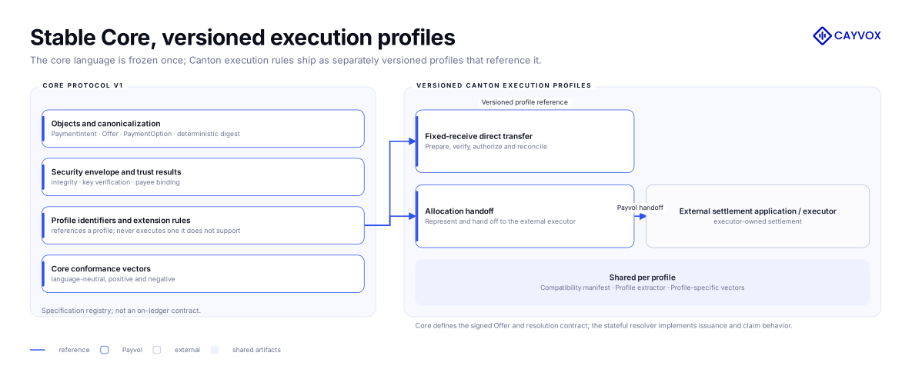

*Figure 4. The Core Protocol frozen at Milestone 1 acceptance and the independently versioned Canton execution profiles released in Milestone 2, joined only by the profile registry.*

#### 4.2 Execution plane

Payvol will define profiles that translate a selected payment option into existing Canton execution
mechanisms. The implementation will:

1. validate the intent, expiry, network, integrity status, configured identity-binding policy,
   selected option, and requirements;
2. resolve the relevant Token Standard instrument and account information;
3. hand the request to a wallet through a neutral interface compatible with the direction of
   [CIP-0103](https://github.com/canton-foundation/cips/blob/main/cip-0103/cip-0103.md);
4. map direct-payment choices to the Token Standard transfer flow and express conditional or
   coordinated choices as an allocation handoff for a settlement application/executor under
   [CIP-0056](https://github.com/canton-foundation/cips/blob/main/cip-0056/cip-0056.md) and
   [CIP-0112](https://github.com/canton-foundation/cips/blob/main/cip-0112/cip-0112.md);
5. derive a `PreparedExecutionSummary` from the prepared transaction and its preparation context
   through a versioned execution-profile extractor, then compare it with the accepted intent before
   signing; and
6. return normalized submission evidence and lifecycle status without leaking private ledger data.

##### Wallet capability and conformance model

Payvol is designed so that any wallet or custody system can participate at the level it supports,
and so that applications can rely on a published, versioned conformance model instead of
integration-by-integration assumptions. A direct-transfer integration can use either of two
implementation modes with identical guarantees:

1. **application-visible preparation**, in which the execution adapter obtains the prepared
   transaction and context, PV-08 verifies them, and the wallet authorizes the verified signable
   payload; or
2. **wallet-owned preparation**, in which the wallet constructs the transaction and runs the same
   profile extractor and clear-signing check over the actual transaction before authorization.

In both modes, exact correlation to the intent is established when the submitted transaction carries
the profile-defined Payvol payload digest and execution-profile identifier and those values are
observable in the payee's authorized update stream, identified by a real ledger `updateId`; whether
the payment is complete, and how the outcome is classified, is determined separately from the
profile's settlement evidence.

Conformance is expressed by capability so that wallets, custodians, and applications share one
vocabulary:

| Capability class | What it guarantees |
|---|---|
| **Core Conformant** | Parses, validates, verifies, and displays the Payvol artifact and its trust statuses |
| **Execution Conformant** | PV-08 evaluates the actual transaction awaiting authorization, through application-visible preparation or a wallet-internal guard |
| **Reconciliation Conformant** | The submitted execution preserves the exact Payvol digest/profile correlation and the payee observes it with real update evidence |
| **Full Conformant** | Core, Execution, and Reconciliation conformance for the named profile and version |

Conformance is versioned per profile and published with the conformance suite, so a wallet or
custody path can adopt Payvol incrementally, advertise exactly what it supports, and be verified
by anyone using the public vectors. Milestone 2 publishes the first measured, versioned capability
report for the wallet and custody paths exercised by the reference flow; the model itself is not
tied to any particular wallet product.

##### Prepared-execution interpretation boundary

Payvol will reuse compatible Canton transaction-hashing and visualization components where they
satisfy the supported profile's verification requirements. Its payment-specific contribution is
checking the prepared execution against the accepted `PaymentIntent` and binding that check to the
payload awaiting authorization. PV-08 is deliberately bounded to known execution profiles; it is not a general interpreter for
arbitrary Daml transactions. The v1 direct-transfer extractor will use the exact Token Standard
interface/package versions listed in a published compatibility manifest. The default extractor
ships with content-addressed descriptors bound to the Payvol release; participant package services
may supply package data but do not define the trusted interpretation. An externally supplied
descriptor is accepted only when its digest and authenticated release provenance match an explicitly
trusted manifest.

| Comparison input | Authorization-critical information | v1 rule |
|---|---|---|
| Accepted Payvol option | Expected payee/destination, requested receive amount, instrument, account, execution method, expiry, and execution scope | Read only from the validated canonical intent |
| Known Token Standard command/choice | Actual destination, transfer amount, instrument, account, execution method, and any extractable fee/receive semantics | Independently extracted by the versioned profile; never accepted from an untrusted builder-supplied summary |
| Preparation and wallet context | Network, synchronizer, execute-before constraint, hashing scheme, and transaction hash | Bound to the summary; `executeBefore` must not be later than intent expiry |
| Package/interface identity | Package ID, interface/choice identity, supported schema version, profile version, and descriptor digest | Must match the release-authenticated compatibility manifest or fail closed |

If any field declared authorization-critical for a profile cannot be independently extracted or
bound, PV-08 returns a stable `UNSUPPORTED_EXECUTION` or `INDETERMINATE_SUMMARY` result and the wallet
does not authorize through that profile. For supported profiles, the clear-signing verifier compares
the independently derived values and rejects any mismatch before wallet authorization.

The check covers the supported profile's entire signable transaction structure, not merely one
matching transfer inside it. Each profile defines its permitted root actions and associated
authorization-relevant structure, including any supported fee and change operations. Additional
unauthorized transfers or authority-changing actions, and authorization-relevant structure that the
profile cannot interpret, fail closed. Using the supported Canton hashing scheme, the verifier
independently derives the transaction hash and binds the checked transaction and authorization
context to the exact payload the wallet will sign. Rebuilding or changing that payload invalidates
the check and requires verification again; a matching builder-supplied summary is insufficient.

Each profile declares its amount semantics. The fixed-receive direct-transfer profile compares
`requestedReceive.amount` only where the supported asset/profile semantics establish that the
extracted transfer amount is the amount credited to the destination; separately charged payer fees
are displayed as fees and do not reduce that receive amount. If receiver-side deductions,
conversion, netting, or an unextractable fee make the credited amount indeterminate, that option
fails closed under the fixed-receive profile. This leaves room for separately versioned quote,
fixed-send, variable-receive, and other future profiles without weakening v1 authorization.

The authorization deadline is the earliest applicable deadline. A prepared execution is eligible
only while the intent and selected option are current and its enforceable `executeBefore` is no
later than the intent expiry. A missing, later, or unbindable execution deadline produces a stable
fail-closed result rather than extending the signed intent's lifetime.

The compatibility manifest is itself authorization-critical. Its content digest, release
provenance, supported package/interface identities, and extractor version are recorded in the
`PreparedExecutionSummary`. Unknown, altered, stale-incompatible, or mismatched descriptors are
rejected. This makes profile expansion an explicit release action instead of allowing mutable
runtime metadata to redefine what a wallet believes it is signing.

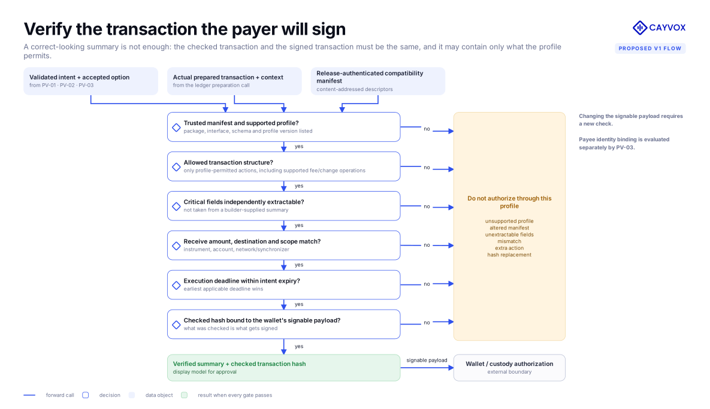

*Figure 5. The clear-signing guard: every gate must pass before Payvol marks the execution approval-safe; unknown or unextractable inputs fail closed.*

Allocation ownership is separate and explicit. The settlement application/executor creates the
settlement and `AllocationRequest`, coordinates the parties, and completes the settlement. Payvol
standardizes the payment-option representation, wallet handoff, correlation, and normalized outcome
for that external flow. Milestone 2 validates this integration contract against current Token
Standard interfaces while the live reference execution remains the direct-transfer profile.

Synchronizer behavior is also deterministic: a `pinned` option is available only on the named
synchronizer; if the payer cannot source a valid execution there, the option is rejected with a
stable reason. For an `any` policy, the wallet/execution adapter selects a supported synchronizer and
records the selected value in the prepared summary and response. Asset reassignment remains an
explicit wallet or settlement-application operation, and Payvol never silently falls back to a
different synchronizer.

#### 4.3 Lifecycle and reconciliation plane

A payment request is not complete when it is displayed or submitted. Payvol will define a
transport-neutral `PaymentResponse` and status model covering presentation, acceptance, decline,
authorization, submission, settlement, failure, expiry, and closure. The reference reconciler will
classify:

- exact, partial, and over-payment;
- wrong account or instrument;
- duplicate, replayed, late, expired, and superseded payment attempts;
- submitted but not yet observable outcomes;
- failures and retry-safe resubmission; and
- privacy-preserving evidence checkpoints for environments where ledger history is pruned.

The private commercial reference remains off-ledger by default. For a reconciliation-conforming
direct-transfer profile, the correlation envelope written to `Transfer.meta.values` contains the
domain-separated Payvol payload digest and execution-profile identifier, not the invoice number or other private business
reference. The payee-side adapter reads that envelope from its authorized update stream and records
the ledger `updateId`, effective time, instrument, amount, and receiver as execution evidence.
The captured DevNet fixture captures
the draft digest/profile metadata on the instruction-creation update and separately records the
recipient-acceptance update ID; the creation update remains readable by the payee after acceptance.
It does not establish metadata on the acceptance credit event or the final v1 execution-profile
identifier. M2 links an instruction to its successful acceptance outcome before counting it as
settled; creating an instruction alone is not payment completion. Metadata survival and payee-side
observability for preapproval/direct-credit and every additional execution profile are separate Milestone 2
verification items. No path or profile is marked supported until captured evidence passes its
profile-specific conformance suite.

Distinct, confirmed settlements correlated to the same digest can be aggregated as partial or
over-payment evidence only for the requested destination and instrument. Each profile defines the
settlement identity and evidence chain used for deduplication: the same `updateId` observed again is
not new evidence, multiple movements within one update are distinguished where applicable, and an
instruction's creation and acceptance are not counted as two payments. An event with
no valid Payvol digest is reported as an **uncorrelated settlement** and is never automatically
assigned to an intent from account, amount, or timing similarity. Implementations may expose an
auditable operator-assisted linking workflow outside the normative automatic reconciler. An
allocation handoff is not advertised as automatically reconcilable until its versioned profile has
defined and verified an equivalent correlation surface. Reconciliation otherwise uses returned
execution evidence or signed notifications controlled by the parties and never assumes public
visibility of private Canton transactions.

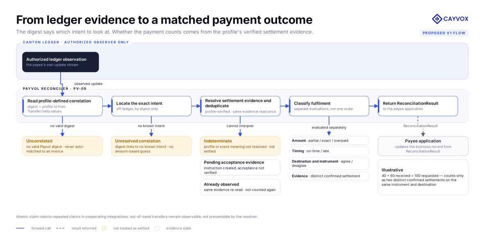

*Figure 6. Reconciliation uses exact digest correlation and profile-defined settlement evidence; repeated observations and instruction/acceptance evidence are not additional payments, and uncorrelated settlements are never assigned by similarity.*

Replay and idempotency controls are defined by layer rather than presented as one universal
guarantee:

| Case | Control and state boundary | Delivery |
|---|---|---|
| Expired or re-presented artifact | Signed expiry plus wallet/application seen-intent policy | Semantics and vectors in M1 |
| Replayed signed prepared submission | Execution-profile-specific transaction identity and ledger rejection rules | Detection/result mapping in M2 |
| Repeated claim for one single-use intent | Shared payee/resolver state and an atomic claim/close operation; participating integrations require an accepted claim before authorizing a new payment attempt | Atomic rejection of a second claim through the durable state provider in M3 |
| Fresh second transfer for an already fulfilled intent | Profile-defined settlement evidence and intent identity; transfers submitted outside the claim-aware path remain possible | Deterministic duplicate-payment detection when correlated evidence is observable in M2; the M3 resolver does not prevent arbitrary on-ledger transfers |
| Redelivered response or webhook | Stable event/attempt identifier and idempotent consumer rule | M2 response model and M3 notification profile |

This distinction allows stateless payment requests to remain portable while making single-use
coordination an explicit stateful capability of cooperating integrations, rather than an implied
property of a signature or expiry. A resolver claim is not an exactly-once ledger-settlement
guarantee; uncertain submissions must be resolved from execution evidence before a retry is
authorized.

The resolver's HTTP processing can remain stateless, but current status, Offer resolution, closure,
and atomic claim decisions are served by an explicit state provider. The bundled durable provider
stores only the identifiers, state transitions, timestamps, expiry, and policy-required claimant
context needed for those operations; private commercial references are excluded. The privacy
analysis covers identifier and timing linkability, scoped access, minimized logs, configurable
retention, and deletion. Payer-identifying data is retained only when an application policy requires
it, rather than being a protocol-wide requirement.

#### 4.4 Adapter and institutional integration plane

The grant includes two bounded institutional integrations:

- an **ISO 20022 Request-to-Pay mapping and converter prototype**, centered on `pain.013` request,
  `pain.014` response, the reference linking an accepted request to its separate `pacs.008` credit
  transfer, and relevant cancellation/status semantics; and
- a **version-pinned x402 exact-Canton representation mapping** showing how the scheme's Canton Coin
  payment requirement, the payee's live `TransferPreapproval` prerequisite, payer-signed transfer,
  facilitator result, and service decision are represented as Payvol intent and lifecycle objects.

The ISO converter documents precise field mapping and loss handling. The ISO mapping does not
treat `pain.014` as settlement: acceptance is followed by a separate credit transfer, linked through
the agreed end-to-end reference. Cancellation is represented as its own creditor/payee-side request
path rather than as a payer response.

The x402 mapping is representation only. As the exact-Canton scheme at the pinned version
specifies, the client prepares and signs the transfer without submitting it, the resource server
calls a configured facilitator, and the facilitator verifies the live `TransferPreapproval`, relays
the payer-signed transaction, and returns the settlement result. Payvol maps those objects and
outcomes into `PaymentIntent`, `TrustAssessment`, `PaymentResponse`, and `SettlementEvidence`
representations and reports unsupported or lossy fields. The grant delivers the mapping
specification, validated example inputs and outputs, and mapping tests: mapping validation only; no
x402 payment verification, transaction submission, or settlement execution. A mapped result keeps
its source and trust context; mapping does not verify the payee identity, does not treat the payment
as independently settled, and does not reinterpret the payer's signed payload as a re-signable
Payvol transaction.

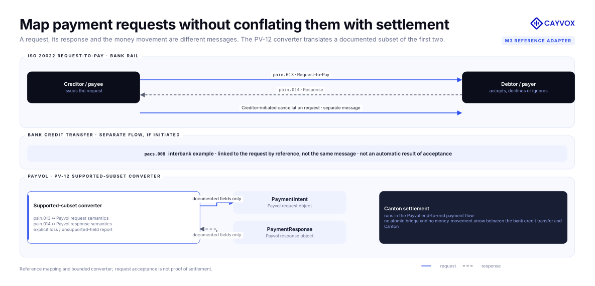

*Figure 7. The ISO 20022 request, response, and resulting credit transfer are separate messages linked by reference; the bounded converter maps the supported request-to-pay semantics to Payvol.*

#### 4.5 Components delivered

- normative Payvol v1 specification and public standards package;
- published packages: `@payvol/core`, `@payvol/qr`, `@payvol/conformance`, and `@payvol/cli` in M1,
  followed by `@payvol/canton` and `@payvol/lifecycle` in M2;
- frozen, language-neutral Core Protocol vectors, independently versioned execution-profile
  vectors, and a conformance runner;
- trust-binding interface and reference pinned-key/party policy;
- Canton execution profiles, versioned prepared-execution extractors, a release-authenticated
  compatibility manifest and generated support matrix, and a fail-closed clear-signing verifier;
- lifecycle, observation, and reconciliation library;
- self-hostable resolver with explicit state-provider adapters, a durable reference provider, and a
  signed notification service;
- reference payer, payee, invoice/AP, and ISO 20022 examples plus the version-pinned x402
  representation mapping with validated examples;
- threat model, privacy analysis, operational guidance, migration guide, and support matrix; and
- one independently operated Canton ecosystem pilot in Milestone 3.

#### 4.6 Technical architecture by module

Payvol is organized as a set of small modules with explicit inputs and outputs. Protocol processing
remains deterministic and side-effect free; wallet, resolver, and ledger access are isolated at the
edges. This allows an application to adopt the complete stack or only the modules it needs while
preserving identical payment semantics.

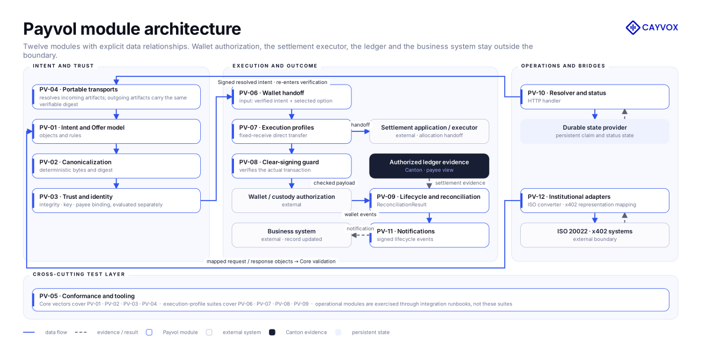

*Figure 8. The twelve bounded Payvol modules; resolved intents return through Core verification, while wallets, state providers, facilitators, and settlement executors remain external owners.*

| ID | Module | Core responsibility | Primary input | Primary output | Milestone |
|---|---|---|---|---|---|
| **PV-01** | Intent and Offer Model | Defines the requested outcome, payee, receive amount, acceptable options, requirements, execution scope, expiry, commercial context, and the contract binding a reusable Offer to each resolved intent | Application or institutional payment instruction | Versioned `PaymentIntent` or signed reusable `Offer` envelope | M1 |
| **PV-02** | Canonicalization | Produces deterministic bytes so independent implementations calculate the same content identity | Payvol payload | Canonical JSON, payload digest, serialization metadata | M1 |
| **PV-03** | Trust and Identity | Verifies payload integrity and key control, then evaluates signer-to-payee binding under an explicit wallet/application trust policy | Payload digest, security envelope, expected-payee context, configured trust source | Separate integrity, key-verification, and identity-binding statuses with source and stable findings | M1 |
| **PV-04** | Portable Transports | Carries the same artifact through JSON, URI, QR, browser link, and NFC without changing its meaning | Canonical Payvol artifact | Transport representation and decoded artifact | M1 |
| **PV-05** | Conformance and Tooling | Proves that independent implementations process Core Protocol objects identically and can add separately versioned profile suites | Core or execution-profile specification and test vectors | Machine-readable conformance report, CLI output, CI result | M1, extended in M2 |
| **PV-06** | Wallet Handoff | Converts a verified intent and selected option into a normalized, wallet-neutral authorization request | Verified artifact, payer account, selected `PaymentOption` | CIP-0103-compatible wallet request and normalized wallet result | M2 |
| **PV-07** | Canton Execution Profiles | Prepares supported direct-transfer executions and maps allocation options into a handoff owned by an external settlement application/executor | Wallet request, instrument, destination account, execution scope | Prepared direct-transfer execution or allocation integration handoff; normalized result | M2 |
| **PV-08** | Clear-Signing Guard | Checks the supported transaction structure, independently extracts critical fields, compares them with the intent, and binds the result to the wallet's signable payload | Accepted intent, prepared execution and context, release-authenticated package/interface manifest | Verified `PreparedExecutionSummary` and checked transaction hash, or precise fail-closed rejection | M2 |
| **PV-09** | Lifecycle and Reconciliation | Normalizes payer response and classifies exactly correlated ledger outcomes against the original request without guessing | Wallet events, authorized ledger events, Payvol payload digest | `PaymentResponse`, lifecycle status, `ReconciliationResult`, or uncorrelated-settlement result | M2 |
| **PV-10** | Resolver and Status | Resolves a signed Offer into a unique signed PaymentIntent, serves dynamic options/status through explicit state-provider adapters, and provides durable atomic state for single-use intents | Offer or intent identifier, privacy-minimized request context, configured state provider | Signed resolved intent, current options/status, terminal result, or atomic claim decision | M3 |
| **PV-11** | Notifications | Delivers lifecycle changes to the requesting application with authentication and safe redelivery | Versioned lifecycle event | Signed, ordered, idempotent notification | M3 |
| **PV-12** | Institutional Adapters | Provides the bounded ISO 20022 converter prototype and maps x402 exact-Canton request/response semantics to Payvol objects for representation only | ISO 20022 `pain.013` or x402 Canton Coin payment requirement and facilitator result | Payvol intent plus ISO 20022 `pain.014`, or Payvol representations of the x402 request, payer-signed payload result, and settlement result | M3 |

#### 4.7 Core protocol objects

The modules exchange a small set of versioned protocol objects rather than application-specific
payloads:

| Object | Meaning | Important invariants |
|---|---|---|
| `PaymentIntent` | A single requested payment outcome | One authoritative requested-receive amount; explicit network and synchronizer policy; bounded lifetime |
| `Offer` | A signed reusable invitation from which a resolver can issue payment intents | Immutable terms and resolver binding are signed; every resolved intent has a unique identity, expiry, `sourceOfferDigest`, reconciliation context, and its own signature |
| `PaymentOption` | One permitted way to satisfy the intent | References a defined instrument, destination, versioned execution profile, amount semantics, and requirement set; unsupported profiles fail closed |
| `SecurityEnvelope` | Integrity and signer context attached to canonical intent bytes | Signature input, suite, signer, key reference, and signing time are explicit and versioned; the envelope alone makes no merchant-identity claim |
| `TrustAssessment` | The wallet/application's evaluation of the signer against its configured trust source | Integrity, key control, identity binding, evidence source, and unresolved status remain separate |
| `WalletHandoff` | The normalized instruction passed to the payer’s wallet | Contains business intent and authorization-critical fields, rather than private key or wallet implementation details |
| `PreparedExecutionSummary` | A deterministic, independently extracted interpretation of a supported Canton transaction awaiting approval | Records extractor/profile, package identity, descriptor digest, checked transaction hash and context, amount semantics, extractable fees, and effective deadline; permitted transaction structure and every critical field must be verified, or the profile fails closed |
| `PaymentResponse` | The payer-side answer and submission lifecycle | Stable states and reason codes across wallet implementations |
| `SettlementEvidence` | The evidence returned from submission or observed on the authorized ledger view | Carries provenance, Payvol digest/profile correlation, effective time, and update identifiers required for reconciliation |
| `ReconciliationResult` | The payee-side classification of what occurred | Distinguishes exact, partial, overpaid, duplicate, late, expired, wrong-instrument, failed, and indeterminate outcomes |

#### 4.8 End-to-end payment sequence

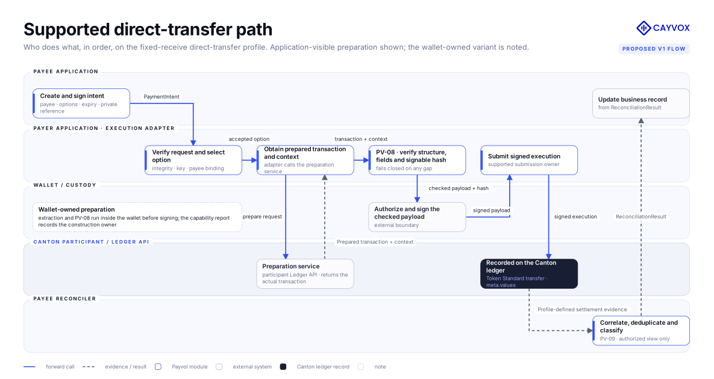

*Figure 9. Off-ledger request and verification, on-ledger settlement with the correlation envelope, and private exact-digest reconciliation returning to the payee.*

At the critical authorization boundary, PV-08 evaluates both the accepted Payvol option and the
actual prepared Canton execution. The execution adapter may operate beside the wallet or be
implemented inside it, but the same profile extractor and fail-closed rules apply. A mismatch,
unknown package/profile, or field that cannot be extracted produces a deterministic rejection before
the payer signs; a successful check produces the display model bound to the exact signable
transaction and context. Separately, the selected
profile must preserve its correlation envelope through submission for reconciliation conformance.
This establishes execution-to-intent consistency without conflating it with merchant authenticity:
payee identity remains a separate PV-03 result and is never inferred from a digest or transaction
comparison.

#### 4.9 Module delivery across milestones

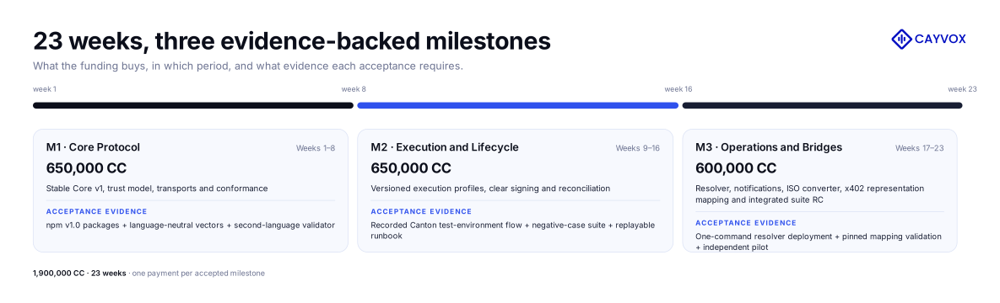

*Figure 10. Three milestones over 23 weeks; every payment is tied to explicit acceptance evidence, with a live supported path in Milestone 2 and an independent pilot in Milestone 3.*

This order makes every milestone independently useful. M1 gives the ecosystem an implementable
standard and compatibility test. M2 makes that standard executable and operationally observable on
Canton. M3 connects it to live application state and institutional payment boundaries, then validates
the complete stack through an independent implementation.

### 5. Architectural Alignment

#### Primary alignment: RFP 13 — Payments and DeFi

The Foundation’s
[2026–2028 roadmap](https://github.com/canton-foundation/canton-dev-fund/blob/main/2026-2028-strategic-roadmap.md)
asks for open-source tooling, reference implementations, and standards for payments, settlement,
and liquidity workflows that support real economic activity, improve composability, and make it
easier for applications to build financial workflows that are private, auditable, and
interoperable, with a stated preference for reusable components or standards that support multiple
Canton applications rather than one-off application-specific work. Payvol answers each element of
that request directly:

| RFP 13 asks for | What Payvol delivers |
|---|---|
| Open-source standards, tooling, and reference implementations for payments and settlement | Payvol Core Protocol v1, production TypeScript packages, conformance suite, and reference payer/payee, invoice/AP, the ISO 20022 converter prototype and the x402 representation mapping, all under Apache-2.0 / CC0-1.0 |
| Support for real economic activity | Reference invoice/AP flow on a Canton test environment in Milestone 2 and an independently operated ecosystem pilot on TestNet or MainNet in Milestone 3 |
| Improved composability | One payment-intent object and lifecycle model that any application, wallet, issuer, or settlement application can compose with, without modifying Token Standard or wallet interfaces |
| Private, auditable, and interoperable financial workflows | Party-scoped reconciliation from the payee's authorized ledger view, exact-digest correlation, signed evidence, and ISO 20022 Request-to-Pay conversion and x402 semantic mapping |
| Reusable components rather than one-off work | Twelve bounded modules that applications adopt individually or together with identical payment semantics; no application-specific checkout flow is funded |

Payvol also delivers several items that the roadmap lists under Financial Markets Standards:
integration mappings for existing institutional systems, API-level compatibility standards, and
conformance tests with reference implementations, while supporting multiple issuers and applications
rather than a single proprietary implementation.

#### Secondary alignment: RFP 14 — Wallet and dApp Integration Tooling

The roadmap describes wallets as a primary interface for users, hosted parties, application
providers, and institutional workflows, and asks for wallet integration tooling, reusable wallet
components, signing flows, and application-to-wallet interactions. Payvol gives wallets a stable,
reusable object to display, validate, approve, reject, and reconcile, and a clear-signing flow that
verifies the actual transaction before the signature. It gives dApps a stable object to create
without choosing a payer’s wallet, and a wallet-neutral application-to-wallet handoff compatible
with CIP-0103. It uses the wallet/dApp connection surface where available but remains
transport-neutral.

#### Placement in the Canton stack

| Layer | Existing Canton capability | Payvol contribution |
|---|---|---|
| Asset and settlement | CIP-0056 / CIP-0112 Token Standard transfer and allocation interfaces | Turns acceptable settlement paths into wallet-readable payment options |
| Wallet authorization | CIP-0103 connection, account, signing, execution, and event interfaces | Supplies consistent payment semantics and display-critical fields to the authorization flow |
| Ledger execution | Canton prepare, sign, execute, and party-authorized ledger access | Verifies that the prepared execution matches the accepted intent and returns normalized evidence |
| Application operations | Application-specific invoice, checkout, treasury, and agent workflows | Provides a common lifecycle and reconciliation language reusable across all of them |

This creates a clean composition: Payvol expresses and tracks the requested payment; Canton’s
existing standards authorize, execute, and record it. Each application keeps control of its product
experience while gaining an interoperable payment primitive.

### 6. Backward Compatibility

**No backward compatibility impact.** Payvol is additive. Existing applications may adopt only the
static v1 format, only the lifecycle library, only the conformance vectors, or none of the project.
No ledger contracts, Token Standard interfaces, wallet APIs, or existing application workflows are
modified by this grant.

The Core Protocol v1 release will include an explicit migration utility from the existing Payvol
v0.1 and v0.2-draft forms. Future changes will follow semantic versioning; unknown optional fields will be
handled according to the compatibility rules in the specification.

Release names follow the same boundary: M1 releases stable Core Protocol v1 packages and vectors;
M2 releases independently versioned execution profiles and lifecycle tooling; M3 delivers the
integrated Payvol suite release candidate, including operational services and adapters. The suite's
release-candidate label does not reopen or downgrade the stable Core Protocol v1 specification.

### 7. Real-World Solution Scenarios

The proposed v1 scope supports the following scenarios. Each scenario uses the same open
payment primitive and maps directly to funded Payvol modules rather than requiring a separate,
application-specific payment format.

| Scenario | Real workflow enabled by Payvol | Verifiable outcome | Modules exercised |
|---|---|---|---|
| **B2B invoicing and accounts payable** | A supplier embeds a signed payment intent in an invoice. The buyer's AP system checks payload integrity and the supplier binding under its configured trust policy, then validates amount, accepted instruments, account, expiry, and private invoice reference before handing authorization to a supported wallet or custody path. | The supplier uses the Payvol digest to locate the corresponding off-ledger invoice record, then classifies the authorized Canton result as exact, partial, overpaid, late, duplicate, uncorrelated, or unresolved from its permitted ledger view. | PV-01–PV-09; PV-11 and PV-12 for notifications and ISO 20022 Request-to-Pay exchange |
| **Merchant checkout and point of sale** | A checkout or terminal presents the same request as a QR code, link, or NFC record. A supported wallet or custody path selects an allowed token/account combination, displays the critical terms, and authorizes the corresponding Token Standard execution according to its measured capabilities. | The merchant receives a normalized result and can confirm the requested payment without depending on a proprietary wallet payload or public transaction index. | PV-01–PV-10 |
| **Treasury payment requests** | A treasury or operations team sends a controlled request to an internal entity or counterparty with an identified payee, amount rule, accepted instrument, execution method, synchronizer scope, requirements, and expiry. | The payer retains its structured response and submission evidence; the payee independently derives reconciliation state from its authorized evidence. | PV-01–PV-09; PV-11 for lifecycle delivery |
| **Agent and API payments** | Software receives a machine-readable Payvol intent, verifies it, evaluates the permitted options, and passes the selected payment to a wallet or custody policy for authorization. The x402 representation mapping shows how the existing exact-Canton flow across client, resource server, and configured facilitator is represented in Payvol objects. | The service receives a normalized Payvol representation of the x402 outcome, with its source and trust context preserved, while the wallet's authorization boundary is untouched. | PV-01–PV-10; PV-12 for the x402 representation mapping |
| **Validator and node-service billing** | An infrastructure provider issues a signed service invoice whose private payment reference remains in its off-ledger billing record and can use the resolver for current amount, accepted instrument, expiry, and status. | The provider uses the Payvol digest to observe and reconcile each conforming service payment from its authorized Canton view and delivers lifecycle changes to its billing system through signed notifications. | PV-01–PV-11 |
| **Marketplace obligations and payouts** | A marketplace or payout operator represents each seller, contributor, or service obligation with its own payee, amount, asset choice, private reference, and lifecycle state, using a consistent format across many counterparties. | Each conforming settlement remains independently attributable through its Payvol digest and reconcilable, while partial, duplicate, late, failed, and uncorrelated outcomes remain distinct and direct-transfer or allocation-handoff profiles provide Canton routing choices. | PV-01–PV-10 |

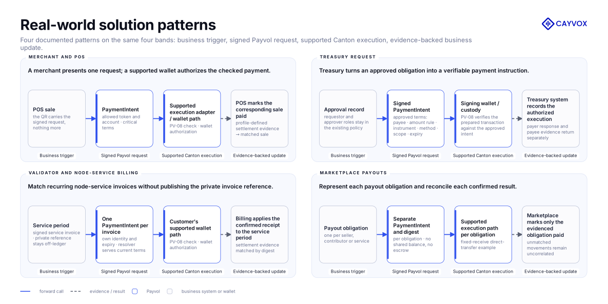

*Figure 11. Four documented solution patterns on the same four bands: business trigger, signed Payvol request, supported Canton execution, evidence-backed business update. Payment completion is confirmed only by the profile's settlement evidence; authorization and pending states are recorded separately.*

#### Anchor scenario A: a B2B invoice automatically matched to its Canton settlement

**Starting point.** A supplier's ERP has an approved invoice, payment terms, and a private invoice
reference. The buyer may use a different AP product, wallet, custodian, or accepted Token Standard
instrument.

**End-to-end journey:**

1. The supplier system creates and signs a Payvol intent containing the payee, requested amount,
   destination account, accepted instruments, execution options, expiry, requirements, and private
   reference.
2. The same intent travels with the invoice as a link, QR code, or API payload and retains the same
   digest across each representation.
3. The buyer's AP system or chosen wallet verifies payload integrity, evaluates the signer-to-payee
   binding under its configured trust policy, checks the network context and available options, and
   presents the payment-critical fields with those statuses kept separate.
4. Payvol's clear-signing guard compares the prepared Canton execution with the accepted intent. The
   payer authorizes it and the supported submission component submits the payer-authorized
   transaction through the Token Standard direct-transfer flow with
   the Payvol digest and profile identifier in the defined correlation envelope.
5. Payvol normalizes the wallet result and authorized ledger evidence into a `PaymentResponse` and
   lifecycle state.
6. The supplier system uses the observed Payvol digest to locate the off-ledger intent and its
   private invoice reference, then classifies the result as exact, partial, overpaid, duplicate,
   late, failed, uncorrelated, or still indeterminate without heuristic auto-matching.

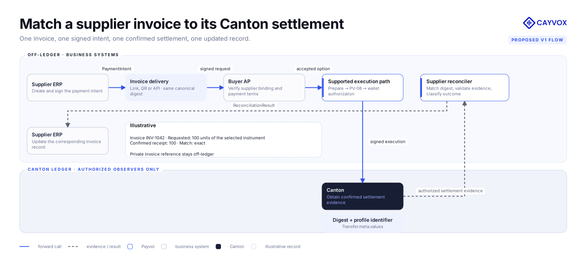

*Figure 12. Anchor scenario A as a two-layer flow: signed in the ERP, verified by the buyer's AP system, authorized through a supported wallet or custody path, settled on Canton, and matched back to the invoice by one digest. The invoice record shown is illustrative.*

**Grant evidence.** This is the primary runnable reference implementation and recorded end-to-end
demonstration for Milestone 2. The evidence package will include the Canton test-environment flow,
clear-signing checks, normalized response, and payee-side reconciliation output. The same runbook is
designed for reuse by the independent Milestone 3 pilot.

#### Anchor scenario B: how an x402 agent payment is represented in Payvol

**Starting point.** An HTTP service returns an x402 payment requirement that offers Canton as a
payment route. The exact-Canton scheme at the pinned version defines the flow: the calling software
operates under wallet or custody authorization policy, the payee maintains the live
`TransferPreapproval` the scheme requires, the client prepares and signs the transfer without
submitting it, and a configured facilitator verifies, relays, and settles. Payvol does not execute
any of these steps; it represents them.

**Representation, step by step:**

1. The x402 Canton Coin payment requirement is mapped into a Payvol `PaymentIntent` representation
   while preserving the trust context of the source request; the mapping does not by itself produce
   a payee signature or a verified payee identity, and the resulting `TrustAssessment` records the
   source context rather than a Payvol-verified binding; the live `TransferPreapproval` is
   represented as a scheme-prerequisite `Requirement` that Payvol records but does not check.
2. The agent's verification of expiry, trust context, and permitted options is expressed in Payvol
   terms, so the same policy vocabulary applies to x402 and non-x402 requests.
3. The payer-signed payload produced under the scheme is represented as a `PaymentResponse` in the
   authorized state; it is not reinterpreted as a re-signable Payvol transaction.
4. The facilitator's settlement result is represented as `SettlementEvidence` with its source marked
   as facilitator-reported; the payment is not treated as independently settled by Payvol.
5. The service decision is represented as the normalized lifecycle outcome, with unsupported or
   lossy fields reported explicitly.

**Grant evidence.** This is the Milestone 3 representation mapping. It is verified through the
published, version-pinned mapping specification, validated example inputs and outputs for each step
above, and mapping tests in CI; no live x402 settlement run is required.

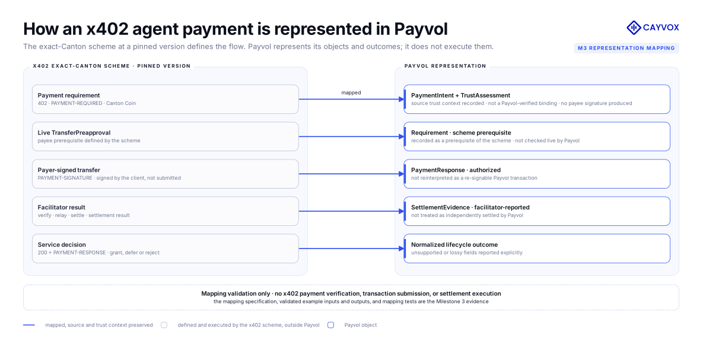

*Figure 13. Anchor scenario B: how each object of the exact-Canton x402 flow is represented in Payvol at the pinned scheme version. Mapping validation only; no x402 payment verification, transaction submission, or settlement execution.*

These scenarios share the same payment vocabulary. The invoice/AP reference flow and independent
pilot demonstrate supported Canton execution and reconciliation; the x402 example demonstrates
representation mapping only.

---

## Milestones and Deliverables

### Milestone 0: Completed Foundation — self-funded, delivered before submission

The foundation described in Section 3 is complete and live at the time of submission. It is not
funded by this grant; it is the working base that every Milestone 1 criterion starts from:

- `@payvol/core`, `@payvol/qr`, `@payvol/conformance`, and `@payvol/cli` published on npm as 0.2.0
  pre-releases under Apache-2.0 —
  [@payvol/core](https://www.npmjs.com/package/@payvol/core) ·
  [@payvol/qr](https://www.npmjs.com/package/@payvol/qr) ·
  [@payvol/conformance](https://www.npmjs.com/package/@payvol/conformance) ·
  [@payvol/cli](https://www.npmjs.com/package/@payvol/cli);
- the project site and the web playground with the integration-oriented application shell —
  [payvol.xyz](https://payvol.xyz) · [payvol.xyz/app](https://payvol.xyz/app);
- the sealed v0.1 payment-request format, the v0.2 draft data model, 73 conformance vectors, 709
  automated tests, and the captured Canton DevNet reference path with payee-side correlation
  metadata, as listed in Section 3.

### Milestone 1: Core Protocol v1, Trust Model and Conformance — 650,000 CC

- **Estimated Delivery:** Weeks 1–8
- **Focus:** Freeze the safe, transport-independent Payvol Core Protocol v1 and its execution-profile
  registry contract, and make independent implementations testable.
- **Modules completed:** PV-01 through PV-05

#### Deliverables

- Payvol Core Protocol v1 normative object model for intent, signed Offer envelopes, options,
  requirements, execution scope, requested receive, expiry, layered replay/idempotency semantics,
  identity binding, and security envelope; including the verification contract that binds an Offer
  to each separately identified and signed resolved intent.
- Published JSON Schema for every M1 Core Protocol v1 object, validated in CI; schemas for the
  execution and lifecycle objects are delivered in M2.
- Versioned execution-profile identifier and registry mechanism, extension rules, feature
  negotiation, and fail-closed behavior for unsupported profiles; profile-specific execution
  semantics remain independently versioned Milestone 2 artifacts.
- Deterministic JSON plus URI, QR, link, and NFC Forum NDEF URI serialization profiles with
  round-trip tests that prove one digest across every transport.
- Separate integrity, key-verification, and signer-to-payee identity-binding results; pluggable trust
  source interface; and reference pinned-key/party policy.
- Privacy and threat model covering tampering, replay, substitution, malicious resolver, altered or
  stale execution descriptors/manifests, incorrect network or synchronizer, duplicate payment,
  reference leakage, identifier/timing linkability, and misleading display.
- Migration rules and tools for Payvol v0.1 and v0.2-draft, exercised against the existing fixtures.
- Production npm releases of core, transport, CLI, and conformance packages with documentation,
  support matrix, version policy, changelog, software-bill-of-materials generation, and reproducible
  release procedure; CLI commands for encode, decode, validate, digest, and verify.
- Frozen language-neutral Core Protocol v1 positive and negative vectors, conformance manifest, and
  implementer test runner, with a defined mechanism for the profile-specific suites delivered in M2.
- A second-language reference validator (outside TypeScript) that reproduces digests and trust
  statuses from the published vectors, demonstrating independent implementability.
- Property-based and fuzz tests for canonicalization and envelope parsing.
- Public Core Protocol v1 specification package, with Canton execution profiles identified as
  independently versioned M2 specifications; playground updated to v1.

#### Ecosystem value and acceptance

Milestone 1 is accepted when:

1. `@payvol/core`, `@payvol/qr`, `@payvol/conformance`, and `@payvol/cli` are published on npm as
   v1.0 with semantic versioning, changelog, software bill of materials, and reproducible build
   instructions;
2. the Core Protocol v1 specification is published covering the object model, canonicalization,
   security envelope, separate integrity / key-verification / identity-binding results, profile
   registry contract, JSON, URI, QR, link, and NDEF transport profiles, the Offer-to-intent
   verification contract, and layered replay/idempotency semantics;
3. JSON Schema for every M1 Core Protocol v1 object is published and schema validation passes in
   CI; schemas for execution and lifecycle objects follow in M2;
4. the language-neutral Core vector set is published with at least one positive and one negative
   vector for every normative rule, including a valid signature whose payee identity remains
   unbound, a corrupted digest, an expired intent, an unknown profile, and a tampered envelope, and
   the conformance runner passes the full set in CI;
5. a second-language reference validator reproduces the same digests and trust statuses from the
   published vectors, and both implementations pass the vector set in CI;
6. transport round-trip tests pass in CI, producing the same digest across JSON, URI, QR, and NDEF;
7. the CLI is published with encode, decode, validate, digest, and verify commands and their
   documentation;
8. property-based and fuzz tests for canonicalization and envelope parsing run in CI;
9. the v0.1 / v0.2-draft migration tool is published and passes the existing fixtures in CI;
10. the threat and privacy model and the version and compatibility policy are published;
11. the public playground runs on Core Protocol v1; and
12. the Technology & Operations Committee accepts the Core Protocol v1 boundary, profile registry
    contract, threat model, and evidence package.

Cayvox Labs intends to submit the Core Protocol v1 specification to the public `cip-discuss` process
after Milestone 1; that submission and any CIP outcome are outside the acceptance criteria and do not
gate any payment.

### Milestone 2: Canton Execution, Clear Signing and Payment Lifecycle — 650,000 CC

- **Estimated Delivery:** Weeks 9–16
- **Focus:** Turn a valid intent into safe Canton execution and a deterministic private outcome.
- **Modules completed:** PV-06 through PV-09

The **Payvol reference signing path** used throughout this milestone is Cayvox Labs' own reference
implementation, not a third-party wallet integration: the execution adapter prepares the transaction
through the Canton participant's Ledger API, PV-08 verifies the prepared transaction and context,
the reference signer (an externally held Ed25519 key) signs the checked payload, and the supported
submission component submits the payer-authorized transaction.

#### Deliverables

- wallet-neutral Payvol handoff and result interface, with CIP-0103 compatibility guidance;
- published `@payvol/canton` for Canton execution profiles, prepared-execution interpretation, and
  intent-to-execution verification, and `@payvol/lifecycle` for payment responses, lifecycle
  processing, and evidence-based reconciliation; these packages deliver the existing PV-06 through
  PV-09 scope without expanding it;
- versioned wallet capability negotiation, a capability report template with an automated
  generator, and the first measured, versioned capability report for the reference signing path;
- independently versioned fixed-receive direct-transfer execution profile using Token Standard
  interfaces, with explicit receive-amount and fee semantics;
- allocation/coordinated-settlement representation and executor-handoff profile using existing Token
  Standard interfaces, expressed through the same payment-option model;
- versioned prepared-execution extractors, content-addressed and release-authenticated
  package/interface compatibility manifest, generated public compatibility matrix, fail-closed
  clear-signing verifier, and stable rejection reason catalogue with every negative vector mapped to
  a catalogue code;
- payer `PaymentResponse` and lifecycle state machine, with published JSON Schema for the execution
  and lifecycle objects;
- payee update-stream observation and exact-digest reconciliation library with exact, partial,
  overpaid, wrong-instrument, wrong-account, duplicate, late, expired, failed, indeterminate, and
  uncorrelated-settlement classifications, with a fixture for every class;
- privacy-safe evidence and checkpoint format suitable for pruning-aware operations, and the privacy
  analysis;
- reference payer and payee example applications and the end-to-end reference invoice/AP flow;
- an integration runbook and a CI job that follows it in a clean environment; and
- recorded Canton test-environment evidence for Canton Coin, plus conformance and registry/interface
  evidence for one additional Token Standard instrument using a locally deployed standards-compliant
  test instrument.

#### Ecosystem value and acceptance

Milestone 2 is accepted when:

1. the reference invoice/AP flow is recorded on a Canton test environment covering intent creation,
   verification, PV-08 check, authorization through the Payvol reference signing path, Token
   Standard direct-transfer submission, a real ledger `updateId`, observation of the digest and
   profile identifier in the payee's authorized update stream, and a `ReconciliationResult`; the
   recording, commands, and fixtures are in the public repository; CI re-verifies the recorded
   fixtures and separately re-executes the integration flow against a Canton test environment by
   creating new payments, so no signed payment is ever executed twice;
2. `@payvol/canton` and `@payvol/lifecycle` are published on npm with versioned public APIs,
   documentation, changelogs, compatibility information, and passing milestone-specific tests;
   execution-profile versions remain independently identified;
3. the fixed-receive direct-transfer profile v1 is published with its versioned extractor,
   content-addressed and release-authenticated compatibility manifest, and profile vectors;
4. the allocation-handoff profile is published and its schemas, fixtures, and conformance tests pass
   in CI against current Token Standard interfaces;
5. the clear-signing negative-case suite is published and passes in CI, with at least one vector for
   each of: altered payee, receive amount, instrument, account, network/synchronizer, expiry,
   execute-before, amount semantics, and execution method; unknown package, profile, and descriptor;
   missing critical field; appended unauthorized action; and replacement of the checked transaction
   or signable hash;
6. the stable rejection reason catalogue is published and every negative vector maps to a catalogue
   code;
7. the `PaymentResponse` state machine and the reconciliation library are published with a fixture
   for every classification: exact, partial, overpaid, wrong-instrument, wrong-account, duplicate,
   late, expired, failed, indeterminate, and uncorrelated;
8. the pruning-aware evidence/checkpoint format and the privacy analysis are published;
9. the capability report template and generator are published, with the completed report for the
   reference signing path;
10. conformance and registry/interface evidence for a second Token Standard instrument is published,
   using a locally deployed standards-compliant test instrument;
11. the reference payer and payee example applications are published;
12. the integration runbook is published and a CI job that follows it in a clean environment
    completes the flow end to end; and
13. the Committee accepts the execution recording, negative-case suite, privacy analysis, and
    operational runbook.

### Milestone 3: Operational Toolkit, Institutional Bridges and Independent Pilot — 600,000 CC

- **Estimated Delivery:** Weeks 17–23
- **Focus:** Complete the operational surface, demonstrate interoperability, and validate one real
  independent use.
- **Modules completed:** PV-10 through PV-12, followed by the independent pilot

#### Deliverables

- self-hostable resolver with a stateless HTTP/core layer, explicit application/ledger state-provider
  adapters, a bundled durable reference provider, and a container image, resolving signed Offers into
  unique signed PaymentIntents and serving current options, status, expiry, closure, atomic
  single-use claims, and idempotency with documented data-minimization and retention controls;
- signed notification/webhook profile with authentication, ordering, retry, idempotency, and replay
  handling, plus an example consumer application;
- ISO 20022 Request-to-Pay mapping and reference converter prototype for `pain.013`, `pain.014`, the
  reference to a separate `pacs.008` credit transfer, and relevant creditor-side cancellation/status
  semantics, with a documented field-loss and trust-boundary analysis;
- version-pinned x402 exact-Canton representation mapping: mapping specification for the Canton Coin
  payment requirement, live `TransferPreapproval` prerequisite, payer-signed transfer, facilitator
  result, and normalized outcome, with validated example inputs and outputs, mapping tests, and an
  unsupported/lossy-field report; mapping validation only, no x402 payment verification, transaction
  submission, or settlement execution;
- reference deployment (container compose) combining resolver, notification service, reconciler, and
  the example payee application; the deployment integrates the M2 `@payvol/canton` and
  `@payvol/lifecycle` packages with the resolver, notification service, and example payee
  application;
- complete integration handbook, B2B accounts-payable/accounts-receivable reference workflow,
  deployment and incident guidance, versioning and migration policy, and 12-month maintenance plan;
- integrated Payvol suite release candidate and public evidence report mapping every criterion to a
  release, test, or recording; and
- integration support for **one independent Canton wallet, dApp, or payment application** to complete
  a Payvol flow on Canton TestNet or MainNet.

#### Ecosystem value and acceptance

Milestone 3 is accepted when:

1. **one organization independent of Cayvox Labs** operates or integrates the payer or payee side
   and completes an end-to-end Payvol payment flow on Canton TestNet or MainNet;
2. the pilot provides written confirmation or verifiable public code/evidence describing what was
   integrated, the environment, result, and remaining production blockers;
3. resolver v1 is published with its container image, and a CI job installed from the public
   documentation with a single command resolves a signed Offer into a separately identified and
   signed PaymentIntent, resolves dynamic options and status, atomically refuses a second claim for
   a single-use intent, emits and verifies a signed lifecycle notification, and reconciles the
   result;
4. the notification/webhook profile v1 is published with authentication, ordering, retry,
   idempotency, and replay vectors, and the example consumer application passes them in CI;
5. the ISO 20022 converter prototype is published with its field-mapping table for `pain.013`,
   `pain.014`, the `pacs.008` reference, and cancellation; the documented supported subset
   round-trips in CI and every lossy or unsupported field is reported rather than silently
   discarded;
6. the x402 representation mapping is published at a pinned exact-Canton scheme commit, its
   validated example inputs and outputs pass the mapping tests in CI, every unsupported or lossy
   field is reported, and the mapping preserves source and trust context without producing a payee
   signature, a verified payee identity, or an independently settled state;
7. the reference deployment is published, integrates the M2 `@payvol/canton` and `@payvol/lifecycle`
   packages, and starts resolver, notification service, reconciler, and
   the example payee application from one compose file;
8. the integration handbook, accounts-payable/accounts-receivable reference workflow, deployment and
   incident guidance, and 12-month maintenance plan are published;
9. the integrated Payvol suite is tagged as v1 release candidate and the public evidence report maps
   every accepted criterion to a release, test, or recording; and
10. the Committee accepts the release candidate, independent-pilot evidence, interoperability report,
    maintenance ownership, and final knowledge-transfer package.

The independent pilot establishes the first external implementation reference and a repeatable path
for additional wallets and applications to adopt Payvol after the grant.

---

## Overall Acceptance Criteria

The Committee may verify milestone completion from public repositories, tagged releases, published
documents, reproducible test commands, Canton transaction/update evidence visible to the relevant
parties, recorded demonstrations, reviewer reports, and the independent-pilot evidence.

Across all milestones:

- all funded code and test tooling is public under Apache-2.0; specification text and language-neutral
  vectors are published under CC0-1.0 unless Foundation process requires another compatible license;
- releases are versioned and reproducible, with CI covering type checking, linting, unit,
  conformance, integration, property/fuzz, and negative security cases appropriate to each component;
- payment semantics remain wallet-, issuer-, custodian-, and application-neutral;
- private transaction data is never required to be publicly indexed for the system to work;
- no milestone is accepted solely because files were delivered—its milestone-specific review,
  operational demonstration, or external validation must also pass; and
- material deviations from the scope or existing Canton interfaces are disclosed before milestone
  acceptance.

### Security engineering

Security engineering is included throughout: threat modeling, separate integrity and identity-binding
checks, fail-closed clear-signing comparison, layer-specific replay prevention and duplicate
detection, malformed-input testing, property/fuzz testing, dependency and supply-chain scanning,
privacy review, disclosure policy, and negative-case evidence.

---

## Funding

**Total Funding Request: 1,900,000 CC**

### Payment Breakdown by Milestone

| Milestone | Delivery period | Funding | Share | Payment trigger |
|---|---:|---:|---:|---|
| Milestone 1 — Core Protocol v1, Trust Model and Conformance | Weeks 1–8 | **650,000 CC** | 34.2% | Committee acceptance of M1 criteria |
| Milestone 2 — Canton Execution, Clear Signing and Payment Lifecycle | Weeks 9–16 | **650,000 CC** | 34.2% | Committee acceptance of M2 criteria |
| Milestone 3 — Operational Toolkit, Institutional Bridges and Independent Pilot | Weeks 17–23 | **600,000 CC** | 31.6% | Committee acceptance of M3 criteria, including one independent pilot |
| **Total** | **23 weeks** | **1,900,000 CC** | **100%** | |

The balanced distribution reflects three similarly sized engineering and validation phases. There is
one payment per accepted milestone, keeping funding directly tied to demonstrated ecosystem value.

### Volatility Stipulation

The project is scheduled for 23 weeks and therefore remains under six months. The grant is requested
as a fixed Canton Coin amount. Should the timeline extend beyond six months because of
Committee-requested scope changes, the parties will renegotiate only the unaccepted milestones to
account for significant USD/CC volatility, in line with the Development Fund template.

### Funding rationale

The **1,900,000 CC** request funds one complete ecosystem capability rather than isolated protocol
documents or demonstrations. The three milestones successively deliver:

1. a stable standard that independent implementations can interpret identically;
2. safe execution and private reconciliation against current Canton interfaces; and
3. operational infrastructure, institutional interoperability, and external validation.

Each phase produces a usable ecosystem outcome and removes a distinct adoption barrier. The funding
distribution is intentionally balanced because protocol correctness, Canton execution safety, and
operational interoperability are equally necessary for the standard to be useful in production
payment workflows.

---

## Co-Marketing

At no additional cost to the Development Fund, Cayvox Labs will coordinate with the Foundation on:

- a release announcement and technical overview;
- one public technical article or case study based on the independent pilot;
- one live developer demonstration or ecosystem workshop;
- integration guides and copy-paste examples for wallet, dApp, and payment teams; and
- a final public report covering evidence, limitations, feedback, and follow-on recommendations.

Pilot communications will use privacy-safe evidence agreed with the participating organization.

---

## Motivation

### Ecosystem value

Payvol is designed to reduce repeated payment-integration work across four groups:

1. **Payment applications, invoice systems, checkout products, and autonomous services** gain one
   portable way to ask for payment without selecting the payer’s wallet.
2. **Wallets and custodians** gain one validation, presentation, clear-signing, and response model
   instead of product-specific request payloads.
3. **Token issuers and registries** gain a neutral route into payment options while keeping
   settlement in Token Standard interfaces.
4. **Treasury, ERP, accounts-payable, and accounts-receivable teams** gain a documented bridge
   between institutional Request-to-Pay semantics and private Canton settlement.

Potential beneficiaries include Canton applications requesting Token Standard payments and wallets or
custody systems supporting the relevant Payvol profiles. The grant
creates a measured adoption path: a language-neutral conformance suite with a second-language
reference validator, a replayable integration runbook, and an end-to-end ecosystem pilot that becomes
a reference for subsequent implementations.

### Why now

- Canton’s 2026–2028 roadmap explicitly prioritizes reusable payment/DeFi components and wallet/dApp
  integration tooling, and targets a network of 1,000+ interoperable applications and 100+ million
  parties and wallets by 2028. At that scale, one shared payment-request language is infrastructure,
  not a convenience.
- The roadmap’s vision of 24x7 on-chain capital markets, including payroll, payments, and treasury
  management with high degrees of automation, requires machine-readable, verifiable payment
  requests that move safely between applications, wallets, and agentic tooling; Payvol’s intent
  model, clear-signing guard, and x402 representation mapping address exactly that boundary.
- Canton’s network-of-networks architecture, with dedicated synchronizers fully interoperable across
  MainNet, is why Payvol options carry explicit synchronizer scope instead of assuming a single
  venue.
- Token Standard transfer and allocation interfaces provide a settlement base on which a neutral
  request layer can now be built.
- CIP-0103 provides an emerging wallet consent boundary, while portable channels such as invoice,
  QR, link, message, and API still need shared payment semantics.
- Bitcoin, Lightning, Ethereum, Stellar, and Solana demonstrate that a shared request layer becomes
  core wallet and application infrastructure as a payment ecosystem matures. Payvol brings that
  proven category to Canton while advancing it for private, multi-party, multi-asset institutional
  workflows.

### Public good

The standard, vectors, implementation, documentation, and examples will be public and reusable by
competing products. The architecture is provider-neutral and self-hostable. A third party can
implement the standard from the specification and verify compatibility through the public
conformance suite.

### Sustainability

Cayvox Labs will own maintenance for **12 months after Milestone 3 acceptance** at no additional
Development Fund cost. Maintenance includes:

- security disclosure triage and fixes;
- compatibility updates for relevant Canton and Token Standard releases;
- dependency maintenance and supported-version updates;
- issue triage, release notes, semantic versioning, and conformance-vector corrections; and
- a public deprecation window for breaking interfaces.

Long-term governance will be developed in public with the CIP and implementer community; a transfer
to a neutral Foundation repository can be considered if both parties agree.

---

## Rationale

### Why a semantic coordination layer

A QR encoder alone would standardize transport but not authorization or outcomes. A hosted payment
processor would work for its customers but create a proprietary dependency. A wallet-specific SDK
would repeat the fragmentation. Putting request semantics in settlement contracts would couple UX,
commercial data, and lifecycle policy to each asset or application.

Payvol instead standardizes the smallest shared layer that must be understood by payee, payer, wallet,
and operations systems while leaving custody, compliance decisions, transaction construction,
settlement, liquidity, and user experience to their proper owners.

### Alternatives considered

- **Only a URI/QR format:** too narrow; does not solve option selection, clear signing, response, or
  reconciliation.
- **Only a wallet RPC method:** excludes invoices, messages, offline handoff, and other sessionless
  channels and makes the payment model transport-specific.
- **A new Daml payment contract:** duplicates or constrains Token Standard and settlement patterns;
  Payvol should map to those systems.
- **A hosted resolver or processor:** useful as a product, but not a neutral common good and creates
  operational dependence on one team.
- **ISO 20022 or x402 as the native Payvol model:** each solves a different boundary. The bounded
  ISO converter prototype and the x402 representation mapping retain interoperability without
  importing banking or HTTP assumptions into every Canton payment.

### Why three balanced milestones

The proposed allocation balances protocol engineering, execution and reconciliation, and operational
integration across three separately reviewable delivery phases. The 650K / 650K / 600K allocation funds each as an independently
reviewable outcome, avoids a large advance, and keeps the final payment conditional on the sole
external adoption commitment. The slightly smaller final milestone reflects that it builds on the
stable core and execution work completed in the first two.

---

## Delivery Assurances

| Delivery priority | Assurance built into the plan |
|---|---|
| Compatibility as Canton evolves | Independently versioned execution profiles, release-authenticated compatibility manifests, a published support matrix, and review of relevant CIP and Token Standard changes at every milestone |
| Independent implementability | Language-neutral vectors, a public conformance runner, a second-language reference validator, and a CI job that follows the public integration runbook in a clean environment |
| Payment integrity | Signed digests, effective-deadline and network binding, descriptor integrity, idempotency, clear-signing comparison, negative vectors, and a public threat model |
| Canton-native privacy | Party-authorized evidence, digest-based correlation, privacy-safe captures, minimized resolver state, and reconciliation based on the payee’s permitted view rather than a public index |
| Multi-asset usefulness | Canton Coin exercised through live execution plus a second Token Standard instrument validated through the same registry/interface and profile-conformance model |
| Ecosystem transfer | Public releases, integration handbooks, a self-hostable resolver, a workshop, and one independently operated pilot |
| Durable maintenance | Twelve months of compatibility updates, security triage, dependency maintenance, issue handling, and versioned releases |

---

## Governance, Reporting and Change Control

- Public progress update and demonstration at the end of each milestone.
- Public issue tracker and feedback disposition log for protocol decisions.
- Material scope, budget, or schedule changes require written Committee agreement before work is
  counted toward acceptance.
- Dependencies on third-party CIPs, test environments, wallets, instruments, or pilots are reported
  early and never represented as completed without evidence.
- The final report maps every accepted criterion to a release, test, document, execution capture, or
  independent confirmation.

---

## References

- Payvol project site and playground: https://payvol.xyz · https://payvol.xyz/app
- Payvol packages on npm: https://www.npmjs.com/search?q=payvol
- [Canton Foundation Development Fund](https://github.com/canton-foundation/canton-dev-fund)
- [2026–2028 Strategic Roadmap and 2026–2027 RFPs](https://github.com/canton-foundation/canton-dev-fund/blob/main/2026-2028-strategic-roadmap.md)
- [Development Fund Proposal Review Process](https://github.com/canton-foundation/canton-dev-fund/blob/main/Development%20Fund%20Proposal%20Review%20Process.md)
- [CIP-0056 — Canton Network Token Standard](https://github.com/canton-foundation/cips/blob/main/cip-0056/cip-0056.md)
- [CIP-0112 — Token Standard V2](https://github.com/canton-foundation/cips/blob/main/cip-0112/cip-0112.md)
- [CIP-0103 — dApp Standard](https://github.com/canton-foundation/cips/blob/main/cip-0103/cip-0103.md)
- [Bitcoin BIP-321 — URI Scheme](https://github.com/bitcoin/bips/blob/master/bip-0321.mediawiki)
- [Lightning BOLT 12 — Offers](https://github.com/lightning/bolts/blob/master/12-offer-encoding.md)
- [Ethereum ERC-681 — URL Format for Transaction Requests](https://eips.ethereum.org/EIPS/eip-681)
- [Stellar SEP-0007 — URI Scheme for Delegated Signing](https://github.com/stellar/stellar-protocol/blob/master/ecosystem/sep-0007.md)
- [Solana Pay overview and protocol documentation](https://solana.com/docs/tools/solana-pay/overview)
- [EPC SEPA Request-to-Pay API Specifications](https://www.europeanpaymentscouncil.eu/document-library/implementation-guidelines/sepa-request-pay-inter-srtp-sp-api-specifications)
- [x402 exact-Canton scheme](https://github.com/x402-foundation/x402/blob/main/specs/schemes/exact/scheme_exact_canton.md)
