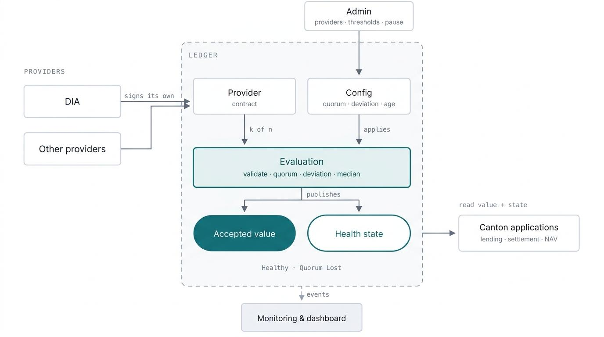
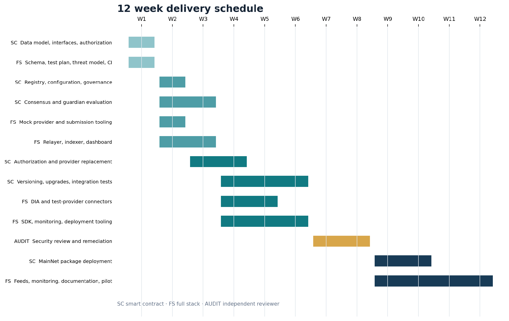

# Canton Multi-Oracle Aggregator

*A provider-neutral oracle resilience layer for Canton Network*

**Organization:** DIA  
**Author / Primary Contact:** Josh Bellerive, DIA Oracles, Josh.Bellerive@diadata.org  
**Status:** Submission ready  
**Created:** 2026-09-27  
**Proposal Type:** RFP-aligned proposal  
**RFP / Roadmap Area:** RFP-13: Payments and DeFi  
**Champion:** Srikanth, BitDynamics, [@srikanth-bitdynamics](https://github.com/srikanth-bitdynamics)  
**Total Funding Request:** Up to 8,400,000 CC 
**Project Duration:** Six months total, including the 12-week engineering delivery and the MainNet adoption evidence period  
**Label:** `financial-workflows-composability`, `rfp-13:payments-defi`

# Abstract

Financial applications on Canton increasingly depend on external market and reference-price inputs. Today, each application must select and integrate an oracle path directly. That makes a single oracle provider or delivery process a persistent operational dependency and forces each application to rebuild the same freshness, divergence, quorum, and provider-health controls.

DIA proposes to build and deploy a Canton-native Multi-Oracle Aggregator, with the grant-funded software released as open source. The aggregator will sit between Canton applications and multiple data or oracle providers, validate submitted observations, enforce configurable freshness and deviation rules, and expose a single accepted value and machine-readable health state. Applications will be able to use either consensus mode, in which a configurable quorum of providers must agree, or guardian mode, in which a preferred value is checked against independent guardian providers.

The result will be reusable public infrastructure for lending, collateral, stablecoins, structured products, settlement, and other price-dependent workflows. The aggregator will reduce single-provider risk, make oracle replacement possible without redesigning consuming applications, support compatible numerical feeds where multiple provider inputs are available, and give Canton developers a standard integration surface rather than a bespoke oracle implementation for every application.

# Objective

The objective is to make multi-provider oracle resilience a standard Canton primitive. The project will deliver an open-source Daml implementation, off-chain ingestion and relaying components, monitoring, reference integrations, deployment tooling, and documentation that any Canton application can use.

The aggregator will:

* prevent a single oracle provider, transporter, or upstream data source from becoming an unrecoverable dependency;  
* provide deterministic acceptance and rejection rules for external values;  
* support provider addition, disabling, and replacement without changing the consumer-facing integration surface;  
* support compatible market and reference-price feeds where multiple provider inputs are available;  
* expose two transparent states: healthy and quorum lost;  
* use standard Canton application-layer authorization and disclosure patterns without claiming additional privacy guarantees for aggregator configuration or outputs;  
* provide reusable interfaces and examples for lending, collateral, tokenized assets, and settlement workflows; and  
* operate as a provider-neutral public good that can ingest compatible inputs from authorized oracle and data providers.

The aggregator will consume the approved Canton/Kaiko Oracle Data Standard interfaces wherever applicable and will not define a competing data publication standard. Provider-specific adapters will map authorized inputs into the aggregator's evaluation layer only where necessary. Admission of a provider to a specific deployment remains governed by that deployment's authorization policy, but use of the software and implementation of supported interfaces will not require permission from DIA.

# Problem

An application that integrates one oracle directly inherits several coupled risks:

1. **Provider failure:** an outage, stale feed, signer failure, or operational incident can prevent new values from being accepted.  
2. **Provider lock-in:** changing the oracle path may require contract changes, governance coordination, application migration, or new integration work.  
3. **Silent divergence:** a value may remain fresh and correctly transported while materially diverging from independent market or fundamental references.  
4. **Duplicated controls:** every Canton application must separately implement freshness checks, deviation bounds, failure behavior, monitoring, and administrative safeguards.  
5. **Inconsistent integration patterns:** even where multiple providers are available, applications lack a shared mechanism for evaluating them and exposing one deterministic result.

These risks are most acute in immutable or difficult-to-upgrade markets, but they also affect institutional workflows that require deterministic, auditable, and governable valuation inputs.

# Proposed Solution

The Canton Multi-Oracle Aggregator will provide a stable contract interface between consuming applications and authorized value providers. It will evaluate candidate observations and publish an accepted value only when the configured policy is satisfied.

The aggregator will consume approved Canton/Kaiko Oracle Data Standard interfaces wherever applicable. Provider-specific adapters will preserve the value source and the authorized proposer or delivery path so deployments can govern where a value originates and who may submit it without changing the consumer-facing interface.

## Relationship to Existing Canton Oracle Infrastructure

The Multi-Oracle Aggregator is designed to compose with, rather than duplicate or compete with, existing Canton oracle and data initiatives:

* **Canton/Kaiko Oracle Data Standard ([#113](https://github.com/canton-foundation/canton-dev-fund/pull/113)):** Defines the provider-agnostic data ontology and publication interfaces, standardizing the structure of on-ledger oracle data. The aggregator will consume these approved interfaces wherever applicable and will not introduce a competing publication standard.
* **RedStone CAPS ([#497](https://github.com/canton-foundation/canton-dev-fund/pull/497)):** Provides privacy, lineage, entitlement, disclosure, and licensing controls for oracle payloads. The aggregator will not recreate the CAPS disclosure graph or licensing layer. Where an authorized CAPS payload is made available to the aggregator, it may be evaluated alongside other compatible authorized inputs under the configured quorum, freshness, deviation, and provider-health policies.
* **DIA and other oracle-provider proposals:** Supply, sign, publish, or transport oracle data. The aggregator does not replace these provider integrations. It provides the downstream policy and evaluation layer that determines whether multiple authorized observations are sufficiently fresh and consistent to produce an accepted value.

These components may therefore be composed as follows:

1. Oracle providers publish data using approved Canton/Kaiko Oracle Data Standard interfaces wherever applicable.
2. RedStone CAPS may provide privacy, lineage, entitlement, disclosure, and licensing controls.
3. The Multi-Oracle Aggregator applies quorum, freshness, deviation, and provider-health policies to the authorized observations it receives.
4. Canton applications consume the resulting accepted value through a consistent interface.

A payload delivered through CAPS that implements the approved Canton/Kaiko Oracle Data Standard can therefore be consumed by the aggregator without redefining either upstream interface.

There are two available configurations: consensus mode and guardian mode. Both are explained in more detail below.

## 1. Consensus mode

Consensus mode has no privileged leader. Valid observations self-reference one another, and a configurable quorum must fall within the maximum deviation threshold. In effect, it operates as a leaderless consensus mechanism.

Configuration will include:

* authorized providers and proposers;  
* required quorum, such as three of five valid providers;  
* maximum age and per-provider freshness limits;  
* maximum deviation between eligible observations;  
* aggregation method, initially median, with bounded mean and latest-valid options where appropriate;  
* minimum and maximum value bounds.

*Figure 1. Consensus mode combines authorized provider observations under a configured quorum and publishes one accepted value together with either a healthy or quorum-lost state.*

## 2. Guardian mode

Guardian mode retains a preferred primary value while checking it against one or more independent guardian values. The primary value is accepted only if it is fresh and within the configured threshold of the required number of guardians.

This mode is useful when an application requires a particular valuation methodology, such as an official fund NAV or redemption value, but wants an independent control against stale, erroneous, or compromised updates.

Configuration will include:

* authorized primary and guardian proposers;  
* required guardian quorum, such as two of three guardians within the configured threshold of the primary value;  
* maximum age of primary and guardian values; and  
* maximum deviation between primary and guardian values.

## 3. Validation and state machine

The aggregator will apply the mode-specific authorization, freshness, value-bound, quorum, and deviation rules described above before an observation becomes eligible. It will then expose one of two states:

* **Healthy:** the applicable quorum, freshness, and deviation requirements are satisfied and a new value is accepted.  
* **Quorum lost:** the applicable consensus or guardian threshold is not satisfied and no new value is accepted.

The aggregator reports its state and does not prescribe the consuming protocol's response. Each application can decide whether to pause, require additional authorization, use a permitted fallback, or take another protocol-specific action when quorum is lost.

## 4. Governance and configuration

The reference implementation will include governed flows to add, disable, and replace providers; update thresholds; pause new acceptance; and rotate authorized proposers. Changes will be recorded as Canton transactions. The implementation will include a configurable time delay and cancellation window for governance changes, and production deployments may place these powers behind a multi-party authorization policy appropriate to the application.

## 5. Monitoring and developer experience

The project will include:

* an event-indexed status service or lightweight dashboard;  
* two on-chain status event types, Healthy and QuorumLost;  
* Daml contracts, schemas, SDK helpers, deployment scripts, and test fixtures;  
* reference configurations for liquid assets, stablecoins, and other supported reference-price feeds;  
* an application integration guide and operator runbook; and  
* examples showing how Canton applications consume the accepted value and respond to the two health states.

# Canton-Native Architectural Alignment

The aggregator will be implemented at the Canton application layer using Daml contracts and standard Ledger API integration patterns. It does not require a change to the Canton protocol, Global Synchronizer, consensus, or wallet layer.

The aggregator will use standard Canton party, authorization, and disclosure patterns appropriate to an application-layer deployment. The project will document which parties can submit observations, change configuration, and consume accepted values. The aggregator does not claim to add privacy guarantees beyond those provided by the selected Canton deployment and contract design.

The design complements, rather than duplicates, provider-specific oracle integrations and emerging Canton data standards. Authorized provider inputs that implement the aggregator interface can be evaluated behind the same policy layer. This gives consuming applications reusable validation, health reporting, and provider replacement without requiring a separate decision engine for each integration.

For CIP-56 assets and FINOS CDM-aligned workflows, the aggregator can supply a reusable control layer for external valuation inputs used in settlement, collateral, margin, liquidation, and reporting processes without requiring changes to those standards.

# Backward Compatibility

The Multi-Oracle Aggregator introduces no change to the Canton protocol, Global Synchronizer, wallet layer, or existing oracle integrations. Applications and oracle providers can continue using their existing interfaces. Adoption is opt-in through a new application-layer integration, and providers can be added, disabled, or replaced behind the aggregator without changing its consumer-facing interface.

# Deliverables

* Architecture and focused threat model covering provider unavailability, stale data, divergence, compromised proposers, governance misuse, incorrect authorization or disclosure configuration, and last-good-value behavior.  
* Open-source Daml packages for provider registry, configuration, observations, consensus and guardian evaluation, accepted values, health states, and governance.  
* Ingestion adapters and conformance guidance for the approved Canton/Kaiko Oracle Data Standard interfaces wherever applicable, with a working DIA connector plus at least two additional provider or deterministic mock-provider paths for testing. No competing data publication standard will be defined.
* Event indexer and health dashboard or equivalent status view.  
* SDK helpers, deployment scripts, test harnesses, reference consumer contracts, and configuration examples.  
* DevNet and TestNet deployments using an operational Canton node.  
* Independent security review and remediation of material findings.  
* MainNet reference deployment with qualifying multi-provider feeds and at least one Canton application integration or formally documented production pilot.  
* Architecture guide, integration documentation, operator runbook, security assumptions, incident response procedure, and maintenance plan.

# Milestones, Acceptance Criteria, and Funding

Funding request: Up to 8,400,000 CC, consisting of 6,400,000 CC for Milestones 1 through 4 and up to 2,000,000 CC in adoption-linked funding for Milestone 5. Milestone 5 is paid incrementally at 200,000 CC per qualifying active MainNet feed, capped at 10 feeds. The maximum request is fixed in CC and does not use a USD peg, TWAP adjustment, or automatic volatility adjustment. Internal USD equivalents may be used for project planning only and will not change milestone payments. Funded engineering delivery is planned for 12 weeks: six weeks of specification, build, and TestNet preparation; two weeks of independent security review and remediation; and four weeks of MainNet deployment and initial adoption. The full grant term is six months from project start. Milestone 5 adoption evidence may be submitted during the remaining grant term so each qualifying feed can complete its required 30-day operating period and committee review.

*Figure 2. Week-by-week delivery plan showing the smart-contract, full-stack, and independent-review workstreams.*

| Milestone | Timing | Deliverables | Objective acceptance criteria | Funding |
| :---- | :---- | :---- | :---- | :---- |
| 1. Specification and Canton architecture | Week 1 | Technical specification, Daml data model, authorization and disclosure model, focused threat model, Canton/Kaiko Oracle Data Standard integration plan, RedStone CAPS composition plan, test plan, and operating responsibility matrix | Public specification repository; aggregator interfaces and state transitions documented; authorization roles and operational assumptions documented; Daml prototype compiles; committee/champion review comments addressed | 850,000 CC |
| 2. Functional DevNet prototype | Weeks 2-3 | Provider registry, observation contracts, freshness/deviation validation, consensus mode, guardian mode, governance flows, Healthy and QuorumLost status events, and reference consumer | Reproducible DevNet deployment; transaction evidence for healthy and quorum-lost states; two-of-three consensus demonstration; primary-plus-two-guardian demonstration; negative tests reject unauthorized, stale, out-of-bounds, and divergent observations | 1,700,000 CC |
| 3. Complete TestNet implementation | Weeks 4-6, followed by a 14-day evidence run that may overlap the security-review window | Production-oriented ingestion service; DIA connector; at least two additional provider or deterministic mock-provider connectors; monitoring/indexer; SDK helpers; deployment tooling; configurable authorization; node operations | At least 14 consecutive days of TestNet operation; at least 10 live or representative feed configurations using DIA inputs, matching third-party live inputs where available, and deterministic mock-provider inputs for coverage gaps; three provider paths; at least 5,000 aggregator transactions, defined as provider observations plus aggregator evaluations; documented provider disable and replacement without changing the consumer interface; dashboard reports provider health and aggregator state; integration tests and CI published | 2,550,000 CC |
| 4. Security, reliability, and release candidate | Weeks 7-8 | Independent security review, remediation, load and failure testing, operator runbook, incident response, integration guide, reference configurations, and release candidate | Audit report delivered to the committee and publishable summary released; all critical/high findings remediated; fault tests demonstrate healthy and quorum-lost status handling, relayer interruption, governance time-delay enforcement, cancellation, and recovery behavior; release candidate tagged under the stated open-source license | 1,300,000 CC |
| 5. MainNet deployment and feed adoption | Begins after Milestone 4 acceptance; adoption evidence accepted through the end of the six-month grant term | Canton MainNet reference deployment, active multi-provider feed configurations, public monitoring, final documentation, maintenance handoff, and application integration support | Up to 10 qualifying MainNet feed configurations accepted individually. Each qualifying feed must satisfy the MainNet Feed Adoption Requirements below and receive final committee acceptance. | Up to 2,000,000 CC, paid at 200,000 CC per qualifying active MainNet feed, capped at 10 feeds |

## Milestone 5 MainNet Feed Adoption Requirements

Milestone 5 links funding directly to demonstrated use of the open-source Multi-Oracle Aggregator on Canton MainNet. DIA may earn 200,000 CC for each qualifying active MainNet feed configuration accepted by the Tech & Ops Committee, up to a maximum of 10 feeds and 2,000,000 CC.

A qualifying MainNet feed must:

* be deployed through the Multi-Oracle Aggregator on Canton MainNet;  
* operate in Consensus mode or Guardian mode using at least two live, authorized oracle-provider paths;  
* use production data inputs rather than deterministic mock providers;  
* operate continuously for at least 30 consecutive days;  
* record at least 1,000 feed-specific aggregator transactions during that period, defined as provider observations plus aggregator evaluations;  
* expose public deployment identifiers and sufficient monitoring evidence to verify its operation and Healthy or QuorumLost status;  
* be included in a production application integration or a documented pilot with a named Canton ecosystem participant; and  
* receive individual acceptance from the Tech & Ops Committee.

Multiple qualifying feeds may be used by the same application or ecosystem participant, provided that each feed represents a distinct asset, rate, index, or other independently configured data product and separately satisfies all acceptance requirements.

A feed does not qualify solely because it has been configured or deployed. It must demonstrate active multi-provider operation, verifiable MainNet activity, and use by a named application or pilot. Mock-provider activity, TestNet activity, inactive configurations, and configurations using only one live provider do not qualify for Milestone 5 funding.

Payments may be accepted and released incrementally as individual feeds satisfy these requirements. Unearned amounts remaining after the Milestone 5 acceptance period will not be payable and will return to the Development Fund allocation.

## Funding breakdown

| Funding component | Amount |
| :---- | :---- |
| Milestones 1-4: specification, implementation, testing, security review, and release | 6,400,000 CC |
| Milestone 5: qualifying MainNet feed adoption | Up to 2,000,000 CC (200,000 CC per qualifying feed) |
| Maximum funding request | 8,400,000 CC |

Milestone 4 includes an estimated 550,000 CC for the independent security review and remediation. The reviewer and final scope will be selected in consultation with the Canton team. If the accepted quote exceeds that estimate, the audit scope or allocations within Milestones 1 through 4 will be adjusted to remain within the approved 6,400,000 CC core-delivery amount unless the committee separately approves an amendment.

## Volatility Stipulation

The approved project duration is six months and milestone payments are fixed in Canton Coin. If Committee-requested scope changes extend the project beyond six months, any remaining milestones will be renegotiated to account for significant USD/CC price volatility before the extended work proceeds.

No portion of the grant is intended to subsidize a proprietary DIA-only aggregator. The funded aggregator contracts, provider interfaces, tests, deployment tooling, and documentation will remain usable by other oracle and data providers.

# Ecosystem Value and Measures of Success

The project will create ecosystem value in four ways:

* **Security and resilience:** applications gain explicit quorum, freshness, deviation, and provider-health controls rather than depending on a single feed path.  
* **Lower integration cost:** builders integrate one stable interface and reuse audited validation behavior across assets and applications.  
* **Provider flexibility:** providers can be added, disabled, or replaced behind the aggregator, reducing switching costs and allowing applications to update their oracle configuration without changing the consumer-facing interface.  
* **Reusable controls:** Canton applications can reuse the same health states, monitoring events, and validation logic across supported feeds rather than rebuilding these controls independently.

Primary success metrics are:

* up to 10 qualifying active MainNet feed configurations, each using at least two live authorized oracle-provider paths;  
* at least 30 consecutive days of verifiable operation for each accepted feed;  
* at least 1,000 feed-specific aggregator transactions for each accepted feed, defined as provider observations plus aggregator evaluations;  
* production integration or documented pilot use by at least one named Canton ecosystem participant;  
* individual Tech & Ops Committee acceptance for each feed receiving adoption-linked funding;  
* a demonstrated provider replacement without a consumer-interface migration;  
* at least three distinct input paths in testing, including DIA and two independent provider or test paths;  
* public documentation, monitoring evidence, and reproducible deployment tooling; and  
* no unresolved critical or high-severity audit findings at release.

# Differentiation and Cost Efficiency

Current Canton data proposals establish important building blocks, including common publication interfaces, reference-data standards, publisher toolkits, external-data access patterns, and use-case-specific attestations. These components improve how individual data points are brought on-ledger and consumed, but they do not provide a shared runtime policy for evaluating multiple oracle inputs and determining whether an application should accept, reject, or temporarily retain a value.

The Multi-Oracle Aggregator fills that gap. It is an application-layer decision and resilience component that can sit above compatible provider feeds and data standards. Instead of requiring every lending market, collateral workflow, or financial application to implement its own quorum, freshness, deviation, provider-health, and status logic, Canton developers can integrate one reusable control layer.

The proposal requests 6,400,000 CC for the specification, implementation, testing, security review, and MainNet release of the open-source Multi-Oracle Aggregator. Up to an additional 2,000,000 CC is earned only through verified MainNet adoption, paid at 200,000 CC per qualifying multi-provider feed. This structure aligns a meaningful portion of funding with measurable ecosystem use rather than software delivery alone.

Because the Aggregator is provider-neutral and released as open-source infrastructure, qualifying feeds may combine DIA with any compatible oracle provider. The adoption milestone therefore rewards the expansion of reusable multi-provider oracle infrastructure on Canton rather than exclusive use of DIA data.

The proposal should not be evaluated as a substitute for all provider-specific oracle work. Its value is that every existing and future provider integration becomes safer and easier to consume through a common Canton-native control layer.

# Sustainability and Operations

After the grant period:

* DIA will maintain the open-source aggregator, provider interfaces, DIA ingestion path, documentation, and monitoring components;  
* an operational Canton node will host the reference deployment under separately documented operating terms;  
* application teams will be able to deploy and govern their own aggregator instances without using DIA as a provider;  
* new transporter and source connectors can be contributed through the public repository; and  
* upgrades will follow semantic versioning, migration notes, CI testing, and a disclosed vulnerability process.

The project will publish a maintenance policy before MainNet launch. Access to the open-source software will not require a recurring fee. Any costs associated with third-party oracle or data sources configured as inputs to the contract, including live data access, managed hosting, or application-specific SLAs, will be separate and disclosed clearly to integrators.

# Security and Risk Management

The threat model and tests will cover:

* compromised or unauthorized proposers;  
* stale, replayed, malformed, and future-dated observations;  
* excessive divergence and ambiguous quorums;  
* last-good-value misuse after the staleness window;  
* unauthorized or unsafe governance changes, including enforcement of the configured time delay and cancellation window;  
* node, relayer, and indexer outages;  
* incorrect authorization or disclosure configuration; and  
* denial-of-service and update-frequency cost risks.

Production documentation will define the aggregator's operational assumptions and explain how applications should configure thresholds and respond to healthy and quorum-lost states.

# Open Source and Intellectual Property

All Daml contracts, provider interfaces, indexer components, SDK helpers, deployment scripts, tests, and documentation funded by this grant will be released under Apache License 2.0 in a public repository owned by DIA's diadata-org GitHub organization. The repository will include build instructions, contribution guidance, provider integration documentation, and conformance tests. The grant will not require Canton applications to purchase DIA data, use DIA as an oracle provider, or seek DIA's permission to implement the provider interface.

Third-party libraries and connectors will retain their applicable licenses. Any component that cannot be open-sourced because of upstream licensing will be excluded from the grant acceptance criteria or replaced with a documented open interface and test implementation.

# Dependencies

* Canton DevNet, TestNet, and MainNet access appropriate to each milestone.  
* Super Validator sponsorship for MainNet onboarding.  
* Global Synchronizer Foundation Tokenomics Committee approval, assumed to require approximately two weeks.  
* IP allowlisting for DevNet, TestNet, and MainNet separately, with an expected turnaround of two to seven days per environment.  
* Availability of Daml and Canton SDK capabilities needed for the selected authorization and disclosure design.  
* Availability of one or more named Canton ecosystem participants for production integrations or documented pilots. The same participant may support multiple qualifying feeds, provided each feed independently satisfies the Milestone 5 acceptance requirements.  
* Independent security reviewer availability.  
* Permission or publicly documented interfaces for any named third-party provider connector.

No change to the Canton protocol or Global Synchronizer is required.

# Co-Marketing and Ecosystem Adoption

Subject to Foundation and partner approval, DIA and Bit Dynamics will support:

* a technical launch article explaining the aggregator's trust model and Canton architecture;  
* a public integration workshop or developer session;  
* reference use cases for lending, collateral, tokenized funds, stablecoins, and structured products; and  
* direct onboarding support for the first Canton application integration.

# Team Capability

DIA has operated open-source oracle infrastructure since 2018 and price feeds since 2020. DIA supports more than 60 blockchain networks and has experience delivering transparent, customizable market and fundamental valuation feeds, including crypto prices, NAV, reserves, redemption values, exchange rates, Proof of Reserve, and verifiable randomness. For this Canton deployment, DIA's role will focus on direct data sourcing, configurable computation, transparent methodologies, and native delivery to the aggregator.

The DIA team involved in the integration will include:

* [Dillon Hanson](https://www.linkedin.com/in/dillonhanson), Chief Executive Officer;
* Samuel Brack, Co-founder and Chief Technology Officer;
* [Philipp Pade](https://de.linkedin.com/in/jan-philipp-pade), Lead Integrations Developer;
* [Nitin Gurbani](https://in.linkedin.com/in/nitin-gurbani-098229228), Senior Developer;
* [Zygis Marazas](https://lt.linkedin.com/in/zygimantas-marazas), Product Lead;
* [David D'Amario](https://ca.linkedin.com/in/david-d-amario-44838b1ab), Quality Assurance Lead;
* Arounen, Technical Product Manager; and
* [Joshua Bellerive](https://ca.linkedin.com/in/josh-bellerive-60585537b), Business Development Manager.

Bit Dynamics will serve as the proposal Champion and provide Canton ecosystem guidance and review support.

# Important Links

* **DIA Website:** [https://www.diadata.org/](https://www.diadata.org/)

* **DIA Documentation:** [https://docs.diadata.org/](https://docs.diadata.org/)

* **DIA GitHub Organization:** [https://github.com/diadata-org](https://github.com/diadata-org)

* **DIA Ecosystem and Integrations:** [https://www.diadata.org/ecosystem/](https://www.diadata.org/ecosystem/) 

* **Multi-Oracle Aggregator Specifications:** [Google Doc](https://docs.google.com/document/d/17keFpy18_ARV5L14Akqsv34dPXQhQxhLPBxeU1wnyHY/edit?usp=sharing)

* **Champion:** Bit Dynamics ([https://www.bitdynamics.cc/](https://www.bitdynamics.cc/))
