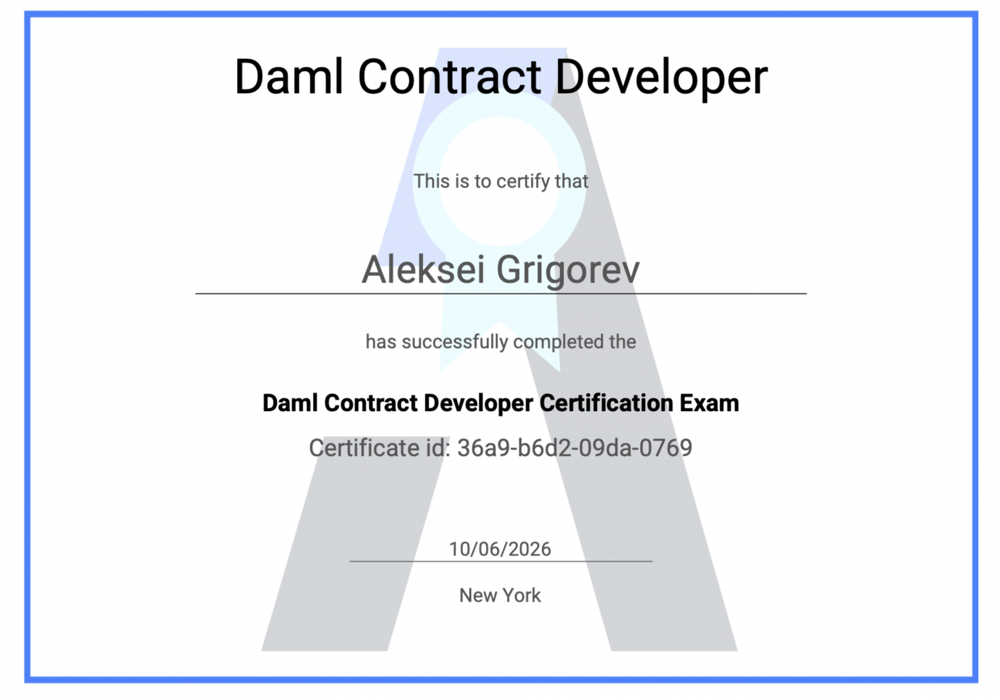

# Canton DEX Aggregation SDK – Development Fund Proposal

**Organization:** Rubic  
**Author / Primary Contact:** Victor Dymov  
**Status:** Submitted  
**Created:** 2026-09-25  
**Proposal Type:** Individual Initiative  
**RFP / Roadmap Area:** N/A  
**Champion:** Needs Champion  
**Total Funding Request:** 2,700,000 CC  
**Project Duration:** approx. 17 months (23 weeks of development, followed by a 12-month maintenance and adoption period)  
**Label:** daml-tooling

---

## **Abstract**

The Canton DEX Aggregation SDK is an open-source routing layer for Canton Network. It computes the optimal swap path between any two tokens inside Canton, aggregating liquidity across the network's DEXs through a shared adapter layer, and returns quotes together with a ready-to-sign execution plan.

The SDK serves two sides of the ecosystem. Bridges, wallets and dApps embed it as their "last mile" – the step that converts a bridged asset into whatever token the user actually wants. DEX teams integrate by submitting an adapter through a pull request, after which their liquidity becomes routable by every consumer of the SDK without any further coordination.

Every component is open source: the routing engine, the DEX adapter framework, the consumer SDK, the Canton access and metadata layer, the reference adapters, and the Daml execution layer built on the Canton Token Standard. There is no closed backend and no hosted service operated by the implementing team, and no grant-funded component contains a fee mechanism. Consumers run the SDK within their own infrastructure.

The entire repository is released under the Apache License 2.0.

---

## **Objective**

Build an open, community-extensible routing layer for intra-Canton token swaps that any bridge, wallet or dApp can embed as its last mile, and that any Canton DEX can join by contributing an adapter.

---

## **1\. Problem**

### **1.1 The last-mile gap**

The demand pattern is consistent: a user holds a token on some external chain and wants a specific token on Canton. In practice this resolves into three steps.

1. Swap the source token into a stablecoin – in most cases USDC – on the donor chain.  
2. Bridge that stablecoin into Canton through one of the available bridges (Circle xReserve, Utexo, HIFI, and others).  
3. Swap the bridged stablecoin into the target token inside Canton.

Steps 1 and 2 are solved. Step 1 is served by mature aggregation infrastructure on every EVM chain. Step 2 has several working implementations with more in progress. Step 3 has no shared solution, and it is the step that determines whether a user ends up holding the asset they came for or a stablecoin balance they now have to move themselves.

### **1.2 The N×M integration burden**

Liquidity inside Canton is distributed across several independent DEXs – OneSwap, Cantex, CantonSwap, TradeCraft, and others. There is no router in front of them.

The consequence is that every bridge, wallet and dApp that wants to deliver a target token has to integrate every DEX independently. Each integration is a separate quote format, a separate pool discovery mechanism, and separate command construction. With N consumers and M venues, the ecosystem pays N×M integration cost, and every new DEX has to negotiate its way into every existing consumer one at a time.

The cost here is structural rather than a matter of current headcount: each new bridge multiplies the cost of each new venue and vice versa, so the burden compounds precisely as the ecosystem starts growing. Shared routing infrastructure is cheap to build before that multiplication and expensive to retrofit after it. Building it while the venue count is still small is the cheaper ordering, not a reason to defer.

### **1.3 No standard for DEX discovery**

There is currently no defined way for a Canton DEX to declare itself to a router: no common interface for exposing pools, quoting a pair, or producing execution commands. Every routing implementation therefore encodes its own assumptions about each venue, and every venue has to be onboarded manually into every implementation. A shared adapter contract turns a bilateral negotiation into a pull request.

### **1.4 Canton-specific constraints**

Canton makes this last-mile problem materially different from an EVM-only aggregator. The SDK treats the following characteristics as design constraints rather than gaps to bypass:

* **Private user state.** Holdings and user-visible contract state are read from infrastructure authorized for the relevant party; they are not universally queryable through a global public RPC.  
* **Indirect registry discovery.** Canton Token Standard assets are identified by InstrumentId. Registry endpoints are discovered from metadata associated with the instrument admin party, including CNS/Scan-based registry URL discovery, then queried through standardized off-ledger APIs.  
* **Fixed Token Standard precision.** Standard token amounts use Daml Decimal; applications can assume ten fractional decimal places rather than resolving a token-specific decimals value.  
* **Authorization is token- and workflow-specific.** Canton Coin TransferPreapproval is one important mechanism, but it must not be treated as a universal authorization primitive for every Canton asset.  
* **Wallet/provider abstraction.** For end-user integrations, CIP-0103 provides a vendor-neutral provider interface that separates dApps from key management and network connectivity. Direct Ledger API access remains a valid lower-level option for controlled server-side deployments.

No team building a Canton consumer application should need to independently re-learn and re-implement these details merely to route a swap.

### **1.5 Net effect**

Routing is reinvented by each participant, DEX liquidity stays siloed, and the practical difficulty of the last mile suppresses the inflow of assets and users into Canton.

---

## **2\. Solution Overview**

### **2.1 Consumer API**

The SDK exposes a small, structured surface rather than a single positional function that will become brittle as routing options grow. The conceptual primary entry point is:

`quote(request) -> RouteQuote[]`

The request identifies the input and output InstrumentId, amount, slippage constraints and optional routing preferences. The context supplies the Canton provider or server-side access implementation required for user-specific state.

A returned RouteQuote includes expected and minimum output, venue hops, fees known at quote time, validity deadline, execution mode (atomic or staged), required authorizers and warnings. The SDK additionally exposes route refresh, execution-plan construction and supported-venue/capability discovery.

Expected error categories include unsupported asset or pair, no route, stale quote, insufficient visible balance, authorization required, venue unavailable, incompatible execution capabilities, metadata/registry resolution failure and execution no longer satisfying the requested minimum output.

The SDK holds no private keys and does not sign or submit transactions. Wallet-based applications can hand the resulting plan to a CIP-0103-compatible provider. Custodial applications may execute the same plan through their own authorized Ledger API integration.

### **2.2 DEX adapter model**

DEX integration follows a contributor model rather than a partnership model. A DEX team implements a standard adapter interface against its own protocol, opens a pull request against the public repository, and once merged and released, its liquidity becomes routable by every consumer of the SDK through a normal package update, with no bespoke integration work on their side.

The adapter registry therefore grows through community contribution. Reference adapters shipped with the grant serve as working examples of the interface.

### **2.3 Open-source scope and licensing**

The following components are delivered as open source, in a public repository, with documentation and tests:

* Routing engine  
* DEX adapter framework and interface definition  
* Adapter registry  
* Consumer SDK and API layer  
* Metadata and pool reading layer  
* Canton access layer  
* Daml execution layer built on the Canton Token Standard  
* Reference adapters for existing Canton DEXs  
* Contributor documentation and CI for externally submitted adapters

No delivered component requires a hosted service operated by the implementing team, and no grant-funded layer contains a fee-collection mechanism. An adapter may legitimately call a venue-operated public or authenticated service if that venue's own architecture requires it; such dependencies are declared explicitly in the adapter manifest.

### **2.4 Non-goals**

This grant funds the open routing layer for intra-Canton swaps and nothing beyond it. The following are deliberately outside its scope.

**Cross-chain transport.** Bridging into and out of Canton is served by existing infrastructure – Circle xReserve, Utexo, HIFI and others. The SDK consumes that infrastructure rather than duplicating it. Consumers combine the routing layer with a bridge of their choice to deliver a complete any-to-any flow, and the Rubic team will build its own full cross-chain implementation on top of this layer. That implementation is separately funded, is not a deliverable of this grant, and confers no privileged access: it consumes the same open interfaces, on the same terms, as any other integrator.

**Liquidity provision.** No pools are deployed or operated. The routing layer holds no liquidity of its own and every swap it constructs executes against a Canton-native venue.

**Custody and signing.** The SDK never holds keys, never signs and never submits. It returns an unsigned execution plan; signing and submission remain entirely with the client.

**A user-facing front end.** No consumer product is part of this grant. The deliverable is infrastructure that other teams embed.

The scope is narrower than a general cross-chain aggregation build by design. The last mile inside Canton is the part that is missing, the part every participant needs, and the part that is correctly delivered as a public good.

---

## **3\. Technical Architecture**

The SDK separates route discovery from execution. DEX adapters normalize venue-specific liquidity and execution models, the Core Router compares compatible paths, the Canton access layer resolves public registry data and authorized private state, and the payload layer turns an accepted route into an explicit execution plan. Token Standard primitives are reused wherever possible; custom Daml is kept minimal and justified by architecture review.

### **3.1 Core Router**

The Core Router operates on a directed graph in which tokens are nodes and executable swaps exposed by DEX adapters are edges. Each adapter supplies normalized quotes together with validity information, execution requirements and capability metadata. The router searches this graph for direct and bounded multi-hop paths and ranks eligible routes primarily by final amount received after venue fees and other costs that can be determined before execution.

Routing is capability-aware. Each edge records whether the venue can participate in an atomic Canton transaction or requires staged/asynchronous execution. The router does not combine incompatible venue models into a route that is described as atomic. Initial releases deliberately bound the maximum number of hops to keep quote latency, command complexity and execution risk predictable.

Every returned route carries a validity window, expected output and minimum acceptable output. Before execution construction, time-sensitive venue data is revalidated when required. If a quote has expired or the expected result no longer satisfies the caller's slippage tolerance, the SDK returns a stale-quote/requote result rather than silently producing commands against obsolete assumptions.

The initial grant scope is single-path route selection. Split routing across multiple parallel venues can be introduced later without changing the adapter abstraction.

### **3.2 DEX Adapter interface**

A venue becomes routable by implementing the standard adapter contract. The minimal interface covers three responsibilities: discovering routable markets or swap directions, obtaining a quote for a requested swap, and constructing venue-specific execution data for an accepted quote.

Every adapter also declares its capabilities: supported Token Standard versions, exact-input or exact-output quoting where applicable, atomic versus staged execution, asynchronous deposit/intent requirements, external API requirements, supported network environments, and any venue-specific prerequisites. This prevents the router from constructing a graph path that looks economically attractive but cannot actually be executed under one coherent authorization model.

Adapters never receive private keys. They may access public venue endpoints or venue-operated services when required by the DEX architecture, but signing stays outside the adapter. The interface is intentionally narrower than a venue's complete SDK: it standardizes only discovery, comparison and execution construction required by aggregation.

### **3.3 Adapter Registry**

Accepted adapters are maintained in a versioned registry distributed with the SDK. Each registry entry identifies the venue, adapter version, interface version, supported environments and declared execution capabilities.

A DEX team can add support by implementing the interface, supplying the required tests and documentation, and opening a pull request. Once the contribution passes CI and maintainer review, it is included in a subsequent SDK release. Existing consumers do not need to design another bespoke venue integration; they obtain the adapter through the normal package-update process.

Adapter interface changes follow semantic versioning. Backward-compatible additions are preferred. Breaking revisions require migration documentation and a major-version boundary. The registry does not act as a remote executable plugin marketplace; consumers remain in control of the code version they deploy.

### **3.4 Metadata and token resolution**

Canton Token Standard assets are identified canonically by InstrumentId, including the token admin party. Public token information is resolved through Token Standard registry discovery rather than an ERC-20-style contract call.

For a registry that is not already configured or cached, the SDK uses the instrument admin party to discover registry URL metadata through the party's CNS entry as exposed by Scan, then calls the registry's standardized off-ledger APIs. The access layer obtains public information such as symbol/name and registry-specific context needed to construct standard operations. Token identity always remains the canonical InstrumentId; symbols are display data only.

Standard Token amounts use Daml Decimal and therefore have ten fractional decimal places. The SDK does not maintain an ERC-20-style per-token decimals resolver.

Resolved public metadata is cached with bounded validity. If CNS/Scan discovery or the registry endpoint is unavailable and the required information is not present in a valid cache, routes depending on that asset are reported as temporarily unavailable. The SDK does not guess metadata or silently substitute a registry. Consumers may configure explicit trusted registry endpoints as an operational fallback.

### **3.5 Canton access layer**

Canton does not expose all user state through a universal public RPC. Public network and registry information can be obtained through Scan and Token Standard off-ledger APIs, while a user's private holdings and user-visible contracts are read from infrastructure authorized for that party.

The SDK therefore exposes a connection/provider abstraction rather than hard-coding a shared backend credential. The preferred end-user integration follows CIP-0103, which lets a wallet/provider supply account, network, ledger and execution capabilities without giving the SDK custody of keys. Server-side applications may instead configure direct Ledger API access and credentials for parties they control.

The SDK only requests state needed to quote or construct a route and does not centralize user balances.

Receiver authorization is handled according to the relevant token implementation and Token Standard workflow. A Canton Coin TransferPreapproval can enable preapproved incoming CC transfers and may be discoverable through Canton Coin-specific network context, but the SDK does not assume that every Canton asset uses the same mechanism. If required receiver authorization cannot be established during construction, the route is marked as requiring additional authorization or staged execution rather than being presented as immediately executable.

### **3.6 Daml execution layer**

The execution layer uses the Canton Token Standard as its settlement foundation. Token Standard V2 (CIP-0112) introduces committed allocations and atomic batch-settlement primitives intended for trading and settlement workflows. The project therefore avoids creating a parallel token custody or generic settlement protocol merely to aggregate venues.

For route legs whose venue contracts expose compatible settlement primitives, the execution layer constructs an all-or-nothing plan with route-level protections such as expected instruments, minimum output, deadline and permitted venue calls. Atomic execution means all compatible legs settle together or the transaction fails; an intermediate asset is not intentionally left with the user because a later hop failed.

Not every venue can necessarily participate in the same atomic transaction. Intent-based, deposit-driven or operator-mediated flows may require staged execution. Those venues remain routable, but their adapters declare the staged model and the returned ExecutionPlan makes the boundaries explicit.

Milestone 1 includes an Architecture Decision Record determining whether any custom Daml coordination contract is still required after accounting for Token Standard V2. If standard allocations and settlement primitives are sufficient, the project prefers a reference integration over deploying redundant stateful contracts. If a custom component remains necessary, it is deliberately thin and uses standard token interfaces underneath.

### **3.7 Payload construction and execution model**

After a route is selected, the SDK returns an ExecutionPlan rather than signing or submitting anything itself. The plan contains the chosen route, quote validity, slippage protections, commands or provider requests required for each step, required authorizers, and whether execution is atomic or staged.

For wallet-integrated applications, the plan is designed to map cleanly onto a CIP-0103 provider flow. The wallet/provider remains responsible for presenting the action, obtaining authorization, signing and submitting. A custodial/server-side consumer may perform the corresponding operations through its own authorized Ledger API integration.

Some flows may require more than one authorization transaction. For example, a committed allocation may need to be authorized before an executor can settle it. In those cases the SDK returns an ordered plan with explicit dependencies rather than hiding multiple user actions behind the label of a single transaction.

### **3.8 Testing, CI and adapter validation**

Every externally contributed adapter must pass the same conformance suite as the reference adapters before it can enter the registry. The suite validates quote normalization, token and amount handling, capability declarations, expiry/stale-quote behavior, unsupported-market handling, deterministic execution construction where applicable, and expected failure behavior when a venue endpoint is unavailable.

A contributor PR must include the adapter implementation, capability manifest, unit tests, representative quote/execution fixtures, integration instructions, and a description of any external services or credentials required by the venue. Where a public development/test environment exists, CI also runs integration or smoke tests against that environment. Mainnet-only integrations require a documented reproducible validation procedure.

Execution tests verify that adapter output cannot silently substitute instruments, recipients or amounts outside the accepted route and that minimum-output and deadline protections survive plan construction. Security-sensitive changes to Daml execution or authorization logic require second-maintainer review in addition to passing CI.

### **3.9 Security considerations**

The main risks are stale or manipulated quotes, malicious or compromised adapter code, incorrect instrument/party substitution, inadequate slippage protection, credential leakage, partial execution of non-atomic routes, and authorization errors in custom Daml or provider integration.

Adapters are reviewed source code distributed with the SDK rather than arbitrary runtime plugins. Execution plans bind instruments, parties, amounts, minimum output and deadlines. The API distinguishes atomic and staged execution explicitly, stores no private keys, and documents all venue-side service dependencies.

As part of delivery, the team will prepare and publish a contribution review policy for the repository, defining how external pull requests are reviewed and approved before merge: the number and independence of required approvals, verification that an adapter is submitted with the authorisation of the venue it represents, review of declared endpoints and third-party dependencies, and the procedure for disabling an adapter found to behave incorrectly or maliciously. The policy is designed to ensure that no unreviewed or malicious code can enter the SDK through community contributions.

An independent security review is included before production release of any custom security-sensitive Daml execution component. If Milestone 1 concludes that no custom stateful Daml contract is required, the same budget is redirected to independent review of command construction, Token Standard settlement integration and authorization assumptions rather than creating a contract solely to satisfy an audit line item.

---

## **4\. Ecosystem Alignment**

**Public infrastructure, not a product surface.** This grant funds infrastructure that the ecosystem owns rather than a capability that one company operates. The grant-funded layer contains no fee mechanism, no hosted dependency and no privileged consumer. That property is structural rather than a stated intention – with the full stack open and self-hostable, there is no layer at which preferential access could be introduced.

**Community-extensible by design.** DEXs participate as contributors rather than as integration targets. A venue that opens an adapter PR gains distribution to every consumer at once, and the routing surface expands without the maintainer being a gatekeeper on liquidity. The value of the SDK to the ecosystem grows with contributions that we do not have to make ourselves.

**Canton-native execution.** Settlement builds on the Canton Token Standard rather than a parallel custody or settlement protocol, and any custom Daml is kept deliberately thin on top of standard token interfaces. User state is accessed through the wallet/provider abstraction defined in CIP-0103, or through direct Ledger API access for server-side deployments – always via infrastructure authorised for the relevant party. Centralised balance indexing and proxy-node patterns would violate Canton's privacy model and are explicitly not used.

**Volume accrues to Canton-native venues.** The SDK holds no liquidity of its own. Every swap it routes executes against a Canton-native DEX, so improved routing translates directly into increased utilisation of the existing venues rather than diverting flow away from them.

**Lower barrier to building on Canton.** The constraints described in §1.4 – private user state, indirect registry discovery, token-specific authorization and wallet/provider integration – are currently re-learned and re-implemented by every team. The SDK encapsulates them behind one interface, which turns a multi-week Canton-specific engineering effort into a dependency.

**CIP-0082 alignment.** The Development Fund exists to support developer tools and shared infrastructure that benefit the broader Canton ecosystem. A fully open routing layer – embeddable by any consumer, extensible by any venue, routing all volume to Canton-native protocols, and handling Canton's privacy and authorisation constraints correctly – is shared infrastructure in the same sense that bridges and DEX contracts are. It removes the requirement for every team building on Canton to independently implement and maintain the same routing, venue aggregation and command-construction logic.

**Backward compatibility.** No backward compatibility impact. The SDK is a new, additive library: it does not modify existing Canton components, token standards, venue contracts or integrations, and consumers adopt it at their own discretion.

---

## **5\. Why This Team**

### **5.1 Relevant delivery record**

We have built and operated this class of routing system in production, in closed form, across EVM and non-EVM chains. That includes a Stellar Community Fund grant (SCF \#38) for a directly comparable build on a non-EVM L1: a dedicated aggregator connecting Stellar DEXs and bridges, multi-hop any-to-any routing via custom Soroban smart contracts, and on-chain contracts for execution.

The relevance is not the count of chains supported. It is that we already know where this class of system breaks – quote staleness between routing and execution, partial fills across hops, adapters silently drifting when a venue changes its API, and venues whose execution models cannot be combined in a single transaction. Those failure modes are the reason a naive open-source router is easy to publish and hard to keep working. This grant funds moving knowledge that currently exists inside a closed product into public, maintained code.

### **5.2 Management team**

**Vladimir Tikhomirov – Founder.** A highly experienced and visionary founder, with a PhD in Computer Science and a track record as a software industry executive with over 10 years of experience. He founded the smart contract platform MyWish.io, Tonco, MAIN and Algebra, a concentrated liquidity protocol with TVL of more than \$200M used by 44 DEXs. 9+ years in Web3.

**Alexandra Korneva – Co-Founder.** 10+ years of experience leading marketing and communication companies, 9+ years in Web3.

**Eugene Korol – CEO.** Extensive project management experience in blockchain and smart contract development, through his tenure at Rock'n'Block from 2017, then as PM at MyWish, and subsequently as CEO.

**Elena Nova – CMO.** 15+ years of experience in marketing management, ranging from fintech (Visa) to FMCG in global blue-chip companies.

**Victor Dymov – Product & Growth Lead.** Working in DeFi since 2018, combining product management and growth marketing with a focus on development and go-to-market strategy.

### **5.3 Core technical team**

**Dmitrii Sleta – Lead Software Engineer.** 8+ years of experience (5 in crypto/Web3). Full-stack JavaScript/TypeScript specialist with deep expertise in Angular, React and Nest. Focused on cross-chain and on-chain infrastructure, including DEX/bridge aggregation and protocol integrations.

**Stanislav Ilyutkin – Backend Engineer.** 5 years of experience (4 in crypto). Builds and maintains server applications in Python (Django, FastAPI). Handles infrastructure, CI/CD pipelines and monitoring systems.

**Georgy Eliseev – Tech Lead & Smart Contract Developer.** 5 years of experience. Works across Solidity, Go and TypeScript. Covers the full cycle from smart contract architecture to DevOps and deployment infrastructure.

**Sergei Udalov – QA Engineer.** 19 years in IT (in crypto/Web3 since 2013). Covers manual and automated testing for DEX aggregators and Web3 wallets. Toolchain includes Python, Playwright, Selenium and blockchain-specific tooling (Tenderly, tx explorers). Hands-on Solidity experience and deep understanding of on-chain mechanics.

**Aleksei Grigorev – Blockchain Lead Engineer.** 5+ years of dedicated service at the company. Specialises in designing secure and scalable decentralised architectures, developing smart contracts across Solidity, Rust and Move. Certified Daml developer. Recent work includes a gas station for Mezo (https://github.com/Rock-n-Block/mezo-contracts) and a bridge for Stellar (https://github.com/Rock-n-Block/stellar-contracts).

---

## **6\. Maintenance and Sustainability**

The maintenance question for publicly funded infrastructure is usually a question of motive: who keeps the code working once the final payment clears. Open-source deliverables tend to fail not at delivery but twelve months later, when a venue changes its interface and there is no longer anyone with a reason to fix the adapter.

**Maintenance is a dependency, not only a promise.** The Rubic team will operate a full cross-chain implementation built on top of this routing layer, and that product depends on the layer continuing to function – on reference adapters staying current, on the router accommodating new venues, and on the Canton access layer tracking protocol changes. The incentive to keep the open layer healthy is therefore structural and extends beyond the funded maintenance period rather than ending with it.

**Adapter drift.** When a venue changes its interface and an adapter breaks, the conformance test suite (§3.8) surfaces the failure in CI rather than in production. Responsibility for a fix sits with the maintainer team by default, and with the venue where the venue maintains its own adapter.

**Maintenance commitment.** The team commits to 12 months of active maintenance following Milestone 4 delivery, funded as Milestone 5: reviewing community pull requests, addressing reported defects, keeping reference adapters current, and maintaining compatibility with Canton Token Standard updates.

**Repository governance.** At launch, merge rights are held by the implementing team's core maintainers, with security-sensitive changes requiring review by two maintainers. Contributors from other teams who sustain a record of accepted adapter contributions can be invited as maintainers, with the aim of moving toward a multi-party maintainer group that includes venue and consumer teams.

**Contributor independence.** The adapter interface and contributor documentation are designed so that a venue can realistically own and maintain its own adapter rather than depending on the original team. The measure of success here is the proportion of adapters maintained by the venues themselves – tracked as a metric in §9.

---

## **7\. Milestones and Deliverables**

Milestones 1–4 deliver code in the public repository under the project licence, with documentation and tests. Milestone acceptance is verifiable by inspecting the repository.

### **Milestone 1 – Specification, adapter interface and Canton access layer**

**Specification.** Architecture decision record covering the routing model, supported route shapes, and whether a custom Daml coordination component is required on top of Token Standard V2.

**DEX Adapter interface.** Interface definition, capability declaration, versioning.

**Metadata and Canton access layer.** InstrumentId-based token resolution through CNS/Scan registry discovery, a provider abstraction following CIP-0103 with direct Ledger API support for server-side deployments, and receiver-authorization handling according to each token's workflow.

**Documentation.** Public docs covering the interface and the access layer.

**Acceptance criteria:** Adapter interface published in the public repository, Canton access layer resolving token metadata and reading state in a development environment, architecture decision record documented, including the decision on a custom Daml component.

**Timeline:** 750 hours, Week 1 – Week 6

### **Milestone 2 – Core Router and reference adapters**

**Core Router.** Pathfinding, multi-hop route construction, quote aggregation and ranking.

**Reference adapters.** Working adapters for at least two Canton DEXs (Cantex, TradeCraft).

**Tests.** Conformance test suite for adapters, plus integration testing against live venues.

**Acceptance criteria:** Router returning ranked multi-hop quotes across two live venues, adapters passing the conformance suite, all code public.

**Timeline:** 1,050 hours, Week 7 – Week 13

### **Milestone 3 – Consumer SDK and end-to-end execution**

**Consumer SDK and API.** Quote entry point, response schema, error model.

**Payload builder.** Construction of unsigned execution plans – Daml commands or provider requests for each step – for client execution.

**End-to-end demonstration.** A complete bridged-stablecoin-to-target-token flow with one bridge partner.

**Acceptance criteria:** End-to-end swap executed on mainnet through the SDK, integration documented, demo publicly reproducible.

**Timeline:** 870 hours, Week 14 – Week 18

### **Milestone 4 – Daml execution layer and contributor infrastructure**

**Daml execution layer.** Atomic multi-hop execution for compatible route legs, built on Token Standard V2 settlement primitives.

**Contributor guide.** Documentation for external teams submitting adapters.

**CI for community PRs.** Automated validation of externally submitted adapters.

**Security.** Independent security review as described in §3.9: of the custom Daml component if one is built, otherwise of command construction, Token Standard settlement integration and authorization assumptions, with findings remediated before release.

**Acceptance criteria:** Atomic multi-hop execution demonstrated on mainnet for compatible route legs, in the form determined by the Milestone 1 ADR; independent security review completed and findings remediated; contributor CI operational; contributor guide published.

**Timeline:** 820 hours, Week 19 – Week 23

### **Milestone 5 – Post-launch maintenance and ecosystem adoption**

**Maintenance.** Review of community pull requests, defect fixes, updates to reference adapters, and compatibility with Canton Token Standard releases, as committed in §6.

**Integrator and contributor onboarding.** Outreach to Canton venues as adapter contributors, technical support for their first submissions, and integration support for bridges and wallets embedding the SDK.

**Developer relations.** Integration guides and documentation, a workshop for DEX teams on writing and maintaining adapters, and case presentations for the Canton builder community.

**Acceptance criteria:** Milestone 5 is assessed quarterly, in four tranches. Each tranche requires reference adapters compatible with the current Token Standard release, community pull requests reviewed and defects addressed on an ongoing basis, and a quarterly maintenance and adoption report published. In addition:  
*Milestone 5.1 (month 3):* integration guides published.  
*Milestone 5.2 (month 6):* adapter workshop held.  
*Milestone 5.3 (month 9):* case presentation delivered to the Canton builder community.  
*Milestone 5.4 (month 12):* final 12-month maintenance and adoption summary published.

**Timeline:** 700 hours, 12 months following Milestone 4 delivery (approx. 13–14h/week), assessed at months 3, 6, 9 and 12

---

## **8\. Execution Plan Overview**

Milestones 1–4 run sequentially over approximately 23 weeks, each building on the one before: the adapter interface and Canton access layer from Milestone 1 underpin the router and reference adapters in Milestone 2; the consumer SDK in Milestone 3 exposes that routing to integrators; and Milestone 4 completes the execution layer and opens the repository to external contributors. The Milestone 1 architecture decision record also determines the form of the Daml execution layer delivered in Milestone 4\.

Milestone 5 follows over the 12 months after delivery, shifting the priority to maintenance and adoption. The team keeps the SDK and reference adapters current, actively onboards additional Canton venues as adapter contributors – through direct outreach and hands-on support for their first submissions – works with bridges and wallets to integrate the SDK, and supports the builder community through guides and an adapter workshop. Progress on the metrics in §9 is reported quarterly.

---

## **9\. Success Metrics**

For infrastructure delivered as a public good, adoption by other teams is the primary evidence that the grant achieved its purpose.

* **Venue coverage.** Number of Canton DEXs routable through the SDK. Target: at least two reference adapters by the end of Milestone 2\.  
* **Consumer adoption.** Number of bridges, wallets and dApps embedding the SDK.  
* **External contribution.** Adapters contributed and maintained by the venues themselves rather than the implementing team – the direct test of whether the contributor model works.

Venue coverage and external contribution are verifiable from the public repository; consumer adoption is reported from package-registry data and integrations disclosed by the integrating teams. All three are included in each milestone report to the Committee.

---

## **10\. Funding**

**Total funding request:** 2,700,000 CC \= 2,500,000 CC for 4,190 hours of development, maintenance and adoption work, plus 200,000 CC for the independent security review (approximately USD 270,000 in total at a CC rate of USD 0.10 as of the submission date).

**Payment breakdown by milestone**

* Milestone 1 – Specification, adapter interface and Canton access layer (750 hours) – **Payment 1: 447,000 CC**  
* Milestone 2 – Core Router and reference adapters (1,050 hours) –  
  **Payment 2: 627,000 CC**  
* Milestone 3 – Consumer SDK and end-to-end execution (870 hours) –  
  **Payment 3: 519,000 CC**  
* Milestone 4 – Daml execution layer and contributor infrastructure (820 hours) –  
  **Payment 4: 489,000 CC**  
* Milestone 5.1 – Post-launch maintenance and ecosystem adoption, months 1–3 (175 hours) – **Payment 5.1: 104,500 CC**  
* Milestone 5.2 – Post-launch maintenance and ecosystem adoption, months 4–6 (175 hours) – **Payment 5.2: 104,500 CC**  
* Milestone 5.3 – Post-launch maintenance and ecosystem adoption, months 7–9 (175 hours) – **Payment 5.3: 104,500 CC**  
* Milestone 5.4 – Post-launch maintenance and ecosystem adoption, months 10–12 (175 hours) – **Payment 5.4: 104,500 CC**

**Independent security review**  
In addition to the milestone payments above, the request includes a fixed allocation for the independent security review described in §3.9 and Milestone 4: 200,000 CC (approximately USD 20,000), capped at this amount and paid against the auditor's invoice upon completion of the review. The scope of the review follows the Milestone 1 ADR, as set out in §3.9.

**Volatility stipulation**

The grant is denominated in a fixed amount of Canton Coin, calculated from a USD-based hourly rate at the CC price on the submission date. It is based on a projected delivery timeline of under 6 months for Milestones 1–4, followed by the 12-month maintenance period of Milestone 5\. Should the timeline for Milestones 1–4 extend beyond 6 months due to Committee-requested scope changes, any remaining milestones will be subject to renegotiation to account for USD/CC price volatility.

Because the four Milestone 5 tranches fall due significantly later than the other payments, each is anchored to its USD equivalent at submission (approximately USD 10,450 per tranche): if the CC price on the payment date differs by more than 25% in either direction from the rate used in this proposal, the tranche amount is adjusted to that USD equivalent at the payment-date rate. Otherwise the CC amounts stated above apply.

---

## **11\. Co-Marketing**

Upon release, the implementing entity will collaborate with the Foundation and related projects on:

* Announcement coordination  
* Case study or technical blog  
* Developer or ecosystem promotion  
* AMA sessions  
* Other activities are possible if additionally agreed in the future

---