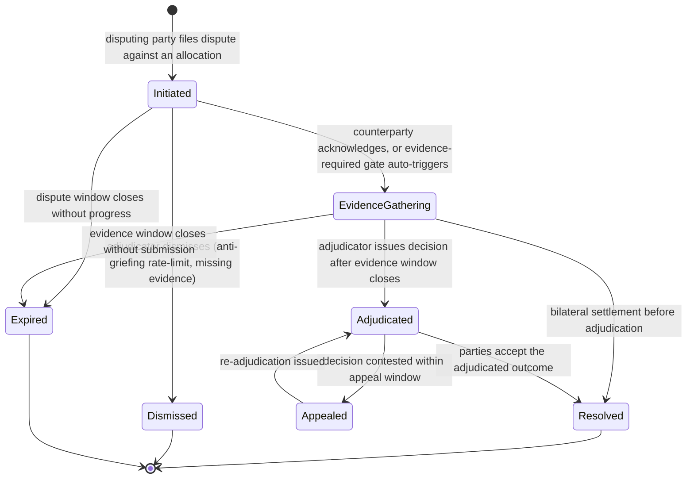

# Development Fund Proposal

## W14: Payment Dispute & Reversal Primitive

| Field | Value |
| :---- | :---- |
| Author | Eric Mann, Avro Digital |
| Status | Draft |
| Created | 2026-04-23 |
| Label | `financial-workflows-composability` |
| Champion | need Champion |
| Champion outreach status | In progress via the dApp-Integration and financial-workflows-composability SIG channels; this draft will be updated when a Champion is confirmed |

---

## Abstract

Avro Digital requests 3,000,000 Canton Coin (CC) to design, implement, and release an open-source reference implementation of a payment dispute and reversal primitive for the Canton Network.

Every mature payment network — card networks, ACH, bank wires, real-time payment systems — provides standardized dispute, chargeback, and reversal mechanics as a foundational primitive. These mechanics are how payment networks maintain operational trust in the face of fraud, operational error, and counterparty failure. Canton's published primitive set, as enumerated in §5 (Existing Ecosystem Fit), contains no standardized dispute primitive today. Every payment application on the network either builds ad-hoc dispute mechanics, defers the problem until it becomes a production incident, or deliberately scopes itself to flows where disputes are out of scope. Each approach imposes significant cost on the application developer and creates fragmentation for wallets and custodians that would prefer to integrate against a standard.

This proposal organizes the work into four workstreams: Dispute Initiation and State Machine covering the on-ledger flow that structures a payment dispute; Time-Locked Reversal Windows providing configurable reversal patterns aligned with common payment-network conventions; Adjudication and Resolution Patterns supporting bilateral, third-party-arbitrated, and regulator-mediated resolution; and Integration Documentation and Test Harness covering representative payment flows.

Avro Pay is the committed reference integration for this grant. Compatibility notes for PR #78 (x402) are provided as a complementary pattern, not as a committed downstream adoption. Broader merchant and wallet integrations are positioned for follow-on adoption work outside this grant.

This proposal is intentionally complementary to Canton's existing payment infrastructure. It does **not** attempt to replace CIP-0056, introduce a competing wallet pattern, or ship a proprietary payment network. It fills a gap every consumer-facing or merchant-facing regulated payment application will need and currently must solve independently.

---

## Specification

### 1. Objective

Deliver an open-source reference implementation of a payment dispute and reversal primitive for the Canton Network, usable as a foundational layer by payment applications, wallets, and custodians.

The project includes:

- A dispute initiation and state-machine reference implementation  
- Configurable time-locked reversal windows supporting common payment-network conventions  
- Adjudication and resolution patterns for bilateral, third-party-arbitrated, and regulator-mediated cases  
- Integration documentation and test harness covering representative payment flows  
- Apache 2.0 licensing for all deliverables, released to a public Avro Digital repository

Explicit non-goals:

- A proprietary payment network or closed-source dispute service  
- Replacement or modification of CIP-0056 interface semantics  
- Jurisdiction-specific legal determinations; the reference implementation provides patterns that legal and compliance teams parameterize  
- Identity, KYC, or compliance hooks beyond those required for dispute routing (these are covered by broader compliance-pattern work)  
- Automated fraud detection or scoring

These should be treated as follow-on work or as out-of-scope for this proposal.

### 2. Implementation Mechanics

The implementation is organized into four workstreams.

**Workstream A: Dispute Initiation and State Machine**

The on-ledger flow that structures a payment dispute from initiation through resolution.

- Daml templates representing a dispute lifecycle with explicit states — the primary set is initiated, evidence-gathering, adjudicated, resolved, and expired; the dismissed and appealed states (full set in Appendix A) handle anti-griefing dismissal and contested re-adjudication respectively  
- Transition workflows for each state change with configurable controllers matching the roles involved (disputing party, counterparty, adjudicator)  
- Evidence-reference patterns: the on-ledger contract carries content-addressed pointers (CAS keys, hash-of-blob) plus access-control metadata. Raw evidentiary blobs live off-ledger in a storage backend chosen by the integrator (object store such as S3 with CAS keys, IPFS-style content-addressed storage, or an integrator-hosted service). The Avro Pay reference integration documents an S3-compatible object store with content-addressed keys as the recommended starting point. Per-integration parameterization is documented so adopters with different data-protection regimes (jurisdictional retention, regulator escrow) can substitute a backend without changing the on-ledger contract shape  
- Consistent event-log emission for downstream accounting and reporting systems  
- Disputes target *completed payment artifacts* — a CIP-0056 completed allocation, or an immutable settlement-receipt contract where applications ship one (Avro Pay's `SettlementReceipt` is the reference example: it is the operator+customer-signed audit record left on-ledger after `ConfirmSettlement` and provides a stable CID for the dispute to reference). The primitive does not modify or reopen the underlying allocation; it composes a new dispute contract that references it  
- Cross-participant disputes are first-class: when the disputing party and counterparty live on different Canton participants, the dispute contract is signed by both (or held by a routing adjudicator visible to both) and the deployment routes the dispute on `global-domain`. The synchronizer-routing rule and the cross-participant test scenario are documented in Milestone 1's architecture document and validated in the test harness

**Workstream B: Time-Locked Reversal Windows**

Configurable reversal patterns aligned with common payment-network conventions. Different use cases need different windows: a card-like flow may permit 60- to 120-day reversal; an RTP-like (real-time-payment) flow may permit reversal only within the hour; an ACH-like flow sits between these. Rather than prescribing a single window, the reference provides a composable pattern.

- Daml templates for time-locked reversal windows with configurable duration, eligible-initiator patterns, and reversal-funding sources  
- Pre-authorized reversal patterns where counterparties opt into a reversal window at payment time  
- Conditional reversal patterns where reversal eligibility depends on documented conditions (delivery confirmation, service completion attestation, regulatory holding period)  
- Automatic window-expiry patterns releasing funds after a window closes without dispute  
- Interaction patterns with CIP-0056 transfer preapprovals so that reversal mechanics compose cleanly with existing preapproval flows

**Workstream C: Adjudication and Resolution Patterns**

Reference patterns for resolving disputes across the common counterparty configurations.

- Bilateral resolution patterns for disputes resolved directly between disputing party and counterparty  
- Third-party-arbitrated patterns for disputes routed to a neutral arbitrator (payment-network operator, marketplace operator, standards body)  
- Regulator-mediated patterns for disputes escalated to a regulator role, using CIP-0056's identity-aware design — the regulator is a Daml party assigned by the integrator (jurisdictions and authority models are the integrator's responsibility); the reference patterns document the role mechanics, not legal authority interpretations  
- Partial-resolution patterns supporting split-decision outcomes (partial refund, partial fulfillment)  
- Appeal and re-adjudication patterns for disputes where the initial adjudication is contested  
- Adjudicator-role identity is parametric per integration: the role is a Daml party chosen by the integrator at template-instantiation time, with the per-shape default-fill table (operator-as-adjudicator, marketplace-operator, standards-body, regulator) in Appendix C. The proposal does not centralize adjudication on Avro

**Workstream D: Integration Documentation and Test Harness**

The primitive is only valuable if payment applications can adopt it without re-engineering. This workstream delivers the artifacts needed for adoption.

- Integration guide for adopting the dispute primitive in existing payment applications  
- Reference integration with Avro Pay demonstrating the primitive against two Avro Pay-supported workflows in staging — merchant refund (operator-mediated reversal of a completed `SettlementReceipt`) and buyer chargeback (customer-initiated post-settlement dispute against a completed `SettlementReceipt`)  
- Compatibility-notes pattern for PR #78 (x402) demonstrating how the primitive could compose with a machine-to-machine payment context, provided as a complementary reference rather than a committed downstream adoption  
- Test-harness scenarios covering representative flows: consumer-to-merchant, merchant-to-merchant, machine-to-machine, and a parametric multi-party scenario (the marketplace-mediation pattern is delivered as a parametric Daml-test fixture, not as a committed staging integration, because Avro Pay's v0 product is two-party customer↔provider; multi-party staging is gated on the broader avro-pay roadmap)  
- Cross-participant integration test: the test harness includes a scenario in which the disputing party and counterparty are allocated on different participants, validating the `global-domain` routing path and contract-visibility model end-to-end  
- Operator-observability hooks: the integration guide documents how application operators surface dispute events — PQS subscription patterns (recommended for real-time), webhook delivery patterns (for application-managed delivery), the dispute-event-log schema, and dashboard wiring patterns (event-stream → reporting integration). UI is out of scope for this grant; adopters wire the events into their own operator console  
- Documentation and scenarios for each resolution pattern (bilateral, arbitrated, regulator-mediated, partial, appealed)

### 3. Architectural Alignment

This proposal anchors to two of the Canton Foundation's Q2 ecosystem priorities — **App Building & Developer Experience** (a primitive every payment application can reuse rather than rebuild) and **Security & Resilience** (anti-griefing patterns, evidence-privacy patterns, and adjudication state-machine semantics that harden the application layer).

It is aligned with Canton and existing payment infrastructure in four ways:

- It composes with CIP-0056 rather than replacing it. Dispute templates reference allocations and transfer instructions from CIP-0056 without modifying the interface surface. Applications that already implement CIP-0056 adopt the primitive as additional templates, not as a replacement layer.  
- It composes with CIP-0103 external signing patterns and CIP-0056 transfer preapprovals. Disputing a payment that used a preapproval remains compatible with the preapproval's controller and expiry model.  
- It complements rather than competes with PR #78 (x402). The x402 proposal addresses machine-to-machine payments; this proposal addresses the dispute primitive that any payment layer, including x402, will need. Workstream D includes a compatibility-notes pattern that x402 adopters can apply if they choose, but no commitment in either direction is required.  
- The dispute state machine follows Canton's identity-aware design: every role (disputing party, counterparty, adjudicator, regulator) is a known Daml party, and controllers are explicit in the template signatures.

### 4. Backward Compatibility

Backward compatibility is a core design constraint for this project:

- Existing payment applications on Canton, including Amulet's wallet payment flows, continue to function unchanged. The dispute primitive is a new Daml template set, not a modification to existing templates.  
- CIP-0056 is consumed as-is. No CIP-0056 interface changes are required.  
- Time-locked reversal windows are opt-in at payment time, controlled by the initiator (or by both parties for pre-authorized profiles); payments that do not adopt a window continue to operate as irrevocable transfers at commit time.  
- Adjudication patterns are modular. Applications adopt only the patterns relevant to their use case without being required to adopt the full set.  
- The primitive is designed to layer on top of the CIP-0056 v2 standard (DA grant PR #97 — merged and approved 2026-04-23; M1 CIP-draft specification scheduled for April 2026) without requiring re-implementation when v2 ships. Since v2 emphasizes execution reliability ("settlement should be near-guaranteed to go through") and does not specify dispute, reversal, or chargeback mechanics, the primitive composes on top of either v1 or v2 with no expected interface impact.

### 5. Existing Ecosystem Fit

This proposal extends rather than replaces existing Canton payment infrastructure. The matrix below makes the relationship explicit, since the Tech & Ops Committee asks "what existing component does this extend? why can't it?" of every infrastructure proposal:

| Component | Relationship | Why this primitive cannot live there |
| :---- | :---- | :---- |
| **CIP-0056 v1 (Token Standard)** | Extends, no interface change | CIP-0056 specifies the token-allocation interface; dispute mechanics are out of scope by design and would expand the standard's surface area |
| **CIP-0056 v2 (DA grant, merged + approved)** | Compatibility-only; no shared scope | DA's v2 grant (canton-dev-fund PR #97, merged and approved 2026-04-23; M1 CIP-draft specification scheduled for April 2026) emphasizes execution reliability ("settlement should be near-guaranteed to go through") and does not specify dispute, reversal, or chargeback mechanics. W14 fills that gap by composing on top of either v1 or v2 without modifying the standard |
| **CIP-0103 (External Signing)** | Composes | CIP-0103 is the signing channel; disputes are state-machine semantics layered above |
| **CIP-0104 (Traffic-Based App Rewards)** | Out of scope; documented interaction | Disputes generate ledger transactions which under CIP-0104 generate traffic-based app rewards for the operator. The integration guide documents this interaction explicitly and recommends mitigations (rate-limiting at initiation, evidence-required gating, anti-griefing dismissal) so application operators can address the perverse-incentive surface without W14 prescribing a specific economic policy |
| **Splice (Amulet / Wallet UI / Validator)** | Consumes Splice as-is | Splice is the runtime; dispute Daml packages distribute as standard DARs |
| **PQS (Participant Query Store)** | Consumes existing event-stream conventions | Dispute event logs are emitted with the same shape as ordinary allocation events; reporting integrations consume identical telemetry |
| **DPM (Daml Package Management)** | Consumes existing DAR upload workflow | No DPM extension is proposed |
| **Avro Pay (committed reference integration)** | Composes; reference integration | The dispute templates reference Avro Pay's existing immutable `SettlementReceipt` contract (operator+customer signed, provider observer) as the dispute target. Avro Pay's existing `ReverseSettlement` choice operates on the in-flight `PendingSettlement` only — once `ConfirmSettlement` archives that contract and creates the receipt, the customer has no on-ledger reversal path, which is the gap this primitive fills. The reference integration runs on `global-domain` because the application's customer and provider parties can live on participants other than the operator's |
| **PR #78 (x402)** | Complementary, optional adoption | x402 addresses machine-to-machine payments; we document the compatibility pattern and do not commit to merging into x402 nor depend on x402 merging |
| **PR #186 (Canton Native Yield Token / CC20)** | Composable, no dependency in either direction | New yield-bearing token primitive; the dispute primitive can be adopted by yield-token applications without coordinated changes |
| **PR #73 (Institutional Undercollateralized Credit)** | Composable, no dependency in either direction | New credit-instrument primitive; dispute and reversal patterns apply at the payment layer regardless of underlying instrument shape |

There is no existing Canton primitive providing the dispute, time-locked-reversal, or adjudication state-machine surface this proposal targets. Building it inside any one application would fragment the ecosystem; building it as a reference implementation lets every payment application adopt the same primitive.

---

## Assumptions

These assumptions condition the milestone schedule and acceptance criteria. If any breaks materially, Avro will surface it in the next quarterly committee report and propose a scope adjustment rather than absorb the slip silently.

- CIP-0056 v1 remains the canonical token interface during this grant. CIP-0056 v2 (DA grant PR #97, merged and approved 2026-04-23; M1 CIP-draft specification scheduled for April 2026), if it lands during the project, is folded into Milestone 3 as a compatibility-validation step rather than a re-implementation. Because v2 emphasizes execution reliability and does not specify dispute mechanics, the dispute primitive composes on either v1 or v2.  
- Avro Pay's product team has committed to the reference-integration deliverable as part of its existing roadmap. Avro Pay engineering is not separately funded by this grant. The reference-integration deliverable specifically targets Avro Pay's `SettlementReceipt` contract as the dispute target — Avro Pay's existing in-flight reversal mechanism (`ReverseSettlement` on `PendingSettlement`) does not cover post-confirmation disputes, which is the gap W14 fills.  
- The Avro Pay reference integration runs on Canton's `global-domain` synchronizer because the underlying `PaymentAuthorization`, `SettlementReceipt`, and dispute templates carry external-party signatories (customer and provider can be wallet parties on participants other than the operator's). The synchronizer-routing rule applies generally: any dispute touching an external-party signatory must route on `global-domain`. Adopters whose application topology is fully internal can deploy on a private synchronizer; the integration guide documents how to choose.  
- The default adjudicator role for the Avro Pay reference integration is the operator party with admin co-signature, mirroring Avro Pay's existing dual-auth pattern for `ReverseSettlement`. The adjudicator role is parametric per integration; Avro is not the central adjudicator across the network.  
- The default evidence-storage backend for the reference integration is an S3-compatible object store with content-addressed keys, paid by the integrator. The integration guide documents alternative backends (IPFS-style CAS, regulator-escrow) so adopters whose data-protection regime requires a different backend can substitute one without on-ledger changes.  
- Digital Asset is available as a stakeholder for two architectural reviews — one at Milestone 1 (state-machine and reversal-window design) and one at Milestone 3 (interoperability with Amulet and CIP-0056) — on a best-effort basis. No DA consulting line item is requested in this grant because the primitive composes with existing CIPs without proposing changes.  
- The dApp-Integration and Wallet-Apps SIGs remain reachable via Foundation Slack for Champion outreach and design-partner sourcing through the project window.  
- No deliverable depends on a CIP merge or upstream Splice merge. All artifacts ship in a public Avro Digital repository under Apache 2.0.  
- Avro Pay's staging environment remains reachable for the Milestone 3 demo. If it is unavailable for operational reasons, an equivalent ephemeral environment is provisioned to demonstrate the same flows.  
- Marketplace multi-party flows are validated as a parametric Daml-test fixture, not against Avro Pay staging — Avro Pay's v0 product is two-party (customer↔provider via operator), so the staging environment cannot host a marketplace-mediation scenario in this grant window. The parametric fixture demonstrates the pattern; production marketplace adoption is left to follow-on work outside this grant.

---

## Milestones and Deliverables

### Milestone 1: Dispute State Machine and Time-Locked Reversal Windows

- **Estimated Delivery:** Month 1-2  
- **Focus:** Deliver the core on-ledger primitives that underpin all later adjudication and integration work  
- **Deliverables / Value Metrics:**  
  - Architecture document covering all four workstreams, the scope boundary with existing payment infrastructure, and the off-ledger evidence privacy considerations  
  - Anti-Griefing Pattern Guide as a named deliverable: worked rate-limit / evidence-required-gating / dismissal-choice recommendations, with examples quantifying the CIP-0104 reward delta a griefing actor would face against the operator-side cost of processing the dispute lifecycle  
  - Dispute state-machine Daml templates (Workstream A) released as an open-source package  
  - Time-Locked Reversal Windows Daml templates (Workstream B) released as an open-source package  
  - Test harness validating the dispute lifecycle and reversal patterns against representative scenarios, including explicit transfer-preapproval composition scenarios  
  - Initial integration guide covering how applications layer the primitive on top of CIP-0056  
- **Demo trigger:** A scripted Daml-test scenario in the public Avro Digital repository executes one full dispute lifecycle (initiated → evidence-gathering → adjudicated → resolved), one expiry path, one anti-griefing dismissal scenario referencing the Anti-Griefing Pattern Guide, and three reversal-window profiles (card-like, ACH-like, RTP-like), all passing the published assertions. Artifact: tagged `v0.1` release of the dispute and reversal-window Daml packages, the architecture document, the Anti-Griefing Pattern Guide, and a recorded walkthrough of the test run.

### Milestone 2: Adjudication and Resolution Patterns

- **Estimated Delivery:** Month 3-4  
- **Focus:** Deliver the full set of resolution patterns and prepare for application-level integration  
- **Deliverables / Value Metrics:**  
  - Adjudication and Resolution Patterns (Workstream C) released as an open-source package  
  - Bilateral, third-party-arbitrated, regulator-mediated, partial-resolution, and appealed patterns implemented and validated  
  - Test harness covering each resolution pattern against representative scenarios  
  - Documentation covering pattern selection guidance for application developers  
  - Avro pursues at least one named third-party design partner via the dApp-Integration or Wallet-Apps SIG; outcome is captured as either a written statement of intent or a publicly disclosed status note in the milestone artifact set  
- **Demo trigger:** Five named scenarios in the public test harness pass end-to-end — bilateral, third-party-arbitrated, regulator-mediated, partial-resolution, appealed — each with input fixtures, an expected end-state assertion, and a documented adjudicator role. Artifact: tagged `v0.2` release of the adjudication-pattern Daml package, the pattern-selection guide, and the design-partner outcome (written statement of intent from the design partner with attributed quote (or a publicly disclosed status note explaining outreach progress and any decline)).

### Milestone 3: Integration Documentation, Test Harness, and Release

- **Estimated Delivery:** Month 5  
- **Focus:** Ship the full integration suite and validate against Avro Pay as the committed reference integration  
- **Deliverables / Value Metrics:**  
  - Complete integration guide for adopting the dispute primitive (Workstream D)  
  - Reference integration with Avro Pay demonstrating the primitive end-to-end against two named workflows in staging — merchant refund and buyer chargeback — both targeting Avro Pay's existing `SettlementReceipt` contract  
  - Compatibility-notes pattern documented for machine-to-machine payment flows (applicable to PR #78 x402 if its proposal team chooses to adopt — not a committed downstream adoption)  
  - Full test-harness suite covering consumer-to-merchant, merchant-to-merchant, machine-to-machine, a parametric multi-party fixture (marketplace-mediation pattern delivered as a Daml-test scenario, not a staging integration; see Assumptions), and a cross-participant scenario (disputing party and counterparty on different participants, validating `global-domain` routing)  
  - Co-marketing release with Canton Foundation including technical blog, case study, and developer promotion  
  - Public release of all deliverables under Apache 2.0  
- **Demo trigger:** Avro Pay's staging environment runs one consumer-to-merchant payment to completion, one customer-initiated buyer-chargeback dispute against the resulting `SettlementReceipt` (initiation + evidence submission + adjudication + resolution), and one operator-initiated merchant-refund dispute, all recorded end-to-end. Artifact: tagged `v1.0` release of the dispute-primitive packages and integration guide, the recorded staging walkthrough, the published test-harness suite (including the cross-participant and parametric multi-party scenarios), and the Foundation co-marketing technical blog post.

---

## Acceptance Criteria

Acceptance is evaluated against the artifacts Avro directly controls and the milestone Demo triggers above. Project-specific conditions:

- The dispute state machine passes the full test harness covering initiation, evidence gathering, adjudication, resolution, and expiry paths, with passing-test artifacts published in the open-source repository  
- Time-locked reversal windows are validated for at least three named configuration profiles — card-like (60–120 day window), ACH-like (5 banking-day window), RTP-like (60-minute window) — each with reproducible scenario fixtures in the test harness  
- Adjudication patterns are validated for bilateral, third-party-arbitrated, regulator-mediated, partial-resolution, and appealed cases, each as a named scenario in the test harness with passing assertions on the expected end-state  
- A committee-verifiable staging demo shows one completed CIP-0056 payment in Avro Pay, one customer-initiated buyer-chargeback dispute against the resulting `SettlementReceipt` (initiation + evidence + adjudication + resolution), and one operator-initiated merchant-refund dispute, with recorded steps and test artifacts published to the open-source repository  
- The test harness is validated against representative flows across four named payment shapes — consumer-to-merchant, merchant-to-merchant, machine-to-machine (via the x402 compatibility-notes pattern), and marketplace multi-party (parametric fixture) — each with at least one scripted scenario and end-state assertions; the marketplace-multi-party scenario is delivered as a parametric Daml-test fixture rather than as a staging integration (see Assumptions for the Avro Pay v0 two-party constraint)  
- The test harness includes a cross-participant scenario in which the disputing party and counterparty are on different participants, validating `global-domain` routing and contract-visibility behavior end-to-end  
- All software deliverables are released under Apache 2.0 to a public Avro Digital repository

### External-dependency carve-out

Where milestone completion depends on third-party approvals — CIP review, upstream Splice or DA maintainer review, design-partner sign-off, or Foundation co-marketing scheduling — completion is evaluated on Avro delivering submission-ready artifacts and addressing review feedback in good faith, not on timelines outside Avro's control. Specifically, milestone payments are not gated on (a) CIP-0056 v2 finalization timing, (b) third-party design-partner availability beyond the committed Avro Pay reference integration, or (c) Foundation co-marketing publication windows.

---

## Funding

**Total Funding Request:** 3,000,000 CC

CC is referenced at $0.14 for this proposal (verified at $0.14 spot on 2026-04-29; aligned with the rate convention used in the CIP-0105 grant proposal). At that rate, the total request is approximately $420,000 USD equivalent.

This request reflects:

- Implementation of the dispute state machine, reversal window patterns, adjudication patterns, and integration documentation across four workstreams  
- Test harness suite covering representative payment flows  
- Reference integration with Avro Pay, the committed reference integration  
- Documentation and co-marketing release

### Payment Breakdown by Milestone

| Milestone | Amount (CC) | ~USD at $0.14 | Trigger |
| :---- | :---- | :---- | :---- |
| 1 — Dispute State Machine + Time-Locked Reversal Windows | 1,100,000 | ~$154,000 | Tagged `v0.1` Daml-package release, architecture document, and recorded test-harness walkthrough delivered |
| 2 — Adjudication and Resolution Patterns | 1,100,000 | ~$154,000 | Tagged `v0.2` Daml-package release, pattern-selection guide, and design-partner statement of intent (or publicly disclosed status note) |
| 3 — Integration Documentation, Test Harness, and Release | 800,000 | ~$112,000 | Tagged `v1.0` release, Avro Pay staging demo recorded, full test-harness suite published, Foundation co-marketing technical blog live |
| **Total** | **3,000,000** | **~$420,000** | |

### Volatility Stipulation

The project duration is 5 months. Per CIP-0100, projects of 6 months or under are denominated in fixed Canton Coin. Should the project timeline extend beyond 6 months due to Committee-requested scope changes, any remaining milestones must be renegotiated to account for significant USD/CC price volatility.

---

## Co-Marketing

Upon release, Avro Digital will collaborate with the Canton Foundation on:

- Announcement coordination at each milestone tag (`v0.1`, `v0.2`, `v1.0`)  
- A technical blog at Milestone 3 covering the dispute primitive's state machine, reversal-window profiles, and the Avro Pay reference integration  
- A case study at Milestone 3 documenting the end-to-end Avro Pay staging demo (consumer-to-merchant payment + dispute lifecycle), targeted at payment application builders, wallets, and custodians  
- A session at a Canton community or partner event during the Milestone 3 window covering the primitive and its adoption pattern  
- Developer ecosystem promotion via the dApp-Integration, Wallet-Apps, and Financial-Workflows-Composability SIGs

---

## Motivation

Every mature payment network provides dispute, chargeback, and reversal mechanics as a foundational primitive. Card networks define dispute windows, chargeback reason codes, and arbitration procedures. ACH defines return codes and same-day-reversal rules. Real-time payment systems define fraud-reversal windows and counterparty confirmation patterns. Bank wire systems define MT-message-based recall procedures.

These mechanics are not afterthoughts. They are how payment networks maintain operational trust in the face of fraud, operational error, and counterparty failure. A payment network without a standardized dispute primitive either pushes every dispute to out-of-band legal processes, or it does not function at scale.

Canton's published primitive set, as enumerated in §5 (Existing Ecosystem Fit), contains no standardized dispute primitive. Every payment application on the network faces the same choice:

- Build an ad-hoc dispute layer: expensive, inconsistent across applications, and fragmenting for wallets and custodians that have to integrate against each one individually.  
- Defer disputes until they become a production incident: delivers an application that cannot credibly be deployed for regulated payment flows.  
- Scope out dispute-requiring flows: constrains the application to machine-to-machine payments or other flows where dispute mechanics are not needed, leaving the consumer and merchant use cases unaddressed.

None of these is a satisfactory answer as Canton moves toward broader institutional adoption and application-layer growth.

The opportunity is to ship the reference primitive that every future payment application can adopt. A dispute state machine that composes with CIP-0056 allocations. Time-locked reversal windows that parametrize to different payment-network conventions. Adjudication patterns covering bilateral, arbitrated, and regulator-mediated resolution. Integration documentation that makes adoption straightforward for application developers.

This work complements PR #78 (x402) rather than competing with it. x402 addresses the machine-to-machine payment flow; this proposal addresses the dispute primitive that any payment layer, including x402, will need if it expands beyond purely automated flows.

Avro Digital proposes this as a focused, upstream-complementary reference-implementation contribution following the SV Governance dApp grant (PR #223, under committee review).

---

## Rationale

The key design choice is to build a reference primitive rather than a proprietary dispute-resolution service or a general-purpose arbitration framework. That approach:

- Respects the composable nature of Canton payment infrastructure. The primitive consumes CIP-0056 and CIP-0103 patterns as-is; applications adopt it without restructuring their existing payment flows.  
- Makes open-source contribution central. Every template, pattern, test harness, and integration guide lands in a public Avro Digital repository under Apache 2.0. There is no proprietary dispute service.  
- Keeps scope reviewable. Four independently useful workstreams, each with objectively verifiable acceptance criteria, is easier to review and easier to partially deliver if committee priorities shift mid-project.  
- Centers application developers as the primary user. Every milestone ships something that a payment application, wallet, or custodian can put into staging. No milestone is purely internal.  
- Provides the foundation for ecosystem moves that compound. Wallet teams in the Wallet-Apps SIG and custodians in the dApp-Integration SIG can integrate once against the primitive and serve any payment application that adopts it, rather than re-engineering against each application's bespoke dispute layer.

Avro Digital is proposing this as a focused, complementary open-source reference-implementation contribution.

### Why this is infrastructure, not product work

The deliverable is a Daml package set, a test harness, an integration guide, and a recorded staging demonstration — all published to a public Avro Digital repository under Apache 2.0.

The grant funds the dispute, time-locked-reversal, and adjudication state-machine primitive plus the documentation that makes it adoptable by other teams. It does not fund Avro Pay product engineering, Avro Pay user-facing UI, a hosted dispute-adjudication service, or any proprietary tooling. Avro Pay is the *reference integration* — the harness against which the primitive is validated end-to-end — not a *funded downstream product* of this grant.

The dispute-primitive Daml package, test harness, and integration guide land in Milestones 1 and 2 and are usable by any Canton payment application before the Avro Pay reference integration ships in Milestone 3 — i.e., the primitive is published independent of the Avro Pay integration timeline, and Avro Pay engineering hours required to land the M3 reference integration are paid from Avro's product budget regardless of grant outcome.

---

## Risks and Mitigations

| Risk | Likelihood | Impact | Mitigation |
| :---- | :---- | :---- | :---- |
| Adjudication patterns fail to match at least two real Avro Pay operator workflows (merchant refund, buyer chargeback) | Medium | High | Validate the two named workflows in Avro Pay staging by Milestone 3 and publish the workflow matrix in the integration guide; marketplace mediation is delivered as a parametric Daml-test fixture rather than a staging integration because Avro Pay v0 is two-party (see Assumptions) |
| Malicious or griefing dispute initiation by a counterparty operating in bad faith inflates operator costs | Medium | Medium | Dispute templates require the disputing party as signatory and emit event-log records at initiation; reference patterns ship with rate-limit hooks, evidence-required gating, and adjudicator-side dismissal choices documented in Milestone 1's anti-griefing pattern guide |
| Off-ledger evidence pointers leak privacy-sensitive data or violate jurisdictional retention rules | Medium | High | The evidence-reference pattern stores only content-addressed pointers and access-control metadata on-ledger; raw evidentiary blobs live off-ledger in an integrator-chosen, integrator-paid backend (default: S3-compatible CAS); retention is parameterized so application teams set it per their data-protection regime; privacy considerations are covered in Milestone 1's architecture document |
| CIP-0104 traffic-rewards perverse incentive: every dispute lifecycle event generates ledger transactions that earn the operator app rewards under CIP-0104, creating a marginal incentive for the operator to encourage dispute traffic | Low | Medium | Milestone 1 ships an Anti-Griefing Pattern Guide as a named deliverable (worked rate-limit/evidence-gating recommendations with examples that quantify the CIP-0104 reward delta a griefing actor faces against the operator-side cost of processing the dispute lifecycle). The dispute templates ship with rate-limit hooks, evidence-required gating, and adjudicator-side dismissal choices the operator can compose to defuse the incentive. Application-level economic policy (dispute fees, rate-limit parameters) remains application-specific |
| Cross-participant routing misconfiguration (`UNKNOWN_INFORMEES` or equivalent) when disputing party and counterparty live on different participants | Medium | Medium | The integration guide documents the synchronizer-routing rule (any external-party signatory → `global-domain`) and the test harness includes an explicit cross-participant scenario; the mitigation is to route on `global-domain` for any dispute touching external parties, and the rule is enforced by an explicit synchronizer-allowlist gate at application startup |
| External adopter beyond Avro Pay does not materialize within the project window, leaving the primitive validated against a single integration | Medium | Medium | Avro Pay is the committed reference integration; in parallel Avro pursues at least one named third-party design partner via the dApp-Integration and Wallet-Apps SIGs by Milestone 2; the primitive ships adoption-ready regardless of secondary-adopter status |
| CIP-0056 v2 finalization, wallet-signing assumption changes, or other upstream review timing slips during delivery | Medium | Medium | Avro tracks the v2 review cadence weekly with DA; the primitive is structured to layer cleanly on either v1 or v2; v2 alignment work is captured as a Milestone 3 follow-up rather than blocking earlier milestones |
| The primitive is misused as jurisdiction-specific legal dispute-resolution | Low | High | Clear documentation that the primitive provides on-ledger state-machine patterns for legal and compliance teams to parameterize, not legal conclusions |
| Adjudicator role is read as Avro centralizing dispute resolution across the network | Low | Medium | Adjudicator-role identity is parametric per integration (see Workstream C and Appendix C); Avro Pay's reference adopts the operator party as the default adjudicator, not Avro Digital as a network-wide arbiter; the integration guide explicitly disclaims central-adjudication framing |
| Scope boundary with PR #78 (x402) is unclear to the committee | Low | Medium | Explicit scope distinction documented in Milestone 1; compatibility-notes pattern for x402 delivered in Milestone 3 as a complementary reference, not a committed integration |
| Time-locked reversal patterns interact unexpectedly with transfer preapprovals | Medium | Medium | Integration patterns validated against CIP-0056 transfer preapproval flows as part of Milestone 1 test harness; explicit preapproval-composition scenarios in the harness |

---

## Team

| Role | Name | Relevant prior work |
| :---- | :---- | :---- |
| Implementation lead | Eric Mann, Avro Digital | Founding engineer at Avro Digital; primary author of the SV Governance dApp grant (PR #223), the CIP-0105 SV-locking grant proposal, the xCC liquid-staking implementation, and Avro Pay's payment-gateway and metering middleware. |
| Protocol & CIP shepherd | Randy Harrison, CTO, Avro Digital | CTO; CIP authoring and ecosystem coordination on prior Avro grants; responsible for upstream review engagement with DA and the Foundation. |
| Reference-integration lead | Ian Hensel, Head of Product, Avro Digital | Drives the Avro Pay roadmap; member of the Financial-Workflows-Composability and Onchain-Governance-Modeling SIGs; coordinates the staging demo and design-partner outreach. |

Avro Digital's directly relevant shipping work on Canton:

- **Avro Pay** — production payment-gateway with CIP-0056 transfer-preapproval integration, metering middleware (Go and TypeScript SDKs), and the customer/provider dashboards that this proposal's reference integration builds on.  
- **xCC (liquid staking)** — UTXO-pattern token contracts, multi-synchronizer DAR vetting, and the issuer-separation pattern referenced in this proposal's privacy-design choices.  
- **SV Governance dApp grant (PR #223)** — currently under committee review; sets Avro's house style for grant proposals and the DA-consulting-line-item precedent that informs this grant's compositional framing.  
- **CIP-0105 SV-locking grant** — earlier Avro grant proposal under the CIP-0105 (on-chain SV locking) standard; reference for the Funding section's USD-rate convention used here.

## Ecosystem Reach

Direct beneficiaries of this primitive in the Q2 2026 ecosystem:

- **Payment applications** — Avro Pay (committed reference integration); other Canton-based payment applications adopting CIP-0056 (qualitative estimate: any application supporting consumer-to-merchant or marketplace flows benefits, which we expect to grow with broader CIP-0056 adoption — a percentage estimate is intentionally not given because the active payment-application count on Canton mainnet is small enough that aggregate-percentage framing would be misleading).  
- **Wallets** — every wallet adopting CIP-0056 transfer-preapproval already integrates against the same surface this primitive composes with; no wallet-side re-engineering is required for adoption.  
- **Custodians and operators** — operational tooling against the dispute primitive's event-log emission is reusable across any payment application that adopts the primitive, eliminating per-application bespoke tooling.

---

## Post-Grant Support

For 90 days after Milestone 3 acceptance, Avro Digital will:

- answer reasonable maintainer questions about the contributed primitive, test harness, and integration guide  
- fix grant-scope bugs identified by adopters during the 90-day window  
- assist design partners with documentation clarifications on integrating the primitive  
- track CIP-0056 v2 alignment and publish a compatibility note if v2 lands during the window

This support window does not include downstream product integrations, operational ownership of any production dispute-resolution service, jurisdiction-specific legal review, or open-ended new-feature development. Continued maintenance beyond 90 days will be evaluated against ecosystem usage and may be the subject of a separate proposal.

---

## Open Source and Licensing

All software deliverables will be released under Apache 2.0 to a public Avro Digital repository. Documentation, architectural decision records, and integration guides will be released under the same terms.

---

## Appendix A: Dispute Lifecycle State Machine

The reference state machine for the dispute primitive (Workstream A) follows this shape. Concrete Daml templates and their controllers are finalized in Milestone 1's architecture document; the state set and transitions are stable.

## Appendix B: Time-Locked Reversal Window Profiles

The three reference profiles validated in Milestone 1's test harness:

| Profile | Window Duration | Eligible Initiator | Funding Source | Typical Use |
| :---- | :---- | :---- | :---- | :---- |
| Card-like | 60–120 days (configurable) | Counterparty (recipient) on dispute | Pre-authorized reversal pool or recipient-held funds | Consumer-to-merchant chargebacks |
| ACH-like | 5 banking days | Either party with documented condition | Recipient-held funds | Payroll, bill payment, recurring transfers |
| RTP-like | 60 minutes | Initiator only, fraud-flagged path | Initiator-held funds | Real-time-payment fraud reversal |

(Real-time-payment use case context: bank-rail systems like FedNow, RTP, SEPA Instant Credit Transfer.)

Each profile is delivered as a parameterized Daml template; application teams pick a profile or compose their own using the same primitive.

## Appendix C: Adjudicator Role Mapping

The adjudicator is a Daml party named at template-instantiation time by the integrating application. The primitive does not prescribe an identity — different integration shapes pick different fills. The reference integration patterns ship with documented mappings:

| Integration Shape | Default Adjudicator Fill | Avro Pay Reference | Notes |
| :---- | :---- | :---- | :---- |
| Two-party payment application (operator-mediated) | Application operator party with admin co-signature (dual-auth) | Operator party + admin co-signature, mirroring Avro Pay's existing `ReverseSettlement` dual-auth | The most common pattern; the operator is already the trust anchor for settlement |
| Marketplace (multi-party, three-sided) | Marketplace operator party | Parametric Daml-test fixture only (Avro Pay v0 is two-party) | Operator distinct from buyer/seller; suitable for platform-mediated commerce |
| Bilateral (no operator) | Mutually-agreed adjudicator party named at payment time | Not in Avro Pay v0 reference | Requires both parties to pre-commit to an arbitrator |
| Standards-body arbitrated | Standards-body party named at integration setup | Not in Avro Pay v0 reference | For consortium-style payment networks |
| Regulator-mediated | Regulator-as-Daml-party (regulator-controlled escalation) | Not in Avro Pay v0 reference | Pattern, not legal interpretation; jurisdictions are the integrator's responsibility |

Avro is not a network-wide adjudicator and the primitive is not designed to centralize adjudication. Where the operator-as-adjudicator pattern is used (the most common case), it inherits whatever trust model the application's operator already carries — Avro Pay's operator carries the same trust today for `ReverseSettlement` dual-auth on `PendingSettlement`; W14 extends that pattern to post-`SettlementReceipt` disputes.

## Appendix D: Reference-Integration Mapping (Avro Pay)

For reviewer transparency, the concrete integration touchpoints between the dispute primitive and Avro Pay's existing templates as they would land post-Milestone 3. **All "proposed" entries are new work that does not exist in Avro Pay v0.3.0; they are listed to make the integration surface concrete, not to claim existing functionality.**

| W14 Concept | Avro Pay v0 Anchor | Glue work in the reference integration |
| :---- | :---- | :---- |
| Dispute-target reference | `SettlementReceipt` (operator+customer signatories, provider observer; created by `ConfirmSettlement`; immutable) | Proposed `PaymentDispute` template carries a `targetReceiptCid : ContractId SettlementReceipt` field and validates the receipt's parties against the dispute's parties at initiation |
| Disputing-party identity | `customer` (signatory on `SettlementReceipt`) | Customer becomes the `PaymentDispute` controller for initiation — closes the v0 gap where the customer has no on-ledger reversal path post-`ConfirmSettlement` (existing reversal choices `ReverseSettlement` and `ExpireSettlement` are operator-side and apply only to the in-flight `PendingSettlement`) |
| Counterparty identity | `provider` (observer on `SettlementReceipt`) | Provider becomes a controller on accept/reject choices in `PaymentDispute` |
| Adjudicator identity | `operator` party + `admin` co-signature (dual-auth, mirroring the existing `PendingSettlement.ReverseSettlement` controller on `PaymentAuthorization.daml`) | `PaymentDispute` adjudication choices controlled by `operator, admin`; same trust model Avro Pay's product already documents |
| Resolution outcome (refund) | Proposed new `ResolveDisputeRefund` choice on `PaymentAuthorization` (does not exist in v0.3.0 — name is illustrative; final naming follows Avro Pay's PascalCase convention and is finalized in Milestone 1's architecture document) | Re-credits `PaymentAuthorization.drawnAmount` and emits a `DisputeResolutionReceipt` audit record with provider as observer; the re-credit pattern follows the same shape as `PendingSettlement.ReverseSettlement` though the host template differs (here `PaymentAuthorization` rather than `PendingSettlement`, since `PendingSettlement` is archived by `ConfirmSettlement`) |
| Synchronizer | `global-domain` (mandatory because Avro Pay's customer/provider can be external wallet parties) | Dispute templates inherit Avro Pay's existing synchronizer-routing rule; no new routing logic is required |
| Off-ledger evidence storage | Pluggable per integration; the integration guide documents the S3-compatible content-addressed-store pattern as the recommended starting point | The integrator selects and pays for the storage backend; the storage-backend abstraction is documented in the integration guide so adopters can substitute IPFS-style CAS or an integrator-hosted service without on-ledger contract changes |
| CIP-0056 transfer-preapproval composition | Avro Pay's `TransferPreapproval` Leg-2 settlement (operator→provider) | Refund flows require a new operator→customer transfer (preapproval direction not present in v0); the integration guide documents the preapproval-revocation semantics for pre-authorized reversal pools |

The Avro Pay engineering work to land this integration (new choices on `PaymentAuthorization`, dispute-aware reconciliation in the gateway) is on Avro Pay's existing product roadmap and is not funded by this grant. The dispute primitive Daml package, test harness, and integration guide ship in Milestones 1 and 2 and are usable by any Canton payment application before the Avro Pay integration ships in Milestone 3 — i.e., the public-good deliverables are independent of the Avro Pay integration timeline. W14 funds the dispute primitive and the integration guide; Avro Pay funds the application-side adoption.

