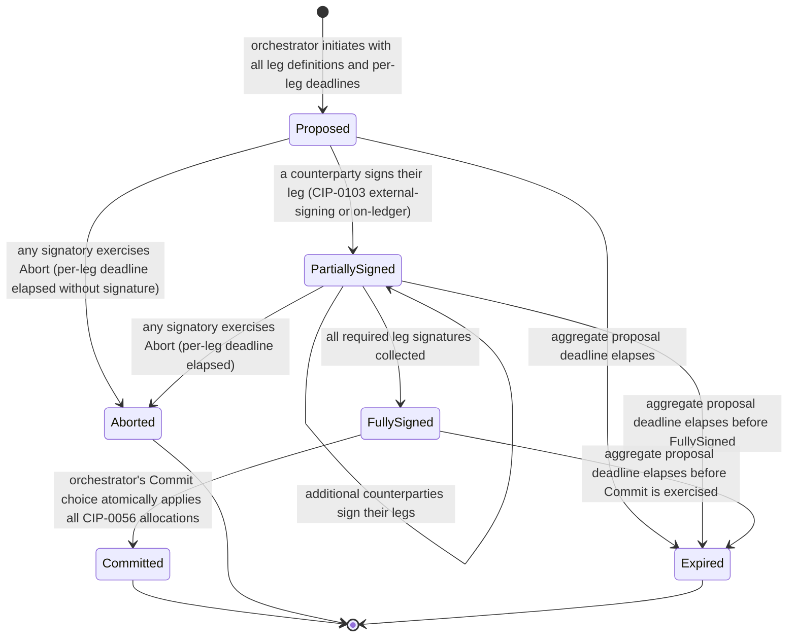

# Development Fund Proposal

## W15: Atomic Multi-Leg Settlement Primitive

| Field | Value |
| :---- | :---- |
| Author | Eric Mann, Avro Digital |
| Status | Draft |
| Created | 2026-04-23 |
| Label | `financial-workflows-composability` |
| Champion | need Champion |
| Champion outreach status | In progress via the `financial-workflows-composability` and `dapp-integration` SIG channels. First-priority outreach candidates per the Foundation SIG roster are Charles Desmonty (Kaiko), Anthony Merriman (Modulo Labs), and Jack Charlesworth (LayerZero). This draft will be updated when a Champion is confirmed. |

---

## Abstract

Avro Digital requests 4,500,000 Canton Coin (CC) to design, implement, and release an open-source reference implementation of an atomic multi-leg settlement primitive for the Canton Network.

Canton's architecture uniquely enables atomic settlement of transactions spanning multiple assets, multiple parties, and multiple application contexts. A single transaction can atomically debit one party's holdings in asset A, credit another party's holdings in asset B, adjust a third party's fee balance in asset C, and trigger a downstream workflow — with the guarantee that all legs commit together or none do. This is a missing primitive for exchange, marketplace, and multi-party settlement applications that need commit-or-abort semantics across more than two legs.

Today that primitive has no standardized reference implementation. Every application that needs atomic multi-leg settlement builds its own, often reinventing the same patterns around allocation ordering, preapproval composition, timeout handling, and partial-fulfillment recovery. This fragments the ecosystem: wallets and custodians cannot provide consistent integration across multi-leg settlement applications because each application defines its own settlement shape.

This proposal organizes the work into four tightly scoped workstreams: a Multi-Leg Allocation Orchestrator that composes CIP-0056 allocations into atomic multi-leg transactions; Settlement Patterns covering delivery-versus-payment, payment-versus-payment, multi-party-settlement, conditional, and batched settlement shapes; an Integration Layer providing TypeScript and Go client libraries with parity-validated test harnesses; and a Reference Integration that extends Avro Digital's in-tree DFBA (Decentralized Frequent Batch Auction) settlement engine with multi-leg primitives.

DFBA is the committed reference integration for this grant. Adjacent in-flight proposals (PR #186 CC20 yield token, PR #73 institutional credit) compose with this primitive without dependency in either direction; the pattern-selection guide in Workstream B includes compatibility notes for these instrument-layer primitives but does not commit to a downstream integration with either.

This proposal is intentionally a foundational building block. It does **not** attempt to implement an exchange venue, order book, marketplace, or DeFi application. It ships the primitive on which those applications can be built.

---

## Specification

### 1. Objective

Deliver an open-source reference implementation of an atomic multi-leg settlement primitive for the Canton Network, usable as a foundational layer by exchanges, marketplaces, settlement venues, and multi-party payment applications.

The project includes:

- A multi-leg allocation orchestrator composing CIP-0056 allocations into atomic multi-leg transactions
- Settlement patterns covering the common institutional shapes (DvP, PvP, multi-party, conditional, batched)
- TypeScript and Go client libraries with parity-validated test harnesses
- Reference integration extending Avro Digital's in-tree DFBA settlement engine with the multi-leg primitive
- Apache 2.0 licensing for all deliverables, released to a public Avro Digital repository

Explicit non-goals:

- An order-matching engine, order book, or exchange venue.
- A marketplace application or DeFi protocol.
- A custody solution or wallet.
- Modification of CIP-0056 interface semantics.
- Cross-synchronizer settlement. Canton transactions execute on a single synchronizer; multi-input transactions require all input contracts to be hosted on the same synchronizer at execution time. This proposal respects that constraint and does not introduce cross-synchronizer atomic semantics.
- A new CIP. The primitive composes CIP-0056 and CIP-0103 as-is. If the work reveals a genuine standards gap during delivery, an addendum proposal may be filed; no CIP work is in scope here.

These should be treated as follow-on work or as out-of-scope for this proposal.

### 2. Implementation Mechanics

The implementation is organized around four tightly scoped workstreams.

**Workstream A: Multi-Leg Allocation Orchestrator**

The core primitive. An on-ledger orchestrator that composes multiple CIP-0056 allocations into a single atomic settlement transaction with explicit commit-or-abort semantics.

- Daml templates representing a multi-leg settlement proposal with explicit leg definitions, per-party signing slots, and per-leg deadlines (full lifecycle in Appendix A)
- Composition patterns combining CIP-0056 `Allocation` interfaces from multiple asset registries into a single atomic transaction
- Proposal lifecycle workflows (proposed → signed → committed / proposed → aborted / proposed → expired) with named transitions and explicit controllers
- Orchestrator-controller role: the party that holds authority on the orchestrator's `Commit`, `Abort`, and `Expire` choices is parametric per integration; the role is a Daml party named at template-instantiation time, with the per-shape default-fill table (venue-operator, marketplace-platform, peer-co-controllers, escrow-agent) in Appendix C. The primitive does not centralize orchestration on Avro
- Preapproval composition patterns allowing pre-authorized legs (CIP-0056 `TransferPreapproval` style) to combine with legs requiring active signatures from their counterparties at proposal time
- Per-leg and aggregate timeout handling with documented partial-fulfillment recovery semantics: because allocations are reservations rather than transfers, partially-signed proposals revert without value movement
- Event-log emission for downstream accounting, reconciliation, and regulatory reporting

**Workstream B: Settlement Patterns**

Five named institutional settlement shapes, each delivered as a parameterized profile of the Workstream A orchestrator. PvP and Conditional are parameterizations rather than separate orchestrator variants; the named-pattern delivery is a developer-experience concern (typed library helpers, named test scenarios, documented Daml profiles) rather than a separate primitive. Pattern profiles in Appendix B.

- Delivery-versus-Payment (DvP) pattern: atomic exchange of an asset for a payment leg
- Payment-versus-Payment (PvP) pattern: atomic exchange of one currency or payment instrument for another
- Multi-Party Settlement pattern: atomic settlement across three or more parties with asymmetric legs (marketplace buyer/seller/platform, multi-party liquidity routing, fee-split flows)
- Conditional Settlement pattern: settlement contingent on documented external conditions (oracle attestation, delivery confirmation, regulatory holding-period expiry)
- Batched Settlement pattern: atomic settlement of multiple independent transactions as a single atomic batch (end-of-day netting), with explicit reconciliation event-log emission
- Pattern-selection guide naming the right shape for representative use cases, including compatibility notes for adjacent in-flight asset-layer primitives (PR #186 CC20 yield token, PR #73 institutional credit) so applications building on those primitives can adopt this pattern set without coordinating changes
- Reference demonstrations for each pattern against representative scenarios

**Workstream C: Integration Layer**

The client-side and integration artifacts that make the primitive adoptable.

- TypeScript client library providing a typed, composable interface for constructing multi-leg settlement proposals
- Go client library providing the same surface
- TS/Go parity test suite: identical scenario fixtures, identical end-state assertions, identical pattern-coverage; CI fails if the two languages produce divergent results
- Integration guide covering how existing Canton applications adopt the primitive, including the synchronizer-routing decision per the synchronizer-decision rule (any external party signatory or observer → `global-domain`; all-Avro-internal → `private-sync` is acceptable)
- Operator-facing documentation covering settlement reconciliation, exception handling, and reporting
- Comprehensive test harness suite covering each settlement pattern against both happy-path and failure-path scenarios (timeout, abort, partial-fulfillment, counterparty failure)

**Workstream D: DFBA Reference Integration**

A real, committed reference integration: Avro Digital extends its in-tree DFBA (Decentralized Frequent Batch Auction) settlement engine with the multi-leg primitive. DFBA today executes 2-leg DvP atomic settlement (intent → fund-lock → match → settle) using Daml `IntentFundLock` contracts and a Postgres-backed saga compensator. This workstream wires the orchestrator into DFBA's existing settlement path so that DFBA's 3+-leg fee-split flow (maker / taker / fee-collector) commits via the orchestrator primitive, while DFBA's existing 2-leg path is preserved unchanged. The grant funds the orchestrator-integration delta in DFBA, not a from-scratch DFBA refactor.

- Extension of DFBA's `IntentFundLock` and `Settlement` Daml contracts so DFBA's 3+-leg flows route through the multi-leg orchestrator from Workstream A; DFBA's existing 2-leg path is preserved
- DvP and PvP scenarios executed against Amulet-compatible CIP-0056 assets in DFBA's existing test harness
- Multi-party fee-split scenario covering maker / taker / fee-collector legs in a single atomic settlement
- End-to-end test scenarios runnable on Avro Digital's testnet validator using DFBA's existing `make test-devnet-e2e` harness
- A `replay-on-testnet.md` runbook so any integrator with their own testnet validator can reproduce the scenarios independently — converting an Avro-internal harness run into a third-party-replicable demo
- A published screen-cast of the M4 demo with full ACS state-snapshots before and after each settlement, viewable without Avro Digital credentials
- Documented integration pattern that other Canton settlement engines (DEX, RFQ, OTC, marketplace platforms) can adopt without custom interface changes
- DFBA is documented as a *reference integration* — not a production exchange venue funded by this grant

### 3. Architectural Alignment

This proposal anchors to two of the Canton Foundation's Q2 2026 ecosystem priorities — **App Building & Developer Experience** (a primitive every settlement-shaped application can reuse rather than rebuild) and **Scaling the Network** (multi-leg atomic settlement reduces the per-application transaction count and removes a category of ad-hoc orchestration that fragments tooling).

It is aligned with Canton and existing token infrastructure in four ways:

- It composes with CIP-0056 rather than replacing it. The multi-leg orchestrator consumes CIP-0056 `Allocation`, `AllocationRequest`, and `TransferInstruction` interfaces without modification. Applications that already implement CIP-0056 adopt the primitive as additional templates, not as a replacement layer.
- It respects Canton's transaction model. Canton transactions execute on a single synchronizer, and multi-input transactions require all input contracts to be hosted on the same synchronizer at execution time. Multi-leg proposals carry an explicit synchronizer field that integrators set per the synchronizer-decision rule; the orchestrator does not validate the choice, and a multi-leg proposal whose legs reference contracts on a different synchronizer fails at submission via Canton's existing `UNKNOWN_INFORMEES` path.
- It composes with CIP-0103 external signing patterns. Signers on multi-leg settlement legs can sign via existing CIP-0103-compatible external-signing flows; the primitive does not introduce a competing signing model.
- UTXO management recommendations (Splice's recommended ceiling of roughly 10 active Holding contracts per holder and 100 input contracts per transfer) are preserved. The primitive does not encourage or enable patterns that inflate on-ledger state or exceed per-transfer input limits; applications with high-leg-count flows are guided to Batched Settlement, which respects the input-count ceiling.

### 4. Backward Compatibility

Backward compatibility is a core design constraint for this project:

- Existing CIP-0056 deployments (Canton Coin, USDCx, CBTC, and others — including CantonSwap-issued instruments) continue to function unchanged. The multi-leg settlement primitive is a new set of Daml templates and client libraries, not a modification to existing token implementations.
- Existing applications that perform bilateral settlement using CIP-0056 allocations continue to function unchanged. Multi-leg settlement is an opt-in layer above bilateral settlement.
- Applications adopt the primitive incrementally. An application that today performs bilateral settlement can adopt multi-leg settlement for specific flows without re-engineering the rest of its architecture.
- The primitive is designed to layer on top of CIP-0056 v2 without requiring re-implementation when v2 ships; v2 alignment work is captured as a Milestone 3 follow-up rather than blocking earlier milestones.

### 5. Existing Ecosystem Fit

This proposal extends rather than replaces existing Canton settlement infrastructure. The matrix below makes the relationship explicit, answering the question the Tech & Ops Committee asks of every infrastructure proposal: *what existing component does this extend? Why can't it?*

| Component | Relationship | Why this primitive cannot live there |
| :---- | :---- | :---- |
| **CIP-0056 (Token Standard)** | Extends, no interface change | CIP-0056 specifies the bilateral-allocation interface; multi-leg orchestration is out of scope by design and would expand the standard's surface area |
| **CIP-0103 (External Signing)** | Composes | CIP-0103 is the signing channel; multi-leg legs are state-machine semantics layered above |
| **Splice / Amulet** | Consumes Splice / Amulet as-is | Splice is the runtime; multi-leg Daml packages distribute as standard DARs; Amulet is the canonical CIP-0056 asset for DvP / PvP scenarios |
| **PQS (Participant Query Store)** | Consumes existing event-stream conventions | Multi-leg event logs are emitted with the same shape as ordinary allocation events; reporting integrations consume identical telemetry |
| **DPM (Daml Package Management)** | Consumes existing DAR upload workflow | No DPM extension is proposed |
| **CantonSwap (Obsidian)** | Composable, no dependency in either direction | CantonSwap's first atomic cross-token swap is a 2-leg DvP; the multi-leg orchestrator generalizes the same pattern to N legs |
| **PR #186 (Canton Native Yield Token / CC20)** | Composable, no dependency in either direction | New yield-bearing token primitive; the multi-leg primitive can be adopted by yield-token applications without coordinated changes |
| **PR #73 (Institutional Undercollateralized Credit)** | Composable, no dependency in either direction | New credit-instrument primitive; multi-leg settlement applies regardless of underlying instrument shape |
| **PR #78 (x402 Payment Protocol)** | Complementary, optional adoption | x402 addresses machine-to-machine payments; we document the compatibility pattern and do not commit to merging into x402 nor depend on x402 merging |
| **PR #76 (Logical Synchronizer Upgrades)** | Composable post-merge, no dependency in either direction | Synchronizer upgrade mechanics; multi-leg settlement carries synchronizer routing as a first-class field that survives upgrades |
| **CIP-0104 (Traffic-Based App Rewards)** | Composes; perverse-incentive surface acknowledged | CIP-0104 routes per-transaction app rewards to the operator participant; multi-leg settlement generates ledger transactions and therefore earns rewards under the same mechanism. Mitigations for perverse-incentive surfaces (artificial leg-count inflation, sub-batch fragmentation) are in the Risk matrix and called out in the integration guide |

There is no existing Canton primitive providing the multi-leg orchestrator surface this proposal targets. Building it inside any one application would fragment the ecosystem; building it as a reference implementation lets every settlement-shaped application adopt the same primitive.

---

## Assumptions

These assumptions condition the milestone schedule and acceptance criteria. If any breaks materially, Avro Digital will surface it in the next quarterly committee report and propose a scope adjustment rather than absorb the slip silently.

- CIP-0056 v1 remains the canonical token interface during this grant. CIP-0056 v2, if it lands during the project, is folded into Milestone 3 as a compatibility-validation step rather than a re-implementation.
- Avro Digital's DFBA team has committed to the reference-integration deliverable as part of its existing roadmap. DFBA engineering for non-multi-leg features is not separately funded by this grant.
- The orchestrator is a Daml-template-level composition; it does not modify CIP-0056 or CIP-0103 semantics, does not require Splice changes, and does not propose new CIPs. Digital Asset is available as a stakeholder for two architectural reviews — one at Milestone 1 (orchestrator design, CIP-0056 composition, timeout-recovery correctness, and N-party signing flows) and one at Milestone 3 (interoperability with Amulet and with CIP-0056 v2 if released) — on a best-effort basis. **No DA consulting line item is requested in this grant** because the primitive composes with existing CIPs without proposing changes. If DA's Milestone 1 review surfaces a composition-correctness gap that requires a CIP addendum, an upstream Splice merge, or a deeper protocol-layer change, an addendum proposal will be filed at that time.
- The `financial-workflows-composability` and `dapp-integration` SIGs remain reachable via Foundation Slack for Champion outreach and design-partner sourcing through the project window.
- No deliverable depends on a CIP merge or upstream Splice merge. All artifacts ship in a public Avro Digital repository under Apache 2.0.
- Avro Digital's testnet validator and DFBA's existing test infrastructure (`make test-devnet-e2e`) remain reachable for the Milestone 4 demo. If unavailable for operational reasons, an equivalent ephemeral environment is provisioned to demonstrate the same flows.
- Amulet-compatible CIP-0056 assets (Canton Coin, USDCx) remain accessible on Avro Digital's testnet for the DvP and PvP scenario validation; if specific assets are unreachable, equivalent test fixtures are minted in the test harness.
- CIP-0104 (traffic-based app rewards) operates orthogonally to this primitive: multi-leg settlement generates ledger traffic that earns per-CIP-0104 rewards for the operator participant, but reward routing is not in scope for this grant. Perverse-incentive surfaces (artificial leg-count inflation, single-transaction sub-batch fragmentation) are addressed in the Risk matrix and the integration guide; the primitive is not designed to provide a CIP-0104-reward-multiplication mechanism, and the integration guide documents anti-patterns that would constitute one.
- Synchronizer routing is a first-class concern of every multi-leg proposal. Per the synchronizer-decision rule (any external-party signatory or observer → `global-domain`; all-Avro-internal → `private-sync` is acceptable), the orchestrator's `synchronizer` field is set by the integrator at proposal-creation time. The DFBA reference integration runs on `private-sync` (DFBA's parties are Avro-internal). Multi-leg adopters whose proposals reference contracts on a different synchronizer fail at submission via Canton's existing `UNKNOWN_INFORMEES` path; the primitive does not introduce cross-synchronizer atomic semantics.
- Test-harness coverage is asymmetric across the five patterns. **DvP, PvP, and Multi-Party** are validated end-to-end in DFBA's `make test-devnet-e2e` harness against Amulet-compatible CIP-0056 assets in Milestone 4. **Conditional** (oracle-attested DvP) and **Batched** (10-transaction end-of-day netting) are validated in the primitive's own test harness as parametric Daml-test fixtures in Milestone 2 — DFBA does not implement an oracle-attestor party or an N-transaction batch composer today, so DFBA staging would be a contrived demo. The Conditional and Batched patterns are still released, documented, and validated; they are simply not staged inside DFBA's harness.

---

## Milestones and Deliverables

### Milestone 1: Multi-Leg Allocation Orchestrator

- **Estimated Delivery:** Month 1-2
- **Focus:** Deliver the core on-ledger primitive on which all later patterns and integrations build
- **Deliverables / Value Metrics:**
  - Architecture document covering all four workstreams, the scope boundary with existing token and allocation infrastructure, the synchronizer-routing rule as it applies to multi-leg flows, and per-leg / aggregate timeout semantics
  - Multi-Leg Allocation Orchestrator Daml templates (Workstream A) released as an open-source package
  - Proposal lifecycle workflows (proposed → signed → committed / aborted / expired) with preapproval composition, per-leg timeout, and partial-fulfillment recovery handling
  - Initial test harness validating the orchestrator against representative two-leg, three-leg, and four-leg scenarios
  - Public Architecture Decision Records for the top design questions (signing-slot ordering, timeout-recovery semantics, preapproval composition rules)
- **Demo trigger:** A scripted Daml-test scenario in the public Avro Digital repository executes one full multi-leg lifecycle (proposed → signed-by-all → committed) for two-leg, three-leg, and four-leg flows; one per-leg-deadline-elapsed Abort path; and one aggregate-deadline-elapsed Expire path, all passing the published assertions. The `v0.1` release also includes minimal CLI examples (using `cnctl` or the canton-json-api directly) demonstrating proposal creation, signing, and Commit, sufficient for an integrator to wire the templates into a custom Daml application before the v0.3 client libraries land. Artifact: tagged `v0.1` release of the multi-leg orchestrator Daml package, the architecture document, the published ADRs, the CLI examples, and a recorded walkthrough of the test run.

### Milestone 2: Settlement Patterns

- **Estimated Delivery:** Month 3-4
- **Focus:** Deliver the common institutional settlement shapes as documented patterns
- **Deliverables / Value Metrics:**
  - Settlement Patterns package (Workstream B) released as an open-source deliverable
  - DvP, PvP, Multi-Party, Conditional, and Batched patterns implemented and validated against representative scenarios
  - Pattern-selection documentation guiding application developers through choosing the appropriate shape for their use case, including a dedicated CIP-0104 reward-shaping anti-patterns section with worked examples (artificial leg-count inflation, single-transaction sub-batch fragmentation, logical-settlement decomposition into many sub-orchestrations)
  - Expanded test harness covering each pattern against both happy-path and failure-path scenarios
  - Avro pursues at least one named third-party design partner via the `financial-workflows-composability` or `dapp-integration` SIG; outcome captured as either a written statement of intent or a publicly disclosed status note in the milestone artifact set
- **Demo trigger:** Five named scenarios in the public test harness pass end-to-end — DvP (CC20-style yield-token ↔ USDCx, exercising the asset-vs-payment distinction), PvP (Canton Coin ↔ USDCx, two payment instruments), Multi-Party (maker / taker / fee-collector three-leg), Conditional (oracle-gated DvP), Batched (10-transaction end-of-day netting) — each with input fixtures, an expected end-state assertion, and a documented controller set. Artifact: tagged `v0.2` release of the settlement-pattern Daml package, the pattern-selection guide, and the design-partner outcome (statement of intent or publicly disclosed status note).

### Milestone 3: Integration Layer

- **Estimated Delivery:** Month 5
- **Focus:** Deliver the client libraries and integration artifacts
- **Deliverables / Value Metrics:**
  - TypeScript client library (Workstream C) released as an open-source package
  - Go client library released as an open-source package
  - TS/Go parity test suite enforcing identical scenario fixtures, identical end-state assertions across the two languages
  - Complete integration guide covering application adoption of the primitive, including the synchronizer-routing rule application
  - Operator-facing documentation covering settlement reconciliation, exception handling, and reporting
  - Compatibility-validation step against CIP-0056 v2 if v2 has landed; otherwise published compatibility note describing the v1-to-v2 alignment plan
- **Demo trigger:** A parity-test run executes the full settlement-pattern scenario set (DvP, PvP, Multi-Party, Conditional, Batched) in both TypeScript and Go against the same Daml package, with a published CI artifact showing identical end-state assertions in both languages. Artifact: tagged `v0.3` release of the TS and Go client libraries, the integration guide, the operator documentation, and the published parity-test CI run.

### Milestone 4: DFBA Reference Integration and Release

- **Estimated Delivery:** Month 6
- **Focus:** Validate the primitive end-to-end in DFBA as the committed reference integration and ship the public release
- **Deliverables / Value Metrics:**
  - DFBA reference integration (Workstream D) released as open source — DFBA's `IntentFundLock` and `Settlement` contracts extended to consume the multi-leg orchestrator
  - End-to-end test scenarios in DFBA's `make test-devnet-e2e` harness covering atomic two-leg DvP (xCC ↔ USDCx, asset-vs-payment), atomic two-leg PvP (USDCx ↔ Canton Coin, payment-vs-payment), and atomic three-leg multi-party fee-split (maker / taker / fee-collector)
  - Documentation of the DFBA integration architecture and the integration pattern other Canton settlement engines can adopt
  - Co-marketing release with Canton Foundation including a technical blog, a case study, and developer ecosystem promotion
  - Public release of all deliverables under Apache 2.0
- **Demo trigger:** DFBA's existing testnet harness runs one DvP scenario, one PvP scenario, and one three-leg multi-party fee-split scenario end-to-end against Avro Digital's testnet validator, each producing observable on-ledger atomic settlement (all legs committed in a single transaction), recorded with full ACS verification. The recording is published as a screen-cast with full ACS state-snapshots before and after each settlement, viewable without Avro Digital credentials, alongside a `replay-on-testnet.md` runbook so any integrator with their own testnet validator can reproduce the scenarios independently. Artifact: tagged `v1.0` release of the multi-leg primitive, the DFBA integration code in-tree, the published screen-cast and `replay-on-testnet.md` runbook, the integration-pattern documentation, and the Foundation co-marketing technical blog post.

---

## Acceptance Criteria

Acceptance is evaluated against the artifacts Avro directly controls and the milestone Demo triggers above. Project-specific conditions:

- The Multi-Leg Allocation Orchestrator passes the full test harness, with at minimum 2-leg, 3-leg, and 4-leg happy-path scenarios plus one per-leg-deadline-elapsed Abort and one aggregate-deadline-elapsed Expire failure path, plus preapproval-composition coverage; passing-test artifacts are published in the open-source repository
- DvP, PvP, Multi-Party, Conditional, and Batched settlement patterns are each validated against the five named scenarios in Milestone 2's Demo trigger (DvP yield-token ↔ USDCx, PvP Canton Coin ↔ USDCx, three-leg Multi-Party, oracle-gated Conditional, 10-tx Batched), each as a named scenario in the test harness with passing assertions on the expected end-state
- Both TypeScript and Go client libraries provide the full settlement pattern surface and pass a parity test suite that asserts identical end-state results against identical fixtures; CI fails on any divergence
- The DFBA reference integration runs DvP, PvP, and three-leg multi-party fee-split scenarios end-to-end against Avro Digital's testnet validator with full ACS verification, recorded steps and test artifacts published to the open-source repository
- The primitive is validated in the test harness by executing at least one DvP and one PvP scenario against Amulet-compatible CIP-0056 assets without custom interface changes
- All settlement patterns respect Canton's UTXO model and synchronizer constraints, and do not exceed per-transfer input-count limits; high-leg-count flows are guided to Batched Settlement
- All software deliverables are released under Apache 2.0 to a public Avro Digital repository

### External-dependency carve-out

Where milestone completion depends on third-party approvals — CIP review, upstream Splice or DA maintainer review, design-partner sign-off, or Foundation co-marketing scheduling — completion is evaluated on Avro delivering submission-ready artifacts and addressing review feedback in good faith, not on timelines outside Avro's control. Specifically, milestone payments are not gated on (a) CIP-0056 v2 finalization timing, (b) third-party design-partner availability beyond the committed DFBA reference integration, or (c) Foundation co-marketing publication windows.

---

## Funding

**Total Funding Request:** 4,500,000 CC

CC is referenced at $0.14 for this proposal (as of 2026-04; conservative reference rate aligned with prior Avro Digital filings, slightly below recent market). At that rate, the total request is approximately $630,000.

This request reflects:

- Design and implementation of the multi-leg allocation orchestrator, a CIP-0056-composing primitive requiring careful composition with allocation, transfer-preapproval, and external-signing semantics
- Implementation of five institutional settlement patterns as documented reference shapes
- TypeScript and Go client libraries with a parity-validated test harness
- DFBA reference integration extending Avro Digital's in-tree settlement engine with multi-leg primitives, validating the primitive end-to-end against Amulet-compatible CIP-0056 assets

The per-month run-rate (750k CC/mo over 6 months) is lower than W14's (600k CC/mo over 5 months for a 3M CC ask) on a per-deliverable basis. The lower ratio reflects Workstream D leveraging DFBA's existing settlement-engine, saga compensator, and `make test-devnet-e2e` test harness — Avro Digital funds the orchestrator-integration delta in DFBA, not a from-scratch reference application.

### Payment Breakdown by Milestone

| Milestone | Amount (CC) | ~USD at $0.14 | Trigger |
| :---- | :---- | :---- | :---- |
| 1 — Multi-Leg Allocation Orchestrator | 1,400,000 | ~$196,000 | Tagged `v0.1` Daml-package release, architecture document, ADRs, and recorded test-harness walkthrough delivered |
| 2 — Settlement Patterns | 1,300,000 | ~$182,000 | Tagged `v0.2` Daml-package release, pattern-selection guide, and design-partner statement of intent (or publicly disclosed status note) |
| 3 — Integration Layer | 900,000 | ~$126,000 | Tagged `v0.3` TS and Go client-library release, integration guide, operator documentation, and published parity-test CI run |
| 4 — DFBA Reference Integration and Release | 900,000 | ~$126,000 | Tagged `v1.0` release, DFBA integration testnet demo recorded, integration-pattern documentation published, Foundation co-marketing technical blog live |
| **Total** | **4,500,000** | **~$630,000** | |

### Volatility Stipulation

The project duration is 6 months. Per CIP-0100, projects of 6 months or under are denominated in fixed Canton Coin. Should the project timeline extend beyond 6 months due to Committee-requested scope changes, any remaining milestones must be renegotiated to account for significant USD/CC price volatility.

---

## Co-Marketing

Upon release, Avro Digital will collaborate with the Canton Foundation on:

- Announcement coordination at each milestone tag (`v0.1`, `v0.2`, `v0.3`, `v1.0`)
- A technical blog at Milestone 4 covering the multi-leg settlement primitive, the settlement-pattern set, the TS / Go client libraries, and the DFBA reference integration
- A case study at Milestone 4 documenting the DFBA testnet end-to-end demo (DvP + PvP + three-leg multi-party fee-split), targeted at exchange builders, marketplace builders, and multi-party payment application teams
- A session at a Canton community or partner event during the Milestone 4 window covering the primitive and the DFBA reference integration
- Developer ecosystem promotion via the `financial-workflows-composability`, `dapp-integration`, and `wallet-apps` SIGs

---

## Motivation

Canton's core technical differentiation is atomic settlement. Unlike consensus models that require separate transactions for separate asset movements, Canton can atomically settle multiple legs across multiple parties and assets in a single on-ledger transaction. This is what makes Canton architecturally suited to institutional markets: an institution that needs delivery-versus-payment, payment-versus-payment, or multi-party settlement gets those guarantees from the protocol, not from a complex multi-step transaction choreography.

The primitive is there. What is missing is the standardized reference implementation that makes it adoptable.

Today, every exchange, marketplace, settlement venue, and multi-party payment application on Canton builds its own multi-leg settlement pattern. Obsidian's CantonSwap demonstrated the first atomic cross-token swap. Avro Digital's DFBA implements 2-leg atomic settlement via `IntentFundLock` contracts and a Postgres-backed saga compensator. Adjacent in-flight proposals (PR #186 CC20 yield, PR #73 institutional credit) describe instrument-layer primitives that, in real institutional flows, ride on top of multi-leg settlement at the clearing layer. Avro Pay routes multi-party payments. Each team faces the same engineering: allocation orchestration, preapproval composition, timeout handling, partial-fulfillment recovery, counterparty-signature coordination.

This is exactly the wrong place for ecosystem fragmentation. Settlement mechanics are a standardized primitive in every mature payment and capital-markets infrastructure. The opportunity is to ship the reference implementation that every future application can adopt, turning "build a settlement layer" into "integrate the settlement primitive."

The commercial downstream of this primitive is real but stays in this proposal as a public-good framing: every Canton application that needs commit-or-abort across more than two legs benefits, including Avro Digital's downstream products. We adopt the primitive as a reference integration via DFBA, not as a funded downstream.

This proposal respects Canton's existing architecture. The primitive composes with CIP-0056 and CIP-0103. It does not introduce cross-synchronizer semantics. It does not bypass UTXO input-count limits. It sits where a foundational primitive should sit: above CIP-0056 and below the application layer.

Avro Digital proposes this as a focused, upstream-complementary reference-implementation contribution following the SV Governance dApp grant (PR #223, in voting) and parallel with the Hard Domain Migration Platform, CIP-0056 Token Standard Reference Implementation, and Payment Dispute Primitive proposals.

---

## Rationale

The key design choice is to build a foundational primitive rather than an exchange, marketplace, or settlement venue. That approach:

- Respects the composable nature of Canton's payment and settlement infrastructure. The primitive consumes CIP-0056 and CIP-0103 patterns as-is; applications adopt it without restructuring their existing architectures.
- Makes open-source contribution central. Every template, pattern, client library, and reference-integration extension lands in a public Avro Digital repository under Apache 2.0. There is no proprietary settlement venue.
- Keeps scope reviewable. Four independently useful workstreams, each with objectively verifiable acceptance criteria, is easier to review and easier to partially deliver if committee priorities shift mid-project.
- Centers application developers as the primary user. Every milestone ships something that an exchange, marketplace, or multi-party payment application can put into staging. No milestone is purely internal.
- Provides the foundation for ecosystem moves that compound. Exchanges that integrate once against the primitive can service any token that adopts CIP-0056; marketplaces that integrate once can service any multi-party flow; custodians and wallets that integrate once can service any application that follows the pattern.

Avro Digital is proposing this as a focused, complementary open-source reference-implementation contribution.

### Why DFBA was selected over a from-scratch reference venue

DFBA was selected as the reference integration over building a new minimal venue specifically because (a) it has settlement-shaped logic already in place (`IntentFundLock` contracts, saga compensator, `SettlementStrategy` abstraction), making the orchestrator integration a real test rather than a tautology; (b) its `make test-devnet-e2e` harness is documented and reproducible by external integrators following the published `replay-on-testnet.md` runbook; (c) building a minimal venue from scratch would have read as exactly the "product-engineering disguised as reference" pattern this proposal disclaims. The integration scope is bounded to DFBA's 3+-leg flows; the existing 2-leg path is preserved unchanged so the grant does not subsidize a broader DFBA refactor.

### Why a single 5-pattern bundle rather than three narrower grants

An alternative scope — splitting into W15a (DEX-shape DvP/PvP), W15b (RFQ-shape oracle-gated), W15c (OTC-shape multi-party) — was considered. The five-pattern bundle was chosen because applications routinely compose patterns (a DEX with maker-rebate flows uses DvP + Multi-Party + Batched), and pattern bundling lets every settlement-shaped application adopt the primitive without picking a flavor. Narrowing to one shape per grant would force three separate grants and three separate orchestrator forks — exactly the fragmentation this primitive prevents.

### Why this is infrastructure, not product work

The deliverable is a Daml package set, a TS client library, a Go client library, a parity-validated test harness, a DFBA reference-integration extension, and an integration guide — all published to a public Avro Digital repository under Apache 2.0. The grant funds the multi-leg allocation orchestrator, the settlement-pattern set, and the integration documentation that makes the primitive adoptable by other teams. It does not fund DFBA product engineering for its non-multi-leg auction features, DFBA UI work, an Avro Exchange product, or any proprietary tooling. DFBA is the *reference integration* — the harness against which the primitive is validated end-to-end on testnet — not a *funded downstream product* of this grant.

---

## Risks and Mitigations

| Risk | Likelihood | Impact | Mitigation |
| :---- | :---- | :---- | :---- |
| Multi-leg composition hits performance or latency edge cases with large leg counts | Medium | Medium | Validate the primitive against realistic leg counts (2, 3, 4, batched 10) in Milestone 1; document recommended leg-count limits and guide application developers to Batched Settlement for high-leg-count use cases |
| N-party signing produces deadlock or live-lock when one party is slow or absent | Medium | High | Per-leg deadlines + aggregate proposal expiry guarantee bounded waits; un-signed proposals revert to `Aborted` without value transfer (because allocations are reservations, not transfers); the orchestrator emits explicit timeout events for off-ledger alerting |
| Batched settlement creates accounting / reconciliation complexity for downstream tooling | Medium | Medium | Batched settlement emits per-included-transaction event-log records in addition to the batch-level commit event; reconciliation tooling pattern documented in the integration guide; DFBA reference integration validates the reconciliation surface against an existing saga compensator |
| TypeScript and Go client libraries diverge over time, breaking cross-language adopters | Medium | Medium | TS/Go parity test suite enforces identical scenario fixtures and identical end-state assertions across the two languages; CI fails on any divergence; the parity suite is part of the public release artifact set |
| Reference application validates the primitive only inside Avro's stack, with no third-party integration | Medium | Medium | DFBA is the committed reference integration (Avro-internal but a real, in-tree settlement engine); in parallel Avro pursues at least one named third-party design partner via the `financial-workflows-composability` and `dapp-integration` SIGs by Milestone 2; the primitive ships adoption-ready regardless of secondary-adopter status |
| CIP-0056 v2 introduces changes affecting allocation composition semantics during delivery | Medium | Medium | Architecture from Milestone 1 designed for compatibility with both v1 and v2; v2 alignment work is captured as a Milestone 3 follow-up rather than blocking earlier milestones; Avro tracks the v2 review cadence with DA |
| Settlement patterns prove too opinionated for real application needs | Medium | Medium | Provide five patterns rather than one canonical pattern; validate patterns with the DFBA reference integration in Milestone 4; pattern-selection guide makes composition explicit so applications can mix and match |
| Cross-synchronizer settlement is perceived as missing scope | Medium | Low | Explicit non-goal documented; cross-synchronizer scope would be a separate, substantially larger grant given Canton's UTXO constraints; PR #76 (Logical Synchronizer Upgrades) is the relevant adjacent work |
| UTXO input-count limits constrain maximum leg counts in practice | Medium | Medium | Document leg-count limits in the integration guide; guide high-leg-count use cases to Batched Settlement patterns that respect the 100-input limit |
| Reference integration is misinterpreted as a production exchange venue | Low | Medium | Explicit documentation that DFBA's role here is *reference integration*, not *production exchange venue*; testnet-only validation; the rationale section disclaims product-engineering scope |
| Timeout and partial-fulfillment recovery patterns are subtly incorrect | Medium | High | Comprehensive failure-path test harness in Milestones 1 and 2; explicit per-leg deadline + aggregate-expiry semantics on the orchestrator; partial-fulfillment recovery follows the allocations-are-reservations rule (no value moves until the orchestrator's `Commit` choice is exercised) |
| Multi-leg proposal references contracts on a synchronizer different from the proposal's own | Medium | Medium | Integrators set the orchestrator's `synchronizer` field per the synchronizer-decision rule (any external-party signatory or observer → `global-domain`; all-Avro-internal → `private-sync` acceptable); a misconfigured proposal fails at submission via Canton's existing `UNKNOWN_INFORMEES` path, surfaced as a typed client-library error; the integration guide documents the routing rule, the failure mode, and the primitive's test harness includes a cross-synchronizer-misconfiguration scenario that asserts on the typed error |
| Orchestrator-controller role is read as Avro centralizing multi-leg settlement across the network | Low | Medium | The orchestrator-controller is parametric per integration (see Workstream A and Appendix C); the DFBA reference adopts DFBA's existing operator party as the default controller, mirroring DFBA's existing `Settlement` controller pattern, not Avro Digital as a network-wide arbiter; the integration guide explicitly disclaims any central-orchestration framing and names per-shape default fills (venue-operator, marketplace-platform, peer-co-controllers, escrow-agent) |
| Adopter-feasibility gap: one or more committed patterns cannot run end-to-end against the named adopter | Medium | Medium | Per the Assumptions feasibility-check, only DvP, PvP, and Multi-Party are staged in DFBA in Milestone 4 — Conditional and Batched are validated in the primitive's own test harness as parametric Daml-test fixtures because DFBA does not implement an oracle-attestor or an N-transaction batch composer today; the Conditional and Batched patterns are still released, documented, and validated, just not staged inside DFBA |
| CIP-0104 perverse-incentive: operators inflate leg-counts or fragment transactions to multiply traffic-based rewards | Medium | Medium | Integration guide documents the anti-pattern set (artificial leg-count inflation, single-transaction sub-batch fragmentation, decomposing one logical settlement into many sub-orchestrations); pattern-selection guide explicitly recommends the *fewest-legs* shape that satisfies the use case; Milestone 2's pattern-selection guide includes a dedicated "CIP-0104 reward-shaping anti-patterns" section with worked examples; the primitive is not designed to provide a reward-multiplication mechanism |

---

## Team

| Role | Name | Relevant prior work |
| :---- | :---- | :---- |
| Implementation lead | Eric Mann, Avro Digital | Founding engineer at Avro Digital; primary author of the SV Governance dApp grant (PR #223), the CIP-0105 SV-locking grant proposal, and the W14 Payment Dispute Primitive proposal; contributor to the xCC liquid-staking implementation (security-audit remediations, ActivityMarker upgrades, protocol-fee UI) and to the Avro Pay payment-gateway design. |
| Protocol & CIP shepherd | Randy Harrison, CTO, Avro Digital | CTO; CIP authoring and ecosystem coordination on prior Avro Digital grants; responsible for upstream review engagement with DA and the Foundation; oversees DFBA's settlement architecture. |
| Implementation engineer | Sam Ferch, Avro Digital | Primary author of the xCC liquid-staking implementation, the Avro Pay payment-gateway and metering middleware, and the synchronizer-decision-rule codification (any external-party signatory routes to `global-domain`; all-Avro-internal can route to `private-sync`). Day-to-day ownership of the DFBA reference-integration delta in this grant. |
| Reference-integration lead | Ian Hensel, Head of Product, Avro Digital | Drives the DFBA roadmap; member of the `financial-workflows-composability` SIG; coordinates the testnet demo and design-partner outreach. |

Avro Digital's directly relevant shipping work on Canton:

- **DFBA (Decentralized Frequent Batch Auction)** — in-tree settlement engine running on Avro Digital's testnet validator, with `IntentFundLock` Daml contracts, Postgres-backed saga compensator, Maker / Taker role separation, Hare-Niemeyer pro-rata allocation, and `TradingDelegation` non-custodial settlement. DFBA is the reference integration for this grant.
- **Avro Pay** — payment-gateway with CIP-0056 transfer-preapproval integration; the `synchronizer-decision-rule` (any external-party signatory → `global-domain`) used in this proposal's Architectural Alignment was codified during the Avro Pay synchronizer-routing remediation work.
- **xCC (liquid staking)** — UTXO-pattern token contracts, multi-synchronizer DAR vetting, and the issuer-separation pattern referenced in this proposal's privacy considerations.
- **SV Governance dApp grant (PR #223)** — currently in voting; sets Avro Digital's house style for grant proposals.
- **W14 Payment Dispute Primitive grant (companion proposal)** — same SIG, same filing window; the dispute primitive composes with this multi-leg primitive for refund / reversal flows on multi-party settlements.

## Ecosystem reach

Direct beneficiaries of this primitive in the Q2 2026 ecosystem:

- **Settlement-shaped applications** — DFBA (committed reference integration); CantonSwap (existing 2-leg DvP); other Canton-based settlement engines that today reinvent multi-leg orchestration. A percentage estimate is intentionally not given because the active settlement-application count on Canton mainnet is small enough that aggregate-percentage framing would be misleading.
- **Marketplace and multi-party payment applications** — every application that today implements a maker / taker / platform-fee three-way settlement either reinvents the orchestrator or scopes itself to bilateral flows; the primitive is directly adoptable.
- **Wallets and custodians** — every wallet adopting CIP-0056 and CIP-0103 already integrates against the same surface this primitive composes with; no wallet-side re-engineering is required for adoption.
- **Operators of settlement applications** — operational tooling against the primitive's event-log emission is reusable across any application that adopts the primitive, eliminating per-application bespoke reconciliation tooling.

---

## Post-Grant Support

For 90 days after Milestone 4 acceptance, Avro Digital will:

- Answer reasonable maintainer questions about the contributed primitive, settlement patterns, client libraries, and integration guide.
- Fix grant-scope bugs identified by adopters during the 90-day window.
- Assist design partners with documentation clarifications on integrating the primitive.
- Track CIP-0056 v2 alignment and publish a compatibility note if v2 lands during the window.
- Maintain the TS/Go parity test suite against any in-window dependency upgrades.
- Publish contribution guidelines, test-harness patterns, and architectural ADRs so that external contributors can extend the library with additional patterns.

This support window does not include downstream product integrations, operational ownership of any production settlement venue, jurisdiction-specific legal review, or open-ended new-feature development. Continued maintenance beyond 90 days will be evaluated against ecosystem usage and may be the subject of a separate proposal.

---

## Open Source and Licensing

All software deliverables will be released under Apache 2.0 to a public Avro Digital repository. Documentation, architectural decision records, and integration guides will be released under the same terms.

---

## Appendix A: Multi-Leg Settlement State Machine

The reference state machine for the multi-leg orchestrator (Workstream A) follows this shape. Concrete Daml templates and their controllers are finalized in Milestone 1's architecture document; the state set and transitions are stable.

Two distinct expiry semantics are explicit in the diagram. **Per-leg deadline elapsed** transitions to `Aborted` via any signatory's `Abort` exercise — this is *not* automatic; it requires an explicit on-ledger choice exercise to record the abort. **Aggregate proposal deadline elapsed** transitions to `Expired` and is similarly explicit (any party fetching the contract after the deadline can exercise `Expire`). A `FullySigned → Expired` path exists because a fully-signed proposal can stall waiting for the `Commit` exercise; the aggregate deadline still fires.

Allocations referenced by the orchestrator are reservations rather than transfers; in `Proposed`, `PartiallySigned`, `FullySigned`, `Aborted`, and `Expired` states no value has moved. Value transfer occurs only on the `Commit` transition, atomically across all legs.

## Appendix B: Settlement Pattern Reference Profiles

The five reference patterns delivered in Milestone 2:

| Pattern | Leg Shape | Typical Counterparties | Validated Scenario | Notes |
| :---- | :---- | :---- | :---- | :---- |
| Delivery-versus-Payment (DvP) | 2-leg, asset ↔ payment | buyer, seller | CC20-style yield token ↔ USDCx (asset vs payment) | Canonical institutional pattern; preapproval-compatible. |
| Payment-versus-Payment (PvP) | 2-leg, payment ↔ payment | sender, receiver, optional FX intermediary | Canton Coin ↔ USDCx (two payment instruments) | Used for cross-currency and netting flows. |
| Multi-Party Settlement | 3+ leg, asymmetric | maker, taker, platform / fee-collector | maker / taker / fee-collector three-leg | Marketplace fee-split, multi-party liquidity routing. |
| Conditional Settlement | 2+ leg, gated on external attestation | parties + attestor (oracle, regulator, delivery confirm) | oracle-attested DvP | Holding-period expiry, regulatory gating, delivery confirmation. |
| Batched Settlement | N legs, batched as one atomic commit | any | 10-transaction end-of-day netting | Respects Splice's recommended 100-input UTXO ceiling; emits per-transaction reconciliation events. |

Each pattern is delivered as a parameterized Daml template set and a TS / Go client-library helper; application teams pick a pattern or compose their own using the same orchestrator primitive from Workstream A.

## Appendix C: Orchestrator-Controller Role Mapping

The orchestrator-controller is the Daml party that holds authority on the orchestrator's `Commit`, `Abort`, and `Expire` choices. Its identity is named at template-instantiation time by the integrating application; the primitive does not prescribe a fill. Different integration shapes pick different defaults:

| Integration Shape | Default Orchestrator-Controller Fill | DFBA Reference | Notes |
| :---- | :---- | :---- | :---- |
| Venue-mediated settlement (auction, RFQ, OTC desk) | Venue-operator party (single-controller) | DFBA's existing operator party (single-controller) — same party that controls DFBA's `Settlement` template today | The most common pattern; the venue operator already carries the trust anchor for settlement coordination |
| Marketplace (multi-party platform with platform-fee leg) | Marketplace-platform party (single-controller) | Parametric Daml-test fixture only (DFBA is venue-shaped, not marketplace-shaped) | Platform party distinct from buyer/seller/fee-collector; suitable for platform-mediated commerce |
| Bilateral (peer-to-peer with no operator) | Mutually-agreed peer-co-controllers (the two transacting parties as joint controllers) | Not in DFBA reference | Requires both peers to co-sign `Commit`; suitable for OTC bilateral desks without a venue operator |
| Escrow-mediated | Escrow-agent party (single-controller) named at proposal creation | Not in DFBA reference | Suitable for delivery-confirmation flows where a neutral third party (oracle, regulator-as-Daml-party, custody-agent) holds settlement authority |
| Conditional / oracle-gated | Attestor party (oracle, regulator, delivery-confirmer) as joint controller alongside the venue or peer fill | Parametric Daml-test fixture only (DFBA does not implement an oracle-attestor party today) | The attestor's `Commit` exercise is the gating event; combined with a per-leg deadline, expiry semantics still bound the wait |

Avro is not a network-wide settlement orchestrator and the primitive is not designed to centralize orchestration. Where the venue-operator pattern is used (the most common case), it inherits whatever trust model the venue's operator already carries — DFBA's operator carries the same trust today for `Settlement` controller exercise on its existing 2-leg DvP path; W15 extends that pattern to N-leg flows without changing the trust shape.

## Appendix D: Reference-Integration Mapping (DFBA)

For reviewer transparency, the concrete integration touchpoints between the multi-leg orchestrator and DFBA's existing templates as they would land post-Milestone 4. **All "proposed" entries are new work that does not exist in DFBA's current `develop` branch; they are listed to make the integration surface concrete, not to claim existing functionality.**

| W15 Concept | DFBA Anchor | Glue work in the reference integration |
| :---- | :---- | :---- |
| Multi-leg settlement proposal | DFBA's existing `Settlement` template (2-leg DvP, maker-taker; created from `IntentFundLock` matching) | Proposed extension that lets DFBA's 3+-leg fee-split flow construct a multi-leg proposal referencing the orchestrator template; DFBA's existing 2-leg path is preserved unchanged and continues to use DFBA's native `Settlement` template |
| Allocation source | DFBA's `IntentFundLock` Daml contracts (CIP-0056-style allocation reservations created by maker / taker intents) | `IntentFundLock` continues to be the on-ledger reservation; the multi-leg orchestrator references `IntentFundLock` contract IDs as input legs without changing the lock's signatories or controllers |
| Orchestrator-controller party | DFBA's existing operator party (the same party that controls DFBA's current `Settlement` template) | The orchestrator's `Commit`, `Abort`, and `Expire` choices are controlled by DFBA's operator; same trust model DFBA's product already documents |
| Counterparty (signing-slot) parties | Maker and Taker parties (DFBA's existing role separation) | Maker and Taker are signatories on `IntentFundLock`; their leg signatures on the orchestrator are pre-authorized via the `IntentFundLock` reservation, so the multi-leg orchestrator does not require an additional active-signing round in the DFBA reference |
| Fee-collector leg (third-party leg in 3+-leg flows) | Proposed new fee-collector party / Daml role in DFBA (does not exist in current `develop` — DFBA today nets fees inside the operator party) | The orchestrator's third leg references a fee-collector allocation; DFBA's settlement saga is extended to construct the fee-collector leg from its existing fee-policy state |
| Synchronizer | `private-sync` (DFBA's parties are Avro-internal: operator, maker, taker, fee-collector are all hosted on Avro Digital's testnet validator) | The orchestrator's `synchronizer` field is set to `private-sync` for DFBA proposals; multi-leg adopters with external-party signatories (e.g., a peer-to-peer DEX integration) set `global-domain` per the synchronizer-decision rule |
| CIP-0056 composition | DFBA's `IntentFundLock` already composes with CIP-0056-style allocation interfaces for Amulet-compatible assets | The orchestrator consumes the same `IntentFundLock` allocations the existing 2-leg path consumes; no new CIP-0056 surface area is introduced in the DFBA reference |
| Saga-compensator interaction | DFBA's Postgres-backed saga compensator tracks `IntentFundLock` lifecycles and surfaces partial-fulfillment recovery to the application layer | The compensator is extended to track the multi-leg orchestrator's lifecycle states (`Proposed`, `PartiallySigned`, `FullySigned`, `Committed`, `Aborted`, `Expired`) alongside DFBA's existing `Settlement` lifecycle; the integration guide documents the compensator surface so other Canton settlement engines can adopt a similar pattern |
| Test harness anchor | DFBA's existing `make test-devnet-e2e` runs end-to-end scenarios on Avro Digital's testnet validator | The harness is extended with three new scenarios — DvP (xCC ↔ USDCx, asset-vs-payment), PvP (USDCx ↔ Canton Coin, payment-vs-payment), and three-leg multi-party fee-split (maker / taker / fee-collector) — all running against the orchestrator template; Conditional and Batched scenarios are not added to DFBA's harness because DFBA does not implement an oracle-attestor or N-transaction batch composer (see the feasibility-check assumption) |

DFBA's engineering work to land this integration (the saga-compensator extension, the fee-collector role, the orchestrator-aware `Settlement` extension) is on Avro Digital's existing DFBA roadmap and is not separately funded by this grant. The orchestrator Daml package, the settlement-pattern set, the TS / Go client libraries, and the integration guide ship in Milestones 1, 2, and 3 and are usable by any Canton settlement-shaped application before the DFBA reference integration ships in Milestone 4 — i.e., the public-good deliverables are independent of the DFBA integration timeline. W15 funds the orchestrator primitive, the pattern set, the client libraries, and the integration guide; DFBA's own roadmap funds the application-side adoption.
