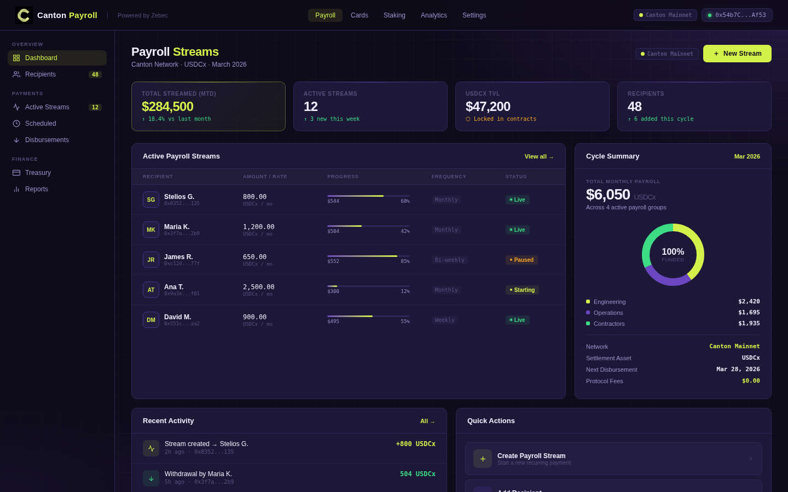
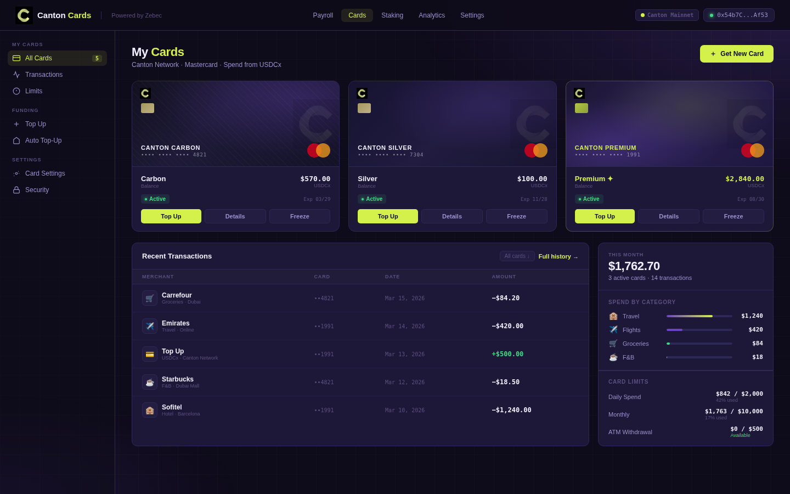

# Zebec X Canton / USDCx — Streaming Payroll & Programmable Payment Infrastructure for the Canton Ecosystem

## Development Fund Proposal

**Author:** Zebec Network  
**Status:** Draft  
**Created:** 2026-05-19  
**Label:** financial-workflows-composability

**[Champion](https://github.com/canton-foundation/canton-dev-fund/blob/main/sig-directory.md):**  
- _TBD_

---

## Abstract

Zebec Network proposes to build a public streaming payroll protocol on the Canton Network, funded through the Canton Protocol Development Fund. This infrastructure will be developed as a public good: the Canton/Daml smart contracts that power it will be open-sourced under Apache 2.0, the deployed instance will run non-custodially, and Zebec will operate the live hosted dApp as a self-funded reference instance for the ecosystem.

By introducing Zebec's streaming payroll, companies will be able to move treasury and payroll flows fully on-chain without fees, paying employees and contractors continuously while maintaining compliant and private financial workflows. Combined with Zebec's card infrastructure and its partnership with Circle — a lead investor in Zebec — this integration creates a holistic financial stack on Canton, where enterprises can pay employees, manage treasury, and enable real-world spending seamlessly.

This grant will fund the development and hosting of a live, production-grade payroll and token vesting dApp on Canton — freely accessible to every participant in the ecosystem, with no integration fees and no custom development required. Zebec brings immediate enterprise distribution to validate real-world adoption, with companies such as NTT Data (200K+ FTEs) and CGI Consulting (100K+ FTEs) in active discussion for stablecoin payroll adoption.

**Total Funding Request:**  
**1,072,000 CC** base (Phase 1 + Phase 2; ≈ US$150,000) +  
**up to 714,000 CC** optional (Phase 3; ≈ US$100,000) =   
**up to 1,786,000 CC** (≈ US$250,000).  
Reference rate: US$0.14 per CC at proposal date.

- **Phase 1 (~715,000 CC / ≈ US$100,000):** Payroll infrastructure build, integration, and white-label UI.
- **Phase 2 (~357,000 CC / ≈ US$50,000):** Verifiable enterprise and user adoption on Canton rails.
- **Phase 3 Optional (up to 714,000 CC / ≈ US$100,000):** Performance-based co-marketing with a named global enterprise.

Zebec will cover all costs related to ongoing maintenance of the infrastructure. No fees will be charged on the Canton payroll product unless otherwise agreed by Canton Foundation.

---

## Specification

### 1. Objective

Programmable payroll and token distribution infrastructure is foundational to Canton's enterprise adoption. Today, every project wishing to run payroll, make contractor payments, or vest tokens on Canton must build and maintain custom solutions from scratch — creating duplication of effort, security risk from unaudited contracts, and significant friction for ecosystem growth.

Zebec proposes to eliminate this friction by building, open-sourcing, and hosting a live, production-grade financial application on Canton — free to use for every participant in the ecosystem, with no integration fees and no custom development required. This is a public utility model: like a bridge or a road, the infrastructure exists once, is maintained centrally, and is accessible to all.

The single objective of this proposal is to deliver and operate a live, publicly accessible streaming payroll and token vesting dApp on Canton Network — with its Daml contracts open-sourced under Apache 2.0 — settled in USDCx and Canton-native assets, with measurable adoption by Canton ecosystem participants.

#### What "Publicly Accessible" Means

The stablecoin payroll and vesting dApp will be hosted live by Zebec and accessible to the entire Canton ecosystem at no charge:

- **Free to use** — no fees charged to any Canton ecosystem participant for the payroll or vesting dApp. Zebec covers all hosting, maintenance, and operational costs. All employer and monthly fees are waived for Canton ecosystem participants.
- **No integration required** — companies connect their Canton wallet and start immediately. No custom contract development, no SDK, no setup costs.
- **A live dApp, not a code repository** — the public good is a running, maintained application. Users benefit from Zebec's ongoing engineering, security monitoring, and product improvements automatically.
- **Open-source contracts** — the Daml smart contracts powering streaming payroll and token vesting are released under Apache 2.0; any Canton participant can audit, fork, or operate them independently.
- **Multi-asset by design** — the platform supports multiple Canton-native assets per transaction request.

### 2. Implementation Mechanics

#### Asset Support: USDCx, Canton Coin & Beyond

The dApp launches with full support for two core Canton-native assets, with the architecture designed to expand over time.

| Asset | Year 1 Support | Details |
|---|---|---|
| **USDCx** (Circle USD on Canton) | Full product support | Primary payroll and vesting settlement asset. Full feature set: streaming payroll, scheduled disbursements, token vesting, withdrawals, cancellations, and Zebec card loading. |
| **Canton Coin ($CC)** | Customer support tier | Supported as a disbursement and vesting asset in Year 1, with dedicated customer support. Full feature parity to be scoped based on ecosystem demand through the grant period. |
| **Additional Canton-native assets** | Governance-gated | New tokens follow a defined approval process:  • A token addition request is submitted to the Zebec Canton governance process.  • Validator approval is required from at least two active Canton validators — including confirmed ecosystem partners such as Lattice and Helius Finance ($5–10M on consumer cards and $10–20M on enterprise cards).  • Upon approval, the token is enabled across all payroll and vesting features at no additional cost. |

#### Token Vesting: A Second Public Utility

Beyond payroll, the same streaming infrastructure powers a token vesting tool for the Canton ecosystem — a capability that currently does not exist on the network. Project teams and DAOs can vest $CC, USDCx, or other Canton-native tokens to contributors, employees, and investors directly through the live dApp. This is immediately useful to Canton Foundation grant recipients, Super Validator programs, and any team distributing tokens to stakeholders.

#### How Streaming Payroll Works

An employer connects their Canton wallet to the Zebec dApp and selects recipients, amounts, duration, and payment frequency. The backend validates parameters and calculates the required USDCx. Once the employer approves the funding transaction, the streaming contract initialises: it records stream parameters, locks the employer's USDCx in a non-custodial on-chain escrow, deducts platform fees, and emits a StreamCreated event. The employer dashboard updates in real time.

On the contractor side, the streamed amount accrues in real time and is visible in the dApp. The contractor can initiate a withdrawal at any point — the contract calculates the vested amount based on elapsed time, transfers USDCx to the contractor's wallet, and updates its internal state.

On the Zebec Canton App, stream activity fees are collected in CC rather than ZBCN (as used on Solana), and these fees will be set at a reduced rate to keep the Canton payroll product competitive over our existing solutions on Solana and Stellar. Transaction fees are used by Zebec to ensure the continued maintenance and ongoing upgrades to the enterprise payroll solution on Canton.

#### Edge Cases and Error Handling

**Insufficient Balance:** The contract validates the sender has sufficient USDCx before initialising any stream, rejecting transactions where balance falls below stream amount plus fees.

**Early Withdrawal:** Only the time-weighted vested amount is releasable at any point, preventing over-withdrawal.

**Stream Cancellation:** Senders can cancel at any time. Vested amounts transfer to the recipient immediately; unvested amounts return to the sender.

**Pause/Resume:** Paused streams do not accumulate vested amounts. On resume, the end time adjusts proportionally.

#### Network Fee Schedule

Fees are calculated per individual streamed amount. On a $5M payroll, the generated $CC fees for burning fall between $5,000 and $12,500 depending on distribution of stream sizes.

| Streamed Amount per Individual | Rate | Monthly Network Fee |
|---|---|---|
| Headline range (on $5M payroll, current rates) | | $5,000 – $12,500 / mo (depends on distribution of individual stream sizes) |
| < $3,000 | 0.25% | $12,500 |
| $3,000 – $10,000 | 0.18% | $9,000 |
| > $10,000 | 0.10% | $5,000 |

#### Compliance, KYB & PII Handling

Payroll handles regulated counterparties and sensitive data. Zebec applies the following controls on the Canton dApp from day one:

- **On-chain sanctions and risk screening:** Hypernative provides real-time on-chain address risk and sanctions screening at stream creation, claim, and off-ramp.
- **KYB for corporate employers:** Gatenox (a Zebec subsidiary) performs Know-Your-Business verification of every employer entity before they can fund payroll on the platform.
- **Minimal PII off-chain, encrypted at rest:** Beyond the legal company information required for KYB, Zebec stores minimal personally identifiable information, encrypted at rest.
- **Private payroll on-chain:** Payroll streams on Canton are private and anonymised by virtue of Daml's sub-transaction privacy and signatory/observer visibility rules. Employee compensation is not publicly visible on the ledger; only counterparties to a stream see its terms.

#### Open Source, Custody & Continuity

This proposal's public-good guarantees rest on three architectural commitments:

- **Open-source Daml contracts (Apache 2.0).** All Canton/Daml smart contracts powering streaming payroll and token vesting — including the streaming payment agreement, escrow, vesting, and governance templates — will be released under the Apache 2.0 license, on a public Zebec repository, with developer documentation and a deployment guide. The Zebec backend, frontend (HR system connectors, organisation hierarchy, corporate card programme integration, payroll workflows), and proprietary integrations remain closed-source.
- **Non-custodial by design.** The Canton contracts run non-custodially, mirroring how Zebec's existing Solana programs operate. Zebec **never** takes custody of customer or corporate payroll funds. Funded streams are held in on-chain escrow whose state and disbursement rules are governed by Daml, not by Zebec.
- **Continuity if Zebec discontinues.** Because the contracts are non-custodial and open-source, ongoing payrolls continue to settle and complete as scheduled even if Zebec, as the dApp operator, were to discontinue the hosted service. Recipients retain their right to claim accrued funds from the on-chain escrow regardless of whether the Zebec frontend remains available. Any Canton participant can, in principle, operate a frontend against the published Daml contracts.
- **Zebec as the self-funded reference instance.** Zebec operates the hosted dApp as the live reference deployment of the open-source contracts — comparable in posture to BitSafe's CBTC reference instance on Canton MainNet — at its own cost for a minimum five years (see Maintenance Terms).

#### Illustrative Employer / User Dashboards

##### Payroll Management Dashboard

##### Card User Experience

#### Maintenance Terms

Zebec will actively maintain the live payroll application built on Canton Network, back-end infrastructure, and open-source Daml contracts for a minimum period of five years to be agreed with Canton Foundation and defined in the grant agreement.

Maintenance beyond the initial committed period will continue for as long as the platform remains in active use for payroll on Canton.

### 3. Architectural Alignment

This work aligns with Canton's architecture and ecosystem priorities in several concrete ways:

- **Daml rights-and-obligations model:** A streaming payroll agreement is, at its core, a multi-party contract with defined rights (the contractor's right to claim accrued funds), obligations (the employer's obligation to fund the stream), and state transitions (pause, resume, top-up, cancel). This is precisely the abstraction Daml was designed to express, making payroll arguably a more natural fit for Canton than for any chain Zebec has integrated to date.
- **Sub-transaction privacy:** Canton's privacy-preserving architecture and institutional focus make it well-suited for regulated industries requiring confidential transactions, compliance, and interoperable financial workflows. Daml's signatory/observer visibility rules map directly onto employer/contractor disclosure requirements for payroll.
- **Token standard alignment (CIP-0112 / Token Standard v2):** Daml fungible-token templates implementing the streaming asset will conform to the current canonical Canton token standard, with a forward path to CIP-0112 once finalised. The Daml templates are designed for forward-compatibility with the evolving standard.
- **Validator and Global Synchroniser participation:** Zebec will operate dedicated validators on Canton to support payroll, with DAR package deployment and domain connectivity through the Canton Global Synchroniser.
- **USDCx as enterprise settlement asset:** Positions USDCx on Canton as the default stablecoin for enterprise payroll across the Zebec ecosystem. With Circle as a lead investor in Zebec, USDCx can serve as a trusted enterprise settlement asset for on-chain payroll and payment infrastructure across sectors including neobanks, healthcare, logistics, and other regulated industries.
- **Closed-loop financial stack on Canton:** Employers stream salaries in USDCx in real-time or on schedule. Contractors receive payments directly to their wallets. Those funds can be spent immediately via Zebec Mastercard, or off-ramped through Canton Payments to fiat. Users never need to leave the Canton ecosystem.

### 4. Backward Compatibility

*No backward compatibility impact.* This is a new dApp deployed onto Canton; it does not replace or modify existing protocol components.

### 5. Dependencies & Risks

#### Dependencies

| Dependency | Status / Mitigation |
|---|---|
| **USDCx issuance on Canton** | Circle is a lead investor in Zebec and an aligned partner on this initiative; USDCx availability on Canton is on Circle's roadmap and a shared priority. |
| **Canton token standard (CIP-0112 / Token Standard v2)** | The dApp will be built to the current canonical token standard on Canton and migrate to CIP-0112 once finalised. Daml templates are designed for forward-compatibility. |
| **Canton Payments off-ramp coverage** | Last-mile fiat is provided by Canton Payments and Zebec Mastercard. The Zebec card rail (live across 20+ blockchains) acts as the immediate fallback where Canton Payments corridors are not yet active. |
| **Daml SDK and Splice toolchain** | Stable and actively maintained by Digital Asset. Zebec will engage with Digital Asset's developer documentation and community during the build. |

#### Risks

| Risk | Likelihood | Mitigation |
|---|---|---|
| Daml learning curve slows delivery | Low–Medium | Dedicated discovery and architecture period before production code; team has shipped on 20+ chains across paradigms (see Rationale); Daml's rights-and-obligations model is a natural fit for streaming payroll. |
| Enterprise adoption pipeline slips | Low–Medium | Multiple parallel target accounts (Deutsche Bank Allunity, NTT Data, CGI Consulting, MSG Systems, Adesso); SME/agency entry segment as a lower-friction fallback. |
| Canton ecosystem partner delay (e.g. Lattice, Helius Finance) | Low | Existing live integration with Lattice (card programme) reduces dependency risk; multiple ecosystem teams in pipeline. |
| Regulatory shifts in stablecoin payroll | Low | Zebec's existing $500M+ annual payroll volume on regulated rails; Gatenox KYB and Hypernative on-chain screening already in production. |

---

## Milestones and Deliverables

The grant is structured across three phases. Phase 1 covers technical integration, Phase 2 is tied to verifiable adoption on Canton rails, and Phase 3 covers optional joint marketing activations. Phases 1 and 2 together constitute the **1,072,000 CC** (≈ US$150,000) base grant; Phase 3 is optional, performance-based, and capped at **714,000 CC** (≈ US$100,000).

*Technical specifications and timelines are subject to refinement during the implementation phase.*

### Milestone 1.1: Deposit on Signing

- **Estimated Delivery:** Effective Date
- **Focus:** Kick-off and resourcing.
- **Deliverables:** Grant agreement executed; integration team allocated; project plan finalised.
- **Acceptance Criteria:** Signed grant agreement on file with Canton Foundation; 143,000 CC (≈ US$20,000) released.

### Milestone 1.2: Integration Complete

- **Estimated Delivery:** 2 months post Effective Date
- **Focus:** Integration of Canton Network and USDCx into the Zebec payroll flow in the Zebec app & platform, with Zebec running dedicated validators on Canton to support payroll.
- **Deliverables:** Daml streaming and escrow contracts (open-sourced under Apache 2.0); Zebec backend integrated with Canton participant node; RESTful API + OpenAPI specification; Zebec-operated Canton validator(s); testnet then mainnet deployment.
- **Acceptance Criteria:** End-to-end stream lifecycle (create, claim, pause/resume, top-up, cancel) demonstrated against Canton mainnet; Zebec validator(s) operational on the Global Synchroniser; Daml contracts published on Zebec's public GitHub under Apache 2.0 with developer documentation. 286,000 CC (≈ US$40,000) paid on completion.

### Milestone 1.3: UI/UX Complete

- **Estimated Delivery:** 2 months post Effective Date
- **Focus:** Canton-branded white-label payroll experience for enterprise onboarding.
- **Deliverables:** Employer dashboard, payroll run creation wizard, contractor claim interface, payment history, reports and exports (CSV/PDF), Canton ledger event analytics, mobile-responsive design.
- **Acceptance Criteria:** A Canton ecosystem participant can connect a Canton wallet and run an end-to-end payroll cycle through the live hosted dApp; UI shipped to production at a Canton-branded URL. 286,000 CC (≈ US$40,000) paid on completion.

### Milestone 2.1: Individual User Adoption

- **Estimated Delivery:** Duration of Term
- **Focus:** Verifiable adoption of Canton stablecoin payroll on the Zebec platform at the individual user level.
- **Deliverables:** At least 100 individual users having received payroll on Canton rails (USDCx or $CC) via the Zebec platform.
- **Acceptance Criteria:** On-chain transaction data showing ≥100 unique recipient parties claiming at least one streamed payment on Canton, shared with the Canton Foundation Tech & Ops Committee. 214,000 CC (≈ US$30,000) paid on verification.

### Milestone 2.2: First Enterprise Onboarded

- **Estimated Delivery:** Duration of Term
- **Focus:** Verifiable adoption at the enterprise level.
- **Deliverables:** At least one enterprise client running stablecoin payroll on Canton via Zebec, settling in USDCx.
- **Acceptance Criteria:** On-chain transaction data plus enterprise onboarding confirmation (signed customer agreement and live payroll cycle) shared with the Canton Foundation Tech & Ops Committee. 143,000 CC (≈ US$20,000) paid on verification.

### Milestone 3.1 (Optional): Enterprise Announcement

- **Estimated Delivery:** Duration of Term
- **Focus:** Amplify enterprise adoption through public announcement by a globally-recognised organisation. Target companies in active discussion include Deutsche Bank Allunity, NTT Data (200K+ FTEs), CGI Consulting (100K+ FTEs), MSG Systems, and Adesso.
- **Deliverables:** Public announcement by a named large enterprise that they have adopted stablecoin payroll on Canton via Zebec.
- **Acceptance Criteria:** Published press release, official enterprise communication, or equivalent public statement from the named enterprise, shared with the Canton Foundation. 357,000 CC (≈ US$50,000) paid on verification.

### Milestone 3.2 (Optional): Joint Marketing Activation

- **Estimated Delivery:** Duration of Term
- **Focus:** Co-branded marketing activation with the named enterprise, creating a 'domino-effect' of adoption.
- **Deliverables:** Joint marketing activation — case study, co-branded campaign, press feature, or conference appearance spotlighting the Canton deployment.
- **Acceptance Criteria:** Delivery of the published asset or event confirmation (case study link, campaign materials, or recorded conference session), shared with the Canton Foundation. 357,000 CC (≈ US$50,000) paid on verification.

### Phase 1 Workstream Summary

Phase 1 (Milestones 1.1–1.3) is scoped at approximately 13 weeks across six workstreams:

| Workstream | Headline Deliverables | Est. Duration |
|---|---|---|
| **Technical Foundation & Architecture** | Dev environment (Daml SDK, Canton Sandbox), JSON Ledger API v2 integration, TypeScript backend scaffolding, mapping of Zebec's Solana streaming primitives onto Daml's rights-and-obligations model, contract topology design (Employer signatory, Contractor observer→signatory on claim), event-driven integration with Zebec analytics and notifications | ~2.5 weeks |
| **Streaming Contracts (Daml)** | Fungible token template, EscrowAccount template, streaming payment agreement (Create/Claim/Cancel, Pause/Resume, TopUp, ScheduledStart, multi-schedule support), unit tests | ~2 weeks |
| **Backend & API** | Canton participant node integration, party allocation, Ledger API auth, business logic layer, event processor / indexer, reconciliation, RESTful API + OpenAPI spec | ~2.5 weeks |
| **Enterprise Payroll UI** | Organisation management, contractor onboarding, employer / contractor dashboards, payroll run wizard, reports and exports, mobile-responsive design | ~3 weeks |
| **Testing, Audit & Hardening** | Daml Script test suite, multi-party scenario tests, sandbox integration, external Daml audit, API security audit, load testing, testnet beta | ~1.5 weeks |
| **Mainnet Launch & Launch Comms** | Participant node provisioning, DAR upload, party onboarding, Global Synchroniser connectivity, production deploy, monitoring, runbooks, end-user docs and videos, launch comms | ~1.5 weeks |
| **Total** | | **~13 weeks** |

A detailed week-by-week breakdown is provided in [Appendix A](#appendix-a-phase-1-detailed-breakdown).

---

## Acceptance Criteria

The Tech & Ops Committee will evaluate completion based on:

- Deliverables completed as specified for each milestone
- Demonstrated functionality or operational readiness
- Documentation and knowledge transfer provided (including open-source release of Daml contracts under Apache 2.0)
- Alignment with stated value metrics

Per-milestone acceptance evidence is captured under each Milestone above. Phase 2 and Phase 3 milestones are explicitly verified against on-chain and public-record evidence — not artefact delivery — emphasising ecosystem value over delivery of internal artefacts.

---

## Funding

**Total Funding Request:** **1,072,000 CC** base (Phase 1 + Phase 2; ≈ US$150,000) **+ up to 714,000 CC** optional (Phase 3; ≈ US$100,000) = **up to 1,786,000 CC** (≈ US$250,000). Reference rate: US$0.14 per CC at proposal date.

### Payment Breakdown by Milestone

| Milestone | CC | USD (Ref) | Payment Trigger |
|---|---:|---:|---|
| 1.1 — Deposit on Signing | 143,000 CC | $20,000 | Execution of grant agreement |
| 1.2 — Integration Complete | 286,000 CC | $40,000 | Committee acceptance per Milestone 1.2 acceptance criteria (Daml contracts open-sourced; Zebec validator live; end-to-end stream lifecycle on mainnet) |
| 1.3 — UI/UX Complete | 286,000 CC | $40,000 | Committee acceptance per Milestone 1.3 acceptance criteria (live hosted dApp running end-to-end payroll cycle) |
| 2.1 — Individual User Adoption | 214,000 CC | $30,000 | ≥100 individual users having received payroll on Canton rails (on-chain evidence) |
| 2.2 — First Enterprise Onboarded | 143,000 CC | $20,000 | First enterprise running USDCx payroll on Canton via Zebec (on-chain + onboarding evidence) |
| **Base Total (Phase 1 + Phase 2)** | **1,072,000 CC** | **$150,000** | |
| 3.1 (Optional) — Enterprise Announcement | 357,000 CC | $50,000 | Public announcement by named global enterprise |
| 3.2 (Optional) — Joint Marketing Activation | 357,000 CC | $50,000 | Delivered joint marketing asset or event with named enterprise |
| **Optional Total (Phase 3)** | **714,000 CC** | **$100,000** | |
| **Grand Total (Max)** | **1,786,000 CC** | **$250,000** | |

Phase 3 is capped at a combined 714,000 CC (≈ US$100,000) per major marketing campaign.

### Zebec Fees Being Waived for Canton Network

Zebec operates a standard commercial pricing model for payroll infrastructure on other chains. For the Canton integration, all fees are being waived in full for the duration of the grant period. This reflects Zebec's conviction in Canton's enterprise potential and our commitment to building genuine ecosystem adoption.

| Fee Type | Standard Rate | Notes |
|---|---|---|
| Platform maintenance & support fee | $1,000 / month | Charged to network partners for ongoing dApp maintenance, infrastructure upkeep, and dedicated support. |
| Employer SaaS subscription | $3 / employer / month | Monthly access fee per employer account using the payroll platform. |
| Per-employee payroll fee | $3 / employee / month | Charged per active employee receiving payroll through the platform each cycle. |
| Estimated monthly value at scale | ~$5,500 / month | Based on projected Year 1 adoption of 75 enterprise clients and 1,500 active users. |

Zebec is waiving all platform, SaaS, and per-employee fees for Canton payroll users for the duration of the grant period. This represents approximately $5,500 per month in foregone commercial revenue (based on our target of bringing over 75 clients and 1,500 active users from existing clients, estimated on current activity on Solana) — a direct contribution to the Canton ecosystem that sits alongside the grant itself. We are committed to offering a free product for the Canton ecosystem as Zebec is a strong believer in the network and long-term opportunity.

### Volatility Stipulation

The grant is denominated in Canton Coin (CC), with reference USD figures provided at **US$0.14 per CC** as of the proposal date. Because Phase 2 and Phase 3 adoption milestones run beyond 6 months, the CC amounts for any milestones not yet paid at the 6-month mark will be re-evaluated against then-prevailing CC market conditions, per the Foundation's >6-month policy. Any adjustments will be negotiated between Zebec and the Tech & Ops Committee.

---

## Co-Marketing

Upon release, Zebec will collaborate with the Foundation on:

- **Announcement coordination** — joint launch comms across Zebec, Circle, and Canton Foundation channels.
- **Case study or technical blog** — including a public case study on porting Zebec's streaming primitives onto Daml/Canton.
- **Developer or ecosystem promotion** — promotion of the live payroll and vesting dApp, and of the open-source Daml contracts, to Canton ecosystem teams, Super Validators, and grant recipients.

### Specific Commitments

- **Circle Partnership Amplification:** As partners with Circle, we will integrate USDCx on Canton into Circle's Wallet as a Service product, create dedicated onboarding flows prioritising Canton USDCx, and co-market the solution to Circle's enterprise client base. This positions Canton as the recommended chain for streaming use cases, with 24/7/365 settlement — no banking hours constraints.
- **Phase 3 Optional Activations:** Public announcement and joint marketing activation with a named large enterprise (targets in active discussion include Deutsche Bank Allunity, NTT Data, CGI Consulting, MSG Systems, Adesso), structured to amplify enterprise adoption of Canton stablecoin payroll through joint marketing with globally-recognised organisations, creating a 'domino-effect' of adoption.

---

## Motivation

### Current Market Position

Zebec has established itself as a market leader in blockchain-based payroll and streaming payments:

- **$500M+ Annual Payroll Volume:** Processing real-world payroll for 12,000+ employees and contractors, and 280+ enterprise clients through our acquisitions of Paybridge and School Payroll Services (SPS).
- **$60M+ Card Transaction Volume:** Facilitating seamless crypto-to-fiat spending through Zebec Silver and Carbon Mastercard programs across 20 blockchain networks (including Canton) and over 160 individual tokens.
- **50,000+ Active Users:** Building one of the largest user bases in Web3 payroll and payments.
- **65K Cards Issued:** Driving real-world adoption of crypto through everyday payments at scale.
- **5+ Years of Protocol Development:** Zebec Protocol was launched in 2021 as the foundational streaming payments infrastructure on Solana.

### Strategic Value for Canton

#### 1. USDCx as the Default Enterprise Payroll Stablecoin

This proposal positions USDCx on Canton as the default stablecoin for enterprise payroll across the Zebec ecosystem. Canton's privacy-preserving architecture and institutional focus make it well-suited for regulated industries requiring confidential transactions, compliance, and interoperable financial workflows. With Circle as a lead investor in Zebec, USDCx can serve as a trusted enterprise settlement asset for on-chain payroll and payment infrastructure across sectors including neobanks, healthcare, logistics, and other regulated industries.

#### 2. Circle Partnership Amplification

As partners with Circle, we will integrate USDCx on Canton into Circle's Wallet as a Service product, create dedicated onboarding flows prioritising Canton USDCx, and co-market the solution to Circle's enterprise client base. This positions Canton as the recommended chain for streaming use cases, with 24/7/365 settlement — no banking hours constraints.

#### 3. Complete Cross-Border Financial Ecosystem

The integration creates a closed-loop financial stack on Canton. Employers stream salaries in USDCx in real-time or on schedule. Contractors receive payments directly to their wallets. Those funds can be spent immediately via Zebec Mastercard, or off-ramped through Canton Payments to fiat. Users never need to leave the Canton ecosystem.

#### 4. Enterprise Adoption Catalyst

Zebec's existing enterprise relationships provide immediate distribution. Our pipeline includes Fortune 500 firms interested in stablecoin payroll as an HR offering, with direct integrations into major payroll processors including Asure HCM. We are targeting SMEs and agencies with international contractors as the initial entry point, with white-label solutions enabling other fintechs and neobanks to offer USDCx-based payroll on Canton.

### Confirmed & Pipeline Ecosystem Adoption

Adoption is already underway. Lattice, Canton's first neobank, is a confirmed integration partner — Zebec already powers their enterprise card program, and Canton payroll extends this into a full-stack financial infrastructure relationship. Helius Finance has expressed confirmed interest in integrating Canton payroll and payment streaming, with conversations ongoing.

Beyond these, Zebec is actively approaching existing projects already running on other supported chains. Enabling Canton as an additional chain is a zero-cost addition for these teams, accelerating network adoption without requiring new builds.

A particularly strong target segment is the TradFi validator community. Apollo and DTCC are active Canton validators — already acquainted with the network and its privacy-preserving architecture. Both operate workforces and contractor networks of 10,000+ FTEs, making them a natural fit for on-chain payroll. Their existing presence on Canton means zero chain-education overhead; Zebec's role is simply to provide the payroll layer they currently lack.

### Year 1 Ambition (Projections)

Beyond the binding Phase 2 acceptance triggers (100 users / 1 enterprise), Zebec's 12-month ambition for the Canton deployment is significantly higher. These are projections — not payment triggers — reflecting the addressable opportunity once the dApp is live:

| Metric | Year 1 Target | Rationale |
|---|---|---|
| Volume Processed | $20M+ | Active payroll wallets × average ~$13K of streamed volume each, scaled from current Zebec multi-chain payroll mix |
| USDCx TVL | $3M+ | Active streaming pools, user balances, and escrow contracts |
| Active Wallets | 1,500+ | SMEs and agencies with international contractors, plus migrating Zebec users |
| Enterprise Clients | 50+ | SMEs and agencies as the initial entry segment |
| Canton Payments Off-Ramps | 5,000+ | ~400 / month average over Year 1 |
| Developer Integrations | 10+ | Wallet and SDK adoption by Canton ecosystem projects for payroll features |

#### Key Performance Indicators

**User adoption:** New Canton wallet activations per month via Zebec; employer account growth rate; contractor wallet engagement; Canton Payments off-ramp adoption rate.

**Financial metrics:** Average payment stream size (USDCx); total value streamed (cumulative USDCx volume); USDCx volume through Canton vs other networks; revenue per transaction.

**Ecosystem impact:** Number of Canton Payments payout corridors active; countries with active fiat off-ramps; average time from stream to fiat receipt; reduction in cross-border payment costs vs traditional methods.

**Technical performance:** Contract execution success rate (target: >99.9%); system uptime and reliability.

### Who Benefits

- **Neobanks (e.g. Lattice — confirmed):** Offer payroll and payment streaming to their users directly within their Canton-native banking product, powered by Zebec's live infrastructure.
- **DeFi protocols & project teams:** Run token vesting for contributors, grants, and investor distributions using the live vesting tool. No custom smart contracts needed.
- **Canton ecosystem companies:** Pay employees and contractors in USDCx or $CC immediately, using the hosted dApp. Zero setup cost, zero custom development.
- **Existing multi-chain projects:** Teams already using Zebec on other chains can enable Canton as an additional network at no cost — instantly bringing their existing user base onto Canton.
- **Canton Foundation & Super Validators:** Point to a complete, live financial stack on Canton — payroll, treasury, vesting, and card spending — as concrete proof of institutional-grade infrastructure.

---

## Rationale

### Why a Hosted, Open-Source, Non-Custodial Public Utility

The default approach for ecosystem-funded payroll could have been an open-source SDK or contract library that other Canton teams build on. We considered that, and concluded a richer model serves the ecosystem better: open-source the on-chain primitives **and** run the live reference instance. Every project building its own payroll on top of a library alone still has to audit, host, monitor, and operate it — recreating the same duplication of effort, security risk, and friction that motivates the grant. A hosted dApp paired with open-source Daml contracts eliminates this entirely: the infrastructure exists once, is maintained centrally, is accessible to all, and any participant retains the option to operate it independently.

The model rests on three guarantees, set out in §2 Implementation Mechanics and worth restating here as the rationale for funding a hosted deployment rather than a library-only deliverable:

- **Open-source Daml contracts under Apache 2.0** — the on-chain primitives are public goods in the strictest sense, auditable and forkable by any Canton participant.
- **Non-custodial operation** — Zebec never touches customer or corporate payroll funds; escrow lives on-chain under Daml-governed rules.
- **Continuity by construction** — because the contracts are non-custodial and open-source, in-flight payrolls complete as scheduled regardless of whether Zebec continues to operate the hosted frontend. Any Canton participant can run a frontend against the published contracts.

This is directly comparable to BitSafe's CBTC reference instance: open-source tooling on Canton Foundation–aligned terms, with a self-funded production reference operated by the contributor. Zebec has the operating muscle to run that reference (12,000+ employees and contractors on payroll today, $500M+ annual volume), and is committing to a five-year minimum maintenance term in the grant agreement.

This proposal also does not duplicate any existing Canton component. Token vesting in particular is a capability that currently does not exist on Canton; the streaming payroll engine doubles as the vesting engine, which is immediately useful to Canton Foundation grant recipients, Super Validator programs, and any team distributing tokens to stakeholders.

### Team & Execution Capability

#### Leadership

- **Simon Babakhani (CEO):** 10+ years Wall Street experience (Bain Capital, Parthenon Capital), expertise in financial infrastructure.
- **Elena Solovyov (CMO):** Marketing strategist with leadership roles across Fortune 100s, startups, and global policy groups. C-suite advisor, published author, and award-winning brand builder.
- **Kian Schreiber (CTO):** Seasoned global entrepreneur and investor. Built Germany's first altcoin exchange. Leads Zebec's product innovation at the Web2–Web3 frontier.
- **Neal Padhye (Head of M&A):** Duke University graduate with a decade in investment banking at Apollo, BlackArch, and Northlane. Leads Zebec's acquisition strategy and deals pipeline.
- **Stelios Gerogiannakis (Head of Engineering):** 20+ years engineering experience (LSEG, RBS, Cosmos), with expertise in payments, blockchain and robust system design.
- **Technical Leadership:** Combined 50+ years in payments and blockchain engineering.

#### Execution Track Record

- **$500M+ in annual payroll volume:** Successfully handling massive real-world volume.
- **Enterprise Acquisition:** Acquired and integrated traditional US payroll processors (Paybridge, School Payroll Services).
- **Multi-Chain Deployment:** Launched multiple card programs supporting 20 blockchains including Canton Network.
- **Partnership Success:** Established relationships with Circle, Mastercard, MLS teams, 150+ Web3 projects.
- **Production Readiness:** 4+ years of battle-tested smart contracts in production on Solana.

### Team Technical Competence & Delivery Track Record

#### Already Operating on Canton

Zebec is not approaching the Canton ecosystem as an outsider. In February 2026, Zebec partnered with Lattice Finance — the first neobank built on Canton — to launch the Lattice Card Program: a Mastercard debit card with native CC token support and stablecoin funding, delivered on Canton's privacy-preserving infrastructure. This live integration means that Zebec's engineering team has already worked with Canton's participant node architecture, token models, and settlement flows in a production context. The streaming payroll proposal extends an existing relationship with the Canton ecosystem, not a cold start.

#### Proven Multi-Chain Delivery at Scale

Zebec currently supports over 20 blockchains — more than any other card or payments protocol in the industry. What makes this significant for a Daml build is not the number itself, but the diversity of the chains and the speed at which the team ships new integrations. As Zebec's COO has noted publicly, adding a new blockchain takes the team weeks, not months. Each integration requires the engineering team to internalise a new runtime, a new transaction model, new RPC patterns, and new token standards — and then deliver a production-grade integration against them.

**The portfolio of completed integrations demonstrates that this is not a team limited to a single VM or a single smart contract paradigm:**

**Native smart contract porting (Solana → Stellar/Soroban).** In Feb 2026, the Stellar Development Foundation selected Zebec as its global stablecoin payroll infrastructure provider — the first native deployment of Zebec's streaming payroll outside Solana. This required porting Zebec's core streaming primitives from Solana's Rust/Anchor runtime to Stellar's Soroban smart contract environment (also Rust, but with a fundamentally different execution model: no accounts/PDAs, WASM-based, with Stellar's unique ledger and asset model). The team delivered this while simultaneously maintaining the existing Solana product. This is directly analogous to what is proposed for Canton: taking a proven streaming payroll system and re-expressing it in a new smart contract language (Daml) on a new ledger runtime.

**Privacy-first chains (Aleo, Zano).** Zebec is integrated with Aleo, a Layer 1 blockchain built entirely on zero-knowledge proofs where all computation is private by default, with smart contracts written in Leo (a Rust-inspired ZK-native language). Zebec is also integrated with Zano, a privacy-by-default Layer 1 where all assets, tokens, and transactions are fully shielded. These integrations required the team to work with privacy-preserving transaction models, encrypted state, and novel cryptographic primitives — experience that maps directly to Canton's sub-transaction privacy model and Daml's signatory/observer visibility rules.

**Legacy and non-standard chains (Dash, XDB Chain).** Zebec integrated Dash — a chain with a UTXO transaction model, masternode consensus, and its own BIP70 payment protocol — requiring the team to adapt to a payment architecture fundamentally different from the account-based EVM model. Zebec also integrated XDB Chain (formerly DigitalBits), a Layer 1 designed for branded digital assets with limited public documentation and a small developer community. Successfully delivering on chains with sparse tooling and minimal community support is precisely the muscle needed for Daml, which has a smaller developer ecosystem than Solidity or Rust-based chains.

**EVM and non-EVM breadth.** Beyond the above, Zebec operates across Ethereum, BNB Chain, Base, Arbitrum, NEAR, SUI, Tron, TON, and others — spanning EVM-compatible chains, Move-based chains (SUI), and sharded architectures (NEAR). Each required the team to adapt wallet infrastructure, transaction signing, token standards, and event processing to a different runtime.

#### What This Means for Daml

Daml is a new language for the Zebec team, and we are transparent about that. But the track record above demonstrates something more important than prior Daml experience: a repeatable, proven capability to learn a new chain's primitives, re-express Zebec's core streaming logic in the native paradigm, and ship to production — typically in weeks.

Daml's declarative, rights-and-obligations model is arguably a more natural fit for payroll than any chain Zebec has integrated to date. A streaming payroll agreement is, at its core, a multi-party contract with defined rights (the contractor's right to claim accrued funds), obligations (the employer's obligation to fund the stream), and state transitions (pause, resume, top-up, cancel). This is precisely the abstraction that Daml was designed to express. The team's challenge is learning Daml's syntax and toolchain, not its conceptual model — and the former is a matter of weeks for engineers who have already shipped across 20+ chains with many different paradigms.

To de-risk the Daml learning curve, we suggest a dedicated discovery and architecture period before any production code is written. The team will engage with Digital Asset's developer documentation, the Daml community forum, and — where available — Canton ecosystem partners who can provide technical guidance during the build.

---

## Appendix A: Phase 1 Detailed Breakdown

Detailed week-by-week scope for Phase 1, retained for transparency. Final sequencing will be confirmed during the discovery and architecture period.

| Workstream | Deliverables | Est. Time |
|---|---|---|
| **Technical Foundation** | Dev environment setup (Daml SDK, Canton Sandbox) · JSON Ledger API v2 endpoints · TypeScript backend scaffolding | 1 week |
| | Map Zebec's Solana streaming primitives (SPL token locks, PDA-based escrow, clock-based disbursement) to Daml's rights-and-obligations model · Define contract topology: Employer (signatory), Contractor (observer → signatory on claim), etc · Identify Canton-specific patterns · Design integration between Zebec backend and Canton participant node · Plan event-driven architecture: Canton ledger transaction streams → Zebec event processor → analytics and notification services | 1.5 weeks |
| **Streaming Contracts** | Implement a fungible token template in Daml · EscrowAccount template (signatory / observer) · Unit tests | 1 week |
| | Streaming payment agreement (Employer, Contractor) · Core payroll fields: (sender, recipient, …) · Actions: Create, Claim, Cancel · Daml contract key for efficient lookup | 0.5 week |
| | Pause / Resume with timestamp tracking · TopUp (add funds to a running stream) · ScheduledStart (startTime in the future) · Multi-schedule support (different disbursement intervals) | 0.5 week |
| **Backend & API** | Backend service interface with the Canton participant node · Daml contract creation, party allocation and user management · Auth against the Ledger API auth services · Connection management for multiple participants | 1 week |
| | Business logic layer (Zebec's payroll workflows onto Canton contract operations) · Event processor/indexer · Reconciliation service / state validation · Integration with existing Zebec infrastructure: user management, organisation hierarchy, notification service,... | 1 week |
| | RESTful API endpoints · OpenAPI specification · API auth'n / auth'z layer | 0.5 weeks |
| **Ent. Payroll UI Development** | Organisation management module · Contractor onboarding flow · Organisation-level settings (payment intervals, preferences, approval workflows,...) | 1 week |
| | Employer dashboard view · Payroll run creation wizard · Active payrolls dashboard & operations · Stream detail view · Contractor dashboard view · Claim interface · Payment history · Mobile-responsive design | 1 week |
| | Payroll reports · Export to CSV/PDF · Canton ledger event analytics · Dashboard widgets for employer overview | 1 week |
| **Testing & Audit** | Comprehensive Daml Script test suite · Financial calculations testing · Multi-party scenario tests (creation, pauses, claims) · Canton sandbox integration · Daml contract review · Canton participant node review · API security audit · External Daml audit | 1 week |
| | Full end-to-end test suite · Load testing against Canton sandbox · Testnet beta deployment · Bug fixes and performance optimisation | 0.5 weeks |
| **Mainnet Launch** | Participant node provisioning on Canton Network · DAR package upload · Party onboarding workflow · Domain connectivity verification with Canton Global Synchroniser | 0.5 weeks |
| | Production deployment · Monitoring and alerting · Operational runbooks · End-user guides and videos · Marketing collateral and launch communications | 1 week |
