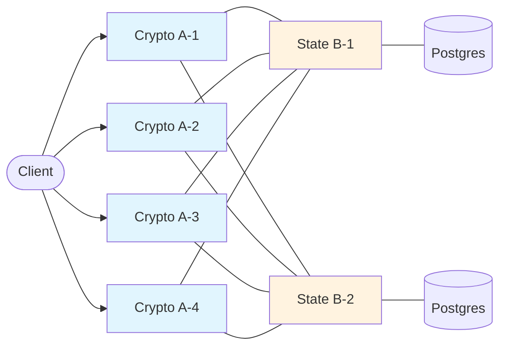

# Development Fund Proposal

## Bipartite Supervalidator Architecture: Separating Crypto from State for Horizontal Scaling

| Field | Value |
| :---- | :---- |
| Author | Elliott Dehnbostel |
| Status | Draft |
| Created | 2026-04-15 |
| Label | global-synchronizer-scaling |
| Champion | need Champion |

---

# Abstract

This proposal requests funding to design, implement, and validate a bipartite supervalidator architecture that separates CPU-bound cryptographic operations from IO-bound state management into two independently scalable machine classes. Proof-of-concept benchmarks using Canton's actual cryptographic primitives (ECDH P-256, AES-256-GCM, Ed25519) demonstrate **4x throughput improvement and 7x latency reduction** compared to monolithic supervalidators under identical total compute budgets.

Today, a Canton supervalidator runs participant, sequencer, and mediator processes on a single machine. Per-transaction ECIES view encryption for multi-party confidentiality consumes 35-43% of CPU, competing with database writes on the BFT consensus critical path for the same cores. This proposal introduces two machine classes — stateless **Crypto Engines** (Class A) that handle asymmetric encryption/decryption and Daml reinterpretation, and stateful **State Coordinators** (Class B) that handle BFT consensus, sequencer event storage, mediator aggregation, and ACS management — enabling each to scale along its natural axis: A scales horizontally with commodity compute, B scales vertically with faster storage.

This work is a public good: all code will be contributed to the Canton open-source repository, and the architecture is designed to be transparent to application developers — existing Daml applications and participant configurations require no changes.

---

# Motivation

## The Supervalidator Bottleneck

Super Validators on the Canton Network run the full stack: participant (transaction processing), sequencer (BFT ordering and event delivery), and mediator (confirmation aggregation). As transaction volume grows, these machines hit a fundamental CPU saturation problem.

JFR profiling of Canton 3.4.11 running 200 transactions against real PostgreSQL confirms that per-transaction CPU time is dominated by asymmetric cryptography for Canton's sub-transaction privacy model:

| Operation | % of CPU (measured) | Source |
| :---- | :---- | :---- |
| Ed25519 signing (Tink) | 21.5% | `JcePureCrypto.signBytes` → Google Tink `Field25519.product/square` |
| EC/ECDH key agreement (BouncyCastle) | 15.7% | `JcePureCrypto` → BouncyCastle `X25519Field.mul/sqr` |
| Digests + AES | 1.0% | BouncyCastle digests, JCE AES |
| **Total crypto** | **38.2%** | |
| Canton internals | 10.2% | Topology, tracing, validation, BFT state machine |
| Daml engine (interpret + reinterpret) | 8.0% | `Engine.submit`, `Engine.reinterpret` |
| Protobuf serialization | 5.1% | `GeneratedMessageV3` |
| gRPC networking | 2.8% | Netty + gRPC internals |
| PostgreSQL | 1.2% | IO-wait, not CPU (thread parked on socket) |
| Framework (Scala, Pekko, JVM) | 17.0% | Collections, concurrency, invoke |

*Methodology: JDK Flight Recorder (JFR) execution samples on Canton 3.4.11 release build, PostgreSQL 16 storage, 200 ping transactions after 10-transaction warmup.*

A second profile isolated the **SV-only workload** by running the submitting participant in a separate JVM process. The SV process (sequencer + mediator + confirming participant) was profiled independently:

| Operation | All-in-one | SV-only |
| :---- | :---- | :---- |
| **Total crypto** | **38.2%** | **42.7%** |
| Ed25519 signing/verify (Tink) | 21.5% | 26.7% |
| EC/ECDH (BouncyCastle) | 15.7% | 14.6% |
| Canton internals | 10.2% | 16.5% |
| Daml engine | 8.0% | 0.0% |
| Protobuf | 5.1% | 0.0% |
| PostgreSQL | 1.2% | 1.2% |

Crypto's share **rises to 42.7%** on the SV because the Daml engine and protobuf serialization work (13% combined) lives on the submitting participant, not the SV. The SV's crypto is dominated by BFT consensus signing (Ed25519 for PrePrepare/Prepare/Commit messages), mediator verdict signing, and ECDH for view decryption when the SV's participant is a confirmer.

The core problem: **CPU-bound elliptic curve math consumes 38-43% of CPU.** A single supervalidator node has a fixed number of cores. Adding transactions means adding ECIES operations, and eventually the node's cores are fully saturated — no room to process more.

The bipartite split addresses this by adding **dedicated crypto capacity** via stateless A nodes. The B node keeps its existing cores for DB writes, protocol orchestration, and BFT consensus. The A nodes provide additional cores exclusively for ECIES encryption and decryption. The total CPU available to the system increases, and the crypto work — which is the dominant cost — can scale horizontally by adding more A nodes.

This matters for the Canton Network because:

1. **Throughput ceiling.** Each transaction requires O(SV) ECIES operations (~0.4ms per recipient). With 20 SVs and 2 views per CC transfer, that's ~16ms of crypto per transaction. A single node's cores can only process so many concurrent ECIES operations. The bipartite split adds more cores for crypto without requiring the B node to be upgraded.

2. **Latency under load.** At high concurrency, many transactions' ECIES operations compete for the same cores. Our benchmark shows monolithic p50 of 260ms at 32 concurrent transactions on 2 cpus. With 4 additional A-node cpus, p50 drops to 38ms — proportional to the additional crypto capacity. More cores means each transaction's crypto work starts and finishes sooner.

3. **Cost-efficient scaling.** A nodes are stateless — no database, no persistent storage, no BFT state. They can run on commodity hardware or spot/preemptible instances. B nodes need fast NVMe and reliable uptime but don't need many cores. Each machine class uses hardware matched to its workload, reducing cost per transaction compared to scaling a monolithic node vertically.

## Why Now

The ISS-based parallel BFT ordering service (funded under a separate grant) removes the sequencer backend as a throughput bottleneck. Once ordering can sustain 2500+ TPS, the next binding constraint becomes **per-node transaction processing** — specifically the ECIES encryption and Speedy reinterpretation that every confirming participant must perform. This proposal addresses that next bottleneck.

---

# Specification

## 1. Objective

Implement a production-ready bipartite supervalidator architecture where:

- **Class A nodes (Crypto Engines)** perform all CPU-intensive asymmetric cryptography and Daml engine reinterpretation. They are stateless, horizontally scalable, and can run on commodity hardware including spot/preemptible instances.
- **Class B nodes (State Coordinators)** perform BFT consensus state machine transitions, sequencer event storage, mediator response aggregation, conflict detection, ACS updates, and commitment computation. They are stateful, IO-optimized, and scale vertically with faster storage.
- **Transactions flow A → B → A → B**: preparation on A, ordering on B, validation on A, finalization on B.
- **The split is transparent** to Daml applications, external participants, and the sequencer API.

## 2. Implementation Mechanics

### 2.1 Transaction Pipeline Split

The existing Canton transaction pipeline has natural cut points between CPU-bound and IO-bound work:

**Phase 1 (on A — submission preparation):**
- Receive command from client, execute Speedy interpretation
- Construct transaction view trees (Merkle trees, blinding, salted hashes)
- ECIES session key generation + asymmetric encryption for each recipient participant
- AES-256-GCM encryption of serialized view payloads
- Ed25519 root hash signing, protobuf serialization
- Forward ready-to-sequence `ConfirmationRequest` bytes to B

**Phase 2-3 (on B — sequencing + mediation):**
- BFT consensus ordering (PBFT state machine, store-before-send)
- Sequencer event writes (`sequencer_events`, `sequencer_event_recipients`)
- Mediator confirmation request validation (submitter signature verify, quorum setup)
- Dispatch encrypted views to A for validation

**Phase 4 (on A — confirmation validation):**
- ECIES session key decryption, AES-GCM view payload decryption
- Daml/Speedy reinterpretation (`ModelConformanceChecker.check`)
- Authorization and consistency checks
- Ed25519 confirmation response signing

**Phase 5-7 (on B — verdict + finalization):**
- Mediator response aggregation and verdict
- Conflict detection (ACS locking), contract store writes
- ACS commitment computation and exchange

### 2.2 A-B Communication Protocol

A new gRPC service definition for the A↔B dispatch:

**PrepareService** (client → A → B):
- `Prepare(command, submitterInfo, topologyHints) → PreparedConfirmationRequest`
- A performs full Phase 1 crypto, returns encrypted bytes ready for sequencing

**ValidateService** (B → A → B):
- `Validate(encryptedViews, recentContracts, packageHints, recipientIndex) → SignedConfirmationResponse`
- B dispatches encrypted views with a `recentContracts` map (contracts written in the last few seconds that may not have replicated to A's read replica yet)
- A decrypts, reinterprets, signs, returns verdict

### 2.3 A Node State Management

A nodes are "almost stateless" — they need read-only access to:

- **Daml packages:** Immutable once uploaded. Each A maintains a warm cache, refreshed from a PostgreSQL streaming read replica of B's participant database.
- **Contract instances:** For Speedy's `ResultNeedContract` callback. Served from the read replica, supplemented by the `recentContracts` map shipped with each `ValidateRequest` from B.
- **Topology snapshots:** For recipient resolution and public key lookup. Cached with short TTL; changes infrequently.
- **Crypto keys:** Own signing key (in memory or local HSM), others' public keys (from cached topology).

The `recentContracts` map eliminates consistency concerns from replication lag: B ships any contracts written in the last few seconds with the dispatch message, so A never needs to wait for replication.

### 2.4 B Node Orchestration

B maintains a pool of A node connections, load-balancing crypto dispatches across healthy A machines. The existing Canton `SequencerClient` and `GrpcSequencerConnectionPool` patterns provide the model for connection management, health checking, and failover.

Key changes to Canton internals:
- `ModelConformanceChecker.check()` → dispatch to A via `ValidateService` instead of in-process `DAMLe.reinterpret()`
- `EncryptedViewMessageFactory.create()` → dispatch to A via `PrepareService` instead of in-process ECIES
- `TransactionProcessingSteps.constructPendingDataAndResponse` → collect results from A dispatch instead of local parallel checks

### 2.5 Failure Handling

- **A dies during Phase 1:** Client retries submission to a different A. No state to recover.
- **A dies during Phase 4:** B detects timeout, re-dispatches to another A. Reinterpretation is idempotent — pure read-only computation.
- **B dies:** Standard BFT fault tolerance. Other B nodes continue consensus. Mediator and ACS state recover from DB.

## 3. Architectural Alignment

This work aligns directly with Canton's existing architecture:

- **Participant, sequencer, and mediator are already independent processes** communicating via gRPC. The bipartite split further decomposes the participant's internal pipeline without changing inter-node protocols.
- **The KMS driver API** (`CryptoPrivateApi`, `KmsDriver`) already provides an async signing abstraction that naturally extends to remote crypto workers. The `EitherT[FutureUnlessShutdown, ...]` return types support network round-trips without blocking.
- **The `BlockOrderer` trait** provides a clean interface (`subscribe`, `send`, `acknowledge`) that could support a networked boundary between BFT ordering and sequencer state management within B.
- **Canton's sub-transaction privacy model** — where each view is encrypted per-recipient — is the source of the ECIES cost. This proposal doesn't change the privacy model; it makes the cost scalable.

Relevant CIPs: This work complements the ISS-based BFT ordering proposal by addressing the next throughput bottleneck after sequencer ordering is no longer the constraint.

## 4. Backward Compatibility

**No backward compatibility impact for application developers.** Daml applications, Ledger API clients, and participant configurations are unchanged. The bipartite split is internal to the supervalidator deployment topology.

**Deployment flexibility:** Operators can choose to run monolithic (today's model) or bipartite (A+B split) based on their throughput requirements. The bipartite mode is an opt-in deployment configuration, not a protocol change.

---

# Milestones and Deliverables

## Milestone 1: Design & Proof of Concept Validation

- **Estimated Delivery:** 6 weeks from grant approval
- **Focus:** Finalize the A↔B protocol design, validate the cost model with instrumented Canton builds, deliver a working PoC
- **Deliverables / Value Metrics:**
  - Detailed design document with gRPC service definitions for PrepareService and ValidateService
  - Instrumented Canton build with per-phase timing metrics on the actual transaction pipeline (validating the cost model against real workloads, not just synthetic benchmarks)
  - Extended PoC benchmark demonstrating scaling across configurations (1A+1B through 8A+2B)
  - CIP draft for community review

## Milestone 2: Core Implementation — A Node (Crypto Engine)

- **Estimated Delivery:** 10 weeks from grant approval
- **Focus:** Implement the Crypto Engine as a standalone Canton component
- **Deliverables / Value Metrics:**
  - `PrepareService` implementation: receives commands, performs view tree construction, ECIES encryption, signing
  - `ValidateService` implementation: receives encrypted views + `recentContracts` map, performs ECIES decryption, Speedy reinterpretation, response signing
  - PostgreSQL read replica integration for package and contract lookup
  - Unit and integration tests covering: correct encryption/decryption round-trip, Speedy reinterpretation equivalence with in-process execution, failure/timeout handling
  - Containerized deployment (Docker image)

## Milestone 3: Core Implementation — B Node (State Coordinator) + Integration

- **Estimated Delivery:** 16 weeks from grant approval
- **Focus:** Modify participant internals to dispatch crypto work to A nodes; integrate with existing sequencer and mediator
- **Deliverables / Value Metrics:**
  - Modified `ModelConformanceChecker` dispatching to remote A nodes for reinterpretation
  - Modified `EncryptedViewMessageFactory` dispatching to remote A nodes for view encryption
  - A-node connection pool with health checking, load balancing, and failover
  - `recentContracts` map construction and inclusion in dispatch messages
  - Configuration toggle: `participant.bipartite.enabled = true/false` with A-node pool configuration
  - Integration tests: full transaction lifecycle through A→B→A→B pipeline
  - Performance benchmarks: throughput and latency comparison (monolithic vs bipartite) on Canton's integration test suite

## Milestone 4: Production Hardening & Documentation

- **Estimated Delivery:** 20 weeks from grant approval
- **Focus:** Production readiness, operational tooling, documentation
- **Deliverables / Value Metrics:**
  - Monitoring and observability: per-phase latency metrics, A-node pool health dashboards, dispatch error rates
  - Graceful degradation: fallback to local crypto if all A nodes are unavailable
  - Operational documentation: deployment guide, sizing recommendations (A:B ratio calculator based on workload characteristics), troubleshooting guide
  - Security review: ensure the A↔B communication channel doesn't weaken Canton's security model (encrypted dispatch, authenticated A nodes)
  - Load testing at scale: sustained throughput benchmarks with realistic multi-party transaction patterns

## Milestone 5: Deployment on Global Synchronizer TestNet

- **Estimated Delivery:** 24 weeks from grant approval
- **Focus:** Deploy bipartite architecture on TestNet, validate under real network conditions
- **Deliverables / Value Metrics:**
  - Bipartite supervalidator deployment on Global Synchronizer TestNet
  - Demonstrated throughput improvement over monolithic baseline under sustained load
  - Latency measurements under varying A:B ratios
  - Operational runbook validated by at least one independent Super Validator operator
  - Report on observed scaling characteristics and recommendations for MainNet deployment

---

# Acceptance Criteria

The Tech & Ops Committee will evaluate completion based on:

- **Milestone 1:** Design document reviewed by at least 2 SIG members; PoC benchmark reproduces the 4x throughput improvement demonstrated in preliminary results
- **Milestone 2:** A node passes all unit and integration tests; encryption/decryption round-trip produces identical results to in-process Canton execution
- **Milestone 3:** Full transaction lifecycle completes through A→B→A→B pipeline; integration tests pass; throughput improvement demonstrated on Canton's test suite
- **Milestone 4:** Documentation reviewed and approved; security review completed with no critical findings; sustained load test demonstrates stable operation for 24+ hours
- **Milestone 5:** Bipartite supervalidator operates on TestNet for 2+ weeks with measurable throughput improvement over monolithic deployment

---

# Funding

**Total Funding Request: 500,000 Canton Coin (CC)**

### Payment Breakdown by Milestone

| Milestone | Amount (CC) | Trigger |
| :---- | :---- | :---- |
| 1 — Design & PoC Validation | 50,000 | Committee acceptance of design document and validated benchmarks |
| 2 — A Node Implementation | 100,000 | Committee acceptance of deliverables and passing test suite |
| 3 — B Node + Integration | 150,000 | Committee acceptance of deliverables and integration tests |
| 4 — Production Hardening | 100,000 | Committee acceptance of documentation and security review |
| 5 — TestNet Deployment | 100,000 | Sustained bipartite operation on TestNet with demonstrated improvement |

### Rationale for Amount

This proposal represents focused engineering effort touching Canton's participant crypto pipeline (`EncryptedViewMessageFactory`, `ModelConformanceChecker`), the Daml engine dispatch (`DAMLe.reinterpret`), and the transaction processing orchestration (`TransactionProcessingSteps`). The work requires deep familiarity with Canton's privacy model, BFT consensus, and the Speedy interpreter.

### Volatility Stipulation

This grant is denominated in fixed Canton Coin. Should the project timeline extend beyond 6 months due to Committee-requested scope changes, remaining milestones will be renegotiated to account for significant USD/CC price volatility.

---

# Co-Marketing

Upon release, the implementing entity will collaborate with the Foundation on:

- Technical blog post explaining the bipartite architecture and its performance implications
- Presentation at a Canton community call demonstrating the scaling results
- Operational guide for Super Validators on adopting bipartite deployment
- Case study documenting the throughput improvement on TestNet/MainNet

---

# Rationale

## Why Separate Crypto from State?

Canton's sub-transaction privacy model requires ECIES encryption of each view for each informee participant. This is a fixed-cost asymmetric crypto operation (~300µs per recipient per view) that cannot be optimized away — it's fundamental to Canton's privacy guarantees. As transaction volume and party count grow, this cost dominates the CPU budget.

The insight is that this crypto work is **stateless**: it doesn't need access to mutable state (ACS, sequencer store, mediator state). It only needs read access to packages, contracts, and topology. This makes it naturally separable from the stateful work (BFT consensus, conflict detection, ACS updates) that requires durable storage and ordered processing.

## Why Two Classes, Not N Classes?

We considered finer-grained decompositions (separate Speedy workers, separate signing service, separate BFT orderer). The bipartite split provides the best complexity-to-benefit ratio:

- **A handles ~60% of per-transaction CPU** (all asymmetric crypto + Speedy), is stateless, and scales linearly with machine count.
- **B handles ~15% of per-transaction CPU** plus all IO, is stateful, and scales vertically with storage performance.
- The A↔B boundary is a clean request-response interface that maps naturally to gRPC.

Finer splits would add more network hops and operational complexity for diminishing returns.

## Why Not Just Bigger Machines?

Vertical scaling works up to a point — more cores means more concurrent ECIES operations. But it has downsides:

- **Cost inefficiency.** A monolithic node needs both many cores (for crypto) AND fast NVMe (for DB). Those are different hardware profiles. You pay for expensive storage on a machine that mostly does CPU math, or many cores on a machine that mostly does IO.
- **Operational rigidity.** Scaling up means replacing hardware. Scaling A nodes means adding cheap, stateless instances — even spot/preemptible ones. Scaling B means upgrading storage, which is a different (rarer) constraint.
- **Diminishing returns.** ECIES is single-threaded per operation (~0.4ms). Adding more cores helps parallelism across transactions but doesn't speed up individual operations. Beyond a certain core count, the memory bus and cache hierarchy become the bottleneck.

The bipartite architecture lets each machine class scale along its natural axis: A nodes scale horizontally with commodity compute, B nodes scale vertically with faster storage.

## Preliminary Results

### JFR Profiling of Real Canton (Step 1: Validate the Premise)

JDK Flight Recorder profiling of Canton 3.4.11 against PostgreSQL confirms:

| Category | H2 (in-memory) | PostgreSQL |
| :---- | :---- | :---- |
| Crypto (signing + ECDH + AES) | 25.8% | **38.2%** |
| Canton internals | 14.7% | 10.2% |
| Daml engine | 6.4% | 8.0% |
| Database | 0.6% | 1.2% |

Crypto's share **rises** with PostgreSQL because DB work shifts from CPU (cheap H2 ops) to IO-wait (thread parked on Postgres socket). Throughput was identical in both cases (1.4 tx/s) — the bottleneck is CPU, not storage. The signing-to-verification ratio is approximately 3:1, with `JcePureCrypto.signBytes` dominating `JcePureCrypto.verifySignature`.

### Bipartite PoC Benchmark (Step 2: Validate the Architecture)

A proof-of-concept using Canton's actual cryptographic primitives (JDK 21 ECDH P-256, AES-256-GCM, Ed25519) and real PostgreSQL writes, deployed as Docker containers with CPU constraints:

| Configuration | Total CPU | Throughput | p50 Latency | p95 Latency |
| :---- | :---- | :---- | :---- | :---- |
| Monolithic (1 B node, 1 cpu) | 1 cpu | 10 tx/s | 2897ms | 5769ms |
| **Minimal bipartite (2 A + 1 B)** | **3 cpus** | **65 tx/s** | **402ms** | **1388ms** |
| Monolithic (2 B nodes, 1 cpu each) | 2 cpus | 97 tx/s | 260ms | 993ms |
| Full bipartite (4 A + 2 B) | 8 cpus | 389 tx/s | 38ms | 289ms |

The minimal bipartite configuration (2 A + 1 B) delivers **6.4x throughput from 3x CPU** — better than the CPU ratio alone would predict. On the monolithic 1-cpu node, the single core thrashes between crypto and DB/HTTP with competing cache and memory access patterns. With the split, each machine runs a single workload type with warm caches.

The key architectural benefit is that **the split lets you add crypto capacity cheaply.** A nodes are stateless (no DB, no storage, no BFT state), so they can be commodity hardware or spot instances. Even the minimal 2A + 1B configuration — the smallest useful bipartite setup — delivers a 6x throughput gain over a single-node deployment.

We also validated that JVM-level thread pool separation (dedicated crypto ExecutionContext within a single process) does NOT provide the same benefit — the OS scheduler doesn't enforce CPU isolation between thread pools. The bipartite architecture requires actual separate compute (containers, VMs, or machines) to deliver the throughput gain.

The PoC source code and JFR profiles are available in the CIPs repository (`bipartite-poc/`).
