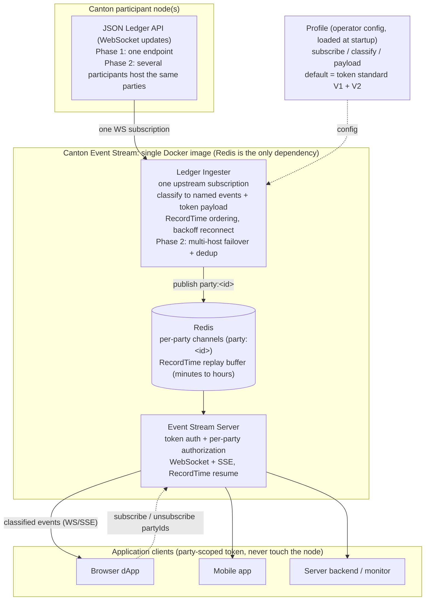

**Author:** Anand <anand@qasara.ai>, Qasara
**Status:** Submitted
**Created:** 2026-05-05
**Label:** canton-apis
**Champion:** 

---

# Canton Event Stream — Real-Time Ledger Events via WebSocket & SSE

> Canton Development Fund Proposal
> Phase 1 funding request: 300,000 CC across 3 milestones. Build (M1, M2, and the M3 release) is ~12 weeks; the M3 external-adoption window runs up to 6 months. The final milestone is 50% of the grant, released when the service is adopted by at least 3 independent teams on MainNet.
> Phase 2 (multi-hosted HA + multi-synchronizer reassignment) is scoped as a follow-on grant requiring a multi-participant / multi-synchronizer testbed — see **Phasing**.

---

## Abstract

Canton Event Stream is an open-source, Apache 2, self-hostable Node.js service that connects to any Canton participant node and delivers classified, party-authorized ledger events to application clients over WebSocket and Server-Sent Events (SSE). Canton already provides a native push *transport* (the JSON Ledger API WebSocket channels and gRPC `UpdateService.GetUpdates`); Canton Event Stream is the **application-edge layer above it** — it takes one upstream subscription, re-enforces Canton's per-party visibility at the streaming edge, classifies raw events into a stable application vocabulary, and fans them out to many clients without each client connecting to the participant or holding a ledger token. The transport and event-classification core already run against Canton DevNet inside Qasara's commercial Canton Gateway; this proposal open-sources that core as a standalone package and builds the net-new pieces the ecosystem needs — per-party authorization at the streaming edge, RecordTime ordering, and configurable subscriptions — complementing PQS (CIP-0100, the pull/SQL layer) on the same validator without overlap. Qasara's commercial offering is a hosted infrastructure service that runs this same open-source code: the grant funds the OSS package, and the hosted product consumes it as-is rather than maintaining a private fork, so every improvement made here reaches self-hosters and the hosted service alike.

---

## Specification

### 1. Objective

Provide every Canton application team with a maintained, open-source application-edge layer over Canton's native push transport — classifying ledger events into named application events (`transfer.executed`, `transfer.rejected`, etc.), re-enforcing per-party authorization at the streaming edge, ordering and resuming by RecordTime, and exposing the result over WebSocket and SSE so that browsers, mobile apps, and reactive backends can subscribe without each team rebuilding the same classification, authorization, ordering, fanout, and reconnection plumbing from scratch — and without each client connecting directly to the participant. The set of events subscribed to is operator-configurable, not fixed to one asset family.

The intended outcome: from M1 release, a team building a real-time Canton dApp UI can get classified, party-authorized ledger events by running a single Docker container alongside their validator, instead of designing and operating bespoke event-routing infrastructure themselves. Whether it becomes the default choice across the ecosystem is a matter of adoption; what the grant delivers and demonstrates is that the capability exists, is maintained, and works on infrastructure available today.

This proposal funds **Phase 1** — the application-edge layer that is fully demonstrable on infrastructure available today (a single participant). **Phase 2** — multi-hosted high availability (failover across participant LAPI endpoints) and multi-synchronizer reassignment events — is scoped as a follow-on grant because it can only be built and demonstrated against a multi-participant / multi-synchronizer testbed. The Phase-1 architecture is designed so Phase 2 is additive, not a rewrite: RecordTime ordering (Phase 1) is the participant-independent key that multi-hosted failover and dedup (Phase 2) depend on.

### 2. Implementation Mechanics

**Architecture:**



<details><summary>Same architecture as ASCII (for raw-markdown viewers)</summary>

```
Canton Participant Node(s)
   Phase 1: one LAPI endpoint
   Phase 2: multiple participants hosting the same party set,
            RecordTime-based failover + dedup across endpoints
     │
     │  JSON Ledger API (WebSocket)
     │  configurable interface / template subscription
     ▼
┌──────────────────────────────────────┐
│       Ledger Ingester                │
│  - Configurable subscription         │
│  - Event classification + payload    │
│  - RecordTime ordering               │
│  - Batch pub to Redis pipeline       │
│  - Exponential-backoff reconnect     │
│  - Phase 2: multi-host failover +    │
│             dedup + reassignment     │
└──────────────┬───────────────────────┘
               │  Redis Pub/Sub
               │  channel: party:<partyId>
               │  ordering: RecordTime; resume index
               ▼
┌─────────────────────────────────┐
│      Event Stream Server        │
│  - WebSocket + SSE endpoints    │
│  - subscribe / unsubscribe      │
│      (client chooses partyIds)  │
│  - Per-party authorization      │
│  - RecordTime resume            │
│  - Token-based auth             │
└───────▲───────────────┬─────────┘
        │               │
  subscribe/        classified
  unsubscribe         events
  (partyIds)            │
        │               ▼
     ┌──┴────────────────────┐
     ▼                       ▼
WebSocket clients        SSE clients
(browser dApps)        (server backends,
 subscribe [alice],     monitoring tools)
 later +[bob] −[alice]   partyIds set at connect
```

</details>

**Workflow:**

1. The Ledger Ingester connects to a Canton participant's JSON Ledger API and subscribes to a **configurable set of interfaces/templates** — operators declare what to subscribe to, with a pluggable classification mapping. The CIP-0056 (Token Standard V1) token interfaces (holdings + transfer instructions) ship as the **default profile**, alongside CIP-0112 (Token Standard V2, now live on DevNet) — whose dedicated transfer-events surface (holdings-change events) lets the ingester read transfer events directly instead of inferring them from exercised choices. Both fall back to template-based subscription on nodes that do not yet support interface filtering, and the mechanism is general-purpose, not fixed to token assets.
2. Raw DAML contract events are classified into human-readable typed events (`transfer.pending`, `transfer.executed`, `transfer.accepted`, `transfer.rejected`, `transfer.withdrawn`, `contract.created`, `contract.archived`) via the configured mapping.
3. Events are routed by extracting `signatories`, `observers`, `witnessParties`, and `actingParties` across event types, then fanned out to subscribers via per-party Redis Pub/Sub channels. Subscribers are authorized per party at subscribe time — a client may only stream parties its credential is entitled to, re-establishing at the edge the per-party visibility boundary the participant enforces natively (and that is otherwise lost once clients are decoupled from the node for fanout). The token-based mechanism is detailed under **Authorization model** below.
4. Events are ordered by **RecordTime** — Canton's participant-independent record timestamp, present on every update. Subscribers resume from a requested RecordTime ("send me everything since T") within a **configurable recent retention window** — a live-reconnect aid on the order of minutes to hours, **not a historical store**; deep historical replay is PQS's role, not this service's. The service maintains a RecordTime→offset index over that window to translate a requested time into a participant offset to resume from. (Choosing RecordTime over a participant-local offset is also what makes Phase-2 multi-hosted failover and dedup correct — see Phasing.)
5. Application clients (browsers, mobile, server backends) connect to the Event Stream Server's WebSocket or SSE endpoint with a party-scoped token; they never connect to the participant node directly.
6. The whole service ships as a single Docker image deployable alongside any Canton node, with Redis as its only persistent dependency.

**Authorization model** — the server re-creates the node's per-party visibility boundary at the streaming edge using short-lived, party-scoped tokens:

- *Who issues tokens.* The operator running the service, or their existing identity system: whoever already knows which user maps to which Canton party (for example, an exchange that knows "this logged-in user = party alice"). The server does not decide party ownership; it only accepts tokens signed by an issuer it is configured to trust (a shared key or a JWKS URL). This is the same trust model the participant already uses for `actAs` claims in an IdP-signed JWT, applied one hop further out.
- *Two deployment shapes.* (a) the service authenticates the client, looks up its parties from an operator-supplied mapping, and issues the token itself; or (b) the operator's identity system issues the token and the service only verifies it. Making that verify step pluggable, so any operator can use their own identity system, is the net-new open-source work. (Qasara's commercial gateway uses shape (a) today, tied to its API-key system.)
- *Token contents.* An explicit list of the party IDs the holder may stream, plus standard `iss`/`aud`/`exp` and a single-use id. The allowed-party list is written into the signed token by the issuer; the server never infers it. Tokens are short-lived (around 60 seconds) and single-use.
- *Subscribe-time check.* Before opening any channel, the server (1) verifies the token (signature, audience, not expired, not already used), (2) reads the allowed-party list, and (3) confirms every requested party is on that list. If any requested party is not, the subscribe is rejected and no channel opens. This is exactly what the Milestone 1 acceptance test demonstrates: request a party the token does not include, and the subscribe is rejected.
- *Optional node-side check.* Configurably, the service can also confirm with the participant that the token's issuer actually holds read rights for the party, so even a mis-issued token cannot grant more than the node itself would allow.

**Event format** — all events follow a consistent schema regardless of source:

```json
{
  "eventId": "1220upd...abc:00ctr...def",
  "partyId": "alice::1220...",
  "type": "transfer.executed",
  "recordTime": "2026-04-07T12:00:00.123456Z",
  "payload": {
    "instrumentId": { "admin": "dso::1220...", "id": "Amulet" },
    "amount": "100.0000000000",
    "sender": "alice::1220...",
    "receiver": "bob::1220...",
    "holdingCid": "00hold..."
  },
  "data": {
    "contractId": "00abc...",
    "templateId": "Splice.Amulet:Amulet",
    "choice": "Transfer",
    "consuming": true,
    "updateId": "1220...",
    "synchronizerId": "global-domain::1220...",
    "effectiveAt": "2026-04-07T12:00:00.000Z"
  }
}
```

`eventId` is derived deterministically from the update, not randomly: it combines the `updateId` with the contract event's node identity (its `contractId`), so the same ledger event produces the same `eventId` on every participant that sees it and on any re-ingest after a restart.

For token events, `payload` carries the Token Standard semantic fields a consumer actually needs — instrument, amount, sender, receiver, and holding — populated from CIP-0056 (V1) holdings / transfer-instruction data or CIP-0112 (V2) holdings-change events, so a dApp reads "Alice sent Bob 100 Amulet" without decoding the raw contract itself. `data` keeps the raw ledger metadata (contractId, templateId, choice, updateId, synchronizerId) for consumers that need to go deeper. Non-token event types carry their own typed `payload` under the same envelope; the classification mapping defines each type's payload shape.

**Event types:**

| Type | Trigger |
|---|---|
| `transfer.pending` | TransferInstruction contract created |
| `transfer.executed` | Transfer/Execute choice exercised |
| `transfer.accepted` | Accept choice exercised |
| `transfer.rejected` | Reject choice exercised |
| `transfer.withdrawn` | Withdraw choice exercised |
| `contract.created` | Any non-transfer contract created |
| `contract.archived` | Any contract archived |
| `contract.unassigned` | Contract unassigned from a synchronizer (reassignment out) — *Phase 2* |
| `contract.assigned` | Contract assigned to a synchronizer (reassignment in) — *Phase 2* |

The event vocabulary above is the default profile; because the subscription set and classification mapping are configurable, operators can extend it to their own templates. The `unassigned`/`assigned` (reassignment) events matter for multi-synchronizer apps — without them, a contract moving between synchronizers is misread downstream as archive-then-create. They require ≥2 synchronizers to exercise and are delivered in **Phase 2** (see Phasing).

**Subscription mechanism** — the ingester subscribes by **interface ID where available** (forward-compatible: a new template implementing an existing interface is picked up with no code change) and falls back to **template-based** subscription on nodes that don't yet support interface filtering.

A **profile** is the operator-configurable unit, and it defines three things: (1) the **subscribe set** (which interfaces/templates to pull), (2) the **classification mapping** (which raw event becomes which named type), and (3) the **payload mapping** (which token-standard fields land in `event.payload`). The **default profile** ships the CIP-0056 (V1) and CIP-0112 (V2) token standards:

```yaml
# default profile — token standard (V1 + V2)
subscribe:                        # (1) interfaces to pull (template fallback per node)
  - "#splice-api-token-holding-v1:Splice.Api.Token.HoldingV1:Holding"
  - "#splice-api-token-transfer-instruction-v1:Splice.Api.Token.TransferInstructionV1:TransferInstruction"
  - "#splice-api-token-transfer-events-v2:...:HoldingsChange"   # CIP-0112 V2 transfer-events
classify:                         # (2) raw event -> named type
  TransferInstruction.created:    transfer.pending
  TransferInstruction.Accept:     transfer.accepted
  TransferInstruction.Reject:     transfer.rejected
  TransferInstruction.Withdraw:   transfer.withdrawn
  HoldingsChange:                 transfer.executed    # V2 read-events surface
  "*.created":                    contract.created
  "*.archived":                   contract.archived
payload:                          # (3) token fields -> event.payload
  fields: [instrumentId, amount, sender, receiver, holdingCid]
```

Operators can add interfaces/templates and classification rules to this profile, or ship additional profiles for non-token domains. The mechanism is general-purpose, not token-specific; the token-standard profile is simply the batteries-included default.

**Stack:** TypeScript / Node.js, `@canton-network/wallet-sdk` for ledger access, Redis for fanout and replay buffer, single Docker image (~150 MB), Helm chart for Kubernetes deployment.

### 3. Architectural Alignment

**Ecosystem Infrastructure**: Real-time event delivery is foundational. Wallet UIs, exchange deposit detection, DeFi liquidation triggers, RFQ negotiation, and compliance monitoring all depend on reliable push notifications from the ledger.

**Developer Experience**: Today every team solves this independently. A single, well-maintained open-source solution eliminates duplicate engineering and reduces the surface area for subtle bugs in each custom implementation.

**Complementary to PQS (CIP-0100)**: PQS is the pull layer (offset-paged SQL queries against a materialized Postgres ODS). Canton Event Stream is the push layer. Production applications need both. PQS exposes no LISTEN/NOTIFY, no change feed, no subscription primitive — it is exclusively offset-paged query functions. (Detailed comparison in Rationale below.)

**Token-standard alignment (CIP-0056 + CIP-0112)**: The default profile uses both the CIP-0056 (V1) and CIP-0112 (V2) token-standard interfaces, so the ingester works with any compliant token without modification, and V2's holdings-change transfer-events are read directly rather than inferred from choices. The same interface-based mechanism extends to any other interface an operator configures, supporting the Canton multi-asset future.

**Canton version alignment**: The service targets the current Canton 3.5 protocol line and tracks subsequent releases (see the Maintenance Plan); the M3 compatibility matrix covers Canton 3.5+ across Quickstart, DevNet, and a MainNet validator, plus Splice 0.5.x / 0.6.x.

**Multi-hosted parties & multi-synchronizer (Phase 2)**: RecordTime ordering (Phase 1) is chosen precisely so the service is forward-compatible with multi-hosting and multi-synchronizer operation. In Phase 2, RecordTime — being participant-independent — is the key that lets the service fail over across the LAPI endpoints of participants hosting the same party set (party-based HA) and deduplicate events a multi-hosted party observes on more than one host; and the reassignment (`unassigned`/`assigned`) events let multi-synchronizer apps track contracts moving between synchronizers. Both require a multi-participant / multi-synchronizer environment to build and demonstrate.

### 4. Backward Compatibility

No backward compatibility impact. Canton Event Stream is additive infrastructure that subscribes to the existing JSON Ledger API; it does not modify Canton, Splice, or any existing client interface. Validators electing to deploy it run a new sidecar Docker container — no changes to their participant node, no schema migrations, no client breakage.

---

## Phasing

This grant funds **Phase 1** (the three milestones below) — everything that is demonstrable today on a single participant. **Phase 2** is a scoped follow-on, deliberately separated because it cannot be built or demonstrated without a multi-participant / multi-synchronizer testbed:

- **Phase 1 (this grant):** standalone package, per-party authorization at the edge, RecordTime ordering + time-based resume, configurable subscriptions + pluggable classification, integration tests, AsyncAPI spec, production hardening, and a **CIP draft** standardizing the event-selection and classified-event model.
- **Phase 2 (follow-on grant):** multi-hosted high availability (failover across the LAPI endpoints of participants hosting the same party set) and multi-synchronizer **reassignment** (`unassigned`/`assigned`) events. When a party is hosted on more than one participant, each hosting participant emits the same update, so Phase 2 must **deduplicate the same event arriving from multiple participants**. The dedup key is the participant-independent update identity: the same logical update carries the same `updateId` and the same `RecordTime` on every participant that sees it, so the ingester keeps a seen-set of `updateId`s within the RecordTime window and drops repeats. This is why Phase 1 orders and resumes by RecordTime (participant-independent) rather than a participant-local offset, which is what makes Phase-2 cross-participant dedup correct, so Phase 2 is additive rather than a rewrite. Scoped and costed when a multi-node/multi-synchronizer testbed is available.

## Milestones and Deliverables (Phase 1)

### Milestone 1: Standalone Package + Edge Authorization + RecordTime Ordering
- **Estimated Delivery:** Week 4
- **Focus:** Extract the core ingester from Qasara's commercial gateway into a self-contained Apache 2-licensed package; build per-subscriber party authorization at the streaming edge; replace the buffer-based replay with RecordTime ordering and time-based resume.
- **Deliverables / Value Metrics:**
  - npm package decoupled from Qasara's auth, API key, and database systems; configuration via environment variables only (no Prisma, no external DB)
  - Multi-auth support: sandbox HMAC, DevNet OAuth2 ClientCredentials, configurable per deployment
  - **Per-subscriber party authorization** — a client may only stream parties its credential is authorized for, enforced at subscribe time; re-establishes the node's per-party visibility boundary at the streaming edge
  - **RecordTime ordering + resume** — events ordered by RecordTime; subscribers resume from a requested RecordTime via a RecordTime→offset index built from offset checkpoints
  - Docker image published to GitHub Container Registry
  - Unit tests (≥80% coverage on ingester, classification, ordering, and authorization logic); GitHub Actions CI: lint, test, Docker build on every PR

### Milestone 2: Configurable Subscriptions + Integration Tests + AsyncAPI Spec
- **Estimated Delivery:** Week 8
- **Focus:** Make the subscription surface general-purpose, then lock behaviour with end-to-end tests and a published API contract.
- **Deliverables / Value Metrics:**
  - **Configurable subscription set + pluggable classification** — operators declare which interfaces/templates to subscribe to and how they map to event types; CIP-0056 token interfaces ship as the default profile
  - End-to-end integration test suite against Canton Quickstart in CI: WS/SSE connect-subscribe-receive-disconnect; stream-token issue/use-once/reject-reuse; RecordTime resume after disconnect; invalid-token and unauthorized-party rejection; multi-party routing
  - AsyncAPI 3.0 specification for the classified event API (WS and SSE), published and rendered — distinct from Canton's native raw-event AsyncAPI spec; ours documents the classified-event vocabulary and the subscribe/authorize handshake
  - `docker-compose.yml` (redis + canton-event-stream + Canton Quickstart) and a published quickstart guide

### Milestone 3: Production Release + CIP Draft + External MainNet Adoption
- **Estimated Delivery:** production release by Week 12; the external-adoption window runs up to 6 months after the M2 release.
- **Focus:** Make the service safely runnable on production validators, get it adopted by independent community teams on MainNet, and propose the model for ecosystem standardization.
- **Deliverables / Value Metrics:**
  - Helm chart (configurable replicas, resource limits, Redis settings); Prometheus `/metrics` (active connections, events/sec, publish latency, reconnect count) + Grafana dashboard JSON; structured JSON logging
  - Compatibility matrix: Canton Quickstart, Canton 3.5+ DevNet, MainNet validator (Canton 3.5+), Splice 0.5.x and 0.6.x
  - Security checklist: stream-token entropy, WebSocket connection limits, Redis ACL configuration guide
  - **CIP draft** standardizing the event-selection model and the classified-event schema, with canton-event-stream as the reference implementation, submitted to the relevant SIG
  - Contributor guide and governance docs; 12-month maintenance commitment (security patches, Splice/SDK compatibility updates, issue triage)
  - **External MainNet adoption:** at least 3 independent community members deploy the service alongside their own validator on MainNet, evidenced by their live deployment. This is the primary value demonstration and part of Milestone 3 acceptance (see Funding).

---

## Acceptance Criteria

Acceptance is evaluated on **value demonstrated to the ecosystem**, per Canton Development Fund guidance — each milestone is judged by a working, usable capability, with artifacts (tests, images, docs) as supporting evidence rather than the criterion itself. M1 and M2 demonstrate value through working capability, with Qasara's own Canton Gateway (reference integration) proving the extraction is real and consumable. **M3 demonstrates value through independent external adoption on MainNet**: the final 50% is released when the service is running in production and adopted by at least 3 teams outside Qasara, on a window of up to 6 months.

### Milestone 1 — A usable, privacy-correct, correctly-ordered event layer exists
- A developer outside the core team stands up the service from the published README and receives **classified** events from Canton Quickstart — and a client requesting a party its credential is not authorized for is **rejected at subscribe time**, demonstrated live. *(Supporting evidence: ≥80%-coverage unit suite green in CI; package runs with zero Qasara dependencies; image on npm/GHCR.)*
- **RecordTime resume demonstrated:** a client reconnects with a requested RecordTime and receives the correctly-ordered events since that time, verified by automated test.
- Qasara's Canton Gateway runs against the standalone package as the first reference integration, demonstrating the extraction is real and consumable.

### Milestone 2 — General-purpose and adoptable
- **A new event type is added via configuration alone** (a template/interface not in the default profile is subscribed and classified) without code changes — demonstrating the subscription surface is general-purpose, not token-specific.
- An external tester with no prior Canton experience reaches a working event stream by following only the quickstart guide, **unassisted**. *(Design target: ~30 minutes of hands-on time once base images are pulled; the gate is unassisted success, not a stopwatch.)*
- The documented API behaves as specified: the published AsyncAPI spec renders in standard tooling, and the integration suite — WS/SSE lifecycle, stream-token single-use, RecordTime resume, invalid-token and unauthorized-party rejection, multi-party routing — passes in CI as the evidence.

### Milestone 3 — It runs in production, is externally adopted, and proposes a standard
- **Production release:** the service runs alongside a validator, with **Qasara's own MainNet validator as the reference deployment**, verifiable live by the committee. Operational readiness demonstrated: Helm deploy on a real multi-node cluster; Prometheus metrics + Grafana dashboard; and a published compatibility matrix across the listed environments (Canton Quickstart, Canton 3.5+ DevNet, MainNet validator, Splice 0.5.x/0.6.x).
- **External MainNet adoption (the primary value gate):** at least 3 independent community members deploy the service alongside their own validator on MainNet, evidenced by their live deployment. This is the core of the Milestone 3 gate: the full 50% is released once it is met (see Funding).
- **CIP draft submitted** to the relevant SIG, standardizing the event-selection and classified-event model with this service as the reference implementation.
- Community-ready: security checklist submitted for committee review; contributor guide published; documented 12-month maintenance commitment (SECURITY.md, release/versioning policy).

---

## Funding

**Total Phase 1 Funding Request:** 300,000 CC

### Payment Breakdown by Milestone (Phase 1)
- Milestone 1 (Standalone Package + Edge Authorization + RecordTime Ordering): **90,000 CC (30%)** upon committee acceptance
- Milestone 2 (Configurable Subscriptions + Integration Tests + AsyncAPI Spec): **60,000 CC (20%)** upon committee acceptance
- Milestone 3 (Production Release + CIP Draft + External MainNet Adoption): **150,000 CC (50%)** upon committee acceptance of the full Milestone 3 criteria, including **at least 3 independent community deployments on MainNet**.

The final milestone is **50%** of the grant, released when the service is running in production and adopted by at least 3 independent teams on MainNet — the strongest available signal of ecosystem value.

**Phase 2** (multi-hosted HA + multi-synchronizer reassignment) is **not funded by this grant**; it will be scoped and costed as a follow-on once a multi-participant / multi-synchronizer testbed is available.

### Volatility Stipulation

Phase 1 build is **~12 weeks** (M1, M2, and the M3 release); the M3 external-adoption window then runs up to 6 months, so total Phase 1 duration is **up to ~6 months**. Should the timeline extend beyond that due to Committee-requested scope changes, any remaining milestones must be renegotiated to account for significant USD/CC price volatility.

---

## Co-Marketing

Upon release, Qasara will collaborate with the Canton Foundation on:

- **Announcement coordination** — joint blog post and Canton Foundation channel announcements at M1 (npm release) and M3 (production-ready release)
- **Technical case study** — a published deep-dive on the architecture, the PQS-vs-push-layer design rationale, and lessons from running this in production at Qasara
- **Reference integration** — make Qasara's Canton Gateway integration with canton-event-stream a public reference example for other dApp builders

---

## Motivation

Real-time event delivery is foundational infrastructure for the Canton dApp ecosystem. Wallet UIs, exchange deposit detection, DeFi liquidation triggers, RFQ negotiation, and compliance monitoring all depend on reliable push notifications from the ledger. Today every team solves this independently — duplicating engineering effort, multiplying the surface area for subtle bugs, and slowing dApp time-to-market.

**The raw JSON Ledger API is not the answer for application clients.** It exposes a WebSocket stream — but what that stream delivers is raw DAML contract events:

```json
{
  "update": {
    "value": {
      "updateId": "1220abc...",
      "effectiveAt": "2026-04-08T...",
      "events": [
        {
          "contractId": "00abc...",
          "templateId": "#splice-amulet-0.1.9:Splice.Amulet:Amulet",
          "signatories": ["alice::1220..."],
          "observers": [],
          "createdAt": "2026-04-08T...",
          "createdEventBlob": "CgYI..."
        }
      ]
    }
  }
}
```

To turn this into something an application can act on, every team must build event classification, per-party authorization at the fanout edge, multi-subscriber fanout, reconnection-with-replay, and a client-facing WebSocket/SSE server (so browsers and mobile apps don't connect to the participant node directly). This application-edge layer — distinct from Canton's native raw-event transport — does not exist as a shared, maintained open-source component anywhere in the Canton ecosystem.

**Ecosystem portion benefited:** The **majority of new Canton dApp and fintech development happens on Node.js / TypeScript stacks** — the Canton Wallet SDK is TypeScript-native, and the dApp/fintech developer mainstream is Node.js. Every team in that segment that needs real-time event delivery is addressable — wallet UIs, exchange integrations, reactive backends. JVM-stack teams are not excluded: the WebSocket and SSE endpoints are language-neutral wire protocols, so any client (Java, Python, Rust, Go) consumes them without a Node.js runtime; they simply gain less from the TypeScript-native implementation itself. We expect a measurable reduction in time-to-first-event for new Canton applications as adoption grows.

**Strategic importance:** Approving PQS (CIP-0100) without a complementary push layer leaves every Canton application team to rebuild that push layer independently — exactly the duplication a foundational push component eliminates. PQS makes ledger state queryable and historically auditable; Canton Event Stream makes ledger events deliverable to live UIs and reactive backends. Production applications need both layers.

---

## Rationale

### Why a new component, not an extension of PQS

CIP-0100 (PR #67, merged 2026-04-23) approved Digital Asset's grant to open-source PQS — the Participant Query Store — under Apache 2.0. PQS and Canton Event Stream serve different layers of the same stack and cannot be folded into one another:

| Dimension | PQS (offset-paged SQL ODS) | Canton Event Stream (push) |
|---|---|---|
| **Consumer-facing interface** | SQL API: `active()`, `creates()`, `archives()`, `exercises()` | WebSocket and Server-Sent Events |
| **Wire protocol** | PostgreSQL JDBC | WebSocket / HTTP SSE |
| **Client topology** | Server-side only (browsers cannot speak Postgres) | Browser, mobile, and server clients |
| **Authentication** | PostgreSQL roles | App-layer party-scoped tokens |
| **Event shape** | Decoded contracts in JSONB; clients implement classification | Pre-classified app events (`transfer.executed`, `transfer.rejected`, etc.) |
| **Hot-path latency** | Ledger API → PQS write → Postgres → poll | Ledger API → Redis pub/sub → WebSocket push (no DB write in the hot path) |
| **Reconnection model** | Client tracks Postgres offset; bespoke replay logic | Resume from a requested **RecordTime** within a recent window (participant-independent); deep history via PQS, not this service |
| **Footprint** | JVM (4 GB / 4 cores min.) plus Postgres (8 GB / 8 cores min.) | Node.js (~150 MB image), Redis only |

The [PQS SQL API documentation](https://docs.digitalasset.com/build/3.5/component-howtos/pqs/references/sql-api.html) confirms the consumer-facing interface is exclusively offset-paged query functions — no LISTEN/NOTIFY, no change feed, no subscription primitive. Adding push to PQS would require building exactly this proposal inside a JVM project, which forces a JVM dependency on every dApp consumer (the very dependency many builders are trying to avoid).

### Relationship to Canton's native push layer (JSON WS and gRPC streaming)

Canton already ships a native push *transport* in two forms: the gRPC `UpdateService.GetUpdates` server-stream, and the JSON Ledger API v2 WebSocket channels (`/v2/updates`, `/v2/state/active-contracts`, `/v2/commands/completions`), documented with an AsyncAPI specification. Canton Event Stream does not replace this transport — it consumes the JSON WS channel upstream. It is the application-edge layer on top of it, and the delta is the part the transport intentionally does not provide:

The native transport enforces privacy **at the node**: a subscription's token read-rights bound which parties it may filter for, so a consumer physically cannot subscribe to a party it is not authorized to see. This is correct and robust — but it is a *per-client* model. Every browser, mobile app, or microservice opens its own node subscription, holds a Ledger API token, and receives raw `Created`/`Archived`/`Exercised` primitives it must classify itself.

The moment an application introduces a fanout tier to serve many clients from one upstream subscription — which it must, to avoid exposing the participant to every client and handing every client a ledger token — **the node's per-party authorization boundary is removed from the downstream path.** Something has to re-establish it, or one party's events leak to another. A generic WebSocket fanout (Centrifugo, socket.io + Redis) cannot: it has no concept of a Canton party or of who is entitled to see whose events. Re-enforcing per-party authorization at the streaming edge is the Canton-specific, security-critical work that makes a purpose-built event gateway necessary rather than off-the-shelf pub/sub — and it is an explicit deliverable of this proposal (M1).

| Dimension | Native push (gRPC GetUpdates / JSON WS) | Canton Event Stream (application edge) |
|---|---|---|
| **Role** | Raw event transport | Edge gateway consuming that transport |
| **Privacy enforcement** | At the node, per subscription | Re-enforced at the edge, per subscriber — preserves the node's guarantee across fanout |
| **Client topology** | One node subscription per client; each holds a ledger token | One upstream subscription; many clients, none touching the node |
| **Event shape** | Raw `Created`/`Archived`/`Exercised` | Classified CIP-0056 vocabulary (`transfer.executed`, …) |
| **Participant exposure** | Every client connects to the participant | Only the gateway connects to the participant |
| **Reconnection** | Client tracks per-participant offset / `OffsetCheckpoint`s | Resume from a requested **RecordTime** (no client-side offset persistence; participant-independent) |

In short: the native WS/gRPC layer is the origin transport; Canton Event Stream is the reverse-proxy/edge above it — classification, per-party-authorized fanout, RecordTime ordering, and a participant-shielding boundary. It composes with the native layer the same way it composes with PQS on the pull side. It only ever delivers events for parties an operator is authorized to read; by Canton's authorization model it cannot expose third-party private events.

**On the scaling benefit (fan-in vs 1-1 passthrough).** The fan-in advantage is real specifically in the **operator-hosted** deployment — the target user (exchange, custodian, fintech) is authorized for many parties and opens one (or a few) multi-party subscriptions, which the service fans out to that operator's many downstream consumers. The decoupling is *downstream client connections ≠ upstream node subscriptions*: thousands of user-facing connections collapse to a handful of upstream subscriptions, and the participant is shielded from direct per-client connections each bearing a ledger token. We state the limit honestly: if instead each party is externally owned and self-subscribes with its own JWT for only its own party, there is no subscription-dedup benefit — in that model the value is connection multiplexing, classification, per-party-authorized delivery, and RecordTime-resumable ordering, not subscription dedup.

### Why standardize via a CIP

This service classifies raw ledger events into a stable application vocabulary and defines how a subscriber selects and authorizes the events it wants. That selection-and-classification model is exactly the kind of thing the ecosystem benefits from agreeing on once, rather than each team inventing incompatible event names and subscribe semantics. Accordingly, Phase 1 includes a **CIP draft** standardizing (a) the event-selection / subscribe model and (b) the classified-event schema, with canton-event-stream as the reference implementation. This turns the work from a single service into a standard plus a reference implementation — the stronger ecosystem outcome — and we will sequence the CIP draft alongside the implementation so the two co-evolve.

### Why TypeScript / Node.js

The ecosystem's event-indexing component — PQS (scribe), distributed as a Java JAR on a Scala/ZIO stack — is JVM-based, as is Canton itself; there is no standalone non-JVM indexer (the TypeScript and Go offerings are client SDKs, not indexers). The Canton SDK itself is TypeScript-native (`@canton-network/wallet-sdk`). For teams already running a Node.js application stack — the majority of dApp and fintech developers — a TypeScript implementation:

- Eliminates a JVM dependency from their infrastructure
- Uses the same SDK they are already familiar with
- Produces a smaller Docker image (~150 MB vs ~400 MB+ JVM)
- Shares package ecosystem with the Canton Wallet SDK

JVM-stack consumers are not excluded — the WebSocket and SSE endpoints are language-neutral wire protocols, so any client (Java, Python, Rust, Go) connects without a Node.js runtime on its side.

### Why interface-based subscription (with a configurable set)

The subscription set is operator-configurable, so the service is not tied to one asset family. Within that, subscribing by interface ID — rather than enumerating individual templates — means a new template implementing an existing interface is picked up with no code change. For the default token profile this matters because any CIP-0056 (V1) or CIP-0112 (V2) compliant token works without modification, supporting the Canton multi-asset future; the same mechanism applies to any interface an operator configures. Template-based subscription (and an empty-template fallback) preserves compatibility with nodes that do not yet support interface filtering.

### Coexistence on the same validator

PQS and Canton Event Stream are independent of one another and can run on the same validator without interaction. Canton Event Stream subscribes to the Canton Ledger API directly and uses Redis as its only persistent state — it does not depend on Postgres or share any infrastructure with PQS. Validators electing to run both gain queryable historical state from PQS and live event delivery from Canton Event Stream without integration work between the two.

### Alternatives considered

- **Recommend each team builds their own push layer over the JSON Ledger API.** Status quo; results in fragmented, inconsistent event semantics, duplicated bugs in classification and reconnection logic, and slow dApp time-to-market. Rejected as the explicit problem this proposal solves.
- **Add push to PQS.** Forces a JVM dependency on every consumer and changes PQS's architectural identity from a query store into a hybrid push+query system. Better served by an independent, lightweight push component.
- **Consume the native push transport directly (gRPC streaming or the JSON Ledger API WebSocket).** Both are excellent transports, and Canton Event Stream uses the JSON WS upstream. But consuming them directly means every client opens its own node subscription, holds a Ledger API token, and classifies raw events itself — and any fanout tier added to fix that strips the node's per-party authorization boundary unless it is re-enforced at the edge. This proposal builds exactly that edge layer (classification + per-party-authorized fanout + participant shielding), not a bare protocol translator. See "Relationship to Canton's native push layer" above.

---

## Maintenance Plan

- Apache 2 license, hosted at `github.com/Qasara-Labs-Pvt-Ltd/canton-event-stream`
- 12-month post-launch maintenance: security patches, Splice/SDK version compatibility updates
- Semantic versioning with a documented breaking-change policy
- Issues triaged weekly; critical fixes within 48 hours
- Compatibility tested against each major Splice and Canton release
- After 12 months: proposal to transfer stewardship to Canton Foundation or a community SIG if formation is possible

---

## Notes for Reviewers

1. **Core transport and classification exist today; the net-new engineering is authorization, RecordTime ordering, and generalization.** This is not a greenfield design proposal. The ledger ingester (Splice interface subscription, exponential-backoff reconnect), Redis Pub/Sub fanout with batch pipeline, WebSocket endpoint, and SSE endpoint are all implemented and running in our DevNet environment as part of the Qasara Canton Gateway — so the transport and event classification are proven. What this grant funds as genuinely new work is: (a) **per-subscriber party authorization at the streaming edge** (currently coupled to Qasara's API-key system; the open-source version needs a clean, credential-agnostic implementation), (b) **RecordTime ordering + time-based resume** (replacing the current ephemeral event-id buffer with a participant-independent ordering key), and (c) **configurable subscriptions + pluggable classification** to make the surface general-purpose rather than token-specific — plus packaging, decoupling, and production hardening. We are deliberately not claiming "it's just repackaging."

2. **TypeScript choice is intentional.** The Canton Wallet SDK is TypeScript-native. Most dApp developers are TypeScript-first. A JVM-free event stream reduces the operational complexity for the majority of Canton builders, while the language-neutral wire protocols (WebSocket + SSE) keep JVM consumers fully supported.

3. **Commercial relationship.** Qasara operates a hosted version of this infrastructure as part of our commercial Canton Gateway API. The entire event-streaming engine — including connection authentication and basic per-connection/backpressure limits — is open-source and self-hostable. What remains commercial is only the multi-tenant SaaS layer: issuing and metering API keys for paying customers, per-plan tiered rate limits, and billing. This is the same boundary as Grafana OSS versus Grafana Cloud — the engine is the public good; the multi-tenant billing service is the business. Our incentive is aligned with keeping the engine open: the more teams that can build real-time Canton applications, the larger the market for our hosted API. We also run this component in production ourselves, which is what sustains its maintenance beyond the grant window.

   **Open-source vs. hosted boundary:**

   | Capability | Open-source (Apache 2) | Hosted (commercial) |
   |---|---|---|
   | Ledger ingester (single upstream subscription, backoff reconnect) | ✅ | uses OSS |
   | Event classification into the typed vocabulary | ✅ | uses OSS |
   | Per-party authorization re-enforced at the edge | ✅ | uses OSS |
   | Fanout, WebSocket/SSE serving, `lastEventId` replay | ✅ | uses OSS |
   | Connection authentication (validate client JWT/token → identity) | ✅ (bring-your-own IdP) | Qasara IdP + accounts |
   | Credential issuance for self-hosting (stream tokens / BYO-IdP) | ✅ | uses OSS |
   | Basic connection / backpressure limits | ✅ | uses OSS |
   | AsyncAPI spec, Helm chart, metrics, Docker image | ✅ | uses OSS |
   | Multi-tenant customer key management (issue/rotate/meter keys for paying third-party customers) | ❌ | ✅ |
   | Per-plan tiered rate limits | ❌ | ✅ |
   | Usage metering & billing | ❌ | ✅ |

   The grant funds only the left column; every deliverable and acceptance criterion in the milestones lands in the public repository.

4. **Phasing reflects what can be demonstrated, not appetite.** Multi-hosted HA and multi-synchronizer reassignment (Phase 2) are deliberately separated because they cannot be built or demonstrated on a single participant / single synchronizer — they require a multi-participant, multi-synchronizer testbed. Phase 1's RecordTime ordering is chosen specifically so Phase 2 is additive (RecordTime is the participant-independent key that multi-hosted failover and dedup depend on). We would rather commit Phase 1 to deliverables we can demonstrate on infrastructure available today and scope Phase 2 once a suitable testbed exists, than over-promise both in one grant.


