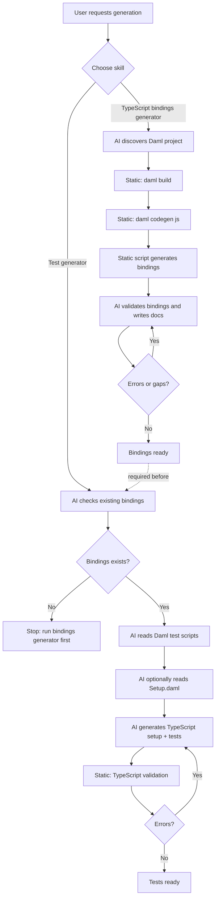

## **Development Fund Proposal**

**Author:** Moonsong Labs
**Status:** Submitted
**Created:** 2026-03-19
**Updated**: 2026-05-04
**Label:** dapp-integration
**Champion:** Joel Lovera

---

## Abstract

Canton AppKit is a shared developer toolkit for application teams integrating deployed Daml contracts into frontend and backend applications on Canton.

The proposal addresses recurring ecosystem friction identified in Canton developer research: difficult-to-consume generated bindings, manual identifier handling across environments, and repeated custom work connecting Daml package artifacts to application code. AppKit builds on the Canton dApp SDK / CIP-0103 application path with TypeScript binding generation, identifier resolution, workflow helpers, and reference integrations.

The result is a reusable open-source integration layer that reduces custom glue code, makes integration from Daml package artifacts more reliable, and gives Canton teams a clearer path from Daml packages to working application code.

---

## Specification

### 1. Objective

The primary objective is to make Canton application integration easier and more consistent by adding TypeScript bindings for Daml contracts, identifier resolution, workflow helpers, and reference integrations to the existing Canton application development path.

Today, application teams repeatedly rebuild the same integration layer:

- adapting the existing `dpm codegen-js` output into application-specific TypeScript wrappers
- manually re-mapping package IDs, template identifiers, and generated binding paths into application code
- building custom glue between generated Daml artifacts and application workflows
- rebuilding example integrations, documentation, and environment mapping conventions

AppKit turns that repeated work into shared open-source tooling. The TypeScript generation layer will wrap, refine, or selectively replace parts of the current `dpm codegen-js` output where needed to produce idiomatic, well-typed, human-readable bindings while preserving compatibility with existing Canton application interfaces.

Primary target users are:

- backend engineers building services that read contract state and submit transactions
- platform engineers maintaining shared integration libraries, templates, and CI workflows
- security and integration engineers reviewing signing boundaries and identity mapping
- frontend teams rapidly prototyping Canton web apps using generated TypeScript bindings and React helpers

The intended outcome is an open-source toolkit that gives those teams a repeatable application integration layer built around TypeScript bindings generated from Daml package metadata, environment-aware identifier resolution, workflow helpers, and reference integration materials.

Together, these components reduce the amount of custom glue code teams need to write between Daml package artifacts and working application code.

### 2. Implementation Mechanics

AppKit will be delivered as open-source tooling intended to extend the existing Canton dApp SDK path where the Foundation agrees the functionality belongs in the SDK. Components that are better kept outside the core SDK will be delivered as compatible companion tooling, generator tooling, or reference integrations.

The v1 scope includes:

- a TypeScript binding generator that produces bindings from Daml package metadata
- identifier resolution helpers and configuration conventions for environment mapping
- workflow helpers that connect generated bindings to existing dApp SDK/provider flows
- reference integrations that demonstrate documented read and submit workflows
- agent-assisted generation workflows around deterministic generator scripts

AppKit focuses on standardizing how application code uses generated Daml bindings in deployed Canton applications. For v1, reference flows will cover a documented read path and a documented submit path, using existing dApp SDK/provider interfaces rather than defining a separate runtime API. This proposal does not define a competing provider API, wallet abstraction, or signing protocol. Reference integrations will clarify how generated bindings fit into existing dApp SDK/provider flows, including the boundary between application code, signing surfaces, and transaction submission.

Metadata inputs for binding generation and identifier resolution in v1 are limited to a local DAR path or a checked-in metadata manifest exported from a target environment. Live participant metadata queries are not required for milestone acceptance. 

A representative v1 environment-mapping config shape is:

```yaml
environments:
  dev:
    applicationInterface:
      type: dapp-sdk
      provider: local
    packageSource:
      type: dar
      path: .daml/dist/app.dar
  test:
    applicationInterface:
      type: dapp-sdk
      provider: cip103-compatible
    packageSource:
      type: manifest
      path: ./metadata/finance-app.test.json

bindings:
  output: ./generated/canton
```

Agent-assisted generation will orchestrate project-specific workflow steps around deterministic generator scripts. The static scripts remain the source of generated code, while the agent workflows handle discovery, validation, bounded fixes, and documentation around those scripts.

The initial agent workflow scope includes two parts:

- bindings-generator: scripts and agent instructions for producing TypeScript application bindings from Daml projects, validating the output, and creating usage documentation for the generated bindings
- test-generator: scripts and agent instructions for converting selected Daml scripts into TypeScript integration tests, validating the generated test code, and documenting how to run the tests against a Canton sandbox

#### Tentative agentic workflow



### 3. Architectural Alignment

The existing Canton dApp SDK and CIP-0103 define the wallet and dApp integration model. AppKit builds on that layer by improving how Daml package artifacts become typed, maintainable application code.

This proposal aligns with the Development Fund’s focus on shared ecosystem tooling in the following ways:

- `@canton-network/dapp-sdk`: AppKit will prioritize upstream contribution where the Foundation agrees the functionality belongs in the SDK, and otherwise provide compatible companion tooling for typed bindings, workflow helpers, and reference integrations. It will not define a competing provider interface.
- CIP-0103: AppKit reference flows will follow the existing wallet and dApp integration model.
- `dpm codegen-js`: AppKit will evaluate whether to wrap, refine, or selectively replace generated output where needed to produce idiomatic TypeScript bindings.
- Daml package artifacts and metadata manifests: AppKit uses these as the source for typed bindings and identifier resolution.
- Existing participant and ledger APIs: AppKit does not require protocol changes or new participant-side behavior.

### 4. Backward Compatibility

No backward compatibility impact.

This is external developer tooling that works alongside the existing Canton application development path. Teams can adopt AppKit incrementally without changing their existing Canton deployment model.

---

## Milestones and Deliverables

### **Milestone 1: dApp SDK Extension Design, Typed Bindings, and Identifier Resolution**

- **Estimated Delivery:** 4 weeks
- **Focus:** Deliver the TypeScript-first foundations for AppKit, including typed binding generation, identifier resolution scaffolding, and the extension design for the existing Canton dApp SDK path
- **Deliverables / Value Metrics:**
    - Extension design describing which AppKit components should be proposed for upstream dApp SDK contribution, delivered as companion tooling, or delivered as reference integrations
    - Binding generator that produces a single consumable TypeScript package with typed bindings from Daml package artifacts or checked-in metadata manifests
    - Checked-in reference Daml package used as fixtures for generation and CI
    - Checked-in appkit.config.yaml example covering dev and test environments, package sources, and identifier resolution without hardcoded package IDs
    - CIP-0103 compliance matrix identifying the application interfaces used by the reference workflows
    - Fixture test that regenerates bindings from the reference package and fails on diff against committed output

### **Milestone 2: Reference Integrations and TypeScript Workflow Generation**

- **Estimated Delivery:** 4 weeks
- **Focus:** Deliver reference integrations and generate TypeScript workflows derived from Daml scripts for reference packages
- **Deliverables / Value Metrics:**
    - Minimal example clients that read contract state and submit one documented reference choice using AppKit-generated TypeScript bindings and the existing dApp SDK/provider flow
    - Identifier resolution helpers that switch the reference integration between dev and test using the checked-in config
    - Signing and submission flow demonstrated in a minimal example web client
    - External-signing-compatible flow demonstrated where supported by the existing dApp SDK/provider model
    - Script porting tooling that translates selected Daml scripts into TypeScript workflow implementations using the generated bindings
    - Initial developer documentation for setup and integration steps for the reference integrations

### **Milestone 3: Binding Refinement, Test Generation, and Release Readiness**

- **Estimated Delivery:** 4 weeks
- **Focus:** Harden AppKit, validate generated bindings and tests, and prepare the tooling for ecosystem reuse
- **Deliverables / Value Metrics:**
    - Agent workflows and static generator scripts for producing TypeScript application bindings from Daml projects, validating outputs, and creating usage documentation for the generated bindings.
    - Test generation workflow that converts selected Daml scripts into TypeScript integration tests, validates the generated test code, and documents how to run the tests against a Canton sandbox
    - GitHub Actions workflow running generation, TypeScript validation, unit tests, and supported integration checks in CI
    - CI job that regenerates bindings from the checked-in reference package and fails on diff
    - Compatibility and versioning policy for AppKit outputs, including the compatibility boundary with existing Canton SDK tooling
    - Documented error cases for missing package IDs, stale bindings, provider failures, and signing or submission failures, with corresponding test coverage
    - Developer documentation, quickstarts, and integration runbooks suitable for ecosystem reuse

### **Milestone 4: Adoption, Enablement, and Ecosystem Rollout**

- **Estimated Delivery:** Week 16
- **Focus:** Publish enablement assets and run structured rollout activities that support AppKit adoption
- **Deliverables / Value Metrics:**
    - publish 1 written case study covering a full AppKit workflow, from typed binding generation through identifier resolution and transaction submission
    - record and publish 1 demo featuring a walkthrough of the reference workflow
    - conduct 2 live developer workshops focused on integrating a frontend or backend service with AppKit
    - host weekly “office hours” sessions for pilot teams and ecosystem developers adopting AppKit, designed as 1-hour sessions held each week for 4 weeks
    - publish 1 technical content piece with a goal to be co-marketed by the Canton Foundation and/or other ecosystem partners

### Post-Completion: Ongoing Maintenance

Given the role of AppKit as shared developer tooling, we expect maintenance to become important as the Canton ecosystem evolves. Although ongoing maintenance is not in scope for this proposal, Moonsong Labs would be available to provide ongoing maintenance and would recommend revisiting this as a separate agreement should there be a clear demonstration of adoption by the ecosystem per Milestone 4.

---

## Acceptance Criteria

Project-specific acceptance conditions:

- Developers can generate contract-specific typed bindings from Daml package artifacts or checked-in metadata manifests using a repeatable workflow
- Applications can resolve required package IDs and template identifiers without manual extraction from build outputs or hardcoded package IDs in application code
- A reference application can read contract state and submit a documented contract interaction using AppKit-generated bindings
- Generated binding and test outputs pass TypeScript validation, and the project includes documented steps for running generated integration tests against a Canton sandbox.
- A minimal example web client can demonstrate user authorization, signing, and submission through the existing dApp SDK/provider model
- TypeScript bindings generation and builds behave consistently across developer machines and CI pipelines
- At least two external or Foundation-nominated pilot developers can reproduce the reference integration from a clean checkout using the published quickstart

---

## Funding

**Total Funding Request:** 1,575,000 CC

### Payment Breakdown by Milestone

- Milestone 1 dApp SDK Extension Design, Typed Bindings, and Identifier Resolution: 450,000 CC upon committee acceptance
- Milestone 2 Reference Integrations and TypeScript Workflow Generation: 450,000 CC upon committee acceptance
- Milestone 3 Binding Refinement, Test Generation, and Release Readiness: 450,000 CC upon committee acceptance
- Milestone 4 Adoption, Enablement, and Ecosystem Rollout: 225,000 CC upon final release and acceptance

---

## **Volatility Stipulation**

The project timeline is under 6 months. Should the project timeline extend beyond 6 months due to Committee-requested scope changes, any remaining milestones must be renegotiated to account for significant USD/CC price volatility.

---

## Co-Marketing

Co-marketing will be aligned with Milestone 4 (Adoption, Enablement, and Ecosystem Rollout) and will focus on coordinated promotion of all produced assets and activities across Moonsong Labs, Canton Foundation, and ecosystem channels.

Specific commitments:

- joint promotion of the written case study and technical content piece covering a full AppKit workflow, including typed binding generation, identifier resolution, and transaction submission
- coordinated distribution of the recorded demo / walkthrough, including the reference workflow and any supported external-signing flow
- co-marketing of the two live developer workshops focused on integrating frontend and backend services with AppKit
- co-promotion of weekly office hours sessions to drive engagement from pilot teams and ecosystem developers
- coordinated promotion of all supporting adoption assets, including the quickstart, environment mapping guide, CI template, and reference workflow materials

---

## Motivation

This proposal matters because it addresses a recurring ecosystem integration problem: Canton application teams repeatedly lose time on integration work, especially around identifier management, environment mapping, difficult-to-consume generated bindings, and bespoke signing/submission integration paths. That slows delivery, produces inconsistent integration patterns, and increases the chance of fragile upgrades and hardcoded values reaching production code.

AppKit addresses this as shared developer tooling. The addressable audience is Canton application teams building custom frontend or backend integrations on top of Daml packages. The ecosystem value is lower integration cost for new Canton applications, faster onboarding for frontend and backend engineers, more consistent identifier and environment-handling patterns, and reusable examples that other teams can adapt instead of rebuilding from scratch.

For developers, the impact is a reduction in repeated contract-to-application glue work. For teams starting from Daml package artifacts, AppKit should reduce the time spent mapping identifiers, adapting generated bindings, and wiring basic read/submit flows into application code. The target is to make the common path reproducible, typed, and easier to review.

---

## Rationale

This approach is well suited to the problem because it focuses on the missing typed application-integration layer around existing Canton application tooling, without trying to replace wallet, provider, or protocol components.

Several alternatives were considered:

1. build a standalone Canton application SDK. That is not the preferred path because the ecosystem already has a dApp SDK and CIP-0103 wallet/provider model.
2. build wallet or signing infrastructure. That is also not the preferred path because wallet and provider implementations should remain responsible for authorization, signing, and user consent.
3. limit the work to code generation only. That would make the generated TypeScript easier to use, but it would not solve the broader application integration problem around identifier resolution, workflow examples, and existing SDK usage.

AppKit therefore focuses on the typed integration layer between Daml package artifacts and application code. This keeps the scope specific enough to verify while avoiding unnecessary replacement of existing Canton components.

---

## Addendum

### **Why Moonsong Labs**

Moonsong Labs engineers have shipped production systems across Polkadot, Ethereum, zkSync, Solana, and other ecosystems. This includes building developer-facing integration layers, typed client tooling, and secure transaction submission patterns used by external teams.

Work relevant to this package includes:

- Canton Network demo application, compliant stablecoin plus yield vault, used to validate Daml Finance composition patterns and Canton privacy. The work included a devcontainer for one-click setup, plus AI skills that generate TypeScript bindings from Daml models and scaffold React UI components
    
    Case study: https://moonsonglabs.com/casestudy/demonstrating-a-baseline-for-building-advanced-financial-applications-on-canton/
    
    Repo: https://github.com/Moonsong-Labs/canton-apps
    
- ZKsyncOS Foundry and related developer tooling, Rust-based tooling derived from the Foundry stack to support Ethereum development workflows on ZKsyncOS, plus testing utilities for Foundry ZKsync
    
    https://github.com/Moonsong-Labs/zksync-os-foundry
    
    https://github.com/Moonsong-Labs/forge-zksync-std
    
- Moonbeam tooling and utilities, which supported large developer ecosystems with reusable integration tooling and scripts
    
    https://github.com/Moonsong-Labs/moonbeam-tools
    
- Glacis, which provided standardized connector interfaces and routing policies across multiple providers, requiring clear integration boundaries and stable developer APIs
    
    https://github.com/glacislabs/v1-core
    

These projects show Moonsong’s ability to build developer-facing integration layers, which is directly relevant to AppKit’s goal: helping Canton application teams move from Daml package artifacts to typed, usable application code without fragmenting the existing SDK and provider model.