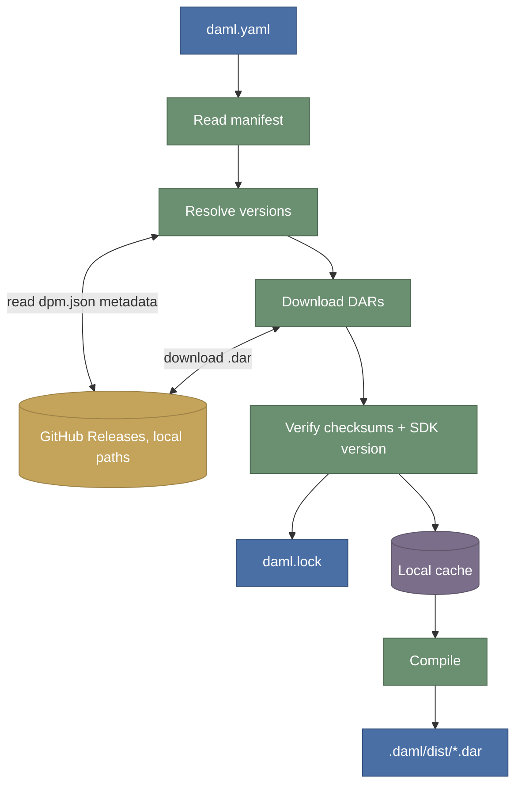
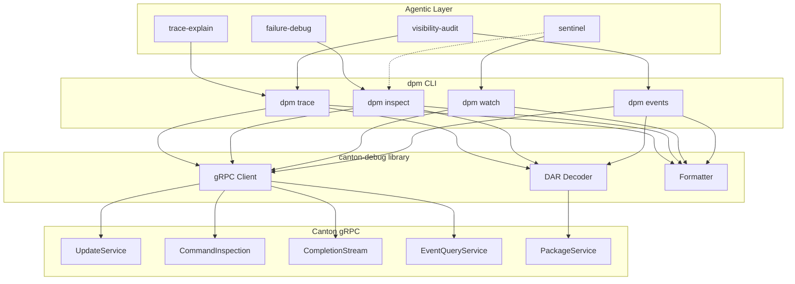

## Development Fund Proposal

**Author:** Justin Kennedy, Moonsong Labs
**Status:** Submitted
**Created:** 2026-03-19

---

## Abstract

DevKit is a proposed extension of Digital Asset's `dpm` CLI that delivers a unified developer workflow for dependency management, package and interface discovery, documentation extraction, and transaction tracing, with AI-assisted support built on allowlisted outputs.

It addresses recurring friction identified in the Canton ecosystem around manual .dar handling, opaque discovery, fragmented documentation, and difficult-to-interpret transaction failures. The outcome is a reusable, open developer workflow layer that improves repeatability across local development and CI while reducing time spent on setup and debugging.

---

## Specification

### 1. Objective

The problem this proposal solves is repeated developer friction in Canton application work:

- dependency management is still handled through manual `.dar` handling and ad hoc scripts
- package and interface discovery in configured Canton environments is opaque
- documentation for dependencies and discovered interfaces is fragmented
- transaction debugging, especially for authorization and privacy-related failures, is hard to interpret and operationalize

The intended outcome is a shared, open-source DevKit layer inside `dpm` that standardizes dependency management, package and interface discovery, docs extraction, and transaction debugging so teams can focus on application logic instead of glue tooling.

**Target users**

- Canton application developers building contract workflows and services
- platform engineers responsible for developer workflows and CI pipelines
- ecosystem maintainers, DevRel engineers, and shared-library owners maintaining examples, templates, and integration guides
- security engineers reviewing local key handling, configuration boundaries, and debugging outputs

### 2. Implementation Mechanics

DevKit is implemented as additive extensions to Digital Asset’s `dpm` CLI, not as a separate toolchain. The work is organized into five areas:

**Package management**

- Daml dependency commands with version pinning, lockfile conventions, cache behavior, and integrity checks
- deterministic outputs suitable for CI and repeatable developer workflows
- repeatable package upload and inspection via existing APIs in configured environments

**Package and interface discovery**

- environment mapping conventions for package sources and service endpoints
- commands to discover available packages, interfaces, and versions in a configured target Canton environment
- deterministic selection and resolution behavior across environments

**Documentation extraction**

- extraction and rendering of API documentation from package metadata
- documentation views for pinned dependencies and for discovered packages and interfaces

**Tracing and diagnostics**

- transaction-level tracing commands for debugging authorization and privacy-related failures
- privacy-aware trace outputs in user-readable and machine-readable formats

**AI-assisted workflows**

- transaction diagnosis using trace outputs
- package and interface discovery based on requirements
- documentation support using extracted docs and discovered interfaces
- operates only on allowlisted DevKit outputs and does not perform signing or transaction submission

Support artifacts for adoption include a reference project, machine-readable outputs, CI templates, and integration guides so teams can adopt the same workflows in both day-to-day developer usage and automated pipelines.

### 3. Architectural Alignment

This proposal aligns with Canton ecosystem priorities as a shared developer tooling contribution built directly on existing dpm workflows. It focuses on improving day-to-day developer experience without introducing a parallel toolchain or requiring protocol changes.

The scope targets the core developer workflow gaps around dependency handling, discovery, documentation, and debugging identified in the ecosystem. AI support is advisory only and operates on DevKit outputs.

Architecturally, DevKit builds on existing Canton services and package surfaces rather than changing protocol behavior. The core MVP requires package metadata surfaces for dependency handling, package discovery, and docs extraction, plus transaction or update inspection surfaces for tracing workflows. Additional integrations with completion or state-facing APIs are optional enhancements used where available, while the deliverable remains an external tooling layer.

Relevant governance alignment:

- CIP-0082: Development Fund support for common-good ecosystem development
- CIP-0100: milestone-based funding and transparent review process

### 4. Backward Compatibility

*No backward compatibility impact.*

DevKit is additive. It introduces new `dpm` commands, lockfile or config artifacts, and machine-readable outputs for package handling, discovery, docs, and debugging without requiring protocol changes, custody infrastructure, or production node changes. Teams can adopt the new workflows incrementally alongside existing tooling.

---

## Milestones and Deliverables

### Milestone 1: Dependency Management Foundation

- **Estimated Delivery:** Week 4
- **Focus:** Deliver the core package-management workflow inside `dpm`
- **Deliverables / Value Metrics:**
    - implemented `dpm` package-management commands covering dependency pinning, resolved package identifiers, lockfile generation, and cache behavior
    - documented lockfile and configuration artifact format with example files in a reference project
    - integrity verification for fetched artifacts based on expected identifiers or hashes
    - package upload and inspect flow demonstrated against a configured environment
    - initial machine-readable outputs and command reference documentation for the package workflow

### Milestone 2: Discovery, Docs, and Tracing MVP

- **Estimated Delivery:** Week 8
- **Focus:** Deliver the core developer workflows for discovery, docs extraction, and transaction tracing
- **Deliverables / Value Metrics:**
    - package and interface discovery commands aligned with documented conventions for package sources and service endpoints
    - documentation extraction and rendering for pinned dependencies and discovered interfaces
    - transaction tracing commands for failed transaction analysis with privacy-aware outputs
    - one scripted reference workflow in the reference project showing package discovery, docs rendering, and trace usage end to end, runnable from documented commands
    - baseline tests for discovery, docs, and tracing workflows

### Milestone 3: AI Workflows, Hardening, and Reference Project

- **Estimated Delivery:** Week 12
- **Focus:** Harden the DevKit workflows and add bounded AI-assisted support
- **Deliverables / Value Metrics:**
    - AI-assisted transaction diagnosis with failure summaries and suggested next steps
    - AI-assisted discovery and documentation workflows using DevKit outputs
    - output guardrails, allowlists, and safe-usage documentation for AI-assisted features
    - CI templates and integration guides for common development setups
    - reference project demonstrating dependency management, discovery, docs extraction, and debugging workflows
    - improved error messages and expanded test coverage for common failure modes

### **Milestone 4: Adoption, Enablement, and Ecosystem Rollout**

- **Estimated Delivery:** Week 16
- **Focus:** Publish enablement assets and run structured rollout activities that support adoption
- **Deliverables / Value Metrics:**
    - publish 1 written case study covering a full DevKit workflow, from dependency setup through tracing and AI-assisted debugging
    - record and publish 1 demo featuring a walkthrough of the reference workflow
    - conduct 2 live developer workshops
    - host weekly “office hours” sessions for pilot teams and ecosystem developers; to be designed as 1-hour sessions held each week for 4 weeks
    - publish 1 technical content piece with a goal to be co-marketed by the Canton Foundation and/or other ecosystem partners

### Post-Completion: Ongoing Maintenance

Given the role of DevKit as shared developer infrastructure, we expect maintenance to become important as the Canton ecosystem evolves. Although ongoing maintenance is not in scope for this proposal, Moonsong Labs would be available to provide ongoing maintenance and would recommend revisiting this as a separate agreement should there be a clear demonstration of adoption by the ecosystem per Milestone 4.

---

## Acceptance Criteria

 Project-specific acceptance conditions:

- developers can add and update Daml dependencies through DevKit with consistent resolution across developer workflows and CI
- developers can discover required packages and interfaces for a configured target Canton environment using DevKit commands
- developers can render dependency and interface documentation through the CLI
- developers can trace representative failed transactions involving a missing authorizer or a visibility blind spot and identify the failing node or missing party using DevKit tooling
- AI-assisted workflows operate only on DevKit outputs and do not sign or submit transactions

---

## Funding

**Total Funding Request:** 1,575,000 CC

### Payment Breakdown by Milestone

- Milestone 1 *(Dependency Management Foundation)*: 450,000 CC
- Milestone 2 *(Discovery, Docs, and Tracing MVP)*: 450,000 CC
- Milestone 3 *(AI Workflows, Hardening, and Reference Project)*: 450,000 CC
- Milestone 4 *(Adoption, Enablement, and Feedback Integration)*: 225,000 CC

---

## Co-Marketing

Co-marketing will be aligned with Milestone 4 (Adoption, Enablement, and Ecosystem Rollout) and will focus on coordinated promotion of all produced assets and activities across Moonsong Labs, Canton Foundation, and ecosystem channels.

Specific commitments for this proposal:

- joint promotion of the written case study and technical content piece produced as part of Milestone 4
- coordinated distribution of the recorded demo / walkthrough to maximize developer reach
- co-marketing of the two live developer workshops and weekly office hours sessions to drive ecosystem participation and engagement
- coordinated promotion of all supporting adoption assets, including the quickstart, CI template, debugging guide, and reference workflow materials

---

## Motivation

Today, Canton teams tend to rebuild the same supporting tooling in each project: scripts for managing dependencies, helpers for discovering interfaces, ad hoc documentation workflows, and custom debugging utilities. These are necessary to get work done, but they are rarely shared or standardized.

DevKit packages these recurring patterns into a common-good tool layer inside `dpm` so teams can rely on the same workflows across projects instead of reimplementing them. Its value to the ecosystem goes beyond any single application:

- reduced time spent managing Daml dependencies through a Cargo-style workflow
- more consistent discovery and documentation workflows across teams
- more repeatable CI pipelines through lockfiles, caching, and deterministic outputs
- faster root-cause analysis for transaction failures through trace-driven debugging and bounded AI-assisted diagnosis
- reusable reference flows, guides, and templates that improve onboarding and reduce duplicated tooling effort

Expected adoption should be measured through real developer usage rather than vanity metrics. For this proposal, adoption means ecosystem developers can successfully use DevKit to manage dependencies, discover interfaces, render docs, and debug failed transactions without falling back to ad hoc scripts.

---

## Rationale

This is the right approach because it improves Canton development without introducing another disconnected platform layer. Extending `dpm` keeps the work aligned with existing Daml and Canton workflows, reduces fragmentation, and makes the resulting commands easier for teams to incorporate into their current projects and CI systems.

The design is intentionally scoped:

- not a LocalNet manager or production infrastructure tool
- not a hosted IDE or application platform
- not a protocol change
- not a custody or signing system

That scope choice keeps the proposal aligned with the concrete gaps identified in the ecosystem survey and makes milestone acceptance easier to verify.

In this proposal, environment mapping refers only to package sources and service endpoints used for discovery and inspection workflows. It does not include environment lifecycle management, local orchestration, or node health operations.

---

## Addendum

### **1. Architecture and Components**

Implementation is delivered as extensions to Digital Asset’s dpm CLI. The CLI provides package management, discovery, documentation, tracing, and AI-assisted workflows that operate on allowlisted outputs.

**1.1. CLI Framework**

The CLI provides the developer-facing interface for common tasks:

- Manage Daml dependencies and lockfiles through package manager commands
- Discover packages and interfaces in a target environment and render dependency documentation
- Upload and manage packages in local or test environments using repeatable workflows
- Run transaction debugging and tracing utilities with user and machine readable outputs

The CLI standardizes command structure, configuration loading, and machine-readable outputs so teams can share scripts and CI patterns.

**1.2. Package Management**

Cargo-style dependency management for Daml packages, focused on repeatable builds and integrity.

Includes:

- Version pinning and resolved package identifiers
- Lockfile conventions for reproducible builds across machines and CI
- Local caching with configurable scope to avoid manual file copying and reduce cold-start time
- Integrity checks on fetched artifacts based on expected identifiers or hashes
- Deterministic build outputs suitable for CI
- Docs embedded in the release file

**1.2.1 Architecture**



- **daml.yaml** - declares dependencies with version ranges (like Cargo.toml)
- **daml.lock** - pins exact versions, commit SHAs, and checksums for reproducible builds
- **Sources** - GitHub Releases (pre-built DARs) or local paths, no central registry needed
- **Local cache** - downloaded DARs stored in `~/.dpm/cache/`, shared across projects
- **dpm CLI** - resolves, fetches, verifies, and builds (extends existing tool)

**1.2.2. SDK version compatibility management** 

Each GitHub Release should include a `dpm.json` metadata asset to ensure compatibility with current codebase:

```json
{
  "sdk-version": "3.4.11",
  "packages": {
    "daml-finance-account": { "version": "4.0.0", "dar": "daml-finance-account-4.0.0.dar", "checksum": "sha256:a1b2..." },
    "daml-finance-holding": { "version": "4.0.0", "dar": "daml-finance-holding-4.0.0.dar", "checksum": "sha256:c3d4..." }
  }
}
```

**1.2.3. Manifest example**

```yaml
sdk-version: 3.4.11
name: my-app
version: 1.0.0
source: daml

# SDK-bundled libs, resolved from local SDK installation
dependencies:
  - daml-prim
  - daml-stdlib
  - daml-script

# NEW: DevKit-managed external deps resolved by dpm (does not require Daml SDK schema changes)
packages:
  lunar-dollar:
    github: example-org/canton-apps     # fetched from GitHub Releases
    version: ^1.0                       # any compatible 1.x release
  vault:
    github: example-org/canton-apps
    version: ^0.0.6
```

**1.3. Package and Interface Discovery**

Find available packages and interface surfaces in a target environment, with predictable environment mapping.

Includes:

- Environment mapping conventions for package sources and endpoints
- Discover available packages, interfaces, and versions in a given environment
- Resolution rules for selecting versions across environments
- Optional caching guidance for reproducibility

Proposed cli commands:

- `dpm pkg discover` - summary: lists packages and versions available from the configured target endpoints, including which endpoints provide them and which interfaces they expose.
- `dpm pkg inspect <package>` - drill-down: decodes the Daml-LF archive to show
full template/choice details with argument types.

**1.4. Documentation Extraction**

Generate API documentation from package metadata for pinned dependencies and for packages discovered from configured endpoints.

Includes:

- Produce an API reference view for dependencies and discovered interfaces
- Support docs for pinned dependencies and docs for discovered packages based on the configured endpoints

Proposed cli commands

- `dpm docs <package>` - Extract API docs for a dependency in your project
- `dpm docs --discovered <package>` - Extract API docs for a package found via `dpm discover`

**1.5. AI for Discovery and Docs**

AI-assisted workflows use DevKit discovery, documentation, and trace outputs to provide suggestions and explanations. They do not sign or submit transactions.

Includes:

- Given requirements, identify relevant packages or interfaces in the target environment
- Generate a starter integration scaffold for the current project from the selected packages and interfaces, based on existing templates and the extracted docs
- Explain how to integrate a discovered interface in the current project, propose integration steps, highlight required inputs and assumptions
- Review current usage against extracted documentation and flag mismatches
- Generate code snippets and design options for integration, include an effort and risk assessment

**1.6. Tracing, Diagnostics, and AI Debugging**

Tracing and AI debugging for transaction failures, with privacy-aware outputs. Includes:

- Transaction-level tracing to support debugging of authorization and privacy-related failures

AI debugging built on trace outputs. Includes:

- Failure summaries that identify the likely failing step
- Suggested next actions based on observed traces
- No key access, no signing, no transaction submission

**1.6.1. Architecture** 

New cli functions:

- `dpm inspect trace` : Full exercise tree of a committed transaction with decoded templates, parties, and token transfers
- `dpm inspect cmd`: Command lifecycle: error details, original commands, timing
- `dpm watch` : Live stream of command outcomes
- `dpm events` : Contract lifecycle: creation, archival, linked transactions

Agentic skills:

- `trace-explain`: Reads a transaction trace and maps each exercise node to the Daml source, producing a plain-English narrative of what happened.
- `failure-debug:` Takes a failed command's error message, finds the failing template and choice in the codebase, explains why it failed and suggests a fix.
- `visibility-audit`: Compares full vs party-filtered transaction views, verifies each party only sees what they should, flags unintended disclosures.
- `sentinel:`  Long-lived watcher that streams command outcomes, auto-triggers failure-debug on each failure, correlates patterns across multiple errors.



**1.6.2. Example scenarios**

**Scenario 1:** 

*Developer deployed a new vault workflow and wants to verify the deposit executed correctly, see exact values passed, and confirm the token transfer.*

`$ dpm trace <id> --decoded` 

```
TX 1220a4f8...7890ab [OK] offset:47 2026-03-16T14:22:01.364773Z
sync:     mysynchronizer::12209c3e7a1b...
command:  cmd-deposit-001
workflow: vault-deposit-flow
trace:    00-4bf92f3577b34da6a3ce929d0e0e4736-00f067aa0ba902b7-01
recorded: 2026-03-16T14:22:01.892415Z

[0] Exercise Vault:Deposit on 008a3f1b2c...e8f9a0b1 (consuming)
│   actors: [Alice::122021c0...]
│   args:
│     depositAmount: "500.0000000000"
│     depositor: "Alice::122021c0750ae239dcc23d05b7df8ae05b6d4c301349777dd9711d405cab7acc5bba"
│   result:
│     vaultStateId: "00e1a47c3f...d7e8f9a0b1"
│
├── [2] Exercise Daml.Finance.Account.V4.Account:Credit on 00c4d28f3a...7a8b8f1a
│   │   actors: [Bank::12203a8b...]
│   │
│   ├── [3] Create Daml.Finance.Holding.Fungible.V4:Fungible 00d9f34e5a...8f9a0b4e2b
│   │         signatories: [Bank::12203a8b...]
│   │         observers: [Alice::122021c0...]
│   │         owner: "Bank::12203a8b1f4d5e6f7a8b9c0d1e2f3a4b5c6d7e8f9a0b1c2d3e4f5a6b7c8d9e0f"
│   │         amount: "500.0000000000"
│   │         instrument:
│   │           depository: "Bank::12203a8b..."
│   │           id: {unpack: "LNDR"}
│   │           version: "0"
│   │
│   └── [4] Archive Daml.Finance.Holding.Fungible.V4:Fungible 00b7e19a2c...5b6c7d9a3d
```

Note: the `—decoded` resolves the raw protobuf Value, Record, and Identifier types into human-readable output:

- Choice arguments
- Exercise results
- Create arguments
- Template names

**Scenario 2:** 

*Charlie transferred USDC to Bob. The transaction succeeded. Developer can trace the same transaction from different parties perspectives.*

`$ dpm trace <id> --party Charlie`

```
TX 1220c7d6...f0a9b8 [OK] offset:62 (filtered: Charlie::1220c9f2...)
  
[0] Exercise LunarDollar:Transfer on 001a2b3c...4d5e6f7a (consuming)
│   actors: [Charlie::1220c9f2...]
├── [2] Exercise Daml.Finance.Account.V4.Account:Debit on 00a8b9c0...1d2e3f4a
│   └── [3] Archive Daml.Finance.Holding.Fungible.V4:Fungible 00d1e2f3...4a5b6c7d
├── [5] Exercise Daml.Finance.Account.V4.Account:Credit on 00b9c0d1...2e3f4a5b
│   └── [6] Create Daml.Finance.Holding.Fungible.V4:Fungible 00e2f3a4...5b6c7d8e
│             signatories: [Bank::12203a8b...]
│             observers: [Bob::12205d4e3f...]
└── [7] Archive LunarDollar:Transfer 001a2b3c...4d5e6f7a
```

`dpm trace <id> --party Alice`

```
 (no events visible)
```

**Scenario 3:**

*Alice tried to redeem from the vault. The app showed an error. Developer needs to understand what was attempted and why it failed.*

`dpm trace --cmd cmd-redeem-001`

```
Command: cmd-redeem-001
  State:   COMMAND_STATE_FAILED

    started:   2026-03-16T14:25:02.500341Z
    completed: 2026-03-16T14:25:03.100872Z
    duration:  600ms
    trace:     00-9af1b2c3d4e5f6a7b8c9d0e1f2a3b4-c5d6e7f8a9b0c1d2-01

    Error:
      code: 3 (INVALID_ARGUMENT)
      id:   MISSING_AUTHORIZER(8,9af1b2c3)
      message:
        Attempt to exercise a choice of vault:Vault:Redeem on contract
        008a3f1b2c4d5e6f...e8f9a0b1c2d3e4f5, but the required authorizer
        'Bank::12203a8b1f4d5e6f7a8b9c0d1e2f3a4b5c6d7e8f9a0b1c2d3e4f5a6b7c8d9e0f'
        was not provided. Authorizers:
        'Alice::122021c0750ae239dcc23d05b7df8ae05b6d4c301349777dd9711d405cab7acc5bba'

    Submitted Commands:
      [0] Exercise vault:Vault:Redeem
          template: 9e70a8b3...33d6a903:Vault:Redeem
          contract: 008a3f1b2c4d5e6f...e8f9a0b1c2d3e4f5
          choice:   Redeem
          args:     {redeemAmount: "200.0000000000", redeemer: "Alice::122021c0..."}
```

***Note***: While this command provides a human-readable error summary, it primarily serves as structured input for the agentic skills to pinpoint the exact error source in the codebase.

**1.6.3. Agentic skills scenarios**

**Scenario 1:** skill `failure-debug:`

*Developer asks the agent "why did cmd-redeem-001 fail?”*

Agent flow:

1. `dpm inspect cmd-redeem-001 --json` → error message, template, choice
2. Grep codebase for the failing choice definition
3. Read the choice body → find the inner exercise that requires Bank's authority
4. Explain the authority gap and suggest fix

**Scenario 2:** skill `trace-explain` 

*Complex settlement executed, developer wants a plain-English explanation.*

Agent flow:

1. `dpm trace --offset 55 --json --decoded` → full tree with args and transfers
2. Map each exercise node to its source definition
3. Produce a business-level narrative of what happened and why

**Scenario 3:** skill `visibility-audit` 

*A multi-party settlement executed successfully. Compliance needs to verify that Charlie (a counterparty) can only see his leg of the settlement, not the other
parties' legs.*

Agent flow:

1. `dpm trace <update-id> --json --decoded` → full exercise tree (admin view, all events)
2. `dpm trace <update-id> --party Charlie --json` → Charlie's filtered view
3. Diff the two → identify exactly which events Charlie can see vs the full tree
4. For each event Charlie CAN see, read the template source → verify the signatory/observer definitions justify the disclosure
5. Flag any event where Charlie has visibility that he shouldn't

**Scenario 4:** skill `sentinel` 

*Developer runs a stress test with 200 commands. Sentinel watches in real-time instead of debugging each failure manually.*

Agent flow:

1. Streams `dpm watch --failures --json` in background
2. Auto-triggers failure-debug per failure, deduplicates by root cause
3. Reports patterns as they emerge: "9 redeems failing with same authority issue, 3 transfers failing with visibility issue"
4. At end: summary with root causes, affected commands, and suggested fixes

### **2. Why Moonsong Labs**

Moonsong Labs engineers have shipped production systems across Polkadot, Ethereum, zkSync, Solana, and other ecosystems. This includes developer tooling, chain infrastructure, and operational automation used by external teams.

Work directly relevant to this package includes:

- Canton Network demo application, compliant stablecoin plus yield vault, used to validate Daml Finance composition patterns and Canton privacy. The work included a devcontainer for one-click setup, plus AI skills that generate TypeScript SDKs from Daml models and scaffold React UI components
    
    Case study: https://moonsonglabs.com/casestudy/demonstrating-a-baseline-for-building-advanced-financial-applications-on-canton/
    
    Repo: https://github.com/Moonsong-Labs/canton-apps
    
- ZKsyncOS Foundry and related developer tooling, Rust-based tooling derived from the Foundry stack to support Ethereum development workflows on ZKsyncOS, plus testing utilities for Foundry ZKsync
    
    https://github.com/Moonsong-Labs/zksync-os-foundry
    
    https://github.com/Moonsong-Labs/forge-zksync-std
    
- Moonbeam and Moonkit, production chain engineering paired with reusable developer utilities and operational tooling.
    
    https://github.com/Moonsong-Labs/moonbeam-tools
    
    https://github.com/Moonsong-Labs/moonkit
    
- DataHaven and StorageHub, multi-component systems with reproducible builds and automation across chains and services.
    
    https://github.com/datahaven-xyz/datahaven
    
    https://github.com/Moonsong-Labs/storage-hub
    

These projects reflect a consistent pattern, building developer-facing tooling that reduces setup friction while keeping security boundaries explicit. This experience aligns with Canton’s current DevEx needs and supports delivery of a local development framework that teams can adopt quickly.