## Development Fund Proposal

**Author:** Nick Sawinyh
**Status:** Draft
**Created:** 2026-03-10
**Proposal type:** Developer tooling and ecosystem infrastructure
**Contact:** nsawinyh@gmail.com
**Tech & Ops Committee Champion:** [To be confirmed]

---

## Summary

Canton Participant Workbench is an open-source PQS-to-UI layer that translates raw Daml contract data into human-readable views for compliance officers, auditors, and operations staff — the non-technical institutional users who currently have no way to act on their private ledger data without engineering support. The fund deliverables are two reusable npm libraries (`@canton-workbench/pqs-connector` and `@canton-workbench/pqs-decoder`), a published compliance export schema, and a production-ready reference frontend that any Canton participant or node operator can deploy against their own PQS in under an hour. By shipping shared infrastructure rather than a single-institution integration, this proposal lowers the cost of building compliant Canton applications for every future developer in the ecosystem.

---

## Abstract

We are building the Canton Participant Workbench: an open-source PQS-to-UI layer that gives non-technical participants — compliance officers, operations leads, auditors — human-readable visibility into their private ledger data across all Canton applications they are connected to.

A working frontend demo is available for review at https://canton-prism.vercel.app/. It uses mocked PQS data but demonstrates the complete UX across all pages described in the proposal. The decoder library design, component architecture, and contract visualization approach are all visible in the demo. The transition from mocked to live PQS is a connector integration, not a UI rebuild. Approximately 5–7 weeks of engineering effort are already invested and provided at no cost to the Fund.

The fund deliverable is a shared open-source infrastructure package: a Daml contract decoder library (`@canton-workbench/pqs-decoder`), a typed PQS connector (`@canton-workbench/pqs-connector`), a published compliance export schema, and a reference frontend implementation. Any Canton participant, node operator, or application provider can deploy these components against their own PQS without restriction. All components are MIT licensed.

### Working Demo — Screenshots

The following screenshots are taken from the live demo at https://canton-prism.vercel.app/ (mock PQS data).

**Dashboard — party-scoped contract summary and live network metrics**
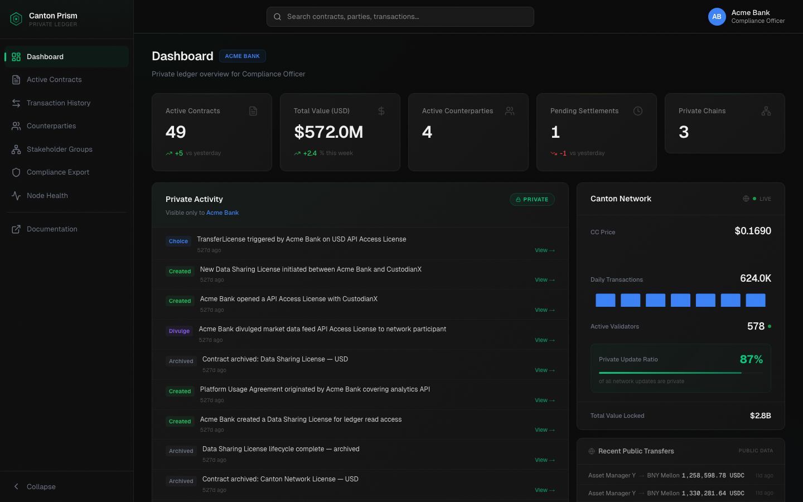

**Active Contracts — cross-template contract set with filtering**
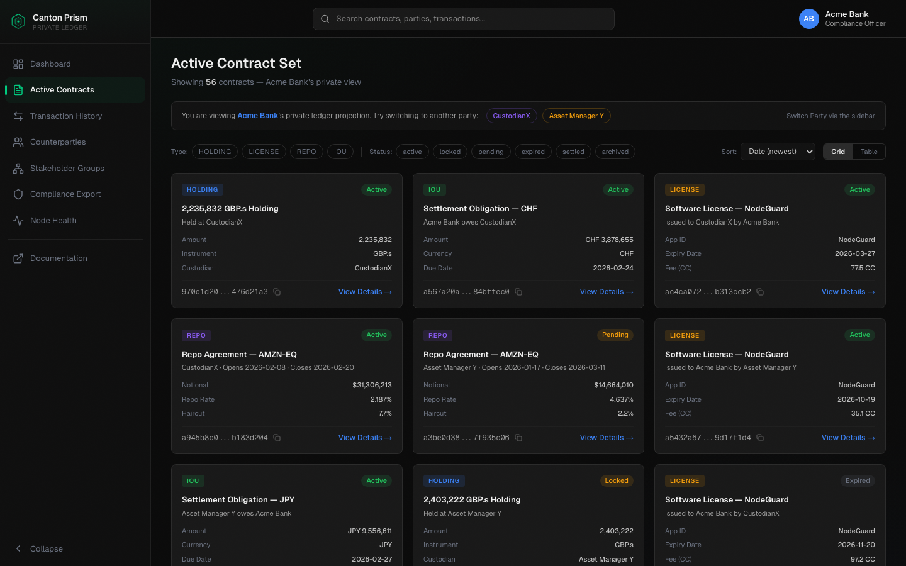

**Contract Detail — decoded business view, authorization section, raw JSON toggle**
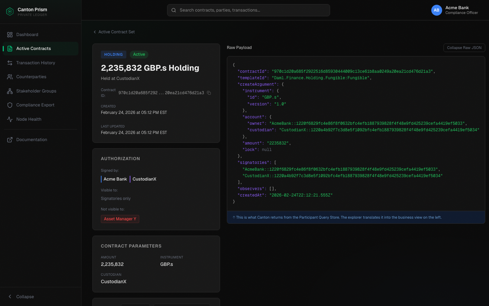

**Transaction History — full event timeline with advanced filters**
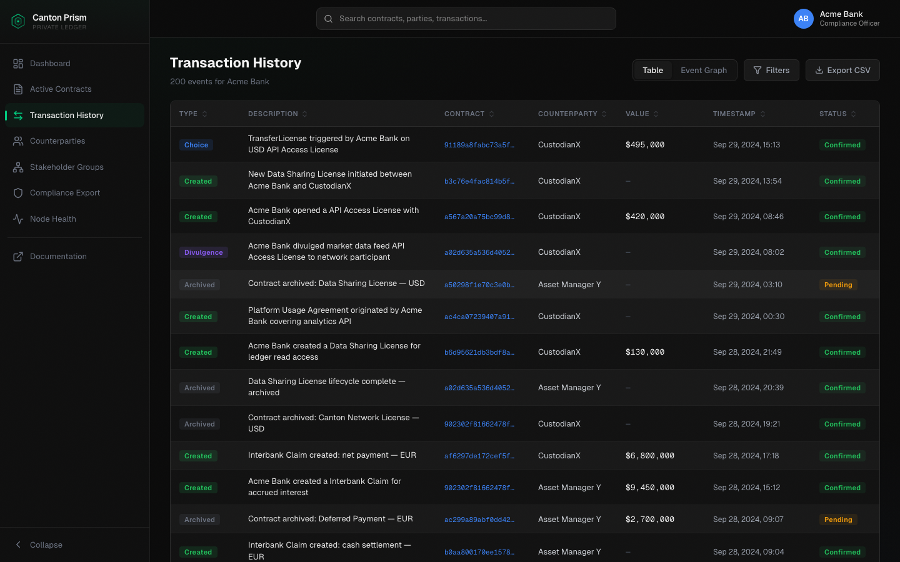

**Contract Lifecycle Graph — React Flow DAG of contract events**
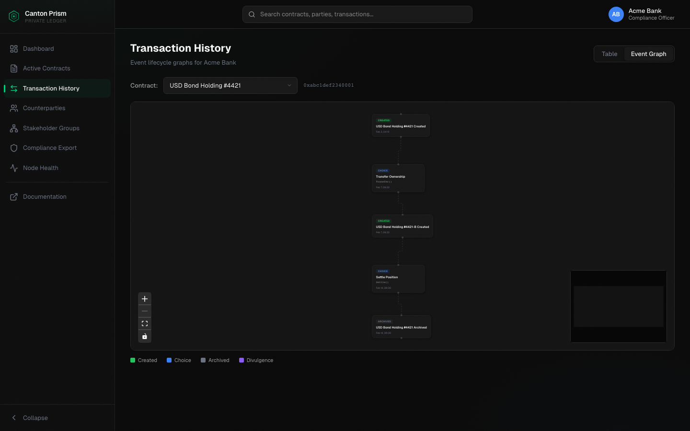

**Stakeholder Groups — network topology graph showing canton chain visibility across parties**
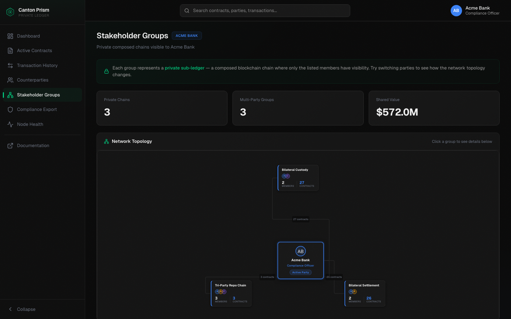

**Compliance Export — party-scoped PDF audit package generation**
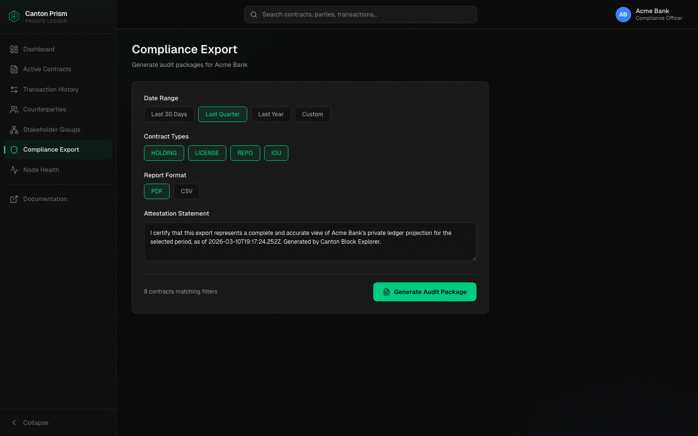

**Node Health — sequencer delay, PQS backlog, validator connections**
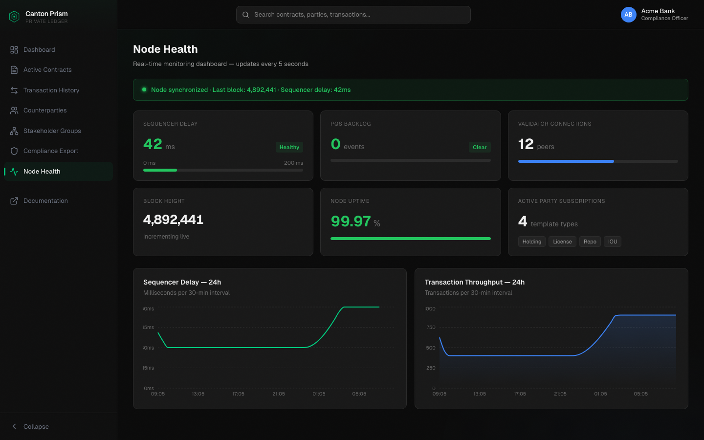

---

## Specification

### 1. Objective

Canton has crossed the infrastructure threshold. Over $6 trillion in tokenized assets. $280 billion in daily Treasury repo. 600+ nodes. The participants are here. The problem that emerges at this scale is operational, not architectural.

Every Canton participant can already query their private ledger data via the Participant Query Store. In practice, the people who need to act on that data — compliance officers generating audit packages, operations leads monitoring settlement exposure, auditors reviewing counterparty positions — cannot. Their only options are:

- Ask an engineer to write a PQS SQL query against a Postgres database
- Use Daml Shell, a developer terminal application
- Read Grafana infrastructure dashboards built for node operators, not financial professionals

A raw Daml JSON contract payload contains a hex contract ID, a package-hash template reference, party IDs in cryptographic fingerprint format, and field values without display context. A compliance officer cannot determine from it which counterparty owes what, whether the contract is settled, or whether it should appear in a regulatory report. That translation currently requires a Daml-trained engineer every time.

The second compounding problem: a participant operating across multiple Canton applications has no unified view. They log into separate application UIs — one for tokenized holdings, one for repo, one for collateral — each showing a fragment of their total Canton position. There is no cross-application aggregation layer.

The Participant Workbench removes both constraints. It is the translation layer that makes Canton's private ledger data legible to the people who are operationally responsible for it.

### System Architecture

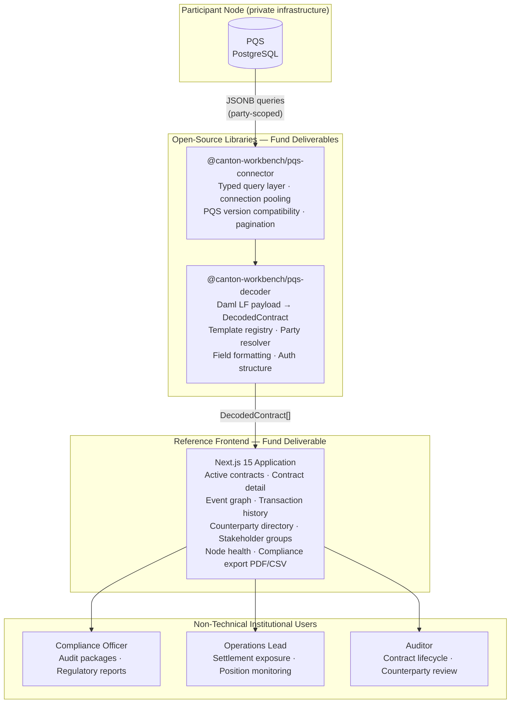

### 2. Implementation Mechanics

**Component 1 — Daml Contract Decoder Library (`@canton-workbench/pqs-decoder`)**

A TypeScript/JavaScript library that accepts a raw PQS JSON payload and returns a fully typed, human-readable contract representation. The library:

- Resolves template IDs (package hash + module + entity) to human display names via a configurable template registry
- Resolves Party IDs (the `Party::1220...` fingerprint format) to display names via a configurable party directory
- Maps `createArgument` fields to typed, formatted values (monetary amounts with currency, dates in ISO 8601, boolean flags as status labels)
- Surfaces authorization structure explicitly: signatories, observers, and by inference which named parties cannot observe the contract
- Produces a normalized `DecodedContract` type that any frontend can consume without Daml expertise

The translation the decoder performs — from raw PQS payload to human-readable representation:

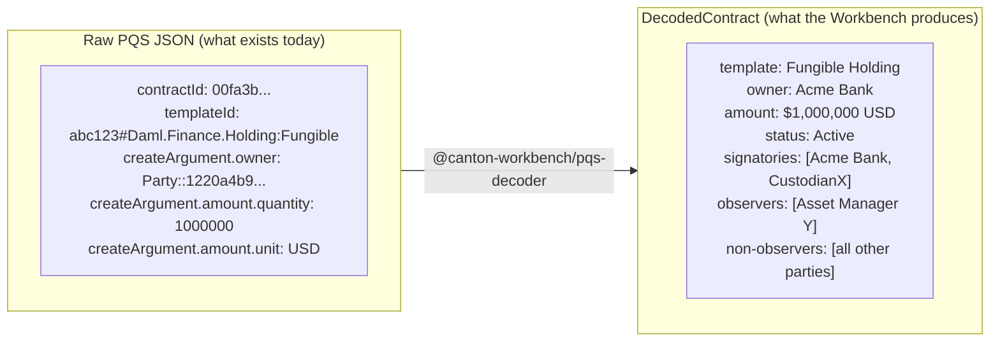

Ships with built-in decoders for all Daml Finance standard templates (Holding, Instrument, Account, Settlement, Batch) and Canton Utilities layer templates. New template types are added via a typed configuration schema — a JSON/YAML file mapping template IDs to field display configurations — so application builders can extend the library without modifying its core. The registry is designed to accept Daml interface types, extending naturally to any future template types that conform to Daml Finance interfaces.

**Component 2 — PQS Connector (`@canton-workbench/pqs-connector`)**

A typed query layer that wraps raw PQS PostgreSQL access with a structured API:

```typescript
// Active contract set for a party
const contracts = await pqs.getActiveContracts({ party, templateFilter, dateRange });

// Full event history
const events = await pqs.getTransactionHistory({ party, eventTypes, counterparty });

// Contract lifecycle (for event graph rendering)
const lifecycle = await pqs.getContractLifecycle({ contractId });
```

The connector handles PQS schema differences across Canton versions, manages connection pooling, and provides a pagination interface suitable for large datasets. It is the typed abstraction that application builders use instead of writing raw JSONB queries against PQS.

**Component 3 — Compliance Export Schema (open standard)**

A defined JSON schema and PDF layout specification for Canton participant audit packages. The schema specifies:

- Required fields for a compliant contract listing (template type, parties, value, status, contract ID, created timestamp)
- Event attestation record format (event type, timestamp, transaction ID, parties involved)
- Attestation statement structure with timestamp and node identifier

Publishing this as an open standard means audit packages generated by different tools — the Workbench, an application-specific interface, a bespoke bank integration — are structurally consistent. A regulator receiving a Canton audit package from two different institutions can apply the same review process to both.

**Component 4 — Reference Frontend Implementation**

A complete, deployable Next.js 15 application demonstrating all three components working together against a real PQS instance. This is production-quality code that a node operator can fork, configure with their participant's PQS connection string, and deploy in under an hour.

The reference implementation includes:

- Cross-application active contract set with filtering and search (grid and table views)
- Contract detail view: decoded business representation, raw JSON toggle, authorization section (signatories / observers / non-observers)
- Transaction history: full event type coverage (CREATE, EXERCISE, ARCHIVE, DIVULGENCE), advanced filters, CSV export
- Contract lifecycle event graph (React Flow directed acyclic graph, minimum 5 distinct lifecycles)
- Counterparty directory with shared contract summary
- Stakeholder Groups — network topology graph showing the Canton chain visibility subgraph for each group: which parties are co-signatories, which are observers, and the contractual relationships between them
- Compliance export workflow: PDF and CSV generation conforming to the open schema
- Node health dashboard: sequencer delay, PQS backlog, validator connections, sync status, 24-hour historical charts
- Multi-party view: switch between parties hosted on the same participant node; all data views update correctly

The repository includes full documentation, a local development environment using the Canton Quickstart LocalNet with seeded contract data, and a "how to add a new contract type" guide requiring no code changes to the core library.

**Tech stack:** Next.js 15 (App Router), TypeScript, Tailwind CSS + shadcn/ui, Zustand (party-scope state), SWR (polling), React Flow (event graph), Recharts (health charts), jsPDF + html2canvas (export).

### 3. Architectural Alignment

**Privacy model.** The Workbench does not aggregate data across participants, create cross-participant data pipelines, or expose any data beyond what the participant's PQS already contains. Each deployment is isolated to a single participant node. The authorization section — showing which parties cannot observe a contract — surfaces Canton's privacy model to non-technical users rather than obscuring it.

**PQS as canonical interface.** The connector and decoder use PQS as their sole data source, consistent with Canton's recommended read path for application UIs. No custom Canton node protocol is involved.

**Composability.** The decoder library is shared infrastructure for the Canton application ecosystem. Any Canton application builder who uses `@canton-workbench/pqs-decoder` avoids rebuilding the same translation layer. This reduces duplication and creates a consistent user experience across Canton applications.

**CIP alignment.** The decoder library's template registry is designed to accept Daml interface types, remaining compatible with any future CIP that standardizes PQS query patterns or Daml LF decoding. The compliance export schema will be published under a versioned open schema and shared with the Canton developer community; whether it eventually becomes a formal CIP is a community decision that this proposal does not try to predetermine.

**Complements existing tooling without duplicating it.** CantonScan, The Tie, and CC Explorer serve public network data. The Noves Data App serves technical users via API. The Workbench serves non-technical institutional staff with private ledger data. Different audiences, different data sources, different use cases — no meaningful overlap.

### 4. Backward Compatibility

No backward compatibility impact. The Workbench is a pure read-path application. It does not modify Canton nodes, PQS, or any existing Canton tooling. A mock data mode is always retained, so the application remains demonstrable without a live PQS connection. No Canton node configuration changes are required.

---

## Milestones and Deliverables

### Milestone 1: Foundation (Weeks 1–6)

- **Estimated Delivery:** 6 weeks from grant approval
- **Focus:** Open-source library release — PQS connector, decoder library, local dev environment
- **Deliverables / Value Metrics:**
  - `@canton-workbench/pqs-connector` v1.0 published to npm, MIT licensed
  - `@canton-workbench/pqs-decoder` v1.0 with built-in decoders for all Daml Finance standard templates (Holding, Instrument, Account, Settlement, Batch)
  - Decoder configuration schema documented with worked examples for CIP-56 token standard assets
  - Local development environment: docker-compose using Canton Quickstart LocalNet with seeded contract data covering all supported template types
  - Unit test suite with ≥90% coverage on decoder library; integration tests against LocalNet
  - README quickstart: PQS connection string → decoded contract output in ≤10 lines of code

### Milestone 2: Reference Frontend (Weeks 7–14)

- **Estimated Delivery:** 8 weeks after Milestone 1 acceptance
- **Focus:** Production-quality reference frontend demonstrating all components against a real Canton PQS
- **Deliverables / Value Metrics:**
  - Reference Next.js application, MIT licensed, with all pages: active contracts, contract detail, transaction history, event graph, counterparty directory, stakeholder groups network topology, node health, and compliance export
  - Tested against Canton Network testnet; all supported template types render correctly
  - Multi-party support verified: switching parties updates all data views correctly including stakeholder group topology
  - CSV export generates a valid, correctly formatted file for any filtered transaction history view
  - Deployment guide verified: a reviewer with no prior codebase knowledge can deploy a running instance from the guide alone, within one hour
  - "How to add a new contract type" guide: end-to-end walkthrough using only the configuration schema, no code changes
  - Joint technical blog post with Canton Foundation

### Milestone 3: Compliance Export Standard and Documentation (Weeks 15–18)

- **Estimated Delivery:** 4 weeks after Milestone 2 acceptance
- **Focus:** Open compliance standard, ecosystem integration guide, Canton developer docs contribution
- **Deliverables / Value Metrics:**
  - Open compliance export schema v1.0: JSON Schema definition for Canton audit packages (contract listings + event attestation records), with field definitions, rationale, and example output for each supported template type; published to GitHub under MIT license
  - PDF export in the reference frontend conforming to the schema; passes JSON Schema validation
  - Integration guide for Canton application builders: how to use `@canton-workbench/pqs-decoder` and `@canton-workbench/pqs-connector` in an existing Canton application frontend; published alongside the schema with a community feedback period of at least 2 weeks before milestone claim
  - PR to canton.network developer docs adding the Participant Workbench libraries to the developer tooling section (merged or confirmed in review)

### Delivery Timeline

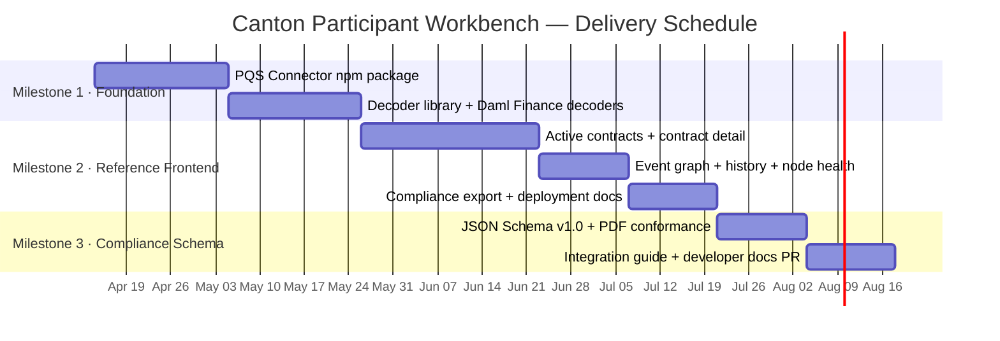

---

## Acceptance Criteria

The Tech & Ops Committee will evaluate completion based on:

- Deliverables completed as specified for each milestone
- Demonstrated functionality or operational readiness
- Documentation and knowledge transfer provided
- Alignment with stated value metrics

**Project-specific acceptance conditions:**

- **M1:** Both npm packages installable and functional against a live PQS; all Daml Finance template types decoded correctly end-to-end; all tests pass against Canton SDK current stable release
- **M2:** Application connects to Canton Network testnet PQS and renders correctly for all supported template types; deployment guide independently verified by a reviewer with no prior codebase knowledge within one hour
- **M3:** Compliance export schema passes JSON Schema validation; PDF export structurally consistent with schema; integration guide published with evidence of a minimum 2-week community feedback period (forum post, Discord announcement, or equivalent); Canton developer docs PR merged or confirmed in review

---

## Funding

**Total Funding Request:** 1,150,000 CC (~$166,750 at ~$0.145/CC as of March 2026)

### Payment Breakdown by Milestone

- Milestone 1 _(Foundation)_: 300,000 CC upon committee acceptance
- Milestone 2 _(Reference Frontend)_: 600,000 CC upon committee acceptance
- Milestone 3 _(Compliance Export Standard and Documentation)_: 250,000 CC upon final acceptance

### Volatility Stipulation

Project duration is approximately 18 weeks — under the 6-month threshold. Should the project timeline extend beyond 6 months due to Committee-requested scope changes, any remaining milestones must be renegotiated to account for significant USD/CC price volatility. All milestone amounts are denominated in fixed CC at the rate applicable at each milestone acceptance.

### Pre-Grant Contribution Note

Approximately 5–7 weeks of engineering effort have already been invested in the existing working demo (full frontend, party-switching architecture, contract visualization, compliance export, node health dashboard). This work is provided at no cost to the Fund. The grant funds the incremental work required to produce open-source production libraries and a live-PQS reference implementation.

---

## Co-Marketing

Upon release, the implementing entity will collaborate with the Canton Foundation on:

- Announcement coordination at Milestone 1 (public npm package launch)
- Listing in the Canton tooling / ecosystem partner directory
- Joint technical blog post at Milestone 2 (PQS integration deep-dive)
- Demo video published on Canton channels at Milestone 1
- Publication and community promotion of the compliance export schema at Milestone 3
- Conference or community presentation at Milestone 3 (developer SDK and schema launch)

---

## Motivation

The single most cited barrier to institutional Canton adoption after the Daml learning curve is operational visibility for non-technical staff. A compliance officer who cannot generate a regulatory report from their Canton node without engaging an engineer is a compliance officer whose institution is slower to expand its Canton footprint.

Every Canton participant can already query their private ledger data via PQS. The problem is that the people who need to act on that data — in compliance, operations, audit — have no interface that speaks their language. The Workbench removes that constraint directly and at the right level of the stack: shared infrastructure that every Canton application builder and every node operator can deploy, rather than a one-off integration at a single institution.

The second lever is developer velocity. Every new Canton application that launches today requires its own PQS translation layer, its own contract display logic, its own compliance export implementation. The decoder library and PQS connector eliminate that duplication across the ecosystem. Every future application builder who uses the open-source components avoids weeks of re-implementation. The compliance export schema, once published as an open standard, creates interoperability between applications and the compliance workflows that operate across them.

---

## Rationale

**Why open-source shared libraries rather than an application?** A single application helps one deployment. Shared libraries help every Canton application builder and every node operator. The commercial incentive for the team to maintain the libraries is structural — they underpin the team's own product — rather than relying on goodwill or ongoing grants.

**Why Next.js 15?** Institutional application teams building on Canton are predominantly React shops. Next.js 15 with App Router is the dominant production framework in this segment. Server Components allow PQS queries to run server-side, eliminating CORS exposure and simplifying auth token handling — a meaningful security improvement over a pure client-side approach.

**Why PQS as the sole data interface?** PQS is Canton's recommended read path for application UIs. Building against PQS ensures the libraries and reference implementation remain compatible with Canton's evolution and avoids coupling to internal node APIs.

**Why a compliance export schema as an open standard?** Without a shared schema, a compliance officer receiving Canton audit packages from two different institutions must apply two different review processes. A regulator receiving them encounters structural inconsistency. Solving this at the standard level is more durable than solving it inside any single application.

**Alternatives considered:**
- *Adapting Hyperledger Explorer:* Not compatible with Canton's privacy architecture; would require deep modification with uncertain outcome.
- *Building a generic PQS SQL UI:* A generic SQL interface exposes raw Daml JSON with no decoding — identical to the status quo for non-technical users.
- *Each application builder solving this independently:* The current situation. Produces inconsistent results, duplicates effort, raises the bar for new entrants.

---

## Long-Term Maintenance Plan

The open-source components will be maintained as long as the team operates a commercial product built on top of them. The commercial product depends on these libraries remaining current with Canton SDK releases — the maintenance incentive is structural, not voluntary.

For Canton SDK version compatibility: the connector and decoder will be tested against each Canton SDK stable release within 30 days of release. Breaking changes to PQS schema or Daml Finance template types will be addressed in a patch release. The compliance export schema will be versioned independently (minor version for backward-compatible additions; major version with migration guide for breaking changes).

The Canton Foundation is welcome to fork any component under the MIT license if the project team ceases maintenance. The reference implementation and all documentation will remain publicly accessible.

---

## Adoption and Distribution Plan

**npm publication (Milestone 1):** Both packages published to npm under a public scope on Milestone 1 completion. Announced to the Canton developer community via the official developer forum and Discord. Submitted to the Canton Foundation's partner/app directory.

**Designed-in adoption:** The "how to add a new contract type" guide is designed so that any Canton application builder can extend the decoder for their own templates in under an hour. The compliance export schema is published as a versioned open standard — not mandatory, but a shared reference that creates interoperability across tools and audit workflows.

**Node operator distribution:** The reference frontend is deployable by any node-as-a-service provider as a white-labeled participant dashboard. The deployment guide targets this audience explicitly. Node operators who add the Workbench to their service offering give their institutional clients operational visibility that no other Canton tooling currently provides.

**Target early adopters:** Participants operating across multiple Canton applications (cross-app aggregation); compliance teams preparing for their first regulator review of Canton activity; node operators looking to differentiate their managed node service.

---

## Ecosystem Positioning

The fund received a significant number of proposals in the same window as this submission. We have reviewed them and make the following observations about where this proposal sits relative to the broader landscape.

**No direct overlap with any current proposal.** The active proposals cover BFT protocol upgrades (Digital Asset), formal verification tooling (Informal Systems, Quantstamp), identity and party resolution (Freename AG), a C# SDK (Peaceful Studio), a visual contract builder (Canton Flow), a gamification SDK (Tap Ants), an AI agent layer (Chris Huang), indexers targeting developer/API consumers (Zpoken, illegalcall), and a node management console (Noders). None of these address the compliance officer and institutional operations user as the primary audience, and none combine a PQS decoder library with a compliance-grade UI in a single open-source package.

**Complementary to the indexer proposals.** The Zpoken and illegalcall indexers are backend infrastructure for developers — they surface raw event data via REST/GraphQL. The Workbench is a UI layer for non-technical staff — it translates that data into human-readable contract representations. These are different layers of the stack serving different users. If the committee funds both, they compose naturally; if it funds only one tier, the Workbench fills the user-facing gap the indexers intentionally leave open.

**Complementary to Digital Asset's PQS open-sourcing (PR #67).** The Workbench assumes PQS is available and focuses entirely on the application layer above it. If PQS open-sourcing accelerates PQS adoption across participants, the Workbench's addressable deployment base grows. These proposals reinforce each other rather than compete.

**Addresses a user population not served by any other proposal.** Every other proposal targets developers, validators, or protocol operators. The institutional compliance officer — who needs to generate a regulatory report from their Canton node without writing SQL — is not served by any other proposal in the current batch. This is the user population that determines whether institutions expand their Canton footprint after the initial deployment. Tooling for this user is a gap, not a duplication.

**Scope and cost are proportionate.** At 1,150,000 CC (~$166,750) over 18 weeks, this proposal sits well within the range of comparable ecosystem tooling grants. The working demo at https://canton-prism.vercel.app/ reduces execution risk: the architecture is proven, the UI exists, and the remaining work is a defined connector integration and library extraction rather than a greenfield build.
