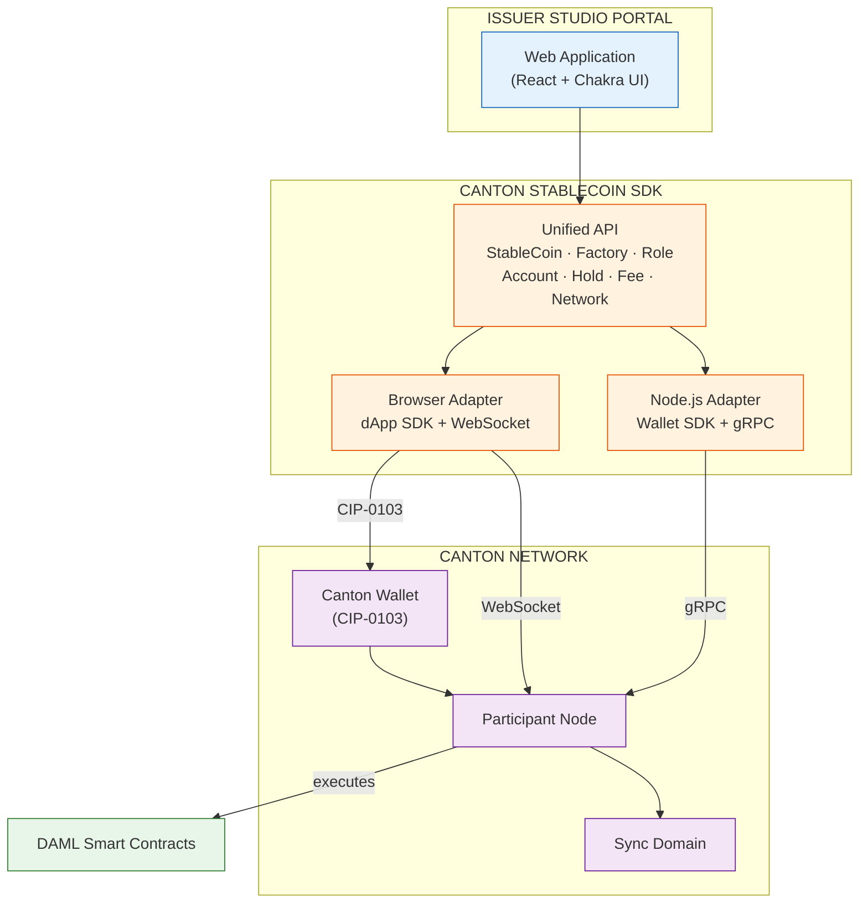

## Development Fund Proposal

**Author:** [Varmeta](https://var-meta.com)
**Status:** Draft
**Created:** 2026-03-12

---

## Abstract
Canton Stablecoin Studio is a platform for creating and managing stablecoins natively on Canton Network. It provides a common toolkit covering stablecoin creation, token operations, compliance, proof of reserve, fee management, and token settings - delivered as smart contracts, an SDK, and a web application.

---

## Specification

### 1. Objective
Canton Network currently lacks a turnkey platform for stablecoin issuance. Institutions seeking to issue regulated stablecoins need compliant, privacy-preserving infrastructure that integrates with existing financial workflows. Canton Stablecoin Studio fills this gap by providing a complete toolkit for the stablecoin lifecycle - from creation and minting through compliance enforcement and reserve management.

### 2. Implementation Mechanics
#### 2.1. System Architecture

#### 2.2 Component Descriptions

- **Issuer Studio Portal** — Web application (React + Chakra UI) and CLI tool (Commander + Inquirer) for issuers to create, configure, and manage stablecoins. All operations go through the SDK.
- **Canton Stablecoin SDK** — TypeScript library providing a unified API for all stablecoin operations. Ships as two bundles: browser (dApp SDK + WebSocket) and Node.js (Wallet SDK + gRPC). Uses CQRS internally.
- **DAML Smart Contracts** — On-ledger business logic as DAML templates. Covers stablecoin lifecycle, role-based access, UTXO-like holdings (CIP-0056), reserves, on-ledger multi-sig, KYC, fees, and escrow holds.
- **Canton Network** — Infrastructure layer: Canton Wallet (key management + signing), Participant Node (DAML execution + Ledger API), and Sync Domain (ordering + privacy).

#### 2.3 Interaction Flow

1. **Portal → SDK**: The Web App and CLI call the SDK's unified API for all operations (create stablecoin, mint, burn, transfer, manage roles, etc.). Neither interface interacts with Canton directly.
2. **SDK → Canton Network (Browser path)**: The SDK's browser adapter sends commands to the Canton Wallet via CIP-0103 for signing, and subscribes to the Participant Node's JSON Ledger API over WebSocket for real-time ACS updates.
3. **SDK → Canton Network (Node.js path)**: The SDK's Node.js adapter connects directly to the Participant Node via Ledger API v2 gRPC, managing keys and submitting transactions without a wallet intermediary.
4. **Participant Node → DAML Contracts**: The Participant Node receives commands, executes the corresponding DAML contract choices (e.g., `CreateStableCoin`, `Mint`, `Transfer`), and updates the Active Contract Set.
5. **Participant Node → Sync Domain**: The Participant Node coordinates with the Sync Domain (sequencer + mediator) for transaction ordering, conflict detection, and cross-participant privacy.

### 3. Architectural Alignment
- Built natively on Canton using DAML smart contracts (no EVM/Solidity dependency)
- Compliant with CIP-0056 (Token Standard) and CIP-0103 (dApp-Wallet protocol)
- Leverages Canton's built-in privacy model and multi-party authorization
- Frontend-first architecture - no backend coordinator required

### 4. Backward Compatibility
*No backward compatibility impact.* This is a greenfield project with no dependencies on existing Canton applications or workflows.

---

## Milestones and Deliverables

### Milestone 1: Issuer MVP
- **Estimated Delivery:** Week 3
- **Focus:** Factory-based stablecoin creation, mint (cash-in), burn, wipe, transfer, escrow holds, multi-signature proposals, and supplier allowances - delivered as DAML smart contracts, TypeScript SDK, and React web application.
- **Deliverables / Value Metrics:** A stablecoin issuer can create a new stablecoin and perform all core token operations end-to-end through the web application. First working product demonstrating Canton's viability for institutional stablecoin issuance.

### Milestone 2: Regulatory Readiness
- **Estimated Delivery:** Week 6
- **Focus:** On-ledger KYC with external provider integration, account freeze/unfreeze, token pause/unpause, 11-role access control, four proof-of-reserve modes (Internal, External, CrossChain, NoReserve) with staleness enforcement, and configurable fee schedules.
- **Deliverables / Value Metrics:** The platform meets the compliance and transparency requirements for regulated stablecoin issuance - KYC-gated operations, granular role-based permissions, verifiable reserves, and fee management. Ready for institutional adoption in regulated environments.

### Milestone 3: Production Release
- **Estimated Delivery:** Week 8
- **Focus:** End-to-end test suite, API documentation, deployment guide, CIP-0056/CIP-0103 conformance verification, and internal security self-audit of all DAML smart contracts.
- **Deliverables / Value Metrics:** Production-ready platform with full test coverage, comprehensive documentation, verified standard compliance, and a security audit report covering access control correctness, reentrancy safety, and oracle manipulation resistance. Ready for go-live on Canton Network.

---

## Acceptance Criteria
The Tech & Ops Committee will evaluate completion based on:

- Deliverables completed as specified for each milestone
- Demonstrated functionality or operational readiness
- Documentation and knowledge transfer provided
- Alignment with stated value metrics

Project-specific conditions:
- **M1:** Live demo of end-to-end stablecoin creation and all token operations via the web application; SDK functional for all operations; automated contract tests passing
- **M2:** KYC enforcement demonstrated on mint and transfer; freeze/pause controls verified; all 11 roles tested with correct permission boundaries; at least two reserve modes validated with staleness rejection; fee collection demonstrated on transfers
- **M3:** E2E test suite passing across isolated issuer environments; ≥90% line coverage on DAML smart contracts; API reference and deployment guide reviewed and accepted by the Tech & Ops Committee; CIP-0056 and CIP-0103 conformance verified; internal security self-audit report delivered covering access control, reentrancy, and oracle manipulation vectors

---

## Funding

**Total Funding Request:** 120,000 CC

### Payment Breakdown by Milestone
- Milestone 1 (Issuer MVP): 40,000 CC upon committee acceptance
- Milestone 2 (Regulatory Readiness): 60,000 CC upon committee acceptance
- Milestone 3 (Production Release): 20,000 CC upon final release and acceptance

### Volatility Stipulation
If the project duration is **greater than 6 months**:  
The grant is denominated in fixed Canton Coin and will require a re-evaluation at the 6-month mark.

If the project duration is **under 6 months**:  
Should the project timeline extend beyond 6 months due to Committee-requested scope changes, any remaining milestones must be renegotiated to account for significant USD/CC price volatility.

---

## Co-Marketing
Upon release, the implementing entity will collaborate with the Foundation on:

- Announcement coordination
- Technical blog post or case study on Canton stablecoin infrastructure
- Developer and ecosystem promotion through workshops or documentation showcases

---

## Motivation

- Regulated stablecoin issuance is a foundational use case for any financial blockchain network
- Enables institutions to issue and manage compliant stablecoins without building custom infrastructure from scratch
- Attracts institutional issuers to Canton Network
- Demonstrates Canton's capabilities for production-grade financial infrastructure
- Establishes a reusable toolkit that accelerates future tokenization projects across the ecosystem

---

## Rationale

- **DAML-native approach** - leverages Canton's built-in privacy model and multi-party authorization
- **Frontend-first architecture** (no backend coordinator) - reduces operational complexity and attack surface for issuers
- **Abstract oracle interface** for proof of reserve - supports all reserve models (internal, external, cross-chain) without requiring architecture changes
- **Modular toolkit design** - allows issuers to adopt only the capabilities they need, enabling reuse across different stablecoin use cases and regulatory regimes
