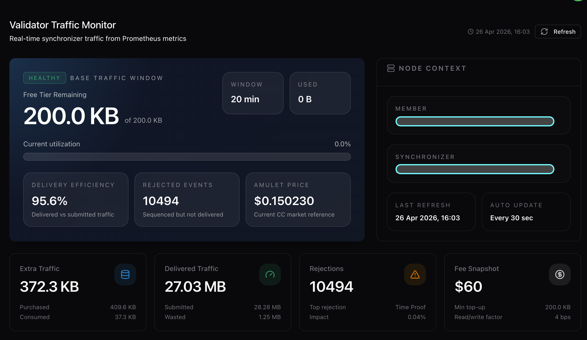
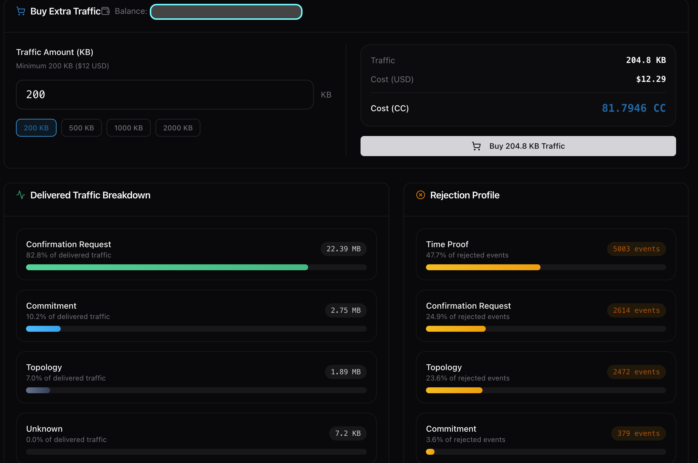

## Development Fund Proposal

**Author:** Irpan, Askardex (irpan@askardex.com)
**Status:** Submitted
**Created:** 2026-04-26
**Label:** node-deployment-operations
**Champion:** Requesting from [SIG Directory](https://github.com/canton-foundation/canton-dev-fund/blob/main/sig-directory.md) - best fit: Node Deployment & Operations or Canton APIs. Open to Committee assignment.

---

## Abstract

The **Canton Validator Traffic & Fee Operations Toolkit** is an open-source (Apache-2.0) suite of libraries, a daemon, a CLI, and a reference dashboard that gives every Canton validator and Super Validator (SV) operator the missing **economic operations layer**: real-bytes traffic accounting, per-action traffic benchmarks, round-aware fee calculation, traffic top-up automation, live traffic state monitoring, and round/SV scan health diagnostics.

The toolkit is extracted from internal tooling that today operates Askardex's Canton-mainnet **Wallet** and **Bridge** services: fee accounting, traffic poller, and an internal validator-ops admin dashboard at `/validator/traffic`. Generalizing this code into a reusable toolkit lowers the operational total cost of ownership (TCO) for every validator on Canton, removes the need for each operator to reinvent the same fee accounting and traffic monitoring stack, and provides the ecosystem with a canonical reference for traffic estimation against the JSON Ledger API v2 `costEstimation` field.

Scope is intentionally narrow and 100 % focused on **validator economic operations**. App-developer concerns (LocalNet, codegen, DAR uploads, topology export, party lookup) are explicitly out of scope and are addressed by other proposals (Denex Toolkit #238 for dev tooling, `daml_package_analyzer` for static analysis, PQS for event indexing). Adoption is measured by validator/SV deployments outside Askardex, npm downloads, and operator endorsements.

---

## Specification

### 1. Objective

Canton validator and SV operators today face four recurring **economic-operations** pain points without a shared open-source solution:

1. **Fee determination is opaque.** Every operator who wants to charge users an accurate per-transaction fee must reverse-engineer the JSON Ledger API v2 `costEstimation.totalTrafficCostEstimation` field, build their own per-action averaging logic, and write code to apply the live `extraTrafficPrice` from `AmuletRules` per round. Most operators end up with hardcoded byte estimates that drift from reality, causing either over-charging users or under-collecting and absorbing the loss.
2. **Traffic state is invisible.** Operators do not know how much traffic they have left, when they will run out, or which actions consume the most bytes. The participant exposes `/internal/traffic-state` and `/internal/participant-metrics`, but each operator must build their own poller, persistence layer, and alerting on top.
3. **Top-up is manual.** When an operator's reserved traffic balance is depleted, they must manually exercise the `traffic-purchase` choice on Splice. No public toolkit ships an automated top-up flow.
4. **Round and SV scan health is bespoke.** Every team writes their own shell scripts for round drift detection, SV scan URL drift, and round timing analysis.

These four pain points are not independent problems. They are all facets of one gap: Canton has no shared economic-operations layer for validator operators. Every component in this proposal serves that single objective. The fee engine, the traffic poller, the diagnostics library, and the CLI are interconnected parts of one operational stack, not separate tools bundled together for convenience.

**Outcome.** A single, well-documented Apache-2.0 toolkit that any validator or SV operator can install in under 30 minutes and run for the full lifecycle of their node, covering accurate fee charging, traffic visibility, automated top-up, and round health monitoring.

### 2. Implementation Mechanics

The toolkit ships as three Node.js packages, one CLI binary, and one reference dashboard, all published as open source:

| Component | Purpose |
|---|---|
| `@canton-ops/fee-engine` (library) | Real-bytes estimation via `PrepareSubmission` + `costEstimation`; per-action 7-day averaging from local SQLite/Postgres; round-aware fee calculator using live `extraTrafficPrice` from `AmuletRules` |
| `@canton-ops/traffic-poller` (daemon) | Background poll of participant `/internal/traffic-state` and `/internal/participant-metrics`; snapshot to DB; webhook + Prometheus alerting; auto top-up via `traffic-purchase` choice |
| `@canton-ops/diagnostics` (library) | Round drift detector, SV scan URL drift checker, round timing inspector |
| `canton-ops` (CLI binary) | Single-file executable wrapping `traffic status`, `traffic estimate <command-json>`, `traffic history`, `traffic top-up`, `health check`, `sv scan check`, `round inspect` |
| Reference Dashboard (Next.js app) | Open-source generalization of Askardex's internal `/validator/traffic` admin view, deployable against any participant in under 30 minutes |

**Architecture aligns with Canton 3.4+ JSON Ledger API v2.** The fee engine consumes `estimateTrafficCost: {}` on `PrepareSubmission` and parses `confirmationRequestTrafficCostEstimation` / `confirmationResponseTrafficCostEstimation` / `totalTrafficCostEstimation` (string-typed bigints). It does **not** depend on deprecated `@daml/ledger`. Diagnostics use existing public participant admin endpoints and the Splice Scan Proxy API.

**Reference data: what already exists inside Askardex.** Each component below is in active operational use behind Askardex's mainnet Wallet and Bridge services; the grant funds the work to extract it, generalize it, strip deployment-specific values, add cross-platform packaging, write tests, and produce documentation:

- Real-bytes fee calculation in `feeService.calculateFee` (uses `costEstimation.totalTrafficCostEstimation`, applies live `extraTrafficPrice`)
- Per-action 7-day average from `fee_transactions.traffic_bytes` (DB column added in migration 024)
- Background poller in `trafficPoller.js` against `/internal/traffic-state` and `/internal/participant-metrics`
- Auto top-up flow in `validatorRoutes.js`: `traffic-purchase` choice exercise + status tracking endpoints
- Round drift / SV scan health shell scripts (`check_rounds*.sh`, `check_all_sv_scans.sh`, `check_sv_config.sh`)
- Measurement harness in `traffictest/test_action_traffic.js`
- Internal admin dashboard at `/validator/traffic` (used by the Askardex ops team) with traffic-status, traffic-history, traffic-metrics endpoints

**Explicitly out of scope** (handled elsewhere in the ecosystem):
- ❌ DAR upload/version management (Denex Toolkit #238 for LocalNet; `dpm` for production)
- ❌ Topology export and audit (Participant Workbench #68 territory)
- ❌ Party lookup utility (small enough to live in `dpm` / Denex)
- ❌ App-specific decoders (each app's own concern)

### 2.1 Existing Work Evidence

The components proposed here are **not theoretical**. They are operational today inside Askardex's internal stack, behind the Wallet and Bridge mainnet services. The grant funds the work to **extract, generalize, sanitize, package, document, and adopt** these components as Apache-2.0 public infrastructure.

| Component | Where it runs today | What the grant adds |
|---|---|---|
| Real-bytes fee engine | `askardex-wallet-api/src/services/feeService.js` - calls `PrepareSubmission` with `estimateTrafficCost: {}` and reads `costEstimation.totalTrafficCostEstimation` per transaction | Public API surface, types, test coverage, npm package, `@daml/ledger`-free implementation |
| Round-aware fee calc | `feeService.calculateFee` - applies live `AmuletRules.fees.extraTrafficPrice` per current round | Generalized round resolution, mock for offline testing |
| Per-action 7-day average | `fee_transactions` table (DB migration 024) - `traffic_bytes` column populated per fee event | Pluggable storage backend (SQLite for small operators, Postgres for larger) |
| Traffic poller daemon | `askardex-wallet-api/src/services/trafficPoller.js` - polls participant `/internal/traffic-state` and `/internal/participant-metrics` | Standalone daemon binary, Docker image, Prometheus exporter, webhook alerting |
| Auto top-up flow | `askardex-wallet-api/src/routes/validatorRoutes.js` - `POST /admin/validator/traffic-purchase` exercising the `traffic-purchase` choice + tracking endpoints | Configurable thresholds, retry logic, audit log |
| Internal admin dashboard | `askardex-admin/src/pages/validator/ValidatorTrafficPage.tsx` + `ReportPage.tsx` - used by Askardex ops team | Sanitized OSS extract, secrets-free deploy, Docker, multi-tenant ready |
| Action traffic measurement | `traffictest/test_action_traffic.js` - measures bytes per template+choice for benchmark baseline | Action library, CI integration, public benchmark dataset |

**Sanitized screenshots** of the internal admin dashboard (`/validator/traffic`) follow. Party IDs, user IDs, and customer balances are redacted; traffic byte values and Splice public rules (`extraTrafficPrice`, round numbers, action labels) remain visible:

Live demonstrations against Askardex's internal environment can be made available privately to the Champion and the Tech & Ops Committee on request.

### 3. Architectural Alignment

- **Q2 2026 priorities: direct match.** "Stability & Maintainability" (operator TCO) and "Scaling" (traffic is the scaling primitive in Canton's economic model, and accurate fee accounting is upstream of healthy scaling).
- **Builds on Splice + DA primitives.** Consumes `AmuletRules.fees.extraTrafficPrice`, JSON Ledger API v2 `costEstimation`, participant admin metrics. No parallel infrastructure introduced.
- **Complements existing proposals, does not overlap.**
  - Denex Toolkit (PR #238) → app developer LocalNet workflows.
  - Participant Workbench (PR #68) → compliance UI consuming PQS.
  - PQS → Daml event indexing.
  - `daml_package_analyzer` (Certora) → static analysis of `.dar` files.
  - **None addresses validator-side fee economics or live traffic operations.**
- **CIP alignment.** Surfaces data needed for CIP-0082 (Development Fund) traffic economics analysis; consumes `AmuletRules` per CIP-0091 (Token Standard) cost-of-execution accounting.

### 4. Backward Compatibility

No backward compatibility impact. The toolkit is additive: it observes existing participant admin and ledger APIs, and produces standalone CLI output and library calls. The only on-ledger interaction is the `traffic-purchase` choice exercise, which is a documented, user-initiated operation already available via existing tooling.

---

## Milestones and Deliverables

### Milestone 1: Fee Engine + Traffic Poller (centerpiece)
- **Estimated Delivery:** Approval + 2 months
- **Focus:** Extract Askardex fee + traffic stack into reusable Apache-2.0 libraries
- **Deliverables / Value Metrics:**
  - `@canton-ops/fee-engine` v1.0.0 published to npm: real-bytes estimation, per-action 7-day average, round-aware fee calc
  - `@canton-ops/traffic-poller` v1.0.0 published to npm: daemon binary + Docker image + Prometheus exporter + auto top-up
  - Integration test harness against Splice LocalNet
  - **Acceptance:** Library reproduces Askardex production fee numbers within 1 % on the same workload using `costEstimation.totalTrafficCostEstimation`; daemon successfully polls a Splice LocalNet participant and persists snapshots; auto top-up exercises the `traffic-purchase` choice end-to-end on LocalNet.

### Milestone 2: Diagnostics CLI + Reference Dashboard
- **Estimated Delivery:** M1 + 1 month
- **Focus:** Operator-facing CLI and one-command-deploy dashboard
- **Deliverables / Value Metrics:**
  - `canton-ops` single-file binary (Linux + macOS + Windows): `traffic status`, `traffic estimate`, `traffic history`, `traffic top-up`, `health check`, `sv scan check`, `round inspect`
  - SQLite-backed local snapshot store (no Postgres dependency for small operators)
  - Reference Dashboard (Next.js app, Apache-2.0) reproducing the Askardex `/validator/traffic` view
  - Docker image for one-command deploy against any participant
  - **Acceptance:** CLI works against MainNet, DevNet, and Splice LocalNet without code changes; documented exit codes for CI usage; dashboard deploys and renders against Splice LocalNet with no configuration changes beyond participant URL.

### Milestone 3: Adoption (Initial)
- **Estimated Delivery:** M2 + 1 month
- **Focus:** Real-world deployments outside Askardex
- **Deliverables / Value Metrics:**
  - **3+ validator/SV operators** outside Askardex deploy the toolkit in production with public endorsement (PR comment, blog mention, or Foundation introduction)
  - At least 1 endorsement from a Foundation voting member or named SV operator
  - Documented runbook for: charging users using real-bytes fee, diagnosing round drift, configuring auto top-up
  - **Acceptance:** ≥3 external deployments verified; ≥500 weekly npm downloads on `@canton-ops/fee-engine`; runbook published.

### Milestone 4: Adoption (Broad) + 90-Day Maintenance
- **Estimated Delivery:** M3 + 1 month, plus 90-day maintenance window
- **Focus:** Sustained operation and cross-ecosystem adoption
- **Deliverables / Value Metrics:**
  - **5+ additional** validator/SV operator deployments (10+ total cumulative)
  - Splice version compatibility verified across at least two consecutive releases during the maintenance window
  - Foundation co-marketing: technical blog post + dev forum AMA
  - All P0/P1 bugs reported during the maintenance window resolved within SLA
  - **Acceptance:** Cumulative ≥10 deployments; ≥1,500 weekly npm downloads on `@canton-ops/fee-engine`; zero unresolved P0 bugs at end of maintenance window.

---

## Acceptance Criteria

The Tech & Ops Committee will evaluate completion based on:

- Deliverables completed and merged to public Apache-2.0 repository (`github.com/askardex/canton-ops`)
- At least 3 validator operators outside Askardex confirm the toolkit reduced their operational effort for traffic management (via PR comment, forum post, or direct attestation to the Committee)
- New operators can deploy traffic monitoring against their own participant in under 30 minutes following the published runbook
- Operators can diagnose traffic issues and estimate fees using the CLI without writing custom code
- Documentation published under CC-BY-4.0

Project-specific conditions:
- **Real-bytes parity:** library must produce traffic estimates within 1% of `costEstimation.totalTrafficCostEstimation` from the participant
- **No `@daml/ledger` dependency:** library must work against Canton 3.4+ JSON Ledger API v2 without requiring the deprecated runtime client
- **Cross-platform:** CLI must run on Linux, macOS, Windows without code changes
- **Ecosystem value:** adoption metrics (npm downloads, deployment confirmations, operator feedback) take priority over artifact delivery checklists

---

## Funding

**Total Funding Request:** **750,000 Canton Coin**

### Payment Breakdown by Milestone

| Milestone | Deliverable | CC | % | Trigger |
|---|---|---:|---:|---|
| M1 | Fee Engine + Traffic Poller | 220,000 | 29 % | Committee acceptance |
| M2 | Diagnostics CLI + Reference Dashboard | 180,000 | 24 % | Committee acceptance |
| M3 | Adoption: Initial (3+ external deployments) | 175,000 | 23 % | Committee acceptance after adoption verification |
| M4 | Adoption: Broad (10+ total) + 90-day Maintenance | 175,000 | 24 % | Final release after maintenance window closes |

**Backloading:** **47 %** of total funding (M3 + M4 = 350,000 CC) is paid only after independent adoption is verified. The Foundation pays the largest tranches only after sustained delivery, not on initial code drop. This structure mirrors the Participant Workbench (PR #68) backloading pattern explicitly endorsed by reviewers.

### Funding Justification

Total derives from a triangulation across three independent estimates, all converging on the 700-800 K CC range:

**A. Bottom-up effort estimate (per deliverable)**

| Component | Effort | Already in production | Net-new work |
|---|---|---|---|
| Fee Engine extract + generalize + tests + npm | 1.0 eng-month | ~60 % (Askardex `feeService.js`) | API surface, types, test coverage, npm packaging |
| Traffic Poller daemonize + Docker + Prometheus + auto top-up | 0.75 eng-month | ~50 % (Askardex `trafficPoller.js`) | Daemon harness, Docker, alerting hooks |
| Diagnostics CLI single-binary, cross-platform | 0.75 eng-month | ~40 % (shell scripts) | Unify into Node CLI, cross-platform binary, exit codes |
| Reference Dashboard OSS extract | 0.5 eng-month | ~70 % (Askardex `/validator/traffic`) | Strip Askardex secrets, deploy guide, Docker |
| Documentation + adoption support | 0.5 eng-month | 0 % | Runbook, integration guide, AMA prep |
| 90-day maintenance window | 0.5-1 eng-month | 0 % | Bug fixes, Splice version bumps, operator support |
| **Total** | **~4.5 eng-months** | | |

At an industry-standard rate of **150-175 K CC per senior eng-month** (consistent with Foundation precedent), this yields **675 K - 790 K CC**. The proposal anchors at **750 K CC**, the midpoint.

**B. Comparable-proposal benchmark**

| Proposal | Total CC | Duration | Type | CC/month |
|---|---:|---|---|---:|
| CCTools (community web) | 500,000 | 5 mo | Solo + part-time, live | 100 K |
| **This proposal** | **750,000** | **4 mo + 90-day maint** | **Small team, production-extracted** | **~165 K** |
| daml_package_analyzer (Certora) | 2,010,000 | 6 mo | Institutional, audit firm | 335 K |
| PQS Open Source (DA) | 7,800,000 | 9 mo | DA institutional infrastructure | 867 K |

Askardex toolkit is positioned **above CCTools** (deeper infrastructure, four packages, production-validated) and **well below daml_package_analyzer** (smaller scope, no audit, community-tier team).

**C. Public-good ROI**

- Adoption surface: ~30 active validators + ~10 SV operators on Canton (growing)
- Saving per operator (engineering not duplicated): 1-2 eng-months, roughly 150-300 K CC equivalent
- Ecosystem-wide saving at 10 deployments: 1.5 M - 3.0 M CC of duplicated work avoided
- Investment of 750 K CC produces an **ecosystem ROI of 2x - 4x** even at modest adoption

### Volatility Stipulation

The project's delivery phase (M1-M4 closing) is **under 6 months** from approval (4 months delivery + 90-day maintenance, roughly 7 months end-to-end, of which 4 months are active delivery). Should the timeline extend beyond 6 months due to Committee-requested scope changes, remaining milestones will be renegotiated to account for USD/CC price volatility. The 90-day maintenance window after M4 close-out is included in the fixed-CC denomination.

---

## Co-Marketing

Upon release, Askardex will collaborate with the Foundation on:

- Joint announcement on the Canton Foundation blog and dev forum
- Technical blog post: "Real-bytes traffic accounting for Canton validators" (with code samples and operator runbook)
- Live demo / AMA at a Canton dev forum session
- Listing on docs.canton.network as the recommended validator economic-operations toolkit (subject to Foundation editorial discretion)
- Open-sourcing the reference dashboard as a deployable Docker image

---

## Motivation

**Every Canton validator and SV operator runs into the same economic-operations problems on day one of production.** They need to (a) charge users an accurate per-transaction fee, (b) account for fees per user/action over time, (c) see how much traffic they have left, (d) know which actions consume the most bytes, (e) automate top-up before exhaustion, (f) detect round drift and SV scan health degradation. Today, every operator builds these tools from scratch. Askardex has run a working version of this stack to operate its mainnet Wallet and Bridge services, surfacing real bytes from `costEstimation`, polling participant traffic state, applying live `extraTrafficPrice` per round, automating top-up, and exposing everything in an internal dashboard at `/validator/traffic`.

Generalizing this stack into a public toolkit is exactly the kind of "Stability & Maintainability" public good the Q2 2026 priorities call out. It directly lowers operator TCO across the ecosystem, including for the institutional validators (DA, Cumberland, B2C2, Five North, Liquify, Peaceful Studio) whose operational ramp-up is the bottleneck for Canton scaling.

The expected adoption surface is bounded by the number of Canton validators and SV operators (currently ~30 validators + ~10 SVs, growing). Even 10 deployments in year 1 is a measurable, foundation-grade outcome, comparable to PQS's adoption envelope at one-tenth the funding.

**Estimated ecosystem reach:** 100% of Canton validators and SV operators face the traffic-accounting and fee-determination problems this toolkit solves. There is no operator who does not need to know their traffic balance or calculate fees. Based on comparable tooling adoption (PQS reached roughly 15 deployments in its first year from a similar pool of ~40 potential users), we estimate 25-40% adoption within 12 months of release, which translates to 10-16 operator deployments. The toolkit is TypeScript/Node.js, matching the runtime that roughly 60% of existing validator custom scripts use based on community forum observations.

---

## Rationale

**Ecosystem fit: why this is not greenfield**

There is currently no open-source validator economic-operations toolkit in the Canton ecosystem. The closest existing components are:

- **Splice built-in APIs** provide the raw primitives (`costEstimation`, `traffic-state`, `traffic-purchase` choice) but do not package any operator-facing tooling on top. Each operator must write their own integration code.
- **Validator compose scripts** handle Docker deployment only. They do not cover fee accounting, traffic monitoring, or top-up automation.
- **PQS** indexes Daml events into SQL. It is complementary infrastructure but does not touch traffic economics.
- **Denex Toolkit (#238)** targets app developer LocalNet workflows. Different audience, different problem.

This proposal does not replace any existing component. It builds on top of Splice's raw APIs to provide the missing operator-experience layer. We follow the "extend what exists" principle: we extend Splice's `costEstimation` and `traffic-purchase` APIs into a reusable, tested, documented toolkit.

**Why this approach over alternatives:**

- **vs. "everyone writes their own scripts":** today's status quo. Wastes operator time, fragments practices, and produces no shared improvement loop. A single Apache-2.0 toolkit replaces N x O(M) lines of bespoke code with one tested codebase.
- **vs. building from scratch:** Askardex has already paid the engineering cost to discover the right `costEstimation` invocation pattern (`estimateTrafficCost: {}` not `{ disabled: true }`), the participant admin endpoints, the round-aware fee math with live `extraTrafficPrice`, and the `traffic-purchase` choice flow. Funding "extract + generalize + maintain" is dramatically cheaper than funding "design from zero".
- **vs. waiting for Digital Asset:** DA has shipped Canton 3.4 and Splice 0.5.0 with the underlying APIs but has not packaged an operator-side economic-operations toolkit; their focus is the protocol itself. The community is the right place for this layer, exactly as PQS demonstrated for indexing.
- **vs. the competing PRs:** Denex Toolkit (#238) targets app developer LocalNet workflows. Canton Participant Workbench (#68) targets compliance UI consuming PQS. PQS itself indexes Daml events into SQL. **None of these address validator economic operations.** The proposed toolkit is complementary, not competing.

**Why Askardex is the right team:**
- 6+ months of focused Canton development with **two services live on mainnet**: Askardex Wallet (non-custodial) and Askardex Bridge
- The fee engine, traffic poller, and validator-ops dashboard proposed here are already in operational use behind those mainnet services (internal tooling today; OSS extraction is the grant scope)
- Existing internal documentation of edge cases (e.g., `costEstimation` field naming, `configLoader.load()` ordering, deprecated `@daml/ledger` removal in 3.4)
- Track record of CIP-aligned implementations (CIP-0056, CIP-0091/Token Standard, CIP-0103 wallet)

**Open-sourcing strategy.** Library, daemon, CLI, and reference dashboard under Apache-2.0; documentation under CC-BY-4.0. Askardex's commercial frontend (askardex.com), trading logic, and mobile wallet UI remain proprietary. This is the same model used by Uniswap (protocol OSS, app closed) and PQS (codebase OSS, Digital Asset hosted product separate). Nothing in this proposal funds Askardex's commercial product; everything funded is reusable infrastructure for the entire Canton operator community.
