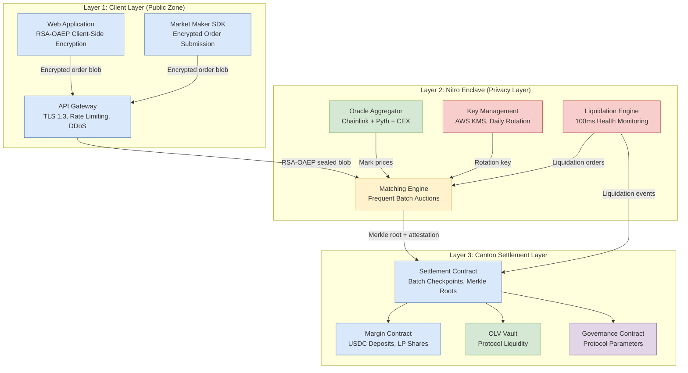
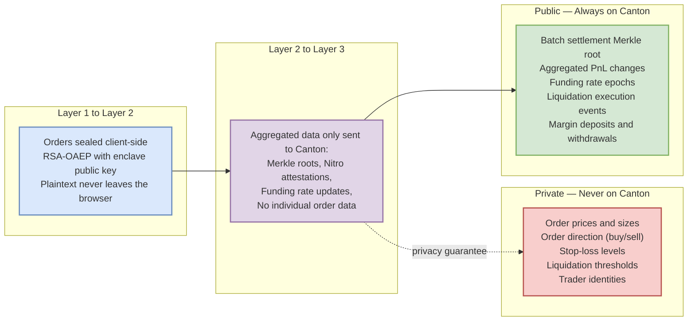
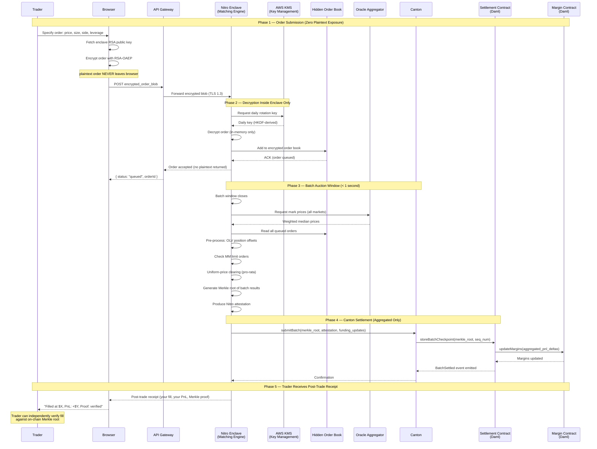
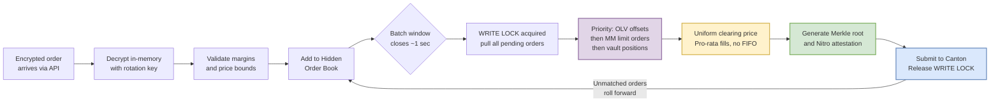
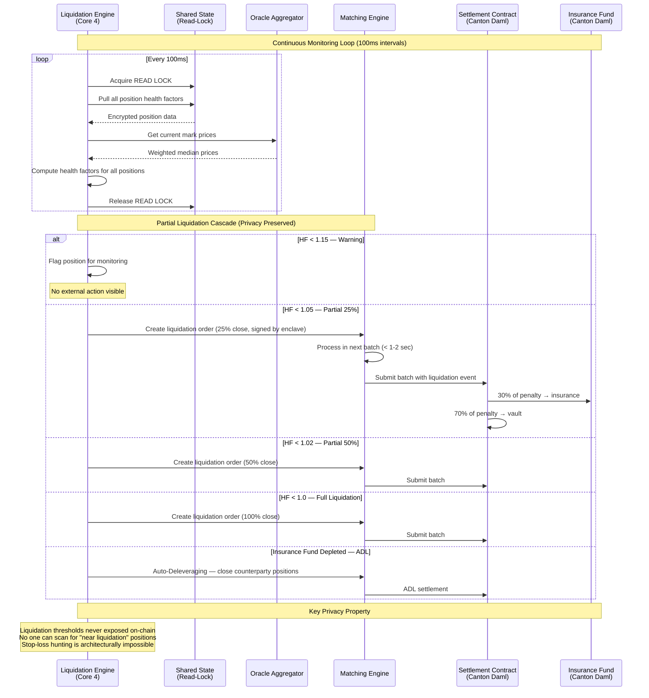
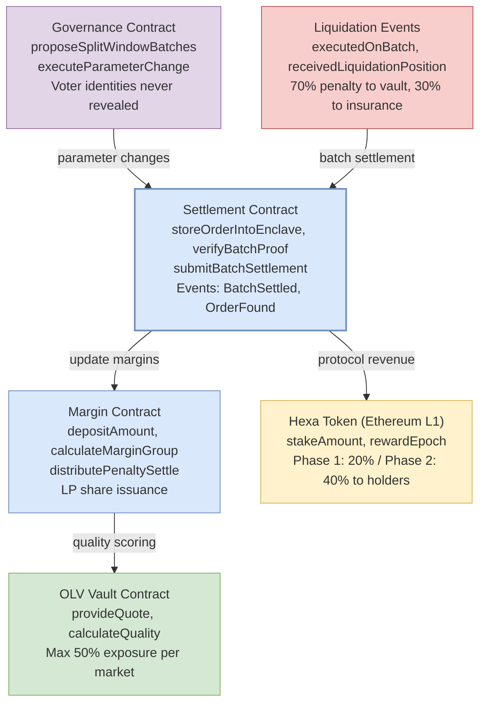
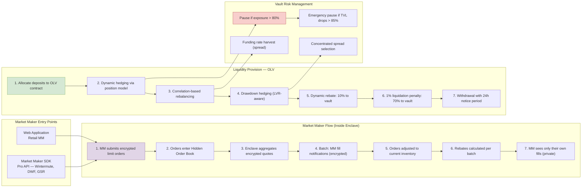
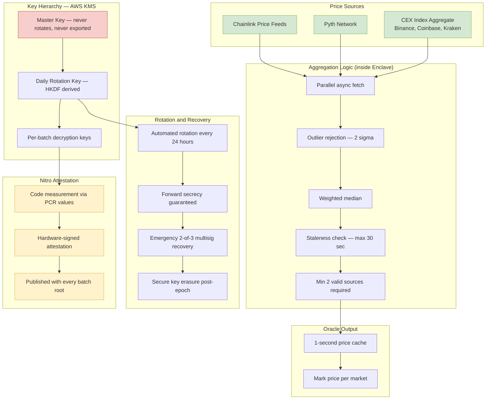

## Development Fund Proposal: Hexa DEX — Privacy-First Perpetual Futures Exchange on Canton

**Author:** Sachin Jangid (sachinjangid832@gmail.com)  
**Status:** Submitted  
**Created:** 2026-04-02  
**Champion:** Seeking Tech & Ops Committee Champion  
**Grant Category:** Critical Ecosystem Infrastructure · DeFi Application Layer  
**Website:** [https://hexadex.trade](https://hexadex.trade)  
**Whitepaper:** [https://docs.google.com/document/d/1qXc3qsEcCa9oNd4jpFJ3rAfaNEyBIwqB9wPyzhZcaPg/edit?usp=sharing](https://docs.google.com/document/d/1qXc3qsEcCa9oNd4jpFJ3rAfaNEyBIwqB9wPyzhZcaPg/edit?usp=sharing)  
**Trading App Demo:** [https://drive.google.com/file/d/1IcCpp1F_Ihpa0z-zSdwHoqf5na5TeOTJ/view?usp=sharing](https://drive.google.com/file/d/1IcCpp1F_Ihpa0z-zSdwHoqf5na5TeOTJ/view?usp=sharing)  
**Complete System Architecture:** [https://drive.google.com/file/d/1jMWqRaJLOM-LszhAwfpG-13orK75uLeu/view?usp=sharing](https://drive.google.com/file/d/1jMWqRaJLOM-LszhAwfpG-13orK75uLeu/view?usp=sharing)

---

## Abstract

Hexa DEX is a **privacy-first perpetual futures exchange** built natively on Canton Network. It is the first on-chain derivatives venue to hide trader intent completely until settlement, eliminating MEV, frontrunning, stop-loss hunting, and predatory liquidations, while preserving full post-trade verifiability through cryptographic proofs on Canton.

Hexa's three-layer architecture routes all orders through client-side RSA-OAEP encryption into an AWS Nitro Enclave (privacy layer) for sealed-order matching via Frequent Batch Auctions (FBA), with final settlement committed to Canton smart contracts. All individual order data stays private; only aggregated Merkle roots, attestations, and funding updates are written on-chain. Canton's sub-transaction privacy, Daml authorization model, and deterministic settlement make it uniquely suited for this design; a public-chain implementation would be architecturally impossible without compromising trader confidentiality.

Hexa is already 4+ months in active development with a working trading interface. This proposal requests **1,000,000 CC** across three milestones to complete and launch the full Canton-native production system.

---

## Specification

### 1. Objective

**The Problem:** Every existing on-chain derivatives exchange leaks trader intent. Mempools are public. Stop-loss orders are visible. Liquidation levels can be estimated. Market makers and MEV bots exploit this systematically: sandwiching entries, hunting stop-losses, triggering liquidations, and front-running large orders. Traders lose 1–3% of their PnL to this structural exploitation before a single trade is made. Institutional participants cannot deploy capital on-chain at scale because their strategies are publicly exposed.

**The Solution:** Hexa DEX keeps orders encrypted from the moment a trader clicks "submit" until the moment the batch is cleared. The clearing price is computed inside an AWS Nitro Enclave, a hardware-secured, cryptographically attested computation environment that cannot be inspected even by Hexa's own operators. Only Merkle roots, attestations, and aggregate funding updates appear on Canton's ledger. Individual orders, positions, and stop-loss levels remain permanently private.

**Why Canton:** Canton's sub-transaction privacy, Daml's native authorization model, and its deterministic settlement semantics make it the only serious candidate for this architecture:

- **Sub-transaction privacy** means that margin state and settlement proofs are visible only to authorized parties; no global ledger scan is possible
- **Daml's authorization model** replaces complex access-control logic with ledger-enforced invariants, dramatically reducing the attack surface for the settlement layer
- **Deterministic settlement** ensures that every batch committed to Canton produces an immutable, provably correct state transition, which is the foundation for the post-trade verifiability guarantee Hexa provides traders
- **Atomic multi-party transactions** allow complex settlement operations (margin updates, liquidation penalties, funding payments) to execute atomically in a single Daml transaction

**Intended Outcome:** A fully operational privacy-first perpetual futures exchange on Canton, supporting BTC/USD, ETH/USD, SOL/USD, and CC/USD perpetual markets at mainnet launch, with institutional-grade market making infrastructure, a sealed-order matching engine, and cryptographic post-trade proofs that any trader can verify against Canton's ledger.

---

### 2. Implementation Mechanics

Hexa is delivered as a three-layer system with strict information flow controls between layers. The sections below detail each layer, the complete system architecture, and all component interactions.

#### 2.1 System Architecture Overview

Hexa DEX operates across three separated layers with strict information boundaries. Orders are encrypted client-side before they ever touch a server. No plaintext order data reaches Hexa's backend or Canton's ledger; only the trader's encrypted intent travels end-to-end, decrypted exclusively inside the Nitro Enclave.

> Complete System Architecture: [https://drive.google.com/file/d/1jMWqRaJLOM-LszhAwfpG-13orK75uLeu/view?usp=sharing](https://drive.google.com/file/d/1jMWqRaJLOM-LszhAwfpG-13orK75uLeu/view?usp=sharing)

#### 2.2 Three-Layer Information Boundary

The key architectural invariant: **zero plaintext order data ever appears in any layer below Layer 1**. Orders are sealed at the browser, transit under TLS 1.3 + RSA-OAEP, and are only decrypted inside the Nitro Enclave. Canton receives only aggregated proofs.

#### 2.3 Order Lifecycle Sequence

Complete end-to-end order flow from user intent to on-chain settlement, showing every hop and the privacy guarantees maintained at each boundary.

#### 2.4 Matching Engine & Batch Auction Flow

The core innovation: Frequent Batch Auctions (FBA) with uniform-price clearing inside an encrypted enclave. No FIFO, no latency races, no MEV.

**Why FBA eliminates MEV:** In a Frequent Batch Auction, all orders in the same batch window receive the *same* clearing price, determined by maximizing aggregate surplus. There is no concept of "queue position": a bot submitting an order 0.1ms before you gains no advantage. The clearing price is computed after the window closes with all orders sealed, making frontrunning mathematically impossible.

#### 2.5 Liquidation Engine Flow

Liquidations run continuously on a dedicated CPU core (Core 4) with 100ms check intervals, using only read-locks to avoid blocking matching. Critically, **individual liquidation thresholds remain hidden inside the enclave**, so no observer can scan positions to determine who is near liquidation.

#### 2.6 Canton Settlement Layer — Contract Architecture

Hexa's on-chain layer on Canton is deliberately minimal: it stores only what *must* be on-chain: batch proofs, margin state, and governance parameters. No individual trade data is ever committed.

#### 2.7 Market Making & Liquidity Provision Flow

Market makers submit encrypted limit orders through the same sealed-order pipeline as retail traders, maintaining the privacy invariant throughout. No one — including Hexa operators — can see the current order book.

#### 2.8 Oracle Aggregation & Key Management

#### 2.9 Layer 1 — Client Layer

The trading interface (Next.js / React) performs RSA-OAEP encryption of all order parameters using the enclave's public key **before transmission**. The encrypted blob is the only form in which order data ever leaves the user's browser. The API Gateway (Rust/NestJS with Redis, behind Cloudflare DDoS protection) forwards this opaque blob without any ability to inspect its contents.

The Market Maker SDK provides a professional API for institutional participants. MM orders are submitted through the same encrypted pipeline, maintaining the same privacy invariants.

#### 2.10 Layer 2 — Privacy Layer (AWS Nitro Enclave)

A single AWS Nitro Enclave instance handles all order processing. The enclave is multi-threaded with dedicated cores:

- **Cores 0-3 — Matching Engine:** Manages the hidden order book, runs batch auction windows (~1 second), performs uniform-price clearing (pro-rata), and generates Merkle roots + Nitro attestations for each batch
- **Core 4 — Liquidation Engine:** Monitors all positions with 100ms check intervals (read-locks only), triggers graduated liquidation cascade (25% → 50% → 100% → ADL), creates liquidation orders through the same `placeOrder()` path as regular orders
- **Oracle Aggregator:** Fetches prices from Chainlink, Pyth, and aggregated CEX indices in parallel; produces weighted median with staleness/outlier checks; caches at 1-second intervals
- **Key Management:** AWS KMS holds the master key; daily rotation keys are derived via HKDF; forward secrecy is guaranteed; 2-of-3 multisig for emergency recovery

The enclave produces a Nitro attestation with each batch: a hardware-signed document proving that exactly the specified code processed exactly the specified inputs. This attestation is committed to Canton alongside the Merkle root, enabling any trader to independently verify their fill.

#### 2.11 Layer 3 — Settlement Layer (Canton / Daml)

Five Daml contracts constitute the on-chain settlement layer:

| Contract                | Role                                                                                                                              |
| ----------------------- | --------------------------------------------------------------------------------------------------------------------------------- |
| **Settlement Contract** | Stores batch checkpoints (Merkle roots + attestations + sequence numbers), manages position nonces, emits `BatchSettled` events   |
| **Margin Contract**     | Handles USDC deposits, LP share issuance, fee distribution, and penalty settlement                                                |
| **OLV Vault Contract**  | Manages the on-chain liquidity vault, provides quotes, tracks quality scores, and enforces risk limits (max 50% exposure per market) |
| **Liquidation Events**  | Processes liquidation records, maps them to batch sequences, distributes penalties (70% to vault, 30% to insurance)               |
| **Governance Contract** | Manages parameter changes (batch window size, fee rates, margin levels) via governance proposals; user identities never revealed  |

#### 2.12 Key Architectural Patterns

**Sealed Order Flow with Hardware Attestation**
Orders are RSA-OAEP encrypted client-side. Decryption occurs exclusively inside the Nitro Enclave (hardware-enforced). Every batch produces a hardware-signed attestation proving correct code execution. Traders can verify fills against the Merkle root without trusting Hexa.

**Frequent Batch Auction (FBA) Clearing**
Sub-second batch windows eliminate latency-based exploitation. Uniform-price clearing at maximum-surplus price with no FIFO and no queue gaming. Pro-rata fills at clearing price treat large and small orders identically. Unmatched orders roll forward, not cancelled.

**Canton Sub-Transaction Privacy for Settlement**
Only Merkle roots and attestations appear in Canton transactions. Per-trader margin state visible only to the trader and authorized contracts. Liquidation events recorded without revealing the victim's position size. Governance transactions execute without revealing voter identities.

**Graduated Liquidation Without Stop-Loss Hunting**
Liquidation thresholds are computed inside the enclave and never exposed externally. Graduated cascade (25% → 50% → 100%) reduces liquidation shock. Liquidation orders enter the same sealed batch pipeline as regular orders. The market cannot "hunt" a stop-loss it cannot see.

**Nitro Enclave + AWS KMS Key Hierarchy**
24-hour key rotation with HKDF derivation ensures forward secrecy. Historical key registry for post-trade proof verification of old batches. Emergency 2-of-3 multisig recovery without single-point-of-failure. The master key lives in AWS KMS, never exported and never placed inside the enclave.

---

### 3. Architectural Alignment

Hexa aligns with Canton Development Fund priorities in the following ways:

**Demonstrates Canton's unique value proposition at scale.** Privacy-preserving perpetual futures are architecturally impossible on public chains. Every order on Uniswap, dYdX, GMX, or Hyperliquid is observable before settlement. Hexa is a proof-of-concept that Canton's sub-transaction privacy enables a class of financial applications that simply do not exist elsewhere on-chain. This is a direct demonstration of Canton's thesis that private, institutional-grade finance requires a fundamentally different execution model.

**Brings institutional-grade derivatives to Canton.** The $3T+ annual derivatives trading market is dominated by CEXes precisely because on-chain perps cannot protect trader intent. Hexa's architecture makes Canton competitive with Binance, Bybit, and OKX from a privacy standpoint, with the added benefit of Canton's deterministic settlement and post-trade verifiability guarantees that no CEX can match.

**Generates sustained on-chain activity and Canton Coin demand.** Every margin deposit, batch settlement, funding payment, liquidation event, and governance transaction generates on-chain activity on Canton. As Hexa scales, it creates a real-use source of Canton transaction volume from a live trading venue.

**Canton-native, not a port.** Hexa is built from scratch on Canton's Daml settlement layer. The architecture exploits Canton's specific properties (sub-transaction privacy, Daml authorization, deterministic finality) and would not exist in its current form on any other network.

**Aligns with CIP-0082 and CIP-0100.** The Development Fund targets projects that deliver common goods for the Canton ecosystem. Hexa delivers: open Daml contract patterns for privacy-preserving settlement, a reference implementation of Nitro Enclave + Canton integration, and a live trading venue that demonstrates Canton's capabilities to the broader DeFi market.

---

### 4. Backward Compatibility

*No backward compatibility impact.*

Hexa is a new application layer on Canton. It does not modify Canton protocol behavior, token standards, validator operations, or existing Daml contracts. All five Hexa Daml contracts are net-new. The Nitro Enclave integration and Canton Ledger API usage follow existing Canton patterns.

---

### 5. Risks and Mitigations

| Risk | Likelihood | Mitigation |
|------|-----------|------------|
| **Canton Ledger API changes breaking integration** | Medium | Pin to Canton 3.x LTS; automated regression tests against DevNet on each Canton release; compatibility shim strategy documented |
| **AWS Nitro Enclave availability / failover** | Low | Hot-standby instance (us-west-1); 10-second state replication; <30-second automatic failover; no single point of failure in enclave infrastructure |
| **Security vulnerability in Daml contracts** | Low–Medium | Third-party audit before M3 mainnet deployment; all critical/high findings resolved before launch; public audit report; ongoing bug bounty post-launch |
| **Oracle manipulation or staleness** | Low | Multi-source aggregation (Chainlink + Pyth + 3 CEX indices); 2σ outlier rejection; 30-second staleness bound; minimum 2 valid sources enforced; circuit breaker on deviation |
| **Liquidation cascade failure in extreme markets** | Low | Graduated 25/50/100% cascade; insurance fund backstop; ADL as last resort; max 50% vault exposure per market; emergency pause at 85% TVL drop |
| **Nitro attestation verification gaps** | Low | PCR values published with every batch; standard AWS Nitro public verification tools used; independent verification documented in M2 audit |
| **Low liquidity at launch** | Medium | At least one institutional MM integrated before mainnet; OLV vault provides baseline liquidity; CC/USD market creates native Canton ecosystem demand |
| **Milestone delays** | Low–Medium | 5-month timeline is conservative relative to 4+ months already in development; clear per-milestone acceptance criteria enable early detection; scope is bounded by existing architecture |

### 6. Open-Source Commitment

The following components will be released as open-source under **Apache 2.0** upon completion of each milestone:

- **M1:** All five Daml smart contracts (Settlement, Margin, OLV Vault, Liquidation Events, Governance) with full test suite and deployment guide
- **M2:** Market Maker SDK v1 and Canton ↔ Enclave integration reference implementation
- **M3:** Frontend component library and post-trade Merkle proof verification utilities

The matching engine core and key management logic will remain proprietary to preserve the operational security of the live system. The open-source Daml contracts are the primary reusable artifact for the Canton ecosystem. Any builder can fork and adapt the batch settlement, margin, and governance patterns for their own Canton application.

---

## Milestones and Deliverables

### Milestone 1: *(Canton Daml Contracts + Core Infrastructure)*

- **Estimated Delivery:** 6 weeks from grant approval
- **Focus:** Complete all five Daml smart contracts, establish Canton Ledger API integration, deploy to Canton DevNet, and validate the full settlement flow end-to-end.
- **Deliverables / Value Metrics:**
  - Settlement Contract (Daml): `storeOrderIntoEnclave`, `verifyBatchProof`, `submitBatchSettlement`, `earlyAttestationProof`, `updateParameterGroup`; compiled, tested, deployed to DevNet
  - Margin Contract (Daml): `depositAmount`, `calculateMarginGroup`, `calculateFeeGroup`, `distributePenaltySettle`; USDC deposit and withdrawal flows operational
  - OLV Vault Contract (Daml): `provideQuote`, `calculateQuality`, `distributePenaltySettle`; vault accounting and risk limits enforced
  - Liquidation Events Contract (Daml): `executedOnBatch`, `receivedLiquidationPosition`, `penaltySettleGroup`; liquidation event recording and penalty distribution
  - Governance Contract (Daml): `proposeSplitWindowBatches`, `executeParameterChange`; parameter governance pipeline
  - Canton Ledger API integration: party management, command submission, event streaming, contract ID registry
  - Daml test suite with ≥90% coverage across all five contracts
  - Local Canton sandbox with seeded test data, with full settlement cycle demonstrable end-to-end
  - Architecture documentation: contract interaction diagrams, API reference, deployment guide
  - **Acceptance:** All five contracts compile and deploy to Canton DevNet. End-to-end settlement flow passes (submit batch → verify proof → update margins → emit events). Liquidation penalty distribution verified: 70% vault / 30% insurance. Governance parameter change pipeline tested with at least 3 parameter types.

### Milestone 2: *(Privacy Engine + Matching System)*

- **Estimated Delivery:** 9 weeks after Milestone 1
- **Focus:** Deploy the AWS Nitro Enclave with the full matching engine, liquidation engine, oracle aggregator, and key management system. Complete Canton ↔ Enclave integration. All privacy guarantees operational.
- **Deliverables / Value Metrics:**
  - AWS Nitro Enclave deployment: production-grade single-instance with hot-standby (us-east-1 primary, us-west-1 standby, 10-second state replication, <30-second failover)
  - Matching Engine (Cores 0-3): encrypted order ingestion, Hidden Order Book, batch auction window (~1 sec), uniform-price clearing, pro-rata fill algorithm, Merkle root generation, Nitro attestation production
  - Liquidation Engine (Core 4): 100ms monitoring loop, health factor computation, graduated cascade (25%/50%/100%/ADL), integration with `placeOrder()` path
  - Oracle Aggregator: Chainlink + Pyth + CEX index (Binance, Coinbase, Kraken) parallel fetch, weighted median, 2σ outlier rejection, 30-second staleness bound, 1-second cache
  - Key Management: AWS KMS master key, HKDF daily rotation, forward secrecy, historical key registry, 2-of-3 multisig emergency recovery, secure key erasure
  - Market Maker SDK v1: encrypted order submission API, WebSocket real-time feeds, fill notifications (encrypted), rebate accounting
  - API Gateway: rate limiting, TLS 1.3, DDoS protection (Cloudflare), multi-region routing
  - Full enclave ↔ Canton settlement pipeline: `submitBatch()` → Settlement Contract → `BatchSettled` event → frontend confirmation
  - Privacy verification: independent confirmation that zero plaintext order data reaches Canton or external observers
  - TestNet deployment: public endpoint with live matching on Canton TestNet
  - Performance benchmarks: throughput ≥1,000 orders/batch, latency <1 second per batch, liquidation check <100ms
  - **Acceptance:** Nitro Enclave deployed with verifiable attestation (PCR values published). Full order flow functional on Canton TestNet. Liquidation cascade tested at HF 1.15, 1.05, 1.02, 0.99. Oracle mark prices within 0.1% of reference. Privacy audit confirmed: zero plaintext order data observable outside enclave boundary.

### Milestone 3: *(Full Platform + Mainnet Launch)*

- **Estimated Delivery:** 5 weeks after Milestone 2
- **Focus:** Production frontend, full end-to-end integration, security audit, mainnet launch with BTC/USD, ETH/USD, SOL/USD, and CC/USD perpetual markets.
- **Deliverables / Value Metrics:**
  - Production trading frontend (Next.js): order entry, position dashboard, PnL tracking, post-trade proof verification UI, funding rate display, liquidation price indicator (your own position only, not the order book)
  - Portfolio and position management: margin deposits/withdrawals, cross/isolated margin toggle, position history, fill history with Merkle proofs
  - OLV Liquidity Pool UI: deposit/withdraw interface, TVL tracking, yield display, risk limits dashboard
  - Governance portal: propose parameter changes, vote on proposals, view execution history
  - Security audit: full third-party audit of all five Daml contracts + Nitro Enclave integration + API Gateway; audit findings documented and remediated before mainnet
  - Mainnet deployment: BTC/USD, ETH/USD, SOL/USD, and CC/USD perpetual markets live on Canton MainNet
  - Market maker onboarding: at least one institutional MM partner integrated and providing liquidity at launch
  - Documentation: user guide, API reference, MM integration guide, Daml contract audit report (published publicly)
  - Canton ecosystem integration: listed on Canton ecosystem directory; co-marketing with Canton Foundation
  - **Acceptance:** Trading frontend live at production domain. Complete user journey functional (deposit → open position → view Merkle proof → withdraw). All four perpetual markets (BTC/USD, ETH/USD, SOL/USD, CC/USD) live with real liquidity. Security audit report published with all critical/high findings resolved. At least one institutional MM providing two-sided quotes at launch.

---

## Acceptance Criteria

The Tech & Ops Committee will evaluate completion based on:

- Deliverables completed as specified for each milestone
- Demonstrated functionality on Canton TestNet (M1, M2) and MainNet (M3)
- Privacy guarantees verified: zero plaintext order data observable outside enclave boundary
- Performance benchmarks met: ≥1,000 orders/batch throughput, <1 second batch latency
- Security audit completed and all critical/high findings remediated before M3 disbursement
- Documentation and knowledge transfer provided for all components
- At least one institutional market maker integrated and providing liquidity at mainnet
- Canton-native settlement verified: all batch checkpoints, Merkle roots, and attestations committed to Canton MainNet

Project-specific acceptance conditions:

- The privacy invariant must hold end-to-end: no individual order price, size, side, or trader identity may appear in any Canton transaction or event
- All liquidation cascade logic must execute on-ledger through the Settlement Contract; no off-chain liquidation execution
- The Nitro attestation for each batch must be independently verifiable using AWS Nitro public verification tools
- The OLV vault's risk parameters (max 50% exposure per market, emergency pause at 85% TVL drop) must be enforced on-chain
- Post-trade Merkle proofs must be independently verifiable by traders without trusting Hexa's servers

---

## Funding

**Total Funding Request: 1,000,000 CC (~$148,700 USD at current rates)**

### Payment Breakdown by Milestone

| Milestone | Description | Amount | USD Equivalent |
|-----------|-------------|--------|----------------|
| Milestone 1 | Canton Daml Contracts + Core Infrastructure | 300,000 CC | ~$44,610 USD |
| Milestone 2 | Privacy Engine + Matching System | 400,000 CC | ~$59,480 USD |
| Milestone 3 | Full Platform + Mainnet Launch | 300,000 CC | ~$44,610 USD |
| **Total** | | **1,000,000 CC** | **~$148,700 USD** |

- Milestone 1 *(Canton Daml Contracts + Core Infrastructure)*: 300,000 CC (~$44,610 USD) upon committee acceptance
- Milestone 2 *(Privacy Engine + Matching System)*: 400,000 CC (~$59,480 USD) upon milestone completion
- Milestone 3 *(Full Platform + Mainnet Launch)*: 300,000 CC (~$44,610 USD) upon final release and acceptance

*USD figures are calculated at the reference rate of ~$0.1487 USD/CC as of April 2026. CC amounts are fixed; USD equivalents are illustrative.*

**Funding Rationale:** Milestone 1 covers the foundational Daml contract layer: five contracts, full test suite, Canton integration, and DevNet deployment. Milestone 2 is the largest allocation because the Nitro Enclave implementation is the novel technical core: matching engine, liquidation engine, oracle aggregator, key management, and enclave ↔ Canton integration represent the highest complexity. Milestone 3 covers the production frontend, security audit (estimated $25–35k USD), mainnet deployment, and market maker onboarding — the audit alone justifies a significant allocation for a system handling real user funds.

### Volatility Stipulation

The estimated project duration is 5 months (20 weeks), under the 6-month threshold. Should the project timeline extend beyond 6 months due to Committee-requested scope changes, any remaining milestones must be renegotiated to account for significant USD/CC price volatility.

---

## Co-Marketing

Upon release, the implementing entity will collaborate with the Foundation on:

- Announcement coordination
- Case study or technical blog
- Developer or ecosystem promotion

Specific commitments:

- Technical blog post for each milestone: "How Hexa uses Nitro Enclaves to make MEV impossible on Canton" (M2), "Hexa DEX — Privacy-first perpetual futures live on Canton MainNet" (M3)
- Live demo sessions for the Canton developer and ecosystem community at each milestone
- Case study: privacy-preserving financial applications on Canton — how sub-transaction privacy enabled a new class of DEX
- Open-source release (Apache 2.0) of all five Daml contracts (M1) and Market Maker SDK (M2), serving as reusable templates for privacy-preserving settlement on Canton (see Open-Source Commitment above)
- Co-branded "Built on Canton" presence in Hexa frontend and documentation
- Ecosystem directory listing on CCTools, CantonScan, and Canton Foundation ecosystem page

---

## Motivation

**The MEV problem is structural, not incidental.** Order flow exploitation is not a bug in on-chain trading. It is an architectural feature of public ledgers. When every pending transaction is visible in a mempool, bots will extract value from it. MEV extraction on Ethereum derivatives venues consistently exceeds $50M monthly. Retail traders lose 1–3% of their PnL before a single legitimate trade is counted. Stop-loss hunting is so common that sophisticated traders explicitly avoid placing visible stop orders on-chain. Institutional participants cite "front-running exposure" as a primary reason for not deploying capital on-chain.

Existing solutions fall short:

- **dYdX, GMX, Hyperliquid:** Order books publicly observable or execution is off-chain, defeating the trust model
- **ZK-proof approaches:** Computationally expensive, latency-prohibitive for derivatives, still reveal *when* trades occur
- **Off-chain matching + on-chain settlement (StarkEx model):** Trusts the operator's matching engine; settlement proofs don't prevent the operator from seeing and exploiting order flow
- **Batch auction DEXes (CoW Protocol):** Effective for spot but inadequate for perpetuals requiring continuous position management, funding rates, and real-time margin monitoring

Hexa's Nitro Enclave architecture is a different category: hardware-enforced secrecy with cryptographic attestation of correct execution. The enclave is provably inaccessible to Hexa's operators, not merely trusted to be inaccessible.

**Canton is the right settlement layer.** Canton's sub-transaction privacy means that margin state, position updates, and settlement proofs are visible only to the parties involved in each transaction. Daml's authorization model provides formal guarantees that settlement contracts cannot be exploited by unauthorized parties. Canton's institutional adoption trajectory means Hexa's target users — hedge funds, prop desks, and sophisticated retail traders — are the same participants entering Canton through other institutional applications. Hexa brings a live, real-use financial application that demonstrates Canton's capabilities to users who care about protecting their trading strategies.

---

## Rationale

The sealed-order + Nitro Enclave + FBA design was chosen after evaluating four alternatives:

| Approach                       | Privacy Guarantee   | Latency            | Trust Assumption               | Chosen?                   |
| ------------------------------ | ------------------- | ------------------ | ------------------------------ | ------------------------- |
| **Hexa: Nitro Enclave + FBA**  | Hardware-enforced   | <1 sec batch       | Enclave code measurement (PCR) | ✓ Yes                     |
| ZK-proof per order             | Cryptographic       | 5–30 sec per proof | Proof system soundness         | ✗ Too slow                |
| MPC threshold signing          | Cryptographic       | 2–3 sec round trip | k-of-n node honesty            | ✗ Liveness risk           |
| Off-chain matching             | Operator trust only | <100ms             | Operator honesty               | ✗ Not trustless           |
| Public mempool + commit-reveal | None pre-commit     | 1–2 blocks         | None                           | ✗ Front-run during reveal |

The Nitro Enclave approach is the only design that simultaneously achieves hardware-level privacy, sub-second matching latency, and a cryptographically verifiable integrity guarantee (the attestation). No trust in Hexa's operators is required beyond trusting that AWS Nitro's implementation is correct; AWS Nitro is a widely audited, production-hardened system.

**Why FBA:** FBA is the academically validated mechanism for eliminating latency-based exploitation. Within a batch window, order priority is irrelevant. A bot submitting a frontrunning order 0.001ms before a victim order gains zero advantage if both are in the same batch at the same uniform clearing price. FBA converts a continuous-time race into a discrete-time fair auction.

**Why Canton over alternatives:** An Ethereum L2 exposes all transaction data to sequencers and validators. Solana has no privacy model. A ZK-rollup requires ZK proofs for every state transition, which is computationally prohibitive at Hexa's settlement frequency. Canton's combination of Daml's formal authorization, sub-transaction privacy, and deterministic finality makes it uniquely suited:

1. Settlement proofs must be correct and immutable (Daml + deterministic finality)
2. Settlement data must be private to authorized parties (sub-transaction privacy)
3. Settlement logic must be secure by construction (Daml authorization model)

No other production blockchain network meets all three requirements simultaneously.

---

## Adoption Plan

Hexa targets three user segments at launch, each with a distinct acquisition path:

**Retail traders** — The primary growth channel is organic DeFi community distribution: performance transparency (all batch Merkle roots public, all fills independently verifiable), listings on DeFi aggregators and dashboards (DeFiLlama, Dune Analytics), and content marketing around the privacy narrative. Traders who have been front-run or stop-loss hunted are the natural first adopters. They have a concrete, felt problem that Hexa solves.

**Market makers and prop desks** — Institutional participants are onboarded directly through the Market Maker SDK. Pre-launch outreach is underway with Wintermute-tier MMs. The MM SDK provides the encrypted order submission, high-rate-limit API, and rebate accounting infrastructure that professional liquidity providers require. At least one MM will be providing two-sided quotes before mainnet launch (M3 acceptance criterion).

**Canton ecosystem participants** — The CC/USD perpetual market directly serves existing Canton holders who want exposure management or yield through the OLV vault. Hexa will be listed on CCTools, CantonScan, and the Canton Foundation ecosystem directory at mainnet. The co-marketing plan with the Canton Foundation targets existing ecosystem participants as the initial liquidity base.

**Liquidity bootstrapping** — The OLV vault provides protocol-owned baseline liquidity from day one, ensuring markets are functional even before external MMs are onboarded. The vault's risk limits (max 50% exposure per market) ensure stability during the early-volume ramp.

---

## Long-term Maintenance

Hexa is designed as a live, revenue-generating trading venue, not a reference implementation that is delivered and abandoned. Post-grant sustainability is built into the protocol economics:

**Revenue model:** Trading fees (maker/taker spread) and funding rate spreads flow into the protocol treasury. A portion is distributed to Hexa token holders; the remainder funds ongoing operations, infrastructure, and development.

**On-chain components:** The five Daml contracts are versioned and upgradeable through the on-chain Governance Contract. Parameter changes (fee rates, margin levels, batch window size) require governance proposals with on-chain execution, so no operator can unilaterally alter contract behavior. Canton's standard Daml package upgrade mechanism handles contract migrations if the Canton protocol evolves.

**Open-source maintenance:** The Apache 2.0 Daml contract repository will be maintained with a documented deprecation policy, automated CI against Canton DevNet to catch compatibility regressions, and an issue tracker open to ecosystem contributors.

**Infrastructure:** AWS Nitro Enclave infrastructure is operated on a pay-as-you-go basis funded by protocol revenue. Hot-standby configuration and automated failover ensure uptime without manual intervention.

**Post-grant commitment:** Hexa will continue operating and iterating beyond the grant period. The grant funds the initial build and launch; protocol revenue funds everything after. A follow-on proposal may be submitted for security review scope expansion or additional market listings if the Canton Foundation and ecosystem warrant it.

---

## Team

### Sachin Jangid — Founder & Lead Engineer

Sachin is a lead Web3 engineer currently leading teams building DEX, AMM, liquidity pool, lending protocol, and prediction market systems. He has previously served as a senior engineer on a crypto perpetuals platform that reached $2.8B in trading volume, where he built core exchange infrastructure including the distributed order book (10M+ monthly orders), liquidation and deleveraging systems, Rust-based blockchain indexer, and real-time WebSocket trading feeds. He has also engineered a prediction market platform with ZKP-based oracle verification and a full trading and resolution backend.

His Canton experience is hands-on: he built and deployed TruthOracle, a live prediction market on Canton TestNet bridging Kalshi institutional liquidity with Canton settlement, giving him direct production experience with Daml contracts, the Canton Ledger API, and on-chain event architecture. Over the past 4+ months he has led the architecture and core development of Hexa DEX, including the system design, technical specification, whitepaper, and working trading application.

The team includes a full-time frontend developer focused on the trading dashboard, portfolio management views, and governance portal.

| Capability | Experience |
|------------|------------|
| **Perpetuals & Exchange Systems** | $2.8B trading volume perps platform; distributed order book, liquidation engine, Rust-based indexer |
| **Canton / Daml** | TruthOracle on Canton TestNet; Daml contract design, Ledger API, event streaming, party management |
| **Protocol Engineering** | Led DEX, AMM, liquidity pool, lending, and prediction market builds across chains |
| **Privacy & ZK Systems** | Hexa's Nitro Enclave + FBA architecture; ZKP oracle integration (Noir) on prior prediction market |
| **Backend & Infrastructure** | Rust, NestJS, TypeScript; Redis, PostgreSQL, MongoDB; WebSocket; Kubernetes, Docker, Terraform |

---

**Existing Progress (4+ months development):**

- Working trading application (video): [https://drive.google.com/file/d/1IcCpp1F_Ihpa0z-zSdwHoqf5na5TeOTJ/view?usp=sharing](https://drive.google.com/file/d/1IcCpp1F_Ihpa0z-zSdwHoqf5na5TeOTJ/view?usp=sharing)
- Complete System Architecture: [https://drive.google.com/file/d/1jMWqRaJLOM-LszhAwfpG-13orK75uLeu/view?usp=sharing](https://drive.google.com/file/d/1jMWqRaJLOM-LszhAwfpG-13orK75uLeu/view?usp=sharing)
- Published whitepaper: [https://docs.google.com/document/d/1qXc3qsEcCa9oNd4jpFJ3rAfaNEyBIwqB9wPyzhZcaPg/edit?usp=sharing](https://docs.google.com/document/d/1qXc3qsEcCa9oNd4jpFJ3rAfaNEyBIwqB9wPyzhZcaPg/edit?usp=sharing)
- Public website: [https://hexadex.trade](https://hexadex.trade)
- Completed full 3-layer system architecture (Client → Nitro Enclave → Canton settlement)
- Prior Canton production experience: TruthOracle prediction market