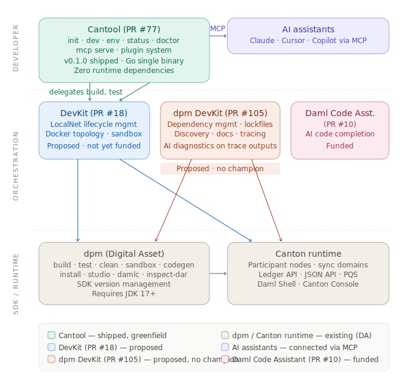

## Development Fund Proposal

**Author:** Eric Mann, Displace Technologies LLC  
**Status:** Submitted  
**Created:** 2026-03-12  
**Updated:** 2026-04-06  

---

## Abstract

**Cantool** is a proposed open-source CLI tool for Canton application development: project scaffolding, DAML **package** workflows (compilation delegated to **dpm**; artifact introspection and ledger-facing deploy in Cantool), integration testing, deployment automation, and an MCP server for AI-assisted development.

Canton application developers today assemble ad-hoc scripts, manually extract template IDs from `.dar` files, and write one-off test harnesses. There is no unified tool covering the workflow from project creation to deployment. Cantool fills that gap, adapted to Canton's party-centric, sub-transaction privacy model.

---

## Current Status

**Cantool v0.1.0 alpha** was published on April 1, 2026 ([release](https://github.com/DisplaceTech/Cantool/releases/tag/v0.1.0)). The alpha ships as a Go-based single statically-linked binary with zero runtime dependencies.

The v0.1.0 alpha implements 10 commands:

| Command | Description |
|---|---|
| `cantool init` | Project scaffolding |
| `cantool build` | DAML compilation (with `--watch` for live rebuilds); spec’d equivalent to future `cantool package build` |
| `cantool test` | Integration test runner |
| `cantool dev` | Local sandbox with hot-reload and party provisioning |
| `cantool env` | Named environment profiles |
| `cantool status` | Environment health check |
| `cantool doctor` | System dependency verification |
| `cantool clean` | Build artifact cleanup |
| `cantool mcp serve` | MCP server for AI-assisted development |
| `cantool plugin list` | Plugin discovery and listing |

The v0.1.0 CLI exposes **`cantool build`** as the compile entry point; funded work introduces the **`cantool package`** command group (`package build` sharing that implementation, plus inspect / upload / manifest flows) so the full “build and deploy DARs” story matches the specification without duplicating **dpm**’s resolver.

The alpha was self-funded to demonstrate execution capability and validate the architecture. It is a **proof of architecture**, not a production release — significant hardening, documentation, integration testing, and feature work remains before Cantool is production-ready.

This self-funded work covers what was originally scoped as the first milestone, allowing the funded milestones below to begin from a working foundation rather than a blank repository.

---

## Specification

### 1. Objective

The [Canton Network Developer Experience and Tooling Survey](https://discuss.daml.com/t/canton-network-developer-experience-and-tooling-survey-analysis-2026/8412) (41 active developers, January 20 – February 4, 2026) identified the following:

- **Local Development Frameworks were rated the most critical gap** — the highest-urgency rating in any tooling category surveyed.
- **41% cited Environment Setup & Node Operations as the task that took the longest to "get right."** The survey concludes that developers are "forced to be 'Infrastructure Engineers' before they can be 'Product Builders.'"
- **71% of respondents come from an EVM background** and expect mature toolchains with no Canton equivalent.
- **Respondents mentioned CLI, Hardhat, or Anchor more than 11 times** in open-ended responses, asking for a single tool to handle scaffolding, testing, and deployment.
- **80% of respondents joined the ecosystem within the last 12 months**, making onboarding friction an immediate growth constraint.

The survey explicitly identifies a "Unified CLI Toolchain (Hardhat/Anchor)" as a top missing tool, and separately calls out a "Typed Client SDK & Code Generator" and a "Daml Dependency & Package Manager" as additional gaps.

These findings align with the author's production experience building Canton applications. Canton's architecture is fundamentally different from EVM chains — no global shared state, UTXO-style contract lifecycle, sub-transaction privacy (see [Canton Protocol White Paper](https://canton.network/publications/canton-protocol-whitepaper.pdf), Section 2). Developer tooling cannot be ported from Ethereum; it must be purpose-built for Canton's model.

### 2. Implementation Mechanics

Cantool is a single Go binary with two operational modes:

1. **CLI mode** (`cantool <command>`) — Interactive developer workflows
2. **MCP server mode** (`cantool mcp`) — Programmatic access for AI coding assistants (Claude, Cursor, Codex) via the [Model Context Protocol](https://modelcontextprotocol.io/)

Both modes share a core Canton client library handling Ledger API communication (gRPC), PQS queries, authentication (JWT/OAuth2), and configuration management.

#### Core Components

**Project Scaffolding (`cantool init`)** — Generates a buildable Canton project structure: DAML source directories, application code scaffold (Go initially, with extension points for additional language templates), Docker Compose configuration for cn-quickstart, CI/CD templates, and environment-specific configuration via direnv.

**DAML packages (`cantool package`, `cantool build`)** — **`cantool package`** is the intentional home for the DAR lifecycle: compilation (via **dpm**), `.dar` inspection, template ID extraction, and package upload to participants — i.e. everything needed to **produce and deploy** Daml packages to Canton, without reimplementing **dpm**'s compiler or Cargo-style dependency resolution ([PR #105](https://github.com/canton-foundation/canton-dev-fund/pull/105)). **`cantool package build`** delegates to **`dpm build`** when **dpm** is on `PATH` (falls back to `daml build` only if **dpm** is absent) and adds watch mode, structured JSON output, and consistent errors. Top-level **`cantool build`** remains a supported ergonomic entry point (Hardhat/Anchor-style) and invokes the same code path as **`cantool package build`**. Funded milestones flesh out additional **`cantool package`** subcommands (e.g. inspect, push/upload) and compose with **`cantool deploy`** for declarative, stateful promotion across environments — still not a parallel package *manager* to **dpm**; resolution and lockfiles stay in **dpm**.

**Testing Framework (`cantool test`)** — Deploys `.dar` packages to a running Canton environment and executes integration test suites with helpers for contract creation, choice exercise, event assertion, and party management. Supports headless CI execution and interactive local development. For local environment lifecycle (e.g. `cantool dev` and test prerequisites), Cantool delegates to Canton DevKit ([PR #18](https://github.com/canton-foundation/canton-dev-fund/pull/18)) as the primary backend when available. If DevKit is not installed, Cantool falls back to minimal cn-quickstart Docker management — sufficient to run tests, but not intended to replicate DevKit's full feature set (named instances, snapshots, observability, Web UI).

**Deployment Automation (`cantool deploy`)** — Declarative deployment with state tracking (what's deployed where), package versioning, and upgrade workflows. Supports multiple target environments (local, devnet, testnet, mainnet) with per-environment configuration.

**MCP Server (`cantool mcp`)** — Exposes CLI capabilities through the Model Context Protocol, enabling AI coding assistants to scaffold projects, deploy packages, exercise choices, and query contract state. This is a protocol interface exposing deterministic CLI operations, not an AI model.

#### Technology Stack

- **Language**: Go (single binary, strong gRPC support for Ledger API, Cobra CLI framework)
- **Canton Integration**: Ledger API (gRPC), PQS (PostgreSQL), `dpm` (DAML compilation)
- **Authentication**: Keycloak, Google OAuth, JWT
- **Local Environment**: Docker/Docker Compose (cn-quickstart); delegates to DevKit when available
- **Configuration**: direnv, YAML/TOML manifests
- **MCP**: Model Context Protocol SDK for Go

#### Relationship to Existing Tooling

Cantool is an **orchestration layer** that delegates to existing and proposed Canton tools rather than reimplementing their functionality. The diagram below shows where each tool sits in the stack and the direction of delegation.

##### Ecosystem positioning

##### Delegation map

Every Cantool command maps to a clear delegation target or provides greenfield functionality that no other tool — existing or proposed — covers.

| Cantool command | Delegates to | What Cantool adds |
|---|---|---|
| `cantool package build` (and top-level `cantool build`) | `dpm build` (or `daml build` fallback) | Same backend; top-level `build` for CLI ergonomics. Watch mode (`--watch`), structured JSON output, consistent error formatting |
| `cantool package` (inspect, push, … — funded) | `dpm` only for the `build` subcommand; otherwise Ledger API / local artifacts | DAR introspection, template IDs, upload to participants, manifests — **not** dependency lockfiles or `dpm pkg` workflows (PR #105) |
| `cantool test` | `dpm test` | Structured JSON test results, coverage formatting; future: integration test orchestration against multi-participant topologies |
| `cantool clean` | `dpm clean` | Consistent output formatting |
| `cantool dev` | `dpm sandbox` today; DevKit (PR #18) when available | One-command sandbox + hot-reload + party provisioning |
| `cantool init` | — (greenfield) | Opinionated project scaffolding with embedded templates (basic, token), git init, `cantool.yaml` config. `dpm new` / `dpm init` creates a bare `daml.yaml` only |
| `cantool env` | — (greenfield) | Named environment management (local/staging/prod) with CRUD operations |
| `cantool status` | — (greenfield) | Health checks against Ledger API / JSON API endpoints |
| `cantool doctor` | — (greenfield) | Prerequisite verification (dpm, JDK, Docker, versions) |
| `cantool mcp serve` | — (greenfield) | First Canton tool exposing MCP for AI-assisted development |
| `cantool plugin list` | — (greenfield) | JSON-RPC over stdio plugin architecture, language-agnostic |

##### Comparison with existing and proposed tooling

| Existing / Proposed Tool | What it does | Cantool relationship |
|---|---|---|
| **dpm** (Digital Asset) | SDK management, Daml build/test/codegen, single-process sandbox (`dpm sandbox`), SDK version management, Daml Studio | Cantool wraps **dpm** for Daml compilation — it does not reimplement it. **`cantool package build`** and top-level **`cantool build`** detect **dpm** on `PATH` and invoke `dpm build` under the hood; fall back to `daml build` only if **dpm** is absent. SDK version management, code generation, compiler access, and IDE integration are entirely **dpm**'s domain and not in Cantool's scope at any milestone. **`cantool package`** handles application-level DAR deploy and introspection on top of that compilation step — it does not replace **dpm**'s package-manager features. If DA wishes to upstream any of Cantool's UX improvements (watch mode, structured output) into **dpm** directly, that would be a welcome ecosystem outcome. |
| **Canton DevKit** ([PR #18](https://github.com/canton-foundation/canton-dev-fund/pull/18)) | LocalNet lifecycle management (Splice Docker stack), version pinning, named instances, snapshot/restore, observability dashboards, Web UI, CIP-56 token tooling | DevKit manages the **Splice LocalNet Docker stack** as a full-featured infrastructure product. Cantool's funded scope is scaffolding, testing framework, deployment automation, and MCP — not LocalNet management. For local environment lifecycle, **Cantool delegates to DevKit as its primary backend** when installed. If DevKit is not available, Cantool falls back to minimal cn-quickstart Docker management sufficient to run integration tests — not a replacement for DevKit's capabilities. |
| **dpm DevKit** ([PR #105](https://github.com/canton-foundation/canton-dev-fund/pull/105)) | Additive extensions to **dpm**: Cargo-style dependency management with lockfiles and version pinning, package and interface discovery against running Canton environments, documentation extraction from DAR metadata, transaction tracing and diagnostics, and AI-assisted debugging skills operating on **dpm** trace outputs | PR #105 and Cantool operate at different layers with no duplicated responsibility: PR #105 extends **dpm** with dependency management (`dpm pkg discover`, `dpm docs`, `dpm trace`), lockfile conventions, and built-in AI diagnostic skills that analyze trace outputs. Cantool provides project scaffolding, dev environment orchestration, named environments, health monitoring, and an MCP server for external AI assistants. The tools are complementary: a developer would use PR #105's dependency management to resolve packages, then use Cantool's scaffolding and dev orchestration to build and test an application that consumes those packages. Since Cantool delegates build/test to **dpm**, any **dpm** extension — including PR #105's new commands — is available to Cantool users (and can also be invoked directly). |
| **Daml Code Assistant** ([PR #10](https://github.com/canton-foundation/canton-dev-fund/pull/10)) | AI/ML fine-tuned models for Daml code generation | The Code Assistant helps developers **write Daml**. Cantool helps developers **build, test, and deploy applications** that consume compiled Daml packages. Different lifecycle stages. Cantool's MCP server could serve as an integration surface for future Code Assistant capabilities. |

Beyond complementarity with existing proposals, Cantool differentiates through three architectural choices that no other tool in the ecosystem provides: a Go single-binary distribution requiring zero runtime dependencies (no JVM, no Node.js — important for institutional environments with locked-down package managers or air-gapped networks), a native MCP server for AI-assisted development workflows, and a language-agnostic plugin system (JSON-RPC over stdio) baked in from v0.1.0. These capabilities are additive and do not overlap the core scope of [PR #18](https://github.com/canton-foundation/canton-dev-fund/pull/18) (DevKit), [PR #105](https://github.com/canton-foundation/canton-dev-fund/pull/105) (**dpm** DevKit), or [PR #10](https://github.com/canton-foundation/canton-dev-fund/pull/10) (Daml Code Assistant).

### 3. Architectural Decisions

Cantool's architecture reflects deliberate choices optimized for Canton's institutional user base:

**Single Binary, Zero Runtime Dependencies (Go)**  
Canton's target users — regulated financial institutions, government agencies, and enterprise IT departments — operate in environments with locked-down package managers, restricted network access, and air-gapped deployment zones. A single statically-linked Go binary with zero runtime dependencies can be deployed by copying a file. No Python virtualenvs, no Node.js version managers, no JVM classpaths. This is not a convenience — it is a deployment requirement for institutional environments where installing a toolchain dependency requires a security review.

**Native MCP Server**  
Cantool is the first Canton development tool to integrate the [Model Context Protocol](https://modelcontextprotocol.io/), enabling AI coding assistants to scaffold projects, run tests, deploy packages, and query contract state through a standardized protocol interface. As AI-assisted development becomes standard practice, native MCP support positions Canton's toolchain alongside ecosystems that already offer programmatic tool access.

**Plugin Architecture (JSON-RPC over stdio)**  
Cantool's plugin system uses JSON-RPC over stdio — a language-agnostic protocol that allows plugins written in any language to extend the CLI. This architecture was baked into v0.1.0 rather than bolted on after the fact. Plugins run as separate processes with well-defined interfaces, enabling third-party extensions without requiring changes to the core binary or coordination with the core maintainer.

### 4. Architectural Alignment

Cantool is designed around Canton's architectural properties as described in the [Canton Network White Paper](https://canton.network/publications/canton-network-whitepaper.pdf):

- **Party-centric operations**: Commands operate in the context of a configured party identity, reflecting Canton's party-centric ledger model.
- **Sub-transaction privacy**: Test assertions respect visibility boundaries — tests verify that parties see only what they should see.
- **UTXO-style contract model**: The testing framework provides helpers for contract lifecycle (create → exercise → archive), not state mutation.
- **PQS for reads, Ledger API for writes**: Cantool separates query patterns (PQS) from command submission (Ledger API), encoding the canonical Canton data access pattern.

This proposal addresses the "developer tools" funding category defined in [CIP-0082](https://github.com/canton-foundation/cips/blob/main/cip-0082/cip-0082.md) and aligns with the milestone-based, CC-denominated funding model in [CIP-0100](https://github.com/canton-foundation/cips/blob/main/cip-0100/cip-0100.md).

### 5. Backward Compatibility

Cantool is a client-side development tool. It does not modify Canton protocol behavior, DAML semantics, or existing deployments. No backward compatibility impact.

---

## Milestones and Deliverables

### Milestone Validation Process

Each milestone will follow a three-stage validation process to ensure Cantool is not only functionally complete, but usable by the broader Canton ecosystem:

| Stage | Purpose | Validation Method |
|---|---|---|
| **Stage A: Delivery Review** | Confirm the milestone deliverables are implemented, documented, and released. | Source review, CI results, command demos, and documentation review. |
| **Stage B: External Beta Validation** | Confirm the workflow is usable by external developers in realistic conditions. | Structured feedback from external developers across at least 2 organizations, with follow-up revisions implemented before milestone close. |
| **Stage C: Completion Verification** | Confirm the revised workflow can be completed end-to-end without author intervention. | Re-run of the milestone workflow by external developers using the published docs and released binaries. |

To avoid milestone stalls, external feedback will be collected within a 2-week review window. If at least 3 external developer responses are received within that period, the milestone may proceed. The Canton Foundation or Tech & Ops Committee will be asked to help recruit external developers from the ecosystem; the grantee will coordinate the testing process, collect structured feedback, implement agreed revisions, and publish a short validation summary for each milestone. Each Canton Developer Experience Report will include specific upstream issues filed against relevant Canton ecosystem repositories (`cn-quickstart`, `dpm`, `docs.canton.network`, etc.) for bugs, missing documentation, or workflow inconsistencies discovered during implementation.

### Alpha Release (Self-Funded, Complete)

- **Delivered:** April 1, 2026
- **Status:** Complete
- **Funding:** Self-funded
- **Deliverables:**
  - Cantool v0.1.0 alpha release: 10 commands (`init`, `build`, `test`, `dev`, `env`, `status`, `doctor`, `clean`, `mcp serve`, `plugin list`).
  - Go single-binary architecture validated.
  - Apache 2.0 licensed repository with CI pipeline.
  - MCP server proof of concept (stdio transport).
  - Plugin system proof of concept (JSON-RPC over stdio).

### Milestone 1: Production-Ready Core

- **Estimated Delivery:** Month 3
- **Estimated Effort:** ~230 hours (~18 hrs/week × 13 weeks)
- **Focus:** Hardening the v0.1.0 alpha into a production-ready core.
- **Sub-Milestones:**

| Stage | Timeframe | Description |
|---|---|---|
| **1A. Integration Testing & Hardening** | Weeks 1-5 | Integration testing against real Canton sandbox and testnet (not just mocks), error handling and graceful degradation across SDK versions, CI hardening. |
| **1B. Documentation & Templates** | Weeks 6-9 | Command reference, getting started guide, architecture docs, contributor onboarding guide, additional project templates (DeFi, API service, community templates via `--from`). |
| **1C. Auth & Validation** | Weeks 10-13 | Auth/credential management (`cantool auth login`/`logout`/`status`), external developer validation, and first Canton Developer Experience Report. |
- **Deliverables:**
  - Integration test suite running against real Canton sandbox and testnet environments — not mocked services.
  - Error handling hardened for graceful degradation across Canton SDK versions.
  - Documentation: command reference, getting started guide, architecture overview, contributor onboarding guide.
  - Additional project templates: DeFi application scaffold, API service scaffold, community template support via `cantool init --from <repo>`.
  - `cantool auth login` / `logout` / `status` — Credential management for Canton participant access.
  - CI pipeline hardened: cross-platform builds (macOS, Linux, Windows), integration test gate, release automation.
  - Milestone 1 validation summary based on external developer testing.
  - Canton Developer Experience Report #1, including upstream issues or documentation gaps discovered during hardening.
- **Acceptance Criteria:**
  - Full integration test suite passes against a real Canton sandbox and testnet — no mocked Canton services in the critical path.
  - `cantool auth login` completes an authentication flow and `cantool auth status` reports valid credentials.
  - `cantool init --from` successfully scaffolds a project from a community template repository.
  - Documentation is published and covers all commands with examples.
  - At least 3 external developers complete the getting started guide without author intervention, and their structured feedback is summarized with resulting revisions.
  - Any ecosystem bugs, missing docs, or workflow inconsistencies uncovered during implementation are filed as issues against the relevant upstream repositories and referenced in the milestone report.

### Milestone 2: Production Deployment & Multi-Node Support

- **Estimated Delivery:** Month 6
- **Estimated Effort:** ~230 hours
- **Focus:** Deployment automation, multi-node local development, and interactive contract interaction.
- **Sub-Milestones:**

| Stage | Timeframe | Description |
|---|---|---|
| **2A. Deployment Pipeline** | Weeks 14-18 | `cantool deploy` with dry-run, environment promotion, rollback, and state tracking. |
| **2B. Multi-Node & Console** | Weeks 19-23 | Multi-node Docker topology (`cantool dev --full` with synchronizer + N participants), interactive console/REPL (`cantool console`), full plugin install/remove lifecycle. |
| **2C. Validation & Feedback** | Weeks 24-26 | External developer validation of deployment and multi-node workflows, revisions, and second Developer Experience Report. |
- **Deliverables:**
  - `cantool deploy` — Deployment pipeline with `--dry-run` preview, environment promotion (dev → staging → production), rollback support, and persistent state tracking.
  - `cantool dev --full` — Multi-node Docker topology: synchronizer + N participant nodes for realistic local development.
  - `cantool console` — Interactive REPL for live contract interaction: create contracts, exercise choices, query state.
  - `cantool plugin install` / `remove` — Full plugin lifecycle management.
  - Milestone 2 validation summary based on external developer testing.
  - Canton Developer Experience Report #2, including upstream issues found while building deployment and multi-node workflows.
- **Acceptance Criteria:**
  - `cantool deploy --dry-run` previews deployment actions without side effects; `cantool deploy` executes and tracks state across invocations.
  - `cantool dev --full` starts a multi-node topology (synchronizer + 2 participants) and `cantool status` reports all nodes healthy.
  - `cantool console` connects to a running environment and successfully creates a contract, exercises a choice, and queries the result interactively.
  - `cantool plugin install <url>` installs a plugin and `cantool plugin remove <name>` cleanly uninstalls it.
  - At least 3 external developers complete the deployment workflow and multi-node setup, and their structured feedback is summarized with resulting revisions.
  - The milestone report includes a comparison of time-to-first-deploy using Cantool versus ad-hoc project scripting for the validation cohort.

### Milestone 3: Advanced MCP & Ecosystem Integration

- **Estimated Delivery:** Month 9
- **Estimated Effort:** ~230 hours
- **Focus:** Extended MCP capabilities, PQS integration, ecosystem content, and v1.0.0 release.
- **Sub-Milestones:**

| Stage | Timeframe | Description |
|---|---|---|
| **3A. Extended MCP Tools** | Weeks 27-31 | Contract introspection, choice simulation, transaction history, and package analysis via MCP. HTTP/SSE transport for the MCP server. |
| **3B. Ecosystem Integration** | Weeks 32-36 | PQS integration, DevKit ([PR #18](https://github.com/canton-foundation/canton-dev-fund/pull/18)) delegation when available, tutorial and integration guide content. |
| **3C. v1.0.0 Release & Validation** | Weeks 37-39 | Final stabilization, external validation, third Developer Experience Report, and v1.0.0 release. |
- **Deliverables:**
  - Extended MCP tools: contract introspection, choice simulation (dry-run exercise), transaction history browsing, and package analysis.
  - HTTP/SSE transport for the MCP server, enabling remote and browser-based AI assistant integration.
  - PQS integration for efficient contract state queries.
  - DevKit delegation: when DevKit ([PR #18](https://github.com/canton-foundation/canton-dev-fund/pull/18)) is available, Cantool delegates local environment management to it as the primary backend.
  - Tutorial series: "Build Your First Canton App with Cantool" (3-part, scaffolding → testing → deployment).
  - Integration guide for AI coding assistants (Claude, Cursor, Codex) using Cantool's MCP server.
  - Cantool v1.0.0 release.
  - Milestone 3 validation summary based on external developer and agent-driven testing.
  - Canton Developer Experience Report #3 summarizing friction removed, remaining gaps, and upstream ecosystem recommendations.
- **Acceptance Criteria:**
  - MCP server exposes contract introspection, choice simulation, transaction history, and package analysis tools — verified by integration tests with at least two AI coding assistants.
  - MCP server supports both stdio and HTTP/SSE transports.
  - PQS queries return contract state consistent with Ledger API for a reference test suite.
  - Tutorial series is end-to-end executable: a committee reviewer can follow the tutorial from step 1 to a deployed application without undocumented steps.
  - Given a single natural-language prompt, an AI coding assistant completes the full scaffold → build → deploy workflow via MCP tools without further human input, and the transcript/results are summarized in the milestone report.
  - At least 3 external developers complete the tutorial series and MCP integration guide, with feedback incorporated into the v1.0.0 release.

### Post-Milestone Maintenance

Following delivery of Milestone 3, ongoing maintenance — bug fixes, Canton SDK compatibility updates, and security patches — is estimated at ~100,000 CC/quarter. A maintenance proposal will be submitted separately after Milestones 1–3 are complete, informed by the actual support burden observed during the funded period.

---

## Acceptance Criteria

In addition to the per-milestone criteria above, the Tech & Ops Committee will evaluate overall completion based on:

- All CLI commands work against both local Canton sandbox and remote Canton participant endpoints.
- Test suite passes in CI across macOS, Linux, and Windows.
- Documentation is sufficient for a developer to install Cantool and complete a Canton project from scaffolding to deployment without external support.
- Each milestone includes a published validation summary covering external tester feedback, revisions made, and any upstream issues or documentation gaps identified during delivery.
- Validation summaries will be published as part of the milestone deliverables and made available to the Tech & Ops Committee before milestone payment is triggered.

---

## Funding

**Total Funding Request:** 1,500,000 CC (~$240,000 USD at $0.16/CC)

### Payment Breakdown by Milestone

| Milestone | CC | USD Equivalent | Status |
|---|---|---|---|
| Alpha: Architecture Validation (self-funded) | — | — | ✓ Complete |
| M1: Production-Ready Core | 500,000 CC | $80,000 | Funded |
| M2: Production Deployment & Multi-Node | 500,000 CC | $80,000 | Funded |
| M3: Advanced MCP & Ecosystem Integration | 500,000 CC | $80,000 | Funded |
| **Total (funded)** | **1,500,000 CC** | **$240,000** | |

### Budget Justification

The grant funds a 9-month senior contractor engagement at ~$26,700/month — inclusive of LLC overhead, self-employment taxes, health insurance, equipment, and risk buffer. This is the full cost of the engagement; there are no employer benefits, team coordination overhead, or institutional margin. The self-funded alpha reduces the grant ask by ~20% relative to the original 12-month proposal by covering the initial architecture and implementation work without fund resources.

If the Tech & Ops Committee prefers staged approval, the project can also be funded in two phases: M1 as the initial implementation tranche, with M2-M3 continuing after the committee reviews adoption evidence, external developer feedback, and the maturity of the delivered foundation.

| Category | Approximate Cost |
|---|---|
| Senior contractor engagement (9 months at ~$26.7K/month) | $208,000 |
| Infrastructure (CI/CD, hosting, test environments) | $12,000 |
| Documentation, design, and community | $20,000 |
| **Total** | **$240,000** |

### Volatility Stipulation

The grant is denominated in fixed Canton Coin. As the project duration exceeds 6 months, the proposal will be subject to re-evaluation at the 6-month mark to account for material CC/USD price volatility, in line with CIP-0100 governance guidelines. If the CC/USD exchange rate changes by more than 30% in either direction from the rate at the time of approval, remaining milestone amounts may be renegotiated by mutual agreement between the recipient and the Tech & Ops Committee.

---

## Co-Marketing

Upon release of major components, the implementing entity will collaborate with the Canton Foundation on:

- Coordinated announcement for each milestone release.
- Technical blog post or case study on Canton developer experience improvements.
- Participation in developer-focused promotion: workshops, hackathons, or webinars.

---

## Motivation

The [Canton Network Developer Experience and Tooling Survey (2026)](https://discuss.daml.com/t/canton-network-developer-experience-and-tooling-survey-analysis-2026/8412) makes the case directly: developers spend their time fighting infrastructure instead of building applications, and the survey's authors explicitly encourage builders to submit Development Fund proposals to address these gaps.

Mature smart contract ecosystems demonstrate that unified developer tooling is a prerequisite for ecosystem growth. Ethereum's application ecosystem accelerated after [Hardhat](https://hardhat.org/) and [Foundry](https://www.getfoundry.sh/) reduced the friction of building, testing, and deploying contracts. Solana saw similar effects with [Anchor](https://www.anchor-lang.com/). Canton's protocol is production-ready, but the application developer experience lags behind — and 80% of the current developer base arrived in the last 12 months. The onboarding window is now.

Cantool supports the Development Fund's mandate under [CIP-0082](https://github.com/canton-foundation/cips/blob/main/cip-0082/cip-0082.md) to fund "dev tools" as a common good for the Canton ecosystem.

---

## Rationale

**Why a single CLI tool?** Fragmented tools create integration burden and inconsistent workflows. A unified tool with a shared configuration model and Canton client library ensures commands compose naturally — the pattern that succeeded for Hardhat, Anchor, and Foundry.

**Why Go?** Single static binary with no runtime dependencies. Strong gRPC support for Ledger API. Mature CLI framework (Cobra). Cross-platform distribution (macOS, Linux, Windows) is trivial.

**Why MCP?** The [Model Context Protocol](https://modelcontextprotocol.io/) is the emerging standard interface between AI coding assistants and development tools. Exposing Cantool's capabilities via MCP means any compatible agent can scaffold, test, and deploy Canton applications. No other Canton tool provides this.

**Why not extend existing tools?** **dpm** covers Daml compilation, SDK workflows, and a single-process sandbox; [PR #105](https://github.com/canton-foundation/canton-dev-fund/pull/105) proposes **dpm**-native dependency lockfiles, discovery, docs, and trace-driven diagnostics. DevKit ([PR #18](https://github.com/canton-foundation/canton-dev-fund/pull/18)) covers Splice LocalNet orchestration. None of these address the same application-developer surface Cantool targets: opinionated scaffolding, **`cantool package`** for DAR introspection and ledger-facing package operations layered on **dpm**-mediated builds, named environments and health checks, multi-participant integration test orchestration, declarative deployment with state tracking, MCP for external agents, and a language-agnostic plugin system — with **dpm** remaining the compilation and dependency-resolution engine underneath. A thin orchestration CLI that delegates to **dpm** and DevKit where appropriate is cleaner than folding unrelated UX into tools built for different layers.

---

## Applicant Background

**Eric Mann** is a senior engineer with production Canton application development experience spanning Ledger API v2 gRPC integrations, PQS-backed application queries, cn-quickstart Docker environments, Canton Enterprise deployments, DAML smart contract development, JWT and Keycloak-based authentication flows, Go/Temporal service architecture, and HSM-backed key management (GCP KMS with P-256/ECDSA) for institutional systems. He has already built internal Canton CLI tooling covering Ledger API operations, DAML package management, authentication, configuration, and environment management; Cantool is a productization of working patterns from that code, not a speculative greenfield design.

This experience mirrors the findings of the 2026 Canton developer survey: a disproportionate amount of early project time is spent fighting infrastructure, environment setup, and bespoke scripting before application work begins. Cantool is designed to remove exactly those sources of friction by turning proven internal workflows into reusable public tooling.

**Displace Technologies LLC** is a registered Oregon LLC serving as the contracting entity. This is a solo-engineer engagement; the budget assumes and is sized for one senior engineer. If unforeseen circumstances require additional capacity, Displace Technologies can engage contract engineers at its own expense. All deliverables will be released under Apache 2.0 license.

---

## Security and Scalability Implications

- **No custody of funds**: Cantool never holds or transacts with CC or any digital assets.
- **Authentication**: Delegates to the Canton participant's identity provider. Stores only session tokens locally with appropriate file permissions.
- **Supply chain security**: Go module system with checksum database. All dependencies audited and pinned.
- **No network risk**: Client to existing Canton infrastructure. MCP server is localhost-only by default.

---

## Long-Term Maintenance

- **Funded milestones (M1–M3)**: Bug fixes, compatibility updates, and stabilization are incorporated into each milestone's delivery period.
- **Post-milestone maintenance**: Ongoing maintenance (bug fixes, SDK compatibility, security patches) estimated at ~100,000 CC/quarter, to be proposed separately after Milestones 1–3 are complete.
- **Post-grant commitment**: 6-month post-grant maintenance for critical bug fixes and compatibility updates.
- **Community governance**: Apache 2.0 license ensures the tool remains open and forkable regardless of the author's continued involvement.
- **Extensibility**: Documented extension points and the plugin architecture (JSON-RPC over stdio) enable third-party command extensions, reducing long-term maintenance burden by keeping protocol-specific functionality in separate repositories. Should the original maintainer become unavailable, the documented codebase and extension architecture allow the Core Contributors Group to continue maintenance at the funded level.

---

## Distribution

- **Homebrew tap**, GitHub Releases (prebuilt binaries for macOS/Linux/Windows), Docker image, `go install`
- GSF Application Developer Slack, Canton Foundation channels, GitHub Discussions
- Launch blog post, tutorial series, demo videos for each milestone
