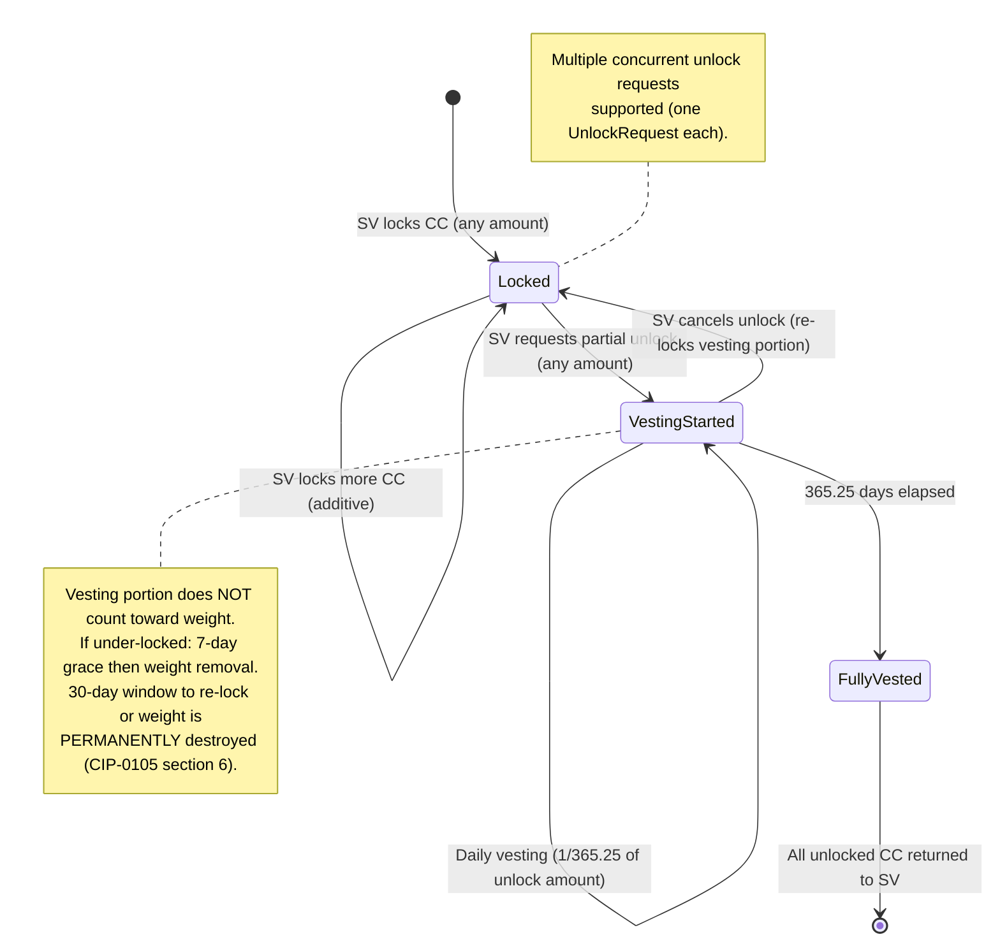

# Development Fund Proposal

## CIP-0105 Phase 2: On-Chain SV Locking Enforcement

| Field | Value |
| :---- | :---- |
| Author | Eric Mann, Avro Digital |
| Status | Draft |
| Created | 2026-03-30 |
| Champion | Tech & Ops Committee outreach in progress |

---

## Abstract

This proposal requests funding to design, implement, and devnet-validate on-chain enforcement of the Super Validator (SV) locking mechanism defined in CIP-0105. Today, SV reward weight is a governance-set integer with no relationship to locked tokens. CIP-0105 Phase 1 (manual, Foundation-verified) is active, but Phase 2 — on-chain smart contract enforcement — has no implementation in the Splice codebase.

This project delivers on-chain SV locking enforcement in Splice that replaces manual verification with deterministic, on-chain weight derivation. The implementation is intentionally narrow: direct CC locking first, with only the abstractions needed to make the design reviewable and maintainable.

All code will be contributed to the open-source `hyperledger-labs/splice` repository under the existing Apache 2.0 license.

---

## Specification

### 1. Objective

Deliver PR-ready, devnet-validated DAML contracts and Splice automation that:

1. Verify SV lock compliance on-chain using direct CC locking as the first implementation path
2. Compute lock-derived reward weight continuously (replacing the governance-set constant)
3. Enforce CIP-0105's escalating penalty schedule (7-day grace → temporary removal → 30-day permanent destruction)
4. Support multi-wallet and multi-organization lock aggregation per CIP-0105 §4
5. Provide linear vesting for partial unlocks of any size per CIP-0105 §2
6. Integrate with Splice's existing DSO automation and reward distribution pipeline

### 2. Implementation Mechanics

**Integration point.** The project introduces a new additive DsoRules choice that reads lock state from on-chain registries, computes tier-based weight per CIP-0105's formula, and updates each SV's reward weight. This choice runs as DSO automation alongside existing Splice automation triggers — no modification to existing choices or contract signatures is required.

**Chosen v1 custody model.** The first implementation path uses **direct CC locking** as the lock primitive. Each lock is a distinct on-ledger contract representing a specific amount of CC attributed to a specific SV. In v1:

- the locked asset is CC itself, so the locked amount is deterministic and fully on-ledger
- each lock is created from a CC position that the locking workflow moves into explicit lock state
- lock contracts and their corresponding registry entries are created together as the authoritative record
- unlocks are initiated by the SV, which starts the 365.25-day vesting clock per CIP-0105 §2
- vested claims release CC from lock state back to an unlocked CC position

This proposal does **not** rely on an external valuation model, pooled accounting model, or provider-attested lock amount for the funded scope.

**Trust and identity model.** In v1, the DSO / Foundation-managed registry is the authoritative source of truth for which PartyIds count toward a given SV or organization. This mirrors the practical trust model already used in Phase 1's Foundation-managed identity process while moving lock state itself on-chain. An SV cannot self-associate arbitrary PartyIds, and enforcement state (including permanent weight destruction) is DSO-controlled and cannot be reset by the SV.

**Weight formula.** Per CIP-0105: `effectiveWeight = (baseWeight - permanentlyRemovedWeight) × tierMultiplier(lockPercentage)`. The tier multiplier is derived from an annually declining schedule stored in on-chain configuration.

**Continuous update model.** For v1, "continuous" means event-driven reevaluation triggered by lock-state changes, with a periodic consistency backstop. This keeps the implementation operationally realistic while eliminating the weekly-manual-verification gap from Phase 1.

**Contract architecture.** The implementation introduces a set of DAML contracts covering:

- Lock custody and lifecycle management for direct CC positions
- Per-SV enforcement tracking locked amount, beneficiary SV, and unlock lifecycle
- Multi-wallet and multi-organization aggregation per CIP-0105 §4
- Unlock vesting with concurrent partial unlock support
- Enforcement escalation per CIP-0105's penalty schedule (7-day grace → temporary weight removal → 30-day permanent weight destruction)
- Lock expiry aligned with CIP-0105's post-halving sunset

The architecture also requires a minor additive field on an existing Splice reward-tracking data type to enable on-chain lifetime rewards computation. This is a non-breaking addition delivered as a standard PackageUpgrade governance action, with the upgrade script included in the deliverables.

### 3. Architectural Alignment

- **CIP-0105 compliance.** The implementation is designed to cover all spec requirements, including lock expiry 30 days after the next halving. Milestone 1 explicitly closes the remaining design questions around direct CC custody representation and auto-lock forward earnings before contract implementation begins.
- **CIP-0082 alignment.** The Development Fund was established to support core protocol development and shared infrastructure. On-chain SV locking enforcement is a governance mechanism that benefits all network participants.
- **Splice patterns.** The design follows established Splice conventions: DSO-signed registries, governance-controlled configuration, and DSO automation triggers.
- **Forward compatibility.** If maintainers are comfortable with a thin abstraction layer in v1, the verification boundary can stay generic without changing the direct CC implementation.

### 4. Backward Compatibility

The project adds new contracts and a new additive DsoRules choice; it does not modify existing choice signatures or contract shapes. The only modification to an existing Splice data type is a non-breaking field addition that requires a Splice package version bump and a PackageUpgrade DSO governance action. The upgrade script will be included as part of the deliverable.

Existing SV reward distribution continues to work unchanged. The new choice updates `svRewardWeight` through the same field that existing governance weight-setting uses — downstream consumers see no API change.

---

## Motivation

CIP-0105 was approved on 2026-03-02. It requires SVs to lock a percentage of their aggregate lifetime CC rewards to maintain their reward weight, with tiers declining annually and enforcement escalating from temporary weight removal to permanent weight destruction. Phase 1 relies on manual disclosure to the Foundation — SVs report segregated PartyIds and the Foundation evaluates weight weekly.

This manual process has significant limitations:

**No on-chain verifiability.** Lock compliance is attestation-based, not cryptographically enforced. A well-intentioned SV could inadvertently misreport, and there is no programmatic way for the network to verify lock state.

**No continuous enforcement.** Phase 1 evaluates weekly. CIP-0105 Phase 2 specifies "SV Weight updates continuously." The gap between weekly snapshots and continuous enforcement creates windows where under-locked SVs receive full reward weight.

**No standardized lock interface.** SVs currently lock CC in ad-hoc arrangements — segregated wallets, custodian attestations, or manual holds. There is no common contract interface for the network to query and no standard for multi-wallet aggregation.

**Scaling concern.** As the SV set grows (CIP-0106 through CIP-0110 have added new SVs in Q1 2026 alone), manual verification becomes an increasing operational burden on the Foundation.

Phase 2 on-chain enforcement resolves all of these by moving lock verification into DAML contracts that the DSO automation can query deterministically.

### Current State of the Art

No implementation of CIP-0105 Phase 2 exists in the Splice codebase or any known fork. The manual Phase 1 process has been active since CIP-0105's approval in early March 2026. This proposal represents the first concrete, CIP-author-aligned implementation plan for on-chain enforcement.

---

## Rationale

### Why a narrow implementation is the right first milestone

A narrow implementation that only serves CIP-0105 is the right first milestone. The immediate deliverable is direct CC locking that fully satisfies CIP-0105 on-chain. If maintainers agree that a thin verification interface is low-risk, we can include it. If not, the direct CC implementation still stands on its own.

### Why this is infrastructure, not product work

The deliverable is DAML contracts and Splice automation contributed to the public `hyperledger-labs/splice` repository. The grant funds direct CC locking for CIP-0105, plus only the minimum abstractions that reviewers deem prudent. It does not fund any token implementation, product UI, or proprietary tooling.

### Scope boundaries and policy contingency

This proposal is intentionally structured so that the funded work stands on its own. CIP-0105 enforcement is the deliverable. Direct CC locking is the fully sufficient and explicitly preferred first implementation path. The exact auto-lock forward-earnings mechanics are treated as a Milestone 1 design closure rather than an unstated implementation assumption.

Out of scope for this grant:

- user-facing CLI, API, or UI work
- any token or product integration not required for direct CC locking
- Featured App locking implementation itself (see active [cip-discuss thread](https://lists.sync.global/g/cip-discuss/message/475))
- mainnet rollout governance or operations

Even if the design never expands beyond direct CC locking, the project still delivers full ecosystem value because CIP-0105 Phase 2 becomes enforceable on-chain through that path alone.

### Differentiation

This proposal reflects a completed architectural analysis, not a research plan. The team has already resolved key design questions — custody model, identity binding, lifetime rewards tracking, and automation integration — and is prepared to begin implementation immediately upon funding. The contract architecture, integration strategy, and test plan documented in this proposal are the product of hands-on analysis of the Splice codebase, not extrapolation from the CIP-0105 specification alone.

### Why Avro Digital

Avro Digital has direct operational experience with:

- Canton's DAML contract model, including UTXO patterns, interfaces, and the authorization model
- The Splice codebase (DsoRules, reward distribution, governance patterns)
- CIP-0105's full specification (annual tier step-downs, permanent weight destruction, partial unlocks, multi-organization aggregation, auto-lock)
- Contributing to `hyperledger-labs/splice` (active contributor with merged PRs)

Avro Digital has already completed internal design analysis of CIP-0105 Phase 2 contract architecture, including resolution of open design questions around custody representation, lifetime rewards tracking, and automation integration. This proposal reflects completed analysis, not speculative scoping.

This combination of protocol-level DAML expertise and CIP-0105-specific analysis is necessary because the implementation touches DsoRules — the DSO-owned governance singleton — and must integrate with the existing reward distribution pipeline without disrupting it.

---

## Milestones and Deliverables

### Milestone 1: Design Finalization & CIP Author Alignment

- **Estimated Duration:** 1-2 weeks
- **Effort Allocation:** design / alignment phase
- **Focus:** Finalize contract shapes with CIP-0105 author and Splice maintainers; resolve open design questions
- **Deliverables / Value Metrics:**
  - Written alignment with CIP-0105 author on direct CC lock verification, custody model, identity binding, and auto-lock mechanics
  - Decision on whether a thin generic verification interface belongs in v1
  - Finalized v1 trust model covering PartyId association, registry authority, and unlock control
  - Updated design document reflecting all feedback
  - Draft Splice PR description for early maintainer review

### Milestone 2: Core Contracts & Tests

- **Estimated Duration:** 2-3 weeks
- **Effort Allocation:** implementation and test phase
- **Focus:** Implement all DAML contracts and comprehensive script tests
- **Deliverables / Value Metrics:**
  - All core DAML templates implemented (lock custody, per-SV enforcement, multi-wallet aggregation, unlock lifecycle, enforcement escalation, on-chain configuration), plus any thin optional verification interface agreed in M1
  - New additive DsoRules choice implemented
  - Additive field for lifetime rewards tracking on existing Splice reward data type
  - DAML script test suite covering: lock creation, all tier evaluations (100%/60%/40%/0%), annual step-down across 4 years, unlock vesting lifecycle, partial unlocks, concurrent unlock requests, multi-wallet aggregation, grace period enforcement (7d + 30d), permanent weight destruction, lock expiry (post-halving sunset), claim-before-vesting and double-claim failure cases, and `submitMustFail` for unauthorized paths
  - All tests passing against current Splice `main`

### Milestone 3: Production Hardening & Splice PR

- **Estimated Duration:** 2-3 weeks + review buffer
- **Effort Allocation:** hardening and PR-readiness phase
- **Focus:** Security hardening, PR submission, and review-readiness
- **Deliverables / Value Metrics:**
  - Five-pass convergence security review (correctness, security, clarity, edge cases, excellence) with documented findings
  - Direct CC custody/signatory model reviewed with maintainers and documented explicitly
  - Authorization model audit: verify no self-authorized locks, no unauthorized PartyId association, and no multi-wallet Sybil vectors
  - Draft PR submitted to `hyperledger-labs/splice` with full test suite
  - Maintainer review feedback addressed (budget 2 weeks for review iteration). Acceptance is based on PR-ready public artifacts, passing tests, and documented review engagement — not on upstream merge timing, which is partially outside the proposer's control.

### Milestone 4: Devnet Validation & Documentation

- **Estimated Duration:** 1-2 weeks
- **Effort Allocation:** validation and documentation phase
- **Focus:** End-to-end validation on devnet, operator documentation, knowledge transfer, and handoff readiness
- **Deliverables / Value Metrics:**
  - Contracts deployed to Canton devnet with test SVs
  - E2E validation: lock → weight derivation → reward distribution → unlock → vest → claim, across multiple SVs and wallets
  - Operator documentation: lock management guide, configuration reference, troubleshooting
  - Architecture documentation: design decisions, trust model, upgrade path
  - Co-marketing materials prepared (blog post draft, technical summary)

**Estimated total calendar duration: ~3 months** (10-12 weeks, assuming no extended review delays)

---

## Acceptance Criteria

The Tech & Ops Committee will evaluate completion based on:

- **Code quality:** All DAML contracts are delivered as a PR-ready contribution to `hyperledger-labs/splice` with comprehensive DAML script test coverage, including negative tests for unauthorized operations. If upstream merge timing extends beyond the milestone window for reasons outside the proposer's control, Tech & Ops may evaluate completion based on public PR-ready artifacts, passing tests, and addressed review feedback.
- **CIP-0105 compliance:** Implementation covers all spec requirements — annual tier schedule, permanent weight destruction, partial unlocks, multi-organization aggregation, enforcement lifecycle, and lock expiry
- **Security:** Documented security review with no unmitigated critical or high findings; authorization model verified against Canton's signatory/observer rules
- **Devnet validation:** Successful E2E test on Canton devnet demonstrating the full lock-to-reward lifecycle
- **Documentation:** Operator guide, architecture doc, and inline code documentation sufficient for Splice maintainers to support the code post-merge
- **Backward compatibility:** Existing reward distribution pipeline unaffected; no breaking changes to existing Splice contract interfaces

---

## Funding

**Total Funding Request: 900,000 Canton Coin (CC)**

CC is priced at $0.14 for this proposal (as of March 2026; conservative, slightly below current market), yielding approximately $126,000 USD equivalent.

### Resourcing basis

This budget assumes approximately **520-640 hours of total loaded effort**, distributed across the skills needed to deliver the work: DAML / Canton engineering, protocol review, and light project coordination. It should be read as total team capacity, not as a promise of serialized calendar time by a single named individual. Depending on how much the team parallelizes design, implementation, testing, and review work, calendar duration may be materially shorter than a solo 40-hour/week schedule. In rough terms:

- **Engineering:** ~480-560 hours
- **Review / coordination / proposal support:** ~40-80 hours
- **Total loaded effort:** ~520-640 hours

The proposal is intentionally lean because it excludes downstream product work and scopes delivery to upstream contracts, tests, documentation, and devnet validation.

### Payment Breakdown by Milestone

| Milestone | Amount (CC) | ~USD at $0.14 | Trigger |
| :---- | :---- | :---- | :---- |
| 1 — Design Finalization | 90,000 | ~$12,600 | Committee acceptance of finalized design and CIP author alignment |
| 2 — Core Contracts & Tests | 320,000 | ~$44,800 | Committee acceptance of all contracts and test suite |
| 3 — Production Hardening & Splice PR | 290,000 | ~$40,600 | Draft PR submitted to Splice with security review complete |
| 4 — Devnet Validation & Docs | 200,000 | ~$28,000 | E2E devnet validation and documentation delivered |

### Volatility Stipulation

Should delivery extend beyond 6 months due to Committee-requested scope changes or Splice review delays outside the proposer's control, remaining milestones will be renegotiated to account for significant USD/CC price volatility.

---

## Co-Marketing

Upon release, Avro Digital will collaborate with the Foundation on:

- Joint announcement of CIP-0105 Phase 2 deployment
- Technical blog post explaining the on-chain locking architecture and its benefits for SV accountability
- Developer-focused documentation showing how the direct CC implementation could be generalized in a future follow-on
- Presentation at a Canton community call or governance meeting

---

## Appendix: Architecture & Design Detail

### Architecture Summary

The implementation introduces a set of DAML contracts that handle:

- Lock custody and lifecycle management for direct CC positions
- Per-SV enforcement tracking locked amount, beneficiary SV, and unlock lifecycle
- Multi-wallet and multi-organization aggregation per CIP-0105 §4
- Unlock vesting with concurrent partial unlock support
- Enforcement escalation per CIP-0105's penalty schedule
- Integration with Splice's existing reward distribution pipeline via a new additive DsoRules choice

The architecture follows established Splice patterns and requires no breaking changes to existing contracts. A minor additive field to an existing Splice data type requires a standard PackageUpgrade governance action; the upgrade script is included in the deliverables.

### Unlock Vesting Flow

Per CIP-0105 §2, an SV may initiate an unlock of any size at any time. Multiple concurrent unlock requests per SV are supported.

### Risk Summary

| Risk | Severity | Mitigation |
| :---- | :---- | :---- |
| DsoRules change rejected by maintainers | High | M1 alignment reduces risk; new additive choice avoids modifying existing ones |
| CIP author policy divergence | Medium | Written alignment at M1; design supports direct CC locks regardless |
| PackageUpgrade governance delay | Medium | Field addition requires governance; upgrade script is included and milestone acceptance is based on deliverables rather than governance completion |
| Direct CC custody/signatory shape needs maintainer alignment | Medium | M1 alignment freezes the custody model before implementation begins |
| Identity binding or registry authority is disputed | Medium | v1 explicitly uses DSO-controlled PartyId association, mirroring the practical trust model already used in Phase 1 |
| Competing implementation | Low | First-mover with completed design analysis and CIP author alignment |

### Adoption Path

Initial deployment targets Canton devnet for end-to-end validation (Milestone 4). The devnet deployment will exercise the full lock-to-reward lifecycle across multiple SVs, producing validated contracts and operational documentation. Mainnet migration will follow the standard Splice governance process: DSO vote to accept the package upgrade, followed by phased rollout coordinated with the Foundation and SV operators. The grant deliverables (contracts, tests, documentation, and operator guide) are specifically designed to minimize the gap between devnet validation and mainnet readiness.

### External References

- [CIP-0105 Specification](https://github.com/canton-foundation/cips/blob/main/cip-0105/cip-0105.md)

---

## Post-Grant Support

For 90 days after Milestone 4 acceptance, Avro Digital will:

- answer reasonable maintainer questions about the contributed contracts and tests
- fix grant-scope bugs identified during review or devnet validation
- assist Splice maintainers with follow-up documentation clarifications

This support window does not include downstream product integrations or operational ownership of a future mainnet rollout.
