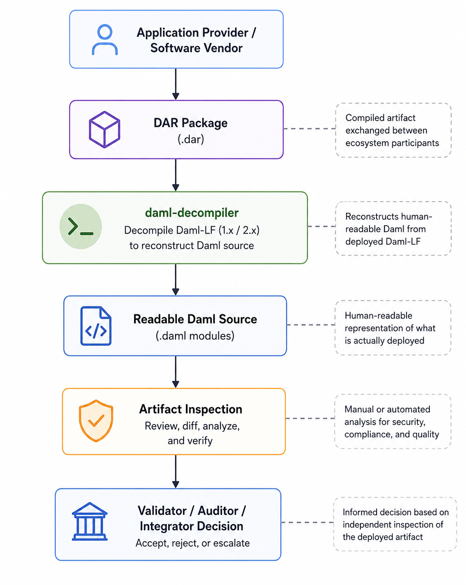
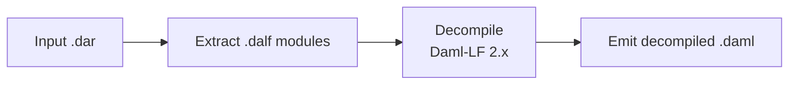

# Improving DAR Artifact Inspectability

An open-source Daml-LF decompiler for security review and artifact transparency.

> **Status:** Early public draft (v0.1) — published to gather technical feedback from the Canton community before a formal Development Fund submission. Funding details and implementation timelines are intentionally omitted at this stage.

**Author:** Dedge Security  
**Organization:** [dedge-security](https://github.com/dedge-security)  
**Label:** `daml-tooling` & `dar-app-management`  
**Champion:** Canton Foundation

---

## Abstract

As the Canton ecosystem grows, organizations increasingly exchange compiled DAR packages between application providers, financial institutions, auditors, and validator operators. While these artifacts ultimately define what is deployed on ledger, there is currently no straightforward way to independently inspect the logic they contain. This proposal addresses a broader ecosystem challenge: improving the transparency and inspectability of deployed DAR artifacts. The decompiler is the first building block toward that goal.

We propose **daml-lf-decompiler**, an open-source toolchain that reconstructs a **human-readable Daml representation** from deployed Daml archives (`.dar`) by decompiling Daml-LF 2.x. This enables validators, security auditors, and integrators to review the software that is actually deployed, rather than relying solely on embedded source code or vendor-provided repositories.

The Canton ecosystem already provides strong **forward tooling** (code generation for Java, TypeScript, C#, Go) together with metadata inspection and interface reconstruction capabilities. However, there is currently **no supported open-source workflow for reconstructing reviewable Daml logic directly from deployed Daml-LF**, limiting artifact transparency and independent verification.

The project focuses on hardening LF decompilation, validating it against real-world DAR packages, integrating it into CI workflows, and making it available as an open-source public good for security reviews, incident response, and software supply-chain verification.

Future extensions could include AI-assisted review and automated vetting reports built on top of the decompiler for participants who want additional machine-assisted analysis.




---

## Why this matters

As Canton adoption grows, more organizations exchange compiled DAR packages between vendors, auditors, integrators, and validator operators. In many cases, the DAR is the artifact that is actually vetted or deployed, but the ecosystem still lacks a simple way to inspect what that artifact contains independently of embedded source files or vendor-provided repositories. Improving DAR inspectability helps validators, auditors, and institutions review deployed artifacts more confidently.

### 1. Objective: DAR inspectability

The objective is to make deployed DAR artifacts easier to inspect, review, and reason about before they are accepted, audited, or deployed.


### Current limitations

Today, ecosystem participants frequently exchange compiled DAR packages containing Daml-LF (`.dalf`) without access to trustworthy or up-to-date source repositories. Current review workflows have important limitations:

- Vendors may distribute binaries only.
- Embedded `.daml` sources may be missing, incomplete, or may not accurately reflect the artifact ultimately deployed.
- Existing tooling focuses on metadata inspection or interface reconstruction rather than reconstructing reviewable Daml logic from the deployed Daml-LF.
- Auditors, validator operators, and integrators often need to inspect the logic that is actually deployed on ledger rather than relying on accompanying source artifacts.

This proposal addresses these limitations by operating directly on the Daml-LF bytecode contained in deployed DAR packages, making the reconstructed output independent of any embedded source files.

### Outcome

The project delivers a standalone CLI and reusable library (`daml-lf-decompiler`) that:

1. Loads a `.dar` (zip + manifest).
2. Decompiles Daml-LF 2.x bytecode through a dedicated decompilation pipeline.
3. Emits human-readable `.daml` modules suitable for independent audit and review.

**Single objective:** LF → human-readable Daml representation for security, audit, and compliance workflows.

Out of scope: ledger runtime, contract execution, or replacing `daml build`. Because compilation is a lossy transformation, semantic equivalence, not round-trip reconstruction is the objective.

#### Illustrative scenario: trusted developer compromise (supply-chain trust failure)

**Example flow:** Validator operator Alice runs a Canton participant and routinely accepts DAR uploads from **Acme Finance**, a long-standing integrator whose packages passed prior review. An attacker compromises Acme’s release CI and ships `acme-lending-v2.dar` with the same marketing name but LF that adds a **hidden choice** granting an external party unilateral archive rights. Alice's organization routinely accepts DAR packages from Acme because it has historically been considered a trusted software provider. No human re-reads the package because the **source identity is trusted**.

**Mitigation with this toolchain:**

1. **daml-lf-decompiler** on every upload, ignore embedded sources, reconstruct from deployed LF only.
2. **Tamper check** diff embedded `.daml` vs LF-derived output, flag mismatches before acceptance.

The participant still decides policy and the decompiler makes artifact-level inspection practical at the speed of package intake.


### Existing tooling: `damlc inspect`

The Daml SDK already ships a low-level inspection command:

```bash
daml damlc inspect package.dar -o inspect.txt
```

It pretty-prints the Daml-LF bytecode inside a `.dar` in **LF-internal syntax**, not idiomatic Daml. On a simple internal bond-contract package (6 modules, ~ 1,000 lines of source implementing Splice token APIs and DvP settlement), `damlc inspect` produces **~9,700 lines / 670 KB** — roughly **9.5× the source size**, dominated by compiler-generated selectors.

In principle, an LLM can read that output and reconstruct something closer to Daml source. We ran this experiment on the same benchmark, the AI-assisted reconstruction recovered all 6 modules, 6 templates, 12 choices, and 6 Splice interface instances in ~900 lines. The results is workable but it's **not a sustainable audit workflow**:

- **Verbose input** — auditors must process ~10× the source volume in LF syntax, or pay for AI on every package.
- **Non-deterministic** — different models or prompts can yield different reconstructions.
- **AI dependency** — security review should not require an LLM at intake time.

A purpose-built **daml-lf-decompiler** would deliver the same outcome **deterministically**, without AI, and integrated into validator/CI workflows. We have started small exploratory work in Rust to validate the approach. The current prototype emits the correct module structure but is **not yet audit-ready** and parts are missing: all 12 choice bodies are stubs, zero interface instances are recovered, and field types/controllers are garbled.

### 2. Implementation Mechanics

**Architecture:**

The implementation is written in Rust for performance, portability, and straightforward CI/CD integration. The implementation is based on analysis of the Daml-LF format and the compilation pipeline used by the Daml SDK. Rather than attempting to reproduce the original source code verbatim, the decompiler reconstructs a human-readable representation that preserves the semantics of the deployed package for independent inspection.



**Exploratory work to date:** stages 1–2 and a partial stage 3/4 are implemented in Rust. The prototype correctly loads DARs, decodes LF2 protobuf, emits module files, and recovers template *structure* on real packages — but choice bodies, interface instances, and type resolution remain incomplete.

#### LF → Daml coverage plan

Daml-LF is a stripped-down core language: records, variants, enums, templates, interfaces, exceptions, and expressions. The protobuf [`Module`](https://github.com/digital-asset/daml/blob/5c6a16111dca475ff43a7756191c3cb546852733/sdk/daml-lf/archive/src/protobuf/com/digitalasset/daml/lf/archive/daml_lf2.proto#L1341-L1351) message defines everything a package contains:

| LF construct (`Module` field) | Daml surface target | Prototype status | Plan |
|-------------------------------|---------------------|:----------------:|------|
| `synonyms` (`DefTypeSyn`) | `type` aliases | Partial | Phase 1 - emit synonyms |
| `data_types` (`DefDataType`) | `data` (record / variant / enum) | Partial | Phase 1 — correct record/variant/enum lowering |
| `values` (`DefValue`) | Top-level functions; `script` blocks when `is_test` | Lowered, not emitted | Phase 4 — emit non-internal bindings |
| `templates` (`DefTemplate`) | `template` declarations | Partial | Phase 1 — fields, signatories, observers; Phase 4 — `ensure` |
| `templates.choices` (`TemplateChoice`) | `choice` / `nonconsuming choice` | Structure only | Phase 2 — systematic choice-body lowering (replace ad-hoc inlining) |
| `templates.implements` | `interface instance` on template | Not implemented | Phase 2 — **critical for Splice token APIs** |
| `interfaces` (`DefInterface`) | `interface` declarations | Not implemented | Phase 2 — methods, view type, `requires`, interface choices |
| `exceptions` (`DefException`) | `exception` declarations | Not implemented | Phase 4 — message expression lowering |
| Package `imports` | `import` statements | Not implemented | Phase 3 — map package IDs to module names via DAR manifest / dependency graph |

**Expression & update lowering** (inside choices, interface methods, and values):

| LF category | Examples | Prototype | Plan |
|-------------|----------|:---------:|------|
| Core expressions | `let`, `case`, records, variants, `optional`, lists | Partial | Phase 1 — lists, record update, expression parity |
| Template updates | `create`, `exercise`, `fetch`, `archive` | Partial | Phase 2 — reliable choice-body recovery |
| Interface expressions | `toInterface`, `fromInterface`, `callInterface`, `viewInterface` | Not implemented | Phase 2 |
| Interface updates | `createInterface`, `fetchInterface`, `exerciseInterface` | Not implemented | Phase 2 |
| Exceptions | `throw`, `try/catch`, `toAnyException` | Not implemented | Phase 4 |
| Dev / advanced | `soft_fetch`, `dynamic_exercise`, `get_time` | Not implemented | Phase 5 — as encountered in Splice DARs |

#### Phased delivery


| Phase | Focus | Key deliverables | Maps to |
|-------|-------|------------------|---------|
| **1 — Core lowering** | Data types, templates, basic choice bodies | Correct `data`/`template` emission, LF2 expression parity| M1 |
| **2 — Interfaces & choices** | Splice-critical path | `interface` + `interface instance` emission, systematic choice-body lowering, `create`/`exercise`/`fetch` in bodies | M1 |
| **3 — Module packaging** | Imports, multi-package DARs | Import reconstruction from dependency graph| M1 / M2 |
| **4 — Extended constructs** | Scripts, keys, exceptions | `script` emission, template keys; `exception` / `throw` / `try` | M2 |
| **5 — Production hardening** | Splice & partner DARs | Reduced stub rate, published coverage matrix, CI recipe + JSON summary gates | M2 |

**Known limitations:** Because compilation is a lossy transformation, the objective is semantic equivalence for human inspection rather than byte-for-byte reconstruction of the original source. Round-trip compilation is therefore not guaranteed.

**Distribution:** Rust binary via GitHub Releases

### 3. Architectural Alignment

- **Canton priorities ([review process](https://github.com/canton-foundation/canton-dev-fund/blob/main/Development%20Fund%20Proposal%20Review%20Process.md)):** Security & Resilience (audit/supply chain) & Developer Experience (inspect third-party DARs locally).
- **CIP-0100:** Milestone-based CC, transparent deliverables, public good.
- **dpm:** The tool can be added to `dpm`, streamlining usage for Daml engineers.
---

### 4. Relationship with other ecosystem initiatives

This proposal complements ongoing work around package management, package distribution, reproducible builds, and audit metadata.

Where package management answers:

> How do we distribute and verify trusted packages?

this proposal answers:

> How do we independently inspect and understand the artifacts we receive?

Both approaches strengthen different parts of the Canton software supply chain.

While this proposal focuses on artifact transparency and inspection, it is designed to integrate naturally with future ecosystem tooling. As package management capabilities evolve, the decompiler could become part of package intake and deployment workflows, enabling validators and participants to automatically inspect and verify DAR artifacts before they are accepted or deployed.


## Milestones and Deliverables

Grant work is structured in **two core milestones** (decompiler first) plus an **optional third milestone** (AI-assisted vetting).

### Milestone 1: Decompilation

- **Focus:** Phases 1–3 — core LF lowering, interface recovery, and module packaging (LF2 → readable Daml for human review).
- **Deliverables:**
  - Published releases with checksums.
  - Phase 1–2 coverage: data types, templates, choice bodies, `interface` / `interface instance` emission.
  - Phase 3: import reconstruction.
  - Documented limitation list.
  - User guide: install, decompile Splice/app DAR, interpret stubs.
  - Successful decompilation runs on **Splice** reference DARs (or Foundation-provided equivalents) with published summary report (modules recovered, stub count, choice/interface recovery rate, embedded-vs-LF diff stats).

### Milestone 2: Feedback, Refinement & Adoption

- **Focus:** Gather real-world feedback, refine the decompiler, and embed it in audit / vetting workflows.
- **Deliverables:**
  - Run the decompiler on production or staging `.dar` and provide written feedback.
  - Phase 4: script/test emission, template keys, exceptions.
  - Phase 5: reduced stub rate on Splice and partner packages; published coverage improvements.
  - Example **GitHub Actions / GitLab CI** job: decompile vendored `.dar`, fail on unexpected stub growth or embedded/LF mismatch.
  - JSON **machine-readable summary** (package id, module list, stub locations, interface recovery rate) for CI gates.
  - Technical blog post with Foundation co-marketing (trusted-source compromise use case).
  - Final adoption report: **some organizations** with attested use in audit or vetting workflow.

### Future Extension: Automated Vetting Brief

- **Focus:** Layer automated review on top of the production decompiler so participants can get a **brief overview** of a `.dar` before deciding to vet or reject it.  

---

## Funding

**Total funding request:** **700,000 Canton Coin (CC)** over **4 months.**

### Payment breakdown by milestone

| Milestone | Amount (CC) | Trigger |
|-----------|-------------|---------|
| M1 — Decompilation | 500,000 | Committee acceptance of M1 |
| M2 — Feedback, refinement & adoption | 200,000 | Committee acceptance of M2 |

---

## Potential users

- Validator operators
- Security auditors
- Application integrators
- Daml developers
- Canton ecosystem tooling teams

---

## Co-marketing

Upon M2 public release, Dedge Security will coordinate with the Foundation on:

- Announcement post (Canton forum / Foundation channels).
- Technical blog: vetting third-party DARs.
- Office hours or workshop for validator security SIG (if scheduled).

If M3 is pursued, a follow-on post will cover AI-assisted vetting briefs for participants.

---

## Vision

The long-term goal is to make DAR artifact inspection a standard capability across the Canton ecosystem. Whether performed manually by auditors or integrated into validator software, package management workflows, CI/CD pipelines, or future ecosystem tooling, the ability to independently inspect deployed artifacts improves transparency, strengthens software supply chain security, and helps participants make more informed trust decisions. This proposal establishes the first building block toward that vision by enabling independent inspection of deployed DAR artifacts.

---

## Motivation

Inspectability of deployed DAR artifacts is a commons problem. Every validator, financial institution, auditor, and application integrator benefits from a shared capability to understand what is actually deployed on ledger. By making this capability available as open-source infrastructure, the Canton ecosystem gains a common foundation for artifact transparency, independent verification, and future security tooling.

---

## Rationale

**Why decompilation vs. only embedded source?** DARs may ship without sources or with sources that do not match LF. Only decompiling LF guarantees alignment with deployed behavior.

**Sustainability after grant:** Apache-2.0 OSS; community / follow-on maintenance or integration into Foundation security tooling.

---

## Open source

- License: **Apache-2.0**.
- Repository: https://github.com/dedge-security/

---

## Feedback

Feedback, suggestions, and technical discussions are very welcome. This document is intentionally being shared early to encourage community input before a formal Development Fund submission.
