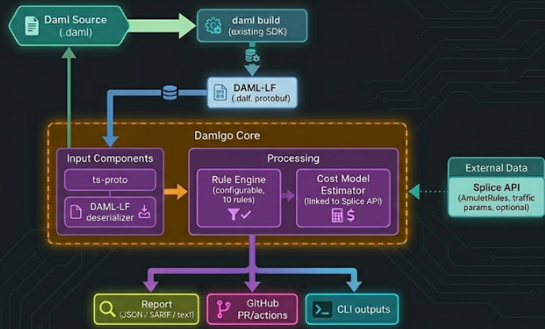

## Development Fund Proposal

**Author:** P-OPS Team
**Status:** Submitted
**Created:** 2026-02-28

---

## Abstract

Damlgo (Daml Gas Optimizer) is a production-grade static analysis and traffic cost estimation tool for Daml smart contracts on the Canton Network. Built in TypeScript, it analyzes compiled DAML-LF (protobuf) output to detect patterns that inflate traffic costs, such as oversized payloads, over-broad informee sets, and deep transaction trees, surfacing actionable feedback directly within the developer's environment and/or CI/CD pipelines.
Currently, Canton developers can only verify traffic costs reactively: either by inspecting logs post-execution or by using the Splice prepare API on a case-by-case basis. These methods are late-stage requirements that necessitate a running environment and fully constructed transactions.
Damlgo shifts this process “left”, moving cost optimization from a post-deployment hurdle to a design-time advantage. By enabling developers to reason about and reduce traffic costs before a single line of code is deployed, Damlgo drives lower CC expenditure per application, optimizes global synchronizer throughput, and establishes a new standard for high-performance Canton development.

---

## Specification

### 1. Objective
The goal is to provide Daml developers with immediate feedback on the economic impact of their code. Currently, traffic costs on Canton are only visible after execution via the Splice API. Damlgo solves this by:
- Establishing economic best practices by flagging cost-inefficient patterns during development
- Preventing "cost-creep" in production by gating PRs based on traffic cost deltas.
- Reducing the barrier to entry for new developers who may not yet understand Canton’s unique informee-based billing model.

### 2. Implementation Mechanics

Damlgo operates directly on compiled artifacts, integrating seamlessly into existing developer workflows without requiring runtime dependencies or network modifications.

**Technical Workflow:**
- DAML-LF Parsing: The pipeline starts with daml build. The resulting .dalf files are deserialized via ts-proto, allowing the tool to inspect the TypeScript AST (Abstract Syntax Tree) without a full Daml SDK runtime.
- Static Analysis Engine: A visitor-pattern-based engine traverses the AST to identify anti-patterns and structural inefficiencies.
- Cost Modeling: A mathematical model maps contract data structures to serialized byte sizes. These are then multiplied by the predicted recipient set defined in the Daml logic.
- Environment Sync: The tool optionally pulls live AmuletRules and synchronizer parameters from the Splice API to ensure cost estimates reflect real-world market pricesons

**Flexible Delivery**

Results are emitted in multiple formats to fit any modern DevOps stack:
- CLI Output for local development.
- SARIF & PR Annotations for automated CI/CD feedback.
- JSON/Text Reports for custom auditing.

### 3. Architectural Alignment

Damlgo aligns with CIP-0100 and the Canton Ecosystem Development Fund’s priority on "Developer Experience and Tooling."
Canton Efficiency: By optimizing transaction density, it reduces unnecessary load on Global Synchronizers.
Economic Transparency: It reinforces the utility of Canton Coin (CC) by making its consumption predictable and manageable.

### 4. Backward Compatibility

No backward compatibility impact. Damlgo acts as a sidecar to the development process and does not modify contract bytecode or ledger state.

---

## Milestones and Deliverables

### Milestone 1: DAML-LF Infrastructure & Parser
- **Estimated Delivery:** 1-2 months after approval
- **Focus:** Ability to read and interpret compiled Daml.
- **Deliverables / Value Metrics:** A TypeScript library using ts-proto that successfully parses .dalf files into a searchable AST (Abstract Syntax Tree).
Parsing support for Daml 3.x .dalf files.

### Milestone 2: Core Rule Engine & CLI

- **Estimated Delivery:** 2-4 months after approval
- **Focus:** Implementing the logic that identifies cost-inflating patterns.
- **Deliverables / Value Metrics:**
  - CLI tool with JSON / SARIF / text output
  - Comprehensive test suite (>90% rule coverage)
  - Initial set of 5 rules (Rule engine v1)
  - Documentation for .damlgorc.json configuration.

### Milestone 3: Core rule engine v2, Cost Estimation & CI/CD

- **Estimated Delivery:** 5-6 months after approval
- **Focus:** Financial modeling, ecosystem integration.
- **Deliverables / Value Metrics:**
  - Additional set of 5 rules
  - Traffic cost estimation algorithm (predicting bytes and recipient multipliers).
  - GitHub Action for PR gating and automated comments.
  - Splice API connector for live network parameter calibration.

---

## Acceptance Criteria

The Tech & Ops Committee will evaluate completion based on:
Code is fully functional and compatible with the latest Canton Network release.
- Cost estimates must be within 30% of actual
- totalTrafficCostEstimation on a benchmark suite of 10 standard templates
- Successful installation and execution via npx on a clean
- Cross-platform environment (macOS, Linux, Windows)
Public repository access with clear contributor guidelines and MIT/Apache 2.0 licensing

---

## Funding

**Total Funding Request:**  625,000 CC

### Payment Breakdown by Milestone
- Milestone 1: 30% of Total CC
- Milestone 2: 40% of Total CC
- Milestone 2: remaining 30% of Total CC

### Volatility Stipulation

Should the project timeline extend beyond 6 months due to Committee-requested scope changes, any remaining milestones must be renegotiated to account for significant USD/CC price volatility.

---

## Co-Marketing

Upon release, the implementing entity will collaborate with the Foundation on:

- Announce damlgo
- Publish a technical blog on the Canton/POPS blog/medium
- Promote tool in dev discussion/forum

---

## Motivation

In a decentralized network like Canton, where every byte of transaction data has an associated fee, code inefficiency is a direct financial liability. Without damlgo, developers typically only discover that their contract architecture is cost-prohibitive after deployment.

damlgo addresses this by providing a "cost-per-choice" calculation during the development phase. This metric calculates the estimated Canton Coin (CC) fee for executing any specific choice or action within a contract by modeling the serialized payload size and the number of recipients triggered by that choice.

---

## Rationale

We chose TypeScript to ensure the broadest possible adoption and maintainability within the web3 developer community. While other languages exist, a TS-based tool allows for native, zero-friction integration with GitHub Actions. Static analysis of DAML-LF was chosen over runtime profiling because it provides faster feedback and covers "worst-case" scenarios that runtime testing might miss.
