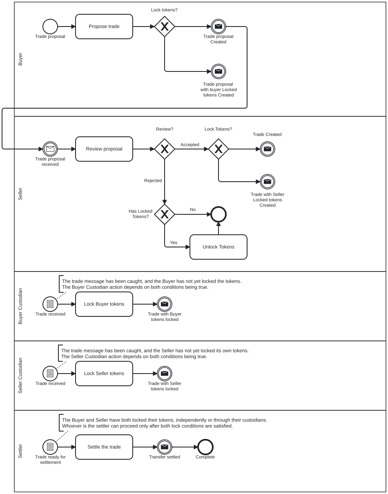
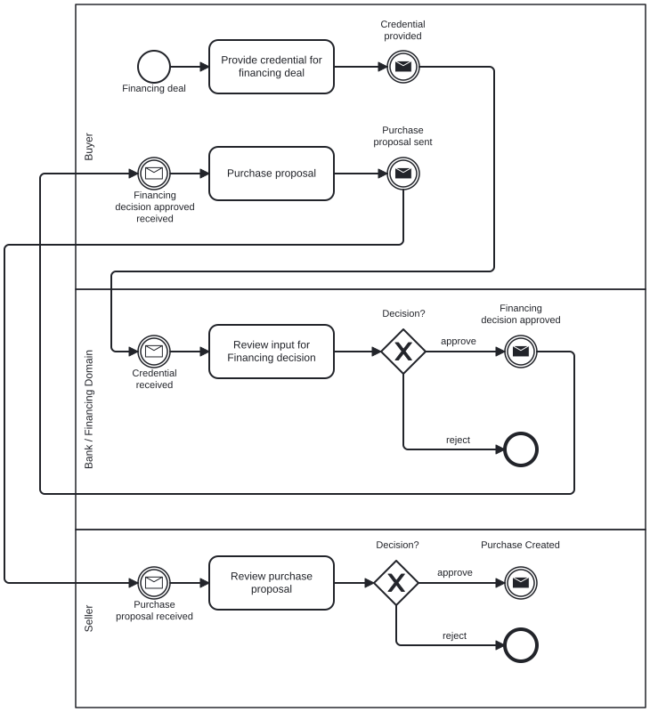
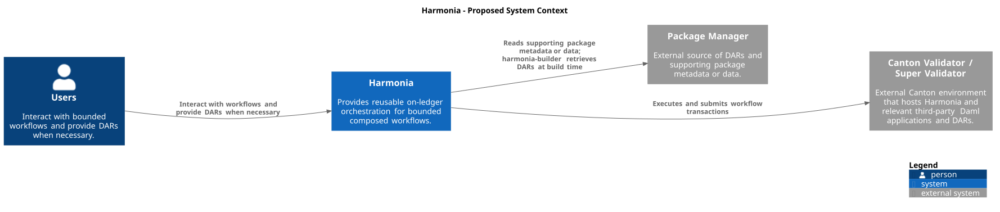
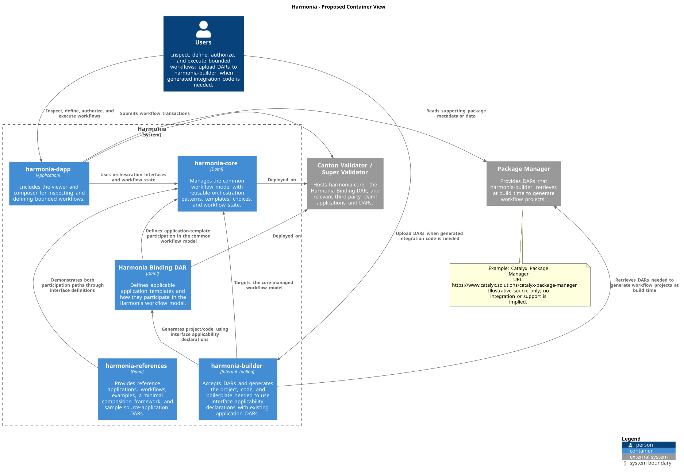

## Development Fund Proposal

**Author:** Unlockit (luis.marado@unlockit.io)  
**Status:** Submitted  
**Created:** 2026-08-01  
**Label:** financial-workflows-composability  
**Champion:** IntellectEU and Jonathan Mayeur  

---

## Abstract

Harmonia proposes a reusable on-ledger composition layer through which independently owned Daml applications can participate in a multi-party workflow without bespoke pairwise integration. The design thesis is that explicit application bindings, persisted orchestration state, party-authorized transitions, and domain-owned handoffs can provide a defensible composition boundary while preserving source-application ownership and Canton privacy constraints.

A new application DAR may implement Harmonia interfaces directly. For an existing application DAR, `harmonia-builder` may generate a binding project and the boilerplate needed to produce a Harmonia Binding DAR. Both proposed routes map eligible application templates and choices into the same Core-managed workflow model; neither assumes that every Daml application can be composed without package, authorization, or interface work.

The initial release delivers a narrow, reusable workflow subset, example source applications packaged as DARs, tests, documentation, and a simple visual workflow viewer or composer for evaluation and demonstrations. It does not claim generic BPMN coverage, arbitrary dynamic composition, off-chain orchestration, a full workflow studio, or global uniqueness of workflow definitions, bindings, or instances. Imports, template and package identifiers, package versioning, dynamic choice calls, the exact binding mechanism, interface constraints, and multi-party authorization remain explicit technical-design decisions.

Harmonia is intended as shared developer infrastructure for Canton. Initial use cases include trade operations, custody coordination, approval flows, and regulated multi-party processes.

---

## Specification

### 1. Objective

Deliver the proposed reusable on-ledger composition layer for Canton-based applications. It will coordinate independently developed Daml packages through explicit bindings, persisted workflow state, party-authorized transitions, and handoffs between domains that retain ownership of their contracts and business rules. The first executable scope will show a project including source application DARs and Harmonia DARs, with Harmonia templates, interfaces, and choices coordinating eligible source-application actions. Longer term, the design should identify what would be required for more dynamic composition without claiming a universally unique workflow registry or universally applicable binding model.

For the purposes of this proposal, a source application is an independently developed Daml application or package with its own templates, interfaces, choices, authorization model, and ownership. Composition means coordinating one or more of those applications as part of a larger process definition without forcing one team to hardcode all cross-application integration logic. The motivation is comparable to the way Solidity ABIs help developers reason about calling into separately developed smart contracts, but Harmonia is not equivalent to an ABI layer because Canton and Daml package imports, interface visibility, authorization, disclosure, and choice execution impose different constraints.

The clearest adopters for this work are Canton application teams, Daml development teams, and institutions building workflow-heavy applications in areas such as trade operations, custody coordination, collateral handling, document-driven approvals, and regulated asset servicing. The intention is to make application composition on Canton easier to carry from one product context to another instead of forcing each team to rebuild bespoke integration glue from scratch.

### 2. Implementation Mechanics

The implementation will not attempt to make Canton a full generic BPMN engine. The point is to adapt useful workflow semantics to a privacy-aware multi-party ledger model in a reusable way, with a particular focus on composability across organizational and domain boundaries.

The first executable cut will focus on a narrow supported subset: start and end events, persisted orchestration states, human- or system-executed steps, explicit step assignees or authorized actors, sequential flow, basic branching and joining rules, bounded atomic execution of eligible multi-step paths, progression across multiple parties within the validated authorization scope, and continuation based on outputs produced by another workflow.

The initial implementation should not claim full BPMN coverage. Timers, escalations, compensation patterns, richer exception handling, reusable subprocess libraries, managed hosting, custom adopter integrations, domain-specific application development, and full visual designer tooling should be treated as later evolution or outside the funded scope.

The project will produce an open reference implementation with reusable core, evaluation, and reference components for privacy-aware, multi-party workflow composition on Canton. How applications participate in that model, including the direct final-application-DAR interface implementation path and the `harmonia-builder` integration path, is defined once below.

The descriptions of `harmonia-dapp`, `harmonia-core`, `harmonia-references`, and the supporting `harmonia-builder` tooling below describe proposed logical components. Their final implementation boundaries will be determined during technical design.

The implementation preserves a modular structure:

- `harmonia-core` provides reusable on-ledger orchestration patterns, workflow state, and step-execution rules
- the dedicated Harmonia Binding DAR defines applicable application templates and their participation in the Harmonia workflow model
- `harmonia-dapp` provides the viewer and composer through which users interact with supported workflows
- `harmonia-references` provides reference applications, workflows, and examples that demonstrate both participation paths described below
- `harmonia-builder` is build-time project-generation tooling

#### Core Layer: `harmonia-core`

`harmonia-core` is the Daml package defining reusable on-ledger orchestration templates, choices, patterns, workflow state, and step-execution rules. It manages the common workflow model used through the dedicated Harmonia Binding DAR.

`harmonia-core` defines the Harmonia interfaces and on-ledger workflow semantics. The model is intended to support composition with third-party applications deployed in a Canton Validator / Super Validator environment through the dedicated Harmonia Binding DAR. An applicability declaration identifies which source template and choice may satisfy a Harmonia interface step. A `Harmonia Binding DAR` packages the implementation that connects those declarations to a source application DAR when the source project does not provide that implementation itself.

A concrete illustrative transfer binding is:

1. an application DAR exposes a `TokenHolding` template and an authorized `LockForTransfer` choice;
2. the Harmonia transfer interface describes the required lock capability and result;
3. an applicability declaration identifies `TokenHolding.LockForTransfer` as an eligible implementation;
4. a Binding DAR supplies the adapter required by that declaration; and
5. a workflow step exercises the interface under the source application's authorization and records the resulting handoff state.

For a new DAR, its project may implement the interface and applicability declaration directly. For an existing DAR, `harmonia-builder` generates a separate binding project that imports the required packages and produces the Binding DAR. This example is illustrative rather than a settled Daml API: import strategy, template and package identifiers, version compatibility, dynamic choice invocation, and whether applicability is represented by interfaces, generated adapters, registries, or another bounded mechanism remain technical-design decisions.

It provides:

- the common workflow model that the dedicated Harmonia Binding DAR uses to define applicable application templates and their participation
- the managed workflow model into which applications and Builder-generated project/code participate through those interface definitions
- workflow state that can be queried and inspected
- explicit identification of the actor that may execute each step
- sequential flow, basic branching and joining rules, and sub-workflow continuation
- bounded atomic execution where the workflow structure and required authorizations allow it

**Step execution rules**
Each supported workflow step maps to executable Daml actions, such as contract creation, choice exercise against a known contract or interface view, bounded wait states, exclusive branching, sub-workflow continuation, and atomic execution blocks. Participant roles resolve to concrete party bindings rather than descriptive workflow tasks.

**Workflow state, authority, and handoff semantics**
Each workflow instance persists its current step, prior transition evidence, relevant binding and package references, authorized next actions, and domain-handoff status on-ledger. Every transition identifies the party or parties whose authority is required. Harmonia may expose and coordinate a source choice, but the source application continues to own its contracts, choice controllers, invariants, and resulting domain state.

Where all required parties and contracts can authorize a transition in one transaction, multiple logical steps may form a bounded atomic path. Otherwise, execution is staged: the source domain records its result, Harmonia records a handoff or waiting state, and the next domain advances only under its own required authority. The `harmonia-core` package supplies shared semantics, not an operational super-user. Deploying the same package to validators does not give one operator authority over contracts controlled by other parties, and no Harmonia service can bypass Daml choice controllers or Canton authorization.

The BPMN diagrams are illustrative views for discussion and onboarding. They do not define ledger execution semantics or establish a central BPMN operator. Executable meaning resides in the Harmonia interfaces, applicability or binding artefacts, party authorization, and persisted on-ledger state.

#### Reference Decentralized Application: `harmonia-dapp`

`harmonia-dapp` is the lightweight viewer and composer through which users interact with supported Harmonia workflows and sample application DARs. It submits workflow transactions to the Canton Validator / Super Validator and reads supporting package metadata or data from a Package Manager.

It provides:

- inspection of workflow state and visible, traceable status for running and completed workflows
- definition, authorization, and execution of bounded first-release workflows
- a simple visual workflow viewer or composer sufficient for evaluation and onboarding
- interaction with workflows involving Harmonia and sample application DARs
  - retrieval of application DARs from the Validator node to feed `harmonia-builder`

`harmonia-dapp` is an evaluation and onboarding surface for the orchestration package. It is not a no-code product commitment, managed hosting, production operations, a full generic workflow studio, BPMN editor, custom adopter integration service, or domain-specific application development project.

#### Reference Applications: `harmonia-references`

`harmonia-references` provides reference applications, workflows, examples, a minimal composition framework, and at least two source-application DARs that prove the model in practice.

It demonstrates:

- the direct final application DAR interface implementation path
- the `harmonia-builder` integration path against an existing application DAR
- a four-party token-transfer workflow spanning Buyer, Seller, and two custodians, with a Settler role selected or fulfilled by one of those parties as applicable
- a property-financing approval and offer workflow across independently owned domains

The reference workflows demonstrate bounded, executable composition rather than a generic BPMN engine. They do not require a central workflow operator or one party to own the full process logic.

#### Project Builder: `harmonia-builder`

`harmonia-builder` is internal project-generation tooling that creates workflow projects for existing application DARs.

It provides:

- direct DAR upload by users
- retrieval of required DARs from a Package Manager (for example, Catalyx Package Manager: https://www.catalyx.solutions/catalyx-package-manager) at build time
  - consumed application DARs that `harmonia-dapp` retrieves from the Validator node
  - output of the `Harmonia Binding DAR` that links Harmonia interfaces to a source application DAR when the source project of the DAR does not create the binding itself
- generated project and code that use the dedicated Harmonia Binding DAR's applicability declarations with an existing application DAR
- the boilerplate needed to bind the applicable application templates and their choices into the `harmonia-core` managed workflow model

This is project-generation tooling for participation in the Core-managed model, not a separate runtime composition model.

#### Illustrative Execution Flows

**Four-party token-transfer workflow**

1. A Buyer and Seller agree a trade proposal that begins the workflow.
2. The source custodian validates that the token position is already locked and eligible for transfer.
3. The destination custodian confirms readiness to receive the asset under the required account or lock condition.
4. The Settler role is selected or fulfilled by one of the Buyer, Seller, source custodian, or destination custodian as applicable; it is not a separate fifth actor or a fixed identity.
5. The workflow engine tracks these as explicit domain-owned steps with clear execution rights, visible progression state, and handoff across independently owned workflow domains.
6. Once the required approvals and lock conditions are present, the final transfer path can collapse into one bounded atomic execution rather than remaining a staged sequence.
7. The flow demonstrates explicit multi-party progression where needed, with bounded atomic completion only where Canton authorization and workflow structure allow it.
8. The first milestone will also demonstrate a bounded rejection and recovery path after the source position is locked but before settlement. Harmonia persists a recoverable state containing the lock evidence and authorized next actions. An authorized party can retry an idempotent failed handoff, reject settlement, or invoke the source application's authorized unlock path. Repeated commands must not duplicate settlement or unlock effects. Generic compensation, timers, and open-ended exception handling remain outside this scenario and outside the first-release scope.

**Canonical source:** [BPMN](assets/bpmn/01-harmonia-transfer.bpmn) | [SVG](assets/img/01-harmonia-transfer.svg)

**Property-financing approval and offer workflow**

1. A buyer submits selected documents or credential-backed evidence into the financing workflow.
2. A bank or financing domain evaluates those inputs and produces an approval or rejection outcome under its own process rules.
3. If financing approval is obtained, the buyer creates a purchase proposal that enters a separate offer workflow.
4. Buyer-side and seller-side agents relay the proposal through independently owned workflow domains rather than through one centralized orchestrator.
5. The workflow engine keeps the approval and offer domains linked through explicit outputs and continuations, while preserving their separate ownership and execution rights.
6. The flow demonstrates coordination of document-derived conditions, approval-gated progression, and multi-party handoff without flattening everything into one hardcoded process.

**Canonical source:** [BPMN](assets/bpmn/02-harmonia-approval-offer.bpmn) | [SVG](assets/img/02-harmonia-approval-offer.svg)

#### Executable POC

The existing [`proposals/assets/poc/`](assets/poc/) is a deliberately small, compile-tested Daml demonstration of the intended high-level shape. It models a core workflow definition and instance, a typed BPMN-inspired event and gateway graph, and a per-instance role-to-party signatory snapshot. `WorkflowInstance.ExecuteStep` validates the definition, current step, and supplied task, then atomically delegates through `WorkflowTask` to a statically implemented concrete application choice: AppA `Review` creates an `AppAReviewedTask`, while AppB `PublishListing` creates an `AppBPublishedListingTask`. The supported execution path is intentionally bounded to one application task followed by a generic intermediate result, a `Split + Exclusive` outcome gateway, and a terminal event, including AppA's approved/rejected routes and AppB's published route.

This POC does not claim a full BPMN engine or parser, dynamic choice invocation, parallel-token semantics, or production deployment readiness. It also is not proof of retrofitting a Harmonia Binding DAR onto existing external DARs or adapting an existing external DAR without changes; those remain implementation goals to validate rather than demonstrated results.

### 3. Architectural Alignment

This proposal aligns with Canton’s architecture and ecosystem priorities because it builds on:

- shared coordination without a single trusted operator
- strong auditability and traceability
- privacy-aware multi-party state transitions
- application-layer and on-ledger orchestration middleware reference implementations that can be reused across the ecosystem

It also fits the Development Fund focus on shared developer tooling, reference implementations, and common-good infrastructure.

#### Architectural Views

These diagrams show Harmonia's proposed system context and internal architecture. The two participation paths are reflected here: a final application DAR implementing Harmonia interfaces, and `harmonia-builder` as supporting build-time tooling for an existing application DAR. The Container diagram places `harmonia-core` as deployed on the external Canton Validator / Super Validator; the System Context remains focused on the systems' interactions. Both diagrams show the external Package Manager that `harmonia-builder` uses at build time to retrieve DARs needed to generate workflow projects; the Container diagram gives Catalyx Package Manager (https://www.catalyx.solutions/catalyx-package-manager) as an illustrative source only.

##### System Context

The System Context shows Harmonia in its surrounding ecosystem. It identifies the users, the external Canton Validator / Super Validator, a Package Manager, and their system-level relationships to Harmonia.

**Canonical source:** [PlantUML](assets/puml/harmonia-system-context.puml) | [SVG](assets/img/harmonia-system-context.svg)

This view keeps Harmonia's workflow-orchestration scope at the system level, separating it from the external validator and the build-time DAR source. The catalog records each system's role and the limits on any external relationship.

###### System Context Box Catalog

This catalog identifies the systems and records their roles, system-level relationships to Harmonia, and relevant qualifications.

| Box | Role | Relationship to Harmonia | Qualification |
| --- | --- | --- | --- |
| Users | People who interact with bounded workflows and provide DARs when necessary. | Interact with workflows and provide DARs when necessary. | Their actions remain within supported workflows. |
| Harmonia | The proposed reusable on-ledger workflow-orchestration system. | Provides supported workflow management directly and executes and submits workflow transactions through the Canton Validator / Super Validator. | This proposal describes a proposed system, not a deployment commitment. |
| Canton Validator / Super Validator | External Canton environment hosting Harmonia and relevant third-party Daml applications and DARs. | Harmonia executes and submits workflow transactions through it. | Any external work remains subject to responsible maintainer review and applicable governance agreement. |
| Package Manager | External source of DARs and supporting package metadata or data. | Harmonia reads supporting package metadata or data; `harmonia-builder` retrieves DARs at build time for workflow projects. | DAR retrieval occurs at build time; no integration, endorsement, or support is implied. |

##### Container Diagram

The Container Diagram shows Harmonia's proposed logical containers and their external peer integrations. It focuses on each container's responsibilities and on how both participation paths target the Core-managed workflow model.

**Canonical source:** [PlantUML](assets/puml/harmonia-container.puml) | [SVG](assets/img/harmonia-container.svg)

The container view keeps reusable workflow orchestration in `harmonia-core`, deployed on the external Canton Validator / Super Validator. `harmonia-dapp` is the user-facing interaction surface. `harmonia-builder` generates the project, code, and boilerplate that bind an existing application DAR into the same Core-managed workflow model.

###### Container Responsibility Catalog

This catalog records the containers, their responsibilities, and their integration boundaries.

| Box | Responsibility | Dependencies or outputs | Explicit boundary |
| --- | --- | --- | --- |
| `harmonia-dapp` | Provides the viewer and composer for inspecting and defining bounded workflows. | Uses `harmonia-core` orchestration interfaces and workflow state, submits workflow transactions to the Canton Validator / Super Validator, and reads supporting package metadata or data from a Package Manager. | It is the user-facing interaction surface, not the workflow-orchestration layer. |
| `harmonia-core` | Manages the common workflow model with reusable orchestration patterns, templates, choices, and workflow state. | Used through the dedicated Harmonia Binding DAR; deployed on the external Canton Validator / Super Validator. | It manages the Core workflow model; it does not define a separate runtime composition model. |
| Harmonia Binding DAR | Defines the application templates to which each interface applies and how each applicable template participates in the Harmonia workflow model. | Used by a final application DAR that implements the interfaces where appropriate, or by Builder-generated project/code with an existing application DAR. | Exact package-import direction, template identifier representation, and binding mechanism are design details to be defined. |
| `harmonia-references` | Provides reference applications, workflows, examples, a minimal composition framework, and sample source-application DARs. | Demonstrates both participation paths through the dedicated Harmonia Binding DAR and `harmonia-core`. | It is reference material, not a requirement for an external application's integration. |
| `harmonia-builder` | Generates the project, code, and boilerplate needed to use interface applicability declarations with existing application DARs. | Retrieves DARs from a Package Manager at build time and generates project/code targeting the Core-managed workflow model, and consumes application DARs that `harmonia-dapp` retrieves from the Validator node | It is build-time tooling, not a separate runtime composition model. |
| Canton Validator / Super Validator | Hosts deployed `harmonia-core`, the Harmonia Binding DAR, and relevant third-party Daml applications and DARs. | Hosts the Core workflow model and relevant applications. | It is an external system; any upstream work remains subject to maintainer review and applicable governance agreement. |
| Package Manager | Provides a build-time source of DARs for `harmonia-builder`. | Supplies DARs needed to generate workflow projects. | Catalyx Package Manager and its URL are illustrative only; no integration, endorsement, or support is implied. |

### 4. Backward Compatibility

No backward compatibility impact is expected at the protocol level. Harmonia is an on-ledger workflow-management reference implementation for composable Daml applications on Canton and does not require breaking changes to existing applications.

---

## Milestones and Deliverables

Following approval, the project will start in the following weeks, ideally at the beginning of a month. If approval arrives late in a month, work may start on the 15th or the following day. M1-M6 run in consecutive one-calendar-month periods from the actual start date: a project starting on the 1st delivers at month end; a project starting on the 15th delivers on the 14th of the following month. “Month N” is the corresponding milestone period, with delivery due at its end. M7 is due one year after M6, and M8 two years after M6.

### Milestone 1: Design, Core Prototype, and Dapp Baseline
**Estimated Delivery:** Month 1  
**Focus:** Define the narrow BPMN-like Harmonia workflow scope, establish the initial `harmonia-core` model, and provide a clear visual baseline for `harmonia-dapp`.

**Deliverables / Value Metrics:**
- **Harmonia Design Document**
  - Release Scope and Out-of-Scope
  - Core Architecture
  - Workflow Semantics and Boundaries
  - Authorization and Risk Considerations
  - Extension Points
  - Mapping to Mockups
- **Simplified `harmonia-core` prototype**
  - `harmonia-core model`
  - `simplified reference workflow leveraging harmonia-core`
- Clear `harmonia-dapp` mockups covering the intended workflow, execution, and back-office experience.
- A shared implementation baseline for subsequent work. No working dapp is expected in this milestone.

### Milestone 2: First Runnable Workflow and Dapp Implementation Start
**Estimated Delivery:** Month 2  
**Focus:** Complete the M2 `harmonia-core` and `harmonia-references` scope within this milestone for the first runnable workflow and initial Core hardening. `harmonia-dapp` starts support from the M1 baseline and begins partial M2 support.

**Deliverables / Value Metrics:**
- **Completed M2 `harmonia-core` and `harmonia-references` scope**
  - First runnable narrow BPMN-like workflow.
  - Initial Core hardening, including branching and joining, persisted states, current and next steps, and workflow-execution/back-office views.
  - Reference project imports `harmonia-core.dar`.
  - Initial use of a Package Manager as a DAR source.
- `harmonia-dapp` starts support from the M1 mockups and design baseline and begins partial support for M2 functionality.
- An executable reference path that validates the relationship between the dedicated Harmonia Binding DAR and the Core-managed workflow model.

### Milestone 3: Complete First Workflow Scope and Begin Sample-App Composition
**Estimated Delivery:** Month 3  
**Focus:** Complete reference composition of two sample applications and any required `harmonia-core` and `harmonia-references` evolution within this milestone. `harmonia-dapp` completes M2 support and begins partial M3 support.

**Deliverables / Value Metrics:**
- **Completed M3 Core and References scope**
  - Reference composition of two sample applications through the direct final-application-DAR interface implementation path.
  - Shared Core-managed workflow model across both applications.
- `harmonia-dapp` completes M2 support and begins partial support for the M3 sample-application composition scope.

### Milestone 4: Builder Initiation and Converged Integration Model
**Estimated Delivery:** Month 4  
**Focus:** Complete Builder-generated project, code, and boilerplate for existing application DARs within this milestone, using the dedicated Harmonia Binding DAR's applicability declarations to converge on the Core-managed model. `harmonia-dapp` completes M3 support and begins partial M4 support.

**Deliverables / Value Metrics:**
- **Completed M4 Builder, Core and References scope**
  - Generated project, code, and boilerplate from `harmonia-builder` against an existing application DAR.
  - Reference coverage for both participation paths.
  - Both paths participate in the same `harmonia-core` managed model through the interface definitions.
- `harmonia-dapp` completes M3 support and begins partial support for Builder-generated project/code functionality.

### Milestone 5: Builder Scope Completion and Extension-Boundary Hardening
**Estimated Delivery:** Month 5  
**Focus:** Complete hardening, coverage and extension-boundary work within this milestone. `harmonia-dapp` completes M4 support and begins partial M5 support.

**Deliverables / Value Metrics:**
- **Completed M5 scope**
  - Core hardening and coverage expansion across supported narrow BPMN-like workflow behaviour.
  - Defined extension boundaries for `harmonia-core`, `harmonia-references` and `harmonia-builder`.
  - Reference validation of interface applicability and Builder-generated project/code boundaries without expanding into generic BPMN scope.
- `harmonia-dapp` completes M4 support and begins partial support for M5 hardening, coverage and extension-boundary work.

### Milestone 6: Release Scope Completion
**Estimated Delivery:** Month 6  
**Focus:** Complete Harmonia's technical release scope and publish the release-ready foundation for M7 and M8. `harmonia-dapp` completes M5 support and all remaining release support.

**Deliverables / Value Metrics:**
- **Completed final release scope**
  - Consistent Core-managed workflow model across both participation paths.
  - Runnable reference projects using Package Manager DAR sourcing.
  - `harmonia-builder` output for an existing application DAR.
- `harmonia-dapp` completes M5 support and all remaining release support aligned to the completed Core, References and Builder scope.

### Milestone 7: Adoption Readiness and Evaluator Enablement
**Estimated Delivery:** One year after Milestone 6 is delivered  
**Focus:** Validate external adoption through exactly 2 qualified external teams using Harmonia in pilot or production applications

**Deliverables / Value Metrics:**
  - documented use of Harmonia by exactly 2 qualified external teams in pilot or production applications
  - confirmation from each adopting team to the Tech & Ops Committee
  - documentation showing substantive use of Harmonia's core-managed workflow model through the dedicated Harmonia Binding DAR, including application-DAR interface implementation or `harmonia-builder` integration against an existing application DAR
  - letters of intent may support evaluation but do not satisfy this milestone
  - validation is based on documented evidence of use and adopter confirmation; strict binary package traceability is not required
  - evaluator evidence must identify the integration boundary, deployed Harmonia and binding packages, party and authorization setup, observable workflow-state evidence, and the team responsible for upgrades and rejection/recovery handling

### Milestone 8: Reference Uptake, Feedback Synthesis, and Project Closeout
**Estimated Delivery:** Two years after Milestone 6 is delivered  
**Focus:** Reward additional external adoption beyond Milestone 7

**Deliverables / Value Metrics:**
- up to 10 additional qualified independent external teams beyond Milestone 7, accepted for substantive reuse, adaptation, or extension of Harmonia in pilot or production applications
- each accepted additional team qualifies for exactly one mutually exclusive, non-stacking payment: 40,000 CC for a pilot application or 80,000 CC for a production application; a team progressing from pilot to production is capped at 80,000 CC total
- one-time, non-duplicative cohort premiums of 100,000 CC upon 5 accepted additional teams and 100,000 CC upon 10 accepted additional teams; these premiums are not per-adopter payments and do not replace individual payments
- total M8 funding is capped at 1,000,000 CC
- Tech & Ops Committee confirmation for each accepted additional team and substantial documentation of reuse, adaptation, or extension; letters of intent do not satisfy this milestone
- evidence must include documented use, traceability to Harmonia deliverables completed through Milestone 6, and adopter confirmation; strict binary package-level traceability is not required
- each evaluator record must describe its application integration and deployment boundary, package deployment, party and authorization configuration, operational observability, and ownership of upgrades and rejection/recovery procedures

---

## Acceptance Criteria

The Tech & Ops Committee will evaluate completion based on:

- Deliverables completed as specified for each milestone
- Demonstrated functionality or operational readiness
- Documentation and knowledge transfer provided
- Alignment with stated value metrics

The acceptance criteria are based on ecosystem value and adoption readiness, not only delivery of artifacts. For Harmonia, that value is demonstrated by a working on-ledger orchestration reference that evaluator teams can inspect, run, and adapt across independently owned Canton/Daml application domains.

Project-specific acceptance conditions:

- the reference implementation must execute decentralized multi-party workflows end-to-end
- at least two reproducible example workflows must be available
- a simple visual workflow viewer or composer must show the composed applications, current orchestration state, actors, and executable steps
- documentation must be sufficient for another team to understand and evaluate adoption
- there must be clear evidence that the output is reusable ecosystem infrastructure rather than a one-off demo

- workflow state progression must be visible and verifiable
- participant roles and step ownership must be explicit
- composed workflows must show how independently owned workflow domains coordinate without collapsing into one hardcoded flow
- the examples must preserve clear domain boundaries rather than flattening everything into one synthetic process
- the implementation must make clear when a modeled workflow path is executed through explicit staged progression and when it may be collapsed into one atomic ledger transition
- the implementation must clearly state the supported authorization boundary for composition, including whether the validated scope is party-level only or broader cross-party composition
- the implementation must document what workflow semantics are supported, what deviates from standard BPMN, and what is intentionally out of scope
- the participation paths must show how sample or source application DARs participate in the Harmonia orchestration model through the two paths defined below, in runnable projects and through a bounded evaluation or demo path
- the open-source release must remain publicly developed through the project lifecycle and culminate in a stable public release with documentation and knowledge-transfer material
- the funded scope must remain bounded: it does not include a full generic workflow studio, BPMN editor, managed hosting, custom adopter integration, or domain-specific application development
- the external adoption path must include documented feedback, an integration target conversation, or equivalent evidence from at least one external Canton/Daml builder or evaluator team
- evaluator evidence must define the source-application integration boundary, deployed packages, party and authorization setup, observable execution evidence, and ownership for upgrades and rejection/recovery operations
- future product integration or broader dynamic composition must be framed as a non-committed roadmap path unless separately funded and approved

---

## Funding

**Base Funding Request for M1-M6:** 1,300,000 CC

**Adoption-Linked Additional Funding for M7-M8:** up to 1,200,000 CC

**Total Funding Cap:** 2,500,000 CC

The funding covers design, implementation, hardening, the simple visual workflow viewer or composer, documentation, knowledge transfer, a stable public release, and approved external-adoption scope. The milestone structure is adoption-oriented: the project starts from a concrete builder scenario, proves a reusable on-ledger composition path, packages the result for evaluation, and funds documented external adoption after the release scope is complete.

### Payment Breakdown by Milestone
- M1 _(Design, Core Prototype, and Dapp Baseline)_: 200,000 CC upon committee acceptance
- M2 _(First Runnable Workflow and Dapp Implementation Start)_: 240,000 CC upon committee acceptance
- M3 _(Complete First Workflow Scope and Begin Sample-App Composition)_: 240,000 CC upon committee acceptance
- M4 _(Builder Initiation and Converged Integration Model)_: 240,000 CC upon committee acceptance
- M5 _(Builder Scope Completion and Extension-Boundary Hardening)_: 240,000 CC upon committee acceptance
- M6 _(Release Scope Completion)_: 140,000 CC upon committee acceptance
- M7 _(Adoption Readiness and Evaluator Enablement)_: 200,000 CC upon acceptance within 12 months after M6, validating exactly 2 qualified external teams using Harmonia in pilot or production applications
- M8 _(Reference Uptake, Feedback Synthesis, and Project Closeout)_: within a 24-month acceptance window after M6, the M8 objective payout schedule applies for accepted additional external adoption beyond M7: 40,000 CC per accepted pilot team or 80,000 CC per accepted production team, mutually exclusive and non-stacking per team, capped at 80,000 CC for a team progressing from pilot to production, plus one-time 100,000 CC cohort premiums at 5 and 10 accepted additional teams, capped at 1,000,000 CC for M8

### Timeline Accountability
For Milestones 1 through 6, a delivery delay means the proposer has not submitted the milestone deliverables by its stated delivery month for reasons under the proposer's control. The payout for that milestone should be reduced by **10% for each additional 2-week delivery delay**, capped at **20%** for that milestone. After the capped delay penalty has been exhausted, if delivery delays continue for reasons under the proposer's control, become unreasonable, or result in non-delivery, the Foundation or Tech & Ops Committee may refuse acceptance and close the affected milestone, and reserved funds for that milestone return to the Dev Fund pool. If two Milestones 1 through 6 are closed for those reasons, the Foundation or Tech & Ops Committee may terminate the full proposal, and any remaining reserved funds return to the Dev Fund pool.

After a complete submission, Committee review and acceptance time is governed by Committee process and is not a proposer delivery delay. Delays caused by Committee-requested scope changes, dependency changes imposed by the Canton ecosystem, or other agreed external blockers should not trigger this penalty automatically and should instead be handled through explicit re-planning of delivery schedules; acceptance remains governed by Committee process.

Milestones 7 and 8 are separate, externally dependent adoption-linked milestones. Lack of independent third-party adoption is not a proposer-controlled delivery delay. M7 and M8 remain subject to their stated acceptance windows and their unaccepted or unearned reserved adoption funds return to the Dev Fund pool at their respective milestone deadlines.

### Volatility Stipulation
The planned engineering and delivery duration is **6 months** for Milestones 1 through 6. Adoption milestones 7 and 8 extend beyond that window and are treated as separate adoption-linked milestones rather than part of the core delivery timeline.

The listed CC amounts reflect the Canton Coin exchange rate and value at the time this proposal is accepted. Because adoption milestones 7 and 8 may be accepted after the 6-month engineering delivery window, the parties may agree to fix the value of those adoption milestones in fiat currency terms, preferably EUR or otherwise USD, to address material CC valuation fluctuations. Any such adjustment must be approved by the Foundation or Tech & Ops Committee before payment. The approved amount remains capped and ring-fenced, and this stipulation does not create an automatic right to additional funding.

### Funding Locking

Unlockit will retain at least 25% of the funding received for non-adoption milestones M1-M6 through the full grant period, and at least 50% of adoption-linked funding received for M7/M8 for one additional year after grant closure. Unlockit may retain more than these minimum amounts. This is a funding-retention commitment, not escrow, third-party custody, or on-ledger locking.

For this commitment, the grant period runs from approval/start through final milestone closure; grant closure follows final milestone acceptance.

---

## Co-Marketing

Upon release, the implementing entity will work with the Foundation on more than simple visibility for the project. The aim is to help the delivered implementation reach serious technical evaluation and early reuse.

The released orchestration package and examples should be easy to find, straightforward to assess, and practical to test for teams that may want to adopt, extend, or build on them. That requires clear positioning within the Canton stack, examples and documentation packaged for real evaluation, and coordination with early evaluator teams so external groups can move from interest to technical assessment with limited friction.

Accordingly, the implementing entity will collaborate with the Foundation on:

- a coordinated public announcement covering the problem, delivered artifacts, and intended ecosystem value
- a technical architecture write-up explaining the on-ledger orchestration model, composition boundary, and key design tradeoffs
- at least one recorded developer walkthrough showing how to define, run, inspect, and extend an example workflow using the delivered Harmonia package, reference composition, and visual workflow viewer or composer
- publication of the example workflows and reference integration material in a form that other teams can clone, run, and evaluate
- a live ecosystem demo or workshop session focused on adoption, implementation constraints, and extension paths for other teams building composed multi-party applications on Canton
- coordination with the Foundation to contact Daml application and tool builders, Canton node and validator operators, custody and settlement application teams, workflow and privacy-tool maintainers, and institutions evaluating multi-party operational workflows
- use of the named champion, IntellectEU and Jonathan Mayeur, as a contact and validation route; this does not state that the champion or IntellectEU has committed to adopt Harmonia
- discussion with Catalyx about Package Manager evaluation as an illustrative deployment route; Catalyx is not a confirmed integration or adopter unless it confirms that role
- collaboration with the Foundation to disseminate the released work through relevant academic, research, and standards-adjacent networks, including existing connections with [INESC-ID](https://www.inesc-id.pt/), [Nova SBE](https://www.novasbe.unl.pt/en/), and related professional communities; these are dissemination routes unless either organization separately accepts an evaluator or adopter role

Only confirmed technical evaluation or use will be reported as a commitment. Outreach, champion introductions, dissemination, and letters of intent do not by themselves establish adoption.

---

## Motivation

A broad population of users, including buyers, sellers, realtors, brokers, and property managers, may be permitted to upload property information, transaction data, and supporting documentation into a shared process. The parties responsible for approving or verifying that material vary substantially between stakeholder organisations. They may include a broker, a process manager, a legal reviewer, a lender representative, or a property manager.

These roles are broadly familiar across the real-estate industry, but the responsibilities attached to them differ between organisations. A broker may verify commercial terms in one organisation, while a process manager performs that verification in another. A property manager may provide documents in one workflow and approve property-related evidence in another.

This makes workflow coordination difficult. A process cannot safely assume that the same role, party, or application performs a given verification for every stakeholder. Each organisation needs to retain control over its own contracts, permissions, evidence, and internal approval rules, while participating in a shared process with clear and verifiable progression.

Harmonia provides the coordination layer for this variation. It allows a workflow definition to describe stakeholder-specific responsibilities and handoffs while connecting them through common interfaces and an auditable shared execution state.

Canton is well suited to applications where several parties must coordinate process progression without handing control to one central operator. Yet in practice, multi-application business processes are often split across separate systems and separate business domains. This is especially visible in financial institution coordination, where trade validation, proof generation, asset movement, and settlement are handled as distinct domains by different parties or systems. Similar fragmentation also appears in property closing, where payment or escrow release, contract signing, transaction progression, and compliance checks are handled separately.

Canton is at a point where the underlying privacy and coordination primitives are already strong, but the application-layer orchestration baseline for composing independent Daml applications is still missing. Closing that gap would shorten the path from architecture to working implementation for composed application use cases and make Canton easier to recognize as a platform for operational coordination as well as asset and contract representation.

For Unlockit, demand for configurable workflows is well established. The ability for customers to define or adapt their own workflow logic has repeatedly come up across customer conversations and product exploration. Customers do not want every variation in approvals, handoffs, evidence checks, or exception paths to require bespoke engineering work. They want controlled configurability so the product can adapt to their operating model instead of forcing them into one fixed flow.

Unlockit is approaching this from direct product work with proof-driven, multi-party processes where independently owned participants, privacy constraints, and verifiable progression are baseline requirements. That practical grounding matters, but the intended output is still reusable ecosystem infrastructure rather than a product feature tied only to Unlockit’s immediate market focus.

This is also not a gap that Unlockit is identifying only in the abstract. It is something the team has already investigated in practice. That work clarified the need: the key issue with the existing approaches was dependence on a central operator. They could support workflow configuration, but only by making one party or one platform the trusted coordinator of execution and composition. That does not match the decentralized trust model required for credible composition across independently owned domains. This is a significant reason why building the framework has become an active product and ecosystem consideration.

The difficulty is that configurable workflows are already hard in a centralized product, and materially harder in a decentralized one. In a centralized stack, one operator can own the workflow engine, the execution order, and the trust assumptions. In a decentralized ecosystem, that option is not available. If multiple organizations need to compose workflow behavior, the model cannot rely on one shared operator to coordinate execution implicitly. The workflow logic has to remain trustworthy even when the participating parties are independent, their domains are separately owned, and progression depends on explicit authorization, shared state, and verifiable outputs rather than central control.

Today, those flows are typically connected in a fragmented and fragile manner. Each organization optimizes for its own domain, but composition across organizations is expensive and often custom-built for each use case. A simple example is when a trade between a party and a counterparty is validated in one workflow domain, proofs are generated for both sides, and custodians should only move assets after receiving the right proof and satisfying either an automatic acceptance rule or a human review path. An open orchestration package would address that gap directly by allowing selected source-application behavior to be exposed through explicit Daml interfaces and then composed into larger multi-party processes through a model adapted to decentralized shared-state execution. That would strengthen Canton’s applicability to operational coordination use cases and would create a visible reference implementation that other teams can adopt, extend, or evaluate.

**Evaluation baseline.** M1 will define the evaluation baseline and methodology for the reference workflows, including the application-specific integration work, configuration steps, and operational handoffs required without Harmonia. M6 will report the corresponding result for the implemented Harmonia workflows.

---

## Rationale

The proposal backs a concrete and reusable infrastructure layer rather than an open-ended research track. The orchestration package can be built and validated through clear milestones, and its value can be demonstrated with example applications, composition across independently owned domains, tests, and public documentation.

The economic case is strongest when this is treated as one focused reference implementation rather than as a broad workflow platform build. Putting effort into execution semantics, validated composition boundaries, and reusable example workflows is intended to reduce repeated integration work across separate teams and domains. The baseline and target remain to be measured through the coordination-tax placeholders defined above; no cost or productivity reduction is claimed in advance.

There is also a sound business rationale behind this proposal. Unlockit expects this kind of framework to enable future product features in areas where customers want configurable process logic without bespoke implementation every time. At the same time, this is not narrow enough to justify solving only as a proprietary product feature for Unlockit’s current market focus. The problem is more horizontal than that. It appears across industries, across workflow-heavy products, and across decentralized coordination scenarios.

This proposal is not primarily about message transport between parties, nor only about documenting choreography patterns. Its focus is the executable on-ledger orchestration model itself: how composed application flows are defined, progressed, inspected, and coordinated across independently owned domains. Lower-level messaging or choreography mechanisms may be used where needed, but they do not by themselves provide the orchestration model, Daml package, and execution semantics this proposal is intended to deliver.

The Development Fund fits this work because Unlockit is prepared to initiate it while the intended outcome extends beyond Unlockit itself. The desired result is a reusable framework that other teams can adopt, extend, and evaluate in domains beyond Unlockit’s immediate priorities. If the initial implementation demonstrates value, it should establish a foundation for further contributions, additional orchestration patterns, and future implementations beyond the originating use cases.

Unlockit is already exploring related ideas through ongoing academic work, but this grant is aimed at delivering a public, reusable implementation on a materially shorter timeline.

The proposal is also strongly aligned with the Development Fund because:

- it creates reusable ecosystem infrastructure
- it lowers implementation cost for future teams
- it is open and reusable
- it strengthens Canton’s story in a category where it has architectural strengths but lacks a reusable composition reference
- it addresses a coordination problem that appears across multiple domains rather than only one vertical

The main design choice is to fund a focused reference implementation instead of a full generic workflow platform. That keeps scope realistic while still producing something that the ecosystem can use and build on. It also leaves room for a broader community to extend the framework over time instead of pretending that one funded project should solve the whole workflow problem in one pass.

Unlockit is also open to align with and contribute to adjacent ecosystem efforts that extend the usability and reach of this work. The visual workflow viewer or composer in this proposal is the supported user-facing surface for inspecting, defining, authorizing, and executing supported workflows built on `harmonia-core`. This proposal is focused on establishing that foundational layer without expanding into a full generic workflow studio.

A clear orchestration-semantics scope definition is necessary because the initial implementation needs an explicit boundary around which executable composition shapes are supported, where standard BPMN falls short, and what remains intentionally deferred. Existing research on blockchain-oriented business process modeling already points in this direction. [Milani, García-Bañuelos, Filipova, and Markovska (2021)](https://doi.org/10.1108/BPMJ-06-2020-0263) argue that neither BPMN nor CMMN fully and accurately represent certain blockchain-specific patterns, and specifically note gaps around blockchain-oriented modeling concerns. [Guerreiro et al.](https://emisa-journal.org/emisa/article/view/221) report lessons learned about the appropriateness of BPMN for blockchain applications in practice. More recently, [BPMN4BC](https://design.inf.usi.ch/publications/2025/icsoc) proposes an explicit BPMN extension for blockchain-enabled process modeling, which is itself evidence that standard BPMN is not sufficient for these scenarios. A decentralized shared ledger is not naturally represented as a standard BPMN participant, and proof generation, shared-state visibility, and proof-triggered progression do not map cleanly to off-the-shelf BPMN semantics without deviations or extensions. BPMN is therefore better treated here as an inspiration for orchestration vocabulary than as the exact execution contract.

## Related Projects and Standards

Use Proposal / PR for a proposal or pull request reference and Repository / source for the related repository or canonical standards source. Use N/A when no proposal or PR, or no separate repository or source, is identified. Proposal state belongs in Proposal / PR. CIP references, if added, should use the canonical CIP identifier and status from the CIP source.

These references identify potential composition points only. They are not confirmed dependencies, integration commitments, endorsements, or adoption decisions.

| Project or standard | Proposal / PR | Repository / source | Relationship to Harmonia | Boundary / alignment |
| --- | --- | --- | --- | --- |
| CantonFlow | [PR #89](https://github.com/canton-foundation/canton-dev-fund/pull/89) | N/A | Visual BPMN-oriented builder reported to separate functional deliverables, demonstration work, and funding-pool scope. | Potential authoring or generated-Daml input to Harmonia. The segregation and exact reusable boundary are based on the current proposal assessment and require confirmation with its maintainers. Harmonia funds on-ledger composition semantics rather than a generic visual studio. |
| Flowryd OS | [PR #114](https://github.com/canton-foundation/canton-dev-fund/pull/114) | N/A | Proposed operational workflow platform for Canton. | Its operational-platform scope may overlap runtime workflow management. Harmonia is bounded to reusable on-ledger composition packages, bindings, reference flows, and evaluator tooling; hosting, production operations, and interface reuse require confirmation. |
| Canton Multi-Party Workflow Choreography (CMWC) | [PR #122](https://github.com/canton-foundation/canton-dev-fund/pull/122) (closed historical proposal) | N/A | Canton-native reference for choreography across parties with separately visible state. | Potential source of choreography and handoff patterns. Harmonia adds persisted orchestration state and executable binding semantics; reuse and interface alignment remain unconfirmed. |
| Canton Cross-Domain Messaging (CCDM) | [PR #117](https://github.com/canton-foundation/canton-dev-fund/pull/117) (closed historical proposal) | N/A | Asynchronous cross-synchronizer messaging reference using contract reassignment. | Potential lower-level transport or reassignment mechanism for staged handoffs. It does not by itself provide Harmonia's orchestration model, and no dependency is assumed. |
| Canton Interaction Primitives | [PR #172](https://github.com/canton-foundation/canton-dev-fund/pull/172) (open) | N/A | Minimal Daml primitive set for multi-party interaction lifecycles using intent, consent, and resolution patterns. | Potential alignment with Harmonia interaction lifecycles; primitive reuse and interface validation remain open. |
| CCRE, Canton Composition Reasoning Engine | [PR #142](https://github.com/canton-foundation/canton-dev-fund/pull/142) (open) | N/A | Topology-aware checker for Daml contract interfaces and multi-domain deployment topology. | Potential validation aid for composition and topology; checker scope and integration boundary require confirmation. |
| Decentralization Manager | [PR #298](https://github.com/canton-foundation/canton-dev-fund/pull/298) (merged) | N/A | Framework for decentralized parties with topology orchestration and configurable threshold governance. | Potential governance and topology reference; governance responsibilities must remain bounded and aligned with Harmonia. |
| SV Governance dApp | [PR #223](https://github.com/canton-foundation/canton-dev-fund/pull/223) (merged) | N/A | Standalone proposal for non-operational governance voting while retaining one vote per node. | Potential complementary governance reference; Harmonia's operational workflow boundary requires explicit alignment. |
| Daml Automated Workflow Evaluator (DAWE) | [PR #400](https://github.com/canton-foundation/canton-dev-fund/pull/400) | N/A | Proposed testing and evaluation tooling for Daml workflows, with possible security-oriented checks subject to its confirmed scope. | Potential test and verification companion for Harmonia bindings and transitions, not a runtime orchestrator. Security-tooling coverage and integration require confirmation. |
| Privacy Workflow Simulator & Auditor | [PR #192](https://github.com/canton-foundation/canton-dev-fund/pull/192) | N/A | Proposed developer tooling for simulation of privacy-sensitive multi-party workflows and production of privacy audit reports. | Potential privacy-design and audit companion. Simulation and audit remain separate from Harmonia's on-ledger execution, and integration requires confirmation. |
| Concordia | [PR #184](https://github.com/canton-foundation/canton-dev-fund/pull/184) | [Repository](https://github.com/unlockitio/concordia) | Proposed allocation and decision primitives with privacy-preserving submission, deterministic resolution, and executable outcomes. | A Concordia outcome could hand off into a Harmonia workflow, while Harmonia does not replace allocation or governance semantics. Any package integration remains illustrative until confirmed. |

## Maintenance

Unlockit will maintain this work throughout the grant period. After grant finalization, continued maintenance is tied to Unlockit's continued product use in the Real Estate vertical, where governance and allocation problems are foreseen or already applicable. Unlockit is open to maintaining the work jointly with other interested stakeholders. This does not commit to a fixed post-grant duration, SLA, staffing level, funding, or roadmap.
