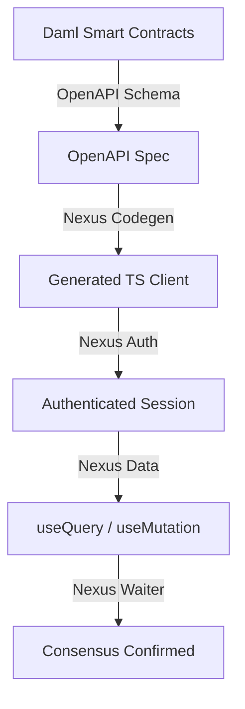

## Development Fund Proposal

**Author:** Mehmet Kar
**Status:** Draft
**Created:** 2026-02-22
**Project Name:** Nexus Framework (NXFS)

---

## Abstract
This proposal introduces the **Nexus Framework**, a developer experience (DX) powerhouse designed to bridge the chasm between the Canton Ledger and modern web ecosystems (Next.js, React, TanStack). Nexus is a type-safe **ORPC (Object Remote Procedure Call)** layer that transforms Daml Smart Contracts into a seamless, high-performance frontend developer experience.

By automating **Isomorphic Authentication**, **Consensus-Aware State Syncing**, and **Strict Type-Safe API Generation**, Nexus Framework eliminates the repetitive boilerplate and architectural friction that currently hinders the rapid adoption of the Canton Network by mainstream web engineering teams.

---

## Specification

### 1. Objective
The current Canton frontend ecosystem is fragmented, leading to what developers call a significant "Integration Tax." Community research across Daml Discourse, StackOverflow, and GitHub identifies four critical bottlenecks:

1. **Auth & Wallet Chaos:** Developers frequently report that mapping Browser Wallets to Canton Party IDs and managing short-lived JWTs is a "black box" that requires weeks of custom infrastructure work.
2. **Modern React Incompatibility:** The legacy `@daml/react` suite often conflicts with **React 18/19 Concurrent Mode** and the latest **Streaming/Suspense** features, forcing teams to use outdated React versions.
3. **The Next.js SSR Gap:** Current tools are client-side only, leaving no clear path for developers to leverage **Next.js Server Components** or **Server-Side Rendering (SSR)** with the Canton ledger.
4. **API Fragmentation:** Engineers are often forced to juggle between gRPC, JSON API, and dApp API, leading to brittle and complex codebases.

The goal of Nexus Framework is to consolidate these fragmented patterns into a single, high-performance "Standard Library." Nexus moves beyond simple hooks, providing a modular architecture that makes building on Canton as developer-friendly as building a standard Web2 app with tools like Stripe or Twilio, while ensuring **100% compatibility with modern React 19+ and Next.js 15+ standards**.

### 2. Implementation Mechanics

The Nexus Framework architecture is comprised of three core modules designed to work independently or as a unified stack:

#### A. The Type-Safe ORPC Engine
Nexus consumes standard OpenAPI schemas and produces a strictly-typed TypeScript client.
- **Query Options Factory:** Automatically generates `queryOptions` and `queryKey` objects for TanStack Query, enabling deep integration with React query-caching.
- **Semantic Cache Management:** Uses Daml template structures to automatically invalidate related caches upon transaction success.

#### B. Isomorphic Auth & Identity
A headless authentication module that manages Canton-native identity flows.
- **Party ID Resolution:** Maps authenticated user sessions to Canton Party IDs via the Ledger Identity API, enabling seamless multi-party dApp interactions.
- **Secure Session Management:** Handles server-side JWT generation and secure `HttpOnly` cookie-based sessions, enabling SSR compatibility in Next.js.

#### C. Consensus-Aware Sync (Waiters)
Standalone, pluggable modules to observe transaction finality on the ledger.
- **Finality Observers:** Middleware-level observers that wait for ledger consensus before resolving mutation hooks, ensuring a consistent UI state without race conditions.

#### Technical Workflow

### 3. Architectural Alignment
This project directly addresses the **Developer Tooling** priority defined in CIP-0082/CIP-0100. It is a pure "Public Good" that does not alter Daml or Canton consensus rules but dramatically improves the frontend integration experience.

Nexus is architecturally positioned as the **frontend consumption layer** for the Canton ecosystem. It sits on top of any standard OpenAPI schema generated from Daml contracts and delivers type-safe React/Next.js integration without requiring changes to the underlying ledger infrastructure.

### 4. Backward Compatibility
*No backward compatibility impact.*
Nexus is a purely additive frontend SDK. It consumes the existing Canton JSON Ledger API and does not modify any Canton or Daml runtime behavior. Projects using the legacy `@daml/react` hooks can migrate incrementally — Nexus can coexist alongside existing tools during a transition period.

---

## Milestones and Deliverables

### Milestone 1: Core Framework & Isomorphic Auth
- **Estimated Delivery:** 4 Weeks
- **Focus:** Core package architecture, Canton authentication, and ledger connectivity.
- **Deliverables / Value Metrics:**
  - Core `@nexus-framework/core` package published to npm.
  - Canton-native authentication flow with Party ID resolution and JWT session management.
  - Secure `HttpOnly` cookie-based sessions for Next.js SSR compatibility.
  - Basic ledger connectivity (query active contracts, submit commands).
  - Unit and integration test suite with 80%+ coverage.
  - Documentation with quickstart guide and API reference.

### Milestone 2: TanStack Adapter & Async Sync Engine
- **Estimated Delivery:** 3 Weeks
- **Focus:** Type-safe data layer and React/Next.js integration.
- **Deliverables / Value Metrics:**
  - `@nexus-framework/react` package with TanStack Query integration.
  - Codegen engine consuming OpenAPI schemas to produce typed `queryOptions` and `queryKey` factories.
  - Next.js Server Actions integration layer for server-side ledger operations.
  - Automated Daml-template-aware cache invalidation logic.
  - Integration tests against real Daml contracts on Canton Sandbox.

### Milestone 3: Consensus Observers & CLI Tooling
- **Estimated Delivery:** 3 Weeks
- **Focus:** Transaction finality tracking and developer onboarding tools.
- **Deliverables / Value Metrics:**
  - WebSocket-based Finality Waiters that resolve mutation hooks only after ledger consensus.
  - HTTP-polling fallback for environments without WebSocket support.
  - `create-nexus-app` CLI for instant project scaffolding with pre-configured Canton connectivity.
  - Headless UI Status components (transaction pending, confirmed, failed states).
  - End-to-end example dApp demonstrating the complete OpenAPI → Nexus → Production workflow.

---

## Acceptance Criteria
The Tech & Ops Committee will evaluate completion based on:

- Deliverables completed as specified for each milestone.
- **Type Safety:** 100% end-to-end TypeScript safety from Daml Choice to React Hook, verified by compilation with `strict: true`.
- **Auth Speed:** Successful user-to-session conversion in < 2 seconds.
- **Consensus Accuracy:** Transaction mutation resolving only AFTER ledger finality event is captured, demonstrated in integration tests.
- **Next.js 15+ Compatibility:** Successful data fetching within a Server Component using a secure session cookie.
- **Open Source:** All packages released under Apache 2.0 license with comprehensive documentation.
- Documentation and knowledge transfer provided.

---

## Funding

**Total Funding Request:** 450,000 CC

### Payment Breakdown by Milestone
- Milestone 1 (Core Framework & Auth): 150,000 CC upon committee acceptance
- Milestone 2 (TanStack Adapter & Sync Engine): 150,000 CC upon committee acceptance
- Milestone 3 (Consensus Observers & CLI): 150,000 CC upon final release and acceptance

### Volatility Stipulation
If the project duration is **under 6 months**:
Should the project timeline extend beyond 6 months due to Committee-requested scope changes, any remaining milestones must be renegotiated to account for significant USD/CC price volatility.

---

## Co-Marketing
Upon release, the implementing entity will collaborate with the Foundation on:

- A launch announcement: *"Nexus Framework — Build Canton dApps Like Web2 Apps"*
- A technical blog post demonstrating the OpenAPI → Nexus → Production workflow.
- A video walkthrough building a complete dApp from scratch using the Nexus CLI.
- Promotion through the Daml Forum, npm registry, and frontend developer communities.

---

## Motivation
A blockchain network's growth is ultimately bottlenecked by the speed at which frontend teams can build user-facing applications. Currently, non-Daml engineers face significant friction when building UIs for Canton:

1. **No modern React support:** The legacy `@daml/react` library does not support React 18+ Concurrent Mode, Suspense boundaries, or Server Components.
2. **No SSR path:** Server-Side Rendering — a baseline requirement for modern web apps — has no established pattern for Canton.
3. **Manual boilerplate:** Every team independently builds auth flows, state management, and cache invalidation logic.
4. **No consensus-aware UI:** Standard frontend tools resolve on HTTP status codes, not on ledger finality, leading to inconsistent UI states.

By providing Nexus, we give Canton the same caliber of frontend DX that Web2 developers expect from platforms like Firebase, Supabase, or Convex — making Canton the first institutional blockchain with a truly modern frontend SDK.

---

## Rationale
**Why ORPC instead of REST/GraphQL wrappers?**
ORPC (Object Remote Procedure Call) provides end-to-end type safety without schema duplication. Unlike REST wrappers that lose type information at the HTTP boundary, ORPC preserves the full Daml type hierarchy from contract to UI component.

**Why TanStack Query integration?**
TanStack Query is the de facto standard for server state management in React applications (15M+ weekly npm downloads). Native integration eliminates the need for custom caching and state synchronization logic.

**Why consensus-aware waiters?**
Unlike standard databases where a successful write is immediately consistent, Canton transactions require ledger consensus. Nexus's Finality Waiters abstract this complexity, giving developers a familiar `useMutation` → `onSuccess` pattern that only resolves after true finality.

**Why the name "Nexus"?**
A nexus is a connection point linking different systems. Nexus Framework is the connection point between the Canton Ledger and the modern web — linking Daml's type system to React's component model.

**Alternatives considered:**
- *Extending `@daml/react`:* Rejected — the existing library's architecture is incompatible with React 18+ Concurrent Mode and would require a full rewrite.
- *GraphQL layer:* Rejected — adds unnecessary complexity and an additional schema translation step.
- *Generic ORPC tools (tRPC, oRPC):* Rejected — they are "Ledger Blind" and cannot handle consensus-aware state management or Canton-native authentication.

---

## Risks and Mitigations
- **Risk: Canton SDK/API changes in future versions.**
  - *Mitigation:* Version-agnostic adapter layer that isolates Nexus from underlying API changes. Automated CI tests against multiple SDK versions.
- **Risk: JWT token expiration during long user sessions.**
  - *Mitigation:* Automatic silent-refresh middleware that renews tokens before expiry without disrupting user experience.
- **Risk: WebSocket instability in corporate/firewall environments.**
  - *Mitigation:* Secondary HTTP long-polling fallback mechanism that activates automatically when WebSocket connections fail.
- **Risk: OpenAPI schema variations across different generators.**
  - *Mitigation:* Strict adherence to OpenAPI v3.1 specification. Validation test suite covering common schema patterns generated from Daml contracts.

---

## Team and Capabilities
The author is a developer dedicated to contributing to the Canton Network ecosystem. Working within a small, dynamic team, we combine academic perspectives with hands-on experience in modern frontend frameworks (React, Next.js), TypeScript tooling, and Daml smart contracts. Our mission is to make Canton the most developer-friendly institutional blockchain by delivering production-quality open-source tools.

---

## References
- Canton Network Official: [https://www.canton.network/](https://www.canton.network/)
- Daml Ledger API: [https://docs.daml.com/app-dev/ledger-api.html](https://docs.daml.com/app-dev/ledger-api.html)
- Daml JSON API Documentation: [https://docs.daml.com/json-api/index.html](https://docs.daml.com/json-api/index.html)
- TanStack Query: [https://tanstack.com/query/latest](https://tanstack.com/query/latest)
- OpenAPI Specification: [https://www.openapis.org/](https://www.openapis.org/)
- oRPC Framework: [https://orpc.unnoq.com/](https://orpc.unnoq.com/)

---

## Trademark Disclaimer
"Daml" and "Canton" are registered trademarks of Digital Asset Holdings, LLC. This proposal and the Nexus Framework project are independent open-source contributions to the Canton ecosystem. The Nexus Framework brand and package names are original works and do not imply sponsorship or endorsement by Digital Asset. All references to Daml and Canton are used in a purely descriptive capacity to indicate compatibility.
