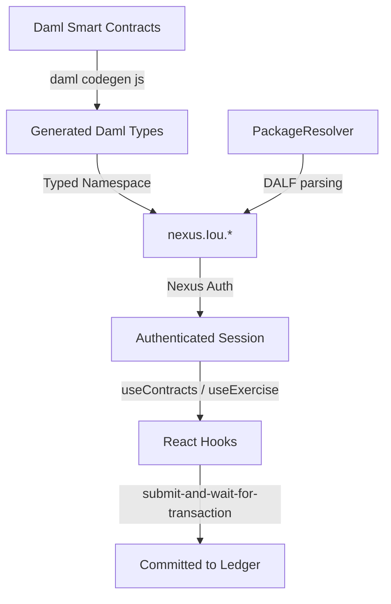

## Development Fund Proposal

**Author:** Mehmet Kar
**Status:** Draft
**Created:** 2026-02-22
**Project Name:** Nexus Framework (NXFS)
**Public Repository:** https://github.com/mehmetkr-31/nexus

---

## Abstract
This proposal introduces the **Nexus Framework**, a type-safe, isomorphic TypeScript SDK that turns Daml smart contracts into a first-class React 18/19 and Next.js 15+ developer experience. Nexus is the missing layer between the raw Canton JSON Ledger API and the modern web frontend stack — purely additive, Apache 2.0, and built on top of the existing stable Canton interfaces.

By delivering **Typed Daml Namespaces**, **Isomorphic Authentication with AES-256-GCM sessions**, **Canton command deduplication handling**, and **automatic Package ID resolution**, Nexus eliminates the repetitive boilerplate and architectural friction that currently hinders the rapid adoption of the Canton Network by mainstream web engineering teams.

**Implementation is already underway and fully public:** https://github.com/mehmetkr-31/nexus

---

## Specification

### 1. Objective
The current Canton frontend ecosystem is fragmented, leading to what developers call a significant "Integration Tax." Community research across Daml Discourse, StackOverflow, and GitHub identifies four critical bottlenecks:

1. **Auth & Wallet Chaos:** Developers frequently report that mapping Browser Wallets to Canton Party IDs and managing short-lived JWTs is a "black box" that requires weeks of custom infrastructure work. [[1]](https://forum.canton.network/t/required-jwt-authorization-for-filters_by_party-of-active-contracts/8371) [[2]](https://forum.canton.network/t/jwt-auth-questions/2525)
2. **Modern React Incompatibility:** The legacy `@daml/react` suite has documented stability issues including a confirmed WebSocket reconnection bug in `useStreamQueries` (described by maintainers as "an experimental feature enabled by default with flaky behavior"), and does not support React 18/19 Concurrent Mode or Streaming/Suspense. [[3]](https://forum.canton.network/t/react-hook-websockets-failing-on-unmount-preventing-future-reconnects/4186)
3. **The Next.js SSR Gap:** Current tools are client-side only, leaving no clear path for developers to leverage **Next.js Server Components** or **Server-Side Rendering (SSR)** with the Canton ledger.
4. **API Fragmentation:** Engineers are forced to navigate gRPC, JSON API, and dApp API simultaneously. The Canton developer survey notes that "Package ID discovery for JSON API is opaque, forcing teams to build custom discovery mechanisms and caching layers for basic contract interactions." [[4]](https://forum.canton.network/t/canton-network-developer-experience-and-tooling-survey-analysis-2026/8412)

The goal of Nexus Framework is to consolidate these fragmented patterns into a single, high-performance "Standard Library." Nexus moves beyond simple hooks, providing a modular architecture that makes building on Canton as developer-friendly as building a standard Web2 app with tools like Stripe or Twilio, while ensuring **full compatibility with React 18/19 and Next.js 15+ standards**.

### 2. Evidence of Ecosystem Demand

The Canton Network Developer Experience & Tooling Survey (2026) — conducted with **41 active builders** between January and February 2026 — provides direct, data-driven validation for every problem Nexus addresses:

- **"Typed SDKs & language bindings"** ranked among the most requested missing tools, confirming the demand for a type-safe client layer.
- **"Standardized wallet adapter / MetaMask equivalent"** was identified as a top missing primitive, directly validating Nexus's Isomorphic Auth module.
- **"JWT authentication middleware implementation challenges"** was listed as a specific, recurring gap that every team currently solves independently.
- **71% of Canton developers come from an Ethereum background**, where tools like wagmi, viem, and ethers.js set the standard for type-safe, framework-native SDK DX. These developers expect the same level of tooling maturity from Canton.
- **80% of active builders joined within the last 12 months**, indicating a rapidly expanding ecosystem where a modern SDK will have immediate, broad impact.

> *"Developers are currently forced to be 'Infrastructure Engineers' before they can be 'Product Builders'."*
> — Canton Network Developer Experience Survey, 2026 [[4]](https://forum.canton.network/t/canton-network-developer-experience-and-tooling-survey-analysis-2026/8412)

Nexus directly addresses the top-ranked friction points in this survey. It is not a speculative tool; it resolves documented, recurring pain points reported by the active builder community.

**Additional technical evidence from community forums:**

- **React version lock-in:** The official `create-daml-app` scaffold pins projects to **React 16** — three major versions behind the current React 19. Developers attempting to upgrade immediately encounter irreconcilable peer dependency conflicts with `@daml/react`. [[5]](https://forum.canton.network/t/cannot-find-module-react-or-its-corresponding-type-declarations/2930)
- **Security vulnerabilities in official tooling:** Running `npm install` on the current `create-daml-app` template surfaces **75 vulnerabilities (42 high, 4 critical)** that cannot be resolved with `npm audit fix --force`. Developers are required to **downgrade npm from v9 to v8.6.0** to get the official template running at all. [[6]](https://forum.canton.network/t/error-while-loading-create-damp-app-on-firefox-npm-vulnerabilities-not-fixing-with-audit-force-fix/5945)
- **WebSocket memory leak in `@daml/react`:** The `useStreamQueries` hook does not clean up WebSocket connections on component unmount. Connections accumulate silently until the application crashes — one developer reported failure at **500 open connections**. The library exposes no API to close streams, forcing teams to use server-side timeouts as a workaround. [[7]](https://forum.canton.network/t/can-i-explicitly-release-websocket-connections-used-in-the-daml-react-bindings/5297)
- **Party ID resolution complexity:** Obtaining a stable Party ID for JWT generation requires a multi-step process: creating a party through the participant node → mapping to a stable username → generating an access token. There is no automated resolution layer; every team builds this flow independently. [[8]](https://forum.canton.network/t/party-ids-in-canton/4664)

These are not edge cases — they are the baseline experience for any team attempting to build a modern frontend on Canton today.

### 3. Implementation Mechanics

The Nexus Framework architecture is comprised of four focused packages designed to work independently or as a unified stack. All packages are already scaffolded and partially implemented in the public monorepo at https://github.com/mehmetkr-31/nexus.

#### A. Typed Daml Namespaces — The Killer Feature
Nexus consumes the standard `daml codegen js` output directly — no additional codegen step, no OpenAPI translation, no post-processing. From your Daml types, Nexus produces strongly-typed namespaces that make contract interaction feel like calling a local function.

```ts
// Before (generic hooks)
const { data } = useContracts("my-pkg:Iou:Iou");
await mutate({ templateId: "my-pkg:Iou:Iou", choice: "Transfer", argument: {...} });

// After (typed namespace)
const { data } = nexus.Iou.useContracts();
await nexus.Iou.Transfer.mutate({ newOwner: "alice" });
```

- **`PackageResolver`:** Automatically parses DALF bytecode from the ledger to resolve short template names (`"my-pkg:Iou:Iou"`) to full Package IDs. No manual caching layers. Package upgrades do not silently break queries.
- **TanStack Query Integration:** Generates structured `queryOptions` and `queryKey` factories natively — reusable on both client and server for prefetch + hydration, eliminating the "write it twice" tax.
- **Template-Aware Cache Invalidation:** Uses Daml template relationships to automatically invalidate related caches upon transaction success.

#### B. Isomorphic Auth & Identity
A headless authentication module that manages Canton-native identity flows and works identically on Node, Bun, browsers, and edge runtimes. This is the single component that eliminates the largest "Integration Tax" line item for Canton frontend teams today.

- **`PartyIdResolver`:** Maps authenticated users to Canton Party IDs via the participant's user management API (`GET /v2/users/{user-id}` and `/v2/users/{user-id}/rights`), with a 5-minute in-memory cache. Enables seamless multi-party dApp interactions without each team building their own lookup layer.
- **`SessionManager` (AES-256-GCM):** Stateless, tamper-evident session cookies using the Web Crypto `AES-256-GCM` primitive directly. Fully compatible with Next.js Server Components, Server Actions, and edge runtimes that implement the Web Crypto API.
- **`JwtManager`:** Automatic JWT lifecycle with a **10-second expiry grace period**, deduplicated refresh, and transparent stream reconnection via `updateToken()` — eliminating the memory-leak class of bugs in `@daml/react`.
- **Plugin-based auth providers:** `sandboxAuth` (local dev), `jwtAuth` (static/refreshable), `oidcAuth` (production OIDC + JWKS signature, issuer and audience verification). All share a single plugin contract — swapping from local sandbox auth to production OIDC is a one-line config change, no call sites are touched.
- **JWT Proxy Route Handler:** Built-in B2B pattern that safely proxies ledger calls through server-side route handlers without exposing credentials to the browser.

#### C. Finality-Aware Mutations & Command Deduplication
Standalone, pluggable modules that track transaction completion on the ledger and handle Canton's command deduplication semantics correctly.

- **Finality-Aware Mutations:** Nexus mutations use Canton's `POST /v2/commands/submit-and-wait-for-transaction` endpoint, which returns only **after** the update is committed to the ledger. This eliminates the race condition where a UI flips to "success" on HTTP 200 before the transaction is actually recorded. For long-running commands, an optional `/v2/updates` tailing helper is provided to verify commit offsets post-hoc.
- **Idempotent Deduplication Handling:** Nexus recognises Canton's two deduplication error classes and handles them **idempotently** — not as blind successes:
  - **`DUPLICATE_COMMAND` (HTTP 409):** The original submission is within the deduplication window. Nexus looks up the original command's outcome (via the `completionOffset` / `updateId` returned in the error payload) rather than re-submitting, so the final UI state reflects the true ledger outcome (success *or* rejection).
  - **`SUBMISSION_ALREADY_IN_FLIGHT` (HTTP 425):** A single retry with a fresh `submissionId`, with exponential backoff.

  This transforms two of Canton's most common silent footguns into a transparent, correct mutation lifecycle.

#### D. Typed Participant Query Store (PQS) Integration
Nexus ships first-class PQS support for fast, SQL-based reads against Canton's Participant Query Store as a built-in plugin inside `@nexus-framework/core`.

- **`pqsDatabasePlugin`:** Type-safe SQL access using Kysely + `pg` (node-postgres), exposed as a standard Nexus plugin. Plugs into the `createNexusServer` factory alongside the HTTP ledger client, so the same typed namespaces can resolve reads from PQS transparently when the plugin is enabled.
- **Canonical PQS API usage:** Nexus consolidates all PQS reads on the documented, stable **`active()` table function** from Canton's PQS schema, ensuring forward compatibility across Canton releases.
- **Row-Level Security (RLS) integration:** PQS reads are automatically scoped to the authenticated party, so multi-tenant dApps cannot accidentally leak contracts across parties.
- **Typed namespace integration:** `nexus.Iou.findMany({ where: { owner: partyId } })` reads from PQS when the plugin is installed, with the same typed payload inference as the HTTP client path.

#### E. Framework-Agnostic Server Runtimes
Nexus is deliberately **not** Next.js-only. The `createNexusServer` factory, the `JwtManager`, and the `NexusAuthPlugin` contract are pure TypeScript with zero framework dependencies — they read a standard `Request` and return a response, so they work inside any HTTP runtime. Nexus exposes this at **two layers**, both already implemented in the public repo:

- **Layer 1 — Request-scoped client (works everywhere today).** `createNexusServer` returns a `nexus` object with a `forRequest(req: Request)` method that takes any standard `Request` and returns a fully authenticated, per-party typed client. Because `forRequest` only needs a `Request`, it works **unchanged** inside Next.js Route Handlers, `Bun.serve({ routes })` handlers, TanStack Start `createServerFn`, Cloudflare Workers, Deno, or any Web-standard runtime. This is the universal entry point — no framework-specific adapter is required.
- **Layer 2 — Framework adapters (thin shims over Layer 1).**
  - **Next.js:** `createNexusServer` + `withLedgerAction()` (Server Actions) + `createLedgerRouteHandler()` (route handlers). Fully wired to `cookies()` and `revalidatePath()`. Gives RSCs a request-scoped, per-party authenticated client in one line.
  - **TanStack Start:** `createTanStackLedgerContext(nexus)` wraps `nexus.forRequest(request)` for use inside `createServerFn().handler(...)`.
  - **Hono:** `createHonoLedgerMiddleware()` and `createHonoLedgerRoutes()` ship a **transparent Canton proxy** — mount on a catch-all route (e.g. `/api/ledger/*`) and the middleware extracts the user's JWT from the encrypted session cookie, forwards the request to the Canton JSON API under an allowlisted path prefix, and streams the response back. Ideal for lightweight BFF layers on Cloudflare Workers, Deno, or Bun.

For Express, Fastify, and raw Node HTTP, teams use Layer 1 directly — `nexus.forRequest(req)` inside any middleware returns the authenticated client. Dedicated Express and Fastify adapters are shipped in Milestone 3 for one-line ergonomics.

The key design insight is that **the auth plugins are the integration surface**. Because `sandboxAuth`, `jwtAuth`, and `oidcAuth` all implement a single `NexusAuthPlugin` contract, and because every adapter funnels through `forRequest`, a custom adapter for any runtime automatically inherits JWT lifecycle, grace-period refresh, stream token rotation, and Party ID caching for free. **Write the auth config once, run it on any server.**

#### Runtime Requirements
Nexus is isomorphic across all modern JavaScript runtimes that implement the Web Crypto API: **Node.js 18+**, **Bun**, modern browsers, and edge runtimes (Vercel Edge, Cloudflare Workers). `SessionManager` uses Web Crypto `AES-256-GCM` directly and does not rely on any Node-specific crypto module.

#### Technical Workflow

```mermaid
graph TD
    Daml[Daml Smart Contracts] -->|daml codegen js| TS[Generated Daml Types]
    TS -->|Typed Namespace| NX[nexus.Iou.*]
    PR[PackageResolver] -->|DALF parsing| NX
    NX -->|Nexus Auth| Auth[Authenticated Session]
    Auth -->|useContracts / useExercise| UI[React Hooks]
    UI -->|submit-and-wait-for-transaction| CM[Committed to Ledger]
```

### 4. Architectural Alignment & Differentiation

This project directly addresses the **Developer Tooling** priority defined in CIP-0082/CIP-0100. It is a pure "Public Good" that does not alter Daml or Canton consensus rules but dramatically improves the frontend integration experience.

Nexus is architecturally positioned as the **frontend consumption layer** for the Canton ecosystem. It sits on top of the standard Daml codegen output and consumes the Canton JSON Ledger API as a stable transport — no changes to the underlying ledger infrastructure are required.

**Positioning relative to existing tools:**

| Tool | Scope | Nexus Relationship |
|---|---|---|
| `@daml/react` | Client-side React hooks, no SSR, known WebSocket instability, React 16 lock-in | Nexus replaces this layer with React 18/19 + SSR-compatible hooks |
| `daml codegen js` | Daml → TypeScript type generator | Nexus **consumes** this output as its single source of truth — no overlap, no fork |
| Canton JSON Ledger API | HTTP transport layer | Nexus consumes this — no overlap |
| Canton gRPC Ledger API | Low-level transport layer | Out of scope for Nexus (frontend-focused) |
| PQS (Participant Query Store) | SQL read replica | Nexus provides a first-class `pqsDatabasePlugin` built on Kysely + `pg`, querying the documented `active()` table function with RLS scoping |
| Wallet SDKs | Wallet connection & signing | Nexus's Auth module sits above wallet SDKs, consuming their output |
| TanStack Query | Client-side state management | Nexus generates native TanStack `queryOptions` — complements, not competes |

Nexus does not duplicate or replace any existing infrastructure. It is the missing layer between Daml codegen output and modern frontend applications. No existing tool addresses SSR compatibility, typed namespaces over `daml codegen js`, automatic Package ID resolution, or finality-aware state management for React applications.

**On coordination:** Because Nexus is purely additive and sits above existing transport layers, no direct coordination with current SDK maintainers is required to avoid overlap. Nexus consumes the Canton JSON Ledger API and `daml codegen js` as stable interfaces — it does not fork, patch, or compete with them. Should Digital Asset or the community ship an updated `@daml/react` in the future, Nexus can coexist alongside it or adapt its internals transparently. Nexus is open source from day one at https://github.com/mehmetkr-31/nexus, and we actively invite review and contribution from any existing Canton tooling maintainers who wish to collaborate.

### 5. Backward Compatibility
*No backward compatibility impact.*
Nexus is a purely additive frontend SDK. It consumes the existing Canton JSON Ledger API and does not modify any Canton or Daml runtime behavior. Projects using the legacy `@daml/react` hooks can migrate incrementally — Nexus can coexist alongside existing tools during a transition period.

---

## Milestones and Deliverables

> **Note on scope vs timeline:** Much of the surface area described in Milestones 1 and 2 is already scaffolded in the public repository at https://github.com/mehmetkr-31/nexus. The per-milestone week estimates cover **completion, hardening, integration testing, documentation, and npm publication** — not greenfield implementation. This is why the delivery timelines are realistic despite the broad technical scope.

### Milestone 1: Core Framework & Isomorphic Auth *(Minimal Viable Deliverable)*
- **Estimated Delivery:** 4 Weeks
- **Focus:** This milestone defines the minimal, self-contained core of Nexus. All subsequent milestones build on top of it. The committee can evaluate functional completeness at this stage independently.
- **Deliverables / Value Metrics:**
  - `@nexus-framework/core` package published to npm.
  - `CantonClient` — isomorphic HTTP client for the Canton JSON Ledger API v2 (Node, Bun, browser, edge).
  - `PackageResolver` — automatic DALF bytecode parsing for Package ID resolution.
  - `PartyIdResolver` — one-call Party ID resolution via `/v2/users/{user-id}` with 5-minute caching.
  - `SessionManager` — AES-256-GCM cookie-based sessions via Web Crypto, SSR-compatible.
  - `JwtManager` — automatic JWT lifecycle with 10-second grace period and deduplicated refresh.
  - Auth plugins: `sandboxAuth`, `jwtAuth`, `oidcAuth` (OIDC + JWKS signature / issuer / audience verification).
  - Basic ledger connectivity: query active contracts, exercise choices, submit commands.
  - Canton deduplication handling (409 idempotent lookup / 425 retry) built into command submission.
  - Unit and integration test suite with 80%+ coverage, enforced in CI.
  - Documentation with quickstart guide and API reference.

> **Milestone 1 stands alone as the reusable infrastructure foundation.** The typed React hooks, PQS integration, and CLI tooling are additive layers built in Milestones 2–3. If scope were ever reduced, Milestone 1 output remains independently useful to the ecosystem — any Node, Bun, or edge project can use `@nexus-framework/core` directly.

### Milestone 2: React Integration, PQS & Framework Adapters
- **Estimated Delivery:** 3 Weeks
- **Focus:** Typed React hooks, Next.js SSR adapters, Participant Query Store clients, and Hono / TanStack Start runtime adapters. *Much of this surface is already scaffolded in the repo; the 3-week scope covers completion, integration testing, and documentation.*
- **Deliverables / Value Metrics:**
  - `@nexus-framework/react` package with `createNexusClient`, typed namespaces, and TanStack Query integration.
  - **Typed Daml Namespaces:** `nexus.Iou.useContracts()` / `nexus.Iou.Transfer.mutate()` — full type inference from `daml codegen js` output with zero manual `templateId` strings.
  - `createNexusServer` — unified server factory with a universal `forRequest(req: Request)` entry point, plus framework adapters for Next.js Server Components / Server Actions, TanStack Start (`createTanStackLedgerContext`), and Hono (`createHonoLedgerMiddleware` / `createHonoLedgerRoutes` — transparent Canton proxy with session-cookie auth). `Bun.serve({ routes })` is supported natively via `forRequest`, no adapter needed.
  - `streamingPlugin` — WebSocket subscription lifecycle with `updateToken()` for seamless JWT rotation on long-lived streams (fixing the `@daml/react` memory leak class).
  - `identityPlugin` and `optimisticUiPlugin`.
  - `pqsDatabasePlugin` — built-in PQS integration inside `@nexus-framework/core`, built on Kysely + `pg`, querying Canton's documented `active()` table function with automatic Row-Level Security scoping per authenticated party.
  - Integration tests against real Daml contracts on Canton Sandbox.

### Milestone 3: Finality Waiters, CLI & End-to-End Example
- **Estimated Delivery:** 3 Weeks
- **Focus:** Finality-aware mutation helpers, remaining Node-ecosystem adapters, developer onboarding tools, and a complete reference application.
- **Deliverables / Value Metrics:**
  - Finality-aware mutation helpers built on `submit-and-wait-for-transaction` semantics, plus an optional `/v2/updates` tailing helper for post-hoc commit verification.
  - **Automatic HTTP-polling fallback** for PQS and contract queries when WebSocket streams are unavailable (firewalled environments, edge runtimes).
  - **Express and Fastify adapters** (`createExpressLedgerMiddleware`, `nexusFastifyPlugin`) — thin shims over `nexus.forRequest(req)` completing mainstream Node ecosystem coverage alongside Next.js, TanStack Start, Hono, and `Bun.serve`.
  - Headless UI status components (transaction pending, confirmed, failed states).
  - `create-nexus-app` CLI (`@nexus-framework/cli`) for instant project scaffolding with pre-configured Canton connectivity.
  - End-to-end example dApp demonstrating the complete Daml → Nexus → Next.js 15 Production workflow.
  - Full public documentation site.

---

## Acceptance Criteria
The Tech & Ops Committee will evaluate completion based on:

- Deliverables completed as specified for each milestone.
- **Type Safety:** End-to-end TypeScript safety from Daml Choice to React Hook, verified by compilation with `strict: true` against real Daml contracts.
- **Auth Speed:** Successful user-to-session conversion in < 2 seconds.
- **Finality Correctness:** Mutation hooks resolve only AFTER the transaction is committed to the ledger (verified via `submit-and-wait-for-transaction` responses and `/v2/updates` offset checks), demonstrated in integration tests.
- **Deduplication Correctness:** `DUPLICATE_COMMAND` (409) is resolved to the original command's actual outcome via `completionOffset`/`updateId` lookup (not blindly treated as success); `SUBMISSION_ALREADY_IN_FLIGHT` (425) is retried idempotently with a fresh `submissionId`. Both paths are verified in integration tests, including the negative case where the original command was rejected.
- **Next.js 15+ Compatibility:** Successful data fetching within a Server Component using a secure AES-256-GCM session cookie.
- **React 18 & 19 Compatibility:** Verified against both major React versions.
- **Open Source:** All packages released under Apache 2.0 license with comprehensive documentation.
- Documentation and knowledge transfer provided.

### Adoption Success Metrics

Success will be measured by organic ecosystem adoption after release, tracked over 90 days post-launch:

| Metric | Target |
|---|---|
| npm weekly downloads | 500+ / week |
| GitHub stars | 200+ |
| Community-reported integrations | 2+ projects referencing Nexus on Canton/Daml forums |
| GitHub issues filed by external contributors | 5+ (indicates real-world usage) |

These metrics are independent of any single organization and reflect genuine ecosystem adoption. They will be reported to the committee in a post-release update.

---

## Funding

**Total Funding Request:** 450,000 CC

### Payment Breakdown by Milestone
- Milestone 1 (Core Framework & Auth): 150,000 CC upon committee acceptance
- Milestone 2 (React Integration, PQS & Framework Adapters): 150,000 CC upon committee acceptance
- Milestone 3 (Finality Waiters, CLI & E2E Example): 150,000 CC upon final release and acceptance

### Volatility Stipulation
If the project duration is **under 6 months**:
Should the project timeline extend beyond 6 months due to Committee-requested scope changes, any remaining milestones must be renegotiated to account for significant USD/CC price volatility.

---

## Co-Marketing
Upon release, the implementing entity will collaborate with the Foundation on:

- A launch announcement: *"Nexus Framework — Build Canton dApps Like Modern Web Apps"*
- A technical blog post demonstrating the Daml → Nexus → Next.js 15 production workflow.
- A video walkthrough building a complete dApp from scratch using the Nexus CLI.
- Promotion through the Daml Forum, npm registry, and frontend developer communities.

---

## Motivation
A blockchain network's growth is ultimately bottlenecked by the speed at which frontend teams can build user-facing applications. Currently, non-Daml engineers face significant friction when building UIs for Canton:

1. **No modern React support:** The legacy `@daml/react` library does not support React 18+ Concurrent Mode, Suspense boundaries, or Server Components.
2. **No SSR path:** Server-Side Rendering — a baseline requirement for modern web apps — has no established pattern for Canton.
3. **Manual boilerplate:** Every team independently builds auth flows, Package ID resolution, state management, and cache invalidation logic.
4. **No finality-aware UI:** Standard frontend tools resolve on HTTP status codes, not on ledger commit events, leading to inconsistent UI states where the button flips to "success" before the transaction is actually recorded.
5. **Silent deduplication footguns:** Canton's `DUPLICATE_COMMAND` and `SUBMISSION_ALREADY_IN_FLIGHT` errors are easy to misinterpret, causing real transactions to appear as failures in the UI.

By providing Nexus, we give Canton the same caliber of frontend DX that Web2 developers expect from platforms like Firebase, Supabase, or Convex — making Canton the first institutional blockchain with a truly modern frontend SDK.

---

## Rationale
**Why typed namespaces instead of generic hooks?**
Typed namespaces (`nexus.Iou.useContracts()`) eliminate the single largest class of frontend bugs on Canton: typo'd `templateId` strings and stale Package IDs. Full inference from `daml codegen js` output means the type system, not runtime logs, catches integration errors.

**Why consume `daml codegen js` directly instead of an additional OpenAPI layer?**
`daml codegen js` is the official, stable, first-party type generator from Digital Asset. Introducing an OpenAPI intermediate layer would duplicate work, risk type drift, and break on Daml feature changes. By consuming the canonical codegen output, Nexus stays aligned with Daml's evolution automatically.

**Why TanStack Query integration?**
TanStack Query is the de facto standard for server state management in React applications (15M+ weekly npm downloads). Native integration eliminates the need for custom caching and state synchronization logic.

**Why `submit-and-wait-for-transaction` semantics instead of resolving on HTTP 200?**
Canton's `POST /v2/commands/submit-and-wait` returns HTTP 200 as soon as the command is accepted, not when it is committed. Mutations that resolve on this create UI race conditions. By defaulting to `submit-and-wait-for-transaction`, Nexus gives developers a familiar `useMutation` → `onSuccess` pattern that reflects the **actual** committed ledger state.

**Why look up `DUPLICATE_COMMAND` outcomes instead of treating them as success?**
A `DUPLICATE_COMMAND` (HTTP 409) response only tells us the command hit Canton's deduplication window — it does **not** tell us whether the original submission was committed or rejected. Blindly treating it as success would silently surface false-positive UI states for rejected commands. Nexus therefore uses the `completionOffset`/`updateId` returned in the error to look up the real outcome before resolving the mutation.

**Why AES-256-GCM sessions (not just HttpOnly)?**
HttpOnly cookies alone are insufficient for multi-tenant dApps that store Party IDs and JWT refresh material. AES-256-GCM via Web Crypto provides stateless, tamper-evident sessions that work identically on Node, Bun, and edge runtimes without any Node-specific crypto module.

**Why the name "Nexus"?**
A nexus is a connection point linking different systems. Nexus Framework is the connection point between the Canton Ledger and the modern web — linking Daml's type system to React's component model.

**Alternatives considered:**
- *Extending `@daml/react`:* Rejected — the existing library's architecture is incompatible with React 18+ Concurrent Mode and would require a full rewrite.
- *GraphQL layer:* Rejected — adds unnecessary complexity and an additional schema translation step.
- *Generic RPC tools (tRPC, oRPC):* Rejected — they are "Ledger Blind" and cannot handle Package ID resolution, Canton command deduplication, or Canton-native authentication.
- *Additional OpenAPI codegen intermediate:* Rejected — introduces type drift risk vs. consuming `daml codegen js` directly.

---

## Risks and Mitigations
- **Risk: Canton SDK/API changes in future versions.**
  - *Mitigation:* Version-agnostic adapter layer that isolates Nexus from underlying API changes. Automated CI tests against multiple SDK versions.
- **Risk: JWT token expiration during long user sessions.**
  - *Mitigation:* `JwtManager` with 10-second grace period, deduplicated refresh, and transparent stream reconnection via `updateToken()`.
- **Risk: WebSocket instability in corporate/firewall environments.**
  - *Mitigation:* HTTP-polling fallback for contract queries and PQS reads (shipped in Milestone 3), activated when WebSocket streams are unavailable.
- **Risk: Daml package upgrades silently breaking queries.**
  - *Mitigation:* `PackageResolver` parses DALF bytecode at runtime, always resolving short template names against the current ledger state.
- **Risk: Misinterpreting `DUPLICATE_COMMAND` as success.**
  - *Mitigation:* Nexus looks up the original command's actual outcome via `completionOffset`/`updateId` before resolving the mutation, never assuming success.

---

## Team and Capabilities
The author is a developer dedicated to contributing to the Canton Network ecosystem. Working within a small, dynamic team, we combine academic perspectives with hands-on experience in modern frontend frameworks (React, Next.js), TypeScript tooling, and Daml smart contracts. Our mission is to make Canton the most developer-friendly institutional blockchain by delivering production-quality open-source tools.

**Nexus is not being built in isolation, and it is not a promise on paper.** Implementation is already well underway and the monorepo is fully public:

**https://github.com/mehmetkr-31/nexus**

The reviewers are explicitly invited to inspect the code, open issues, or suggest changes directly on the repository. Every line is there to audit. An active Canton-based project — currently in development — has committed to adopting Nexus as its primary frontend integration layer, ensuring Milestone 1 will be validated against a real production use case before public release. We are actively reaching out to additional teams in the Canton builder community to expand early adopter coverage ahead of the public launch.

---

## References
- Canton Network Official: [https://www.canton.network/](https://www.canton.network/)
- Nexus Framework Repository: [https://github.com/mehmetkr-31/nexus](https://github.com/mehmetkr-31/nexus)
- Canton JSON Ledger API v2 (OpenAPI): [https://docs.digitalasset.com/build/3.4/reference/json-api/openapi.html](https://docs.digitalasset.com/build/3.4/reference/json-api/openapi.html)
- Canton JSON Ledger API v2 (AsyncAPI): [https://docs.digitalasset.com/build/3.4/reference/json-api/asyncapi.html](https://docs.digitalasset.com/build/3.4/reference/json-api/asyncapi.html)
- Participant Query Store: [https://docs.digitalasset.com/build/3.4/sdlc-howtos/applications/develop/pqs/index.html](https://docs.digitalasset.com/build/3.4/sdlc-howtos/applications/develop/pqs/index.html)
- `daml codegen js`: [https://docs.daml.com/app-dev/bindings-ts/codegen.html](https://docs.daml.com/app-dev/bindings-ts/codegen.html)
- TanStack Query: [https://tanstack.com/query/latest](https://tanstack.com/query/latest)
- Kysely (type-safe SQL): [https://kysely.dev/](https://kysely.dev/)

**Community Evidence:**
- [1] [Required JWT authorization for filters_by_party — Canton Network Forum](https://forum.canton.network/t/required-jwt-authorization-for-filters_by_party-of-active-contracts/8371)
- [2] [JWT auth questions — Daml Developers Community](https://forum.canton.network/t/jwt-auth-questions/2525)
- [3] [React hook WebSockets failing on unmount preventing future reconnects — Canton Forum](https://forum.canton.network/t/react-hook-websockets-failing-on-unmount-preventing-future-reconnects/4186)
- [4] [Canton Network Developer Experience & Tooling Survey Analysis (2026)](https://forum.canton.network/t/canton-network-developer-experience-and-tooling-survey-analysis-2026/8412)
- [5] [Cannot find module 'react' — create-daml-app React 16 lock-in](https://forum.canton.network/t/cannot-find-module-react-or-its-corresponding-type-declarations/2930)
- [6] [create-daml-app npm vulnerabilities & npm v9 incompatibility](https://forum.canton.network/t/error-while-loading-create-damp-app-on-firefox-npm-vulnerabilities-not-fixing-with-audit-force-fix/5945)
- [7] [WebSocket memory leak in @daml/react — 500 open connections](https://forum.canton.network/t/can-i-explicitly-release-websocket-connections-used-in-the-daml-react-bindings/5297)
- [8] [Party IDs in Canton — multi-step resolution complexity](https://forum.canton.network/t/party-ids-in-canton/4664)

---

## Trademark Disclaimer
"Daml" and "Canton" are registered trademarks of Digital Asset Holdings, LLC. This proposal and the Nexus Framework project are independent open-source contributions to the Canton ecosystem. The Nexus Framework brand and package names are original works and do not imply sponsorship or endorsement by Digital Asset. All references to Daml and Canton are used in a purely descriptive capacity to indicate compatibility.
