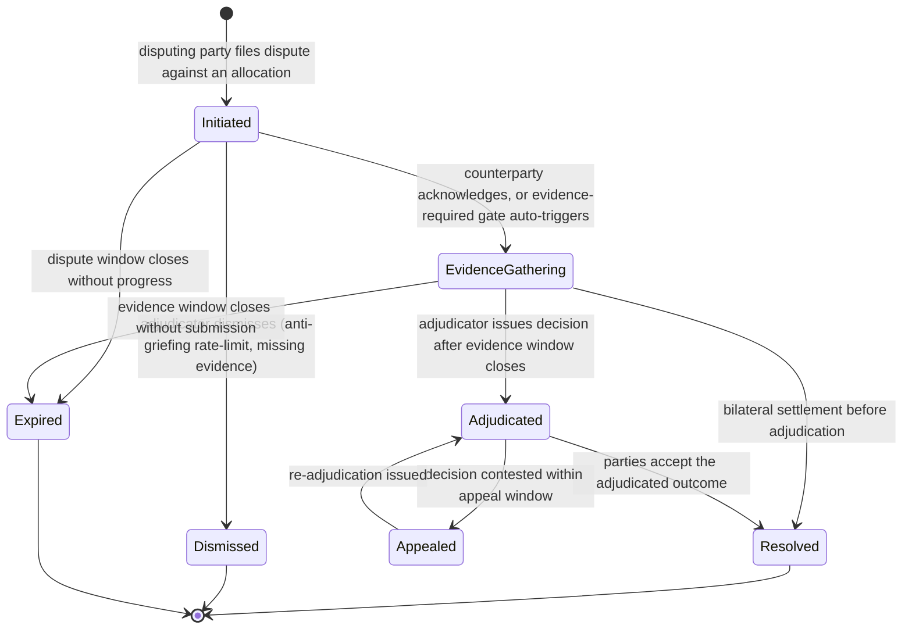

# Development Fund Proposal

## Payment Dispute & Refund Authorization Primitive

| Field | Value |
| :---- | :---- |
| Author | Sam Davies, Avro Digital |
| Status | Submitted |
| Created | 2026-04-23 |
| Label | `financial-workflows-composability` |
| Champion | Avro Digital |
| SIG Feedback and Coordination | In progress via the `financial-workflows-composability` and `dapp-integration` SIG channels. First-priority feedback candidates per the Foundation SIG roster are Charles Desmonty (Kaiko), Anthony Merriman (Modulo Labs), and Jack Charlesworth (LayerZero). If those candidates decline, second-ask candidates are surfaced via the Foundation Slack `#financial-workflows-composability` channel and the dApp-Integration SIG's monthly call. |

---

## Abstract

Avro Digital requests 3,000,000 Canton Coin (CC) to design, implement, and release an open-source payment dispute and refund authorization primitive for the Canton Network.

Mature payment networks (card networks, ACH, wires, RTP) all provide standardized dispute, chargeback, and reversal mechanics. Canton's published primitive set, enumerated in §5, contains no equivalent. Every payment application on the network either builds an ad-hoc dispute layer, defers the problem until it surfaces as a production incident, or scopes itself to flows where disputes don't apply. Each path imposes cost on the application developer and creates fragmentation for wallets and custodians that would prefer to integrate against a single shape.

The work organizes into four workstreams: (A) dispute initiation and state machine; (B) time-locked reversal windows; (C) adjudication and resolution patterns; (D) integration documentation and test harness.

The "refund authorization" framing matters. The primitive ships the on-ledger reversal-eligibility, dispute lifecycle, and resolution-authorization layer: the time-locked window patterns, the dispute state machine, and the immutable `DisputeResolutionReceipt` that authorizes a downstream refund. Actual fund movement (the off-ledger operator→customer CC transfer) is the integrating application's responsibility, since execution is gated on `TransferPreapproval` mechanics and product-side templates the primitive does not own. This mirrors Splice itself, where `TransferPreapproval` is an authorization primitive and execution lives in `AmuletRules`.

[Avro Pay](https://www.avrofi.com/pay) is the committed reference integration. Compatibility notes for PR #78 (x402) are provided as a complementary pattern, not a downstream commitment. Broader merchant and wallet integrations are positioned as follow-on work outside this grant.

The proposal does not replace CIP-0056, introduce a competing wallet pattern, or ship a proprietary payment network. It fills a gap every consumer-facing or merchant-facing regulated payment application on Canton currently has to solve on its own.

---

## Specification

### 1. Objective

Deliver an open-source payment dispute and refund authorization primitive for the Canton Network, usable by payment applications, wallets, and custodians.

The project includes:

- Dispute initiation and state-machine reference implementation
- Configurable time-locked reversal windows aligned with common payment-network conventions
- Adjudication and resolution patterns for bilateral, third-party-arbitrated, and regulator-mediated cases
- Integration documentation and test harness covering representative payment flows
- Apache 2.0 licensing for all deliverables, released to a public Avro Digital repository

The four pieces compose into a single end-to-end primitive: the state machine without time-locked windows cannot enforce reversal eligibility; reversal windows without adjudication patterns cannot resolve contested cases; neither is adoptable without the integration harness. The workstreams are not separately fundable; the milestone structure decomposes the work for review and payment, with the M1+M2 Daml-package surface adoptable by any Canton payment application independent of M3's reference-integration timing.

Non-goals:

- A proprietary payment network or closed-source dispute service
- Replacement or modification of CIP-0056 interface semantics
- Jurisdiction-specific legal determinations (the reference implementation provides patterns that legal and compliance teams parameterize)
- Identity, KYC, or compliance hooks beyond those required for dispute routing
- Automated fraud detection or scoring

### 2. Implementation Mechanics

The implementation is organized into four workstreams.

**Workstream A: Dispute Initiation and State Machine**

The on-ledger flow that structures a payment dispute from initiation through resolution.

- Daml templates representing a dispute lifecycle with explicit states. The primary set is `Initiated`, `EvidenceGathering`, `Adjudicated`, `Resolved`, `Expired`. The full set in Appendix A also includes `Dismissed` (anti-griefing) and `Appealed` (contested re-adjudication).
- Transition workflows for each state change, with controllers matching the role involved (disputing party, counterparty, adjudicator).
- Evidence-reference patterns. The on-ledger contract carries content-addressed pointers (CAS keys, hash-of-blob) plus access-control metadata. Raw evidentiary blobs live off-ledger in a storage backend chosen by the integrator (S3 with CAS keys, IPFS-style content-addressed storage, or an integrator-hosted service). The Avro Pay reference uses an S3-compatible object store. Evidence is modeled as separate `EvidenceRecord` contracts referenced from the dispute, not as mutations of the dispute state-machine contract. This lets the evidence-observer set be narrower than the dispute-observer set on `OperatorMediatedDispute` and `ArbitratedDispute` (supporting pre-notification investigation), and avoids contention on the dispute contract when multiple parties submit evidence in parallel.
- Consistent event-log emission for downstream accounting and reporting.
- Disputes target *completed payment artifacts*: a CIP-0056 completed allocation, or an immutable settlement-receipt where applications ship one. Avro Pay's `SettlementReceipt` is the reference example, the operator+customer-signed audit record left on-ledger after `ConfirmSettlement`. The primitive does not modify or reopen the underlying allocation; it composes a new dispute contract that references it.
- Cross-participant disputes are supported. When the disputing party and counterparty live on different participants, the dispute contract is signed by both (or held by a routing adjudicator visible to both) and the deployment routes the dispute on `global-domain`. The synchronizer-routing rule and a cross-participant test scenario are documented in M1's architecture document and validated in the test harness.

**Workstream B: Time-Locked Reversal Windows**

Configurable reversal patterns aligned with common payment-network conventions. A card-like flow may permit 60–120-day reversal; an RTP-like flow may permit reversal only within the hour; an ACH-like flow sits between. Rather than prescribing a single window, the reference provides a composable pattern.

- Daml templates with configurable duration, eligible-initiator patterns, and reversal-funding sources.
- Pre-authorized reversal patterns where counterparties opt into a reversal window at payment time.
- Conditional reversal patterns where eligibility depends on documented conditions (delivery confirmation, service completion attestation, regulatory holding period).
- Automatic window-expiry releasing funds after a window closes without dispute.
- Interaction patterns with CIP-0056 transfer preapprovals so reversal mechanics compose with existing preapproval flows.

**Workstream C: Adjudication and Resolution Patterns**

Reference patterns for resolving disputes across the common counterparty configurations.

- Bilateral resolution between disputing party and counterparty.
- Third-party-arbitrated resolution for disputes routed to a neutral arbitrator (payment-network operator, marketplace operator, standards body).
- Regulator-mediated resolution using CIP-0056's identity-aware design. The regulator is a Daml party assigned by the integrator. Jurisdictions and authority models are the integrator's responsibility; the reference patterns document role mechanics, not legal authority.
- Partial-resolution patterns supporting split-decision outcomes (partial refund, partial fulfillment).
- Appeal and re-adjudication patterns for contested initial adjudications.

The adjudicator role is parametric per integration via a Daml interface. The dispute primitive defines `IPaymentDispute` carrying the common lifecycle choices (`initiate`, `acknowledge`, `submitEvidence`, `adjudicate`, `acceptOutcome`, `settle` for bilateral pre-adjudication, `appeal`, `dismiss`, `expire`) plus a common view. Concrete templates implement the interface per controller-shape:

- `OperatorMediatedDispute` with dual-auth `controller operator, admin`
- `BilateralDispute` with joint `controller disputingParty, counterparty`
- `ArbitratedDispute` with single `controller arbitrator`

`RegulatorMediatedDispute` (single `controller regulator`) ships as a parametric Daml-test fixture, mirroring the marketplace-mediation precedent. Concrete-template promotion is deferred to follow-on adopter-driven work, with the controller signature specified in M1's architecture document so the fixture can be promoted without interface breakage.

A single template parameterized by an `adjudicator : Party` field cannot express dual-auth controllers because Daml's `controller` clause is fixed at template-definition time and cannot be conditional on field values. The interface pattern is the standard Daml mechanism for this polymorphism. Per-shape default fills are in Appendix C.

**Workstream D: Integration Documentation and Test Harness**

The primitive is only useful if payment applications can adopt it without re-engineering.

- Integration guide for adopting the primitive in existing payment applications.
- Reference integration with Avro Pay covering two staging workflows: merchant refund (operator-mediated reversal of a completed `SettlementReceipt`) and buyer chargeback (customer-initiated post-settlement dispute against a completed `SettlementReceipt`).
- Compatibility-notes pattern for PR #78 (x402) showing how the primitive could compose with a machine-to-machine payment context. This is a complementary reference, not a committed downstream adoption.
- Test-harness scenarios covering consumer-to-merchant, merchant-to-merchant, machine-to-machine, and a parametric multi-party scenario. The marketplace-mediation pattern ships as a parametric Daml-test fixture rather than a staging integration, because Avro Pay's v0 product is two-party (customer↔provider).
- Cross-participant integration test in which the disputing party and counterparty are on different participants, validating the `global-domain` routing path and contract-visibility model.
- Operator-observability hooks. The integration guide documents how application operators surface dispute events: PQS subscription patterns (recommended for real-time), webhook delivery, the dispute-event-log schema, and dashboard wiring patterns. UI is out of scope; adopters wire events into their own operator console.
- Documentation and scenarios for each resolution pattern (bilateral, arbitrated, regulator-mediated, partial, appealed).

### 3. Architectural Alignment

This proposal anchors to two of the Canton Foundation's Q2 ecosystem priorities: **App Building & Developer Experience** (a primitive every payment application can reuse rather than rebuild) and **Security & Resilience** (anti-griefing patterns, evidence-privacy patterns, and adjudication state-machine semantics).

It is aligned with existing Canton payment infrastructure in four ways:

- It composes with CIP-0056 rather than replacing it. Dispute templates reference allocations and transfer instructions from CIP-0056 without modifying the interface surface. Applications already implementing CIP-0056 adopt the primitive as additional templates.
- It composes with CIP-0103 external signing and CIP-0056 transfer preapprovals. Disputing a payment that used a preapproval remains compatible with the preapproval's controller and expiry model.
- It complements PR #78 (x402). x402 addresses machine-to-machine payments; this proposal addresses the dispute primitive that any payment layer, including x402, will need.
- The dispute state machine follows Canton's identity-aware design: every role (disputing party, counterparty, adjudicator, regulator) is a known Daml party, and controllers are explicit in the template signatures.

### 4. Backward Compatibility

- Existing payment applications on Canton, including Amulet's wallet payment flows, continue to function unchanged. The dispute primitive is a new Daml template set, not a modification.
- CIP-0056 is consumed as-is. No interface changes required.
- Time-locked reversal windows are opt-in at payment time. Payments that do not adopt a window continue to operate as irrevocable transfers at commit time.
- Adjudication patterns are modular. Applications adopt only the patterns relevant to their use case.
- The primitive is designed to layer on top of CIP-0056 v2 (DA grant PR #97, merged 2026-04-23) without re-implementation. v2 emphasizes execution reliability ("settlement should be near-guaranteed to go through") and does not specify dispute, reversal, or chargeback mechanics, so the primitive composes on either v1 or v2.

### 5. Existing Ecosystem Fit

This proposal extends rather than replaces existing Canton payment infrastructure. The matrix below makes the relationship explicit, since the Tech & Ops Committee asks "what existing component does this extend? why can't it?" of every infrastructure proposal:

| Component | Relationship | Why this primitive cannot live there |
| :---- | :---- | :---- |
| CIP-0056 v1 (Token Standard) | Extends, no interface change | CIP-0056 specifies the token-allocation interface; dispute mechanics are out of scope by design and would expand the standard's surface area |
| CIP-0056 v2 (DA grant, merged) | Compatibility-only; no shared scope | DA's v2 grant (PR #97, merged 2026-04-23) targets execution-reliability semantics on the existing interface and does not specify dispute, reversal, or chargeback mechanics |
| CIP-0103 (External Signing) | Composes | CIP-0103 is the signing channel; disputes are state-machine semantics layered above |
| CIP-0104 (Traffic-Based App Rewards) | Out of scope; documented interaction | Disputes generate ledger transactions which earn the operator app rewards. The integration guide documents this and recommends mitigations (rate-limiting at initiation, evidence-required gating, anti-griefing dismissal) without prescribing economic policy |
| Splice (Amulet / Wallet UI / Validator) | Consumes Splice as-is | Splice is the runtime; dispute Daml packages distribute as standard DARs |
| PQS (Participant Query Store) | Consumes existing event-stream conventions | Dispute event logs use the same shape as ordinary allocation events |
| DPM (Daml Package Management) | Consumes existing DAR upload workflow | No DPM extension proposed |
| Avro Pay (committed reference integration) | Composes; reference integration | Dispute templates reference Avro Pay's existing immutable `SettlementReceipt` (operator+customer signed, provider observer) as the dispute target. Avro Pay's existing `ReverseSettlement` choice operates on the in-flight `PendingSettlement` only; once `ConfirmSettlement` archives that contract and creates the receipt, the customer has no on-ledger reversal path. That gap is what this primitive fills |
| PR #78 (x402) | Complementary, optional adoption | x402 addresses machine-to-machine payments; we document the compatibility pattern without committing in either direction |
| PR #186 (Canton Native Yield Token / CC20) | Composable, no dependency in either direction | New yield-bearing token primitive; the dispute primitive applies regardless |
| PR #73 (Institutional Undercollateralized Credit) | Composable, no dependency in either direction | New credit-instrument primitive; dispute and reversal patterns apply at the payment layer regardless of underlying instrument |

There is no existing Canton primitive providing the dispute, time-locked-reversal, or adjudication state-machine surface. Building it inside any one application would fragment the ecosystem.

---

## Assumptions

If any of these break materially, Avro will surface it in the next quarterly committee report and propose a scope adjustment.

- CIP-0056 v1 remains the canonical token interface during this grant. CIP-0056 v2 (DA grant PR #97), if it lands during the project, is folded into M3 as a compatibility-validation step, not a re-implementation. v2 emphasizes execution reliability and does not specify dispute mechanics.
- Avro Pay's product team has committed to the reference-integration deliverable as part of its existing roadmap; Avro Pay engineering is not separately funded by this grant. The deliverable targets Avro Pay's `SettlementReceipt` contract. Avro Pay's existing in-flight reversal mechanism (`ReverseSettlement` on `PendingSettlement`) does not cover post-confirmation disputes. M3 staging coverage is scoped to the `SettlementReceipt` flow only; the M1 architecture document specifies the dispute primitive's target-reference field as a sum type (`SettlementReceipt | ReversalReceipt | FailedSettlement`) so post-grant adopters can extend coverage without on-ledger contract changes. Provider-initiated disputes against `ReversalReceipt` and customer disputes against `FailedSettlement` ship as parametric Daml-test scenarios in the public test harness, not as Avro Pay staging integrations.
- Refund execution is a two-phase saga, not glue work. The dispute primitive emits an immutable `DisputeResolutionReceipt` (operator + customer signatories, provider observer) recording the resolution decision, refund amount, and off-ledger CC-transfer reference. The Avro Pay reference integration ships its own `PendingRefund` template (mirroring `PendingSettlement`'s retry/expire/confirm shape) on the application side, funded by Avro Pay's product roadmap and out of grant scope. The integration guide specifies the recommended `PendingRefund` template signature so adopters implement it consistently across applications. The guide documents three failure-mode handles: (a) on-ledger resolve succeeds, off-ledger CC transfer fails — `PendingRefund` retry, with integrator-defined retry-expiry triggering operator-side escalation; (b) customer's `TransferPreapproval` expired between initiation and resolution (Splice's recommended TTL is 90 days per [`docs/TRANSFER_PREAPPROVAL.md`](../../TRANSFER_PREAPPROVAL.md), and card-like 60–120 day windows can exceed that) — integrator-prompted wallet refresh at dispute initiation, with `DisputeResolutionReceipt` still emitted on-ledger and `PendingRefund` retrying off-ledger until the customer refreshes the preapproval or retry-expiry triggers escalation; (c) operator→customer cross-participant routing requires Validator API plumbing not present in v0's operator→provider direction. The integration guide documents the new TransferPreapproval shape; Validator API implementation is on the validator-operator roadmap and out of scope.
- The Avro Pay reference integration runs on `global-domain` because `PaymentAuthorization`, `SettlementReceipt`, and the dispute templates carry external-party signatories (customer and provider can be wallet parties on participants other than the operator's). The synchronizer-routing rule generalizes: any dispute whose informees include an external party must route on `global-domain`. Canton's runtime rejection on a misrouted submission is `UNKNOWN_INFORMEES`. Adopters with fully internal topologies can deploy on a private synchronizer; the integration guide documents how to choose.
- The default adjudicator role for Avro Pay is the operator party with admin co-signature, mirroring Avro Pay's existing dual-auth pattern for `ReverseSettlement`. The role is parametric per integration; Avro is not the central adjudicator across the network.
- The default evidence-storage backend is an S3-compatible object store with content-addressed keys, paid by the integrator. The integration guide documents alternative backends (IPFS-style CAS, regulator-escrow) so adopters with different data-protection regimes can substitute.
- DA's architectural review is captured as a published artifact at each milestone: written acknowledgement (no-objection or commented-with-resolution) on the M1 architecture document and the M3 integration guide, both posted to the canton-dev-fund proposal thread. No DA consulting line item is requested because the primitive composes with existing CIPs without proposing changes.
- The dApp-Integration and Wallet-Apps SIGs remain reachable via Foundation Slack for design-partner sourcing through the project window.
- No deliverable depends on a CIP merge or upstream Splice merge. All artifacts ship in a public Avro Digital repository under Apache 2.0. If the Tech & Ops Committee or Splice maintainers determine during review that these primitives belong in Splice itself, Avro will land the same Daml package set, test harness, and integration guide in the Splice repository instead. Implementation, license, and acceptance criteria are unchanged; only the distribution location moves.
- Avro Pay's staging environment remains reachable for the M3 demo. If unavailable, an equivalent ephemeral environment is provisioned to demonstrate the same flows.
- No acceptance criterion depends on operator→customer Validator API plumbing landing within the project window. The committed M3 demo terminates at on-ledger `DisputeResolutionReceipt` creation. Validator API plumbing is an integrator deployment requirement for the downstream fund-movement step (out of scope), tracking the validator-operator roadmap independently.
- Marketplace multi-party flows are delivered as a parametric Daml-test fixture so the primitive ships independent of any integrator's product-roadmap timing. The marketplace pattern is structurally a superset of two-party adjudication with an added party graph; the fixture validates the controller-set composition that downstream marketplace integrators will instantiate.

---

## Milestones and Deliverables

### Milestone 1: Dispute State Machine and Time-Locked Reversal Windows

- **Estimated Delivery:** Month 1–2
- **Focus:** the core on-ledger primitives that underpin all later adjudication and integration work
- **Deliverables:**
  - Architecture document covering all four workstreams, the scope boundary with existing payment infrastructure, off-ledger evidence privacy considerations, and the design-correctness commitments listed below.
  - Anti-Griefing Pattern Guide as a named deliverable. See dedicated subsection below.
  - Dispute state-machine Daml templates (Workstream A) released as an open-source package.
  - Time-Locked Reversal Windows Daml templates (Workstream B) released as an open-source package.
  - Test harness validating the dispute lifecycle and reversal patterns against representative scenarios, including transfer-preapproval composition scenarios.
  - Initial integration guide covering how applications layer the primitive on top of CIP-0056.
- **Demo trigger:** A scripted Daml-test scenario in the public Avro Digital repository executes one full dispute lifecycle (initiated → evidence-gathering → adjudicated → resolved), one expiry path, one anti-griefing dismissal scenario referencing the Anti-Griefing Pattern Guide, and three reversal-window profiles (card-like, ACH-like, RTP-like), all passing the published assertions. Artifact: tagged `v0.1` release of the dispute and reversal-window Daml packages, the architecture document, the Anti-Griefing Pattern Guide, and a recorded walkthrough of the test run.

#### Design-correctness commitments resolved in M1

The M1 architecture document resolves each item below with a concrete Daml shape:

1. Appeal-depth hard cap. Template-field `maxAppeals : Int` with `ensure`-clause enforcement, preventing unbounded appeal griefing.
2. `RefundExpired` terminal state on `DisputeResolutionReceipt` (configurable timeout) for the case where the customer's `TransferPreapproval` is expired or cancelled and the off-ledger refund cannot be delivered. Eliminates zombie `PendingRefund` accumulation.
3. DAR upgrade strategy. Interface-based migration via `IPaymentDispute`, factory/snapshot pattern for shared adjudicator-policy contracts, and Daml's package-preference mechanism for in-flight disputes when a fix ships.
4. Priority/mutex with Avro Pay's existing `ReverseSettlement` choice. Documented disjoint state spaces (in-flight `PendingSettlement` reversal vs post-`ConfirmSettlement` dispute) eliminate the double-refund failure mode.
5. Snapshot/factory pattern for shared `AdjudicatorConfig`/`DisputePolicy`. Disputes carry the policy snapshot at creation as an immutable template field rather than fetching by CID at exercise time, eliminating the "policy update invalidates in-flight disputes" failure mode.
6. On-ledger rate-limit `ensure`-clause backstop on the initiation choice, complementing the off-chain API-layer rate limit so direct Ledger API submitters cannot bypass it. The contention/granularity trade-off (per-party-per-window counter granularity) is resolved in the architecture document.
7. `EvidenceGathering → Dismissed` transition added alongside the existing `Initiated → Dismissed`, controlled by the adjudicator, for summary dismissal of evidence-stage disputes that don't warrant full adjudication.
8. Late-informee and party-migration guards. Any choice that adds a new party (observer, controller, or signatory) to an in-flight dispute must validate that the new party's participant is connected to the dispute's synchronizer before exercising; otherwise the choice succeeds at submission but fails at consensus with `UNKNOWN_INFORMEES`. The architecture document specifies the connectivity-precheck pattern and the choice signatures that need it (e.g., regulator-as-late-observer in regulator-mediated escalation paths). Disputes routed on `private-sync` (Avro-internal-only deployments) are unsafe if any party might migrate to an external participant during the dispute lifecycle, since `private-sync` is not reachable from external participants.
9. Evidence-reference operational soundness. The M1 architecture document and integration guide require: (a) no synchronous HTTP/S3 fetches inside Daml choice bodies, since in-choice fetches introduce non-deterministic validation that fails across participants; (b) on-ledger access-control metadata uses opaque party IDs (no human-readable names) and `EvidenceRecord` observer sets are scoped narrowly to prevent identity leakage.

#### Anti-Griefing Pattern Guide

Recommendations split by enforcement layer:

*On-chain primitives.* Evidence-required gating in the initiation choice's preconditions; an adjudicator-side `dismiss` choice with persisted reason; an on-chain `ensure`-clause rate-limit backstop on the initiation choice.

*Off-chain integrator-implemented controls.* Per-party-per-window rate-limiting at the submission bot; optional CC-deposit forfeit-on-dismissal as an opt-in deterrent.

The off-chain bot is the convenience layer (fast feedback, no contention bottleneck on the happy path). The on-chain `ensure` clause is the backstop that prevents bypass via direct Ledger API submission, with per-party-per-window counter granularity to keep contention bounded. The guide quantifies the CIP-0104 reward delta a griefing actor would face against the operator-side cost of processing the dispute lifecycle, so integrators can size their thresholds against the actual incentive.

### Milestone 2: Adjudication and Resolution Patterns

- **Estimated Delivery:** Month 3–4
- **Focus:** the full set of resolution patterns and preparation for application-level integration
- **Deliverables:**
  - Adjudication and Resolution Patterns (Workstream C) released as an open-source package.
  - Bilateral, third-party-arbitrated, regulator-mediated, partial-resolution, and appealed patterns implemented and validated.
  - Test harness covering each resolution pattern.
  - Pattern-selection guidance for application developers.
  - Avro pursues at least one named third-party design partner via the dApp-Integration or Wallet-Apps SIG. Acceptance is a design review memo from a named design partner that (a) maps the partner's existing payment-application surface to this primitive, (b) identifies specific gaps between the partner's workflow and the reference integration, and (c) commits a named harness scenario landing in this proposal's M2 test harness exercising the partner's workflow shape. If outreach concludes without this depth of engagement by M2 acceptance, the design-partner sub-deliverable is deferred and 100,000 CC of the M2 payment is withheld pending substitute outcome at M3 (alternative design partner sourced via continued SIG outreach, or the substitute reference integration against the xCC settlement flow per the External-dependency carve-out).
- **Demo trigger:** Five named scenarios in the public test harness pass end-to-end (bilateral, third-party-arbitrated, regulator-mediated, partial-resolution, appealed), each with input fixtures, an expected end-state assertion, and a documented adjudicator role. Artifact: tagged `v0.2` release of the adjudication-pattern Daml package, the pattern-selection guide, and either (a) a design review memo from a named design partner per the M2 deliverable spec, or (b) outreach-status note in the milestone artifact set with 100,000 CC withheld pending design-partner sub-deliverable substitution at M3.

### Milestone 3: Integration Documentation, Test Harness, and Release

- **Estimated Delivery:** Month 5
- **Focus:** ship the full integration suite and validate against Avro Pay
- **Deliverables:**
  - Complete integration guide for adopting the primitive (Workstream D).
  - Reference integration with Avro Pay against two named workflows in staging: merchant refund and buyer chargeback, both targeting Avro Pay's existing `SettlementReceipt` contract.
  - Compatibility-notes pattern documented for machine-to-machine payment flows (applicable to PR #78 x402 if its team chooses to adopt; not a committed downstream adoption).
  - Full test-harness suite covering consumer-to-merchant, merchant-to-merchant, machine-to-machine, a parametric multi-party fixture (marketplace-mediation pattern as a Daml-test scenario, not a staging integration; see Assumptions), and a cross-participant scenario validating `global-domain` routing.
  - Co-marketing release with Canton Foundation: technical blog, case study, developer promotion.
  - Public release of all deliverables under Apache 2.0.
- **Demo trigger:** Avro Pay's staging environment runs one consumer-to-merchant payment to completion, one customer-initiated buyer-chargeback dispute against the resulting `SettlementReceipt` (initiation + evidence + adjudication + on-ledger `DisputeResolutionReceipt` creation), with the customer-side initiator running on a named external wallet party (Loop, Console, or another named-pipeline wallet, with the specific wallet and its participant ID recorded in the M3 artifact set), and one operator-initiated merchant-refund dispute, all recorded end-to-end. The committed M3 demo terminates at on-ledger `DisputeResolutionReceipt` creation. Refund execution (the off-ledger CC transfer, customer headroom restoration, and `PendingRefund` saga) is integrator product-layer responsibility per the title and Assumptions, and is out of scope. Artifact: tagged `v1.0` release of the dispute-primitive packages and integration guide, the recorded staging walkthrough, the published test-harness suite (including cross-participant and parametric multi-party scenarios) with a deterministic Daml-script reproduction of the M3 staging demo flows (checked-in fixture data and a `make` target so a committee reviewer can clone the repository and reproduce the same assertions locally without staging access), and the Foundation co-marketing technical blog.

---

## Acceptance Criteria

Acceptance is evaluated against the artifacts Avro directly controls and the milestone Demo triggers above. Project-specific conditions:

- The dispute state machine passes the full test harness covering initiation, evidence gathering, adjudication, resolution, and expiry paths, with passing-test artifacts published in the open-source repository.
- Time-locked reversal windows are validated for at least three named profiles: card-like (60–120 day window), ACH-like (5 banking-day window), RTP-like (60-minute window). Each has reproducible scenario fixtures.
- Adjudication patterns are validated for bilateral, third-party-arbitrated, regulator-mediated, partial-resolution, and appealed cases, each as a named scenario with assertions on the expected end-state.
- A committee-verifiable staging demo shows one completed CIP-0056 payment in Avro Pay, one customer-initiated buyer-chargeback dispute against the resulting `SettlementReceipt` (initiation + evidence + adjudication + on-ledger `DisputeResolutionReceipt` creation; the off-ledger CC re-credit is demonstrated separately as Avro Pay product-roadmap delivery per Assumptions), and one operator-initiated merchant-refund dispute. Recorded steps and test artifacts are published to the open-source repository, plus a deterministic Daml-script reproduction of the same scenarios (checked-in fixtures + documented `make` target) so a committee reviewer can rerun the dispute lifecycle locally.
- The test harness covers four named payment shapes: consumer-to-merchant, merchant-to-merchant, machine-to-machine (via the x402 compatibility-notes pattern), and marketplace multi-party (parametric fixture). Each has at least one scripted scenario and end-state assertions. The marketplace-multi-party scenario is delivered as a parametric Daml-test fixture rather than a staging integration (see Assumptions).
- The test harness includes a cross-participant scenario in which the disputing party and counterparty are on different participants, validating `global-domain` routing and contract visibility. The M3 staging demo's customer-initiated buyer-chargeback validates this with a real participant topology, with the customer-side initiator running on a named external wallet party (Loop, Console, or another named-pipeline wallet, with its participant ID recorded in the M3 artifact set). This closes the wallet-capability open question that gates the customer-as-on-ledger-dispute-initiator authority innovation.
- All software deliverables released under Apache 2.0 to a public Avro Digital repository.

### External-dependency carve-out

Where milestone completion depends on third-party events (design-partner sign-off, Foundation co-marketing scheduling, Avro Pay's product-roadmap timing), completion is evaluated on Avro delivering submission-ready artifacts and addressing feedback, not on timelines outside Avro's control. Specifically, milestone payments are not gated on (a) third-party design-partner availability beyond the committed Avro Pay reference integration, (b) Foundation co-marketing publication windows, or (c) Avro Pay's internal product-roadmap timing. If Avro Pay's reference integration cannot land in M3 due to product-roadmap changes, Avro substitutes an equivalent reference integration against an alternative downstream Avro adopter (xCC liquid-staking application's settlement flow), demonstrating the same two named workflows against the substitute target with the same committee-verifiable artifact set.

---

## Funding

**Total Funding Request:** 3,000,000 CC

CC is referenced at $0.14 for this proposal (verified at $0.14 spot on 2026-04-29). At that rate, the total request is approximately $420,000 USD equivalent.

For benchmarking against recent comparable Canton Development Fund grants: the daml_package_analyzer reference-implementation grant (PR #130, Certora) requested 2.01M CC over 5 months across 4 milestones; the SV Governance dApp grant (PR #223, Avro Digital) requested 2.5M CC over ~6 months for a comparable Daml + dApp + integration shape. This proposal's 3M CC sits inside that band.

This request reflects:

- Implementation of the dispute state machine (the `IPaymentDispute` interface plus three concrete templates per controller-shape: `OperatorMediatedDispute`, `BilateralDispute`, `ArbitratedDispute`, plus a parametric Daml-test fixture for the `RegulatorMediatedDispute` shape), the standalone `DisputeResolutionReceipt` and `EvidenceRecord` templates, reversal window patterns, adjudication patterns, and integration documentation across four workstreams.
- Test harness covering representative payment flows, including parametric scenarios for the `ReversalReceipt` and `FailedSettlement` target arms.
- Reference integration with Avro Pay.
- Documentation and co-marketing release.

The dispute-template surface decomposes into the `IPaymentDispute` interface and per-controller-shape concrete templates, with standalone `DisputeResolutionReceipt` and `EvidenceRecord`. The decomposition covers polymorphism Daml's `controller` clause cannot express via a single template. M2's test-harness scope was already sized to cover the four adjudication shapes, and the 3M CC budget carries adequate margin for this depth.

The milestone weighting reflects the engineering distribution. M1 (900k) ships the state machine and reversal-window primitives, plus the architecture document and Anti-Griefing Pattern Guide. M2 (1.1M) ships the largest Daml-template surface (the `IPaymentDispute` interface, three concrete adjudication templates, the parametric regulator-mediated fixture, and the standalone `DisputeResolutionReceipt` and `EvidenceRecord`) and pursues the design partner. M3 (1.0M) ships the externally-validated staging integration with Avro Pay, the cross-participant test scenario, the full integration guide, the test-harness extension to the parametric and cross-participant scenarios, and the co-marketing release.

The M2 100,000 CC partial withhold is not the canton-dev-fund norm (landed proposals use atomic milestone payments). It is intended to give the committee a structural hedge on the only milestone whose acceptance depends on third-party engagement Avro does not unilaterally control.

### Payment Breakdown by Milestone

| Milestone | Amount (CC) | ~USD at $0.14 | Trigger |
| :---- | :---- | :---- | :---- |
| 1 — Dispute State Machine + Time-Locked Reversal Windows | 900,000 | ~$126,000 | Tagged `v0.1` Daml-package release, architecture document, Anti-Griefing Pattern Guide, recorded test-harness walkthrough |
| 2 — Adjudication and Resolution Patterns | 1,100,000 | ~$154,000 | Tagged `v0.2` Daml-package release (`IPaymentDispute` interface + three concrete templates + parametric regulator-mediated fixture + standalone `DisputeResolutionReceipt` and `EvidenceRecord`), pattern-selection guide, design review memo from a named design partner per the M2 deliverable spec. If no design partner, 100,000 CC of M2 is withheld and paid at M3 against substitute outcome (alternative design-partner sign-off or substitute-reference-integration validation per the External-dependency carve-out) |
| 3 — Integration Documentation, Test Harness, and Release | 1,000,000 | ~$140,000 | Tagged `v1.0` release, Avro Pay staging demo recorded, full test-harness suite published (including cross-participant scenario and parametric multi-party fixture), Foundation co-marketing technical blog live. Plus any 100,000 CC M2-design-partner withheld amount, released against the substitute-outcome artifact set if applicable |
| Total | 3,000,000 | ~$420,000 | |

### Volatility Stipulation

Project duration is 5 months. Per CIP-0100, projects of 6 months or under are denominated in fixed Canton Coin. Should the timeline extend beyond 6 months due to Committee-requested scope changes, remaining milestones must be renegotiated to account for USD/CC price volatility.

---

## Co-Marketing

Upon release, Avro Digital will collaborate with the Canton Foundation on:

- Announcement coordination at each milestone tag (`v0.1`, `v0.2`, `v1.0`).
- A technical blog at M3 covering the state machine, reversal-window profiles, and the Avro Pay reference integration.
- A case study at M3 on the end-to-end Avro Pay staging demo, targeted at payment application builders, wallets, and custodians.
- A session at a Canton community or partner event during the M3 window.
- Developer ecosystem promotion via the dApp-Integration, Wallet-Apps, and Financial-Workflows-Composability SIGs.

---

## Motivation

Mature payment networks provide dispute, chargeback, and reversal mechanics. Card networks define dispute windows, chargeback reason codes, and arbitration procedures. ACH defines return codes and same-day-reversal rules. Real-time payment systems define fraud-reversal windows and counterparty confirmation patterns. Bank wire systems define MT-message-based recall procedures.

These mechanics are how payment networks maintain operational trust under fraud, operational error, and counterparty failure. A payment network without standardized dispute mechanics either pushes every dispute to out-of-band legal processes, or it does not function at scale.

Canton's published primitive set, enumerated in §5, contains no equivalent. Every payment application on the network faces the same choice:

- Build an ad-hoc dispute layer. Expensive, inconsistent across applications, and fragmenting for wallets and custodians that have to integrate against each one individually.
- Defer disputes until they become a production incident. The application cannot credibly be deployed for regulated payment flows.
- Scope out dispute-requiring flows. Constrains the application to machine-to-machine payments, leaving consumer and merchant use cases unaddressed.

None of these is a satisfactory answer as Canton moves toward broader institutional adoption and application-layer growth.

The work shipped here is a dispute state machine that composes with CIP-0056 allocations; time-locked reversal windows that parametrize to different payment-network conventions; adjudication patterns covering bilateral, arbitrated, and regulator-mediated resolution; and integration documentation that makes adoption straightforward.

The proposal complements PR #78 (x402) rather than competing with it. x402 addresses machine-to-machine; this proposal addresses the dispute primitive any payment layer, including x402, will need if it expands beyond automated flows.

---

## Rationale

The key design choice is a reference primitive rather than a proprietary dispute-resolution service or general-purpose arbitration framework:

- Composable. The primitive consumes CIP-0056 and CIP-0103 patterns as-is; applications adopt without restructuring existing payment flows.
- Open-source. Every template, pattern, test harness, and integration guide lands in a public Avro Digital repository under Apache 2.0. No proprietary dispute service.
- Reviewable. Four workstreams with objectively verifiable acceptance criteria, easier to review and easier to partially deliver if committee priorities shift mid-project.
- Application-developer-centric. Every milestone ships something a payment application, wallet, or custodian can put into staging. No milestone is purely internal.
- Compounding ecosystem value. Wallet teams in the Wallet-Apps SIG and custodians in the dApp-Integration SIG can integrate once against the primitive and serve any payment application that adopts it, rather than re-engineering against each application's bespoke dispute layer.

### Why this is infrastructure, not product work

The deliverable is a Daml package set, a test harness, an integration guide, and a recorded staging demonstration, all published under Apache 2.0.

The grant funds the dispute, time-locked-reversal, and adjudication state-machine primitive plus the documentation. It does not fund Avro Pay product engineering, Avro Pay user-facing UI, a hosted dispute-adjudication service, or any proprietary tooling. Avro Pay is the *reference integration*, the harness against which the primitive is validated end-to-end, not a *funded downstream product* of this grant.

The dispute-primitive Daml package, test harness, and integration guide land in M1 and M2 and are usable by any Canton payment application before the Avro Pay reference integration ships in M3. The primitive is published independent of Avro Pay's integration timeline, and Avro Pay engineering hours required to land the M3 reference integration are paid from Avro's product budget regardless of grant outcome.

---

## Risks and Mitigations

| Risk | Likelihood | Impact | Mitigation |
| :---- | :---- | :---- | :---- |
| Adjudication patterns fail to match real Avro Pay operator workflows (merchant refund, buyer chargeback) | Medium | High | Validate the two named workflows in Avro Pay staging by M3 and publish the workflow matrix in the integration guide. Marketplace mediation ships as a parametric Daml-test fixture, not a staging integration, because Avro Pay v0 is two-party (see Assumptions) |
| Malicious or griefing dispute initiation by a counterparty acting in bad faith inflates operator costs | Medium | Medium | Dispute templates require the disputing party as signatory and emit event-log records at initiation. Reference patterns ship with rate-limit hooks, evidence-required gating, and adjudicator-side dismissal choices documented in M1's Anti-Griefing Pattern Guide |
| Off-ledger evidence pointers leak privacy-sensitive data or violate jurisdictional retention rules | Medium | High | The evidence-reference pattern stores only content-addressed pointers and access-control metadata on-ledger. Raw blobs live off-ledger in an integrator-chosen, integrator-paid backend (default S3-compatible CAS). Retention is parameterized per the integrator's data-protection regime. Privacy considerations are covered in M1's architecture document |
| CIP-0104 traffic-rewards perverse incentive: every dispute lifecycle event generates ledger transactions that earn the operator app rewards under CIP-0104, creating a marginal incentive for the operator to encourage dispute traffic | Low | Medium | M1 ships the Anti-Griefing Pattern Guide with on-chain primitives (evidence-required gating, adjudicator-side `dismiss`, on-chain `ensure`-clause rate-limit backstop) and off-chain integrator controls (per-party-per-window rate-limiting at the submission bot, optional CC-deposit forfeit-on-dismissal). The guide names a baseline rate-limit threshold of N disputes-per-customer-per-30d (specific N committed in the M1 architecture document, calibrated against the empirical CIP-0104 reward delta on Canton mainnet at proposal-acceptance time and the operator-side cost of processing one full dispute lifecycle), so adopters have a verifiable starting point. Application-level economic policy (dispute fees, deposit amounts, threshold tuning) remains application-specific beyond the baseline |
| Cross-participant routing misconfiguration (`UNKNOWN_INFORMEES`) when disputing party and counterparty live on different participants | Medium | Medium | The integration guide documents the synchronizer-routing rule (any external-party informee must route on `global-domain`); the test harness includes an explicit cross-participant scenario; the rule is enforced by an explicit synchronizer-allowlist gate at application startup. Disputes whose target is `FailedSettlement` (which has no provider observer in v0) explicitly inject the provider as a dispute-template observer at initiation if provider visibility is required |
| External adopter beyond Avro Pay does not materialize within the project window | Medium | Medium | Avro Pay is the committed reference integration; in parallel Avro pursues at least one named third-party design partner via the dApp-Integration and Wallet-Apps SIGs by M2; the primitive ships adoption-ready regardless of secondary-adopter status |
| CIP-0056 v2 finalization or other upstream review timing slips during delivery | Medium | Medium | Per the CIP-0056 v2 grant scope (PR #97, merged 2026-04-23), v2's scope is execution-reliability semantics on the existing token-allocation interface; the interface surface is not redefined. This proposal layers above the interface and is therefore composable with v1 or v2 unless the v2 surface changes, in which case Avro publishes a compatibility note and re-grounds in-flight workstreams within the same milestone |
| The primitive is misused as jurisdiction-specific legal dispute-resolution | Low | High | Documentation makes clear that the primitive provides on-ledger state-machine patterns for legal and compliance teams to parameterize, not legal conclusions |
| Adjudicator role is read as Avro centralizing dispute resolution across the network | Medium | Medium | The adjudicator role is parametric per integration (Workstream C, Appendix C). Avro Pay's reference adopts the operator party + admin co-signature as one fill among the documented per-shape defaults (marketplace, bilateral, standards-body, regulator-mediated). The integration guide explicitly disclaims central-adjudication framing. The M2 marketplace-mediation scenario instantiates `OperatorMediatedDispute` with a marketplace-operator party that is not Avro Pay |
| Scope boundary with PR #78 (x402) is unclear to the committee | Low | Medium | Explicit scope distinction documented in M1; compatibility-notes pattern for x402 delivered in M3 as a complementary reference, not a committed integration |
| Time-locked reversal patterns interact unexpectedly with transfer preapprovals | Medium | Medium | Integration patterns validated against CIP-0056 transfer preapproval flows as part of the M1 test harness; explicit preapproval-composition scenarios in the harness |
| A stalled `ResolveDisputeRefund` leaves the customer with a won-but-unfunded claim during the off-ledger Splice transfer window | Medium | High | Workstream B's pre-funded reversal-pool profile (Appendix B) is the structural mitigation. Integrators escrow the reversal obligation before the dispute is filed, eliminating the unfunded-window failure mode. The integration guide documents the operator monitoring SLA, the customer-side `DisputeRefundEscalation` re-open path for chronic-stall cases, and dual-auth admin reconciliation override |
| Operator counterparty-failure during the off-ledger refund window leaves a won dispute with no settled value movement | Low | High | Pre-funded reversal-pool profile collateralises the refund obligation at the dispute-state-machine layer, not at the operator-solvency layer. For integrations not adopting the pre-funded profile, the integration guide documents the off-ledger reconciliation surface and flags operator-counterparty risk as adopter due-diligence |
| DA territorial overlap: dispute-primitive Daml shapes are read as encroaching on CIP-0056 standard surface | Low | Medium | The primitive references CIP-0056 allocations as observation targets only; no CIP-0056 template field, choice signature, or controller set is modified. The M1 architecture document and M3 integration guide are both posted to the canton-dev-fund proposal thread for written DA acknowledgement |
| Avro Pay product-roadmap deprioritisation mid-grant blocks the M3 reference integration | Low | Medium | If Avro Pay's reference integration cannot land in M3 due to product-roadmap changes, Avro substitutes an equivalent reference integration against an alternative Avro adopter (xCC liquid-staking application's settlement flow), demonstrating the same two named workflows against the substitute target. The committee-verifiable artifact set is unchanged |

---

## Team

| Role | Name | Relevant prior work |
| :---- | :---- | :---- |
| Implementation lead | Sam Davies, Avro Digital | Engineering lead at Avro Digital; primary contributor to Avro Pay's payment gateway, metering middleware, and SDKs, the xCC liquid-staking implementation, and DFBA auction infrastructure. |
| Protocol & CIP shepherd | Randy Harrison, CTO, Avro Digital | CTO; CIP authoring and ecosystem coordination on prior Avro grants; responsible for upstream review engagement with DA and the Foundation. |
| Reference-integration lead | Ian Hensel, Head of Product, Avro Digital | Drives the Avro Pay roadmap; member of the Financial-Workflows-Composability and Onchain-Governance-Modeling SIGs; coordinates the staging demo, design-partner outreach, and cross-implementer coordination on adjacent standards (e.g., SV-locking via [hyperledger-labs/splice#4841](https://github.com/hyperledger-labs/splice/issues/4841)). |

Avro Digital's directly relevant shipping work on Canton:

- **Avro Pay**. Production payment gateway with CIP-0056 transfer-preapproval integration, metering middleware (Go and TypeScript SDKs), and the customer/provider dashboards the reference integration builds on.
- **xCC (liquid staking)**. UTXO-pattern token contracts, multi-synchronizer DAR vetting, and the issuer-separation pattern referenced in this proposal's privacy-design choices.
- **SV Governance dApp grant (PR #223)**. Approved; sets Avro's house style for grant proposals.
- **SV-locking cross-implementer coordination**. Avro participates in coordination via [hyperledger-labs/splice#4841](https://github.com/hyperledger-labs/splice/issues/4841), with Ian Hensel leading on Avro's side.

## Ecosystem Reach

The dispute primitive is published as Apache 2.0 Daml packages in M1 and is independently adoptable by any Canton payment application before the Avro Pay reference integration ships in M3. Adopters do not depend on Avro's downstream product roadmap or any of Avro's other in-flight Dev Fund submissions.

Direct beneficiaries in the Q2 2026 ecosystem:

- **Payment applications.** Avro Pay (committed reference integration); other Canton payment applications adopting CIP-0056. The forward-looking adopter set is reflected in canton-dev-fund's current open-proposal queue: at least seven open proposals are payment-adjacent and would compose with this primitive: PR #267 (Privacy-Native NFT Marketplace, consumer-to-merchant), PR #229 (RWA Fund Finance Toolkit, institutional payments), PR #235 (Cantopy yield protocol, yield-distribution disputes), PR #186 (CC20 native yield token), PR #183 (OneSwap DEX, settlement disputes), PR #181 (Performance-linked Asset Finance, RWA settlement), PR #230 (MeterKit metering and reconciliation, complementary tooling). Aggregate Canton-mainnet payment-application count today is small; the open-queue pipeline is the leading indicator and is growing with CIP-0056 adoption.
- **Wallets.** Every wallet adopting CIP-0056 transfer-preapproval already integrates against the surface this primitive composes with; no wallet-side re-engineering is required for adoption.
- **Custodians and operators.** Operational tooling against the primitive's event-log emission is reusable across any payment application that adopts the primitive, eliminating per-application bespoke tooling.

---

## Post-Grant Support

For 90 days after M3 acceptance, Avro Digital will:

- answer reasonable maintainer questions about the primitive, test harness, and integration guide
- fix grant-scope bugs identified by adopters during the 90-day window
- assist design partners with documentation clarifications
- track CIP-0056 v2 alignment and publish a compatibility note if v2 lands during the window

This support window does not include downstream product integrations, operational ownership of any production dispute-resolution service, jurisdiction-specific legal review, or open-ended new-feature development. Continued maintenance beyond 90 days will be evaluated against ecosystem usage and may be the subject of a separate proposal.

---

## Open Source and Licensing

All software deliverables released under Apache 2.0 to a public Avro Digital repository. Documentation, architectural decision records, and integration guides released under the same terms.

---

## Appendix A: Dispute Lifecycle State Machine

The reference state machine for the dispute primitive (Workstream A). Concrete Daml templates and their controllers are finalized in M1's architecture document; the state set and transitions are stable.

Notes:

- Both `→ Resolved` transitions (from `Adjudicated` via `acceptOutcome`, and from `EvidenceGathering` via the bilateral `settle` choice) emit an immutable `DisputeResolutionReceipt`. `→ Dismissed` and `→ Expired` do not.
- Pre-notification investigation is an off-ledger pattern (operator examines `EvidenceRecord` contracts produced before a dispute is filed). `Initiated` already presumes counterparty notification, so the diagram does not include a separate `Investigating` state.
- Per-state expiry deadlines (`Initiated → Expired`, `EvidenceGathering → Expired`) are parameters consumed by a single `expire` choice on `IPaymentDispute`; M1's architecture document defines the per-state semantics.

## Appendix B: Time-Locked Reversal Window Profiles

Three reference profiles validated in M1's test harness:

| Profile | Window Duration | Eligible Initiator | Funding Source | Typical Use |
| :---- | :---- | :---- | :---- | :---- |
| Card-like | 60–120 days (configurable) | Counterparty (recipient) on dispute | Pre-authorized reversal pool or recipient-held funds | Consumer-to-merchant chargebacks |
| ACH-like | 5 banking days | Either party with documented condition | Recipient-held funds | Payroll, bill payment, recurring transfers |
| RTP-like | 60 minutes | Initiator only, fraud-flagged path | Initiator-held funds | Real-time-payment fraud reversal |

(Real-time-payment use case context: bank-rail systems like FedNow, RTP, SEPA Instant Credit Transfer.)

Each profile is delivered as a parameterized Daml template; application teams pick a profile or compose their own using the same primitive.

## Appendix C: Adjudicator Role Mapping

The adjudicator is a Daml party named at template-instantiation time by the integrating application. The primitive does not prescribe an identity; different integration shapes pick different fills.

| Integration Shape | Default Adjudicator Fill | Avro Pay Reference | Notes |
| :---- | :---- | :---- | :---- |
| Two-party payment application (operator-mediated) | Application operator with admin co-signature (dual-auth) | `OperatorMediatedDispute` (default fill: operator + admin co-signature, mirroring Avro Pay's existing `ReverseSettlement` dual-auth) | The most common pattern; the operator is already the trust anchor for settlement |
| Marketplace (multi-party, three-sided) | Marketplace operator party | `OperatorMediatedDispute` (default fill: marketplace-operator party). Parametric Daml-test fixture only on Avro Pay v0 (two-party) | Operator distinct from buyer/seller; suitable for platform-mediated commerce |
| Bilateral (no operator) | Mutually-agreed adjudicator party named at payment time | `BilateralDispute` (integrator-supplied adjudicator). Not in Avro Pay v0 reference | Requires both parties to pre-commit to an arbitrator |
| Standards-body arbitrated | Standards-body party named at integration setup | `ArbitratedDispute` (standards-body party). Not in Avro Pay v0 reference | For consortium-style payment networks |
| Regulator-mediated | Regulator-as-Daml-party (regulator-controlled escalation) | Parametric Daml-test fixture demonstrating the `controller regulator` shape. Concrete-template promotion deferred to follow-on adopter-driven work | Pattern, not legal interpretation; jurisdictions are the integrator's responsibility |

The "default fill" is the integrator-chosen `Party` argument supplied at template-instantiation time within the named concrete template (per Workstream C's interface pattern). It is not a single polymorphic template parameterized by a `Party` field, which Daml's `controller` clause cannot express.

Avro is not a network-wide adjudicator. Where the operator-as-adjudicator pattern is used (the most common case), it inherits whatever trust model the application's operator already carries. Avro Pay's operator already carries the same trust today for `ReverseSettlement` dual-auth on `PendingSettlement`; this primitive extends that to post-`SettlementReceipt` disputes.

## Appendix D: Reference-Integration Mapping (Avro Pay)

Concrete integration touchpoints between the dispute primitive and Avro Pay's existing templates as they would land post-M3. All "proposed" entries are new work that does not exist in Avro Pay v0.3.0; they are listed to make the integration surface concrete, not to claim existing functionality.

| Concept | Avro Pay v0 Anchor | Glue work in the reference integration |
| :---- | :---- | :---- |
| Dispute-target reference | `SettlementReceipt` (operator+customer signatories, provider observer; created by `ConfirmSettlement`; immutable) for the M3 staging integration. M1 specifies the on-ledger target-reference field as a sum type (`SettlementReceipt \| ReversalReceipt \| FailedSettlement`) | `OperatorMediatedDispute` carries a sum-typed `targetRef` field and validates the referenced contract's parties against the dispute's parties at initiation. M3 staging exercises the `SettlementReceipt` arm only |
| Disputing-party identity | `customer` (signatory on `SettlementReceipt` and `FailedSettlement`); `provider` (observer on `SettlementReceipt` and `ReversalReceipt`) | For `SettlementReceipt` and `FailedSettlement` arms the customer becomes the `OperatorMediatedDispute` initiator. Closes the gap where the customer has no on-ledger reversal path post-`ConfirmSettlement` (existing reversal choices `ReverseSettlement` and `ExpireSettlement` are operator-side and apply only to in-flight `PendingSettlement`). For the `ReversalReceipt` arm the provider becomes the initiator (M2 parametric fixture) |
| Counterparty identity | `provider` for customer-initiated disputes; `customer` for provider-initiated disputes | Counterparty becomes a controller on `acknowledge` / `acceptOutcome` choices in the concrete dispute template; per-shape default-fill in Appendix C |
| Adjudicator identity | `operator` party + `admin` co-signature (dual-auth, mirroring the existing `ReverseSettlement` choice on `PendingSettlement`) | `OperatorMediatedDispute` carries `signatory operator, customer` (mirroring Avro Pay's existing `SettlementReceipt`/`PaymentAuthorization` signatory pattern). The `adjudicate` choice is `controller operator, admin`. Choice authority combines controllers (operator + admin) and host-contract signatories (operator + customer), so the choice can authorize creating `DisputeResolutionReceipt` (signatories: operator, customer) |
| Resolution outcome (refund) | Proposed standalone `DisputeResolutionReceipt` (immutable; signatories operator + customer, observer provider; created by the dispute primitive on resolution). Same immutability shape as `SettlementReceipt` itself | The dispute primitive emits an immutable `DisputeResolutionReceipt` recording the resolution decision, the refund amount (sum-typed: full refund, partial refund with explicit `Decimal`, or no refund, supporting Workstream C's partial-resolution patterns), and an off-ledger CC-transfer reference. Headroom re-credit on the customer's active `PaymentAuthorization` is application-level integration glue executed opportunistically (fetch current auth CID; re-credit if active; skip if revoked, replaced, or exhausted). It is NOT a choice on the dispute primitive itself. This decouples the immutable refund record from the mutable authorization state machine: `PaymentAuthorization` changes its CID on every direct consuming choice (`Draw`, `Revoke`, `IncreaseAuthorization`) and on indirect archive-and-recreate side effects of choices on `PendingSettlement` (`ReverseSettlement`, `ExpireSettlement`). By the time a card-like dispute resolves (60–120 days), the original auth CID is long-consumed or archived |
| Synchronizer | `global-domain` (mandatory because Avro Pay's customer/provider can be external wallet parties) | Dispute templates inherit Avro Pay's existing synchronizer-routing rule; no new routing logic |
| Off-ledger evidence storage | Pluggable per integration; the integration guide documents the S3-compatible content-addressed-store pattern as the recommended starting point | The integrator selects and pays for the storage backend. The storage-backend abstraction is documented so adopters can substitute IPFS-style CAS or an integrator-hosted service without on-ledger contract changes |
| CIP-0056 transfer-preapproval composition | Avro Pay's `TransferPreapproval` Leg-2 settlement (operator→provider, the only direction configured in current production) | Refund flows require a new operator→customer transfer. The existing Splice `TransferPreapproval` primitive supports the direction, but the operator's preapproval against the customer's wallet must be established as part of the integration. Composition is a two-phase saga (`DisputeResolutionReceipt` on-ledger + off-ledger CC transfer + `PendingRefund` retry/expire/confirm on the application side). Failure modes documented in the integration guide: on-ledger resolve + transfer fail (retry via `PendingRefund`); customer's `TransferPreapproval` expired between dispute initiation and resolution (Splice's recommended TTL is 90 days per `docs/TRANSFER_PREAPPROVAL.md` and card-like 60–120 day windows can exceed that) — wallet refresh prompt at dispute initiation, with `DisputeResolutionReceipt` still emitted and off-ledger transfer held in `PendingRefund` retry until refresh or operator-side escalation; operator→customer cross-participant routing requires Validator API plumbing not present in current Avro Pay deployments. The integration guide documents the new TransferPreapproval shape; Validator API implementation is on the validator-operator roadmap, out of scope. The guide also documents how the existing `TransferPreapproval_Cancel` choice composes with the reversal-window state machine for pre-authorized reversal pools |
| Alternate target artifacts (`ReversalReceipt`, `FailedSettlement`) | Out of M3 staging scope; covered in M2 test harness | The `targetRef` sum type covers all three terminal artifacts. M2's test harness includes parametric Daml-test scenarios for provider-initiated dispute against an operator-led `ReverseSettlement` (`ReversalReceipt` target) and customer dispute against a `TerminalFailure`-archived path that left the prior `Draw`'s `drawnAmount` increment in place without re-credit (`FailedSettlement` target). The `FailedSettlement` source contract has no provider observer in v0 (`signatory operator, customer`, no observer clause), so a customer-initiated dispute against it cannot reach the provider through source-contract stakeholders. The dispute template explicitly injects the provider as observer if provider visibility is required (the integration guide names this as integrator-supplied glue). M3 staging validates the `SettlementReceipt` flow only; post-grant adopters can extend without on-ledger contract changes |

The dispute lifecycle is on-ledger, but CC value movement on Splice today happens off-ledger via `TransferPreapproval_Send` (the same off-ledger primitive Avro Pay's existing settlement leg uses). A refund therefore decomposes into two coupled events: (a) the on-ledger `DisputeResolutionReceipt` create on `OperatorMediatedDispute.adjudicate`, recording the resolution; (b) an off-ledger operator→customer `TransferPreapproval_Send` issued after the on-ledger choice commits, with a `PendingRefund` saga retrying through transfer-failure modes. This mirrors Avro Pay's existing `Draw → ConfirmSettlement` saga; the dispute primitive does not introduce a new atomicity guarantee at the value-transfer layer. The off-ledger value-movement bridge is a property of CC-on-Splice today, not a deficiency of this primitive.

A stalled `Draw` and a stalled dispute resolution share an operational mechanism (on-ledger choice committed, off-ledger Splice transfer pending, reconciliation surface active), but the customer's exposure differs. A stalled `Draw` happens before the customer has parted with the disputed payment; a stalled refund happens after the customer has both lost the original payment and won an adjudicated dispute. The window between commit and Splice-transfer settlement is therefore a *new* operational concern, not an inheritance from the existing Avro Pay flow. Workstream B's pre-funded reversal-pool profile (Appendix B) is the structural mitigation: integrators that escrow the reversal obligation before the dispute is filed eliminate the unfunded-window-during-stall failure mode. The integration guide documents the operator monitoring SLA, the customer-side `DisputeRefundEscalation` re-open path for chronic stall, and the dual-auth admin reconciliation override.

The `DisputeResolutionReceipt` is the immutable on-ledger anchor. The off-ledger Splice update ID is recorded against it once the transfer settles, giving the customer a tamper-evident reference for the value movement. The new operator→customer `TransferPreapproval_Send` direction is documented in the M3 integration guide as an integrator deployment requirement; the existing `TransferPreapproval` primitive in Splice supports the direction, but the operator's preapproval against the customer's wallet must be established as part of integrator product-layer setup, out of scope here.

The Avro Pay engineering work to land this integration (new choices on `PaymentAuthorization`, dispute-aware reconciliation in the gateway) is on Avro Pay's existing product roadmap and is not funded by this grant. The dispute-primitive Daml package, test harness, and integration guide ship in M1 and M2 and are usable by any Canton payment application before the Avro Pay integration ships in M3. This grant funds the dispute primitive and the integration guide; Avro Pay funds the application-side adoption.
