# Development Fund Proposal

## Hard Domain Migration Platform

| Field | Value |
| :---- | :---- |
| Author | Eric Mann, Sam Davies — Avro Digital |
| Status | Submitted |
| Created | 2026-05-01 |
| Label | `node-deployment-operations` |
| Champion | Avro Digital |

---

## Abstract

Avro Digital requests 12,000,000 Canton Coin (CC) to deliver a production-grade Hard Domain Migration (HDM) platform for the Global Synchronizer, from design through rollout readiness.

Hard Domain Migration is Canton's procedure for upgrading from one synchronizer protocol version to another when the upgrade is breaking. It is an event every Super Validator and validator operator must survive every few months, and today it is a manual, coordinated, lossy operation. CIP-0089 itself names this directly: "Hard synchronizer migrations are a complex and expensive operational procedure to upgrade the protocol version of a synchronizer."

This proposal organizes the work into five tightly scoped workstreams: a Coordination Protocol and Orchestrator; LSU productionization work contributed upstream to Canton and Splice; a Pre-Flight Validation Framework with cryptographic attestation of migration dumps; a History Continuity Layer for cross-migration queryability; and a Developer SDK plus Operator Observability pack. Together these workstreams turn HDM from an ad hoc operator exercise into a more structured, auditable, and recoverable process.

This proposal is intentionally operational. It does **not** attempt to redesign protocol versioning, replace Helm-based deployment, or expand into general-purpose validator operations tooling. Its purpose is to make HDM—the single most operationally impactful recurring event on the Global Synchronizer—supervised, reversible, and survivable.

---

## Specification

### 1. Objective

Deliver a production-grade operational platform for Hard Domain Migration that makes the event supervised, validated, reversible, and observable for every Super Validator and validator operator on the network, and that contributes performance-hardening and validation work toward Canton 3.4's Logical Synchronizer Upgrade (LSU) production-readiness via upstream PRs to the Canton and Splice repositories, in coordination with the Splice maintainers who own the feature.

The project includes:

- An HDM Coordination Protocol and Orchestrator replacing ad-hoc SV coordination with a structured, auditable workflow
- Upstream contributions toward LSU production-readiness (performance hardening, BFT topology-state validation, compatibility matrix) to the Canton and Splice repositories, in coordination with the maintainers who own the feature
- A Pre-Flight Validation Framework with cryptographic attestation of migration dumps
- A History Continuity Layer exposing continuous cross-migration history via Scan API extensions
- A Developer SDK (TypeScript and Go) for HDM-aware dApp development
- An Operator Observability pack (Prometheus exporters, Grafana dashboards, structured event logging)
- Automated rollback flows with operator confirmation and post-migration validation

Explicit non-goals:

- Broader redesign of Canton protocol versioning
- Replacement of existing Helm-based or Docker Compose-based validator deployment
- A general-purpose validator operations platform beyond the HDM lifecycle
- Broader dApp developer tooling beyond HDM-awareness
- Competition with existing wallet or signing stacks (CIP-0103 compatibility is used, not replaced)
- Long-tail analytics or reporting beyond cross-migration historical continuity

These should be treated as follow-on work, not as implied scope within this proposal.

### 2. Implementation Mechanics

The implementation is organized around five tightly scoped workstreams. Each produces an independently useful operator-facing output.

**Workstream A: HDM Coordination Protocol and Orchestrator**

This workstream replaces ad hoc operator coordination with a structured on-ledger protocol and an SV-operated orchestration service.

- On-ledger proposal, vote, and commit flow for HDM events, reusing governance patterns established by PR #223
- Per-SV migration state tracking and recovery handling for partial failures
- Packaged for SV-operated deployment alongside existing SV infrastructure

**Workstream B: LSU Productionization**

LSU is the correct long-term direction for reducing HDM downtime, but it remains preview-only. This workstream contributes targeted hardening, validation, and operator-readiness work upstream, with the Splice maintainers retaining feature ownership and merge authority.

- Performance hardening and compatibility testing for LSU
- Topology-state validation and operator procedures for LSU-based upgrades
- Upstream contribution packages and pull requests against Canton and Splice under Apache 2.0

**Workstream C: Pre-Flight Validation Framework and Migration Integrity**

Splice operators have already encountered HDM failure modes that should be caught before traffic resumes. This workstream adds the validation and attestation layer that closes that gap.

- Pre-flight validation for schema, topology, party-hosting, balance, and dump integrity checks
- Cryptographic attestation so multiple SVs can verify the same migration dump before restore
- Automated gating before traffic resumption

**Workstream D: History Continuity Layer**

This workstream restores continuity across migration boundaries for history queries, reporting, and regulatory reconstruction.

- Scan API extensions for cross-migration historical queries
- Backfill tooling and reference clients for unified history access
- Documentation for continuous-history use cases

**Workstream E: Developer SDK and Operator Observability**

This workstream rounds out the platform with lightweight developer and operator tooling.

- TypeScript and Go SDKs plus an integration guide for HDM-aware clients
- Observability pack covering metrics, dashboards, and structured event logging
- Automated rollback flows integrated into the orchestrator

### 3. Architectural Alignment

This proposal anchors to two of the Canton Foundation's Q2 ecosystem priorities — **Stability & Maintainability** (HDM is the single most operationally impactful recurring event on the Global Synchronizer; making it supervised, validated, and observable directly raises the network's operational floor) and **Security & Resilience** (cryptographic attestation of migration dumps, threshold-verification across SVs, and automated rollback collectively close the failure modes documented in the documented HDM-initialization bug class).

It is aligned with current Canton and Splice architecture in five ways:

- It builds on the existing HDM procedure rather than proposing a parallel path. The coordination protocol, validation framework, and observability layer all augment the current `migration_id`-based model documented in the Splice operator manual and in the most recent published hard-migration runbooks.
- LSU productionization is direct upstream contribution to Canton and Splice. The work lands in `digital-asset/canton` and `hyperledger-labs/splice` under Apache 2.0 rather than in a proprietary fork. This work is positioned explicitly as a bridge until canton-dev-fund PR #76 (Logical Synchronizer Upgrades, merged + approved 2026-04-23) ships its deliverables and matures — once LSU is the routine upgrade path, HDM-with-downtime becomes the exceptional fallback that this platform makes survivable.
- Cryptographic attestation of migration dumps uses the existing CIP-0103-compatible external-signing stack rather than inventing a new primitive.
- Scan API extensions are additive and follow the established pattern used by existing Scan clients; they do not require consumers to adopt a new API surface.
- The coordination protocol's on-ledger vote structure reuses governance patterns from PR #223 (SV Governance dApp grant, in voting), giving the network a consistent governance substrate across both routine and exceptional operational events.

### 4. Backward Compatibility

Backward compatibility is a core design constraint for this project:

- The existing HDM procedure continues to function unchanged if the Coordination Protocol from Workstream A is not adopted. Workstream A is an opt-in layer above the current procedure, not a replacement.
- Migration dump format is preserved. The cryptographic attestation from Workstream C is a sibling artifact, not a format change.
- LSU productionization work is contributed under the feature's existing preview-to-production path. No existing Canton/Splice API is broken.
- Scan API extensions are additive endpoints; existing Scan consumers see no behavioral change.
- The Developer SDK is opt-in; existing dApps that do not consume it continue to operate through the current fail-and-retry pattern across migration boundaries.

### 5. Existing Ecosystem Fit

This proposal extends rather than replaces existing Canton and Splice operational infrastructure. The matrix below makes the relationship explicit, since the Tech & Ops Committee asks "what existing component does this extend? Why can't it?" of every infrastructure proposal:

| Component | Relationship | Why this primitive cannot live there |
| :---- | :---- | :---- |
| **CIP-0089 (Hard Domain Migration)** | Extends; documents the procedure | CIP-0089 names the problem ("a complex and expensive operational procedure") but specifies the migration ID semantics, not the operational platform. The actionable HDM runbook material lives in Splice docs and published hard-migration runbooks; this work ships the platform that automates and supervises that runbook |
| **Splice (Amulet / Wallet UI / Validator)** | Consumes Splice as-is; LSU productionization is upstream contribution | Splice is the runtime; Workstream B's LSU productionization is contributed directly into `hyperledger-labs/splice` under Apache 2.0. The HDM coordination protocol, pre-flight validation framework, and observability pack are SV-operated services that consume Splice-produced migration dumps without modifying Splice's dump format |
| **Canton 3.4 LSU preview** | Productionizes; upstream contribution | LSU is documented as "for testing purposes only and should not be run in production (yet)." Productionization (performance hardening, BFT topology-state validation, compatibility matrix) is multi-quarter engineering with no clear owner today. Workstream B claims that ownership and contributes upstream |
| **canton-dev-fund PR #76 (Logical Synchronizer Upgrades, merged + approved 2026-04-23)** | Bridges-until | Once #76's deliverables ship and LSU matures, LSU is the routine upgrade path and HDM-with-downtime becomes the exceptional fallback. This work is positioned as the platform that makes that exceptional fallback survivable; the LSU-productionization work in Workstream B accelerates the timeline at which #76 becomes routine |
| **CIP-0100 (governance / review process)** | Composes | Coordination-protocol on-ledger votes follow CIP-0100's review-process patterns; the orchestrator does not propose new governance mechanics |
| **CIP-0103 (External Signing)** | Composes | Cryptographic attestation of migration dumps uses CIP-0103's external-signing stack as the signing channel; no new cryptographic primitive is invented |
| **CIP-0104 (Traffic-Based App Rewards)** | Out of scope; documented interaction | The HDM coordination protocol's on-ledger lifecycle (proposal, vote, traffic-pause, dump-attestation, restore-validation, resume) generates ledger transactions that under CIP-0104 generate traffic-based app rewards for the operator participant hosting the orchestrator. The reward surface is small (HDM events are infrequent, every few months) but documented — the integration guide names the surface and recommends not rewarding the orchestrator-hosting party as a network-wide governance norm |
| **PR #223 (SV Governance dApp, Avro)** | Reuses governance patterns | Workstream A's on-ledger vote structure consumes PR #223's separation-of-identity and proposal-lifecycle patterns; the same governance substrate underpins routine SV votes and HDM coordination |
| **PQS (Participant Query Store)** | Consumes; observability events | The Operator Observability pack emits structured events compatible with PQS's existing event-stream conventions; reporting integrations consume identical telemetry |
| **DPM (Daml Package Management)** | Consumes existing DAR upload workflow | No DPM extension is proposed; the coordination-protocol Daml package distributes as a standard DAR |
| **Documented HDM-initialization bug class (topology state on old migration ID)** | Closes via Workstream C | Splice has documented HDM initialization failures when a topology proposal lived on the old migration ID; a patch was issued, and the bug class remains a known operational hazard. Pre-flight validation in Workstream C closes that class of bug through automated topology-state sanity checks before traffic resumption |

There is no existing Canton component providing the supervised, validated, observable HDM platform this proposal targets. CIP-0089 specifies the semantics; Splice ships the dump format and the runtime; LSU is preview-only. This work fills the operational platform gap that every SV and validator operator hits during every HDM event.

---

## Assumptions

The following assumptions condition the milestone schedule and acceptance criteria. If any breaks materially, Avro Digital will surface it in the next quarterly committee report and propose a scope adjustment rather than absorb the slip silently.

- CIP-0089 remains the canonical migration semantics, with Splice docs and published hard-migration runbooks as the operational source of truth.
- LSU remains on a path where Canton and Splice maintainers accept targeted hardening and validation contributions on the current preview feature.
- At least two Super Validator operators participate as design partners through the dress-rehearsal phase.
- The coordination protocol deploys on `global-domain` for multi-operator use; private-synchronizer deployment is a non-production fallback for single-operator testing only.
- Splice release cadence and the timing of PR #76 may shift the dress-rehearsal window; if LSU matures sooner, downtime-specific scope can narrow while upstream LSU work expands.
- Migration dump format remains stable enough for validation and attestation tooling to track within the grant window.
- Milestone completion is based on submitted artifacts and review engagement, not on upstream merge timing.

---

## Milestones and Deliverables

### Milestone 1: Architecture, CIP Draft, and Design Partner Engagement

- **Estimated Delivery:** Month 1-2
- **Focus:** Establish the protocol-level design and secure SV design-partner commitment before implementation begins
- **Deliverables / Value Metrics:**
  - Architecture document covering the five workstreams and their integration points
  - CIP draft submitted to `canton-foundation/cips`
  - Documented engagement from at least two Super Validator design partners, captured as written operator acknowledgements or meeting notes in the milestone artifact set
  - Public ADRs for the top design questions
- **Demo trigger:** CIP draft PR opened, architecture document and ADRs published, and two design-partner operators confirmed in the milestone artifact set. Artifact: tagged `v0.1` release plus a Foundation-visible CIP PR link.

### Milestone 2: HDM Orchestrator MVP and Pre-Flight Validation Framework

- **Estimated Delivery:** Month 3-4
- **Focus:** Deliver the first operator-facing surfaces of the platform and validate them on testnet
- **Deliverables / Value Metrics:**
  - HDM Coordination Protocol Orchestrator running against testnet with the on-ledger proposal/vote/commit flow operational
  - Pre-flight validation CLI and validation gate integrated with the orchestrator
  - Operator documentation for the orchestrator and validation flow
- **Demo trigger:** A scripted testnet scenario exercises the proposal → vote → traffic-pause → validation flow across three or more participating validator nodes, and the validation tooling catches at least one seeded failure condition. Artifact: tagged `v0.2` release, recording, and operator documentation.

### Milestone 3: LSU Productionization Phase 1 and Migration Integrity

- **Estimated Delivery:** Month 5-6
- **Focus:** Upstream contribution on LSU and deliver the cryptographic attestation layer
- **Deliverables / Value Metrics:**
  - Upstream contribution packages or pull requests submitted against `digital-asset/canton` and `hyperledger-labs/splice` covering LSU hardening, topology-state validation, and operator procedures
  - Migration-dump cryptographic attestation protocol specified and implemented
  - Threshold-verification flow demonstrated across three or more testnet SVs verifying the same dump before commit
  - Integration of attestation into the Workstream A orchestrator
  - Documented LSU production-readiness status against an agreed checklist
- **Demo trigger:** A testnet exercise produces one migration dump that is independently signed by three or more SVs; the attestation gate accepts the signed dump and rejects a deliberately corrupted variant; and LSU contribution packages are submitted upstream with visible reviewer engagement. Artifact: tagged `v0.3` release, recording, and upstream PR links.

### Milestone 4: History Continuity Layer

- **Estimated Delivery:** Month 7-8
- **Focus:** Restore continuous cross-migration queryability
- **Deliverables / Value Metrics:**
  - Scan API extension proposals or pull requests for cross-migration historical queries
  - Open-source backfill tool and reference client libraries
  - Documentation for continuous-history and regulatory reconstruction use cases
- **Demo trigger:** The history client executes a continuous query across at least one prior testnet HDM boundary and reproduces the expected pre- and post-migration results. Artifact: tagged `v0.4` release, upstream extension links, and a published reproducible scenario.

### Milestone 5: Developer SDK, Observability, and Automated Rollback

- **Estimated Delivery:** Month 9-10
- **Focus:** Ship the developer and operator surfaces that complete the platform
- **Deliverables / Value Metrics:**
  - TypeScript and Go SDKs for HDM-aware client development
  - Prometheus exporter pack covering orchestrator, validator, and network-wide metrics
  - Grafana dashboard pack covering coordinator, validator, and network views
  - Structured event logging and operator analysis runbook
  - Automated rollback flows validated on testnet with induced failure
- **Demo trigger:** A scripted testnet HDM event is handled end-to-end by the SDK, observability, and rollback surfaces, with telemetry captured and rollback completing against a deliberately induced failure. Artifact: tagged `v0.5` release, recording, dashboards, and event-log schema.

### Milestone 6: Production Hardening, testnet Dress Rehearsal, and Rollout Readiness

- **Estimated Delivery:** Month 11-12
- **Focus:** Exercise the full platform during a real testnet HDM event and package for mainnet adoption
- **Deliverables / Value Metrics:**
  - testnet HDM dress rehearsal executed end-to-end using the platform, with participation from design-partner SVs
  - Post-rehearsal incident review and hardening package addressing any surfaced issues
  - Complete operator documentation and rollout guidance for mainnet adoption, subject to standard governance and release approvals
  - Co-marketing release with Canton Foundation
  - Final release artifacts published
- **Demo trigger:** A real testnet HDM event runs end-to-end through the platform with at least two design-partner SVs participating, all five workstreams are exercised, and the post-rehearsal incident review is published with any hardening fixes applied. Artifact: tagged `v1.0` release, dress-rehearsal recording, and rollout guidance.

---

## Acceptance Criteria

The Tech & Ops Committee will evaluate completion based on:

- Deliverables completed as specified for each milestone
- Demonstrated functionality or operational readiness
- Documentation and knowledge transfer provided
- Alignment with stated value metrics

Project-specific acceptance conditions:

- A coordinated HDM event is demonstrated end-to-end through the orchestrator on testnet
- LSU production-readiness contributions are submitted upstream with visible reviewer engagement
- Pre-flight validation catches seeded failure conditions in controlled tests, including the documented topology-state-on-old-migration-id HDM-initialization bug class
- Migration dump cryptographic attestation is validated across at least three SVs before commit in a testnet exercise
- Cross-migration queries return continuous history via the Scan API extensions, validated against a prior testnet HDM event
- The SDK, observability pack, and rollback flow are demonstrated in a scripted HDM scenario
- Operator documentation is complete and reviewed by design-partner SVs
- All software deliverables are contributed under Apache 2.0 to the relevant open-source repositories

**External-dependency carve-out.** Some milestone artifacts depend on third-party participation outside Avro Digital's direct control: upstream maintainer review, Splice release timing, and Super Validator design-partner availability. Where these dependencies gate completion, milestone acceptance is based on Avro Digital delivering the submission-ready artifact and engaging in good faith, not on an external team meeting a fixed timeline.

---

## Funding

**Total Funding Request:** 12,000,000 CC

This request reflects:

- CIP drafting and upstream LSU productionization on a protocol-critical path
- Coordination protocol and orchestrator implementation packaged for SV-operated deployment
- Pre-flight validation and cryptographic attestation design and implementation
- Scan API extensions and history backfill tooling
- Developer SDK (TypeScript and Go) plus operator observability pack
- Upstream contribution, review, and integration overhead across the Canton and Splice repositories
- Targeted architectural consulting with Digital Asset to de-risk the LSU productionization and migration-integrity design

CC is referenced at $0.14 for this proposal. At that rate, the total request is approximately $1,680,000 USD equivalent.

### Payment Breakdown by Milestone

| Milestone | Avro (CC) | DA Consulting (CC) | Total (CC) | ~USD at $0.14 | Trigger |
| :---- | :---- | :---- | :---- | :---- | :---- |
| 1 — Architecture, CIP Draft, Design Partner Engagement | 1,500,000 | 400,000 | 1,900,000 | ~$266,000 | CIP draft PR opened, architecture document and ADRs published, two design-partner SV commitments captured |
| 2 — HDM Orchestrator MVP and Pre-Flight Validation Framework | 1,800,000 | 0 | 1,800,000 | ~$252,000 | testnet orchestrator + pre-flight CLI demonstrated against three or more nodes, seeded-failure scenario passed |
| 3 — LSU Productionization Phase 1 and Migration Integrity | 1,700,000 | 600,000 | 2,300,000 | ~$322,000 | Upstream LSU PRs open with reviewer engagement, cross-SV dump attestation demonstrated on testnet |
| 4 — History Continuity Layer | 1,700,000 | 0 | 1,700,000 | ~$238,000 | Scan API extension PRs open, backfill tool released, continuous-history query reproduces against a prior testnet HDM boundary |
| 5 — Developer SDK, Observability, and Automated Rollback | 1,600,000 | 0 | 1,600,000 | ~$224,000 | TS / Go SDKs released, scripted HDM scenario handled end-to-end, automated rollback validated against induced failure |
| 6 — Production Hardening, testnet Dress Rehearsal, Rollout Readiness | 1,700,000 | 1,000,000 | 2,700,000 | ~$378,000 | Real testnet HDM event run end-to-end through the platform with two design-partner SVs, mainnet rollout guidance published, Foundation co-marketing live |
| **Total** | **10,000,000** | **2,000,000** | **12,000,000** | **~$1,680,000** | |

The Avro column funds Avro Digital's implementation workstream. The DA Consulting column funds Digital Asset's milestone-gated review work — architectural and CIP design consultation at Milestone 1, LSU productionization coordination and migration-integrity design review at Milestone 3, and final upstream integration plus co-marketing coordination at Milestone 6. The 17% DA-consulting share matches PR #223's 15–20% precedent for protocol-touching grants.

### Volatility Stipulation

The project is expected to complete within 12 months. Because the project duration exceeds 6 months, the grant is denominated in fixed Canton Coin and will be re-evaluated at the 6-month mark. Any remaining milestones may be renegotiated at that point to account for significant USD/CC price volatility.

---

## Co-Marketing

Upon release, Avro Digital will collaborate with the Canton Foundation on:

- Announcement coordination for milestone and release communications
- A case study or technical blog covering the HDM platform, LSU productionization, and rollout approach
- Developer and operator ecosystem promotion tied to the new HDM workflow
- Joint presentation at a Canton community or partner event covering operational readiness for synchronizer upgrades

---

## Motivation

Hard Domain Migration is the single most operationally impactful recurring event on the Global Synchronizer, and it is currently the least supervised.

Every SV and validator on the network must survive an HDM every few months. The procedure requires on-ledger voting, coordinated network downtime, migration-dump export to Kubernetes volumes or Docker volumes, manual YAML edits on the new migration ID, and redeployment of the validator and participant. If anything goes wrong, operators are told to keep old backups for at least another week in case of a full rollback. Transaction history is not preserved; participants serve history only going forward from the new migration ID.

CIP-0089 states the problem directly: hard synchronizer migrations are a complex and expensive operational procedure. Documented HDM-initialization failures (topology state on old migration ID) confirm its fragility: a class of bug serious enough to need a patch, in a release intended to make the migration path more reliable.

Canton 3.4 introduced Logical Synchronizer Upgrades (LSU) as a preview feature, explicitly documenting it as for testing purposes only and not for production. Moving LSU to production readiness is a multi-quarter engineering commitment. Today it has no clear owner.

The near-term opportunity is to treat HDM as the operational platform it already is and build it to the standard the ecosystem's growth demands. This proposal does that: a coordination protocol replacing Slack, automated pre-flight validation catching the kinds of bugs that ship in release notes, cryptographic attestation hardening dump integrity, history continuity restoring queryability across migration boundaries, a developer SDK making dApps HDM-aware by default, and upstream LSU productionization work that reduces downtime from hours to minutes for future upgrades.

Avro Digital proposes this as a focused, upstream-collaborative contribution grounded in direct experience with Daml, Canton protocol work, Kubernetes infrastructure, and cryptographic attestation design.

---

## Rationale

The key design choice is to build an operational platform around the existing Canton and Splice HDM procedures rather than propose a parallel migration paradigm. That approach:

- Respects the in-flight work. Canton 3.4's LSU preview is the correct direction. This grant commits engineering resources to finishing it through upstream contribution rather than proposing an alternative.
- Makes upstream contribution central. LSU productionization, pre-flight validation improvements, and Scan API extensions land in Canton and Splice repositories under Apache 2.0. The Avro team does not maintain a private fork.
- Keeps scope reviewable. Five workstreams with independent value, each with objectively verifiable acceptance criteria, is easier to review and easier to partially deliver if committee priorities shift mid-project.
- Centers operators as the primary user. Every milestone ships something that an SV or validator operator can put into staging. No milestone is purely internal.
- Uses governance patterns already established by PR #223 (SV Governance dApp). The coordination protocol's on-ledger vote flow reuses the separation-of-identity work from that grant, giving the network a consistent governance substrate across both routine and exceptional operational events.

Avro Digital is proposing this as a focused, upstream-collaborative second major contribution following the SV Governance dApp grant. The team has demonstrated the ability to deliver narrow, reviewable protocol work; this proposal applies the same discipline at a larger scope.

### Why this is infrastructure, not product work

The deliverable is a Daml package set (HDM coordination protocol), upstream Canton and Splice contributions (LSU productionization, Scan API extensions), an SV-operated orchestrator service, a pre-flight validation CLI and service, a cryptographic-attestation protocol, an indexer backfill tool, TS / Go SDKs, a Prometheus / Grafana observability pack, and operator documentation — all published to public Avro Digital repositories under Apache 2.0 or contributed upstream into `digital-asset/canton` and `hyperledger-labs/splice`.

The grant funds the operational platform that every SV and validator operator on the network must survive every few months. It does not fund a proprietary HDM service, any single-operator HDM coordinator, or any tooling Avro Digital intends to keep closed-source.

The HDM coordination protocol Daml package, pre-flight CLI, history backfill tool, SDK, and observability pack land across Milestones 1–5 and are usable by any Canton SV or validator operator before the Milestone 6 dress rehearsal. Production rollout is guided by published documentation and SV cohort governance; the grant does not subsidize any one operator's private deployment work.

---

## Risks and Mitigations

| Risk | Likelihood | Impact | Mitigation |
| :---- | :---- | :---- | :---- |
| LSU productionization uncovers protocol-level issues requiring deeper Canton changes | Medium | High | Milestone 3 Digital Asset consulting carve-out for upstream coordination; ability to descope LSU to meaningful upstream contribution rather than full production-ready status if fundamental blockers emerge |
| Super Validator operator adoption of the coordination protocol is slower than expected | Medium | High | Engage two or more SV operators as design partners starting in Milestone 1 and treat operator validation as a milestone acceptance criterion, not a post-hoc exercise |
| Splice release cadence affects the Milestone 6 testnet dress-rehearsal window | Medium | Medium | Coordinate the Milestone 6 timeline with the Splice release schedule in Milestone 1 and treat dress-rehearsal readiness rather than forced timing as the milestone target |
| Scope drifts toward a general-purpose validator operations platform | Medium | Medium | Keep scope explicit in the CIP and documentation; treat general ops work as follow-on, not in-scope |
| Migration dump format changes upstream during the project | Low | High | Active communication with the Splice team from Milestone 1; design validation and attestation to be format-agnostic where practical |
| Cryptographic attestation CIP takes longer than planned | Medium | Medium | Treat attestation as an extension of existing CIP-0103 external-signing patterns rather than a net-new cryptographic primitive |
| CIP review cycle takes longer than planned | Medium | High | Keep the CIP narrow and reviewable; start review in Milestone 1 rather than end-loading it |
| CIP-0104 traffic-rewards perverse incentive: the on-ledger HDM coordination protocol generates ledger transactions (proposals, votes, attestation gates, restore-validation events) that under CIP-0104 generate traffic-based app rewards for the SV hosting the orchestrator, creating a marginal incentive to favor coordination-flow verbosity over leaner shapes | Low | Low | The reward surface is small (HDM events are infrequent, every few months) and the orchestrator-hosting role is parametric per HDM event. The integration guide recommends a network-wide governance norm — either the orchestrator-hosting SV does not claim CIP-0104 rewards from the coordination flow, or the cohort rotates the orchestrator-host across HDM events so reward income is distributed. Application-level economic policy remains an SV-cohort decision |
| Cross-participant routing misconfiguration (`UNKNOWN_INFORMEES` or equivalent) when SVs participating in the HDM coordination protocol are hosted on different participants | Medium | Medium | The HDM coordination protocol's templates carry SV signatories from multiple operators by definition; routing on `global-domain` is mandatory and is enforced by the orchestrator's startup-time synchronizer-allowlist gate (the standard shape any multi-operator on-ledger coordination uses). The architecture document and operator runbook document the routing rule; the testnet exercises in Milestones 2 and 6 include explicit cross-participant scenarios |
| Orchestrator-hosting role is read as centralizing HDM coordination across the network | Medium | Medium | The orchestrator-hosting role is parametric per HDM event: the participating SV cohort selects the host at Milestone 1 via written commitment-letter process, with explicit cohort-rotation rules captured in the HDM Coordination Protocol's CIP draft. The project does not assume a permanent implementer-run host; production hosting remains an SV-cohort decision |

---

## Maintenance and Sustainability

The output of this grant is intended to live in the open-source Canton and Splice ecosystem. Upstream contributions are merged into `digital-asset/canton` and `hyperledger-labs/splice` under Apache 2.0, where they are maintained by the respective project teams alongside Avro Digital's continuing contribution.

The HDM Coordination Protocol Orchestrator, Pre-Flight Validation Framework, History Backfill Tool, Developer SDK, and Observability pack will be maintained in public Avro Digital repositories under Apache 2.0. Avro Digital expects to maintain the work as part of its continuing Canton contribution efforts, but the code and documentation will be structured so that other contributors can continue the work if needed.

---

## Open Source and Licensing

All software deliverables will be contributed under Apache 2.0 to the relevant open-source repositories. Any CIP text will be submitted under the standard licensing used by the `canton-foundation/cips` repository.

---

## Team

- **Eric Mann:** Implementation lead for protocol design, orchestrator architecture, and integration.
- **Randy Harrison:** CTO responsible for CIP drafting, review, and upstream coordination.
- **Sam Davies:** Infrastructure lead for operator validation, deployment, and migration rehearsal.
- **Ian Hensel:** Coordination lead for design-partner engagement and rollout planning.

Relevant prior work includes the SV Governance dApp grant (PR #223), prior open-source Canton implementation work, and operator-facing tooling delivered in public repositories. The team also brings production experience across other L1 ecosystems, including Cosmos, Ethereum, and Solana, which informs the proposal's focus on migration safety, operator tooling, and rollout discipline. That combination of protocol, infrastructure, and delivery experience is the basis for this proposal.

This proposal is intentionally framed around shared network infrastructure rather than any one operator's internal deployment. The HDM platform is built for the SV cohort, and production hosting decisions sit with participating operators.

---

## Post-Grant Support

For 90 days after Milestone 6 acceptance, Avro Digital will:

- answer reasonable maintainer questions about the contributed coordination protocol, pre-flight validation framework, cryptographic-attestation protocol, history-continuity tooling, SDKs, and observability pack
- fix grant-scope bugs identified by adopters during the 90-day window
- assist design-partner SVs and additional adopting operators with documentation clarifications on integrating the platform
- track Splice release cadence and publish compatibility notes if migration-dump format or LSU semantics change during the window
- engage with the upstream Canton and Splice maintainers on review feedback for any LSU productionization PRs that have not yet merged

This support window does not include operational ownership of any production HDM coordination service, jurisdiction-specific governance review, or open-ended new-feature development. Continued maintenance beyond 90 days will be evaluated against ecosystem usage and may be the subject of a separate proposal.

---

## Appendix A: HDM Lifecycle State Machine

The reference state machine for the HDM coordination protocol (Workstream A) follows this shape. Concrete Daml templates and per-SV state transitions are finalized in Milestone 1's architecture document; the state set and transitions are stable.

```mermaid
stateDiagram-v2
    [*] --> Proposed: lead SV files HDM proposal with target migration ID, scheduled cutover, and dump-format version
    Proposed --> Voted: SV cohort votes (per CIP-0100 governance pattern, reusing PR #223's separation-of-identity)
    Voted --> Aborted: vote fails to reach quorum or a participating SV vetoes
    Voted --> TrafficPaused: orchestrator initiates network-wide traffic pause window
    TrafficPaused --> DumpExported: each SV exports its participant migration dump
    DumpExported --> AttestationGate: SVs cross-sign each other's dumps via CIP-0103-compatible attestation
    AttestationGate --> AttestationFailed: threshold-verification fails (corrupted or compromised dump)
    AttestationFailed --> RollbackInitiated: orchestrator triggers pre-cutover rollback flow
    AttestationGate --> ParticipantRestored: each SV restores against the new migration ID
    ParticipantRestored --> Validated: pre-flight validation framework verifies schema, topology state, party-hosting consistency, traffic balance reconciliation
    Validated --> Resumed: orchestrator releases the traffic pause; network resumes on the new migration ID
    ParticipantRestored --> RollbackInitiated: validation surfaces a post-restore failure (e.g., topology-state-on-old-migration-id, the documented HDM-initialization bug class)
    RollbackInitiated --> Aborted: rollback completes; network returns to the prior migration ID
    Resumed --> [*]
    Aborted --> [*]
```

Three distinct gating points are explicit in the diagram. **AttestationGate** is the cross-SV cryptographic verification step from Workstream C — a single corrupted or compromised dump cannot poison the post-migration network because the threshold-verification flow requires multiple SV signatures on the same dump bytes. **ParticipantRestored → Validated** is the pre-flight validation framework's post-restore gate from Workstream C — schema, topology, party-hosting, and traffic-reconciliation checks run before traffic resumes. **RollbackInitiated** is the automated-rollback flow from Workstream E — induced or surfaced failures trigger a return to the prior migration ID without manual intervention.

The history continuity layer (Workstream D) operates orthogonally to this state machine — its purpose is to expose continuous query results across migration boundaries after the `Resumed` transition, regardless of how many HDM events the network has accumulated. The Developer SDK (Workstream E) consumes the state-machine events to make application code HDM-aware through the `Proposed → Voted → TrafficPaused → Resumed` lifecycle.
