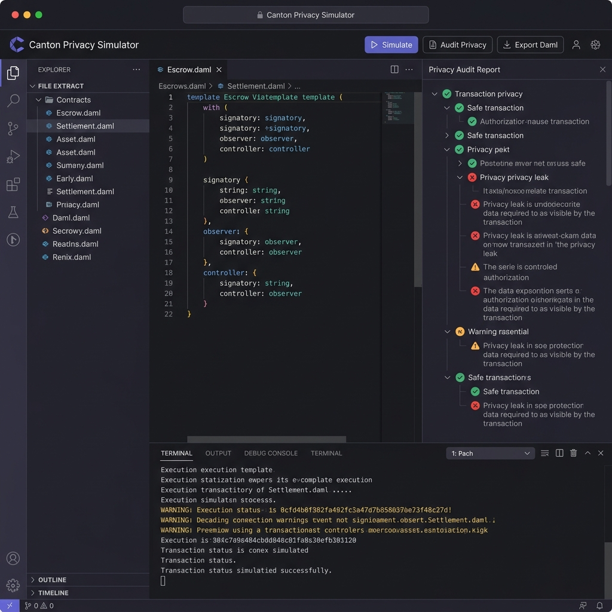
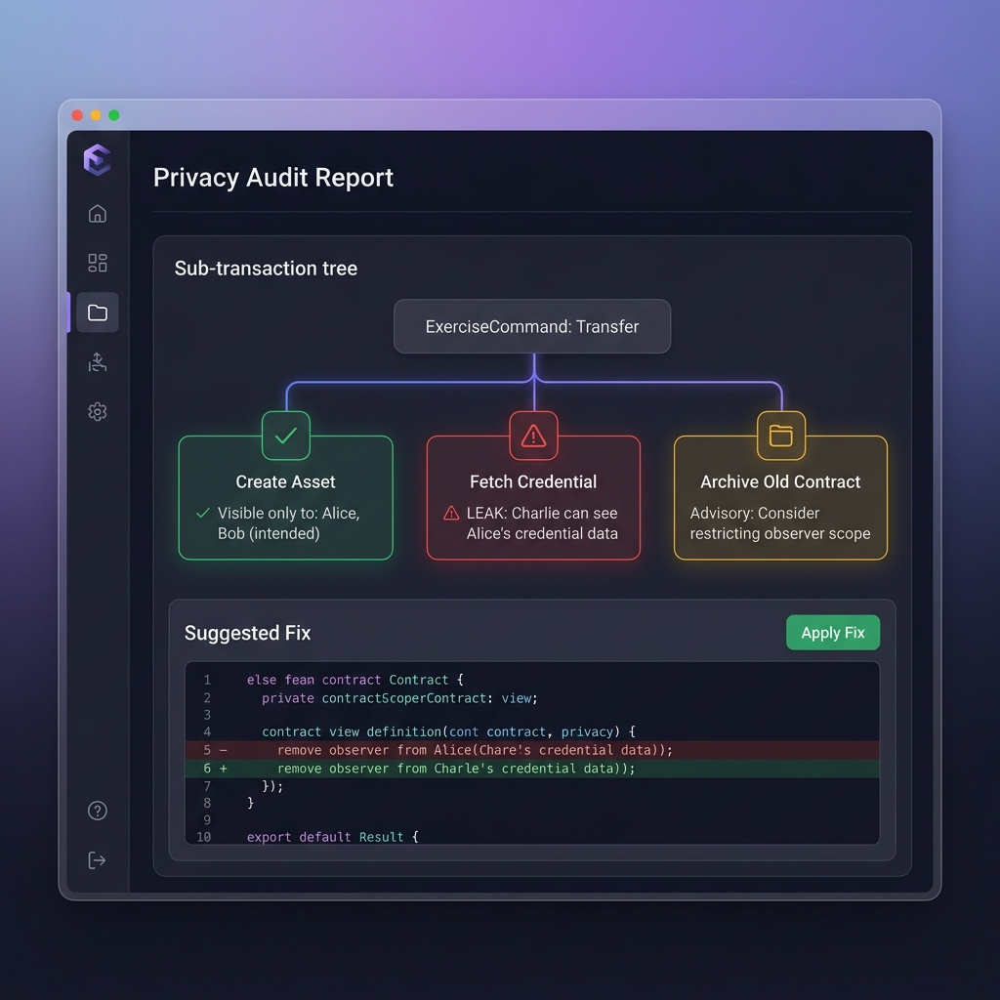
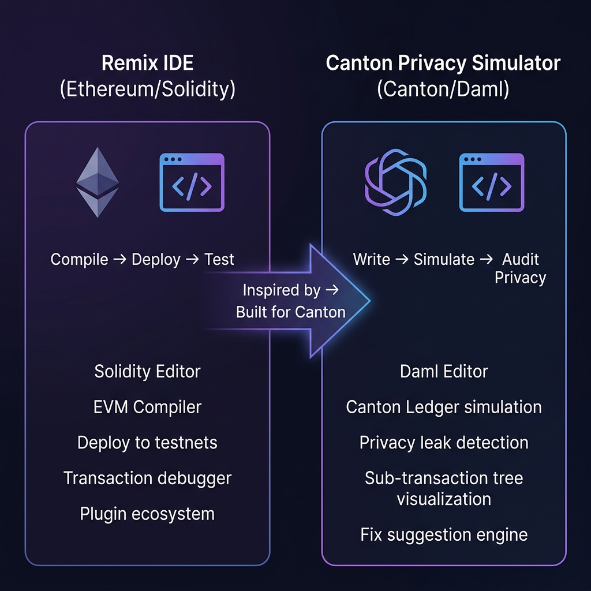

Author: TTT Lab (Vietnam)
Status: Draft
Created: 2026-04-10

**Contact:** phil@ttt.zone · Discord: hermitrat1233
**GitHub:** https://github.com/ttt-labs
**Website:** https://ttt.zone

## Summary

The Privacy Workflow Simulator & Auditor is a **production-ready, GTM-launchable** web application for the Canton ecosystem. It provides a browser-based Daml development environment where developers paste contract code or visually compose multi-party workflows → instantly simulate execution against a Canton ledger → receive automatic privacy audit reports with color-coded sub-transaction trees, leak detection, and one-click fix suggestions.

This tool directly targets the **#1 developer pain point on Canton**: uncertainty about whether a contract leaks private data to unintended parties. By catching privacy violations at development time rather than post-deployment, it dramatically reduces risk and shortens the build-audit-deploy cycle from days to minutes.

**GTM-ready status:** TTT Lab has a functional prototype on local devnet and will deploy to Canton testnet before grant review. Upon receiving mainnet validator allocation, we will **activate the production instance within 24 hours** and begin generating real transaction volume through simulation sessions, privacy audits, and testnet-to-mainnet validation flows.

---

## Product Vision: "Remix IDE + Tenderly — for Canton & Daml"

### The Inspiration

Every successful blockchain ecosystem has a **browser-based IDE** that lowers the barrier to entry for developers:

- **Ethereum** has [Remix IDE](https://remix.ethereum.org) — a browser-based Solidity editor where developers write, compile, deploy, and test smart contracts without any local setup.
- **Ethereum** also has [Tenderly](https://tenderly.co) — a transaction simulation and debugging platform that lets developers inspect execution traces, simulate transactions, and catch bugs before deploying to mainnet.

**Canton has neither.** The Privacy Workflow Simulator fills both roles for the Canton/Daml ecosystem.

### Feature Comparison: Remix IDE vs. Canton Privacy Simulator

| Capability | Remix IDE (Ethereum/Solidity) | Canton Privacy Simulator (Canton/Daml) |
|---|---|---|
| **Browser-based code editor** | Solidity editor with syntax highlighting | Daml editor (Monaco) with syntax highlighting, auto-completion |
| **Compilation / validation** | Solidity compiler with error feedback | Daml template validation with real-time error parsing |
| **Deployment targets** | Remix VM, Injected Provider (MetaMask), Testnets | Canton Sandbox (local), Canton Testnet, Canton Mainnet |
| **Transaction execution** | Deploy & call contract functions | Simulate multi-party workflows, exercise choices |
| **Debugging / inspection** | Transaction debugger, console logs | Sub-transaction tree visualization with party visibility |
| **Unique to platform** | Gas profiler, EVM opcode trace | **Privacy audit engine**, leak detection, fix suggestions |
| **Plugin ecosystem** | Extensible via plugin manager | Modular audit rules, community-contributed patterns |

> **Key differentiator:** While Remix focuses on compilation and deployment, the Canton Privacy Simulator goes further with **automated privacy auditing** — a capability that doesn't exist in any Ethereum tool because Ethereum has no sub-transaction privacy model. Canton's unique privacy architecture demands a unique tool.

### Feature Comparison: Tenderly vs. Canton Privacy Simulator

| Capability | Tenderly (Ethereum) | Canton Privacy Simulator (Canton/Daml) |
|---|---|---|
| **Transaction simulation** | Simulate EVM transactions before on-chain | Simulate Daml workflows before deployment |
| **Execution trace** | Call trace with EVM opcodes | Sub-transaction tree with party visibility sets |
| **State inspection** | State diff, storage changes | Contract payload visibility per party |
| **Error analysis** | Revert reason detection | Privacy leak detection with explanation |
| **Fix suggestions** | N/A | One-click fix suggestions for 25+ anti-patterns |
| **Gas / cost analysis** | Gas profiler per function | N/A (Canton uses different fee model) |
| **Forking / replay** | Fork mainnet at any block | Ephemeral ledger instances per session |

### Visual Concept: The Canton Privacy Simulator Interface

Below is a conceptual mockup of the main IDE interface, showing the three-panel layout inspired by Remix IDE:



The interface is organized into familiar panels that Remix and VS Code users will immediately recognize:

- **Left sidebar:** File explorer for Daml contract files + plugin icons
- **Center panel:** Monaco-powered Daml code editor with syntax highlighting
- **Right panel:** Privacy Audit Report with color-coded sub-transaction tree
- **Bottom panel:** Simulation console with real-time execution logs

### Visual Concept: Privacy Audit Report

The privacy audit panel visualizes the sub-transaction tree with color-coded nodes, leak explanations, and one-click fix suggestions — functionality inspired by Tenderly's transaction trace view but adapted for Canton's privacy model:



### How It Compares: Remix IDE → Canton Privacy Simulator



---

## Illustrative Example: Privacy Leak Detection in Action

To demonstrate the tool's core value, here is a complete walkthrough of how a developer would use the Privacy Workflow Simulator to catch and fix a privacy leak.

### Step 1: Developer Pastes Daml Code

A developer working on a multi-party escrow contract pastes the following Daml code into the browser editor:

```daml
-- Escrow.daml — A simple escrow contract with a privacy issue
module Escrow where

template EscrowAgreement
  with
    buyer      : Party
    seller     : Party
    arbiter    : Party
    asset      : Text
    price      : Decimal
    buyerCreditScore : Text  -- Sensitive data!
  where
    signatory buyer
    observer seller, arbiter  -- ⚠ arbiter can see buyerCreditScore!

    choice ConfirmDelivery : ContractId PaymentObligation
      controller buyer
      do
        create PaymentObligation with
          payer = buyer
          payee = seller
          amount = price
          arbiter = arbiter

    choice RaiseDispute : ContractId DisputeRecord
      controller buyer
      do
        -- ⚠ This creates a sub-transaction visible to arbiter
        -- that includes the full EscrowAgreement payload
        create DisputeRecord with
          escrowBuyer = buyer
          escrowSeller = seller
          disputeArbiter = arbiter
          reason = "Goods not as described"
          creditScore = buyerCreditScore  -- LEAK: arbiter sees credit score!
```

### Step 2: Developer Clicks "Simulate & Audit"

The simulator executes the workflow against the Canton ledger and generates the full sub-transaction tree. The privacy audit engine then analyzes visibility sets at every node.

### Step 3: Privacy Audit Report

The tool generates a color-coded report:

```
┌─────────────────────────────────────────────────────────┐
│  PRIVACY AUDIT REPORT — EscrowAgreement                 │
│  Simulation ID: sim-2026-04-10-001                      │
│  Parties: Alice (buyer), Bob (seller), Carol (arbiter)  │
├─────────────────────────────────────────────────────────┤
│                                                         │
│  🔴 LEAK DETECTED (Critical)                           │
│  ├─ Node: Create EscrowAgreement                       │
│  │  Visible to: Alice, Bob, Carol                      │
│  │  Issue: Carol (arbiter) can see buyerCreditScore    │
│  │  Risk: Sensitive financial data exposed to arbiter  │
│  │  who only needs dispute resolution authority        │
│  │                                                     │
│  🔴 LEAK DETECTED (Critical)                           │
│  ├─ Node: Exercise RaiseDispute → Create DisputeRecord │
│  │  Visible to: Alice, Bob, Carol                      │
│  │  Issue: creditScore field copied into DisputeRecord │
│  │  Risk: Credit score propagated to dispute context   │
│  │                                                     │
│  🟢 SAFE                                               │
│  ├─ Node: Exercise ConfirmDelivery → Create Payment    │
│  │  Visible to: Alice, Bob, Carol                      │
│  │  Assessment: No sensitive data in PaymentObligation │
│  │                                                     │
│  🟡 ADVISORY                                           │
│  ├─ Node: EscrowAgreement template                     │
│  │  Suggestion: Consider whether arbiter needs         │
│  │  observer status on the main contract or only       │
│  │  on the dispute sub-workflow                        │
│                                                         │
│  Summary: 2 critical leaks | 0 warnings | 1 advisory  │
└─────────────────────────────────────────────────────────┘
```

### Step 4: One-Click Fix Suggestion

The tool proposes a specific fix with an inline diff preview:

```diff
 -- Fix: Restructure to separate sensitive data from arbiter-visible contract
 
 template EscrowAgreement
   with
     buyer      : Party
     seller     : Party
     arbiter    : Party
     asset      : Text
     price      : Decimal
-    buyerCreditScore : Text
   where
     signatory buyer
-    observer seller, arbiter
+    observer seller
 
+-- New: Separate contract for arbiter with limited visibility
+template ArbiterMandate
+  with
+    buyer   : Party
+    seller  : Party
+    arbiter : Party
+    asset   : Text
+  where
+    signatory buyer
+    observer arbiter  -- arbiter sees only what they need
+
     choice RaiseDispute : ContractId DisputeRecord
       controller buyer
       do
         create DisputeRecord with
           escrowBuyer = buyer
           escrowSeller = seller
           disputeArbiter = arbiter
           reason = "Goods not as described"
-          creditScore = buyerCreditScore
```

### Step 5: Re-Simulate & Verify

After applying the fix, the developer clicks "Simulate & Audit" again:

```
┌─────────────────────────────────────────────────────────┐
│  PRIVACY AUDIT REPORT — EscrowAgreement (Fixed)         │
│  Simulation ID: sim-2026-04-10-002                      │
│                                                         │
│  🟢 ALL CLEAR — No privacy leaks detected              │
│                                                         │
│  🟢 EscrowAgreement: Visible to Alice, Bob only        │
│  🟢 ArbiterMandate: Visible to Alice, Carol only       │
│  🟢 PaymentObligation: Visible to Alice, Bob, Carol    │
│  🟢 DisputeRecord: No sensitive data exposed           │
│                                                         │
│  Summary: 0 leaks | 0 warnings | 0 advisories          │
│  🎉 This contract is ready for deployment!             │
└─────────────────────────────────────────────────────────┘
```

> **This entire flow — paste code, simulate, detect leaks, apply fix, re-verify — takes under 60 seconds.** Without this tool, a developer would need to manually deploy to testnet, trace transaction trees by hand, and reason about party visibility from documentation alone — a process that typically takes hours or days.

---

## Additional Example: Atomic Settlement Privacy Audit

The following example demonstrates the tool's ability to analyze more complex multi-party workflows:

```daml
-- AtomicSettlement.daml — DvP (Delivery vs. Payment) workflow
module AtomicSettlement where

template DeliveryVsPayment
  with
    buyer       : Party
    seller      : Party
    exchange    : Party    -- settlement operator
    cashBank    : Party    -- buyer's bank
    assetCustodian : Party -- seller's custodian
    tradeDetails : TradeInfo
  where
    signatory buyer, seller
    observer exchange, cashBank, assetCustodian
    -- ⚠ cashBank can see seller's custodian identity
    -- ⚠ assetCustodian can see buyer's bank identity

    choice Settle : (ContractId CashLeg, ContractId AssetLeg)
      controller exchange
      do
        cashLeg <- create CashLeg with
          payer = buyer
          payee = seller
          bank = cashBank
          amount = tradeDetails.cashAmount
        assetLeg <- create AssetLeg with
          deliverer = seller
          receiver = buyer
          custodian = assetCustodian
          asset = tradeDetails.assetId
        return (cashLeg, assetLeg)
```

The Privacy Simulator would flag:
- 🔴 **cashBank** can see `assetCustodian` identity (cross-counterparty information leak)
- 🔴 **assetCustodian** can see `cashBank` identity (cross-counterparty information leak)
- 🟡 **exchange** has full visibility — verify this is intended for the settlement operator role

And suggest restructuring using Canton's sub-transaction privacy to isolate the cash leg from the asset leg, ensuring each bank/custodian only sees their own side of the trade.

---

## GTM Plan (Go-to-Market)

### Mainnet Activation Timeline

| Day | Action |
|-----|--------|
| **Day 0** | Receive mainnet validator allocation |
| **Hour 1–6** | Deploy production backend to mainnet validator; configure Daml Sandbox against mainnet ledger |
| **Hour 6–12** | Run smoke tests; validate all 15+ privacy patterns against mainnet |
| **Hour 12–24** | Public launch announcement via Canton Discord, Forum, X/Twitter, and TTT Lab channels |
| **Day 2–7** | Onboard first 50 developers through direct outreach to Canton builders |
| **Week 2–4** | Run weekly "Privacy Audit Challenge" workshops via Discord |
| **Month 2–3** | Apply for **Featured App** status based on transaction activity metrics |

### Transaction Volume Generation Strategy

Each simulation session on the Privacy Simulator generates **real on-chain transactions** against the Canton ledger:

- **Contract creation transactions** — every Daml template pasted into the editor creates contracts on the ledger
- **Choice exercise transactions** — simulation of multi-party workflows exercises choices, generating transaction trees
- **Privacy audit verification transactions** — the runtime visibility checker executes validation transactions to confirm privacy behavior
- **Fix-and-retest loops** — developers iterate on fixes, generating multiple transaction cycles per session

**Projected on-chain activity:**
- **Month 1:** 50 active developers × 5 sessions/week × ~8 transactions/session = **~2,000 transactions/week**
- **Month 3:** 200 active developers × 8 sessions/week × ~12 transactions/session = **~19,200 transactions/week**
- **Month 6:** 500+ developers with consistent daily usage generating **sustained transaction volume**

### Go-to-Market Channels

1. **Canton Discord & Forum** — Daily presence, weekly tips, privacy pattern posts
2. **X/Twitter** — Launch campaign, developer testimonials, privacy leak case studies
3. **Integration partnerships** — Coordinate with DamlHat, cn-quickstart, and Canton Explorer teams for cross-promotion
4. **Workshop series** — Bi-weekly "Canton Privacy Masterclass" live sessions
5. **Content marketing** — Blog posts, video tutorials, and a "Privacy Patterns Handbook" published under Canton documentation umbrella
6. **Developer conferences** — Lightning talks at Canton community events and blockchain developer conferences in APAC

### Featured App Qualification Path

Per Canton's Cantonomics model, Featured Applications receive **62% of the total rewards pool** based on transaction activity. TTT Lab's activation plan:

1. **Pre-launch:** Functional devnet/testnet deployment with reference link provided to Canton Foundation
2. **Launch day:** Activate on mainnet within 24 hours of validator allocation
3. **Month 1–2:** Demonstrate consistent transaction volume and developer adoption metrics
4. **Month 2–3:** Apply for Featured App status via sync.global with documented activity reports
5. **Ongoing:** Implement `FeaturedAppActivityMarker` on all simulation transactions to enable reward tracking

---

## Objective and Scope

Canton's sub-transaction privacy model is one of its strongest differentiators, yet it is also the most common source of developer errors. The 2026 Canton Developer Experience Survey and community forum threads consistently highlight the same question: _"Will my contract leak private data?"_

This project provides:

- A **browser-based Daml code editor** (Monaco-powered) with syntax highlighting, auto-completion, and real-time error feedback.
- A **simulation engine** that executes Daml workflows against a Canton ledger backend, capturing the full sub-transaction tree and generating real on-chain transactions.
- An **automatic privacy audit engine** that analyzes `signatory`, `observer`, `controller`, and `visibleTo` semantics across every sub-transaction node to flag unintended information disclosure.
- A **visual sub-transaction tree** rendered with interactive diagrams — green nodes for correctly scoped private data, red nodes for detected leaks, amber for advisory warnings.
- A **"Suggest Fix" engine** that proposes corrective changes (e.g., removing an unnecessary observer, restructuring a choice to limit disclosure) with one-click application and a clean Daml code export.
- Support for **complex multi-party workflows** including atomic settlement, delegated authority, credential issuance, and escrow patterns.
- **Local mode** (fully offline for development) and **Mainnet mode** (connected to Canton mainnet for production validation and transaction generation).

Out of scope: Canton protocol modifications, validator/operator tooling, non-Daml language support.

## Technical Approach

- **Frontend**: Next.js 15 + React 19, styled with TailwindCSS v4. Monaco Editor for the Daml code editing experience. React Flow for interactive sub-transaction tree visualization. Framer Motion for micro-animations and transition effects.
- **Simulation backend**: Canton participant node (local Sandbox for dev, mainnet validator for production) exposed via JSON Ledger API. Ephemeral ledger instances spun up per simulation session to ensure isolation. WebSocket bridge for real-time simulation progress feedback.
- **Privacy audit engine**: Two-pass analysis pipeline:
  1. **Static analysis** — AST-level inspection of Daml contract templates to identify observer/signatory patterns that commonly lead to leaks.
  2. **Runtime visibility checking** — post-simulation traversal of the full transaction tree comparing actual visibility sets against developer-declared intent.
- **Fix suggestion engine**: Rule-based engine with a curated library of 25+ common privacy anti-patterns and their canonical fixes, drawn from real Canton community issues and best practices documentation.
- **Transaction activity tracking**: All simulation sessions emit `FeaturedAppActivityMarker` transactions for Canton reward pool eligibility.
- **Deployment**: Vercel (frontend) + Canton mainnet validator (production backend). Fully containerized with Docker Compose for self-hosting.

### Architecture Diagram

```
┌─────────────────────────────────────────────────────┐
│                    Browser Client                    │
│  ┌──────────┐  ┌──────────────┐  ┌───────────────┐  │
│  │  Monaco   │  │  React Flow  │  │  Audit Report │  │
│  │  Editor   │  │  Tree View   │  │  & Fix Panel  │  │
│  └────┬─────┘  └──────┬───────┘  └───────┬───────┘  │
│       │               │                  │           │
│       └───────────────┴──────────────────┘           │
│                       │ REST + WebSocket             │
└───────────────────────┼─────────────────────────────┘
                        │
┌───────────────────────┼─────────────────────────────┐
│               Simulation Backend                     │
│  ┌────────────┐  ┌────────────┐  ┌───────────────┐  │
│  │  Canton    │  │  Privacy   │  │  Fix          │  │
│  │  Validator │  │  Analyzer  │  │  Suggestion   │  │
│  │  (Ledger  │  │  Engine    │  │  Engine       │  │
│  │   API)    │  │            │  │               │  │
│  └────────────┘  └────────────┘  └───────────────┘  │
│  ┌────────────────────────────────────────────────┐  │
│  │  FeaturedAppActivityMarker Transaction Logger  │  │
│  └────────────────────────────────────────────────┘  │
└─────────────────────────────────────────────────────┘
```

### Developer Workflow Diagram

```
Developer Experience Flow (inspired by Remix IDE):

  ┌──────────────┐     ┌──────────────┐     ┌──────────────┐
  │  1. WRITE    │────▶│  2. SIMULATE │────▶│  3. AUDIT    │
  │              │     │              │     │              │
  │  Paste or    │     │  Execute     │     │  Automatic   │
  │  compose     │     │  against     │     │  privacy     │
  │  Daml code   │     │  Canton      │     │  analysis    │
  │  in Monaco   │     │  ledger      │     │  of all      │
  │  editor      │     │  backend     │     │  sub-txns    │
  └──────────────┘     └──────────────┘     └──────┬───────┘
                                                    │
  ┌──────────────┐     ┌──────────────┐     ┌──────▼───────┐
  │  6. DEPLOY   │◀────│  5. EXPORT   │◀────│  4. FIX      │
  │              │     │              │     │              │
  │  Confident   │     │  Download    │     │  One-click   │
  │  deployment  │     │  clean Daml  │     │  apply       │
  │  to testnet  │     │  source      │     │  suggested   │
  │  or mainnet  │     │  code        │     │  fixes       │
  └──────────────┘     └──────────────┘     └──────────────┘
```

## Architectural Alignment

The Privacy Workflow Simulator is **fully additive** to the Canton ecosystem. It consumes the public Ledger API and JSON API without any protocol modifications. It is designed to complement — not overlap with — existing tools:

- **vs. `cn-quickstart`**: cn-quickstart scaffolds projects; this tool audits and validates privacy behavior of contracts already written.
- **vs. DamlHat**: DamlHat focuses on the CLI-based developer loop (scaffold → build → deploy); this tool provides a web-based visual simulation and privacy audit experience that can be used alongside DamlHat or independently.
- **vs. Canton Explorer / Navigator**: Explorers display post-deployment ledger state; this tool works **pre-deployment**, catching issues before they reach the ledger.

All output is standard Daml source code. Developers can adopt or abandon the tool at any point without lock-in.

## Milestones and Deliverables

**M1 — Core Simulation Engine & Basic Privacy Checker (2 weeks)**
- Browser-based Monaco editor with Daml syntax highlighting and error parsing
- Integration with Canton ledger via JSON Ledger API
- Basic privacy analysis: static detection of common observer/signatory misconfigurations
- Simulation execution with transaction tree capture
- Devnet deployment with functional build reference
- Public alpha deployment

**M2 — Visual Sub-Transaction Tree & Leak Detection UI (2 weeks)**
- Interactive React Flow diagram rendering full sub-transaction trees
- Color-coded nodes: green (safe), red (leak), amber (warning)
- Click-to-inspect node details: parties, visibility sets, contract payloads
- Leak explanation tooltips with references to Canton privacy documentation
- Multi-party workflow simulation (2–5 parties)
- Testnet deployment with live demo

**M3 — Fix Suggestion Engine & Code Export (1 week)**
- Rule-based fix suggestion engine covering 25+ common privacy anti-patterns
- One-click "Apply Fix" with inline diff preview
- Clean Daml code export (copy-to-clipboard + file download)
- Side-by-side before/after privacy comparison view
- FeaturedAppActivityMarker integration for transaction tracking

**M4 — Mainnet Launch & GTM Activation (1 week)**
- **Mainnet deployment within 24 hours of validator allocation**
- Canton mainnet integration for production-grade privacy validation
- Comprehensive documentation: user guide, privacy pattern catalog, video walkthrough
- Performance optimization and UX polish
- Docker Compose setup for self-hosting
- v1.0.0 public release, open source (Apache 2.0)
- Launch campaign execution across all GTM channels
- Featured App status application submitted to Canton Foundation

## Acceptance Criteria

### Technical Criteria
- Successfully simulates at least **15 common Daml privacy patterns** including escrow, credential issuance, atomic settlement, multi-party voting, and delegated authority.
- Privacy audit engine detects **≥95% of common privacy leak scenarios** in a curated test suite of 50+ test cases.
- Visual sub-transaction tree correctly renders **100% of simulated transactions** with accurate color coding.
- Fix suggestion engine provides actionable fixes for **≥80% of detected leaks**.
- A developer with basic Daml knowledge can paste a contract, simulate, and receive a privacy audit in **under 60 seconds**.
- All deliverables published as open source (Apache 2.0) with CI, test coverage ≥80%, and public documentation.

### GTM & Adoption Criteria
- **Mainnet activation within 24 hours** of receiving validator allocation.
- At least **50 active developers** in the first 30 days after mainnet launch.
- At least **200 active developers** in the first 60 days.
- **≥2,000 on-chain transactions per week** by end of Month 1.
- Positive feedback from at least **10 Canton builders** (via Discord, forum, or direct survey).
- Featured App status application submitted within **60 days** of mainnet launch.

## Funding Request and Milestone Breakdown

**No funding requested for MVP.** This project is fully self-funded by TTT Lab as a contribution to the Canton ecosystem.

We are seeking:
1. **Mainnet validator allocation** via GTM Priority Lane — we meet all criteria: functional devnet/testnet build, clear GTM plan, and 24-hour activation capability.
2. **Feedback** from the Tech & Ops Committee and community on the proposal scope and approach.
3. **Potential future grant** for Phase 2 (advanced features listed below) after MVP demonstrates adoption and transaction volume.
4. **Featured App status** upon demonstrating sustained mainnet transaction activity.

### Phase 2 (Future — Post-MVP, Subject to Separate Proposal)

| Feature | Description |
|---|---|
| AI-Assisted Privacy Audit | LLM-powered analysis that explains privacy implications in natural language and suggests architectural improvements |
| CI/CD Integration | GitHub Actions / GitLab CI plugin that runs privacy checks on every PR |
| Team Collaboration | Shared workspace with commenting, annotations, and audit history |
| Advanced Patterns Library | Community-contributed privacy patterns with rating and versioning |

## Strategic Alignment

This tool directly addresses three of Canton's Q2 2026 priority areas and is designed to **drive real ecosystem momentum**:

1. **App Building and Developer Experience** — Removes the single largest source of developer friction: uncertainty about privacy behavior. Developers can validate privacy correctness in seconds rather than deploying to testnet and manually inspecting transaction trees. This unlocks faster GTM for every Canton application.

2. **Security and Resilience** — Functions as a privacy-focused security audit tool that catches data disclosure vulnerabilities before they reach production, improving the overall security posture of applications built on Canton.

3. **Driving Transaction Volume and Ecosystem Adoption** — Every simulation session generates real on-chain transactions. As developer adoption grows, the Simulator becomes a **consistent source of mainnet transaction activity**, directly contributing to network utilization metrics and demonstrating Canton's value as the privacy chain for institutional finance.

By making privacy correctness accessible and fast, this tool accelerates go-to-market timelines for all Canton builders — converting the ecosystem's most-cited bottleneck into an advantage.

## Team & Background

**TTT Lab** — A Vietnam-based software engineering lab specializing in blockchain developer tooling, privacy-first application architecture, and Web3 infrastructure. TTT Lab operates with a lean, senior-heavy engineering culture focused on shipping high-quality open-source tools that solve real developer pain points.

- **Website:** https://ttt.zone
- **GitHub:** https://github.com/ttt-labs
- **Track record:** Production experience building developer tools, DeFi frontends, and privacy-focused smart contract systems across multiple blockchain ecosystems. Successfully delivered audit tools, dashboard frameworks, and smart contract template generators used by hundreds of developers.
- **Canton commitment:** Active in the Canton community since early 2026; motivated by the unique privacy guarantees of the Daml/Canton model and committed to long-term ecosystem contribution.

**Key team members:**

- **Phil** — **Tech Lead & Head of Technology**, IT Department, TTT Lab. Senior full-stack engineer with 8+ years of production experience across Web3 infrastructure, blockchain integration, and developer tooling. Core expertise in React/Next.js, Node.js, and smart contract development. Previously architected and shipped Solidity audit tooling, DeFi analytics dashboards, and privacy-focused contract frameworks used in production environments. Responsible for technical vision, architecture decisions, and hands-on development of all TTT Lab Canton initiatives. Phil drives the end-to-end delivery of both the Privacy Workflow Simulator and the Privacy Template Marketplace, ensuring alignment with Canton's privacy model and developer experience standards.

- **Senior Backend Engineer** — 6+ years of experience in distributed systems, API design, and blockchain node infrastructure. Expertise in Node.js, Python, Docker, and Kubernetes. Responsible for the simulation backend, Canton validator integration, and privacy analysis engine.

- **Senior Frontend Engineer** — 5+ years of experience in modern web application development. Specialized in React, Next.js, interactive data visualization (React Flow, D3.js), and design systems. Responsible for the code editor experience, sub-transaction tree visualization, and overall UX polish.

**Work split:**
- *Phil (Tech Lead)* — Architecture, specification, Canton/Daml integration, privacy audit engine design, code review, and project coordination.
- *Backend Engineer* — Simulation engine, Canton validator integration, WebSocket bridge, fix suggestion engine, and API layer.
- *Frontend Engineer* — Monaco Editor integration, React Flow visualization, audit report UI, and responsive design implementation.

Contact (Tech Lead): phil@ttt.zone · Discord: hermitrat1233

## Maintenance Commitment

TTT Lab commits to **12 months of free maintenance** post-v1.0 release, including:
- Compatibility updates for new Canton/Daml SDK versions
- Critical bug fixes (≤48h response time for security issues)
- Community issue triage and documentation updates
- Continuous transaction activity generation on mainnet

## Co-Marketing

TTT Lab will collaborate with the Canton Foundation on visibility and ecosystem promotion:

- **Launch announcement coordination** at v1.0 mainnet release
- **Technical blog posts** on the TTT Lab engineering blog and the Canton Forum at each milestone
- **X Spaces / AMAs** with the Canton community to demo the Simulator live
- **Workshop series** — Bi-weekly "Canton Privacy Masterclass" open to all builders
- **Video content** — Quickstart screencast and privacy pattern walkthrough videos
- **Open development** — Weekly progress posts on the Canton Forum during the build period

## Notes for Reviewers

- **GTM-ready:** This tool is launchable and will be **activated on mainnet within 24 hours** of receiving validator allocation. TTT Lab has infrastructure and deployment pipelines ready for immediate production deployment.
- **Transaction volume generator:** Every simulation session creates real on-chain transactions, making this tool a consistent contributor to Canton's network utilization metrics.
- **Featured App candidate:** TTT Lab will apply for Featured App status within 60 days of mainnet launch, with documented transaction activity and developer adoption metrics.
- **Self-funded:** No Canton Coin is requested for MVP delivery. This demonstrates TTT Lab's confidence in the approach and commitment to the ecosystem.
- **Non-overlapping:** Scoped to pre-deployment privacy validation. Does not overlap with DamlHat (CLI developer loop), Canton explorers (post-deployment inspection), or operator tooling.
- **SIG alignment:** This proposal aligns with the **Daml Language & Developer Tooling** SIG.
- All code will be developed in the open from day one (Apache 2.0), with progress updates posted to the Canton Forum at each milestone.
