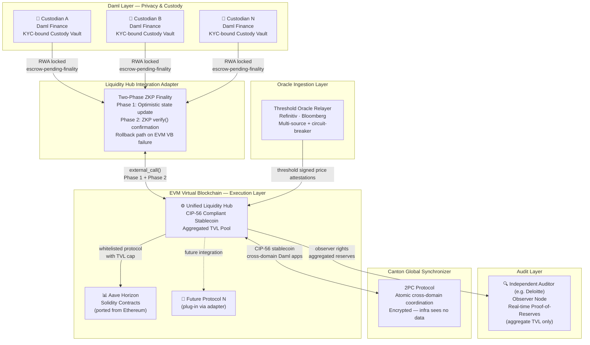

# Development Fund Proposal

**Author:**  Randy Daal, Triple Play Labs
**Status:** Draft  
**Created:** 2026-03-10 

---

## Abstract

Triple Play Labs proposes a Unified Liquidity Hub and white-label private stablecoin framework for the Canton Network. Utilizing the Polyglot Canton architecture, we integrate Daml Finance KYC-bound Custody Vaults with a central EVM Virtual Blockchain routing contract. This project creates Canton's first institutional liquidity clearinghouse and establishes a reusable integration boundary for all future protocols. By allowing a standardized issuance of a CIP-56 compliant stablecoin, regulated institutions can pool collateral and safely route liquidity to whitelisted DeFi protocols (beginning with Aave Horizon) without requiring bespoke, protocol-specific integrations. This delivers a trust-minimized, composable gateway, completely removing the risks associated with asynchronous cross-chain bridges. We also propose a partnership with a big 4 consultancy to verify uniform standards.

---

## Specification

### 1. Objective

Fragmented liquidity across different Canton applications and subnets severely harms capital efficiency. Regulated institutions demand confidentiality for payment flows, but isolating assets in private networks prevents shared yield generation. The objective is to provide a deployable infrastructure package that acts as a central clearinghouse, solving liquidity fragmentation by standardizing how custodians issue private stablecoins and how authorized protocols on Canton access shared TVL.

---

### 2. Implementation Mechanics

The solution establishes a hub-and-spoke liquidity model to avoid point-to-point integration bottlenecks.

#### Privacy & Custody Layer (Daml)
We implement a Daml Finance KYC-bound Custody Vault enforcing credential-bound access and sub-transaction privacy between the custodian and the client.

#### The Liquidity Hub & Router (EVM VB)
A Liquidity Hub contract deployed on the Canton EVM Virtual Blockchain acts as the core TVL pool. It manages aggregated deposits from Daml vaults and issues a unified stablecoin.

**Stablecoin Economic Model:**

- **Collateral Type:** 1:1 backed by highly liquid, tokenized RWAs (e.g., US Treasury equivalents) locked in Daml vaults and verified by a top 4 global auditor.
- **Minting Logic:** 1:1 issuance of the CIP-56 stablecoin on the EVM VB upon ZKP verification of locked Daml collateral.
- **Redemption Logic:** Burning the stablecoin on the EVM VB triggers a verified release of the underlying RWA back to the depositor in the Daml vault.
- **Segregation vs. Pooling:** RWAs remain strictly segregated by custodian at the Daml layer; stablecoin liquidity is pooled at the EVM Hub layer.
- **Loss Isolation:** The hub isolates risk per whitelisted protocol via hard TVL caps. If an integrated protocol (e.g., Aave) experiences a liquidation event, it happens natively on the EVM VB against the stablecoin, insulating the underlying Daml RWA collateral from direct smart contract risk.

**CIP-56 Compliance:** The stablecoin adheres to Canton's institutional token standard (equivalent to an upgraded ERC-20), enabling native KYC/KYB compliance hooks and atomic DvP settlement. This ensures immediate compatibility with Canton wallets and apps without custom integration.

#### Liquidity Hub Integration Adapter
We build a set of Daml interface contracts and EVM integration hooks that standardize how Daml Custody Vaults connect to the EVM Liquidity Hub. This relies on the `external_call()` primitive from the Feb 2025 Polyglot Canton whitepaper. The adapter defines the contract interface boundary, the authentication model, and the escrow state management.

#### Two-Phase ZKP Finality & Governance
The architecture follows a two-phase finality model. Locking an RWA in a Daml vault submits an optimistic state update to the EVM Hub (Phase 1). Final settlement occurs when the EVM sequencer generates a Zero-Knowledge Proof (ZKP) of execution, verified by the Canton ledger via a Daml `verify()` function (Phase 2).

- **Sequencer Operator:** Assumed to be operated by a consortium of Super Validators.
- **ZKP Anchoring:** Proofs are verified on the Canton ledger by a dedicated Daml smart contract.
- **Timeout Threshold:** If a ZKP is not submitted and verified within a defined epoch (e.g., 50 EVM blocks), the state update times out.
- **Rollback Trigger:** A timeout or EVM halt automatically allows the depositor to trigger a rollback in the Daml vault, releasing the escrowed collateral safely back to their balance.

#### Reference Integration (Aave)
Aave Horizon's audited Solidity contracts will be plugged into the Liquidity Hub as the first whitelisted protocol to prove external composability.

#### Universal Oracle Ingestion Layer
A multi-source, permissioned Oracle Relayer service utilizes threshold signatures from 3+ independent institutional data providers (e.g., Refinitiv, Bloomberg). Prices are pushed to the EVM VB on a defined cadence, featuring an automated circuit-breaker that halts hub borrowing/liquidation operations if feeds deviate beyond established thresholds or become stale.

#### Audit Layer
An independent auditor (e.g., Deloitte, currently in preliminary discussions) operates a participant node with observer rights on the EVM Hub's aggregated reserves, enabling real-time proof-of-reserves for the network's stablecoin supply without viewing individual holding sub-transactions.

---

### 2.1 Technical Risks & Dependencies

To ensure architectural transparency, this project acknowledges the following dependencies:

- **`external_call()` Production Readiness:** The adapter relies on this primitive functioning as documented in the Polyglot Canton whitepaper. Material changes to this primitive before mainnet could require adapter refactoring.
- **ZKP Sequencer Trust Assumptions:** The hub's liveness depends on the Super Validator consortium operating the EVM sequencer reliably.
- **Global Synchronizer Support:** Cross-domain EVM composability assumes eventual, documented support for Virtual Blockchains participating in the Canton Global Synchronizer's two-phase commit protocol.

---

### 2.2 Architecture Overview

---

### 3. Architectural Alignment

This work aligns directly with the Canton Network's push toward composability and the Polyglot Canton Whitepaper. It concretely validates the core architectural thesis that Daml should be used for strict, privacy-preserving state management (identity and custody), while EVM Virtual Blockchains serve as shared, composable execution environments for complex DeFi logic. By issuing a CIP-56 compliant stablecoin, the hub is natively composable with existing Canton wallets and Daml applications.

---

### 4. Backward Compatibility

No backward compatibility impact. This is a net-new application deployment consisting of independent Daml templates and a distinct Virtual Blockchain EVM deployment.

---

## Milestones and Deliverables

### Milestone 1: Protocol Discovery, Scaffolding, and Architecture Definition
**Estimated Delivery:** 4 Weeks

**Focus:** Environment bootstrapping and strict architectural definition for the Liquidity Hub.

**Deliverables / Value Metrics:**
- Stand up local participant nodes (Custodian, Hub, Auditor) using the Canton `cn-quickstart` scaffold.
- Delivery of the **Architecture Specification and Compliance Policy Matrix**, defining: identity credentials, Daml/EVM boundary state, the two-phase ZKP finality model, timeout thresholds, and rollback governance.
- Delivery of the **Liquidity Hub Integration Adapter Specification**, defining the contract interface boundary and the risk isolation framework (e.g., hard TVL caps) for protocols connecting to the hub.
- Specification of the **Universal Oracle Relayer design**, detailing the multi-source threshold signature model and circuit-breaker fallback logic.
- Finalization of the **Auditor observer scope** and sign-off on the node architecture reporting format.

---

### Milestone 2: Hub Build, Reference Integration, and Validation
**Estimated Delivery:** 8 Weeks

**Focus:** Core development of the EVM Liquidity Hub and Aave reference integration.

**Deliverables / Value Metrics:**
- Develop the Daml Finance KYC-bound Custody Vault contracts with `escrow-pending-finality` state and ZKP-triggered rollback logic.
- Develop and deploy the core EVM Liquidity Hub routing contracts to a local Canton EVM Virtual Blockchain, issuing the 1:1 backed CIP-56 compliant unified stablecoin.
- Deploy Aave Horizon Solidity contracts as the first reference integration into the Liquidity Hub, enforcing the per-protocol risk isolation framework.
- Deploy and validate the Threshold Oracle Relayer feeding signed price attestations to the EVM Hub.
- Successfully execute cross-environment transactions via the Integration Adapter with demonstrated two-phase ZKP finality, including a validated timeout/rollback on simulated EVM VB failure.
- Deploy the working reference implementation to Canton DevNet via a Super Validator sponsor node.

---

### Milestone 3: Audit Integration, Hardening, and Handover
**Estimated Delivery:** 4 Weeks

**Focus:** Auditor node configuration, security hardening, and operator readiness.

**Deliverables / Value Metrics:**
- Implement Independent Auditor observer node logic for verifiable proof-of-reserves on the central hub's aggregated TVL, per the architecture agreed in Milestone 1.
- Security review support, deployment automation templates, and operational runbooks.
- Liquidity Hub Deployment Guide and handover sign-off.

---

## Acceptance Criteria

The Tech & Ops Committee will evaluate completion based on:

- Deliverables completed as specified for each milestone.
- **Demonstrated functionality:** A successful end-to-end flow demonstrating an asset locked in a Daml Finance Custody Vault triggering a cross-environment call to the EVM Liquidity Hub via the Integration Adapter, minting a CIP-56 compliant unified stablecoin, and routing it to the Aave reference integration.
- **Validated two-phase ZKP finality:** Optimistic state update confirmed by `verify()` confirmation, and rollback behavior safely validated on simulated EVM VB failure/timeout.
- **Demonstrated capability** of the Auditor Node to mathematically verify 1:1 backing of the hub's aggregated TVL without exposing individual client holding sub-transactions.
- Documentation and knowledge transfer provided via the **Liquidity Hub Deployment Guide**.

---

## Funding

**Total Funding Request:** USD 340,000 equivalent in Canton Coin (CC)

### Payment Breakdown by Milestone

| Milestone | Description | Amount (USD equiv. in CC) |
|-----------|-------------|--------------------------|
| Milestone 1 | Protocol Discovery & Architecture | $72,000 |
| Milestone 2 | Hub Build & Reference Integration | $186,000 |
| Milestone 3 | Audit Integration & Handover | $82,000 |
| **Total** | | **$340,000** |

### Volatility Stipulation

If the project duration is under 6 months (estimated at 16 weeks / 4 months): should the project timeline extend beyond 6 months due to Committee-requested scope changes, any remaining milestones must be renegotiated to account for significant USD/CC price volatility.

---

## Co-Marketing

Upon release, Triple Play Labs will collaborate with the Foundation on:

- Announcement coordination highlighting the launch of Canton's first Unified Liquidity Hub.
- A technical blog post detailing how future EVM DeFi protocols can integrate with the hub using the reusable Integration Adapter built on the Polyglot Canton `external_call()` primitive.
- Developer and ecosystem promotion with participating institutional custodians and audit partners.

---

## Motivation

To drive institutional stablecoin Total Value Locked (TVL) onto Canton, the network must solve the liquidity fragmentation problem. Custodians want on-chain settlement and access to diverse DeFi yields, but they cannot compromise on regulatory privacy or build bespoke integrations for every new lending market or DEX. This project delivers a standardized hub that acts as a secure clearinghouse for the ecosystem, significantly lowering the barrier to entry for both institutions and DeFi protocols on Canton.

---

## Rationale

Without a hub-and-spoke model, every new DeFi protocol on Canton would need to build its own bespoke `external_call()` integration back to Daml KYC vaults, fragmenting liquidity and compounding smart contract risk. By creating a Unified Liquidity Hub with a standardized Integration Adapter, we define the interoperability boundary once. This allows the ecosystem to reuse audited EVM code like Aave Horizon and existing Web3 developer tooling, while preserving Canton's privacy guarantees where they matter most: at the custody and identity layer. The CIP-56 compliant stablecoin ensures the hub's output is immediately composable with the existing Canton ecosystem without requiring additional integration work from downstream participants.