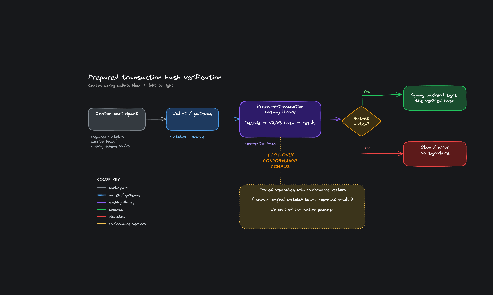

## Development Fund Proposal: Prepared-Transaction Hashing Library

| Field    | Value                                                                 |
| -------- | --------------------------------------------------------------------- |
| Author   | nicky2pc                                                              |
| Org      | FTP                                                                   |
| Status   | Submitted                                                             |
| Created  | 2026-08-05                                                            |
| PR       | [#617](https://github.com/canton-foundation/canton-dev-fund/pull/617) |
| Label    | wallet-apps                                                           |
| Champion | Jatinp26                                                       |

---

## Abstract

The idea of this proposal is to add the hash-recomputation step missing from the external-signing flow. The wallet takes the prepared tx and hash returned by the participant, independently recomputes the hash from the tx bytes and compares the two before asking its signing backend to sign.

The proposed Apache-2.0 TypeScript library closes this gap. Its core recomputes the prepared-tx hash using Canton hashing scheme V2 or V3. The caller must stop signing if the result differs from the hash returned by the participant. Separately, we will publish conformance vectors containing the original tx bytes, hashing scheme and expected result, so non-TypeScript and hardware-wallet developers can test their own implementations.

FTP already uses a narrower V2 verifier in the MainNet payment flow of its x402 agentic wallet. The [verify-prepared.ts](https://github.com/FTP-Tech-LLC/x402-canton-agent/blob/main/packages/agent-wallet/src/verify-prepared.ts) implementation has 83 tests, including 39 bypass cases. We will extract its V2 hashing code, add V3 and package the result for reuse.

The funding request is up to 570,000 CC: 250,000 CC for engineering and up to 320,000 CC after adoption. Any external security review requested by the Committee is handled separately.

---

## Specification

### 1. Objective

Before signing, the wallet recomputes the hash from the prepared tx bytes and compares it with the hash returned by the participant.

The package exposes one public entry point for V2/V3 prepared-transaction hashing.

### 2. Implementation Mechanics

Today, the participant-supplied hash can reach the signing driver without being recomputed from the prepared tx. In the [approve path](https://github.com/canton-network/wallet/blob/main/wallet-gateway/remote/src/web/frontend/approve/index.ts#L72-L86), `preparedTransactionHash` and `preparedTransaction` arrive as two separate inputs and no hash is recomputed. The [internal](https://github.com/canton-network/wallet/blob/main/core/signing-internal/src/controller.ts#L79) and [Fireblocks](https://github.com/canton-network/wallet/blob/main/core/signing-fireblocks/src/index.ts#L86) signing drivers still carry `// TODO: validate transaction here` at the signing site. This is the missing check that the proposed library addresses.

The caller passes the prepared bytes and hashing scheme. The package returns the recomputed hash or a typed error if the input cannot be decoded. The caller compares the result with the participant-supplied hash before signing.

We generate our own protobuf bindings for the package. The shared model, `@canton-network/core-ledger-proto` 1.9.1, does not expose all fields required for V3 hashing: decoding V3 through it silently drops `key_opt`, `by_key` and the `QueryByKey` node. A V3 hasher cannot use a model that drops fields included in the hash. Package-local bindings expose the required V3 fields without changing the shared model for its existing consumers. For V2, our CI also compares output with the published `@canton-network/core-tx-visualizer` 1.9.1 implementation.

V3 changes the wire format in five places, and we cover the full delta.

- the node and metadata encoding-version prefixes are removed
- `key_opt` appears on create, exercise and fetch
- `by_key` appears on exercise and fetch
- the `QueryByKey` node is added
- `max_record_time` is added to signed metadata

PV35 supports both V2 and V3 and defaults to V2. V3 is required when contract keys are used.

The decoder walks the node forest defensively. It tracks visited node ids, enforces depth and node-count limits, and rejects duplicate node records, shared children, cycles, orphans and dangling references. Rollback subtrees remain part of the hash walk.

The conformance vectors are a separate test artifact, not part of the npm runtime. Each vector stores the hashing scheme, the participant's original protobuf bytes and the expected hash or rejection. We use the original bytes because a JSON round trip can discard unknown fields.

### 3. Architectural Alignment

The library runs client-side against published Canton protocol artifacts. Nothing in Canton, Splice, Daml or the Ledger API has to change for it to work.

The library complements clear signing by checking that the prepared tx is covered by the hash sent for signing.

We do the work ourselves, from protocol analysis through the vector corpus and adversarial tests to any fixes a requested review turns up. We will submit a complete upstream PR to `canton-network/wallet`, with `core/tx-hashing` and `@canton-network/core-tx-hashing` as the proposed path and package name. Milestone 2 requires a review-ready PR that passes repository CI, not its merge.

### 4. Backward Compatibility

The npm package is a new optional dependency, so nothing changes for anyone who does not adopt it.

---

## Milestones and Deliverables

### Milestone 1 (HASH): V2/V3 hashing and conformance vectors

Estimated delivery: week 10 from grant approval.

Focus: build and validate V2/V3 hashing with reusable conformance vectors.

Deliverables and value metrics:

- An Apache-2.0 npm package computing V2 and V3 hashes on bindings generated for this package. V4 stays out of scope while stable synchronizers reject it.
- At least 40 accepted vectors, with no fewer than 20 for each of V2 and V3. Each vector stores the hashing scheme, the participant's exact protobuf bytes and the expected hash.
- Accepted vectors generated on a live participant connected to a PV35 synchronizer, driven by a Daml package we build specifically to exercise contract keys.
- Public CI running the same corpus in Node and browser environments. V2 is also compared with Canton's Python reference and the published `@canton-network/core-tx-visualizer` 1.9.1 implementation.
- One documented entry point with published TypeScript types.

Acceptance:

- Every accepted V2 and V3 vector reproduces the hash returned by a live PV35 participant.
- Every V2 result also matches Canton's Python reference and the published `@canton-network/core-tx-visualizer` 1.9.1 implementation.
- The same corpus passes in public Node and browser CI.

### Milestone 2 (HARDEN): Adversarial testing and upstream delivery
 
Estimated delivery: week 18 from grant approval.

Focus: harden the V2/V3 hasher and submit it to `canton-network/wallet` as a dedicated package.

Deliverables and value metrics:

- Bounded forest traversal rejecting duplicate node records, shared children, cycles, orphans, dangling references and configured depth or node-limit breaches.
- At least 20 mutation or reject vectors. Each reject vector identifies its accepted source and the mutation applied.
- Held-out V3 cases covering the removed encoding-version prefixes, `key_opt`, `by_key`, `QueryByKey` and `max_record_time`.
- Negative tests for malformed protobuf input, unsupported hashing schemes and configured resource limits.
- Integration documentation and published TypeScript types.
- A complete upstream PR adding the dedicated package under the proposed `core/tx-hashing` layout.
- The existing prepared-transaction hashing APIs in `core-tx-visualizer` and `wallet-sdk` are routed through the new package without breaking their public V2 interfaces.

Acceptance:

- Held-out V3 hashes match a live PV35 participant.
- A one-byte mutation to a hashed field changes the expected hash or makes the input invalid.
- Public CI rejects malformed forests, unsupported schemes and inputs over either configured limit.
- The upstream PR contains the complete package, compatibility updates, documentation and tests and passes the relevant repository CI. Merge is not required for Milestone 2.

### Milestone 3 (ADOPT): Third-party adoption

Estimated delivery: within 18 months of grant approval.

Focus: prove third-party adoption in a signing path.

This milestone covers adoption through one of two routes. Route A is production or staging use by an independent integrator. Route B is official adoption of the package in `canton-network/wallet`. Either route qualifies for payment, the two payments are not cumulative, and demos and proofs of concept qualify under neither.

Deliverables and value metrics:

Route A, independent integrators. A named third party imports the package and calls it from its signing path. For a public repository, the dependency must be visible on the default branch, and the repository must show commits from at least two non-FTP authors during the preceding 90 days. For a private custody repository, the adopter confirms production or staging use in writing and provides a Committee contact.

Route B, official package adoption. The dedicated hashing package is merged into the default branch of `canton-network/wallet`, published under the `@canton-network` scope and used by an official prepared-transaction signing path.

Acceptance:

Route A evidence comes from the adopter, and FTP affiliates do not qualify. If we write the integration ourselves, it counts only after the adopting team merges it. Route B is complete when the package is merged, published and used by an official prepared-transaction signing path. Route A and Route B payments are not cumulative.

---

## Acceptance Criteria

Acceptance criteria sit under each milestone. Milestones 1 and 2 are verified through public tests and the stated live-participant cases. Milestone 3 needs evidence from the adopter.

---

## Funding

We ask for up to 570,000 CC, based on a CC price of $0.115 as of August 4, 2026. 250,000 CC covers engineering, and up to 320,000 CC is paid only after third-party adoption.

### Payment Breakdown

- Milestone 1 (HASH): 100,000 CC upon Committee acceptance.
- Milestone 2 (HARDEN): 150,000 CC upon Committee acceptance.
- Milestone 3 (ADOPT), Route A: 80,000 CC per qualifying independent integrator, up to four.
- Milestone 3 (ADOPT), Route B: 320,000 CC when its acceptance conditions are met.

Without third-party adoption, the Fund pays 250,000 CC for the two engineering milestones. Adoption payments are capped at 320,000 CC.

### External Security Review

After Milestone 2 we will arrange an independent security review if the Committee asks for one, and its scope and cost will be agreed separately against the vendor quote.

### Volatility Stipulation

The grant is denominated in Canton Coin. If CC volatility materially changes its real value between acceptance and payment, FTP and the Tech and Ops Committee will re-evaluate the affected amount.

---

## Co-Marketing

FTP will coordinate the release announcement with the Foundation.

---

## Motivation

Regulated custodians use external signing to keep control of their Canton keys. Their signing stacks differ. Some predate the wallet SDK, and hardware wallets do not run JavaScript at all. That is why we publish language-neutral conformance vectors and not just a TypeScript package.

Four teams besides FTP have implemented prepared-transaction hashing on their own.

- [BitGo](https://github.com/BitGo/BitGoJS/blob/master/modules/sdk-coin-canton/resources/hash/hash.js#L1) maintains an independent V2 implementation and does not depend on the wallet SDK.
- [Turnkey](https://github.com/tkhq/sdk/blob/main/examples/chain-integrations/with-canton/README.md#L54) has a TypeScript V3 port, but as example code rather than an installable package.
- Ledger and Cypherock each run V2 code on the device, but neither has a host-side library.

Canton 3.5.1 adds V3 hashing for PV35 and requires V3 whenever contract keys are used. BitGo, Ledger and Cypherock still implement V2, and Turnkey's V3 code stays example-only. Once this package ships, integrators can use it directly or test their own code against the same vectors.

### Maintenance

We will maintain the package for 12 months after Milestone 2 or until the Milestone 3 adoption window closes, whichever is later, at no additional cost. FTP already tracks Canton and Splice releases for its validator and facilitator. If the package has not been merged upstream and maintenance stops, the Apache-2.0 code and vectors stay public, we will give 90 days notice, and we will offer repository and publishing rights to the Foundation or an agreed successor.

---

## Rationale

Why a dedicated hashing package instead of keeping hashing inside `core-tx-visualizer`. The wallet repository currently has V2 hashing in both `core-tx-visualizer` and `wallet-sdk`. Moving it into one core package separates hashing from visualization and provides one place for V2 and V3 support.

---

## Team

FTP delivered [Dev Fund #78](https://github.com/canton-foundation/canton-dev-fund/blob/main/proposals/2026-03-FTP-x402-protocol-integration.md), the x402 Protocol Integration for Canton. Milestones 1 and 2 were accepted. We run a MainNet validator and a live x402 facilitator, and the x402 harness is published as seven npm packages.

The [existing verifier and bypass tests](https://github.com/FTP-Tech-LLC/x402-canton-agent/tree/main/packages/agent-wallet/src) are public and run with `pnpm test` in the agent-wallet package.
