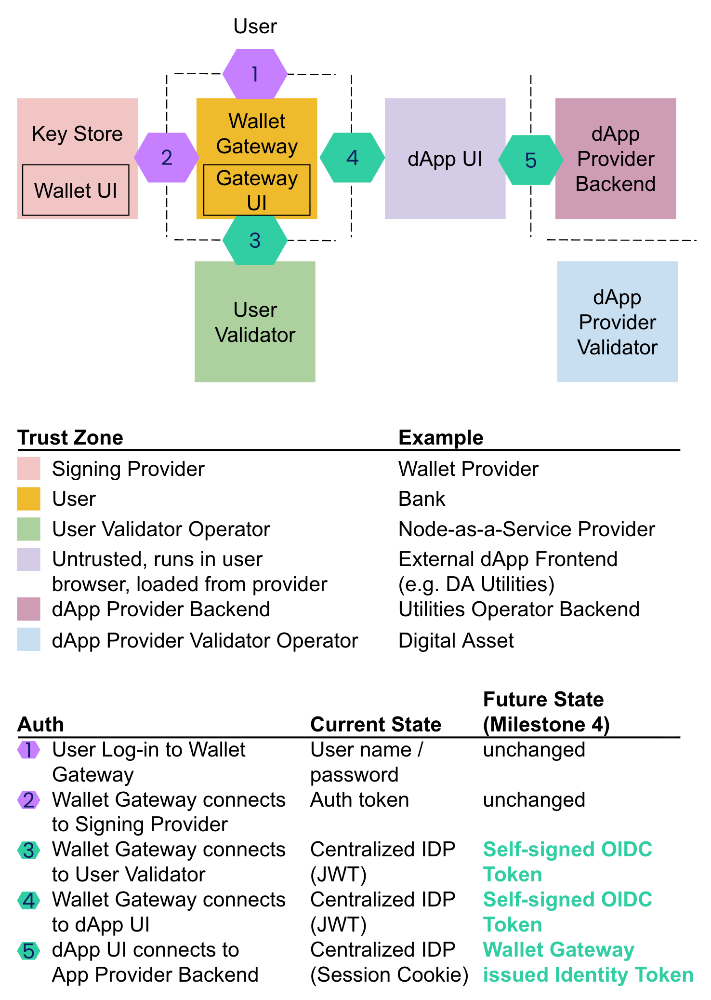

# Development Fund Proposal: Wallet Gateway Reference Implementation 

* **Author**: Digital Asset
* **Status**: Submitted 
* **Created**: 19.03.2026 
* **Category**: Critical Infrastructure / Developer Tooling 
* **Target**: Canton Network Foundation Tech & Ops Committee 
* **Related CIPs**: CIP 0082: Establish a 5% Development Fund (Foundation-Governed), CIP-103: dApp Standard 
* **Related grant proposals**: CIP-01XX Maintenance Grant for Splice Wallet Kernel Open Source, Development Fund Proposal: Open Source Reference Wallet - Splice Portfolio 

---

## 1. Motivation & Rationale 

**Core Value Proposition - The Universal Wallet Router:** From the customer perspective, institutions building on the Canton Network demand three non-negotiable capabilities:
1. **Private Data & Protocol Security:** Guaranteed by their own self-hosted or Node-as-a-Service (NaaS) validator node.
2. **Strict Signing Security:** Governed entirely by their external institutional wallet provider of choice.
3. **Universal Compatibility:** Seamless, out-of-the-box interoperability with all CIP-0103 compliant applications.

The Wallet Gateway acts as the standardized, secure middleware that instantly bridges these three requirements. In a secure enterprise architecture, an untrusted dApp UI cannot directly access private node state or hold raw cryptographic keys. Instead, the dApp securely hands the transaction intent to the Wallet Gateway. The Gateway authenticates the user, securely reads the private contract state from the Validator Node (satisfying Requirement 1), routes the "Clear Signing" authorization request to the external institutional wallet (satisfying Requirement 2), and provides a vendor-neutral API layer for the dApp (satisfying Requirement 3). 

By funding the Wallet Gateway, the Foundation provides an off-the-shelf, open-source enterprise API layer that uniformly solves the problem of how institutions can connect their core cryptographic assets, validator nodes, and institutional dApp workflows.

**The Technical Challenge:** Unlike other Web3 networks, where data is globally readable, Canton Network applications must respect strict data privacy. Consequently, Canton dApps cannot simply read from a public RPC endpoint. They must coordinate reads and writes across entirely separate trust zones:
* **The Untrusted dApp UI:** Loaded from the app provider, running in the user's browser context.
* **The User Validator Node (VN):** Holds the user's private contract state.
* **The Key Storage/Signing Service:** Holds the user's private keys (e.g., Regulated / Institutional Wallets, Hardware Wallets, Mobile Wallets).

**Solution:** The Wallet Gateway deploys securely within the user's trust zone, acting as the ultimate orchestration layer that abstracts the complexity of cross-zone coordination behind a single, vendor-neutral standard (CIP-0103).

**Ecosystem ROI:** 
We request 5.700.000 CC for core engineering, and 1.000.000 CC as a performance-based adoption bonus. This total request of up to 6.700.000 CC is justified by the systematic opportunities and acceleration across five dimensions to boost Canton Network adoption:
1. **Self-Service Institutional Onboarding:** Institutions with complex, bespoke security requirements can use the Gateway to construct their wallet integrations self-service. By providing a standardized "Clear Signing" interface, this allows them to securely manage real-world assets (RWAs) within their established perimeters without requiring high-cost, custom integration cycles for every new dApp (Milestones 1, 2). A substantial cohort of institutional users (names withheld under NDA) are already lined up to benefit from this.
2. **Performance-Based Adoption:** In line with Foundation guidelines, a part of this grant is strictly adoption-based. The 1.000.000 CC integration bounty is paid for verified integrations by institutions (defined as finance organizations of 100+ employees) (Milestone 7). The Foundation takes on zero upfront risk for this allocation.
3. **Accelerated Ecosystem Velocity:** The Gateway decouples the user's signing service from the application's execution environment. By removing bespoke wallet provider support as a prerequisite for connecting users to dApps, developers can ship faster and users can connect using their preferred keys (Milestones 1, 4). The modular open-source architecture reduces redundant engineering for wallet providers and dApps (Milestones 3, 4, 6).
4. **Zero-Trust Safety & Security:** The Gateway elevates baseline web3 security. By implementing self-signed OIDC token generation, granular access controls (Milestones 4, 5), and a cryptographic "Write Review" UI (Milestone 6), the architecture ensures dApps only receive scoped permissions and ensures user intent matches the executed transaction.

---

## 2. Objective & Architectural Specification 

The objective is to deliver a comprehensive reference implementation of the Wallet Gateway, supporting containerized server deployments for enterprise nodes.

**Core API Topology:** The Gateway operates by exposing and consuming four distinct interfaces:
1. **User API (Provided by Gateway, Consumed by Gateway User UI):** Manages Wallet Configuration (Ledger/KeyStore routing), Topology Configuration (viewing/creating allocated parties and namespaces), and explicit Read/Write user reviews. Supports different UI implementations (Mobile vs. Desktop) and to allow the "Write Review" visualizer to fetch data from the Gateway without direct, unmediated access to the underlying Keystore or Ledger secrets.
2. **dApp API (Provided by Gateway, Consumed by dApp UI):** The untrusted interface where dApps authenticate via SAML/OIDC. It proxies read requests to the Ledger API and formats write requests (prepareExecute or prepareReturn) for user review. Thus it acts as a "Privacy Guard." It validates that the dApp is only requesting data the user has scoped via OIDC and transforms complex Ledger responses into dApp-friendly JSON, ensuring the untrusted UI never touches raw, unscoped contract state.
3. **Signing Provider API (Provided by key stores, Consumed by Gateway):** The generic interface for signing providers. Handles authentication, public key listing, and raw signature payload submission.
4. **Ledger API (Consumed by Gateway):** Connects to the user's Validator Node using Self-Issued OIDC credentials to authenticate without relying on centralized Identity Providers.

**Deployment Models** 
1. **Node Operator RPC (Remote Wallet Gateway):** Deployed centrally by a hosting provider alongside the Validator Node (the focus of the MVP). It will be delivered as a NodeJS server containerized via Docker. This allows enterprise operators to co-locate the Gateway with their Validator Node in a controlled environment. This deployment model supports multi-tenancy, allowing multiple users to be served per instance.
2. **Local Browser Engine (Extension Wallet Gateway):** While the Gateway can run remotely via Docker, the core routing logic, CIP-103 dApp API server, and key authorization flows will also be packaged as a browser-compatible library. This ensures that ecosystem developers (such as the team to deliver Development Fund Proposal: Open Source Reference Wallet - Splice Portfolio) can seamlessly embed the Gateway middleware directly into their local background scripts, providing a localized trust zone without requiring the user to spin up a Docker container.

**Clear Signing:** 
A core technical deliverable of this grant will be to define and implement the architectural standards for "What You See Is What You Sign" (Clear Signing). The grant will explicitly research and address how to cryptographically guarantee that the transaction payload presented to the user in the visualizer perfectly matches the hash submitted to the KeyStore API, mitigating UI-spoofing attacks.

**Open Source Licensing & Decentralization:** 
These components are provided as a common good in line with ecosystem development fund. All core Gateway logic, Keystore driver interfaces, and the finalized CIP-0103 server implementation will be released under the **Apache 2.0 License**. This provides the source code to external wallet providers who can utilize, fork, and adapt the foundational toolkit without proprietary friction.

---

## 3. Implementation Mechanics 

The Wallet Gateway strictly isolates the untrusted dApp from the key material. The dApp UI (served by the app provider, running in a browser) is inherently less trusted by the user than the Gateway (running in a secure VPC, or a trusted local setting). The Gateway acts as the routing engine between the UI, the Validator Node, and the KeyStore.

Crucially, the Gateway is designed for "Bring Your Own Validator" (BYOV) routing. The Gateway Administrator can configure transaction execution to route through the user's personal validator, the wallet provider's validator, or the dApp's hosted validator, provided the user's party is hosted on the target validator node. 

The dApp API enables the dApp UI to send commands to the Gateway, which prepares the transaction on the target validator node, presents it via the Transaction Visualizer, and, upon approval, routes the hash to the KeyStore API (supporting Institutional drivers, and retail drivers). The Gateway then submits the final transaction to the Ledger API.

**Illustration: Wallet Gateway** 

**Takeaways:** 
* Wallet Gateway as secure orchestrator for communication and authentication across isolated trust zones.
* Proposed transition from centralized IDP to self-sovereign authentication OIDC (Milestone 4).

**Execution Workflow Details:** 
> **Note:** Flow structure does not follow milestone structure. Some parts of the flow are not required for an MVP (Milestone 1) and are additional features developed later.

* **Authentication & Scoping (Milestone 4 & 5):** The untrusted dApp initiates a connection. The Gateway issues a scoped, self-signed OIDC token that explicitly restricts the dApp's read/write access to strictly defined data sets on the Validator Node.
* **Command Construction (Milestone 1):** The dApp UI constructs a command and sends a `JsPrepareSubmission` (i.e. the command that converts a human-readable dApp request into a machine-readable Canton transaction.) request to the Gateway via the CIP-0103 dApp API.
* **LAPI Transaction Preparation (Milestone 1):** The Gateway routes this intent to the configured target Validator Node via the Ledger API (LAPI). The Node evaluates the contract logic and returns a prepared, deterministic transaction payload back to the Gateway. The Gateway prepares the transaction on the Validator Node.
  * Alternative flow: the dApp prepares the transaction.
* **Human-in-the-Loop Review & Clear Signing (Milestone 6):** The Gateway extracts the transaction details from the prepared payload. Utilizing the standardized TX Schema, it presents the state changes via the Transaction Visualizer (Write Review UI). This cryptographically blocks Keystore submission until explicit, human-verified approval is logged.
* **Keystore Submission (Milestone 2):** Upon user approval, the Gateway sends the hash and optionally payload to the KeyStore API. Natively supported wallet gateway drivers will include:
  * **Institutional:** At least two major institutional grade wallet providers.
  * **Retail, Testing, & Ecosystem Wallets:** Powered by the Gateway's built-in Discovery Component, the infrastructure seamlessly interoperates with all CIP-0103 compliant wallets. For immediate developer utility and rapid local testing, it also ships with native reference drivers for Local Passkey-based wallets, Paper Keys (browser-stored), and External Keys (via local CLI script copying).
* **Ledger Submission (Milestone 2):** The Gateway receives the signature from the Keystore and submits the final, signed transaction payload back to the Ledger API for network sequencing.

---

## 4. Milestones and Deliverables 

### **Milestone 1: Early Trading MVP Support** 
Establishing the foundational API architecture, containerized deployment, and initial institutional connectivity required for MVP trading flows.
* **Reusable User API:** Delivery of reusable core wallet API. 
  * *Acceptance:* Demonstrable network separation between the User API (powering the trusted UI) and the dApp API.
* **dapp API-Server (CIP-0103):** Delivery of the server-side CIP-0103 dApp API. API endpoints supporting inbound pre-prepared LAPI transaction payloads and outbound signed-transaction submission hand-offs. 
  * *Acceptance:* Successful end-to-end execution of a `JsPrepareSubmission` flow initiated by the current `dapp-sdk`, resulting in a valid LAPI-prepared transaction payload ready for KeyStore signing.
* **Authentication (Centralized IDP):** Implementation of standard Ledger API authentication. To rapidly unblock the MVP, this initial release will rely on traditional, centralized Web2 Identity Providers to manage user authorization and Ledger API connectivity. 
  * *Acceptance:* Successful authentication and connection to the Ledger API using a standard JWT issued by a centralized IDP.
* **Party Support (Internal/External Parties):** The infrastructure automated routing of transaction hashes to Keystore API (external) or local Validator (internal) signing modules based on party metadata. To adhere to zero-trust security models, internal parties (where keys are held directly by the Validator Node) are supported strictly for development and rapid testing environments. Production deployments benefit from the use of external parties, ensuring cryptographic assets remain fully isolated within the user's chosen KeyStore. 
  * *Acceptance:* Verified via automated tests, successfully allocating and listing both party types on a local validator.
* **Containerized Deployment:** Delivery of the "Remote Wallet Gateway" as a Docker image. 
  * *Acceptance:* Delivery of the "Remote Wallet Gateway" as a containerized NodeJS server (Docker image) capable of co-location with a Validator Node.
* **Battle-Testing:** Proving the Gateway can handle production-level traffic and providing a live, visible example of the implementation. 
  * *Acceptance (Public Good):* Production of verifiable Ledger submission logs for 10 consecutive, unique transaction types via a fully open-source dApp UI example, providing a verifiable reference implementation for the Canton developer community.
  * *Voluntary Bonus Acceptance (Enterprise Scale):* While the funding requested in this grant strictly covers the Gateway development and the open-source reference integration. It does not subsidize the integration work into DA's non-OSS commercial code). Still we commit to voluntary validation not covered by grant funding via integration into Digital Asset's commercial registry frontend (utilities.digitalasset.com) to serve as the production-grade "Battle Test".
* **Initial Institutional Adapter:** Delivery of the first institutional KeyStore driver designed to plug-and-play with external institutional wallets. 
  * *Acceptance:* Demonstrated compatibility with an institutional 'Clear Signing' engine via the KeyStore API.
* **Developer Documentation:** Publication of technical integration documentation. 
  * *Acceptance:* API schema and integration markdown files published to the repository (User manuals excluded).
* **Internal Security Architecture Review / Internal Audit:** Documented sign-off from DA Core Engineering. 
  * *Acceptance:* Documented sign-off from DA Core Engineering confirming the MVP API architecture and container network boundaries meet initial Canton security standards.
* **Code Quality (MVP):** CI/CD pipelines must report:
  * At least 80% Unit Test coverage.
  * At least 50% E2E test coverage specifically mapped to critical transaction routing flows. Provision of comprehensive E2E Integration Logs.
* **Basic clear signing:** write-review during the transaction submission process. 
  * *Acceptance:* The user is presented with the transaction payload prior to signing the transaction hash.

### **Milestone 2: Matured Version (MLP)** 
Expanding institutional connectivity, hardening test coverage across all drivers, and delivering user-facing documentation for production readiness.
* **Production Institutional Signing Drivers:** Delivery and integration of production-ready signing drivers for major institutional wallet providers, fully leveraging the driver framework established in Milestone 1. 
  * *Acceptance:* E2E integration logs demonstrating successful transaction signing via at least one distinct institutional infrastructure provider. This validates the multi-vendor scalability of the Gateway and secures out-of-the-box compatibility for institutions.
* **Multi-Session Support:** Implementation of concurrent user handling. 
  * *Acceptance:* Automated test execution proving a single Gateway instance can concurrently handle two distinct user sessions without state bleed.
* **UI/UX & Canton Ecosystem Branding:** Update of the Gateway interface to adhere to Canton Foundation guidelines. 
  * *Acceptance:* Visual review and sign-off by a Foundation designated UI/UX representative.
* **User Documentation:** Delivery of comprehensive end-user materials. 
  * *Acceptance:* Publication of a UI user manual and at least one step-by-step video walkthrough for standard setup.
* **External Security Audit:** Delivery of a finalized security audit report from an independent, reputable Web3 security firm covering the core Gateway architecture and CIP-0103 implementation. 
  * *Requirement:* All findings classified as "Critical" or "High" must have a verifiable patch merged into the `main` branch.
* **Code Quality:** CI/CD pipelines must report maintaining:
  * At least 80% Unit Test coverage.
  * At least 80% E2E test coverage that explicitly includes all institutional driver flows.

### **Milestone 3: Browser Extension Deployment Capability** 
Repurpose the Gateway’s core routing logic and CIP-103 API server to run entirely locally within a browser context, serving as the foundational background engine for ecosystem Reference Wallets (e.g. Development Fund Proposal: Open Source Reference Wallet - Splice Portfolio).
* **Browser-Extension-Compatible Gateway Engine:** Delivery of the core Wallet Gateway components packaged as a localized, browser-compatible library (e.g., NPM package). This involves migrating enterprise server dependencies to Web-native equivalents (e.g., WebCrypto API) to ensure execution within Manifest V3 background service workers. 
  * *Acceptance:* Automated CI/CD logs demonstrating successful compilation of the Gateway logic into a browser-compatible artifact.
* **Local dApp API Server (CIP-103):** Implementation of the dApp API server capable of running locally in the browser to accept connections from web-based dApps without routing through a remote Docker instance. 
  * *Acceptance:* Verifiable automated tests executing a `JsPrepareSubmission` flow exclusively within a browser-sandboxed environment, proving the local engine can independently administer connections to the KeyStore and Ledger APIs.

### **Milestone 4: Decentralized Identity (OIDC)** 
Upgrading the baseline authentication established in Milestone 1 by removing reliance on centralized Identity Providers (IDPs), enabling trustless, decentralized Ledger API connectivity.
* **Self-Signed Token Issuance (Auth):** Replacing the Auth0/Entra dependency from Milestone 1 through the implementation of an internal Identity Provider (IDP). This engine generates Self-Signed OIDC tokens using the user's primary cryptographic signing key. 
  * *Acceptance:* E2E integration logs demonstrating a successful transaction submission to the Ledger API where the authentication token is generated and signed locally by the user's Keystore, operating entirely without routing through or requiring uptime from a 3rd-party IDP.
* **Cryptographic Validation Logic:** Implementation of the logic enabling the Gateway to authenticate directly with the Ledger API using these self-generated credentials. 
  * *Acceptance:* Automated test execution confirming the Gateway correctly validates the self-signed OIDC token's signature against the user's public key prior to Ledger API submission.

### **Milestone 5: Access Rights Management** 
Implementing granular, privacy-preserving data access controls between the untrusted dApp and the Gateway.
* **Scoped Token Issuance:** Upgrading the auth module to issue scoped OIDC tokens. 
  * *Acceptance:* Automated tests proving the Gateway issues tokens that strictly limit a dApp's access to specifically defined data sets on a validator.
* **Read Review Authorization:** Delivery of a user-facing data access screen. 
  * *Acceptance:* Functional visual component that accurately presents the dApp's requested data scope to the user, requiring explicit human approval before the scoped token is released to the dApp.

### **Milestone 6: Transaction Visualization & Write Review Standard** 
Standardizing human-in-the-loop transaction approvals and solving the cryptographic Clear Signing challenge.
* **TX Schema Standard:** Definition of a standardized schema for transaction UI rendering. 
  * *Acceptance:* Publication of the schema documentation and verifiable adoption in the Gateway's parsing logic.
* **TX Visualization:** Delivery of modular TX Visualizer components handling Read Connect and Write Reviews, addressing the need for Clear Signing. 
  * *Acceptance:* Publication of the Clear Signing documentation detailing the specific cryptographic boundary and mitigation strategies ensuring the visual output of the Write Review UI exactly matches the hash submitted to the Keystore.
* **Write Review UI (Visualizer):** Delivery of the human-in-the-loop confirmation screen. 
  * *Acceptance:* Functional UI component that accurately parses the `JsPrepareSubmission` payload, translates the standardized TX schema into human-readable state changes, and cryptographically blocks Keystore submission until explicit user approval is logged.

### **Milestone 7: Institutional Adoption Bounty** 
Driving verifiable, institutional adoption by actively integrating the Wallet Gateway for both net-new institutions entering the Canton ecosystem and existing participants migrating off legacy setups.
* **Strategic Integration & Enablement:** Integrating Financial Institutions, whether they are deploying Canton infrastructure for the first time or migrating from bespoke legacy setups, requires precise architectural execution. Leveraging Digital Asset's proven enterprise deployment expertise, our team will execute these complex integrations alongside the target banks, crypto institutions, and FMIs. By eliminating the technical friction of adoption, we enable the rapid onboarding of high-value participants and net-new liquidity into the Canton ecosystem.
  * *Note:* This high-touch, hands-on, bespoke integration support is distinct from codebase maintenance (see separate maintenance grant proposals). 
  * *Acceptance Criteria (Performance-Based):* Verification that a Wallet Gateway was successfully integrated in a production or staging environment for two financial institutions. To align with the Foundation's risk-mitigation protocols, this is structured as an adoption bounty.
  * *Note:* While DA targets to support a substantial number of institutions to integrate, we expect only a very small fraction of those to agree on verification towards the foundation.

### **Timeline Risk Management & Upstream Dependencies:** 
The Wallet Gateway relies on specific upstream network dependencies (e.g., core Canton node topology updates, LAPI modifications, and CIP-0103 standard finalizations). Should any critical upstream dependencies be delayed by core network maintainers, the Gateway timeline will pause without incurring SLA penalties. Alternatively, to maintain development velocity and unblock subsequent milestones, the Gateway engineering team may choose to mock the delayed dependencies via temporary internal APIs until the upstream blockers are officially resolved and merged by the core maintainers.

### **Ongoing Maintenance vs. Institutional Integration Support:** 
The funding requested in this proposal is strictly tied to the strategic value, structural capabilities, and tangible deliverables achieved across the defined milestones. It does not request funding for routine operational maintenance. Upon the successful completion of Milestone 2, the day-to-day codebase maintenance of the Wallet Gateway and associated SDKs (including security SLAs, bug fixes, CI/CD pipeline management, and external PR reviews) will seamlessly roll into the purview of the active 2026-Maintenance Grant for Wallet Kernel Open Source. Note that maintenance is distinctly separate from the active institutional integration support (Milestone 7).

---

## 5. Funding & Financial Architecture 

**Total Funding Request: 6.700.000 Canton Coin (CC)** 

| Milestone | Target deadline | Funding Request |
| :--- | :--- | :--- |
| **Milestone 1: Early Trading MVP Support** | April 30th 2026 | 800.000 CC |
| **Milestone 2: Matured Version (MLP)** | May 31st 2026 | 900.000 CC (including the external security audit) |
| **Milestone 3: Local Deployment Capability and Browser Engine:** | June 30th 2026 | 800.000 CC |
| **Milestone 4: Decentralized Identity (OIDC)** | August 31st 2026 | 1.600.000 CC |
| **Milestone 5: Access Rights Management** | October 31st 2026 | 800.000 CC |
| **Milestone 6: Transaction Visualization & Write Review Standard** | October 31st 2026 | 800.000 CC |
| **Milestone 7: Institutional Adoption Bounty** | December 31st 2027 | 1.000.000 CC |
| **Total** | | **6.700.000 CC** | 

> **Note:** development of milestones might run in parallel depending on dependencies. Hence, some times between deadlines do not directly correspond to requested CC amount.

**Timeline Accountability (SLA Penalties & Acceleration):** 
* **Acceleration Bonus:** If Milestone 5, 6 acceptance criteria are met, audited, and approved 30 days prior to the Estimated Delivery date, i.e., October 1st, a +20% bonus of the payout of those milestones will be awarded (320.000 CC).
* **Late Penalty:** For every 15 days of delay beyond the estimated delivery dates for any milestone, the payout for that specific milestone will be reduced by 5%, capped at a maximum 20% penalty per milestone.

---

## 6. Co-Marketing 

Upon release, the proposing entity will collaborate with the Foundation on:
* A technical case study detailing the successful onboarding of a Tier 1 institutional pipeline utilizing the new wallet integrations. Pending approval of a Tier 1 institution for publication. Otherwise, an illustrative example integration case study will be published.
* A Developer Workshop centered around the Wallet Gateway and CIP-0103 standard integration, providing a reproducible template for other Canton builders.

