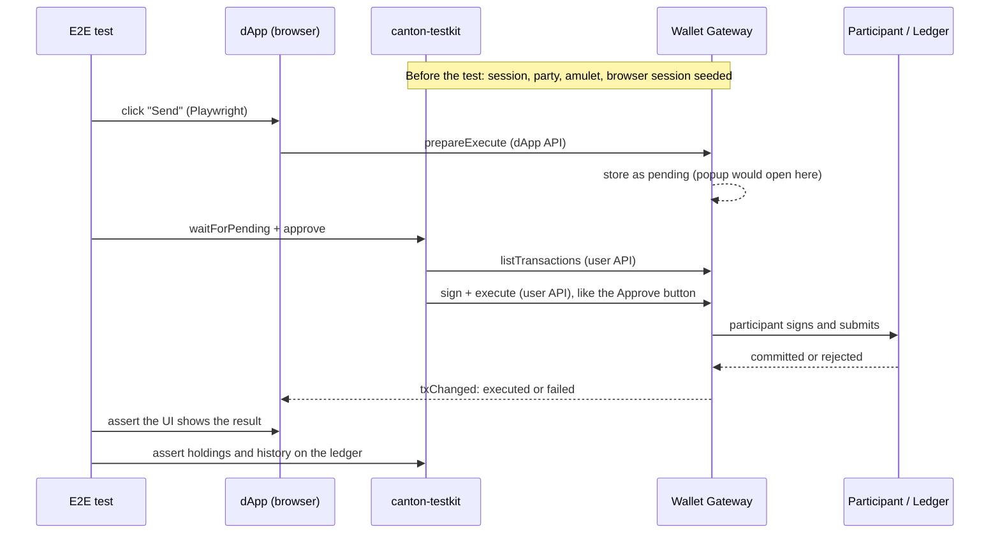

# Development Fund Proposal: canton-testkit

| Field | Value |
| :---- | :---- |
| Authors | Pablo Fullana <pablo@bootnode.dev> |
| Org | [BootNode](https://bootnode.dev) |
| Status | Draft |
| Created | 2026-10-08 |
| PR | [TBD] |
| Proposal Type | RFP-aligned |
| RFP / Roadmap Area | RFP-18: Integration into SDLCs (Developer Experience, Tooling & Education) |
| Champion | Needs Champion |
| Total Funding Request | 702,000 CC |
| Project Duration | ~12 weeks |
| Label | dapp-integration |

---

## Abstract

**canton-testkit** is a Testing Framework for applications built on Canton. It lets a team test a Canton app end-to-end, using a real wallet and a real ledger, without building the scaffolding required today: getting a token and a wallet session, creating parties, waiting for the ledger to confirm them, funding them with amulet, writing the code that signs and executes each transaction, and, for UI tests, getting the browser into an already connected state.

The value to the ecosystem is a tested, maintained path from "my dApp runs" to "my dApp is covered by end-to-end tests." It targets the same developer-experience gap that dAppBooster ([PR #390](https://github.com/canton-foundation/canton-dev-fund/pull/390)) addresses for building a Canton dApp, now applied to testing one. It lowers the cost of shipping production-quality dApps for every team on the network.

---

## Specification

### 1. Objective

Give teams building on Canton a single, reusable way to write end-to-end tests for their dApp, covering the full path from party setup, to wallet-signed transactions, to ledger assertions, so that end-to-end testing becomes a simple, low-cost step in the Canton development lifecycle instead of bespoke per-project plumbing.

This maps directly to RFP-18, Integration into SDLCs, which asks for tooling that integrates Canton development into existing software development lifecycles, including testing frameworks. Today every team rebuilds the same harness against the wallet gateway and ledger APIs. canton-testkit turns it into a published, maintained library.

The proposal has a single objective: a reusable end-to-end testing library for Canton dApps, and its adoption by real test suites. Milestone 1 builds it; Milestone 2 proves real projects use it.

### 2. Implementation Mechanics

**canton-testkit** runs entirely over APIs. It talks to the Wallet Gateway through its user and dApp JSON-RPC interfaces, and to the ledger through the official @canton-network/wallet-sdk.

The library imports no test runner, **so it drops into any runner.** (Playwright, Cypress, etc.)

Using the gateway's APIs and the wallet SDK, it gives a test a small set of building blocks to combine:

**Execute a transaction end-to-end, without requiring a UI.** The primary capability. A test proposes a command via the gateway `dApp` API (prepareExecute); the library polls the user API (listTransactions) until the pending transaction appears, then signs and executes it via the `user` API (sign -> execute).

**Create parties and users.** Creates a party and verify it actually exists on the ledger before returning it (polling the participant), rather than assuming creation succeeded. A "user" is a gateway session, one wallet connection, that can act as one or more parties. Parties are created with the participant as their signing provider, so the node signs on request, which is what makes headless execution possible.

**Interact with amulet and the ledger state.** Ledger fixtures set up and read state directly: mint amulet to a party (tap), fund the validator operator party, resolve the validator party, and read a party's holdings and transaction history to assert balances and effects.

**Verify the environment before a run.** The gateway's API sometimes changes between releases: while validating this proposal, BootNode saw a method gain a required parameter in a minor version. So the library ships with a `doctor` command that checks the developer's stack before the tests run and identifies what does not match. It checks that the gateway, ledger, validator and scan are reachable and correctly configured, that a token can be minted, and that a mining round is open (reporting when the next one opens if it is not). Each release also states the gateway and Splice versions it was tested with.

#### Where canton-testkit sits in a dApp transaction

Here the test proposes the command itself, standing in for the dApp. In a UI test the dApp proposes it, as in the diagram below.



#### Examples

##### Configuration

The configuration file says where the network is and what the tests need from it. This is the default:

```ts
// canton.config.ts
import { defineConfig } from 'canton-testkit'

export default defineConfig({
    network: 'canton:localnet',
    gateway: 'http://localhost:3030',
    ledger: 'http://localhost:2975',
    validator: 'http://localhost:2903/api/validator',
    scan: 'http://scan.localhost:4000/api/scan',

    users: {
        merchant: { parties: ['issuer', 'alice'] },
        customer: { parties: ['bob'] },
    },
    amuletPerParty: '10000',
})
```

##### Exercise example

```ts
import {
  localNetConfig, assertEnvironment, authenticate,
  createParty, waitForPending, approve, connectLedger,
} from 'canton-testkit'

const config = localNetConfig()

// 1. Fail fast if the environment is not ready.
await assertEnvironment(config)

// 2. Open a gateway session (dev self-signed auth) and create a party the node signs for.
const session = await authenticate(config)
const alice = await createParty(config, session, { hint: 'alice' })

// 3. Set up and read ledger state directly.
const ledger = await connectLedger(config)
await ledger.tap(alice.partyId, '100') // mint amulet to the party

// 4. Propose a command through the dApp API, then sign and execute it headless.
const commandId = crypto.randomUUID()
await session.dappApi.call('prepareExecute', {
  commandId, actAs: [alice.partyId], commands: [/* Daml command */],
})
const pending = await waitForPending(session, commandId)
await approve(session, pending.transactionId, alice.partyId)

// 5. Assert the effect on the ledger.
const history = await ledger.transactions(alice.partyId)
```

##### Transfer example

```ts
import { setup } from 'canton-testkit'

const canton = await setup()

test('a transfer reaches its recipient', async () => {
    const { alice, bob } = canton
    const before = await bob.balance()

    const tx = await alice.transfer({ to: bob, amount: '25' })
    await alice.approve(tx)

    expect(await bob.balance()).toEqual(before + 25)
})
```

#### Scope and assumptions

**canton-testkit** verifies the environment, it does not provision it. It expects a running stack (a Splice LocalNet, the wallet gateway, and the dApp under test) and checks that it is healthy before a run. It won't start LocalNet, spawn the gateway, or launch the dApp.

Authentication is scoped to development networks. For gateway sessions and ledger access the library uses self-signed credentials: a token minted by the gateway plus a self-signed ledger JWT, the mode a LocalNet-style participant is configured to accept. This is intentional. The kit targets local and CI test networks, not production, therefore, it does not try to stand in for a real identity provider.

Signing is hosted-party, by design. Parties are created with the participant as their signing provider, so the node signs on request and a transaction is approved with no wallet software in the loop. External-party signing, where the key belongs to the user, is detected and rejected with a clear message rather than silently mishandled. Supporting it from a test is out of scope for the first version.

Browser wallets and WalletConnect are **out of scope**. In both the wallet holds the parties itself, as external parties, so a test would have to interact with one specific wallet through a tool like Playwright rather than through an API. To keep this proposal's scope and risk contained, they are deliberately deferred and will be brought as a separate follow-on proposal by BootNode.

### 3. Architectural Alignment

**canton-testkit** is a thin layer over interfaces the Canton ecosystem already ships. It drives the Wallet Gateway through its `user` and `dApp` JSON-RPC APIs and reads and funds the ledger through the official `@canton-network/wallet-sdk`, adding and forking nothing. The `connect`, `session`, `sign` and `execute` flow it exercises is the `CIP-0103` flow, so a test covers the real standard interaction a dApp performs, run against a Splice LocalNet with amulet and scan, the same environment the Foundation ships for local development. Because it tests through the standard surface rather than any one implementation, any dApp built with `CIP-0103` is testable by the same kit.

It maps to RFP-18, Integration into SDLCs, and complements rather than duplicates the wallet-facing testing already funded (the dApp SDK and wallet compliance suites): those verify a wallet conforms to the standard, while **canton-testkit** lets a dApp team test their own application end to end against a conformant wallet and ledger.

### 4. Backward Compatibility

No backward compatibility impact. **canton-testkit** is a new, standalone library used only in test code. It consumes the Wallet Gateway APIs and the official wallet SDK as they are, and changes nothing in the protocol, the gateway, the SDK, or the dApps under test. Adopting it adds a dev dependency and touches only a team's test suite.

---

## Milestones and Deliverables

### Milestone 1: canton-testkit 1.0

- **Estimated Delivery:** ~9 weeks
- **Focus:** Productize the e2e testing library into a version a team can install and rely on: a published and documented 1.0. It ships the library as described above, with a configuration file and a `setup()` entry point, named users that each hold their own session, parallel runs that do not interfere, browser session seeding, transfer and preapproval flows. The same operations are also exposed as a command line, so a developer can prepare, inspect and fix the environment from a terminal without writing a test, and a coding agent can drive it through `--help` and `--json` parameters.
- **Deliverables / Value Metrics:**
    - canton-testkit 1.0, published to npm.
    - A `doctor` environment check.
    - Config-driven party fixtures, isolated and parallel.
    - An act-as transaction API (transfers, offers, preapprovals).
    - Assertion helpers for balances, contracts and effects.
    - A `seedSession` API for browser tests.
    - A CLI with `--help` and JSON output.

### Milestone 2: Proving it on real test suites

- **Estimated Delivery:** ~3 weeks
- **Focus:** Prove that the library replaces real setup code in real repositories, measured in lines removed and tests kept green.
- **Description:** Two consumers outside this project. First, the example dApp built in `dAppBooster for Canton`. Second, and most important, the `ping` and `portfolio` example dApps in the Foundation's wallet repository. Today, their suites prepare every test by clicking through the gateway's UI: connecting, creating wallets, setting the primary party, tapping amulet, and approving each transaction in the popup. That preparation is replaced with **canton-testkit**, and the tests keep asserting on their own interface. Tests whose subject is the gateway's UI itself, such as the `wallet picker`, the `popup lifecycle`, `multi-session` behaviour, `gateway settings` and `external signing`, are left as they are, since that is what they are meant to check.
- **Deliverables / Value Metrics:**
    - The dAppBooster example dApp tested with canton-testkit.
    - A pull request to the wallet repository rewriting the setup of the `ping` and `portfolio` suites, with all tests passing.
    - A short report on what the rewrite surfaced: gaps in the library, and gateway behaviours worth raising upstream.
    - A walkthrough session with the wallet repository maintainers at Digital Asset, held before the pull request is reviewed: what changed in the ping and portfolio suites and why, how canton-testkit does what the removed setup did, and how to extend the suites with it from then on.

---

## Acceptance Criteria

The Tech & Ops Committee will evaluate completion against the following. Each milestone can be evaluated and paid out independently.

1. **Milestone 1** is accepted when **canton-testkit** 1.0 is published and a developer outside the team can, following only the README, install it and get a passing end-to-end test against LocalNet. The signal is adoptability by an outside team, not the presence of code.
2. **Milestone 2** is accepted when the kit is proven to cover real dApps: the dAppBooster example is tested end-to-end with **canton-testkit**, and a pull request rewrites the Foundation wallet repository's `ping` and `portfolio` end-to-end suites on the kit, with all tests passing and their setup removed, accompanied by a report of the library gaps and gateway behaviors found during the rewrite, and by the walkthrough session with the maintainers described in Milestone 2. The signal is real suites running on the kit and the duplicated setup they retire, and the maintainers able to keep working on those suites without us.

Documentation and knowledge transfer sessions for each milestone are part of its acceptance. Payment is released on the Committee's acceptance of that value.

---

## Funding

**Total Funding Request:** 702,000 CC

### Payment Breakdown by Milestone

- Milestone 1 (**canton-testkit** 1.0): 528,000 CC, released on Tech & Ops Committee acceptance of the Milestone 1 criteria.
- Milestone 2 (proving it on real suites): 174,000 CC, released on Tech & Ops Committee acceptance of the Milestone 2 criteria.

Payments are released on Committee acceptance only. No funds are requested upfront or retroactively.

### Volatility Stipulation

The grant is denominated in fixed Canton Coin. The project runs about 12 weeks, under 6 months. Should the timeline extend beyond 6 months due to Committee-requested scope changes, any remaining milestones will be renegotiated to account for significant USD/CC price volatility.

---

## Co-Marketing

Upon the 1.0 release, BootNode will coordinate with the Canton Foundation on:

- A joint announcement.
- A technical blog post on testing Canton dApps end-to-end, covering the API-first approach and integration patterns.
- A walkthrough video covering a dApp with canton-testkit, from install to a passing end-to-end suite.
- An updated entry in the Canton developer documentation linking to the library and the worked examples (portfolio and dAppBooster).

---

## Motivation

Every team building a dApp on Canton hits the same wall when it goes to test end to end. There is no shared way to create and fund parties, open a wallet session, submit and sign a transaction, and assert the resulting ledger state from a test. So teams either skip end-to-end coverage or build a bespoke harness against the wallet gateway and ledger APIs, and then rebuild a version of it on the next project.

The Canton Foundation's own reference dApps carry exactly this kind of hand-written setup. The shared helper they rely on, `core/wallet-test-utils`, is a private workspace package tied to Playwright, and it prepares each test by clicking through the gateway's UI: connecting, creating wallets, switching the primary party, approving in the popup. It is the closest thing to a solution today and the starting point for this proposal, but nobody outside that repository can install it, and anyone on Cypress or a plain Node runner cannot use it at all. **canton-testkit** does the same preparation entirely through APIs, the gateway's JSON-RPC interfaces and the published wallet SDK, so it needs no browser and no particular test runner: the developer keeps whichever they already have. It is published to npm as a dev dependency for any team to use. Until then, the plumbing gets written again and again, and the tests that would catch real regressions often do not get written at all.

This is the same developer-experience tax that dAppBooster ([PR #390](https://github.com/canton-foundation/canton-dev-fund/pull/390)) removes for building a Canton dApp, now applied to testing one. It maps to RFP-18, Integration into SDLCs, whose remit is exactly testing frameworks and CI integration.

**Expected adoption:** every team building a CIP-0103 dApp is a potential user, and the surface is immediately familiar to developers arriving from Ethereum, where wallet-driven end-to-end testing is standard practice. A published, maintained kit lets those teams add end-to-end coverage in an afternoon instead of a sprint, raising the floor of quality for production dApps across the network.

---

## Rationale

**Why API-first rather than driving the wallet UI.** The obvious way to test a dApp end-to-end is to automate the wallet popup with a browser driver, the way Synpress does for MetaMask on Ethereum. **canton-testkit** deliberately does not. The wallet popup is a client of the gateway's `user` and `dApp` JSON-RPC APIs, so everything the `Approve` button does can be done over HTTP: propose, find the pending transaction, sign, execute. Driving those APIs directly is faster, milliseconds rather than a rendered click, and stable, a versioned contract rather than a DOM that moves between releases. A UI driver is still useful for third-party wallets that expose no API, so it stays on the roadmap as a separate concern, but the core of the kit is the API path.

**How it fits the existing tooling, and why it is not a duplicate.** The Canton ecosystem already funds testing work, on a different axis. The dApp SDK proposal ([canton-dev-fund #69](https://github.com/canton-foundation/canton-dev-fund/issues/69), approved) and the Wallet Provider Compliance Test Suite ([canton-network/wallet #1759](https://github.com/canton-network/wallet/issues/1759), open) verify that a wallet conforms to CIP-0103; they are wallet-provider-facing. The DPM Ledger Operations and Reproducible Testing Suite ([canton-dev-fund #520](https://github.com/canton-foundation/canton-dev-fund/issues/520)) works at the ledger and CLI level, with no UI and no wallet. **canton-testkit** sits in the gap between them: it is dApp-builder-facing, and it tests a team's own application across the full dApp-to-wallet-to-ledger path. Those efforts and this one meet at the same wallet gateway APIs, from opposite sides.

**Why not extend what exists. Two of these are the wrong layer to extend:** [PR #520](https://github.com/canton-foundation/canton-dev-fund/issues/520) has no wallet or UI path to build on, and the compliance suites answer a different question (is this wallet correct) than the one a dApp team asks (is my application correct). The closest shared code is the wallet's own test utilities, which today are unpublished and coupled to the gateway's DOM. Rather than fork them, BootNode will coordinate with the maintainers so that the API-first machinery this kit needs and the Wallet Provider Compliance Test Suite ([canton-network/wallet #1759](https://github.com/canton-network/wallet/issues/1759)) share a base where they overlap, both speaking the gateway API rather than the UI. The proposal consumes the published wallet SDK and the gateway APIs, and adds no protocol and no fork.

---

## Maintenance

- All code produced under this grant is published open source (MIT licensed).
- Contributions are welcomed via GitHub Issues and PRs.
- Each release states the gateway and Splice versions it was tested against, so adopters know what a version is known to work with.
- Through Milestone 2, while rewriting the portfolio and dAppBooster suites, BootNode triages issues and ships fixes, and the gaps found are documented in the Milestone 2 report.
- Maintenance beyond the funded work is intentionally not part of this proposal; if adoption warrants it, continued maintenance will be brought as a separate grant.

---

## Why BootNode?

BootNode is a high-trust engineering collective partnering with founding teams, foundations, and protocols to build, launch, and scale Web3 products. Our team of engineers has been building Web3 products together **since 2017**, with 30+ dApps shipped across the Ethereum ecosystem.

On Canton, BootNode built **dAppBooster for Canton** (canton-dev-fund #390), the full-stack dApp starter, whose Milestone 1 the Tech & Ops Committee has accepted and paid. We ship the way the ecosystem does: **canton-barebones** is published as a `dpm` component, and we contribute upstream to the **canton-network/wallet** repository, including its end-to-end test suites, which is where the need canton-testkit addresses first surfaced. This proposal continues work BootNode is already doing on Canton, not only on EVM.

Major projects we have contributed to include **Safe Wallet, MakerDAO, Aave, Derive Finance, Open Intents Framework, Eigenlayer, Nexus Mutual, and Uniswap**. We were a **core contributor to Safe** (Gnosis Safe) in earlier years, shipping work on the Safe React App, the Safe Apps SDK, and the Safe Apps ecosystem. We have shipped on **POA Network** (EVM bridges, Proof-of-Authority validator-set governance App, Token Wizard) and continued through its pivot into **xDAI Chain**, which became **Gnosis Chain** (Unified Bridge + Explorer, Gnosis Pay, Cow Protocol, and others). Recent engagements include **Infinex, Wormhole, and the Open Intents Framework** (funded by the Ethereum Foundation). More case studies are at [bootnode.dev/case-studies](https://www.bootnode.dev/case-studies).

The contribution model is consistent across these engagements: an interdisciplinary POD team that takes full ownership of the work from ideation through adoption, partnering with the organization rather than acting as an external vendor.

### Aligned incentives

BootNode routinely accepts project tokens as a portion of compensation, and at times, the full payment is in tokens. The intent is long-term alignment: BootNode succeeds when the project succeeds, and our work directly contributes to the token's utility rather than being treated as a one-shot deliverable.

### Direct analog: wallet-driven end-to-end testing on EVM

BootNode's end-to-end testing experience comes from the EVM ecosystem, where wallet-driven e2e testing is standard practice, and from building dAppBooster itself, the stack canton-testkit is designed to test. canton-testkit applies that experience to Canton and CIP-0103, with the same team and the same developer-experience conventions.
