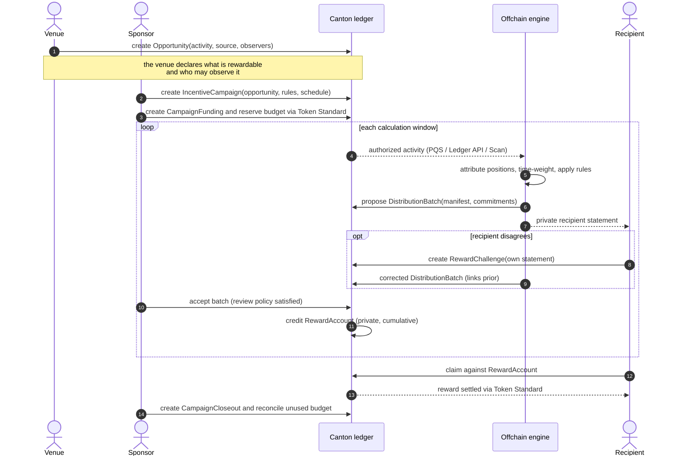

# Canton Reward Engine

| Field | Value |
| :---- | :---- |
| Organization | R13N Labs |
| Author / Primary Contact | @ethan-r13n |
| Status | Draft |
| Created | 2026-08-18 |
| Label | defi-liquidity |
| [Champion](https://github.com/canton-foundation/canton-dev-fund/blob/main/sig-directory.md) | Needs Champion |
| Software license | Apache 2.0 |
| Proposal Type | RFP-aligned |
| RFP / Roadmap Area | Financial Markets, Standards & Verification: Payments and DeFi (RFP 13) |
| Total Funding Request | 3,200,000 CC base (4,360,000 CC maximum) |
| Project Duration | 16 weeks |

---

## Abstract

The Canton Reward Engine is open-source infrastructure for running reward campaigns on Canton. Asset issuers, institutions, and applications can configure, calculate, review, and distribute rewards, yield, and dividends, without having to build separate reward systems.

---

## Specification

### 1. Objective

Deliver shared, open-source infrastructure for reward programs on Canton that:

- **Removes the cost of building reward infrastructure** by publishing the campaign contracts, calculation engine, adapters, and claim flows as Apache 2.0 packages. A venue only needs to write one data adapter.
- **Grows measurable on-ledger activity** by giving issuers and venues a practical, expressive standard to reward users for supplying, borrowing, providing liquidity, or holding an asset. Incentive programs are the standard instrument for attracting liquidity to a network, and Canton currently has no shared way to run customized ones.
- **Gives users a neutral, standardized platform to find, verify, and claim rewards;** users can see which programs they qualify for, check how their reward was calculated, and claim it, building trust between Canton’s liquidity providers and financial applications.
- **Improves Canton's developer tooling** by publishing the Daml contracts, SDK, and API as reusable components. Teams can run them as shipped or build yield, dividend, and reward programs we have not anticipated on top of them.

### 2. Implementation Mechanics

#### Architecture Overview

The engine has three layers.

**On-ledger.** Daml contracts record campaign configuration and funding, proposed and accepted distributions, private reward balances, and campaign closeout. Contract configuration determines who may approve, correct, or claim.

**Offchain.** The calculation service reads the dataset exposed through the selected adapter. It applies attribution and campaign rules, checks the accounting invariants, and writes a calculation manifest and a private statement for each recipient.

**Application.** The API, SDK, and CLI let sponsors configure campaigns, reviewers inspect results, recipients prepare wallet-signed claims, and integrators replay calculations.

##### Authorized data sharing

A venue must provide the fields needed by the campaign. The engine cannot calculate rewards unless the venue authorizes one of these paths:

| Path | What the venue does | Visibility |
| ----- | ----- | ----- |
| **Default: Daml view contracts** | Emit a projection of campaign-required fields (party/account, instrument, signed balances, timestamps). A Reward Engine party is an observer. | Protocol-enforced. Observers see the full view-contract payload, not the source contract. The hosting validator stores that payload. Adding or removing an observer archives and recreates the view. |
| **Fallback: subset role on the venue validator** | Grant a limited Ledger API / PQS user (readAs or a SQL view). No template change. | Operator-granted and revocable. The venue controls the Ledger API user or SQL view. This path relies on venue operator controls rather than Daml observer rights. |
| **Optional: indexer** | Export the same shared subset. | The indexer receives only the fields the venue exports. It does not gain access to other private contracts. |

The engine does not use divulgence. Each path feeds the same adapter interface and produces the same checkpoint and manifest format. A venue can use one or multiple paths.

#### Campaign Lifecycle

| Stage | Process |
| ----- | ----- |
| **Configure** | The sponsor selects the opportunity, campaign type, distribution method, scoring method, data source, eligibility rules, and review policy |
| **Fund** | The sponsor registers or reserves the reward budget through a Token Standard-compatible funding adapter |
| **Observe** | The engine reads the authorized source from the last accepted checkpoint to the end of the current calculation window |
| **Compute** | The engine calculation service reconstructs time-weighted activity, applies the campaign rules, checks the accounting invariants, and produces a proposed allocation |
| **Review** | Authorized reviewers inspect the distribution batch, and each recipient can inspect only their own statement |
| **Finalize** | An accepted batch updates private cumulative reward accounts |
| **Claim and close** | Recipients claim through Token Standard flows, and the sponsor reconciles unused or expired budget at closeout |

#### On-Ledger: Records, Authority, and Settlement

A campaign uses seven Daml contract types:

- **Opportunity:** the rewardable activity at a venue.
- **IncentiveCampaign:** the campaign schedule and rules.
- **CampaignFunding:** the reserved budget.
- **DistributionBatch:** one proposed distribution.
- **RewardAccount:** one recipient's private balance.
- **RewardChallenge:** a recipient's challenge to their own statement.
- **CampaignCloseout:** the final reconciliation.

Rewards are finalized and claimed only through choices on these contracts, so the ledger enforces rewards, not the engine.

##### Campaign Configuration

An Opportunity is the activity being rewarded, such as supplying to a lending market. An IncentiveCampaign sets the schedule and rules for rewarding it. Several campaigns can target the same opportunity at once, each with its own asset, eligibility criteria, and rate model.

| Design axis | Purpose | Delivered under this grant |
| ----- | ----- | ----- |
| Distribution method | How the campaign budget is spent | Variable budget, fixed rate, capped APR, target total APR, fixed allocation |
| Scoring method | How participant activity becomes a reward share | Proportional time weighting, net position, maximum eligible balance |
| Eligibility controls | Which activity qualifies | Allowlist, denylist, minimum balance, minimum duration, credential gate, affiliate exclusion |

##### Distribution Methods

The following methods give venues granular control and expressivity over incentivized actions allowing them to maximize reward ROI, and remain compliant with CC reward-related CIPs.

- **Variable budget:** A fixed budget is split by each recipient's share of eligible time-weighted activity.
- **Fixed rate:** Every eligible unit of activity earns a set rate, until the campaign ends or the budget runs out.
- **Capped APR:** A variable budget campaign with a ceiling on the annualized rate. Whatever is not paid out returns at closeout.
- **Target total APR:** The engine pays the gap between a target rate and the venue's own rate, and nothing when there is no gap.
- **Fixed allocation:** The sponsor supplies a recipient list directly, for grants, rebates, or one-off programs.

##### Review and Correction

A campaign can require sponsor approval, a reviewer quorum, or a fixed review window; until that policy is met, nothing in the batch can be claimed.

A recipient can challenge their own statement, and only their own. A challenge does not have to hold up the whole batch: the policy can let undisputed statements finalize while the disputed ones stay open. A correction then covers only the statements that were held and links back to the accepted batch instead of overwriting it.

##### Claims

Reward accounts are cumulative; a recipient can claim part of a balance rather than all of it; a campaign can set a claim expiry. The recipient signs their own claim.

##### Finalization Design

Accepted batches credit reward accounts in small increments, so a batch interrupted partway through never double-credits when it resumes. Visibility follows the signatories and observers on each contract; the system does not need a global reward file. Corrections add a new linked version instead of rewriting the old one.

#### Offchain: The Calculation Service

The calculation service proposes rewards based on the dataset exposed through the venue’s adapter; the engine’s on-ledger components enforce who can view and claim rewards. The venue is responsible for the completeness of the data it shares.

##### Position Attribution

A user may hold a position directly, or through a vault, a pooled account, a custody structure, or a receipt instrument. Attribution works out who a reward actually belongs to.

This grant delivers attribution for direct party and account positions, Token Standard holdings, lending and liquidity positions, and one receipt-instrument adapter. Every adapter records its attribution path, tests check that value is conserved, and that no position is miscounted.

##### Time-Weighted Activity

Rewards can scale with how long a position was held. Campaign windows are half-open, [start, end), so no interval is counted twice at a boundary. Within each interval the engine computes eligible balances in fixed-precision arithmetic.

Rounding, residuals, and zero-activity handling all follow published rules, and inputs and outputs use a canonical encoding. Together, these rules mean a rerun produces byte-identical output whenever the input snapshot, campaign version, checkpoints, and processor version match.

##### Checkpoints and Catch-Up

Estimates can run more often than finalized distributions, so an application can show users a non-claimable running total. An adapter only advances its checkpoint after a run succeeds. A run that is late resumes from the last accepted checkpoint and still covers the interval it missed.

##### Invariant Checks

Activity rebuilt from events can drift from what a venue's own books say, particularly for positions that accrue continuously, such as lending debt or yield-bearing assets.

When a venue can supply its own total, such as the amount currently supplied to a market, the adapter compares that total with the engine's reconstruction. If the gap exceeds the configured tolerance, finalization stops and the mismatch is recorded in the DistributionBatch.

##### Calculation Manifest

Every proposed distribution carries a manifest recording what produced it:

- the campaign version and the time window it covers
- the source checkpoints it read from
- the adapter and processor versions that ran
- the reference rates used, and where they came from
- the eligibility, scoring, rate, cap, and rounding parameters applied
- the totals, and a SHA-256 digest of the canonical input snapshot
- the invariant check results and any corrections since

Each recipient receives a private statement covering only their own inputs, attribution path, score, rate, and reward.

#### Application Layer: Developer Surface

An integrator picks a data adapter and reuses the engine, workflows, and developer tools.

- **SDK:** campaign management, reward reads, statement verification, and claim preparation across several campaigns at once.
- **API:** opportunity, campaign, reward, statement, claim, and accounting endpoints.
- **Replay CLI:** validates configuration, manifests, and statements, and replays a historical calculation independently of the engine that produced it.

#### Open-Source Deliverables

All software delivered under this grant will be released under the Apache 2.0 license.

| Deliverable | Contents |
| ----- | ----- |
| Daml package | The seven campaign contract types and their workflows |
| Configuration schema | Versioned TypeScript and JSON schema for campaign rules |
| Computation engine | Checkpointing, time weighting, scoring, distribution, invariants, manifests, replay |
| Adapter SDK | Adapters for PQS, the Ledger API, venue-provided datasets, reference data, deterministic files, and optional indexers |
| Processor library | Holding, supply, borrow, net-lending, liquidity, and fixed-allocation processors |
| TypeScript SDK | Campaign management, reward reads, statement verification, claim preparation |
| OpenAPI package | The full API surface |
| Replay CLI | Configuration, manifest, and statement validation, plus historical replay |
| Reference integration | Lending and liquidity examples built only from the public packages |
| Documentation | Architecture, campaign design, authorized data sharing, processor development, privacy, Token Standard integration, deployment |

### 3. Architectural Alignment

The Canton Reward Engine runs at the application layer and aligns with three Canton priorities:

- **DeFi Protocols & Liquidity:** trading, credit, and liquidity venues get a standard way to run hold, supply, borrow, and LP reward programs.
- **Token / Asset Standards:** funding and claims are Token Standard flows, so issuer permissions stay intact and the engine never takes custody.
- **Canton APIs & Data Access:** venues expose only the fields they approve through scoped Ledger API or PQS access, an optional view contract, or an indexer.

**What is new:** Canton already pays applications for the activity they generate; this grant enables applications to pay users from their own budget. A Featured App can also use this engine to redistribute rewards it earned through [CIP-0104](https://github.com/canton-foundation/cips/blob/main/cip-0104/cip-0104.md).

It builds upon these published Canton standards:

- [CIP-0056](https://github.com/canton-foundation/cips/blob/main/cip-0056/cip-0056.md) and [CIP-0112](https://github.com/canton-foundation/cips/blob/main/cip-0112/cip-0112.md): Token Standard funding and settlement.
- [CIP-0103](https://github.com/canton-foundation/cips/blob/main/cip-0103/cip-0103.md): wallet authorization through the dApp Standard.
- PQS and the Ledger API: reading the data a venue has authorized.
- Kaiko Data Standard: provider-neutral reference rates.

### 4. Backward Compatibility

No backward compatibility impact. The design needs no change to the Canton protocol or to Token Standard contracts, and existing venues integrate through adapters rather than by modifying what they already run.

A venue that wants the observer-based path can implement the optional CampaignActivityView interface on its own templates, but nothing requires it.

---

## Milestones and Deliverables

The grant has four development milestones over 16 weeks, followed by an adoption milestone based on production use. Milestones may overlap in execution, but acceptance is sequential.

### Milestone 1: Campaign Standard and Core Lifecycle

| Field | Value |
| ----- | ----- |
| **Estimated Delivery** | Weeks 1–3  |
| **Focus** | The on-ledger campaign records and schemas, so external teams can define and validate a campaign before the calculation engine exists |
| **Funding** | 400,000 CC |
| **Value metric** | An external developer configures a valid campaign from the published schema without contacting the team |

#### Deliverables

- Apache 2.0 Daml templates and workflows for the seven campaign contract types, documenting signatories, observers, choice controllers, funding references, visibility, and the rule that a completed calculation window cannot be reconfigured.
- A fixed-allocation processor using fixed-precision arithmetic with published rounding rules, canonical input and output encoding, and deterministic fixtures.
- Versioned TypeScript and JSON schemas for campaign configuration and validation.
- Public repositories with CI, contribution guidelines, documentation, published DAR and package identifiers, and a Daml upgrade policy.
- An initial compatibility matrix covering Splice 0.6.x with its paired Canton 3.5 and Daml SDK 3.5 releases, plus the JDK, Node.js, TypeScript, and PostgreSQL versions used. Tested patch versions are pinned at release.

#### Acceptance

##### Ecosystem Validation

- An external developer configures a valid campaign from the published schema alone.

##### Technical Validation

- Published DAR and package identifiers resolve to the release. The same fixtures, configuration, and processor versions must produce byte-identical allocations.
- A reproducible LocalNet run creates an opportunity, configures a campaign, reserves funding, and finalizes a fixed-allocation batch.
- A failing fixture demonstrates that the rules for a completed window cannot be changed after the fact.

### Milestone 2: Lending, Liquidity, and Rate-Based Campaigns

| Field | Value |
| ----- | ----- |
| **Estimated Delivery** | Weeks 2–10 |
| **Focus** | Lending and liquidity processors, all five distribution methods, and the adapters that read venue data |
| **Funding** | 1,200,000 CC |
| **Value metric** | A venue runs any of the five distribution methods against its own data through the documented adapter interface, without changing the engine |

#### Deliverables

- Adapters for PQS, the Ledger API, venue-provided datasets, reference data, and signed deterministic files, plus optional Scan and indexer connectors for data that is already public or already exported. Each adapter documents its schema, attribution, source authentication, checkpoint fields, and restart behavior.
- Token-holding, supply, borrowing, net-lending, and liquidity processors covering all five distribution methods, with attribution for direct, pooled, and receipt-instrument positions.
- Checkpoint recovery, catch-up processing, invariant checks, calculation manifests, historical replay, and the Replay CLI. The CLI validates configuration and manifests and reproduces byte-identical allocations from canonical inputs. Checkpoints, processor versions, and commitments are recorded in the DistributionBatch.
- Published lending and liquidity campaign specifications for ecosystem/design partner feedback.

#### Acceptance

##### Ecosystem Validation

- An external Canton venue or application team runs a lending or liquidity campaign through the published adapter interface, without modifying the core engine, on MainNet, or on TestNet accompanied by a letter of intent to use the Reward Engine when the team launches its next MainNet reward campaign.
- A developer outside the team implements an adapter for a dataset R13N Labs did not supply, working from the published adapter documentation alone.

##### Technical Validation

- Published fixtures cover all five distribution methods, including a 1,000-recipient case. The Replay CLI must reproduce byte-identical output from each fixture under the documented encoding.
- Net-lending tests reject same-asset borrow-and-relend loops. Target-total-APR tests confirm that the engine pays only the positive delta against the venue's own rate.
- Delayed-run tests detect missing or duplicated windows. A position created and archived between two runs is still credited for the interval it was eligible.
- A failed invariant blocks finalization. Attribution tests conserve value and reject cycles and double counting.
- A LocalNet lending campaign reads through the Ledger API and produces a proposed batch through the adapter interface. When PQS reads the same authorized dataset, the resulting batch must match the Ledger API output.

### Milestone 3: Review, Entitlements, Claims, and Developer Interfaces

| Field | Value |
| ----- | ----- |
| **Estimated Delivery** | Weeks 7–13 |
| **Focus** | Review, private entitlements, claims, and the developer surface |
| **Funding** | 933,333 CC |
| **Value metric** | A recipient verifies and claims a reward from their own wallet, keeping their signing keys and seeing only their own statement |

#### Deliverables

- Daml review windows, approvals, challenges, versioned corrections, private cumulative reward accounts, and claims. Funding and claim adapters use Token Standard interfaces and support [Token Standard V2](https://github.com/canton-foundation/cips/blob/main/cip-0112/cip-0112.md).
- Private recipient statements, aggregate campaign accounting, and closeout reconciliation.
- A TypeScript SDK, an OpenAPI package, and privacy documentation setting out what each role can see at each stage.

#### Acceptance

##### Ecosystem Validation

- A recipient from the external venue’s campaign from M2 can see and verify their own statement, and no other recipient's.

##### Technical Validation

- Using the finalized Milestone 2 batch format, a reviewer holding the canonical input snapshot can reproduce the allocation with the Replay CLI.
- A correction preserves the superseded batch and links to it. Accepted entitlements stay claimable across later batches, partial claims work, and the cumulative accounting prevents double claims.
- Accounting reconciles funded, allocated, claimed, expired, returned, and rolled-over amounts.
- A [CIP-0103](https://github.com/canton-foundation/cips/blob/main/cip-0103/cip-0103.md) wallet authorizes a claim on DevNet while the recipient keeps their signing keys.
- A LocalNet campaign runs the full path: funding, review, challenge, correction, claim, and closeout. Tests cover expiry, rollover, delegated claim preparation, and repeated distributions.

### Milestone 4: Reference Integration, Performance, and Release Hardening

| Field | Value |
| ----- | ----- |
| **Estimated Delivery** | Weeks 12–16 |
| **Focus** | A reference integration, benchmarks, documentation, and a supported public release |
| **Funding** | 666,667 CC |
| **Value metric** | An external team deploys a campaign using only the published packages and documentation |

#### Deliverables

- A lending and liquidity reference integration built only from the public packages, plus a reference attribution adapter and a provider-neutral integration guide covering Daml observers, venue-managed projections, optional indexers, credential scoping, and revocation.
- Published datasets and reproducible benchmarks for large recipient sets, concurrent campaigns, replay, and manifest generation, stating the hardware, dataset size, software versions, and runtime.
- Hardened validation, error handling, observability, versioning, and compatibility testing.
- Architecture, integration, privacy, deployment, migration, and processor documentation, with versioned packages, changelogs, a contribution process, and a release playbook.
- An independent technical review of the frozen release candidate covering Daml authority and privacy, deterministic calculation and recovery, and the claim flows.

#### Acceptance

##### Ecosystem Validation

- The reference integration uses only public interfaces, and a new venue can integrate through the documented adapters without changing the core engine.

##### Technical Validation

- The published datasets reproduce the reported results on the documented hardware and software.
- A clean environment builds and runs every reference workflow without PQS and without Daml Enterprise.
- The release ships versioned packages, changelogs, a compatibility matrix, and a release-support procedure.
- Independent reviewer confirms there are no unresolved critical or high-severity findings.

### Milestone 5: Verified Ecosystem Adoption

| Field | Value |
| ----- | ----- |
| **Estimated Delivery** | Up to 52 weeks after Milestone 4 acceptance |
| **Focus** | Independent Canton applications or venues running funded campaigns in production |
| **Funding** | 200,000 CC per qualifying adopter, up to five (maximum 1,000,000 CC) |
| **Value metric** | Five independent Canton applications or venues distributing funded rewards that external users actually claim |

#### Deliverables

- Up to five independent Canton applications or venues operating funded campaigns on the public packages.
- Each adopter completing at least two finalized DistributionBatch cycles with successful claims by external parties.
- A published adoption report covering campaign counts, claim activity, and integration feedback.

**Acceptance conditions.** Each tranche is payable only once the Committee has verified all of the following:

- The adopter does not control, is not controlled by, and is not under common control with R13N Labs, and is not the grant's own reference integration.
- The adopter uses the public Apache 2.0 packages delivered under this grant.
- The adopter runs at least one funded campaign on Canton.
- That campaign completes at least two finalized DistributionBatch cycles.
- The campaign creates funded entitlements claimed by external users; claims limited to the adopter's own operator parties do not qualify.
- Adoption is verified through campaign or template identifiers, public evidence, or a confidential written attestation to the Canton Foundation.

---

## Acceptance Criteria

The Tech & Ops Committee will evaluate completion based on:

- Deliverables completed as specified for each milestone
- Demonstrated functionality or operational readiness
- Documentation and knowledge transfer provided
- Alignment with stated value metrics

**Project-specific acceptance conditions** are listed under each milestone above. In addition:

- Reward calculations are reproducible, and checkpoint processing recovers from interruption.
- Privacy boundaries are documented for every data source and campaign role. Recipient statements are private and verifiable, and claim accounting is correct.
- The documentation is sufficient for an external team to configure a campaign, write an adapter, run the engine, verify a statement, and prepare a claim.
- Core software is published under the Apache 2.0 license.

---

## Funding

**Total funding request: 3,200,000 CC for Milestones 1 to 4, plus a 160,000 CC acceleration bonus and up to 1,000,000 CC for verified Milestone 5 adoption. Maximum potential funding is 4,360,000 CC.**

The base request covers 16 weeks of engineering, testing, documentation, and open-source release work. No base payment depends on R13N Labs operating a hosted service or running third-party campaigns.

### Payment Breakdown by Milestone

| ID | Description | Amount | Share of base | Trigger |
| ----- | ----- | ----- | ----- | ----- |
| **M1** | Campaign standard and core lifecycle | 400,000 CC | 12.50% | Committee acceptance |
| **M2** | Lending, liquidity, and rate-based campaigns | 1,200,000 CC | 37.50% | Committee acceptance |
| **M3** | Review, entitlements, claims, and developer interfaces | 933,333 CC | 29.17% | Committee acceptance |
| **M4** | Reference integration, performance, and release hardening | 666,667 CC | 20.83% | Committee acceptance |
| **Base total** |  | **3,200,000 CC** | **100%** |  |
| **M5** | Per independent adopter in production, up to five | 200,000 CC each | — | Committee acceptance **and** verified adoption |

Funding is proportional to each milestone’s active development window. CC amounts were calculated using a 30-day average CC/USD price of $0.10 as of August 25th and can be recalculated upon Committee approval.

### Acceleration Bonus

R13N Labs is eligible for an additional 160,000 CC (5% of base grant), if all four development milestones are completed and accepted by the end of Week 12 with the full scope delivered and every project-specific acceptance condition met.

The bonus still applies where a delay is caused solely by Committee-requested scope changes or by upstream Canton, Daml, or Splice changes, provided the affected deliverables were otherwise submitted on schedule.

### Volatility Stipulation

The base development term is 16 weeks. Should that timeline extend beyond 24 weeks because of Committee-requested scope changes, the remaining milestones will be renegotiated to account for significant USD/CC price volatility.

Milestone 5 is an outcome milestone verified over the 52 weeks after Milestone 4 acceptance. Any adjustment to its unearned tranches for material CC price movement must be agreed by R13N Labs and the Committee before payment.

---

## Co-Marketing

R13N Labs will coordinate with the Canton Foundation on:

- A release announcement and a technical architecture article.
- At least one public walkthrough using the reference integration.
- Integration documentation, office hours, and support for prospective adopters through Canton Foundation channels.
- User onboarding and verified adoption updates under Milestone 5.

---

## Motivation

### The Problem

Reward programs are a customer acquisition tool for issuers and venues to attract supply, deepen liquidity, and bring down borrowing costs. Strong execution of rewards campaigns can generate significant adoption and sticky liquidity while optimizing costs. Executing a campaign entails defining and measuring rewarded activities, calculating rewards per user, ensuring validity of rewards calculations, holding and distributing rewards, and accounting for whatever nobody claims.

Every venue that wants to run a reward program on Canton has to build all of that; the work is duplicated, the accounting is inconsistent between venues, and users have no standard way to verify and claim rewards.

### How Canton Reward Engine Solves This

A venue writes a data adapter and gets the campaign lifecycle, the calculation, the review process, the accounting, and the claim flow from the open source packages.

- Asset issuers can run programs across lending markets, trading pairs, and wallets without building distribution machinery for each one.
- Lending and liquidity venues can reward sustained positions and exclude circular or short-lived ones.
- Sponsors keep control of budgets, rates, eligibility, caps, duration, and corrections.
- Users can check how their own reward was calculated without seeing anyone else's.

The initial target users are lending markets, liquidity venues, asset issuers, vaults, trading venues, and wallets. Of 132 Canton Ecosystem applications listed on the ecosystem directory, approximately 62, including 45 of 96 Featured Apps, could benefit from the Canton Reward Engine.

### Where The Design Comes From

The design uses patterns from EVM DeFi reward systems running at scale and feedback from conversations with Canton asset issuers, trading venues, and credit venues, including Edel, Cashen, Tradecraft, OneSwap, TradeFast, and Cantex. Those conversations shaped the adapter design, especially how the engine reads data modeled differently by each venue. They are not commitments by those projects to integrate.

### Why R13N Labs

R13N Labs is a DeFi R&D firm that builds full stack blockchain applications, smart contracts, and DeFi infrastructure across various blockchain platforms. The team of six consists of: two smart contract / blockchain infrastructure engineers, three full stack / data engineers, one technical product manager / BD, each with 5+ years of experience building on distributed ledger technology. The team has contributed to full-stack DeFi applications with a cumulative ~$350M in TVL, specializing in lending markets, CDPs, and Hyperliquid, giving us a strong understanding of the incentive requirements of DeFi applications. We have also contributed to and built open-source developer tools for the Hyperliquid ecosystem, Filecoin, Ethereum, Stellar, Circle, Starknet, and won 10+ hackathons over the past four years, namely the Canton track at EthGlobal NYC 2026.

---

## Rationale

The architecture separates on-ledger enforcement from offchain computation.

Authorization, privacy, funding state, and entitlements stay on-ledger because the ledger must enforce them. A recipient's balance is a Daml contract, so no offchain process can change it.

Calculation runs offchain, because reward maths changes often and needs to be versioned, re-run against past data, and corrected when it is wrong. Putting it on-ledger would make every rule change a contract upgrade.

Every proposed distribution records the exact inputs that produced it. Before accepting the batch, an authorized reviewer can rerun the calculation and confirm the same result.

Funding, settlement, and wallet authorization use existing Token Standard and dApp Standard interfaces. Each campaign keeps its own DistributionBatch and private RewardAccount records. This keeps corrections traceable without a global reward file.
