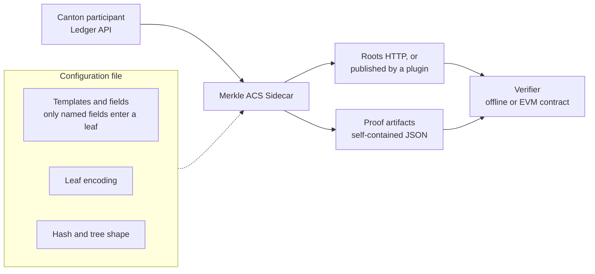
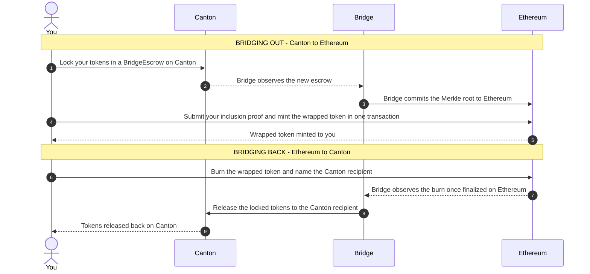

# Contract-Agnostic Merkle Attestation Sidecar for Canton

| Field | Value |
| :---- | :---- |
| Organization | o1Labs |
| Author / Primary Contact | Ilya Ostrovskiy, Yamila Maio |
| Status | Submitted |
| Created | 2026-09-18 |
| Proposal Type | RFP-aligned |
| RFP / Roadmap Area: | Financial Markets Standards Verification |
| Champion | Charles Desmonty |
| Total Funding Request | 10,231,000 CC |
| Project Duration | 18 months |
| Label | defi-liquidity financial-workflows-composability |
| Website | https://o1labs.org |

---

# Abstract

This proposal funds a general attestation primitive for Canton: the Merkle ACS Sidecar, an autonomous, per-participant service that any Canton participant can adopt to make provable, selectively disclosed claims about its ledger state to external systems. 

The sidecar streams a participant’s ACS from the Canton Ledger API and maintains Merkle commitments over it under a declarative configuration. In the configuration, the operator names Daml templates and, within each template, the specific fields that enter the commitment. The operator thus chooses which contract fields are selectively disclosed in the Merkle tree. The sidecar then publishes Merkle roots to an external verifier of their choosing (in this proposal, an Ethereum oracle), and anyone holding an inclusion path can independently verify that a specific Canton contract (such as an escrow or a holding) was part of a participant’s ledger state at a point in time, without being handed the full ACS or other access to the participant’s ledger.  The sidecar will also enable non-inclusion proofs, unlocking a wide range of use cases including completeness testing by auditors, collateral checks by non-counterparty lenders, sanctions and exposure screening.

To demonstrate the primitive end-to-end, the proposal also delivers a round-trip Canton↔EVM bridge PoC for Canton native assets, built as a plugin on the same interface available to every other adopter.

Today, a builder that needs to prove Canton ledger state to an external system must design a bespoke attestation system from scratch: no standard commitment scheme, no non-repudiation mechanism, and no reusable verification interface exists in the Canton ecosystem today. This proposal supplies that missing piece: a canonical commitment and verification pattern that adopters configure rather than build. 

Further use cases, such as verification by a non-counterparty, collateral encumbrance and anti-double-pledging, proof-of-reserves, compliance attestation and reporting, become reachable with minimal integration effort, and selected extensions are previewed as candidates for a second phase of work. As a result, a new builder’s first encounter with external verifiability on Canton becomes an extensively documented configuration file rather than a mid-build discovery that no standard mechanism exists.

This proposal responds to RFP \#11 (Public Verifiability) of the Foundation's 2026-2028 Strategic Roadmap, with standardized attestation tooling on infrastructure any participant can run. The same primitive is also a node-local, privacy-preserving indexer of the kind RFP \#20 (Indexers) describes, and a reusable settlement component of the kind RFP \#13 (Payments and DeFi) funds. The fit with each is detailed under Architectural Alignment.

# Specification

## 1\. Objective

### Primary deliverable: the attestation primitive

Build a contract-agnostic Merkle ACS Sidecar: a general attestation primitive for Canton state that maintains Merkle trees over a slice of the ACS. An operator declares, in a configuration file, a view of their ACS worth committing to, adhering to the principle of selective disclosure. The sidecar then constructs and maintains that tree as the ledger moves, and serves roots and inclusion proofs over HTTP. Proofs are packaged as self-contained artifacts. These artifacts are then verifiable externally using the included verification infrastructure. A plugin system further enables automatically committing roots to external systems as needed without requiring modification of the sidecar itself. An entity checking a proof simply needs to hold the artifact and a published root, needing nothing more from either Canton or the operator.

### Canonical proof-of-concept: the Canton↔EVM bridge

To demonstrate the primitive under real conditions and show design and architectural patterns, this proposal builds a bidirectional Canton ↔ Ethereum bridge PoC for Canton-issued assets as the sidecar's first consumer. A bridge is the hardest test available: real value moves against the commitments, every root the bridge posts becomes a permanent public record on Ethereum, and any mismatch between the published tree and ledger state carries financial consequences. A primitive that carries a bridge also carries proof-of-reserves and compliance attestation as configuration.

### Roadmap

The primitive grows along one axis across the later milestones: commitment expressiveness. Milestone 3 adds keyed commitments that prove the absence of a contract as verifiably as its presence (spent escrows, empty holdings). As the grammar gets richer, more attestation use cases become declarative configuration rather than specialized engineering.

Work beyond that (composed commitments, incrementally maintained views over the ACS, multi-party quorum signing, a zero-knowledge-friendly tree variant) **is not included in this proposal and is not funded here.** It is set out under Follow-on work, in the Rationale section, as candidate follow-up proposals pending community interest.

## 2\. Implementation Mechanics

### The attestation primitive

The sidecar sits beside a Canton participant and reads, through the Ledger API, that participant's view of the ACS. From this stream, it maintains the commitments its configuration declares. Each commitment is a Merkle tree over a selected slice of ledger state: the configuration names the templates and fields, the encoding that turns a contract into a leaf, the hash function, and the tree shape. As contracts are created and archived, the tree follows, and the root at any moment is a succinct fingerprint of that entire slice.

Consumers touch a commitment in two ways:

1. Reading Merkle roots, either over the included HTTP API or wherever a plugin publishes them (for example, the bridge's plugin posts roots to an Ethereum oracle contract)  
2. They request proofs: a proof artifact is a self-contained JSON document carrying the committed field values, the sibling hashes, and the metadata a verifier needs to confirm that one specific contract belongs to the committed set. Only fields that are specified in the configuration of the sidecar to be indexed are committed into a proof artifact. Verification runs against the artifact and a trusted root, offline or on-chain, with the on-chain path built from OpenZeppelin's standard `MerkleProof` library plus leaf-reconstruction glue the integrator writes for their own contract.

**Plugins.** The sidecar core does exactly one job: maintain the configured Merkle commitments over the ACS and serve roots and proofs. Everything beyond that \- publishing roots to an external chain, triggering downstream workflows on ledger events, custom monitoring \- is implemented as a plugin: a module that hooks into the sidecar’s ACS-sync lifecycle (contract added or archived, tree updated, root rotated) and its tree-storage operations, through a stable, documented interface. Plugins let integrators extend the sidecar without forking it. The bridge in this proposal is itself delivered as a plugin \- it posts roots to the Ethereum oracle contract and reacts to burn events \- and disabling it leaves the attestation service serving roots and proofs unchanged, which is an explicit Milestone 2 acceptance criterion. Milestone 1 ships the plugin interface with two worked examples: a lifecycle-event logger and a periodic EVM root-oracle publisher.

A critical design decision behind the whole commitment scheme: the operator commits once, and every interested party proves and verifies their own claim against that commitment. The operator's workload is one root per update (or periodic batch of updates) regardless of how many parties are proving things. The roots themselves accumulate into an audit trail, since a published root that misrepresents the ledger is durable evidence of misbehavior.   

### The bridge PoC, as first consumer

The bridge PoC operates as two one-way flows, with the outbound flow anchored on a Merkle commitment rather than a live cross-chain call.

On the outbound leg, a user deposits an asset on Canton into a treasury and becomes a party to a BridgeEscrow contract. The bridge accumulates the committed escrow contracts into a Merkle tree and writes only the root of that tree to the Ethereum oracle contract. The user requests an inclusion proof from the operator, then submits that proof against the posted root to claim their wrapped asset. With the commit-once, prove-independently property: many concurrent transfers ride on one root, and every root the operator ever posted sits as a permanent, timestamped record on Ethereum.

The inbound leg (Ethereum back to Canton) runs the same idea in the other direction: the bridge observes a burn event on Ethereum and executes it as a release on Canton.

Both legs share the same anti-replay design: a spent-escrow registry on the ETH side rejects a proof that has already been used to mint a synthetic, and Canton's contract lifecycle (archiving the BridgeEscrow on release) prevents the same lock from being claimed twice. Operationally, the bridge runs as a small set of long-lived services: a sidecar process per participant that reads the Canton Ledger API and writes Merkle roots to Ethereum, and a set of Solidity contracts whose logic is limited to signature and proof verification, minting, and the replay registry. The design requires no changes to Canton's core protocol, the Daml SDK, or Ethereum client software; it is additive infrastructure at the boundary between the two networks, deployable to any EVM-compatible network.

### Components

| Component | Role |
| :---- | :---- |
| Merkle ACS Sidecar and Proof Packaging Layer | A TypeScript process that streams the ACS via the Canton Ledger API and maintains one or more Merkle trees defined by declarative configuration: indexed templates and field mappings, leaf-encoding schemes (EVM ABI encoding among them), hash functions (keccak256 among them), and tree constructions (an OpenZeppelin-compatible binary Merkle tree among them). Produces self-contained JSON proof artifacts that are independently verifiable against the root oracle contract ABI without running Canton, and serves roots and inclusion proofs over HTTP. Consumers that rely on the lifecycle of indexed contracts can attach as plugins; a reference configuration reproduces the bridge's escrow commitment. |
| Sparse Merkle Tree (keyed commitments) | A tree construction, selected per commitment in configuration, that addresses each leaf by a key: a contract ID, or a composite such as (owner, asset), so a consumer requests a proof using an identifier they already hold. Alongside inclusion proofs, it produces non-membership proofs, a verifiable statement that a key is absent from the committed set (a spent escrow, an empty holding). Its root is a pure function of the committed key→value map, so an independent party rebuilding from a ledger snapshot reaches the operator's published root in any insertion order. Ships with a Solidity verifier alongside the offline reference verifier. |
| Bridge plugin (EVM integration) | The bridge's operational logic, running as a plugin on the sidecar: commits roots to the EVM oracle, and tracks mint and burn events on Ethereum to synchronize the state of escrows on Canton. Disabling it leaves the sidecar serving attestations unchanged. |
| `BridgeEscrow` Daml contracts | Daml contract logic that locks a CIP-56/-112 asset in a treasury for bridging and creates a contract in the ACS, which the sidecar indexes and commits. |
| EVM Bridge Contracts (Solidity) | A set of Solidity contracts which: model a permissioned Merkle root oracle; verify Merkle inclusion paths for escrow leaves against committed roots; mint wrapped assets when supplied a valid proof, rejecting replays via a spent-escrow registry; and allow burning wrapped assets to release the native assets back on Canton. |
| UI | A set of web UI that uses the Canton and EVM SDKs to demonstrate the relevant end-to-end flows over the worked examples. |
| LocalNet Stack (Dockerized) | Canton LocalNet \+ sidecars \+ Anvil \+ bridge contracts, running the end-to-end flow on a fresh machine. |

Each component maps onto a step in the sequences above: the sidecar produces the root, the bridge plugin commits it, the EVM contracts consume it to verify and mint, and the Daml contracts define what "locked" and "released" mean on the Canton side throughout. The operator's control of root commitment is the only off-chain trust surface in this iteration of the technology.

## 3\. Architectural and Roadmap Alignment

- **Strategic Roadmap Alignment:** this proposal responds directly to **RFP \#11 (Public Verifiability)**, which asks for contributions that progress Canton toward public verifiability of key metrics, observing that the market may not trust issuer-published aggregates and that disclosing private transactions defeats confidentiality. The Merkle ACS Sidecar is standardized tooling for that gap: a participant publishes one externally anchored commitment over a declared slice of ledger state, and an outside party (market-data consumer, auditor, smart contract) verifies a specific claim against it (reserves backing an issuance, holdings, absence of encumbrance) without the participant revealing anything it did not choose to disclose. Unlike a bare published aggregate, a committed root binds its publisher. The RFP orders its candidate approaches from issuer aggregate tooling up to zero-knowledge proofs operated by decentralized attestor pools; Milestone 1's proof-of-reserves configuration is the first rung, publishable and verifiable on delivery, and the follow-on roadmap under Rationale ascends toward the trustworthy end. The far end of that spectrum is well-trodden territory for o1Labs: we have built and maintained production zero-knowledge proof systems (Kimchi, Pickles, o1js) since 2017, and the later rungs of this roadmap are that same discipline applied to Canton state.  
- **Payments and DeFi (Strategic Roadmap RFP \#13):** the RFP asks for open-source tooling, reference implementations, and reusable components supporting financial workflows that are private, auditable, and interoperable. With the sidecar, each party reveals only the leaves it chooses to prove (privacy), every published root is a permanent, timestamped record (auditability), and the same proof artifact is verifiable offline or on an external chain (interoperability). Everything ships open source (MIT or Apache-2.0), dockerized, with worked configurations (an escrow commitment, proof-of-reserves over a CIP-56 holding) that another team adapts by editing a configuration file. The bridge PoC is the composability demonstration: Canton-native assets reaching EVM venues over the same interface, with value moving against every published root.  
- **Indexers (Strategic Roadmap RFP \#20):** the sidecar is a node-local indexer, and it answers the RFP's screening questions directly. The data it requires is the party-scoped ACS view its participant already holds through the Ledger API; that data is node-local; nothing in the design depends on Mediator metadata, so the sidecar continues to function if involved-party metadata stops being publicly exposed; and access control is handled by selective disclosure, since a consumer can verify only the leaves it holds proofs for. The longer-term direction (incrementally maintained views over the ACS) extends the same machinery toward verifiable materialized views.  
- **Selective Disclosure:** The holder of a contract decides what becomes public and when, and the configuration decides which fields can ever be published at all (see Objective). In the bridge, a user's position stays private on Canton until they choose to claim on the public chain. From Milestone 3, a party proves absence without revealing anything else about the set.  
- **Developer Experience:** a docker-compose reference implementation and an open-source TypeScript sidecar give every Canton ecosystem team a concrete starting point: the same commitment interface that the bridge and example cases run on, ready to be pointed at their own contracts. A team adapts the sidecar to a new commitment case by editing a configuration file. Documentation includes the configuration reference and a worked non-bridge example (proof-of-reserves over a holding template) alongside the bridge configuration.  
- **Relevant CIPs:** CIP-56 and CIP-112: `BridgeEscrow` supports CIP-56/112 transfer semantics. CIP-0103 (dApp SDK, approved): the demo UI builds on the existing dApp SDK, exercising the same interaction patterns. 

## 4\. Backward Compatibility

No backward compatibility impact. The sidecar is a new, additive service that consumes existing Canton APIs without modifying any Canton protocol or Daml package dependencies.

---

# Milestones and Deliverables

## Milestone 1: Configurable Attestation Sidecar for the Canton ACS

| Estimated Delivery | 3 months from grant approval |
| :---- | :---- |
| **Target Environment** | Canton LocalNet \+ Anvil (EVM localnet) |
| **Focus** | Any Daml template becomes a cryptographic commitment that a counterparty can verify while holding only the proof. You name the templates and specific fields in a configuration file, and only those fields enter the tree. The service maintains the commitment, serves roots and inclusion proofs over HTTP, and emits proof artifacts that stand on their own. |

**Deliverables:**

* A configuration-driven attestation sidecar for the Canton ACS. A config file declares the Daml templates and contract fields to monitor and commit to a Merkle tree, as well as the leaf encoding, hash function, and tree shape. The sidecar then streams ACS updates and maintains the configured tree.  
* An HTTP interface for consumers: list the configured commitments, read the current root of any of them, and request an inclusion proof for a committed contract.  
* Portable proof artifacts. A proof is a self-contained JSON document, and a counterparty verifies it off-chain against the document along with a known root. For on-chain use, the artifact proof carries the field values and sibling hashes a Solidity contract needs to reconstruct the committed leaf and check it with OpenZeppelin's standard `MerkleProof` library, so an EVM integrator can write the glue for their own contract without touching implementation details of the commitment.  
* Support for multiple independent commitments in a single deployment of the sidecar. A single ledger connection backs multiple commitments over different templates, each with its own root, proofs, and lifecycle.  
* Two worked example configurations running side by side on a single deployment, showing the range of the grammar: an escrow-style commitment over a locked-asset template, and proof-of-reserves over a CIP-56 holding template.  
* A plugin interface that allows developers to extend the behavior of the sidecar by hooking into the ACS sync lifecycle and tree storage operations, along with two example plugins demonstrating the interface and its functionality by: 1\) logging lifecycle events, and 2\) periodically posting configured tree roots to a simple EVM root oracle contract.  
* Thorough documentation around the architecture, configuration, operation, and extension of the sidecar, and instructions for a developer to deploy and experiment with the stack locally.  
* Public GitHub repository under an open-source license (MIT or Apache-2.0) with CI passing and containerizing the sidecar, containing all of the above deliverables.  
   

**Acceptance Criteria:**

* The service indexes and commits a Daml template through configuration alone, with no code changes, and an inclusion proof for that template verifies against the corresponding root.  
* Two commitments over two different templates run in one process. A proof from each verifies against its own root and fails against the other's.  
* A proof artifact verifies in a standalone reference verifier running offline, using the artifact alone.  
* An invalid configuration is rejected at startup with a diagnostic naming the offending path, covered by the validation test suite.  
* Leaf encoding stays byte-stable across releases, enforced in CI by frozen conformance vectors.  
* Integration tests pass against a Canton+Anvil LocalNet participant demonstrating the above acceptance criteria

## Milestone 2: Round-trip Canton↔EVM Bridge

| Estimated Delivery | 1.5 months after Milestone 1 delivery (4.5 months after grant approval) |
| :---- | :---- |
| **Target Environment** | Canton LocalNet \+ Anvil (EVM localnet) |
| **Focus** | An adoptable round-trip bridge built on the M1 service as its first consumer: (1) lock on Canton, (2) generate the proof, (3) mint on EVM, (4) burn or lock on EVM, (5) proof, (6) unlock on Canton, with a working web UI covering both directions. |

**Deliverables:**

* A full worked example of a custodial bridge at PoC level allowing users to bridge a Canton-native asset to a synthetic/wrapped equivalent on an EVM chain, and bridge the synthetic back to Canton.  
* Canton → EVM path: Daml contracts lock a CIP-112 asset in a treasury and record the escrow in the ACS; Solidity contracts model a permissioned root oracle, verify the inclusion proof for that escrow against a committed root, mint the wrapped asset, and reject replays through a spent-escrow registry.  
* EVM → Canton path: burning or locking the wrapped asset on EVM releases the original asset to its Canton owner, with cancellation of unclaimed Canton escrows handled on the EVM side so the two chains cannot both spend one escrow. A finality delay for both operations mitigates double-spend/double-claim attacks.  
* A plugin for the sidecar plus a reference configuration over the M1 service which updates the EVM root oracle and triggers releases from the treasury when bridging the return path. Turning the plugin off leaves the attestation service serving roots and proofs unchanged.  
* A web UI using the Canton and EVM SDKs that demonstrates the end-to-end flow in both directions, and a dockerized LocalNet stack that runs the full end-to-end flow.  
* Documentation covering the architecture, the double-spend and double-claim attack surface with its mitigations, and instructions for a developer to deploy and experiment with the stack locally.

**Acceptance Criteria:**

* A round-trip flow for a CIP-112 asset completes end-to-end from Docker, against a Canton+Anvil LocalNet, with the asset correctly returned to its original Canton owner.  
* Proof artifact JSON is self-contained and independently verifiable on ETH without further operator involvement.  
* Double-spend or double-claim attacks identified and listed in the delivered documentation are demonstrated to be rejected.  
* Daml and Solidity tests pass in CI; integration tests pass against a real Canton LocalNet participant.  
* All relevant Daml/Solidity contract sources and plugin sources are published to the public repository. The UI and bridging end-to-end flow is reproducible locally.  
* Disabling the bridge leaves the attestation service serving roots and proofs with no change in behavior.

## Milestone 3: Proving Absence and Addressed Lookups

| Estimated Delivery | 2 months after delivery of Milestone 2 (6.5 months after grant approval) |
| :---- | :---- |
| **Target Environment** | Canton LocalNet \+ Anvil (EVM localnet) |
| **Focus** | M1 and M2 proved that a contract sits in the ACS. This milestone proves the absence of one: an escrow has already been spent, a party holds zero of an asset, a named counterparty appears nowhere in a committed set. Consumers also gain address lookups, asking for a proof by contract ID or by an (owner, asset) pair they already hold. |

**Deliverables:**

* Support keyed commitments into a Sparse Merkle Tree as a configuration choice, allowing a consumer to ask for a proof using an identifier they already have, such as a contract ID or by a composite key such as (owner, asset).  
* Non-membership proofs: a verifiable statement that a given key is absent from a committed set, with an on-chain verifier so the negative claim settles on EVM the same way a positive one does.  
* Reproducible roots. Rebuilding a commitment from a ledger snapshot yields the same root whatever order the contracts arrived in, so an independent sidecar replaying the same view of the ACS reaches the operator's published root.  
* Documentation and reference configurations for the two use cases that motivate this: a spent-escrow set queried for non-membership, and proof-of-reserves addressed by (owner, asset). Documentation states what a non-membership proof does and does not assert.  
* A web UI demonstrating the worked example against a Canton+Anvil LocalNet, reproducible locally.

**Acceptance Criteria:**

* A non-membership proof for a spent escrow verifies on-chain against the committed root.  
* A lookup by (owner, asset) returns an inclusion proof that verifies against both the standalone verifier and the on-chain verifier.  
* A configuration whose key is not unique per contract is rejected at validation, and a duplicate key at runtime halts with a diagnostic naming the key.  
* Conformance vectors for keyed commitments pass in CI.

## Milestone 4: Maintenance Post-Release

| Estimated Delivery | Runs from Milestone 1 completion; up to 12 months |
| :---- | :---- |
| **Focus** | Bug fixes, compatibility with evolving Canton SDK/APIs and CIP-56/-112 semantics, versioned interfaces for downstream adopters, and responsive community support. |

**Deliverables:**

* **Ongoing maintenance:** o1Labs will keep the sidecar and the dockerized LocalNet stack building and passing CI against current Canton SDK and Ledger API releases, and against CIP-56/-112 token semantics as they evolve, for at least 12 months following Milestone 1 completion.  
* **Interface stability for downstream adopters:** the commitment format and the proof artifact schema are versioned, so teams that build their own attestation use cases on the primitive are not broken by later changes. Breaking changes ship as a new version with a documented migration path. The repo \+ plugins will be maintained as Canton SDK/APIs evolve with a versioning policy, clearly stating what Canton version is compatible with what primitive version.  
* **Community support and issue resolution:** o1Labs will monitor and respond to community questions in the project’s GitHub Issues and discussions and in the designated Canton community channel, with a target first response of 5 business days. Security reports are handled on an expedited, severity-tiered basis: critical patches within 7 days of disclosure and high-severity patches within 30 days. 

Routine maintenance under this milestone is scoped at approximately 5 engineering days per month; new feature development, roadmap work, and API surface changes are out of scope and would be proposed separately.

## Milestone 5: Community Adoption and Stewardship

| Estimated Delivery | Runs from Milestone 3 completion; up to 12 months |
| :---- | :---- |
| **Focus** | Demonstrated adoption of the attestation primitive by teams other than o1Labs, supported by structured outreach, integration support, and worked references |

**Deliverables (base):**

* One public online workshop segment coordinated with the Canton Foundation.  
* Technical blog posts covering the primitive’s architecture, a worked non-bridge integration, and the bridge PoC walkthrough.  
* A public adoption log: external teams engaged, outcomes, and integration status.

**Per-adoption payments (variable):**  
A qualifying adoption event is any of the following, verified by the Tech & Ops Committee:

* An external team runs the sidecar against their own Daml templates via configuration and confirms in writing that their attestation use case is expressible in it.  
* An external team documents a claim that the PoC bridge implementation served as a useful starting point for their Canton application.  
* An external team documents a claim they can express with non-membership proofs that they could not express against a flat commitment, running against Milestone 3 deliverables.

Each qualifying adoption event releases 125,000 CC, up to a maximum of six events (750,000 CC variable total), with a maximum of one qualifying event per external organization.

**Ecosystem Collaboration.** Successful completion of this milestone depends in part on collaboration with the Canton Foundation and ecosystem partners for introductions to member companies. o1Labs leads all technical onboarding, documentation, and integration support; Foundation involvement is limited to facilitating initial engagement.

**Acceptance Criteria:**

* Base deliverables completed and published.  
* Each per-adoption payment released only upon Committee verification of the qualifying event.

## Overall Acceptance Criteria

The Tech & Ops Committee will evaluate completion based on:

- Deliverables were completed as specified for each milestone.  
- Demonstrated functionality via live demo or recorded walkthrough of all worked examples included as milestone deliverables.  
- Documentation and developer onboarding materials have been published.  
- Adoption evidence: named external teams engaged and documented.

**Project-specific conditions:** all code released as open source (MIT or Apache-2.0) for each milestone delivered.

# Funding

**Total Funding Request: up to 10,231,000 CC** 

## Payment Breakdown by Milestone

| Milestone | Description | Amount | Payment Trigger | Time |
| :---- | :---- | :---- | :---- | :---- |
| **M1** | Configurable Attestation Sidecar | 2,640,000 CC | Committee acceptance of M1 deliverables | 3 months from approval  |
| **M2** | Round-trip Canton↔EVM Bridge (canonical PoC) | 1,290,000 CC | Committee acceptance of M2 deliverables | 1.5 months after M1 |
| **M3** | Proving Absence and Addressed Lookups | 2,210,000 CC | Committee acceptance of M3 deliverables | 2 months after M2 |
| **M4** | Maintenance and Support  | 3,130,000 CC | Paid against quarterly maintenance reports | 12 months from delivery of M1  |
| **M5** | Community Adoption and Stewardship | 145,000 CC base \+ 136,000 CC per adoption up to a total of 816,000 CC | Based on acceptance of deliverables; variable per verified adoption event | 12 months from delivery of M3  |

## Volatility Stipulation

The grant is denominated in fixed Canton Coin. Per the standard template clause, remaining milestone amounts are re-evaluated at the 6-month mark, with successive reevaluations every quarter matching Milestone 4’s disbursements, rebased at these review points at the then-current CC/USD rate. Milestone 5 per-adoption payments remain fixed at 125,000 CC per verified event between review points; any adjustment to the per-event amount applies only to events verified after the review. Re-evaluations adjust undisbursed amounts only; payments already made are not revisited.

# Co-Marketing

Upon release of the LocalNet dockerized environment and documentation, o1Labs will collaborate with the Canton Foundation on:

- Coordinated announcements highlighting the attestation primitive as shared developer tooling for the ecosystem.    
- A technical blog post explaining how the primitive and sidecar benefit the ecosystem with a standardized approach to attestation typical of distributed ledger applications.  
- Participation in workshops, office hours, or webinars showcasing the attestation primitive for a period of one month following the announcement.

# Motivation

## The Missing Link

Canton’s accountability model is receipt-based: participants who share a contract exchange signed ACS commitments and can resolve disputes because they hold matching signatures. This works entirely inside Canton. It breaks down when an entity outside the network (such as a smart contract on another chain, an auditor, or a downstream compliance system) needs to reason about Canton state. That party isn’t collecting signed receipts; it receives a claim (i.e. “this participant says so”). Whether that assertion matches the actual ledger state rests entirely on trust in the participant, not on cryptographic evidence. By externally anchoring the claims, the participant is disciplined: one timestamped root binds every subsequent claim, verifiable by anyone without the participant’s cooperation, and any misrepresentation becomes permanent, non-repudiable evidence rather than a deniable statement.

Canton’s existing commitment scheme cannot serve this purpose. Three core properties of ACS commitments arising from their distinct use-case lead to this disconnect:

1. They are pairwise. Commitments are exchanged only between participants who share active contracts \- “two participant nodes that have no shared active contracts do not exchange commitments.” Anyone outside the commitment graph *cannot, by construction,* verify anything.  
2. They are not externally anchored. Commitments live inside bilateral reconciliation; there is no canonical, public root a third party can independently check a claim against.  
3. They prove bilateral agreement, not inclusion nor absence. A matching commitment tells two counterparties their shared view agrees. It does not let an arbitrary querier verify that a specific contract is in a participant’s state, and it has no mechanism at all for verifying that something is not there.  
   

Proving a negative about Canton state (such as demonstrating an account carries no encumbrance, a party holds no position in a restricted instrument, a settlement obligation has been fully discharged rather than partially netted) is today both computationally expensive and privacy-exposing. Per Canton’s [pruning documentation](https://docs.canton.network/overview/reference/pruning#limitations):  
 *“If a participant node wants to prove that there are no active contracts for a particular stakeholder group in a shared state, then it has to open all the stakeholder group hashes to prove that none of the sets contains a contract of the given stakeholder group. We plan to remove this limitation in the future.”*

Negative attestation is the harder half of the attestation problem, and it is where much of the practical value sits: completeness testing by auditors (“this participant holds no positions other than those disclosed”), collateral checks by non-counterparty lenders (“this asset is not already pledged”), sanctions and exposure screening (“this party has no active contracts of kind X”). No mechanism on Canton offers this today. While the protocol maintainers have committed to removing the limitation in the future, concrete plans for it are unknown. Additionally, nothing would mitigate the mismatch between bilateral and public commitments. This proposal delivers non-inclusion proofs at the application level now (Milestone 3), on infrastructure any participant can run, without waiting for (or precluding) a protocol-level fix.

## Why a Merkle Commitment

There is currently no standard mechanism for a Canton participant to make a selective, independently verifiable disclosure about a single piece of state. Every team that needs either one today must build a bespoke attestation system from scratch, with no standard commitment scheme, no non-repudiation, and no reusable verification interface.

Merkle tree commitments introduce provenance and non-repudiation that allow external parties to verify the continuous honest operation of the participants making them. Merkle commitments enable fraud- and fault-proof mechanisms that are otherwise not possible with existing Canton tooling

What it does improve, concretely, relative to ad hoc claim-based attestation:

- **Single root binds multiple attested facts.** The operator signs a Merkle root once, enabling a verifier to check inclusion and exclusion proofs for an arbitrary number of Daml contract instances. A compromised or dishonest operator can forge a root, but cannot alter already-committed escrows without introducing a detectable fault. Since every posted root is a public, timestamped commitment, equivocation is detectable after the fact, which is not true of an unstructured "the participant says X" attestation.  
- **Selective disclosure amenable to Canton's own paradigm.** A Merkle root by itself reveals no information. Per the Daml ledger model, a participant committing Merkle roots must be party to any contracts that are used to derive those roots. A holder of a proof can selectively reveal their entries in the Merkle tree along with the path to a verifier (and importantly, cannot reveal information about *other* parties with their proof artifact). Thus, the selective disclosure property remains preserved.  
- **One reusable, auditable interface instead of N bespoke ones.** Today, every Canton team that needs external verifiability reinvents its own attestation scheme. This proposal gives the ecosystem a single, open-source, independently auditable commitment scheme that any team can build on. 

## Who Benefits

1. **External verifiers of Canton state**. Regulators, auditors, prospective counterparties. Canton’s ACS commitments are pairwise, so anyone outside the commitment graph can verify nothing about a participant’s ledger. This primitive serves exactly that excluded class: an auditor performing completeness testing against a participant’s disclosed positions, a regulator verifying a specific claim without observer rights, a prospective lender or trading counterparty performing due diligence where, by definition, no contract exists yet between the parties.  
2. **Canton participants who need to prove a negative.** Absence proofs – statements such as “there is no encumbrance on this collateral”, “no position in this restricted instrument”, “no active contracts with this counterparty”, “this obligation has no undischarged legs” – have no mechanism on Canton today, at any layer. Milestone 3 delivers them as a configuration option on the same sidecar.  
3. **Bridge and interoperability protocols** can integrate Canton against a well-defined interface \- a signed root and an inclusion path \- instead of building bespoke Canton attestation logic from scratch.  
4. **Canton node operators.** Every posted root is a permanent, timestamped, externally anchored reference point that neither party to a dispute controls \- which may serve as useful evidence in reconciliation breaks. Where today’s mismatch tooling is manual, the commitment machinery introduced here may be useful for automated reconciliation conflict resolution.

## Expected Adoption

**Adoption of the primitive** (Milestones 1 and 3\)**:** any Canton participant already running a participant node can adopt the sidecar by writing a configuration file and deploying it as a container adjacent to their existing infrastructure. Adoption will be pursued during Milestone 5, with prospects developed in collaboration with our champion and the introductions facilitated by the Foundation and ecosystem partners:

* **Cross-ledger and cross-protocol verification.** External protocols that need verified Canton state \- for example, Ethereum-based lending protocols evaluating Canton-held positions \- a demand shape our champion independently identified. As tokenized assets increasingly move across Canton, public EVM venues, and other settlement networks, the number of cross-ledger claims requiring verification rises mechanically, and cross-ledger verification is precisely what party-scoped privacy makes structurally hard today.  
* **Audit and reconciliation.** Firms operating multi-ledger reconciliation products that today cannot see into Canton’s privacy model, and audit teams for whom a signed ACS root provides a tamper-evident completeness anchor over the on-ledger population.  
* **Non-observer data distribution**. Attestation-verified state lets data distributors reach consumers who will never be granted observer or read rights on the underlying network \- extending, rather than competing with, existing Canton data-distribution businesses.

**Adoption of the included example applications** (Milestones 1, 2, and 3\)**:** Both incumbent ecosystem participants and prospective builders will be able to use the supplied worked examples as a foundation for their desired applications. These examples are intended to serve as pedagogical documentation as well as validation of the primitive’s implementation, and adoption is measured by verified events.

## Why Now

Canton is experiencing rapid institutional adoption, and every step of that growth multiplies the parties outside the network who need to reason about the state inside it. Tokenized assets increasingly span Canton, public venues, and other settlement networks; auditors, regulators, and prospective counterparties of Canton participants are growing in number faster than any of them can be granted observer rights. The volume of claims about Canton state that must be verified from outside the network increases with adoption \- and the mechanism for verifying them does not yet exist. Recent collateral failures in traditional finance, where the same asset was pledged to multiple lenders, and no single entity’s audit could see it until it was too late, illustrate exactly the class of cross-boundary claim (inclusion and absence alike) that institutional adoption will demand of Canton.

The substrate for a general-purpose answer only recently became available. CIP-56 and CIP-112 have standardized token and holding semantics, which is what makes a contract-agnostic, configuration-driven commitment scheme practical: stable, well-known template shapes to commit to, instead of per-team bespoke encodings. Two years ago this primitive would have required inventing conventions; today it can be configuration over standards.

There is also a closing window. Every bespoke system shipped before a standard exists is fragmentation the ecosystem will pay to undo later, and the number of deployed workarounds is still small. Canton’s own documentation, meanwhile, concedes the absence-proof limitation and commits to removing it “in the future,” with no design or date; an application-level implementation running with real adopters is both the immediate remedy and the strongest input a future protocol-level design could ask for.

The proposal arrives at the opening of the 2026–2027 funding window for RFP \#11, whose fit is detailed under Architectural Alignment. A verification primitive any Canton participant can adopt for its own attestation needs is a common good "used by multiple participants," rather than a private integration for a single team, and the kind of reusable infrastructure the Fund exists to seed. This primitive's additional alignment with RFP \#20 (Indexers) and RFP \#13 (Payments and DeFi) is a byproduct of analyzing the Canton ecosystem’s needs during the design phase.

## Ecosystem Positioning

The attestation primitive occupies a niche that is currently empty \- general-purpose, on-demand, third-party-verifiable attestation of arbitrary Canton participant state. The Foundation's 2026–2028 roadmap now names that niche: RFP \#11 asks for proposals that progress Canton toward public verifiability and, unlike its neighbors on the roadmap, lists no prior grants. 

The bridge, its first consumer, deliberately enters a crowded field as evidence of the primitive working, not as a bid to win the bridge race. In detail:

### Complementary work: T-RIZE and Chainlink’s on-Canton anchoring

In June 2026, T-RIZE and Chainlink deployed a Merkle-anchored proof-of-insurance registry on Canton \- an off-chain registry fingerprinted into a Merkle tree, anchored on Canton, with proofs distributed to authorized participants. That system and this proposal run in opposite directions: T-RIZE anchors external state onto Canton; this primitive commits Canton’s own ledger state and publishes it for external verification. The two are complements \- evidence that Merkle-anchored attestation patterns are already earning production adoption in this ecosystem \- not substitutes.

## Why o1Labs?

o1Labs was founded in San Francisco in 2017 and has been building, maintaining, documenting, and supporting production-grade cryptographic infrastructure ever since. Among our achievements, we are the creators and technical stewards of [Mina Protocol](https://minaprotocol.com/): the first succinct blockchain, secured by recursive zero-knowledge proofs, live on mainnet since March 2021 with no chain halts and no security incidents. As of 2025, o1Labs leads Mina’s protocol engineering, infrastructure, grants, and ecosystem programs end to end. o1Labs has also performed work unrelated to Mina, including an MCP/AI project spun out last year, [Project Ensue.](https://ensue-network.ai/)

The specific competencies this proposal calls for are the ones we exercise daily, in production, in the open:

* **Merkle commitments as core infrastructure.** Mina’s ledger state is a Merkle tree whose membership is proved rather than transmitted \- every Mina block producer and light client depends on exactly the commit-once, prove-independently pattern this proposal brings to Canton’s ACS.  
* **Proof systems shipped and maintained in production**. We built and maintain [Kimchi](https://github.com/o1-labs/proof-systems), a general-purpose PLONK-based proof system, and Pickles, its recursion layer \- one of the first systems to deliver incrementally verifiable computation (IVC) in a production network. The long-horizon roadmap of this proposal (incrementally maintained views over the ACS) is a direct application of the IVC discipline we already practice.  
* **Developer-facing TypeScript tooling at ecosystem scale**. [o1js](https://github.com/o1-labs/o1js) is our TypeScript zero-knowledge framework, distributed via npm and used across the Mina ecosystem. The Merkle ACS Sidecar in this proposal is a TypeScript service \- building, documenting, versioning, and supporting TS infrastructure for third-party developers is our home ground.  
* **Cross-chain state verification.** Through the [Nori](https://github.com/Nori-zk) ZK state bridge (Ethereum → Mina), we have supported hands-on work on exactly the pattern this proposal describes: reduce state on one network to a compact artifact a third party can verify independently, and settle it on another \- including the EVM-side integration and finality-handling surfaces around it.  
* **Security engineering as a discipline.** Our team includes cryptographers and security engineers whose primary work is proof systems and protocol security, with adversarial review built into how we design and ship, including working alongside external auditors on production systems.

**We are already operating in the Canton ecosystem.** This proposal is not a cold start:

- We have been evaluating Canton hands-on since January 2026 \- the Ledger API, the ACS commitment model, and Daml application development.  
- We have operated a Canton validator node on DevNet, giving us direct operational experience with participant infrastructure.  
- o1Labs was approved to become a member of the Canton Foundation in July 2026, pending agreement signing.   
- We have built a working proof-of-concept dark pool on Canton \- direct experience building privacy-preserving Daml applications against real Canton infrastructure, and the project through which we first hit the external-verifiability gap this proposal addresses.

The next step is converting that internal exploration into open-source, reusable infrastructure for the whole ecosystem.

# Rationale

There is no existing Canton component to extend. The native ACS commitment reconciles two participants who already hold the full contract set; it was not built to prove one contract's membership, or a key's absence, to an outside party. This proposal therefore builds a new primitive.

We considered and rejected two alternatives. Ad hoc per-team attestation is the status quo, and its costs are set out under Motivation. Full light-client or ZK verification of Canton consensus would be the strongest construction, but does not fit this project's scope today \- and nothing in this design precludes it later: the commitment scheme, proof artifacts, and verifier interfaces delivered here are the natural substrate for stronger verification back-ends as follow-on work.

The scope chosen \- a configurable commitment primitive, proven by a PoC bridge, with absence proofs as the first grammar extension \- is what we believe to be the fundable middle ground: novel where Canton has a documented gap, with a PoC of a high-stakes application as a proving ground. The end-game value is that a Canton participant can interact with public chains and external verifiers while preserving selective disclosure of its ledger state right up to the moment it chooses to reveal a specific claim \- a property no attestation design offers today.

## Risks and Limits

1. The trust class at Milestone 2 is a single root poster, and even the end-game quorum is m-of-n. Merkle commitments improve auditability and make equivocation permanently detectable \- every posted root is a timestamped public record \- but they do not eliminate a colluding quorum’s ability to forge a root. This proposal does not market itself as trust-free. What it changes is that misbehavior leaves durable, independently verifiable evidence, which no ad hoc “the committee attests X” scheme provides. Quorum expansion is explicit follow-on work.  
2. Proof verification is itself a live failure class. In 2026 alone, Verus (\~$11.6M, May) and Syscoin (\~$10M, June) lost funds to Merkle-proof handling flaws \- not quorum compromise. We treat this as a design constraint: the on-chain verifier in Milestone 1 is scoped to signature verification, proof verification against OpenZeppelin’s standard MerkleProof library, minting, and the replay registry \- no business logic \- and leaf-encoding conformance vectors are frozen in CI from Milestone 1 onward.  
3. Future developments may address non-inclusion at the protocol level. Canton’s documentation says the pruning-related limitation “will be removed in the future,” without a design or date. If and when a protocol-native mechanism ships, it would supersede part of Milestone 3’s value. We accept this risk deliberately: an application-level Sparse Merkle Tree delivers the capability to the ecosystem now, the sidecar’s remaining scope (external anchoring, arbitrary-party verification, configurable commitments) is unaffected, and a working open-source implementation with production usage is the strongest possible input to any future protocol-level design. For the medium-term horizon, the Foundation's 2026–2028 roadmap schedules no protocol-level work on absence proofs across its twenty-eight RFP areas, and consequently this proposal does not appear to overlap with any planned work.  
4. Published proofs need verifiers who actually check them. The documented failure mode of attestation systems is not cryptographic \- it is that proofs get published and nobody verifies. This is why Milestone 5 is structured around named adopters and committee-verified adoption events rather than publication counts, and why every reference configuration ships with a standalone verifier a counterparty can run without touching Canton.

## Follow-on work

Once this work has shipped and demonstrated adoption, we see the following as concrete follow-on proposals, in rough dependency order:

* Multi-party / expanded quorum. Removes the single-operator trust assumption the MVP accepts, replacing it with an m-of-n signer set so no single party can unilaterally forge a committed root \- with each quorum attestation bound to one auditable Merkle commitment, keeping equivocation detectable after the fact.  
* Indexed Merkle Tree variant. Compact non-membership paths, optimized for cheaper operations, but higher tree update complexity. Suited to zero-knowledge consumers, taken up when a ZK-adjacent consumer materializes; a drop-in alternative tree shape under the same configuration grammar as Milestone 3’s Sparse Merkle Tree.  
* Composed commitments (“tree of trees”). Per-entity roots with drill-down proofs to any single contract, aggregate and bucketed claims over a population \- including negative threshold claims such as “no party holds more than X” \- and a forest root committing every configured commitment in a single on-chain post.  
* Incrementally maintained views. Computed aggregates, filters, and joins over the ACS maintained incrementally as the ledger moves \- generalizing the sidecar from committed sets toward verifiable materialized views.  
* Decentralization via a P2P network for distributing proofs and commitments from the sidecar (peer discovery resilience, network-level DoS mitigation)  
* A protocol-level conversation about native non-inclusion. Canton’s documentation commits to removing the limitation that makes absence proofs prohibitive; a production application-level implementation, with real adopters, is the strongest input we could offer to a future Standards-Track discussion. This track is optional and independent \- nothing in this grant depends on it.
